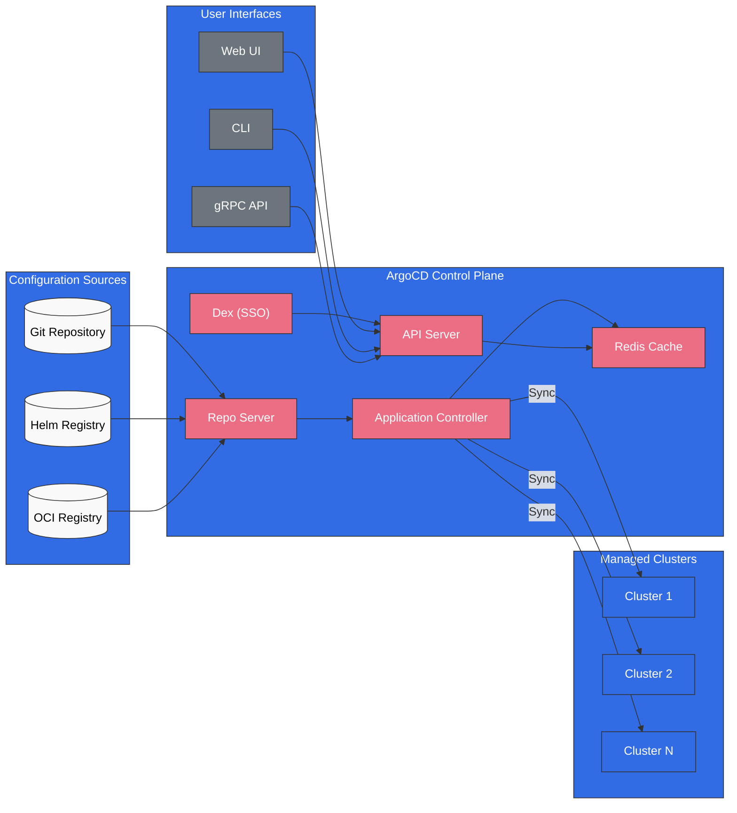
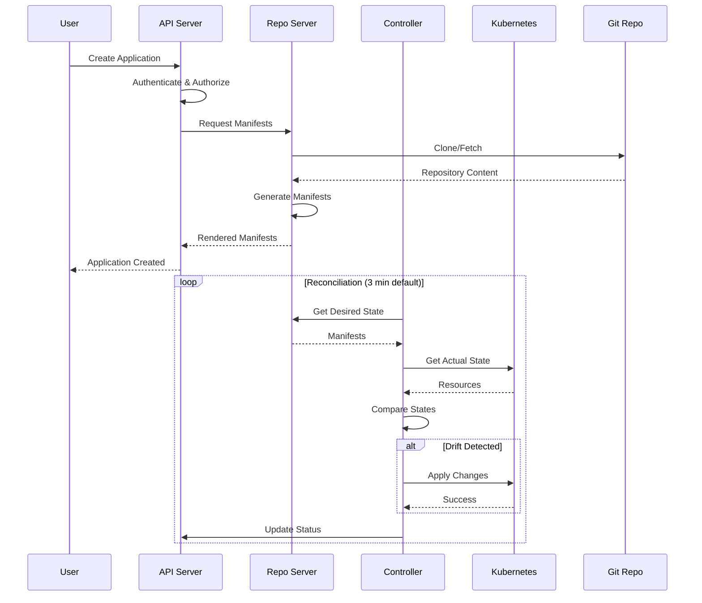

# ArgoCD

> **Versiones compatibles**: ArgoCD v2.9+, Argo Rollouts v1.6+
> **Última actualización**: July 11, 2026

## Tabla de contenido
- [¿Qué es ArgoCD?](#what-is-argocd)
- [Beneficios clave](#key-benefits)
- [Descripción general de la arquitectura](#architecture-overview)
- [Conceptos principales](#core-concepts)
- [Navegación de subguías](#sub-guide-navigation)
- [Inicio rápido](#quick-start)
- [Compatibilidad de versiones](#version-compatibility)

## ¿Qué es ArgoCD?

ArgoCD es una herramienta declarativa de entrega continua GitOps para Kubernetes. Automatiza el despliegue de aplicaciones en clústeres de Kubernetes al sincronizar el estado deseado definido en repositorios Git con el estado real del clúster.

Como proyecto graduado de CNCF, ArgoCD se ha convertido en el estándar de facto para los despliegues de Kubernetes basados en GitOps, utilizado por miles de organizaciones en todo el mundo.



## Beneficios clave

### GitOps nativo

- **Git como única fuente de verdad**: Todas las configuraciones de aplicaciones se almacenan en Git
- **Despliegues declarativos**: Define el estado deseado; ArgoCD se encarga del resto
- **Registro de auditoría**: Historial completo de todos los cambios mediante commits de Git
- **Rollback**: Reversión instantánea a cualquier estado anterior

### Gestión de múltiples clústeres

- **Control centralizado**: Gestiona cientos de clústeres desde una sola instancia de ArgoCD
- **ApplicationSet**: Despliegues de múltiples clústeres basados en plantillas
- **Cluster Generator**: Selección dinámica de clústeres basada en etiquetas

### Listo para empresas

- **RBAC**: Control de acceso basado en roles y granular
- **Integración de SSO**: Compatibilidad con OIDC, SAML y LDAP
- **Multi-tenancy**: Aislamiento basado en proyectos
- **Alta disponibilidad**: Despliegue de HA listo para producción

### Experiencia de desarrollador

- **Web UI**: Gestión y monitorización visual de aplicaciones
- **CLI**: Interfaz de línea de comandos con todas las funciones
- **Notificaciones**: Integraciones con Slack, Teams, correo electrónico y webhooks
- **Monitorización de estado**: Comprobaciones de estado integradas y personalizadas

## Descripción general de la arquitectura

### Componentes principales

| Componente | Descripción | Réplicas (HA) |
|-----------|-------------|---------------|
| **API Server** | Gestiona todas las solicitudes de API, la autenticación y RBAC | 2+ |
| **Repository Server** | Clona repositorios, genera manifests, almacena resultados en caché | 2+ |
| **Application Controller** | Monitoriza aplicaciones y reconcilia el estado | 2+ (fragmentado) |
| **Redis** | Capa de caché para el repo server y el controller | 3 (HA) |
| **Dex** | Proveedor de OIDC para la integración de SSO | 2+ |
| **Notification Controller** | Envía notificaciones sobre eventos | 1+ |
| **ApplicationSet Controller** | Gestiona recursos ApplicationSet | 1+ |

### Flujo de datos



## Conceptos principales

### Application

El CRD Application es el recurso principal de ArgoCD. Define:
- **Source**: De dónde obtener los manifests (repositorio Git, chart de Helm, OCI)
- **Destination**: Dónde desplegar (clúster y namespace)
- **Sync Policy**: Cómo gestionar la sincronización

### Project

Los proyectos proporcionan agrupación lógica y control de acceso:
- Restringir qué repositorios se pueden utilizar
- Limitar los clústeres y namespaces de destino
- Definir recursos permitidos/denegados

### ApplicationSet

ApplicationSet permite gestionar varias aplicaciones desde una única definición mediante generators:
- **List Generator**: Lista estática de valores
- **Cluster Generator**: Selecciona clústeres registrados
- **Git Generator**: Explora directorios/archivos de repositorios
- **Matrix/Merge**: Combina varios generators

### Sync

La sincronización hace que el estado del clúster coincida con el estado deseado:
- **Sync manual**: Iniciada por el usuario
- **Sync automática**: Automática ante cambios en Git
- **Self-Heal**: Corrige automáticamente la desviación
- **Prune**: Elimina recursos huérfanos

## Navegación de subguías

| Guía | Descripción |
|-------|-------------|
| [Instalación](01-installation.md) | Métodos de instalación, configuración de CLI, configuración de HA, integración con EKS |
| [Applications](02-applications.md) | CRD Application, tipos de fuente, comprobaciones de estado, hooks, App of Apps |
| [Estrategias de Sync](03-sync-strategies.md) | Políticas de Sync, waves, windows, comparación de diferencias, configuración de reintentos |
| [ApplicationSets](04-applicationsets.md) | Todos los generators, plantillas, Sync progresiva, patrones de múltiples clústeres |
| [Gestión de tráfico](05-traffic-management.md) | Argo Rollouts, blue-green, canary, análisis, integración de ingress |
| [Projects y RBAC](06-projects-rbac.md) | AppProject, políticas de RBAC, multi-tenancy, tokens JWT |
| [Seguridad](07-security.md) | Integración de SSO, gestión de secrets, TLS, registro de auditoría |
| [Notificaciones](08-notifications.md) | Servicios de notificaciones, triggers, plantillas, suscripciones |
| [Mejores prácticas](09-best-practices.md) | Patrones de repositorio, ajuste de rendimiento, solución de problemas, consejos para EKS |

## Inicio rápido

### 1. Instalar ArgoCD

```bash
# Create namespace
kubectl create namespace argocd

# Install ArgoCD
kubectl apply -n argocd -f https://raw.githubusercontent.com/argoproj/argo-cd/stable/manifests/install.yaml

# Wait for pods to be ready
kubectl wait --for=condition=Ready pods --all -n argocd --timeout=300s
```

### 2. Acceder a la UI

```bash
# Port forward to access locally
kubectl port-forward svc/argocd-server -n argocd 8080:443
```

### 3. Obtener la contraseña inicial

```bash
# Retrieve the initial admin password
kubectl -n argocd get secret argocd-initial-admin-secret \
  -o jsonpath="{.data.password}" | base64 -d && echo
```

### 4. Iniciar sesión mediante CLI

```bash
# Install CLI (macOS)
brew install argocd

# Login
argocd login localhost:8080

# Change password (recommended)
argocd account update-password
```

### 5. Desplegar la primera aplicación

```bash
# Create application via CLI
argocd app create guestbook \
  --repo https://github.com/argoproj/argocd-example-apps.git \
  --path guestbook \
  --dest-server https://kubernetes.default.svc \
  --dest-namespace default

# Sync the application
argocd app sync guestbook
```

O de forma declarativa:

```yaml
apiVersion: argoproj.io/v1alpha1
kind: Application
metadata:
  name: guestbook
  namespace: argocd
spec:
  project: default
  source:
    repoURL: https://github.com/argoproj/argocd-example-apps.git
    targetRevision: HEAD
    path: guestbook
  destination:
    server: https://kubernetes.default.svc
    namespace: default
  syncPolicy:
    automated:
      prune: true
      selfHeal: true
```

## Compatibilidad de versiones

### Actualización de julio de 2026: versiones de parche de ArgoCD 3.x

ArgoCD v3.4.5 se lanzó el 9 de julio de 2026. La línea 3.4 es la línea de versiones estables actual, y la siguiente versión menor, v3.5.0, ha llegado a rc2. Las tablas siguientes se redactaron para la era 2.x; consulta la [página de versiones de ArgoCD](https://github.com/argoproj/argo-cd/releases) para obtener información actualizada sobre la compatibilidad de cada versión.

### Compatibilidad con Kubernetes

| Versión de ArgoCD | Versiones de Kubernetes |
|----------------|---------------------|
| 2.13.x | 1.28 - 1.31 |
| 2.12.x | 1.27 - 1.30 |
| 2.11.x | 1.26 - 1.29 |
| 2.10.x | 1.25 - 1.28 |
| 2.9.x | 1.24 - 1.27 |

### Compatibilidad con Amazon EKS

| Versión de EKS | ArgoCD recomendado |
|-------------|-------------------|
| 1.31 | 2.13.x |
| 1.30 | 2.12.x - 2.13.x |
| 1.29 | 2.11.x - 2.12.x |
| 1.28 | 2.10.x - 2.11.x |

### Compatibilidad con Argo Rollouts

| Versión de Rollouts | Versión de ArgoCD | Funcionalidades |
|------------------|----------------|----------|
| 1.7.x | 2.10+ | Mejoras de análisis |
| 1.6.x | 2.9+ | Integración de notificaciones |
| 1.5.x | 2.8+ | Entrega progresiva |

## Próximos pasos

1. **[Guía de instalación](01-installation.md)**: Configura ArgoCD para producción
2. **[Guía de Applications](02-applications.md)**: Aprende sobre el CRD Application
3. **[Guía de ApplicationSets](04-applicationsets.md)**: Despliegues de múltiples clústeres

## Recursos

- [Documentación oficial de ArgoCD](https://argo-cd.readthedocs.io/)
- [Repositorio de ArgoCD en GitHub](https://github.com/argoproj/argo-cd)
- [Documentación de Argo Rollouts](https://argoproj.github.io/argo-rollouts/)
- [Página del proyecto ArgoCD de CNCF](https://www.cncf.io/projects/argo/)

## Cuestionario

Para comprobar lo que has aprendido, prueba el [cuestionario de instalación de ArgoCD](../../quizzes/gitops/argocd/01-installation-quiz.md).
