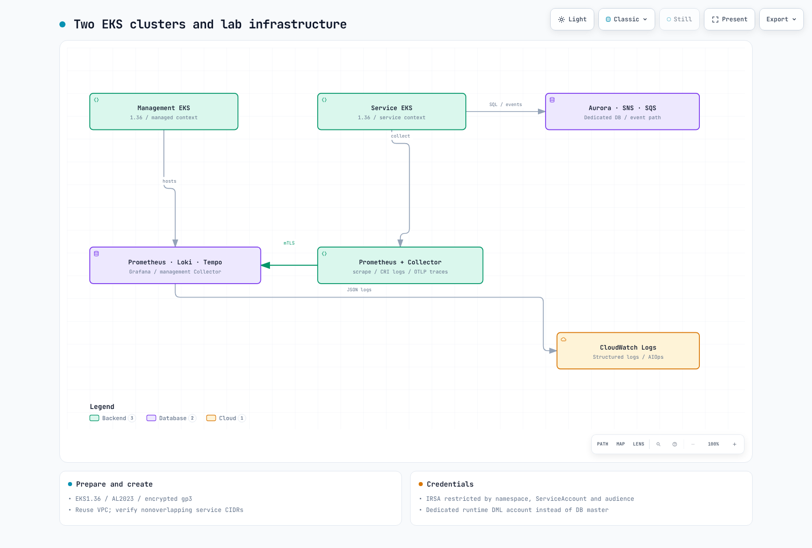

# Parte 1: Configuración de la infraestructura

<span id="cleanup"></span>
<span id="exercise-1-environment-setup"></span>
<span id="exercise-2-managed-cluster-eks-setup"></span>
<span id="exercise-3-service-cluster-eks-setup"></span>
<span id="exercise-4-aws-managed-services-setup"></span>
<span id="exercise-5-argocd-setup-on-managed-cluster"></span>
<span id="exercise-6-argo-rollouts-setup-on-service-cluster"></span>
<span id="exercise-7-irsa-configuration"></span>
<span id="learning-objectives"></span>
<span id="next-steps"></span>
<span id="references"></span>
<span id="steps"></span>
<span id="steps-1"></span>
<span id="steps-2"></span>
<span id="steps-3"></span>
<span id="steps-4"></span>
<span id="steps-5"></span>
<span id="steps-6"></span>
<span id="summary"></span>
<span id="troubleshooting"></span>
<span id="verification"></span>
<span id="verification-1"></span>
<span id="verification-2"></span>
<span id="verification-3"></span>
<span id="verification-4"></span>
<span id="verification-5"></span>

> **Dificultad**: Avanzado
> **Última actualización**: September 13, 2026
Prepare dos EKS clusters y una ruta de base de datos/mensajes dedicada para el laboratorio. Los archivos ejecutables están en el [ejemplo de aplicación](https://github.com/Atom-oh/kubernetes-docs/tree/main/examples/labs/observability/application). Revise la cuenta, la Region, la red, los permisos y la limpieza antes de crear recursos facturables. Esta auditoría no creó recursos de AWS.



[🔍 Ver diagrama interactivo](https://www.atomai.click/kubernetes-docs/archmaps/en-labs-observability-01-infrastructure-setup-lab-0.html)

## 1. Verifique el entorno y la propiedad {#prerequisites}

Los ejemplos se revisaron con AWS CLI v2, eksctl 0.229.0, kubectl 1.36.2, Helm 3.21.3, Python 3.12, Docker, Git y jq. EKS 1.36 tenía soporte estándar en el momento de la revisión. El ejemplo anterior de 1.31 tenía soporte extendido, no estaba ya sin soporte. Vuelva a comprobar la disponibilidad de la versión/Region al ejecutar.

```bash
aws --version
eksctl version
kubectl version --client
helm version
python3 --version
aws sts get-caller-identity
```
Use un rol temporal aprobado. Revise las operaciones necesarias de EKS, EC2/VPC, CloudFormation, IAM/PassRole, RDS, SNS/SQS, KMS y Logs frente al plan de despliegue. No otorgue FullAccess a todos los servicios ni cree claves de acceso IAM de larga duración para este ejercicio.

```bash
umask 077
export LAB_STATE="$(mktemp -d "$PWD/obs-lab.XXXXXXXX")"
# Set AWS_REGION, EXPECTED_ACCOUNT_ID and a unique LAB_PREFIX first.
test "$(aws sts get-caller-identity --query Account --output text)" = "$EXPECTED_ACCOUNT_ID"
```

## 2. Red y dos clústeres {#clusters}

El ejemplo reutiliza una VPC revisada y dos subredes privadas en diferentes AZ. Prepare primero los endpoints NAT/VPC necesarios, DNS, la capacidad de direcciones y las reglas de SG/NACL. Los CIDR de servicio de Kubernetes172.20.0.0/16 y172.21.0.0/16 no deben superponerse con las redes VPC/conectadas reales. Las VPC separadas requieren peering/TGW adicional, rutas bidireccionales, DNS y verificación de IP de origen.

```bash
cd examples/labs/observability/application
python3 prepare_clusters.py --region "$AWS_REGION" --vpc-id "$VPC_ID" \
  --subnet-a "$PRIVATE_SUBNET_A" --az-a "$AZ_A" \
  --subnet-b "$PRIVATE_SUBNET_B" --az-b "$AZ_B" \
  --client-cidr "$CLIENT_CIDR" --prefix "$LAB_PREFIX" \
  --output-directory "$LAB_STATE/clusters"
```
El generador selecciona EKS 1.36, entradas de acceso de API, OIDC, nodos administrados AL2023, gp3 cifrado y un CIDR de cliente de API público limitado. El tamaño/la cantidad de nodos son configuraciones de laboratorio, no capacidad medida. Revise el JSON y los costos antes de la creación. Si ocurre un error, inspeccione los recursos creados parcialmente con ese nombre antes de volver a crear algo.

```bash
eksctl create cluster -f "$LAB_STATE/clusters/managed.json" --write-kubeconfig=false
eksctl create cluster -f "$LAB_STATE/clusters/service.json" --write-kubeconfig=false
export KUBECONFIG="$LAB_STATE/kubeconfig"
aws eks update-kubeconfig --name "$LAB_PREFIX-managed" --alias managed --kubeconfig "$KUBECONFIG"
aws eks update-kubeconfig --name "$LAB_PREFIX-service" --alias service --kubeconfig "$KUBECONFIG"
kubectl --context managed get nodes
kubectl --context service get nodes
```
Aplique las comprobaciones de cuenta/endpoint/propiedad de la [guía de creación de EKS](../../eks/02-eks-cluster-creation-part1.md) y del [laboratorio de clústeres](../eks/01-eks-cluster-creation-lab.md). Verifique que ambos contextos seleccionen los clústeres distintos previstos.

## 3. Requisitos previos de almacenamiento, balanceador de carga y OIDC {#platform-prerequisites}

Instale EBS CSI y un StorageClass `gp3` revisado, un CNI que realmente aplique NetworkPolicy y AWS Load Balancer Controller (`service.k8s.aws/nlb`). No sobrescriba a ciegas los StorageClasses compartidos. Obtenga el emisor OIDC de cada clúster y el ARN del proveedor IAM correspondiente. El host/ruta del emisor sin https:// debe coincidir con el sufijo del ARN del proveedor.

```bash
aws eks describe-cluster --name "$LAB_PREFIX-managed" --query cluster.identity.oidc.issuer --output text
aws eks describe-cluster --name "$LAB_PREFIX-service" --query cluster.identity.oidc.issuer --output text
kubectl --context managed get storageclass gp3
kubectl --context service get storageclass gp3
```

## 4. Aurora, SNS/SQS y roles {#managed-resources}

`application/infra.yaml` crea un escritor Aurora privado, Secret maestro administrado, fanout de SNS, colas de consumidores/DLQ separadas, un grupo de logs de CloudWatch y roles. El ingreso de DB permite solo el SG de nodo de servicio real. Un ejercicio de escritor único no es HA Multi-AZ. Detecte y proporcione explícitamente una versión de motor Aurora compatible para la Region.

```bash
aws rds describe-db-engine-versions --engine aurora-postgresql \
  --query "DBEngineVersions[].EngineVersion" --output table
```
Proporcione VpcId, PrivateSubnetIds, ServiceNodeSecurityGroupId, AuroraEngineVersion y ambos pares de proveedor/emisor OIDC; revise y ejecute el conjunto de cambios de CloudFormation. Verifique la coherencia de la cuenta, el ARN y ServiceAccount. Los roles de tiempo de ejecución de la aplicación, la identidad de lectura de colas de KEDA y la identidad de logs de Collector de gestión son independientes.

```bash
aws cloudformation describe-stacks --stack-name "$LAB_STACK" \
  --query "Stacks[0].Outputs" --output json > "$LAB_STATE/infra-outputs.json"
```

Genere aquí las entradas de identidad de Collector para la Parte 2. Elija ahora el repositorio de imágenes y la etiqueta inmutable; compile/publique la imagen en la Parte 3.

```bash
python3.12 -m venv .venv
.venv/bin/python -m pip install -r requirements.txt PyYAML==6.0.3
.venv/bin/python prepare_values.py --outputs-file "$LAB_STATE/infra-outputs.json"   --region "$AWS_REGION" --image-repository "$IMAGE_REPOSITORY"   --image-tag "$IMAGE_TAG" --output-directory "$LAB_STATE/helm-inputs"
```

## 5. Cuenta de DB de tiempo de ejecución y siguiente paso {#database-and-next}

Lea el Secret maestro solo en un entorno autorizado y almacene un archivo de conexión JSON privado. Use el paquete de CA de RDS y `sslmode=verify-full`. El [procedimiento bootstrap_db.py](https://github.com/Atom-oh/kubernetes-docs/tree/main/examples/labs/observability/application#infrastructure-and-credentials) crea acceso DML dedicado de `lab_runtime` sin sobrescribir una contraseña existente. Establezca la ruta de CA de su Pod en `/run/database-ca/global-bundle.pem`.

Registre las pilas, los clústeres, las instantáneas retenidas, los adjuntos IAM, los LB y los PVC en el inventario de propiedad. Estime los costos de EKS/nodos/NAT/EBS/Aurora/Logs/SNS/SQS/KMS/transferencia para la Region y el uso reales. No presente totales horarios fijos ni convierta precios mensuales por usuario de AMG en cargos horarios de workspace. Continúe con la [Parte 2](./02-observability-stack-lab.md).

## Alcance de la validación

Las comprobaciones cubrieron los esquemas de eksctl, la estructura de lint/roles de CloudFormation y el comportamiento local de PostgreSQL. No se probaron EKS/VPC/OIDC/IRSA/Aurora/TLS reales, las cuotas ni la duración del aprovisionamiento.
