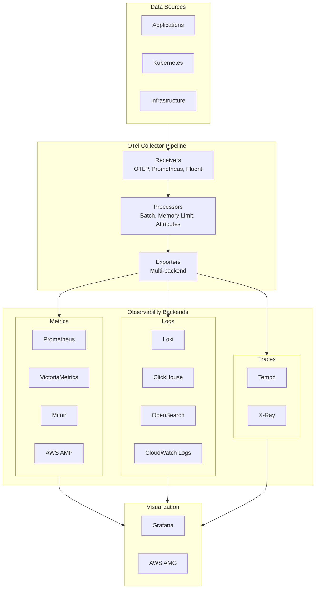

# Parte 2: Despliegue del stack de observabilidad

> **Dificultad**: Avanzado
> **Tiempo estimado**: 90 minutos
> **Última actualización**: February 22, 2026

## Objetivos de aprendizaje

- Desplegar los tres pilares de la observabilidad: Metrics, Logs y Traces
- Configurar OpenTelemetry Collector como el pipeline central de telemetría
- Implementar fan-out multi-backend para redundancia y flexibilidad
- Configurar Grafana con integración unificada de fuentes de datos
- Configurar alertas básicas con Alertmanager y SNS

## Requisitos previos

- [ ] Completada la [Parte 1: Configuración de infraestructura](./01-infrastructure-setup-lab.md)
- [ ] Managed Cluster y Service Cluster en ejecución
- [ ] Servicios administrados de AWS (AMP, OpenSearch) disponibles
- [ ] ArgoCD configurado para despliegue multiclúster

---

## Descripción general de la arquitectura



---

## Ejercicio 1: Despliegue de OpenTelemetry Collector

### Pasos

**Paso 1.1: Cambiar a Managed Cluster**

```bash
kubectl config use-context $(kubectl config get-contexts -o name | grep obs-managed)
kubectl config current-context
```

**Paso 1.2: Crear el namespace y ConfigMap de OpenTelemetry**

```bash
kubectl create namespace opentelemetry

cat <<'EOF' | kubectl apply -f -
apiVersion: v1
kind: ConfigMap
metadata:
  name: otel-collector-config
  namespace: opentelemetry
data:
  config.yaml: |
    receivers:
      otlp:
        protocols:
          grpc:
            endpoint: 0.0.0.0:4317
          http:
            endpoint: 0.0.0.0:4318

      prometheus:
        config:
          scrape_configs:
            - job_name: 'otel-collector'
              scrape_interval: 15s
              static_configs:
                - targets: ['localhost:8888']

      filelog:
        include:
          - /var/log/pods/*/*/*.log
        exclude:
          - /var/log/pods/*/otel-collector/*.log
        start_at: beginning
        include_file_path: true
        include_file_name: false
        operators:
          - type: router
            id: get-format
            routes:
              - output: parser-docker
                expr: 'body matches "^\\\\{"'
              - output: parser-crio
                expr: 'body matches "^[^ Z]+ "'
              - output: parser-containerd
                expr: 'body matches "^[^ Z]+Z"'
          - type: regex_parser
            id: parser-docker
            regex: '^(?P<time>[^ Z]+) (?P<stream>stdout|stderr) (?P<logtag>[^ ]*) ?(?P<log>.*)$'
          - type: regex_parser
            id: parser-crio
            regex: '^(?P<time>[^ Z]+) (?P<stream>stdout|stderr) (?P<logtag>[^ ]*) ?(?P<log>.*)$'
          - type: regex_parser
            id: parser-containerd
            regex: '^(?P<time>[^ ^Z]+Z) (?P<stream>stdout|stderr) (?P<logtag>[^ ]*) ?(?P<log>.*)$'

    processors:
      batch:
        timeout: 10s
        send_batch_size: 1024
        send_batch_max_size: 2048

      memory_limiter:
        check_interval: 1s
        limit_mib: 1000
        spike_limit_mib: 200

      attributes:
        actions:
          - key: cluster
            value: obs-managed
            action: upsert
          - key: environment
            value: lab
            action: upsert

      resource:
        attributes:
          - key: service.instance.id
            from_attribute: k8s.pod.uid
            action: insert

    exporters:
      # Prometheus remote write to AMP
      prometheusremotewrite:
        endpoint: "${AMP_REMOTE_WRITE_URL}"
        auth:
          authenticator: sigv4auth

      # Local Prometheus
      prometheus:
        endpoint: "0.0.0.0:8889"
        namespace: otel

      # Loki
      loki:
        endpoint: "http://loki-gateway.logging.svc.cluster.local:80/loki/api/v1/push"
        labels:
          resource:
            k8s.namespace.name: "namespace"
            k8s.pod.name: "pod"
            k8s.container.name: "container"

      # Tempo
      otlp/tempo:
        endpoint: "tempo-distributor.tracing.svc.cluster.local:4317"
        tls:
          insecure: true

      # CloudWatch Logs
      awscloudwatchlogs:
        log_group_name: "/obs-lab/otel"
        log_stream_name: "collector"
        region: "${AWS_REGION}"

      # X-Ray
      awsxray:
        region: "${AWS_REGION}"

      # Debug (for troubleshooting)
      debug:
        verbosity: detailed

    extensions:
      health_check:
        endpoint: 0.0.0.0:13133

      sigv4auth:
        region: "${AWS_REGION}"
        service: "aps"

    service:
      extensions: [health_check, sigv4auth]
      pipelines:
        metrics:
          receivers: [otlp, prometheus]
          processors: [memory_limiter, batch, attributes]
          exporters: [prometheusremotewrite, prometheus]

        logs:
          receivers: [otlp, filelog]
          processors: [memory_limiter, batch, attributes]
          exporters: [loki, awscloudwatchlogs]

        traces:
          receivers: [otlp]
          processors: [memory_limiter, batch, attributes, resource]
          exporters: [otlp/tempo, awsxray]

      telemetry:
        logs:
          level: info
        metrics:
          address: 0.0.0.0:8888
EOF
```

**Paso 1.3: Desplegar el DaemonSet (Agent) de OTel Collector**

```bash
cat <<'EOF' | kubectl apply -f -
apiVersion: apps/v1
kind: DaemonSet
metadata:
  name: otel-collector-agent
  namespace: opentelemetry
  labels:
    app: otel-collector
    component: agent
spec:
  selector:
    matchLabels:
      app: otel-collector
      component: agent
  template:
    metadata:
      labels:
        app: otel-collector
        component: agent
    spec:
      serviceAccountName: otel-collector
      containers:
        - name: otel-collector
          image: otel/opentelemetry-collector-contrib:0.95.0
          args:
            - --config=/conf/config.yaml
          ports:
            - containerPort: 4317
              hostPort: 4317
              protocol: TCP
            - containerPort: 4318
              hostPort: 4318
              protocol: TCP
            - containerPort: 8888
              protocol: TCP
          env:
            - name: K8S_NODE_NAME
              valueFrom:
                fieldRef:
                  fieldPath: spec.nodeName
            - name: K8S_POD_NAME
              valueFrom:
                fieldRef:
                  fieldPath: metadata.name
            - name: K8S_NAMESPACE
              valueFrom:
                fieldRef:
                  fieldPath: metadata.namespace
          resources:
            limits:
              cpu: 500m
              memory: 512Mi
            requests:
              cpu: 100m
              memory: 128Mi
          volumeMounts:
            - name: config
              mountPath: /conf
            - name: varlog
              mountPath: /var/log
              readOnly: true
            - name: varlibdockercontainers
              mountPath: /var/lib/docker/containers
              readOnly: true
      volumes:
        - name: config
          configMap:
            name: otel-collector-config
        - name: varlog
          hostPath:
            path: /var/log
        - name: varlibdockercontainers
          hostPath:
            path: /var/lib/docker/containers
---
apiVersion: v1
kind: ServiceAccount
metadata:
  name: otel-collector
  namespace: opentelemetry
---
apiVersion: rbac.authorization.k8s.io/v1
kind: ClusterRole
metadata:
  name: otel-collector
rules:
  - apiGroups: [""]
    resources: ["pods", "namespaces", "nodes"]
    verbs: ["get", "list", "watch"]
  - apiGroups: ["apps"]
    resources: ["replicasets", "deployments"]
    verbs: ["get", "list", "watch"]
---
apiVersion: rbac.authorization.k8s.io/v1
kind: ClusterRoleBinding
metadata:
  name: otel-collector
roleRef:
  apiGroup: rbac.authorization.k8s.io
  kind: ClusterRole
  name: otel-collector
subjects:
  - kind: ServiceAccount
    name: otel-collector
    namespace: opentelemetry
EOF
```

**Paso 1.4: Desplegar el Gateway (Deployment) de OTel Collector**

```bash
cat <<'EOF' | kubectl apply -f -
apiVersion: apps/v1
kind: Deployment
metadata:
  name: otel-collector-gateway
  namespace: opentelemetry
  labels:
    app: otel-collector
    component: gateway
spec:
  replicas: 2
  selector:
    matchLabels:
      app: otel-collector
      component: gateway
  template:
    metadata:
      labels:
        app: otel-collector
        component: gateway
    spec:
      serviceAccountName: otel-collector
      containers:
        - name: otel-collector
          image: otel/opentelemetry-collector-contrib:0.95.0
          args:
            - --config=/conf/config.yaml
          ports:
            - containerPort: 4317
              protocol: TCP
            - containerPort: 4318
              protocol: TCP
            - containerPort: 8888
              protocol: TCP
            - containerPort: 8889
              protocol: TCP
          resources:
            limits:
              cpu: 1000m
              memory: 2Gi
            requests:
              cpu: 200m
              memory: 256Mi
          volumeMounts:
            - name: config
              mountPath: /conf
      volumes:
        - name: config
          configMap:
            name: otel-collector-config
---
apiVersion: v1
kind: Service
metadata:
  name: otel-collector-gateway
  namespace: opentelemetry
spec:
  selector:
    app: otel-collector
    component: gateway
  ports:
    - name: otlp-grpc
      port: 4317
      targetPort: 4317
    - name: otlp-http
      port: 4318
      targetPort: 4318
    - name: metrics
      port: 8888
      targetPort: 8888
    - name: prometheus
      port: 8889
      targetPort: 8889
EOF
```

### Verificación

```bash
kubectl get pods -n opentelemetry
kubectl logs -n opentelemetry -l app=otel-collector --tail=50
# Expected: All collectors running, no errors in logs
```

---

## Ejercicio 2: Despliegue del stack de Metrics

### Pasos

**Paso 2.1: Instalar kube-prometheus-stack**

```bash
kubectl create namespace monitoring

helm repo add prometheus-community https://prometheus-community.github.io/helm-charts
helm repo update

cat <<'EOF' > /tmp/prometheus-values.yaml
prometheus:
  prometheusSpec:
    replicas: 2
    retention: 7d
    retentionSize: 40GB
    resources:
      requests:
        cpu: 500m
        memory: 2Gi
      limits:
        cpu: 2000m
        memory: 8Gi
    storageSpec:
      volumeClaimTemplate:
        spec:
          storageClassName: gp3
          accessModes: ["ReadWriteOnce"]
          resources:
            requests:
              storage: 50Gi
    remoteWrite:
      - url: "${AMP_REMOTE_WRITE_URL}"
        sigv4:
          region: "${AWS_REGION}"
        queueConfig:
          maxSamplesPerSend: 1000
          maxShards: 200
          capacity: 2500
    enableFeatures:
      - exemplar-storage
    exemplars:
      maxExemplars: 100000
    serviceMonitorSelector: {}
    serviceMonitorNamespaceSelector: {}
    podMonitorSelector: {}
    podMonitorNamespaceSelector: {}

alertmanager:
  alertmanagerSpec:
    replicas: 2
    storage:
      volumeClaimTemplate:
        spec:
          storageClassName: gp3
          accessModes: ["ReadWriteOnce"]
          resources:
            requests:
              storage: 10Gi

grafana:
  enabled: false  # We'll deploy Grafana separately

nodeExporter:
  enabled: true

kubeStateMetrics:
  enabled: true

prometheusOperator:
  resources:
    requests:
      cpu: 100m
      memory: 128Mi
    limits:
      cpu: 500m
      memory: 512Mi
EOF

helm install kube-prometheus-stack prometheus-community/kube-prometheus-stack \
  --namespace monitoring \
  --version 57.0.0 \
  -f /tmp/prometheus-values.yaml \
  --wait
```

**Paso 2.2: Instalar VictoriaMetrics (backend alternativo de Metrics)**

```bash
helm repo add vm https://victoriametrics.github.io/helm-charts/
helm repo update

cat <<'EOF' > /tmp/vm-values.yaml
server:
  retentionPeriod: 14d
  resources:
    requests:
      cpu: 500m
      memory: 1Gi
    limits:
      cpu: 2000m
      memory: 4Gi
  persistentVolume:
    enabled: true
    size: 50Gi
    storageClass: gp3
  scrape:
    enabled: true
    configMap: ""
  extraArgs:
    dedup.minScrapeInterval: 30s
    search.latencyOffset: 30s

vmagent:
  enabled: true
  spec:
    scrapeInterval: 30s
    resources:
      requests:
        cpu: 100m
        memory: 128Mi
      limits:
        cpu: 500m
        memory: 512Mi

vmalert:
  enabled: true
  spec:
    resources:
      requests:
        cpu: 50m
        memory: 64Mi
      limits:
        cpu: 200m
        memory: 256Mi
EOF

helm install victoria-metrics vm/victoria-metrics-single \
  --namespace monitoring \
  --version 0.9.16 \
  -f /tmp/vm-values.yaml \
  --wait
```

**Paso 2.3: Instalar Mimir (almacenamiento escalable a largo plazo)**

```bash
helm repo add grafana https://grafana.github.io/helm-charts
helm repo update

cat <<'EOF' > /tmp/mimir-values.yaml
mimir:
  structuredConfig:
    limits:
      max_global_series_per_user: 1000000
      ingestion_rate: 100000
      ingestion_burst_size: 200000

    blocks_storage:
      backend: s3
      s3:
        endpoint: s3.${AWS_REGION}.amazonaws.com
        bucket_name: obs-lab-mimir-${ACCOUNT_ID}
        region: ${AWS_REGION}

    ruler_storage:
      backend: s3
      s3:
        endpoint: s3.${AWS_REGION}.amazonaws.com
        bucket_name: obs-lab-mimir-${ACCOUNT_ID}
        region: ${AWS_REGION}

distributor:
  replicas: 2
  resources:
    requests:
      cpu: 100m
      memory: 256Mi

ingester:
  replicas: 3
  persistentVolume:
    enabled: true
    size: 10Gi
  resources:
    requests:
      cpu: 100m
      memory: 512Mi

querier:
  replicas: 2
  resources:
    requests:
      cpu: 100m
      memory: 256Mi

query_frontend:
  replicas: 1
  resources:
    requests:
      cpu: 100m
      memory: 128Mi

compactor:
  replicas: 1
  persistentVolume:
    enabled: true
    size: 20Gi
  resources:
    requests:
      cpu: 100m
      memory: 512Mi

store_gateway:
  replicas: 1
  persistentVolume:
    enabled: true
    size: 10Gi
  resources:
    requests:
      cpu: 100m
      memory: 256Mi

minio:
  enabled: false  # We use S3

nginx:
  enabled: true
  replicas: 1
EOF

# Create S3 bucket for Mimir
aws s3 mb s3://obs-lab-mimir-${ACCOUNT_ID} --region $AWS_REGION

helm install mimir grafana/mimir-distributed \
  --namespace monitoring \
  --version 5.2.0 \
  -f /tmp/mimir-values.yaml \
  --wait
```

### Verificación

```bash
kubectl get pods -n monitoring
kubectl get svc -n monitoring

# Check Prometheus targets
kubectl port-forward -n monitoring svc/kube-prometheus-stack-prometheus 9090:9090 &
curl -s http://localhost:9090/api/v1/targets | jq '.data.activeTargets | length'
```

---

## Ejercicio 3: Despliegue del stack de Logging

### Pasos

**Paso 3.1: Instalar Loki**

```bash
kubectl create namespace logging

cat <<'EOF' > /tmp/loki-values.yaml
loki:
  auth_enabled: false

  commonConfig:
    replication_factor: 1

  schemaConfig:
    configs:
      - from: 2024-01-01
        store: tsdb
        object_store: s3
        schema: v13
        index:
          prefix: loki_index_
          period: 24h

  storage:
    type: s3
    s3:
      endpoint: s3.${AWS_REGION}.amazonaws.com
      region: ${AWS_REGION}
      bucketnames: obs-lab-loki-${ACCOUNT_ID}
      insecure: false
      sse_encryption: false
      s3ForcePathStyle: false

  limits_config:
    enforce_metric_name: false
    reject_old_samples: true
    reject_old_samples_max_age: 168h
    max_cache_freshness_per_query: 10m
    split_queries_by_interval: 15m
    ingestion_rate_mb: 16
    ingestion_burst_size_mb: 32
    per_stream_rate_limit: 5MB
    per_stream_rate_limit_burst: 15MB

write:
  replicas: 2
  persistence:
    enabled: true
    size: 10Gi
    storageClass: gp3

read:
  replicas: 2

backend:
  replicas: 1
  persistence:
    enabled: true
    size: 10Gi
    storageClass: gp3

gateway:
  enabled: true
  replicas: 1

minio:
  enabled: false
EOF

# Create S3 bucket for Loki
aws s3 mb s3://obs-lab-loki-${ACCOUNT_ID} --region $AWS_REGION

helm install loki grafana/loki \
  --namespace logging \
  --version 5.43.0 \
  -f /tmp/loki-values.yaml \
  --wait
```

**Paso 3.2: Instalar ClickHouse para análisis de Logs de alto rendimiento**

```bash
helm repo add clickhouse https://docs.altinity.com/clickhouse-operator/
helm repo update

cat <<'EOF' > /tmp/clickhouse-values.yaml
clickhouse:
  replicas: 1
  shards: 1
  image: clickhouse/clickhouse-server:24.1
  resources:
    requests:
      cpu: 500m
      memory: 2Gi
    limits:
      cpu: 2000m
      memory: 8Gi
  persistence:
    enabled: true
    size: 50Gi
    storageClass: gp3
  users:
    - name: obslab
      password: ObsLab2026!
      profile: default
      quota: default
      networks:
        - ::/0
      grants:
        - GRANT ALL ON *.*
EOF

# Install ClickHouse Operator first
kubectl apply -f https://raw.githubusercontent.com/Altinity/clickhouse-operator/master/deploy/operator/clickhouse-operator-install-bundle.yaml

# Create ClickHouse instance
cat <<'EOF' | kubectl apply -f -
apiVersion: "clickhouse.altinity.com/v1"
kind: "ClickHouseInstallation"
metadata:
  name: obs-lab-clickhouse
  namespace: logging
spec:
  configuration:
    clusters:
      - name: logs
        layout:
          shardsCount: 1
          replicasCount: 1
    users:
      obslab/password: ObsLab2026!
      obslab/networks/ip: "::/0"
      obslab/profile: default
      obslab/quota: default
  defaults:
    templates:
      podTemplate: clickhouse-pod
      dataVolumeClaimTemplate: data-volume
  templates:
    podTemplates:
      - name: clickhouse-pod
        spec:
          containers:
            - name: clickhouse
              image: clickhouse/clickhouse-server:24.1
              resources:
                requests:
                  cpu: 500m
                  memory: 2Gi
                limits:
                  cpu: 2000m
                  memory: 8Gi
    volumeClaimTemplates:
      - name: data-volume
        spec:
          accessModes:
            - ReadWriteOnce
          storageClassName: gp3
          resources:
            requests:
              storage: 50Gi
EOF
```

**Paso 3.3: Instalar Fluent Bit para la recopilación de Logs**

```bash
helm repo add fluent https://fluent.github.io/helm-charts
helm repo update

cat <<'EOF' > /tmp/fluentbit-values.yaml
config:
  service: |
    [SERVICE]
        Daemon Off
        Flush 5
        Log_Level info
        Parsers_File /fluent-bit/etc/parsers.conf
        HTTP_Server On
        HTTP_Listen 0.0.0.0
        HTTP_Port 2020
        Health_Check On

  inputs: |
    [INPUT]
        Name tail
        Path /var/log/containers/*.log
        multiline.parser docker, cri
        Tag kube.*
        Mem_Buf_Limit 50MB
        Skip_Long_Lines On
        Refresh_Interval 10

  filters: |
    [FILTER]
        Name kubernetes
        Match kube.*
        Merge_Log On
        Keep_Log Off
        K8S-Logging.Parser On
        K8S-Logging.Exclude On
        Labels On
        Annotations Off

    [FILTER]
        Name modify
        Match kube.*
        Add cluster obs-managed
        Add environment lab

  outputs: |
    [OUTPUT]
        Name loki
        Match kube.*
        Host loki-gateway.logging.svc.cluster.local
        Port 80
        Labels job=fluentbit, namespace=$kubernetes['namespace_name'], pod=$kubernetes['pod_name'], container=$kubernetes['container_name']
        Label_keys $kubernetes['namespace_name'],$kubernetes['pod_name']
        Remove_keys kubernetes,stream
        Auto_Kubernetes_Labels Off
        Line_Format json

    [OUTPUT]
        Name opensearch
        Match kube.*
        Host ${OPENSEARCH_ENDPOINT}
        Port 443
        Index obs-lab-logs
        Type _doc
        tls On
        tls.verify Off
        AWS_Auth On
        AWS_Region ${AWS_REGION}
        Suppress_Type_Name On

    [OUTPUT]
        Name cloudwatch_logs
        Match kube.*
        region ${AWS_REGION}
        log_group_name /obs-lab/kubernetes
        log_stream_prefix fluentbit-
        auto_create_group true

serviceAccount:
  create: true
  name: fluent-bit
  annotations:
    eks.amazonaws.com/role-arn: arn:aws:iam::${ACCOUNT_ID}:role/obs-lab-fluentbit

resources:
  requests:
    cpu: 100m
    memory: 128Mi
  limits:
    cpu: 500m
    memory: 512Mi
EOF

helm install fluent-bit fluent/fluent-bit \
  --namespace logging \
  --version 0.43.0 \
  -f /tmp/fluentbit-values.yaml \
  --wait
```

### Verificación

```bash
kubectl get pods -n logging
kubectl logs -n logging -l app.kubernetes.io/name=fluent-bit --tail=20

# Test Loki query
kubectl port-forward -n logging svc/loki-gateway 3100:80 &
curl -G -s "http://localhost:3100/loki/api/v1/labels" | jq
```

---

## Ejercicio 4: Despliegue del stack de Tracing

### Pasos

**Paso 4.1: Instalar Tempo**

```bash
kubectl create namespace tracing

cat <<'EOF' > /tmp/tempo-values.yaml
tempo:
  retention: 72h
  reportingEnabled: false
  metricsGenerator:
    enabled: true
    remoteWriteUrl: "http://kube-prometheus-stack-prometheus.monitoring.svc.cluster.local:9090/api/v1/write"

  storage:
    trace:
      backend: s3
      s3:
        bucket: obs-lab-tempo-${ACCOUNT_ID}
        endpoint: s3.${AWS_REGION}.amazonaws.com
        region: ${AWS_REGION}
        insecure: false
        forcepathstyle: false

distributor:
  replicas: 2
  config:
    log_received_spans:
      enabled: true
  resources:
    requests:
      cpu: 100m
      memory: 256Mi

ingester:
  replicas: 2
  config:
    replication_factor: 2
  persistence:
    enabled: true
    size: 10Gi
    storageClass: gp3
  resources:
    requests:
      cpu: 100m
      memory: 512Mi

querier:
  replicas: 2
  resources:
    requests:
      cpu: 100m
      memory: 256Mi

queryFrontend:
  replicas: 1
  resources:
    requests:
      cpu: 100m
      memory: 128Mi

compactor:
  replicas: 1
  config:
    compaction:
      block_retention: 72h
  resources:
    requests:
      cpu: 100m
      memory: 256Mi

metricsGenerator:
  enabled: true
  replicas: 1
  resources:
    requests:
      cpu: 100m
      memory: 256Mi

gateway:
  enabled: true
  replicas: 1
EOF

# Create S3 bucket for Tempo
aws s3 mb s3://obs-lab-tempo-${ACCOUNT_ID} --region $AWS_REGION

helm install tempo grafana/tempo-distributed \
  --namespace tracing \
  --version 1.8.0 \
  -f /tmp/tempo-values.yaml \
  --wait
```

**Paso 4.2: Configurar la integración de X-Ray mediante OTel**

El OTel Collector configurado en el Ejercicio 1 ya exporta Traces a X-Ray. Verifique la configuración:

```bash
kubectl get configmap -n opentelemetry otel-collector-config -o yaml | grep -A5 "awsxray"
```

### Verificación

```bash
kubectl get pods -n tracing
kubectl logs -n tracing -l app.kubernetes.io/name=tempo --tail=20

# Check Tempo health
kubectl port-forward -n tracing svc/tempo-query-frontend 3200:3200 &
curl -s http://localhost:3200/ready
```

---

## Ejercicio 5: Despliegue de Grafana y configuración de fuentes de datos

### Pasos

**Paso 5.1: Instalar Grafana**

```bash
cat <<'EOF' > /tmp/grafana-values.yaml
replicas: 1

persistence:
  enabled: true
  size: 10Gi
  storageClassName: gp3

adminUser: admin
adminPassword: ObsLab2026!

service:
  type: LoadBalancer

resources:
  requests:
    cpu: 100m
    memory: 256Mi
  limits:
    cpu: 500m
    memory: 1Gi

datasources:
  datasources.yaml:
    apiVersion: 1
    datasources:
      # Prometheus
      - name: Prometheus
        type: prometheus
        access: proxy
        url: http://kube-prometheus-stack-prometheus.monitoring.svc.cluster.local:9090
        isDefault: true
        jsonData:
          timeInterval: 15s
          exemplarTraceIdDestinations:
            - name: traceID
              datasourceUid: tempo
        editable: true

      # VictoriaMetrics
      - name: VictoriaMetrics
        type: prometheus
        access: proxy
        url: http://victoria-metrics-single-server.monitoring.svc.cluster.local:8428
        jsonData:
          timeInterval: 30s
        editable: true

      # Mimir
      - name: Mimir
        type: prometheus
        access: proxy
        url: http://mimir-nginx.monitoring.svc.cluster.local/prometheus
        jsonData:
          timeInterval: 15s
        editable: true

      # Amazon Managed Prometheus
      - name: AMP
        type: prometheus
        access: proxy
        url: ${AMP_QUERY_URL}
        jsonData:
          sigV4Auth: true
          sigV4AuthType: default
          sigV4Region: ${AWS_REGION}
        editable: true

      # Loki
      - name: Loki
        type: loki
        access: proxy
        url: http://loki-gateway.logging.svc.cluster.local:80
        jsonData:
          derivedFields:
            - name: TraceID
              matcherRegex: '"traceId":"(\w+)"'
              url: '$${__value.raw}'
              datasourceUid: tempo
        editable: true

      # Tempo
      - name: Tempo
        type: tempo
        access: proxy
        uid: tempo
        url: http://tempo-query-frontend.tracing.svc.cluster.local:3200
        jsonData:
          httpMethod: GET
          tracesToLogs:
            datasourceUid: loki
            tags: ['namespace', 'pod']
            mappedTags: [{ key: 'service.name', value: 'service' }]
            mapTagNamesEnabled: true
            spanStartTimeShift: '-1h'
            spanEndTimeShift: '1h'
            filterByTraceID: true
            filterBySpanID: false
          tracesToMetrics:
            datasourceUid: prometheus
            tags: [{ key: 'service.name', value: 'service' }]
            queries:
              - name: 'Request Rate'
                query: 'sum(rate(http_server_request_count{$$__tags}[5m]))'
              - name: 'Error Rate'
                query: 'sum(rate(http_server_request_count{$$__tags,http_status_code=~"5.."}[5m]))'
          serviceMap:
            datasourceUid: prometheus
          nodeGraph:
            enabled: true
          lokiSearch:
            datasourceUid: loki
        editable: true

      # CloudWatch
      - name: CloudWatch
        type: cloudwatch
        access: proxy
        jsonData:
          authType: default
          defaultRegion: ${AWS_REGION}
        editable: true

dashboardProviders:
  dashboardproviders.yaml:
    apiVersion: 1
    providers:
      - name: 'default'
        orgId: 1
        folder: ''
        type: file
        disableDeletion: false
        editable: true
        options:
          path: /var/lib/grafana/dashboards/default

dashboards:
  default:
    kubernetes-cluster:
      gnetId: 7249
      revision: 1
      datasource: Prometheus

    node-exporter:
      gnetId: 1860
      revision: 33
      datasource: Prometheus

    kubernetes-pods:
      gnetId: 6336
      revision: 1
      datasource: Prometheus

plugins:
  - grafana-piechart-panel
  - grafana-clock-panel
  - grafana-worldmap-panel

grafana.ini:
  server:
    root_url: "%(protocol)s://%(domain)s/"

  feature_toggles:
    enable: tempoSearch tempoBackendSearch tempoServiceGraph traceQLStreaming

  unified_alerting:
    enabled: true

  alerting:
    enabled: false
EOF

helm install grafana grafana/grafana \
  --namespace monitoring \
  --version 7.3.0 \
  -f /tmp/grafana-values.yaml \
  --wait
```

**Paso 5.2: Obtener la URL de Grafana**

```bash
GRAFANA_URL=$(kubectl -n monitoring get svc grafana \
  -o jsonpath='{.status.loadBalancer.ingress[0].hostname}')

echo "Grafana URL: http://$GRAFANA_URL"
echo "Username: admin"
echo "Password: ObsLab2026!"
```

**Paso 5.3: Verificar la conectividad de las fuentes de datos**

```bash
# Port-forward for testing
kubectl port-forward -n monitoring svc/grafana 3000:80 &

# Test data sources via API
curl -s -u admin:ObsLab2026! "http://localhost:3000/api/datasources" | jq '.[].name'

# Test each data source health
for ds in Prometheus Loki Tempo; do
  echo "Testing $ds..."
  curl -s -u admin:ObsLab2026! "http://localhost:3000/api/datasources/name/$ds" | jq '.type'
done
```

### Verificación

```bash
# Open Grafana in browser and verify:
# 1. All data sources show green "Data source is working" status
# 2. Explore view shows data from each source
# 3. Imported dashboards display metrics
```

---

## Ejercicio 6: Configuración de alertas

### Pasos

**Paso 6.1: Configurar Alertmanager con SNS**

```bash
cat <<'EOF' | kubectl apply -f -
apiVersion: v1
kind: Secret
metadata:
  name: alertmanager-config
  namespace: monitoring
stringData:
  alertmanager.yaml: |
    global:
      resolve_timeout: 5m

    route:
      group_by: ['alertname', 'namespace', 'severity']
      group_wait: 30s
      group_interval: 5m
      repeat_interval: 4h
      receiver: 'sns-notifications'
      routes:
        - match:
            severity: critical
          receiver: 'sns-critical'
          continue: true
        - match:
            severity: warning
          receiver: 'sns-notifications'

    receivers:
      - name: 'sns-notifications'
        sns_configs:
          - topic_arn: '${SNS_TOPIC_ARN}'
            sigv4:
              region: '${AWS_REGION}'
            subject: '[{{ .Status | toUpper }}] {{ .GroupLabels.alertname }}'
            message: |
              {{ range .Alerts }}
              Alert: {{ .Labels.alertname }}
              Severity: {{ .Labels.severity }}
              Namespace: {{ .Labels.namespace }}
              Description: {{ .Annotations.description }}
              {{ end }}

      - name: 'sns-critical'
        sns_configs:
          - topic_arn: '${SNS_TOPIC_ARN}'
            sigv4:
              region: '${AWS_REGION}'
            subject: '[CRITICAL] {{ .GroupLabels.alertname }}'
            message: |
              CRITICAL ALERT
              {{ range .Alerts }}
              Alert: {{ .Labels.alertname }}
              Namespace: {{ .Labels.namespace }}
              Description: {{ .Annotations.description }}
              Runbook: {{ .Annotations.runbook_url }}
              {{ end }}

    inhibit_rules:
      - source_match:
          severity: 'critical'
        target_match:
          severity: 'warning'
        equal: ['alertname', 'namespace']
EOF
```

**Paso 6.2: Crear PrometheusRules básicas**

```bash
cat <<'EOF' | kubectl apply -f -
apiVersion: monitoring.coreos.com/v1
kind: PrometheusRule
metadata:
  name: obs-lab-alerts
  namespace: monitoring
  labels:
    prometheus: kube-prometheus-stack-prometheus
    role: alert-rules
spec:
  groups:
    - name: kubernetes-apps
      rules:
        - alert: KubePodCrashLooping
          expr: |
            max_over_time(kube_pod_container_status_waiting_reason{reason="CrashLoopBackOff"}[5m]) >= 1
          for: 15m
          labels:
            severity: warning
          annotations:
            summary: "Pod {{ $labels.namespace }}/{{ $labels.pod }} is crash looping"
            description: "Pod {{ $labels.namespace }}/{{ $labels.pod }} is restarting {{ $value }} times / 5 minutes."

        - alert: KubePodNotReady
          expr: |
            sum by (namespace, pod) (
              max by(namespace, pod) (
                kube_pod_status_phase{phase=~"Pending|Unknown"}
              ) * on(namespace, pod) group_left(owner_kind) topk by(namespace, pod) (
                1, max by(namespace, pod, owner_kind) (kube_pod_owner{owner_kind!="Job"})
              )
            ) > 0
          for: 15m
          labels:
            severity: warning
          annotations:
            summary: "Pod {{ $labels.namespace }}/{{ $labels.pod }} not ready"
            description: "Pod {{ $labels.namespace }}/{{ $labels.pod }} has been in a non-ready state for longer than 15 minutes."

    - name: kubernetes-resources
      rules:
        - alert: KubeMemoryOvercommit
          expr: |
            sum(namespace_memory:kube_pod_container_resource_requests:sum{})
              /
            sum(kube_node_status_allocatable{resource="memory"})
              > 1
          for: 10m
          labels:
            severity: warning
          annotations:
            summary: "Cluster memory overcommit"
            description: "Cluster memory requests exceed allocatable memory."

        - alert: KubeCPUOvercommit
          expr: |
            sum(namespace_cpu:kube_pod_container_resource_requests:sum{})
              /
            sum(kube_node_status_allocatable{resource="cpu"})
              > 1
          for: 10m
          labels:
            severity: warning
          annotations:
            summary: "Cluster CPU overcommit"
            description: "Cluster CPU requests exceed allocatable CPU."
EOF
```

**Paso 6.3: Instalar Grafana OnCall (opcional)**

```bash
helm repo add grafana https://grafana.github.io/helm-charts
helm repo update

cat <<'EOF' > /tmp/oncall-values.yaml
base_url: oncall.obs-lab.local

grafana:
  enabled: false

celery:
  enabled: true

engine:
  replicaCount: 1

oncall:
  slack:
    enabled: false
  telegram:
    enabled: false

postgresql:
  enabled: true
  auth:
    postgresPassword: ObsLab2026!
  primary:
    persistence:
      enabled: true
      size: 5Gi

redis:
  enabled: true
  architecture: standalone
  auth:
    enabled: false
EOF

helm install grafana-oncall grafana/oncall \
  --namespace monitoring \
  --version 1.3.48 \
  -f /tmp/oncall-values.yaml \
  --wait
```

### Verificación

```bash
# Check Alertmanager status
kubectl get pods -n monitoring -l app.kubernetes.io/name=alertmanager

# Check PrometheusRule
kubectl get prometheusrules -n monitoring

# Verify Alertmanager config
kubectl exec -n monitoring -it alertmanager-kube-prometheus-stack-alertmanager-0 -- \
  cat /etc/alertmanager/config_out/alertmanager.env.yaml
```

---

## Resumen

En este laboratorio, ha desplegado el stack completo de observabilidad:

| Componente | Herramienta | Propósito |
|-----------|------|---------|
| **Pipeline de telemetría** | OTel Collector | Recopilación central y fan-out |
| **Metrics** | Prometheus, VictoriaMetrics, Mimir | Almacenamiento de series temporales |
| **Metrics (AWS)** | AMP | Prometheus administrado |
| **Logging** | Loki, ClickHouse, Fluent Bit | Agregación de Logs |
| **Logging (AWS)** | CloudWatch Logs, OpenSearch | Logging administrado |
| **Tracing** | Tempo | Tracing distribuido |
| **Tracing (AWS)** | X-Ray | Tracing administrado |
| **Visualización** | Grafana | Dashboards unificados |
| **Alerting** | Alertmanager, Grafana OnCall | Enrutamiento de alertas |

## Limpieza

La limpieza se realizará en la [Parte 6](./06-distributed-tracing-lab.md#cleanup).

## Solución de problemas

<details>
<summary>OTel Collector no recibe datos</summary>

- Revise los Logs del collector: `kubectl logs -n opentelemetry -l app=otel-collector`
- Verifique que los puertos estén expuestos: `kubectl get svc -n opentelemetry`
- Pruebe el endpoint OTLP: `curl -v http://localhost:4318/v1/traces`
</details>

<details>
<summary>Loki no almacena Logs</summary>

- Revise los permisos del bucket de S3
- Verifique la salida de Fluent Bit: `kubectl logs -n logging -l app.kubernetes.io/name=fluent-bit`
- Pruebe el push a Loki: `curl -X POST http://localhost:3100/loki/api/v1/push ...`
</details>

<details>
<summary>Las fuentes de datos de Grafana no se conectan</summary>

- Verifique el DNS del Service: `kubectl run -it --rm debug --image=busybox -- nslookup loki-gateway.logging.svc.cluster.local`
- Revise la configuración de la fuente de datos en la UI de Grafana
- Pruebe la conexión directa: `kubectl port-forward svc/loki-gateway 3100:80`
</details>

## Próximos pasos

Continúe con la [Parte 3: Despliegue de MSA y Canary](./03-msa-deployment-lab.md) para desplegar la aplicación de ejemplo con instrumentación de observabilidad.

## Referencias

- [Documentación de OpenTelemetry Collector](../../observability/tracing/03-opentelemetry.md)
- [Documentación de Prometheus](../../observability/metrics/01-prometheus.md)
- [Documentación de Loki](../../observability/logging/01-loki.md)
- [Documentación de Tempo](../../observability/tracing/01-tempo.md)
- [Documentación de Alertmanager](../../observability/alerting/01-alertmanager.md)
