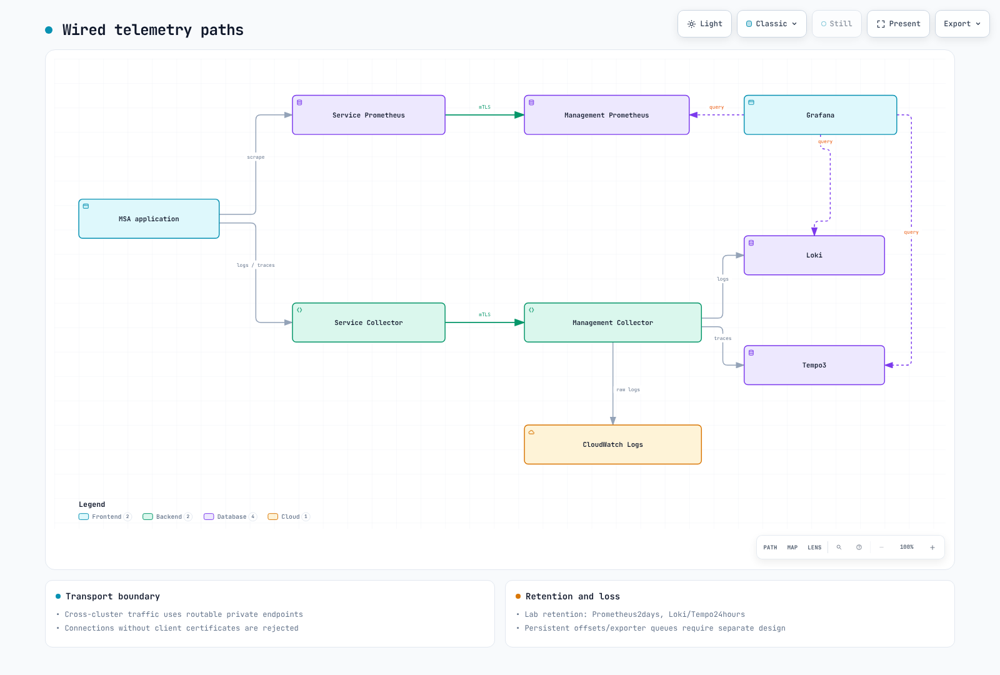

# Parte 2: Desplegar el stack de observabilidad

<span id="architecture-overview"></span>
<span id="cleanup"></span>
<span id="exercise-1-opentelemetry-collector-deployment"></span>
<span id="exercise-2-metrics-stack-deployment"></span>
<span id="exercise-3-logging-stack-deployment"></span>
<span id="exercise-4-tracing-stack-deployment"></span>
<span id="exercise-5-grafana-deployment-and-data-source-configuration"></span>
<span id="exercise-6-alerting-configuration"></span>
<span id="learning-objectives"></span>
<span id="next-steps"></span>
<span id="part-2-observability-stack-deployment"></span>
<span id="prerequisites"></span>
<span id="references"></span>
<span id="steps"></span>
<span id="steps-1"></span>
<span id="steps-2"></span>
<span id="steps-3"></span>
<span id="steps-4"></span>
<span id="steps-5"></span>
<span id="summary"></span>
<span id="troubleshooting"></span>
<span id="verification"></span>
<span id="verification-1"></span>
<span id="verification-2"></span>
<span id="verification-3"></span>
<span id="verification-4"></span>
<span id="verification-5"></span>

> **Dificultad**: Avanzada
> **Última actualización**: September 13, 2026
Conecte las aplicaciones del clúster de servicio a las métricas, logs y traces del clúster de administración. Use los archivos de chart/TLS/identidad fijados en los [ejemplos del stack](https://github.com/Atom-oh/kubernetes-docs/tree/main/examples/labs/observability/stack). La [Parte 1](./01-infrastructure-setup-lab.md) debe proporcionar contextos, gp3/EBS CSI, LBC, DNS/rutas, IRSA y `helm-inputs/collector-identity.yaml`.



[🔍 Ver diagrama interactivo](https://www.atomai.click/kubernetes-docs/archmaps/en-labs-observability-02-observability-stack-lab-0.html)

## 1. Versiones y rutas base {#baseline}

| Componente | Chart | Aplicación |
|---|---|---|
| kube-prometheus-stack | 90.0.0 | Operator0.93.1; inspeccione las imágenes de los componentes |
| Tempo | 3.0.0 | 3.0.3 |
| Loki | 18.13.0 | 3.7.7 |
| OTel Collector | 0.173.1 | contrib0.160.0 |

El Prometheus de servicio recopila métricas y envía remote-write mTLS al Prometheus de administración. Los Collectors reciben logs CRI/JSON y traces OTLP, y los reenvían al endpoint de administración autenticado. El Collector de administración envía a Loki/Tempo; el addon de CloudWatch proporciona logs estructurados para AIOps. Los UID de Grafana usan sistemáticamente `prometheus`, `loki` y `tempo`.

Los backends son instancias de laboratorio únicas y durables, no HA ni capacidad medida. La retención de dos días de Prometheus y de 24 horas de Loki/Tempo no establece un SLO de 30 días.

## 2. Entradas de TLS privado y red {#tls-network}

```bash
cd examples/labs/observability/stack
python3.12 -m venv .venv
.venv/bin/python -m pip install -r requirements.txt
.venv/bin/python prepare_tls.py   --collector-dns "$COLLECTOR_DNS" --prometheus-dns "$PROMETHEUS_DNS"   --output-directory "$LAB_STATE/tls"
.venv/bin/python render_network.py --service-source-cidr "$SERVICE_SOURCE_CIDR"   --nlb-security-group "$NLB_SECURITY_GROUP"   --nlb-source-cidr "$NLB_SUBNET_CIDR_A" --nlb-source-cidr "$NLB_SUBNET_CIDR_B"   --output-directory "$LAB_STATE/network"
```
Genere una CA de laboratorio de siete días y certificados distintos para fines de servidor/cliente. La clave privada de la CA nunca entra en los Secrets del clúster. La PKI organizativa debe proporcionar claves de Secret, SAN y EKU coincidentes. El asistente no crea DNS, rutas ni SG; use los CIDR reales de origen del servicio y de las subredes de comprobación de estado del NLB.

```bash
kubectl --context managed create namespace monitoring --dry-run=client -o yaml | kubectl --context managed apply -f -
kubectl --context service create namespace monitoring --dry-run=client -o yaml | kubectl --context service apply -f -
kubectl --context service create namespace observability --dry-run=client -o yaml | kubectl --context service apply -f -
kubectl --context managed apply -f "$LAB_STATE/tls/management-secrets.yaml"
kubectl --context service apply -f "$LAB_STATE/tls/service-monitoring-secrets.yaml"
kubectl --context service apply -f "$LAB_STATE/tls/service-observability-secrets.yaml"
```

## 3. Instalar backends de administración {#management}

```bash
helm repo add prometheus-community https://prometheus-community.github.io/helm-charts
helm repo add grafana-community https://grafana-community.github.io/helm-charts
helm repo add open-telemetry https://open-telemetry.github.io/opentelemetry-helm-charts
kubectl --context managed apply -f prometheus-probe.yaml
helm upgrade --install lab-monitoring prometheus-community/kube-prometheus-stack   --version 90.0.0 --kube-context managed -n monitoring -f monitoring-management-values.yaml
helm upgrade --install lab-loki grafana-community/loki --version 18.13.0   --kube-context managed -n monitoring -f loki-values.yaml
helm upgrade --install lab-tempo grafana-community/tempo --version 3.0.0   --kube-context managed -n monitoring -f tempo-values.yaml
```
La web de Prometheus requiere mTLS, por lo que los probes HTTPS predeterminados de kubelet no pueden proporcionar el certificado de cliente. Use los probes exec/Secret de cliente de `promtool check ready/healthy --http.config.file=...`; se verificó la combinación de probes de Operator. Grafana y el metrics-generator de Tempo también usan certificados de cliente.

Loki usa Monolithic/TSDB-v13/filesystem-PVC. Tempo3 usa el programador/trabajador de live-store/backend, no configuraciones mezcladas de ingester/compactor de Tempo2. Grafana usa una réplica, PVC y un Secret de administrador privado en lugar de una contraseña compartida conocida. Grafana deshabilita el sidecar de dashboard no utilizado, el token de API y RBAC; los archivos de datasource permanecen montados desde el Secret designado.

## 4. Collectors, endpoints y recopilación de servicio {#collectors}

```bash
helm upgrade --install lab-collector open-telemetry/opentelemetry-collector   --version 0.173.1 --kube-context managed -n monitoring   -f collector-management-values.yaml -f collector-cloudwatch-values.yaml   -f "$LAB_STATE/helm-inputs/collector-identity.yaml"
kubectl --context managed apply -f backend-network-policies.yaml
kubectl --context managed apply -f "$LAB_STATE/network/endpoints.yaml"
kubectl --context managed -n monitoring get svc lab-collector-ingest lab-prometheus-ingest
```
Asigne el DNS privado a los nombres de host internos reales del NLB y verifique el enrutamiento Service-Pod, SG/NACL y el comportamiento de la IP de cliente antes de continuar. No use la dirección `.svc.cluster.local` de otro clúster. TLS termina en Collector/Prometheus, preservando la autenticación de cliente a través del NLB TCP.

```bash
helm upgrade --install lab-service-monitoring prometheus-community/kube-prometheus-stack   --version 90.0.0 --kube-context service -n monitoring   -f monitoring-service-values.yaml -f "$LAB_STATE/tls/prometheus-endpoint-values.yaml"
helm upgrade --install lab-agent open-telemetry/opentelemetry-collector   --version 0.173.1 --kube-context service -n observability   -f collector-service-values.yaml -f "$LAB_STATE/tls/collector-endpoint-values.yaml"
```
El DaemonSet de servicio lee los logs de Pod msa mediante un montaje de solo lectura. El UID root, las capacidades eliminadas y la ausencia de escalamiento de privilegios se especifican explícitamente para el acceso a logs de nodo; permita únicamente este collector en la política de admisión del namespace. El análisis CRI precede al análisis JSON, y los metadatos de Kubernetes se adjuntan en el clúster de origen. El Collector de administración no puede consultar mágicamente los Pods de otro clúster.

Este laboratorio no persiste offsets de archivos/colas de exporter; registre las posibles pérdidas/duplicaciones durante reinicios/interrupciones y diseñe por separado un buffering duradero. CloudWatch `raw_log: true` preserva service/level/trace_id; verifique IRSA y los permisos de Logs reales.

## 5. Verificar datos y ampliar deliberadamente {#verify-extend}

```bash
kubectl --context managed -n monitoring get pods,pvc
kubectl --context service -n observability get pods
kubectl --context managed -n monitoring port-forward svc/lab-grafana 3000:80
```
Inicie sesión con el Secret de administrador privado. Tras el despliegue de la aplicación de la Parte 3, compare los scrapes reales, los errores de exporter, los campos JSON de CloudWatch, los ID de trace de Tempo, trace_id de Loki y los exemplars. Un datasource o una opción de UI habilitada por sí solos no demuestran la ingesta.

VictoriaMetrics/Mimir/AMP, ClickHouse/OpenSearch, X-Ray, AMG y MWAA son extensiones opcionales. Use sus guías de [métricas](../../observability/metrics/README.md), [logging](../../observability/logging/README.md) y [tracing](../../observability/tracing/README.md) para verificar autenticación/almacenamiento/transporte/costo antes de agregarlas. La base no pretende desplegar todos los backends simultáneamente. Continúe con la [Parte 3](./03-msa-deployment-lab.md).

## Alcance de la validación

La validación cubrió la configuración de chart/CRD/nativa, el reenvío mTLS/CRI/JSON real del Collector local, los probes mTLS de Prometheus, la PKI sintética y los esquemas de NetworkPolicy. No se realizaron EKS/LBC/DNS reales, aplicación de políticas, IRSA ni ejecución en vivo de datasource de Grafana.

El perfil de DaemonSet crea explícitamente el Service `lab-agent.observability.svc.cluster.local:4318`. Su `internalTrafficPolicy: Local` predeterminado requiere un Collector listo en cada nodo de aplicación; compruebe taints, tolerations y la disponibilidad del DaemonSet.
