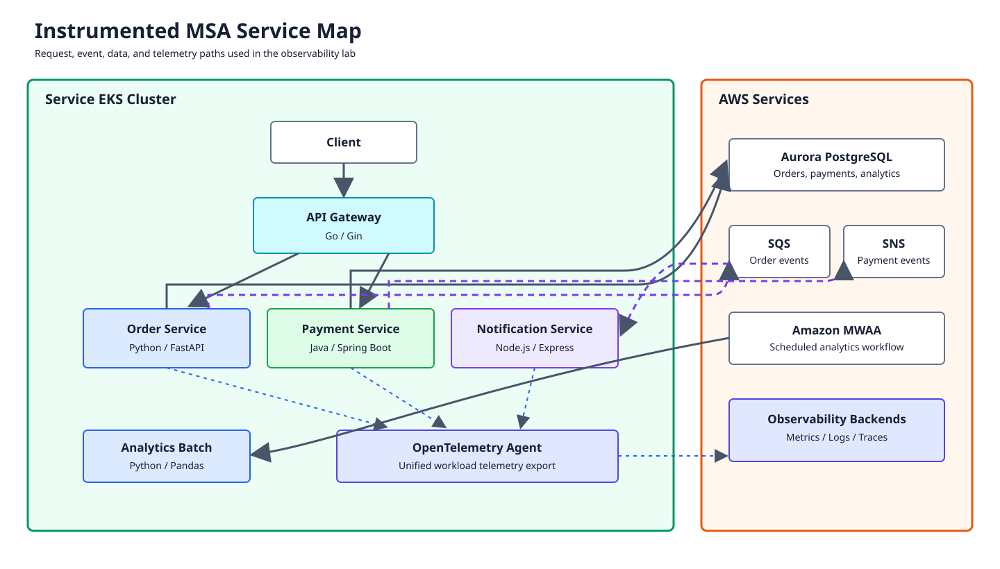
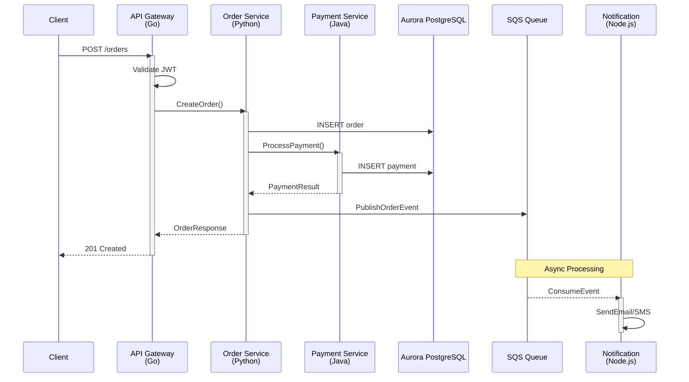
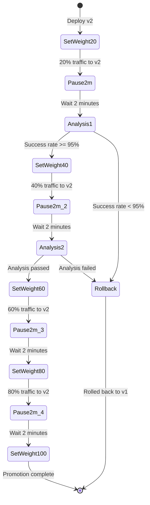

# Parte 3: MSA Deployment y Canary

> **Dificultad**: Avanzado **Tiempo estimado**: 60 minutos **Última actualización**: February 23, 2026

## Objetivos de aprendizaje

* Desplegar aplicaciones MSA mediante la gestión multiclúster de ArgoCD
* Configurar Argo Rollouts para despliegues Canary con AnalysisTemplate
* Implementar la instrumentación automática de OpenTelemetry para todos los Services
* Ejecutar lanzamientos Canary con promoción/reversión basada en observabilidad

## Requisitos previos

* [ ] Completada la [Parte 1: Configuración de infraestructura](01-infrastructure-setup-lab.md)
* [ ] Completada la [Parte 2: Stack de observabilidad](02-observability-stack-lab.md)
* [ ] ArgoCD y Argo Rollouts en ejecución
* [ ] Stack de observabilidad recopilando datos

***

## Descripción general de la arquitectura



### Flujo de llamadas de Service



***

## Ejercicio 1: Descripción general de la aplicación MSA

### Estructura de la aplicación

| Service              | Lenguaje | Framework   | Puerto | Descripción                      |
| -------------------- | -------- | ----------- | ---- | -------------------------------- |
| API Gateway          | Go       | Gin         | 8080 | Enrutamiento de solicitudes, autenticación  |
| Order Service        | Python   | FastAPI     | 8000 | Gestión de pedidos                 |
| Payment Service      | Java     | Spring Boot | 8080 | Procesamiento de pagos               |
| Notification Service | Node.js  | Express     | 3000 | Notificaciones por correo electrónico/SMS          |
| Analytics Batch      | Python   | -           | -    | Analítica diaria (activada por MWAA) |

### Estructura del repositorio

```
obs-lab-msa/
├── api-gateway/
│   ├── main.go
│   ├── Dockerfile
│   └── k8s/
│       ├── deployment.yaml
│       ├── service.yaml
│       └── rollout.yaml
├── order-service/
│   ├── main.py
│   ├── requirements.txt
│   ├── Dockerfile
│   └── k8s/
├── payment-service/
│   ├── src/main/java/...
│   ├── pom.xml
│   ├── Dockerfile
│   └── k8s/
├── notification-service/
│   ├── index.js
│   ├── package.json
│   ├── Dockerfile
│   └── k8s/
├── analytics-batch/
│   ├── main.py
│   ├── Dockerfile
│   └── k8s/
└── argocd/
    ├── app-of-apps.yaml
    └── applicationset.yaml
```

### Fragmentos de código de ejemplo

**API Gateway (Go con OTel)**

```go
package main

import (
    "github.com/gin-gonic/gin"
    "go.opentelemetry.io/contrib/instrumentation/github.com/gin-gonic/gin/otelgin"
    "go.opentelemetry.io/otel"
    "go.opentelemetry.io/otel/exporters/otlp/otlptrace/otlptracehttp"
    "go.opentelemetry.io/otel/sdk/trace"
)

func main() {
    // Initialize OTel
    exporter, _ := otlptracehttp.New(ctx,
        otlptracehttp.WithEndpoint("otel-collector:4318"),
        otlptracehttp.WithInsecure(),
    )
    tp := trace.NewTracerProvider(trace.WithBatcher(exporter))
    otel.SetTracerProvider(tp)

    r := gin.New()
    r.Use(otelgin.Middleware("api-gateway"))

    r.POST("/orders", createOrderHandler)
    r.Run(":8080")
}
```

**Order Service (Python con OTel)**

```python
from fastapi import FastAPI
from opentelemetry import trace
from opentelemetry.instrumentation.fastapi import FastAPIInstrumentor
from opentelemetry.instrumentation.sqlalchemy import SQLAlchemyInstrumentor
from opentelemetry.exporter.otlp.proto.http.trace_exporter import OTLPSpanExporter

app = FastAPI()

# Auto-instrumentation
FastAPIInstrumentor.instrument_app(app)
SQLAlchemyInstrumentor().instrument()

tracer = trace.get_tracer(__name__)

@app.post("/orders")
async def create_order(order: OrderRequest):
    with tracer.start_as_current_span("create_order") as span:
        span.set_attribute("order.amount", order.amount)
        # Business logic...
        return {"order_id": order_id}
```

***

## Ejercicio 2: Configuración de Karpenter NodePool

### Pasos

**Paso 2.1: Cambiar al Service Cluster**

```bash
kubectl config use-context $(kubectl config get-contexts -o name | grep obs-service)
```

**Paso 2.2: Crear un NodePool dedicado para las cargas de trabajo MSA**

```bash
cat <<'EOF' | kubectl apply -f -
apiVersion: karpenter.sh/v1
kind: NodePool
metadata:
  name: msa-workloads
spec:
  template:
    metadata:
      labels:
        workload-type: msa
    spec:
      requirements:
        - key: kubernetes.io/arch
          operator: In
          values: ["amd64"]
        - key: karpenter.sh/capacity-type
          operator: In
          values: ["spot", "on-demand"]
        - key: node.kubernetes.io/instance-type
          operator: In
          values:
            - m5.large
            - m5.xlarge
            - m5.2xlarge
            - c5.large
            - c5.xlarge
            - c5.2xlarge
        - key: topology.kubernetes.io/zone
          operator: In
          values:
            - us-west-2a
            - us-west-2b
            - us-west-2c
      nodeClassRef:
        name: msa-nodeclass
      taints:
        - key: workload-type
          value: msa
          effect: NoSchedule
  limits:
    cpu: 200
    memory: 400Gi
  disruption:
    consolidationPolicy: WhenUnderutilized
    consolidateAfter: 60s
    budgets:
      - nodes: "20%"
---
apiVersion: karpenter.k8s.aws/v1
kind: EC2NodeClass
metadata:
  name: msa-nodeclass
spec:
  amiFamily: AL2
  subnetSelectorTerms:
    - tags:
        karpenter.sh/discovery: obs-service
  securityGroupSelectorTerms:
    - tags:
        karpenter.sh/discovery: obs-service
  role: KarpenterNodeRole-obs-service
  blockDeviceMappings:
    - deviceName: /dev/xvda
      ebs:
        volumeSize: 100Gi
        volumeType: gp3
        iops: 3000
        throughput: 125
        deleteOnTermination: true
  tags:
    Environment: lab
    ManagedBy: karpenter
    WorkloadType: msa
EOF
```

### Verificación

```bash
kubectl get nodepools
kubectl get ec2nodeclasses
# Expected: msa-workloads NodePool and msa-nodeclass EC2NodeClass created
```

***

## Ejercicio 3: Configuración de KEDA ScaledObject

### Pasos

**Paso 3.1: Instalar KEDA**

```bash
helm repo add kedacore https://kedacore.github.io/charts
helm repo update

helm install keda kedacore/keda \
  --namespace keda \
  --create-namespace \
  --version 2.13.0 \
  --set serviceAccount.annotations."eks\.amazonaws\.com/role-arn"=arn:aws:iam::${ACCOUNT_ID}:role/obs-lab-keda \
  --wait
```

**Paso 3.2: Crear un ScaledObject para Notification Service (basado en SQS)**

```bash
kubectl create namespace msa

cat <<'EOF' | kubectl apply -f -
apiVersion: keda.sh/v1alpha1
kind: TriggerAuthentication
metadata:
  name: aws-credentials
  namespace: msa
spec:
  podIdentity:
    provider: aws-eks
---
apiVersion: keda.sh/v1alpha1
kind: ScaledObject
metadata:
  name: notification-scaler
  namespace: msa
spec:
  scaleTargetRef:
    name: notification-service
  pollingInterval: 15
  cooldownPeriod: 60
  minReplicaCount: 1
  maxReplicaCount: 20
  triggers:
    - type: aws-sqs-queue
      authenticationRef:
        name: aws-credentials
      metadata:
        queueURL: "${SQS_QUEUE_URL}"
        queueLength: "10"
        awsRegion: "${AWS_REGION}"
        identityOwner: operator
EOF
```

**Paso 3.3: Crear un ScaledObject para Order Service (basado en Prometheus)**

```bash
cat <<'EOF' | kubectl apply -f -
apiVersion: keda.sh/v1alpha1
kind: ScaledObject
metadata:
  name: order-service-scaler
  namespace: msa
spec:
  scaleTargetRef:
    name: order-service
  pollingInterval: 15
  cooldownPeriod: 120
  minReplicaCount: 2
  maxReplicaCount: 30
  advanced:
    horizontalPodAutoscalerConfig:
      behavior:
        scaleDown:
          stabilizationWindowSeconds: 300
          policies:
            - type: Percent
              value: 10
              periodSeconds: 60
        scaleUp:
          stabilizationWindowSeconds: 0
          policies:
            - type: Percent
              value: 100
              periodSeconds: 15
            - type: Pods
              value: 4
              periodSeconds: 15
          selectPolicy: Max
  triggers:
    - type: prometheus
      metadata:
        serverAddress: http://kube-prometheus-stack-prometheus.monitoring.svc.cluster.local:9090
        metricName: http_requests_per_second
        threshold: "100"
        query: |
          sum(rate(http_server_request_count{service="order-service"}[1m]))
EOF
```

### Verificación

```bash
kubectl get scaledobjects -n msa
kubectl get hpa -n msa
# Expected: ScaledObjects created, HPAs auto-generated
```

***

## Ejercicio 4: Despliegue de ArgoCD Application

### Pasos

**Paso 4.1: Cambiar al Managed Cluster (host de ArgoCD)**

```bash
kubectl config use-context $(kubectl config get-contexts -o name | grep obs-managed)
```

**Paso 4.2: Crear la App-of-Apps de ArgoCD**

```bash
cat <<'EOF' | kubectl apply -f -
apiVersion: argoproj.io/v1alpha1
kind: Application
metadata:
  name: obs-lab-msa
  namespace: argocd
  finalizers:
    - resources-finalizer.argocd.argoproj.io
spec:
  project: default
  source:
    repoURL: https://github.com/your-org/obs-lab-msa.git
    targetRevision: main
    path: argocd
  destination:
    server: https://kubernetes.default.svc
    namespace: argocd
  syncPolicy:
    automated:
      prune: true
      selfHeal: true
    syncOptions:
      - CreateNamespace=true
      - PruneLast=true
EOF
```

**Paso 4.3: Crear un ApplicationSet para los Services MSA**

```bash
cat <<'EOF' | kubectl apply -f -
apiVersion: argoproj.io/v1alpha1
kind: ApplicationSet
metadata:
  name: msa-services
  namespace: argocd
spec:
  generators:
    - list:
        elements:
          - service: api-gateway
            language: go
            port: "8080"
          - service: order-service
            language: python
            port: "8000"
          - service: payment-service
            language: java
            port: "8080"
          - service: notification-service
            language: nodejs
            port: "3000"
  template:
    metadata:
      name: '{{service}}'
      namespace: argocd
      labels:
        app.kubernetes.io/name: '{{service}}'
        app.kubernetes.io/part-of: obs-lab-msa
    spec:
      project: default
      source:
        repoURL: https://github.com/your-org/obs-lab-msa.git
        targetRevision: main
        path: '{{service}}/k8s'
        helm:
          valueFiles:
            - values.yaml
          parameters:
            - name: image.tag
              value: latest
            - name: service.port
              value: '{{port}}'
      destination:
        server: https://obs-service-cluster-endpoint  # Service cluster
        namespace: msa
      syncPolicy:
        automated:
          prune: true
          selfHeal: true
        syncOptions:
          - CreateNamespace=true
EOF
```

**Paso 4.4: Desplegar directamente manifiestos MSA de ejemplo (para el laboratorio)**

```bash
# Switch to Service Cluster
kubectl config use-context $(kubectl config get-contexts -o name | grep obs-service)

# Create namespace
kubectl create namespace msa --dry-run=client -o yaml | kubectl apply -f -

# Deploy API Gateway
cat <<'EOF' | kubectl apply -f -
apiVersion: apps/v1
kind: Deployment
metadata:
  name: api-gateway
  namespace: msa
  labels:
    app: api-gateway
    version: v1
spec:
  replicas: 2
  selector:
    matchLabels:
      app: api-gateway
  template:
    metadata:
      labels:
        app: api-gateway
        version: v1
      annotations:
        instrumentation.opentelemetry.io/inject-go: "true"
    spec:
      tolerations:
        - key: workload-type
          value: msa
          effect: NoSchedule
      nodeSelector:
        workload-type: msa
      containers:
        - name: api-gateway
          image: obs-lab/api-gateway:v1
          ports:
            - containerPort: 8080
          env:
            - name: OTEL_EXPORTER_OTLP_ENDPOINT
              value: "http://otel-collector-gateway.opentelemetry.svc.cluster.local:4317"
            - name: OTEL_SERVICE_NAME
              value: "api-gateway"
            - name: ORDER_SERVICE_URL
              value: "http://order-service:8000"
            - name: PAYMENT_SERVICE_URL
              value: "http://payment-service:8080"
          resources:
            requests:
              cpu: 100m
              memory: 128Mi
            limits:
              cpu: 500m
              memory: 512Mi
          livenessProbe:
            httpGet:
              path: /health
              port: 8080
            initialDelaySeconds: 10
            periodSeconds: 10
          readinessProbe:
            httpGet:
              path: /ready
              port: 8080
            initialDelaySeconds: 5
            periodSeconds: 5
---
apiVersion: v1
kind: Service
metadata:
  name: api-gateway
  namespace: msa
spec:
  selector:
    app: api-gateway
  ports:
    - port: 8080
      targetPort: 8080
  type: LoadBalancer
EOF

# Deploy Order Service
cat <<'EOF' | kubectl apply -f -
apiVersion: apps/v1
kind: Deployment
metadata:
  name: order-service
  namespace: msa
  labels:
    app: order-service
    version: v1
spec:
  replicas: 2
  selector:
    matchLabels:
      app: order-service
  template:
    metadata:
      labels:
        app: order-service
        version: v1
      annotations:
        instrumentation.opentelemetry.io/inject-python: "true"
    spec:
      tolerations:
        - key: workload-type
          value: msa
          effect: NoSchedule
      containers:
        - name: order-service
          image: obs-lab/order-service:v1
          ports:
            - containerPort: 8000
          env:
            - name: OTEL_EXPORTER_OTLP_ENDPOINT
              value: "http://otel-collector-gateway.opentelemetry.svc.cluster.local:4317"
            - name: OTEL_SERVICE_NAME
              value: "order-service"
            - name: DATABASE_URL
              valueFrom:
                secretKeyRef:
                  name: aurora-credentials
                  key: url
            - name: SQS_QUEUE_URL
              value: "${SQS_QUEUE_URL}"
          resources:
            requests:
              cpu: 200m
              memory: 256Mi
            limits:
              cpu: 1000m
              memory: 1Gi
---
apiVersion: v1
kind: Service
metadata:
  name: order-service
  namespace: msa
spec:
  selector:
    app: order-service
  ports:
    - port: 8000
      targetPort: 8000
EOF

# Deploy Payment Service
cat <<'EOF' | kubectl apply -f -
apiVersion: apps/v1
kind: Deployment
metadata:
  name: payment-service
  namespace: msa
  labels:
    app: payment-service
    version: v1
spec:
  replicas: 2
  selector:
    matchLabels:
      app: payment-service
  template:
    metadata:
      labels:
        app: payment-service
        version: v1
      annotations:
        instrumentation.opentelemetry.io/inject-java: "true"
    spec:
      tolerations:
        - key: workload-type
          value: msa
          effect: NoSchedule
      containers:
        - name: payment-service
          image: obs-lab/payment-service:v1
          ports:
            - containerPort: 8080
          env:
            - name: OTEL_EXPORTER_OTLP_ENDPOINT
              value: "http://otel-collector-gateway.opentelemetry.svc.cluster.local:4317"
            - name: OTEL_SERVICE_NAME
              value: "payment-service"
            - name: SPRING_DATASOURCE_URL
              valueFrom:
                secretKeyRef:
                  name: aurora-credentials
                  key: jdbc-url
          resources:
            requests:
              cpu: 200m
              memory: 512Mi
            limits:
              cpu: 1000m
              memory: 2Gi
---
apiVersion: v1
kind: Service
metadata:
  name: payment-service
  namespace: msa
spec:
  selector:
    app: payment-service
  ports:
    - port: 8080
      targetPort: 8080
EOF

# Deploy Notification Service
cat <<'EOF' | kubectl apply -f -
apiVersion: apps/v1
kind: Deployment
metadata:
  name: notification-service
  namespace: msa
  labels:
    app: notification-service
    version: v1
spec:
  replicas: 1
  selector:
    matchLabels:
      app: notification-service
  template:
    metadata:
      labels:
        app: notification-service
        version: v1
      annotations:
        instrumentation.opentelemetry.io/inject-nodejs: "true"
    spec:
      tolerations:
        - key: workload-type
          value: msa
          effect: NoSchedule
      containers:
        - name: notification-service
          image: obs-lab/notification-service:v1
          ports:
            - containerPort: 3000
          env:
            - name: OTEL_EXPORTER_OTLP_ENDPOINT
              value: "http://otel-collector-gateway.opentelemetry.svc.cluster.local:4317"
            - name: OTEL_SERVICE_NAME
              value: "notification-service"
            - name: SQS_QUEUE_URL
              value: "${SQS_QUEUE_URL}"
          resources:
            requests:
              cpu: 100m
              memory: 128Mi
            limits:
              cpu: 500m
              memory: 512Mi
---
apiVersion: v1
kind: Service
metadata:
  name: notification-service
  namespace: msa
spec:
  selector:
    app: notification-service
  ports:
    - port: 3000
      targetPort: 3000
EOF
```

### Verificación

```bash
kubectl get pods -n msa
kubectl get svc -n msa
# Expected: All 4 services running
```

***

## Ejercicio 5: Instrumentación automática de OpenTelemetry

### Pasos

**Paso 5.1: Instalar OpenTelemetry Operator**

```bash
# Install cert-manager (required by OTel Operator)
kubectl apply -f https://github.com/cert-manager/cert-manager/releases/download/v1.14.0/cert-manager.yaml

# Wait for cert-manager
kubectl wait --for=condition=available --timeout=300s deployment/cert-manager -n cert-manager
kubectl wait --for=condition=available --timeout=300s deployment/cert-manager-webhook -n cert-manager

# Install OTel Operator
kubectl apply -f https://github.com/open-telemetry/opentelemetry-operator/releases/download/v0.95.0/opentelemetry-operator.yaml
```

**Paso 5.2: Crear recursos Instrumentation**

```bash
cat <<'EOF' | kubectl apply -f -
apiVersion: opentelemetry.io/v1alpha1
kind: Instrumentation
metadata:
  name: otel-instrumentation
  namespace: msa
spec:
  exporter:
    endpoint: http://otel-collector-gateway.opentelemetry.svc.cluster.local:4317
  propagators:
    - tracecontext
    - baggage
    - b3
  sampler:
    type: parentbased_traceidratio
    argument: "1"

  python:
    env:
      - name: OTEL_PYTHON_LOG_CORRELATION
        value: "true"
      - name: OTEL_PYTHON_LOG_LEVEL
        value: "info"
      - name: OTEL_PYTHON_LOGGING_AUTO_INSTRUMENTATION_ENABLED
        value: "true"

  java:
    env:
      - name: OTEL_JAVAAGENT_DEBUG
        value: "false"
      - name: OTEL_INSTRUMENTATION_JDBC_ENABLED
        value: "true"
      - name: OTEL_INSTRUMENTATION_SPRING_WEBMVC_ENABLED
        value: "true"

  nodejs:
    env:
      - name: OTEL_NODE_RESOURCE_DETECTORS
        value: "env,host,os"

  go:
    env:
      - name: OTEL_GO_AUTO_TARGET_EXE
        value: "/app/api-gateway"
EOF
```

**Paso 5.3: Tabla de cobertura de instrumentación automática**

| Lenguaje | Bibliotecas instrumentadas               | Anotación                                               |
| -------- | ------------------------------------ | -------------------------------------------------------- |
| Go       | gin, net/http, gRPC                  | `instrumentation.opentelemetry.io/inject-go: "true"`     |
| Python   | FastAPI, SQLAlchemy, boto3, requests | `instrumentation.opentelemetry.io/inject-python: "true"` |
| Java     | Spring Boot, JDBC, Kafka, gRPC       | `instrumentation.opentelemetry.io/inject-java: "true"`   |
| Node.js  | Express, pg, aws-sdk, http           | `instrumentation.opentelemetry.io/inject-nodejs: "true"` |

**Paso 5.4: Reiniciar los Deployments para aplicar la instrumentación**

```bash
kubectl rollout restart deployment -n msa
kubectl rollout status deployment -n msa --timeout=300s
```

### Verificación

```bash
# Check pods have init containers injected
kubectl get pods -n msa -o jsonpath='{range .items[*]}{.metadata.name}{"\t"}{.spec.initContainers[*].name}{"\n"}{end}'

# Check traces are being generated
kubectl logs -n opentelemetry -l app=otel-collector --tail=50 | grep "trace"
```

***

## Ejercicio 6: Despliegue Canary de Argo Rollouts

### Pasos

**Paso 6.1: Convertir Order Service en un Rollout**

```bash
cat <<'EOF' | kubectl apply -f -
apiVersion: argoproj.io/v1alpha1
kind: Rollout
metadata:
  name: order-service
  namespace: msa
spec:
  replicas: 4
  revisionHistoryLimit: 3
  selector:
    matchLabels:
      app: order-service
  template:
    metadata:
      labels:
        app: order-service
      annotations:
        instrumentation.opentelemetry.io/inject-python: "true"
    spec:
      tolerations:
        - key: workload-type
          value: msa
          effect: NoSchedule
      containers:
        - name: order-service
          image: obs-lab/order-service:v1
          ports:
            - containerPort: 8000
          env:
            - name: OTEL_EXPORTER_OTLP_ENDPOINT
              value: "http://otel-collector-gateway.opentelemetry.svc.cluster.local:4317"
            - name: OTEL_SERVICE_NAME
              value: "order-service"
            - name: VERSION
              value: "v1"
          resources:
            requests:
              cpu: 200m
              memory: 256Mi
            limits:
              cpu: 1000m
              memory: 1Gi
  strategy:
    canary:
      canaryService: order-service-canary
      stableService: order-service-stable
      trafficRouting:
        nginx:
          stableIngress: order-service-ingress
      steps:
        - setWeight: 20
        - pause: {duration: 2m}
        - analysis:
            templates:
              - templateName: success-rate
            args:
              - name: service-name
                value: order-service
        - setWeight: 40
        - pause: {duration: 2m}
        - analysis:
            templates:
              - templateName: success-rate
        - setWeight: 60
        - pause: {duration: 2m}
        - setWeight: 80
        - pause: {duration: 2m}
        - setWeight: 100
      analysis:
        templates:
          - templateName: success-rate
        startingStep: 2
        args:
          - name: service-name
            value: order-service
---
apiVersion: v1
kind: Service
metadata:
  name: order-service-stable
  namespace: msa
spec:
  selector:
    app: order-service
  ports:
    - port: 8000
      targetPort: 8000
---
apiVersion: v1
kind: Service
metadata:
  name: order-service-canary
  namespace: msa
spec:
  selector:
    app: order-service
  ports:
    - port: 8000
      targetPort: 8000
EOF
```

**Paso 6.2: Crear un AnalysisTemplate**

```bash
cat <<'EOF' | kubectl apply -f -
apiVersion: argoproj.io/v1alpha1
kind: AnalysisTemplate
metadata:
  name: success-rate
  namespace: msa
spec:
  args:
    - name: service-name
  metrics:
    - name: success-rate
      interval: 30s
      count: 5
      successCondition: result[0] >= 0.95
      failureLimit: 3
      provider:
        prometheus:
          address: http://kube-prometheus-stack-prometheus.monitoring.svc.cluster.local:9090
          query: |
            sum(rate(http_server_request_count{service="{{args.service-name}}",http_status_code!~"5.."}[2m]))
            /
            sum(rate(http_server_request_count{service="{{args.service-name}}"}[2m]))

    - name: latency-p99
      interval: 30s
      count: 5
      successCondition: result[0] <= 500
      failureLimit: 3
      provider:
        prometheus:
          address: http://kube-prometheus-stack-prometheus.monitoring.svc.cluster.local:9090
          query: |
            histogram_quantile(0.99, sum(rate(http_server_request_duration_seconds_bucket{service="{{args.service-name}}"}[2m])) by (le)) * 1000

    - name: error-count
      interval: 30s
      count: 5
      successCondition: result[0] <= 5
      failureLimit: 2
      provider:
        prometheus:
          address: http://kube-prometheus-stack-prometheus.monitoring.svc.cluster.local:9090
          query: |
            sum(increase(http_server_request_count{service="{{args.service-name}}",http_status_code=~"5.."}[2m]))
EOF
```

### Diagrama de estado Canary



**Paso 6.3: Activar el despliegue Canary (actualizar imagen)**

```bash
# Update to v2
kubectl argo rollouts set image order-service \
  order-service=obs-lab/order-service:v2 \
  -n msa

# Watch rollout progress
kubectl argo rollouts get rollout order-service -n msa --watch
```

### Verificación

```bash
# Check rollout status
kubectl argo rollouts status order-service -n msa

# View in Argo Rollouts dashboard
ROLLOUTS_DASHBOARD=$(kubectl -n argo-rollouts get svc argo-rollouts-dashboard \
  -o jsonpath='{.status.loadBalancer.ingress[0].hostname}')
echo "Dashboard: http://$ROLLOUTS_DASHBOARD:3100/rollout/msa/order-service"
```

***

## Ejercicio 7: Fallo intencional y reversión automática

### Pasos

**Paso 7.1: Desplegar una versión con errores**

```bash
# Deploy v3 with intentional errors (returns 500 for 30% of requests)
kubectl argo rollouts set image order-service \
  order-service=obs-lab/order-service:v3-failing \
  -n msa
```

**Paso 7.2: Supervisar el análisis Canary**

```bash
# Watch analysis results
kubectl argo rollouts get rollout order-service -n msa --watch

# Check AnalysisRun
kubectl get analysisruns -n msa -l rollouts-pod-template-hash
kubectl describe analysisrun -n msa $(kubectl get analysisruns -n msa -o jsonpath='{.items[0].metadata.name}')
```

**Paso 7.3: Verificar la reversión automática**

```bash
# After analysis failure, rollout should automatically abort
kubectl argo rollouts status order-service -n msa

# Expected output: "Degraded - RolloutAborted: Rollout aborted due to analysis failure"
```

**Paso 7.4: Comprobar la división de tráfico en Grafana**

```bash
# Open Grafana and check:
# 1. Request rate by version (v1 vs v3-failing)
# 2. Error rate spike during canary
# 3. Automatic rollback to v1

echo "Grafana URL: http://$GRAFANA_URL"
echo "Check dashboard: Kubernetes / Deployment"
```

### Verificación

```bash
# Verify all pods are running v1 after rollback
kubectl get pods -n msa -l app=order-service -o jsonpath='{range .items[*]}{.metadata.name}{"\t"}{.spec.containers[0].image}{"\n"}{end}'

# All should show v1 or stable version
```

***

## Resumen

En este laboratorio, has:

| Tarea                                  | Estado     |
| ------------------------------------- | ---------- |
| Karpenter NodePool para MSA            | Configurado |
| KEDA ScaledObjects (SQS + Prometheus) | Creados    |
| ArgoCD ApplicationSet                 | Desplegado   |
| MSA Services (4 Services)             | En ejecución    |
| Instrumentación automática de OTel             | Habilitada    |
| Argo Rollouts Canary                  | Configurado |
| AnalysisTemplate                      | Creado    |
| Prueba de fallo/reversión                 | Completada  |

## Limpieza

La limpieza se realizará en la [Parte 6](06-distributed-tracing-lab.md#cleanup).

## Solución de problemas

<details>

<summary>La instrumentación de OTel no se está inyectando</summary>

* Verifica que OTel Operator esté en ejecución: `kubectl get pods -n opentelemetry-operator-system`
* Comprueba el recurso Instrumentation: `kubectl get instrumentation -n msa`
* Asegúrate de que las anotaciones de los Pod sean correctas
* Reinicia los Pod después de crear Instrumentation

</details>

<details>

<summary>El análisis Canary falla siempre</summary>

* Comprueba la sintaxis de la consulta de Prometheus en AnalysisTemplate
* Verifica que se estén recopilando métricas: prueba la consulta en Grafana Explore
* Comprueba los logs de AnalysisRun: `kubectl describe analysisrun -n msa <name>`
* Ajusta las condiciones de éxito/fallo si es necesario

</details>

<details>

<summary>KEDA no está escalando</summary>

* Verifica los permisos de IRSA para el acceso a SQS
* Comprueba los logs del operador KEDA: `kubectl logs -n keda -l app=keda-operator`
* Prueba las métricas de SQS: `aws sqs get-queue-attributes --queue-url $SQS_QUEUE_URL --attribute-names ApproximateNumberOfMessages`

</details>

## Siguientes pasos

Continúa con la [Parte 4: Pruebas de carga y autoescalado](04-load-testing-scaling-lab.md) para realizar pruebas de estrés de la aplicación MSA.

## Referencias

* [Documentación de ArgoCD](../../gitops/argocd/)
* [Documentación de Argo Rollouts](../../gitops/argocd/05-traffic-management.md)
* [Documentación de KEDA](../../autoscaling/01-keda.md)
* [Documentación de Karpenter](../../autoscaling/02-karpenter.md)
* [Documentación de OpenTelemetry](../../observability/tracing/03-opentelemetry.md)
