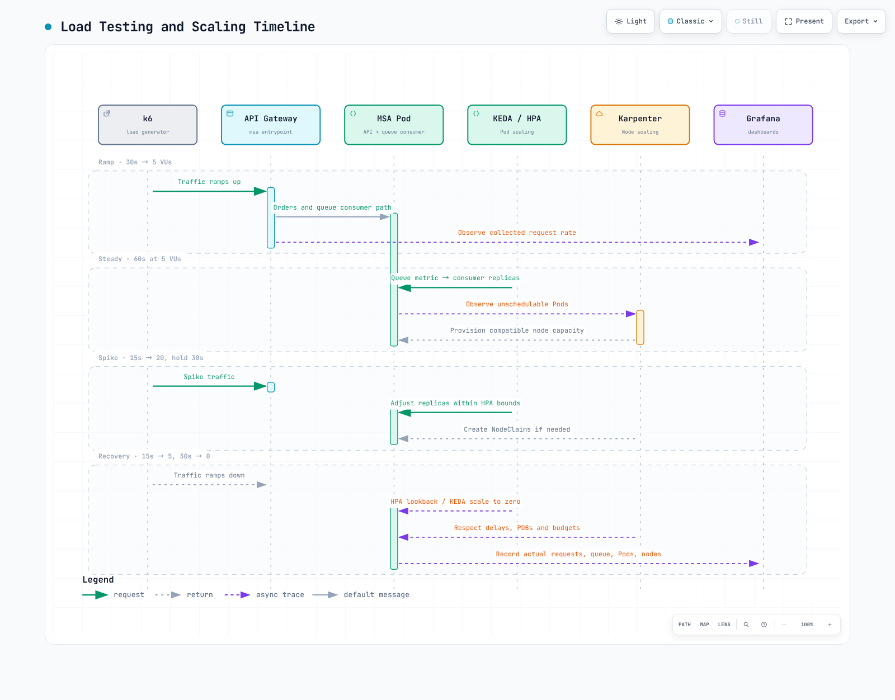

# Parte 4: Pruebas de carga y escalado automático

<span id="exercise-1-k6-load-test-scenario"></span>
<span id="exercise-2-locust-alternative-python-based"></span>
<span id="exercise-3-observe-autoscaling-during-load"></span>
<span id="exercise-4-cool-down-and-scale-in-observation"></span>
<span id="exercise-5-grafana-scaling-dashboard"></span>
<span id="key-observations"></span>
<span id="learning-objectives"></span>
<span id="load-testing-and-scaling-timeline"></span>
<span id="next-steps"></span>
<span id="references"></span>
<span id="steps"></span>
<span id="steps-1"></span>
<span id="steps-2"></span>
<span id="steps-3"></span>
<span id="steps-4"></span>
<span id="summary"></span>
<span id="troubleshooting"></span>
<span id="verification"></span>

> **Dificultad**: Intermedio · **Tiempo estimado**: 45 minutos
> **Última actualización**: September 13, 2026

Ejecute el mismo flujo de pedido/pago/lectura con k6 y Locust, y luego explique los cambios observados en los Pod y los nodos. Diríjase únicamente a su API de laboratorio desechable. Los recuentos de VU y los umbrales de latencia son configuraciones del ejercicio, no resultados medidos de rendimiento ni de escalado.

## Requisitos previos {#prerequisites}

- La API de la [Parte 3](./03-msa-deployment-lab.md) debe estar lista: `POST /orders` devuelve `201` e `id`; `POST /payments` devuelve `200/201` y `status: completed`; `GET /orders/{id}` devuelve ese ID. Cambie las rutas, las cargas útiles y las aserciones conjuntamente para otra API.
- El contexto del clúster de servicio es `service`; cada comando lo selecciona explícitamente.
- Los ejemplos se verificaron con k6 **2.2.0** y Locust **2.46.5**/Python **3.12**. Siga la [guía oficial de instalación](https://grafana.com/docs/k6/latest/set-up/install-k6/) para la arquitectura de su SO/CPU.
- Configure el KEDA ScaledObject y el Karpenter NodePool/EC2NodeClass en la [Parte 3](./03-msa-deployment-lab.md). Las consultas de infraestructura requieren una ingesta real de kube-state-metrics/cAdvisor.



[🔍 Ver diagrama interactivo](https://www.atomai.click/kubernetes-docs/archmaps/en-labs-observability-04-load-testing-scaling-lab-0.html)

## 1. Verifique la API con una prueba pequeña {#smoke-test}

Use `k6-scenario.js` de los [ejemplos ejecutables](https://github.com/Atom-oh/kubernetes-docs/tree/main/examples/labs/observability/load-test). Mantenga el port-forward en ejecución en su terminal.

```bash
# Run from the repository root.
cd examples/labs/observability/load-test
kubectl --context service -n msa port-forward svc/api-gateway 8080:8080
```

```bash
# In another terminal, from the same directory.
BASE_URL=http://127.0.0.1:8080 LOAD_PROFILE=smoke \
  k6 run --no-usage-report k6-scenario.js
```

La prueba de humo predeterminada ejecuta dos iteraciones con un VU. Lee únicamente los ID creados por la prueba y rechaza JSON no válido, ID ausentes, pagos rechazados y un pedido distinto en la respuesta. Los umbrales convierten resultados `check()` fallidos en una salida distinta de cero. Inspeccione tanto `k6-summary.json` como el código de salida. `summaryTrendStats` incluye `p(99)` porque el resumen lo muestra.

## 2. Ejecute etapas de carga continua {#load-stages}

```bash
BASE_URL=http://127.0.0.1:8080 LOAD_PROFILE=scale \
  k6 run --no-usage-report k6-scenario.js
```

| Etapa | Duración | VU objetivo |
|---|---|---|
| Aumento gradual | 30s | 5 |
| Estable | 60s | 5 |
| Aumento gradual de pico | 15s | 20 |
| Mantenimiento de pico | 30s | 20 |
| Recuperación | 15s | 5 |
| Enfriamiento | 30s | 0 |

Las etapas suman tres minutos, con posible tiempo adicional de detención gradual. Una secuencia `stages` evita escenarios independientes superpuestos. Los VU no son RPS: el tiempo de respuesta, las solicitudes por iteración y la espera determinan el rendimiento. Aumente la carga solo después de comprobar la capacidad y el presupuesto del NodePool. Los límites del controlador y las notificaciones de AWS Budgets no son barreras absolutas de gasto.

`k6-job.yaml` es una alternativa **solo de humo** dentro del clúster. Primero cree el ConfigMap `obs-lab-k6` mediante los comandos de su README. El Job tiene cero reintentos, un plazo de 120 segundos y límites de recursos. La creación del Job no demuestra el éxito de la prueba; inspeccione los registros, el código de salida del Pod y las condiciones Complete/Failed.

## 3. Alternativa con Locust {#locust}

```bash
python3.12 -m venv .venv
.venv/bin/python -m pip install -r requirements.txt
.venv/bin/locust -f locustfile.py --headless \
  --host http://127.0.0.1:8080 --users 1 --spawn-rate 1 \
  --run-time 10s --stop-timeout 5 --exit-code-on-error 99 \
  --csv locust-results
```

El modo sin interfaz evita exponer una UI de administración o un servicio RPC de worker. La ejecución distribuida requiere su propia autenticación, red interna y configuración de worker. Ambas herramientas prueban el mismo flujo de API, pero sus planificadores difieren; los recuentos iguales de VU/usuario por sí solos no hacen equivalentes los experimentos.

## 4. Observe los Pod y los nodos por separado {#observe-scaling}

```bash
kubectl --context service -n msa get scaledobject,hpa
kubectl --context service -n msa describe scaledobject
kubectl --context service -n msa get pods -o wide
kubectl --context service get nodepools,nodeclaims
kubectl --context service get nodes -L karpenter.sh/nodepool,karpenter.sh/capacity-type
kubectl --context service -n msa get events --sort-by=.metadata.creationTimestamp
```

El escalador SQS lee los atributos de la cola; no consume mensajes. Compruebe que la cola del consumidor y la URL de ScaledObject coincidan. `queueLength` es un objetivo por Pod; los recuentos de mensajes, los ajustes de en vuelo/retrasados, los límites de réplicas y el comportamiento de HPA afectan los resultados. Escalar solo el productor de API no resuelve una acumulación de trabajo del consumidor.

Karpenter aprovisiona capacidad para Pod no programables cuyos requisitos pueden satisfacer sus NodePool. Diagnostique también las descargas de imágenes, los PVC y los taints: más nodos podrían no resolverlos. Seleccione nodos mediante etiquetas reales de NodePool, no mediante subcadenas de nombres de host.

## 5. Dashboards y consultas {#dashboard-queries}

```promql
# Running Pods: phase series also exist with value zero.
sum(kube_pod_status_phase{namespace="msa", phase="Running"})

# Deployment total/ready replicas are different measurements.
kube_deployment_status_replicas{namespace="msa"}
kube_deployment_status_replicas_ready{namespace="msa"}

# HPA desired/current replicas.
kube_horizontalpodautoscaler_status_desired_replicas{namespace="msa"}
kube_horizontalpodautoscaler_status_current_replicas{namespace="msa"}

# Container resource usage; exclude the empty and Pod infrastructure series.
sum by (pod) (rate(container_cpu_usage_seconds_total{namespace="msa", container!="", container!="POD"}[5m]))
sum by (pod) (container_memory_working_set_bytes{namespace="msa", container!="", container!="POD"})
```

Sumar los indicadores 0/1 de la fase Running devuelve cero cuando todos los Pod observados están Pending y permanece ausente cuando falta telemetría. Filtrar todas las series con `== 1` pierde esa distinción.

`kube_deployment_status_replicas` no es el recuento listo. Para una carga de trabajo Rollout, use el estado de Rollouts exporter/ReplicaSet/Pod en lugar de asumir que existen métricas de Deployment. Las etiquetas de nodos personalizadas aparecen en `kube_node_labels` solo cuando kube-state-metrics las permite. `changes(kube_node_created[10m])` observa una marca de tiempo de creación constante y no detecta nodos creados recientemente.

Antes de añadir paneles RED, inspeccione los nombres, unidades y etiquetas de las métricas reales de la aplicación. Los histogramas HTTP de OTel y los contadores Prometheus personalizados pueden diferir. Agregue etiquetas acotadas de servicio/ruta/estado; nunca use ID de pedido o cliente como etiquetas. Calcule las proporciones de errores sobre el mismo alcance de servicio/ruta y muestre los intervalos sin tráfico como mediciones ausentes.

## 6. Reducción y registro de verificación {#scale-in}

| Control | Significado real |
|---|---|
| KEDA `cooldownPeriod` | Espera después del último activador activo al escalar **a cero** |
| HPA `scaleDown.stabilizationWindowSeconds` | Considera la recomendación más alta de la ventana retrospectiva para el escalado de 1→N |
| Karpenter `consolidateAfter` | Retraso antes de considerar la consolidación tras cambios en los Pod |
| PDB/presupuesto de interrupciones/restricciones | Puede retrasar o bloquear la consolidación/terminación |

No prometa una eliminación instantánea de nodos vacíos ni un recuento exacto de réplicas en un minuto fijo. Registre los RPS, errores, p99, profundidad de cola, Pod deseados/listos, NodeClaims y motivos Pending reales de línea base/pico/recuperación. El recuento de nodos por sí solo no puede cuantificar el ahorro total de AWS.

## Limpieza y próximos pasos {#cleanup}

Confirme que la prueba se detuvo, elimine su Job/ConfigMap `obs-lab-k6-smoke` si se utilizó y detenga el port-forward. Continúe con la [Parte 5](./05-alerting-aiops-lab.md) para la validación de alertas. Siga la [Parte 6](./06-distributed-tracing-lab.md#cleanup) para la limpieza de infraestructura.

## Referencias y alcance de la validación

- [umbrales de k6](https://grafana.com/docs/k6/latest/using-k6/thresholds/)
- [Locust](https://docs.locust.io/en/stable/running-without-web-ui.html)
- [KEDA ScaledObject](https://keda.sh/docs/2.20/reference/scaledobject-spec/)
- [interrupción de Karpenter](https://karpenter.sh/docs/concepts/disruption/)
- [Prometheus](../../observability/metrics/01-prometheus.md)

Cada herramienta real de k6/Locust se probó contra un servidor HTTP sintético de loopback para seis casos de éxito/error. No se ejecutó ninguna prueba de clúster, MSA real, carga de AWS, escalado de nodos ni capacidad.
