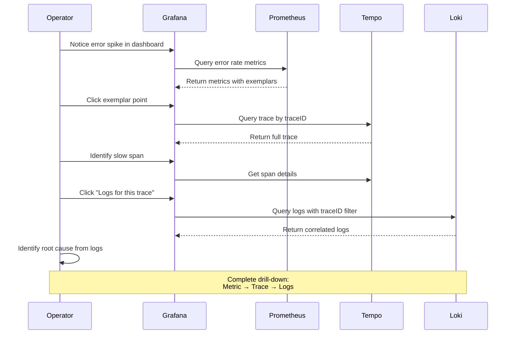
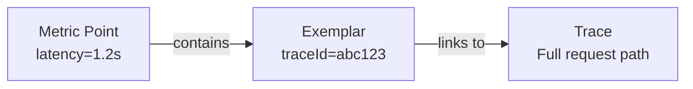

# Parte 6: Análisis de trazabilidad distribuida

> **Dificultad**: Avanzado
> **Tiempo estimado**: 45 minutos
> **Última actualización**: February 22, 2026

## Objetivos de aprendizaje

- Realizar análisis de trazas de extremo a extremo usando Tempo y Grafana
- Identificar cuellos de botella de servicios y problemas de rendimiento
- Configurar la correlación Loki-Tempo para la vinculación de logs y trazas
- Usar Exemplars para profundizar de métricas a trazas
- Crear dashboards de observabilidad integrales

## Requisitos previos

- [ ] Completó [Parte 5: Alerting y AIOps](./05-alerting-aiops-lab.md)
- [ ] Servicios MSA en ejecución con instrumentación OTel
- [ ] Tempo recibiendo trazas
- [ ] Loki recibiendo logs con traceId

---

## Flujo de trabajo de análisis detallado



---

## Ejercicio 1: Búsqueda de trazas con TraceQL

### Pasos

**Paso 1.1: Acceder a Grafana Explore con Tempo**

```bash
GRAFANA_URL=$(kubectl -n monitoring get svc grafana \
  -o jsonpath='{.status.loadBalancer.ingress[0].hostname}')

echo "Open: http://$GRAFANA_URL/explore"
echo "Select data source: Tempo"
```

**Paso 1.2: Buscar errores de servidor (5xx)**

```traceql
{ status = error } | select(span.http.status_code, resource.service.name, duration)
```

**Paso 1.3: Encontrar solicitudes lentas (> 1 segundo)**

```traceql
{ duration > 1s && span.http.method = "POST" } | select(resource.service.name, name, duration)
```

**Paso 1.4: Buscar consultas lentas de base de datos**

```traceql
{ span.db.system = "postgresql" && duration > 100ms }
```

**Paso 1.5: Encontrar retrasos de publicación en SQS**

```traceql
{ span.messaging.system = "sqs" && span.messaging.operation = "publish" && duration > 500ms }
```

**Paso 1.6: Consulta compleja: trazas de error con un servicio específico**

```traceql
{ resource.service.name = "order-service" && status = error }
| select(span.http.status_code, span.http.route, duration, span.error.message)
| order by duration desc
| limit 20
```

### Referencia de consultas TraceQL

| Caso de uso | Consulta TraceQL |
|----------|---------------|
| Todos los errores | `{ status = error }` |
| Trazas lentas | `{ duration > 1s }` |
| Servicio específico | `{ resource.service.name = "order-service" }` |
| HTTP 500 | `{ span.http.status_code >= 500 }` |
| Consultas de base de datos | `{ span.db.statement =~ "SELECT.*" }` |
| Entre servicios | `{ resource.service.name = "api-gateway" } >> { resource.service.name = "order-service" }` |

---

## Ejercicio 2: Visualización del grafo de servicios

### Pasos

**Paso 2.1: Habilitar Service Graph en Grafana**

```bash
# Service Graph is auto-generated from trace data
# Access: Grafana > Explore > Tempo > Service Graph tab
```

**Paso 2.2: Analizar dependencias de servicios**

El Service Graph muestra:
- Nodos de Service (círculos)
- Flujo de solicitudes (flechas)
- Tasa de solicitudes (grosor de las flechas)
- Tasa de errores (intensidad del color rojo)
- Latencia (se muestra al pasar el cursor)

**Paso 2.3: Identificar servicios con cuellos de botella**

Busque:
1. Servicios con alta latencia (respuesta lenta)
2. Servicios con altas tasas de error (nodos rojos)
3. Servicios con muchas conexiones entrantes (posibles puntos críticos)
4. Servicios con patrones de fan-out (múltiples llamadas downstream)

---

## Ejercicio 3: Flujo de trabajo para identificar la latencia

### Pasos

**Paso 3.1: Tabla del flujo de trabajo de análisis de latencia**

| Paso | Acción | Herramienta | Qué buscar |
|------|--------|------|------------------|
| 1 | Revisar la tendencia de latencia P99 | Prometheus/Grafana | Picos repentinos o aumento gradual |
| 2 | Identificar el servicio afectado | Service Graph | Nodos rojos/lentos |
| 3 | Encontrar trazas lentas | TraceQL | `{ duration > p99 }` |
| 4 | Analizar la cascada de trazas | Tempo | Spans largos, brechas entre spans |
| 5 | Revisar los detalles del span | Tempo | db.statement, http.url, mensajes de error |
| 6 | Correlacionar con logs | Loki | Errores cerca de la misma marca de tiempo |
| 7 | Revisar las métricas de recursos | Prometheus | CPU, memoria, grupo de conexiones |

**Paso 3.2: Análisis práctico de latencia**

```bash
# Step 1: Find P99 latency
# In Grafana Explore with Prometheus:
histogram_quantile(0.99, sum(rate(http_server_request_duration_seconds_bucket{service="order-service"}[5m])) by (le))

# Step 2: Find traces above P99
# In Grafana Explore with Tempo:
{ resource.service.name = "order-service" && duration > 800ms }

# Step 3: Analyze a specific trace
# Click on a trace to see the waterfall view

# Step 4: Identify the slowest span
# Look for spans with longest duration relative to parent
```

**Paso 3.3: Patrones comunes de latencia**

| Patrón | Síntoma | Causa probable |
|---------|---------|--------------|
| Un único span lento | Un span tarda el 90 % del tiempo de la traza | Consulta de base de datos, API externa |
| Spans secuenciales | Varios spans en secuencia | Falta de paralelización |
| Brecha entre spans | Tiempo sin contabilizar | Pausa de GC, contención de hilos |
| Retraso de fan-out | Muchas llamadas paralelas, una lenta | Un servicio downstream degradado |
| Latencia alta constante | Todas las solicitudes son lentas | Agotamiento de recursos |

---

## Ejercicio 4: Correlación Loki-Tempo

### Pasos

**Paso 4.1: Configurar la vinculación bidireccional**

Los datasources de Grafana configurados en la Parte 2 ya tienen la correlación configurada. Verifique:

```bash
# Check Tempo datasource config
kubectl get configmap -n monitoring grafana -o yaml | grep -A20 "Tempo"
```

**Paso 4.2: De traza a logs (Tempo → Loki)**

1. Abra una traza en Grafana Explore (Tempo)
2. Haga clic en un span
3. Haga clic en el botón "Logs for this span"
4. Grafana consulta Loki con el traceId

**Paso 4.3: De logs a traza (Loki → Tempo)**

1. En Grafana Explore, seleccione Loki
2. Ejecute una consulta de logs:
   ```logql
   {namespace="msa"} | json | level="ERROR"
   ```
3. Encuentre una línea de log con traceId
4. Haga clic en el enlace traceId para ir a Tempo

**Paso 4.4: Verificar que la correlación funcione**

```bash
# Generate a test request and find it in both systems
curl -X POST "http://$API_URL:8080/api/v1/orders" \
  -H "Content-Type: application/json" \
  -d '{"customer_id":"TEST-001","product_id":"PROD-001","quantity":1}'

# Note the response and search in Tempo:
# { resource.service.name = "api-gateway" && span.http.route = "/api/v1/orders" }

# Find the traceId and search in Loki:
# {namespace="msa"} |= "traceId" | json | traceId = "<your-trace-id>"
```

---

## Ejercicio 5: Uso de Exemplars

### Pasos

**Paso 5.1: Comprender los Exemplars**

Los Exemplars vinculan puntos de datos de métricas con trazas específicas, lo que permite profundizar desde métricas anómalas hasta las solicitudes reales.



**Paso 5.2: Ver Exemplars en Grafana**

1. Abra Grafana > Explore > Prometheus
2. Consulte con Exemplars habilitados:
   ```promql
   histogram_quantile(0.99, sum(rate(http_server_request_duration_seconds_bucket{service="order-service"}[5m])) by (le))
   ```
3. En el gráfico, busque marcadores de diamante (exemplars)
4. Pase el cursor sobre un diamante para ver el traceId
5. Haga clic para navegar a Tempo

**Paso 5.3: Configurar la visualización de Exemplars**

```bash
# Ensure Prometheus is recording exemplars
kubectl get configmap -n monitoring kube-prometheus-stack-prometheus -o yaml | grep exemplar
```

**Paso 5.4: Consulta de Exemplars en Grafana**

```promql
# Show request duration with exemplars
http_server_request_duration_seconds_bucket{service="order-service"}

# In Query Options, enable "Exemplars"
```

---

## Ejercicio 6: Configuración de un dashboard integral

### Pasos

**Paso 6.1: Dashboard RED (Rate, Errors, Duration)**

```bash
cat > /tmp/red-dashboard.json << 'EOF'
{
  "dashboard": {
    "title": "MSA RED Dashboard",
    "tags": ["obs-lab", "red", "sre"],
    "panels": [
      {
        "title": "Request Rate by Service",
        "type": "timeseries",
        "gridPos": {"h": 8, "w": 8, "x": 0, "y": 0},
        "targets": [{
          "expr": "sum(rate(http_server_request_count{namespace=\"msa\"}[5m])) by (service)",
          "legendFormat": "{{service}}"
        }]
      },
      {
        "title": "Error Rate by Service",
        "type": "timeseries",
        "gridPos": {"h": 8, "w": 8, "x": 8, "y": 0},
        "targets": [{
          "expr": "sum(rate(http_server_request_count{namespace=\"msa\",http_status_code=~\"5..\"}[5m])) by (service) / sum(rate(http_server_request_count{namespace=\"msa\"}[5m])) by (service)",
          "legendFormat": "{{service}}"
        }],
        "fieldConfig": {
          "defaults": {
            "unit": "percentunit",
            "thresholds": {
              "steps": [
                {"value": 0, "color": "green"},
                {"value": 0.01, "color": "yellow"},
                {"value": 0.05, "color": "red"}
              ]
            }
          }
        }
      },
      {
        "title": "P99 Latency by Service",
        "type": "timeseries",
        "gridPos": {"h": 8, "w": 8, "x": 16, "y": 0},
        "targets": [{
          "expr": "histogram_quantile(0.99, sum(rate(http_server_request_duration_seconds_bucket{namespace=\"msa\"}[5m])) by (le, service))",
          "legendFormat": "{{service}}"
        }],
        "fieldConfig": {
          "defaults": {
            "unit": "s"
          }
        }
      }
    ]
  }
}
EOF

curl -X POST -H "Content-Type: application/json" \
  -u admin:ObsLab2026! \
  -d @/tmp/red-dashboard.json \
  "http://$GRAFANA_URL/api/dashboards/db"
```

**Paso 6.2: Dashboard SLI/SLO**

| SLI | Objetivo (SLO) | Consulta |
|-----|--------------|-------|
| Disponibilidad | 99.9% | `1 - (sum(rate(http_server_request_count{status_code=~"5.."}[30d])) / sum(rate(http_server_request_count[30d])))` |
| Latencia P99 | < 500ms | `histogram_quantile(0.99, sum(rate(http_server_request_duration_seconds_bucket[5m])) by (le)) < 0.5` |
| Rendimiento | > 100 RPS | `sum(rate(http_server_request_count[5m])) > 100` |

**Paso 6.3: Dashboard de infraestructura**

| Panel | Métrica | Propósito |
|-------|--------|---------|
| Node CPU | `node_cpu_seconds_total` | Uso de recursos del Node |
| Node Memory | `node_memory_MemAvailable_bytes` | Presión de memoria |
| Pod CPU | `container_cpu_usage_seconds_total` | Uso de recursos del Pod |
| Pod Memory | `container_memory_working_set_bytes` | Memoria del contenedor |
| Uso de PVC | `kubelet_volume_stats_used_bytes` | Consumo de almacenamiento |

**Paso 6.4: Dashboard de trazabilidad**

| Panel | Fuente de datos | Propósito |
|-------|-------------|---------|
| Conteo de trazas | Métricas de Tempo | Volumen de trazas |
| Mapa de calor de duración de spans | Tempo | Distribución de duración |
| Service Graph | Tempo | Visualización de dependencias |
| Tabla de trazas de error | Tempo | Errores recientes |

---

## Limpieza

> **Importante**: Complete esta sección de limpieza para evitar costos continuos de AWS.

### Tabla de pasos de limpieza

| Recurso | Comando | Notas |
|----------|---------|-------|
| Aplicaciones MSA | `kubectl delete namespace msa` | Elimina todos los pods/services de MSA |
| Stack de observabilidad | `helm uninstall kube-prometheus-stack -n monitoring` | Prometheus, Alertmanager |
| Loki | `helm uninstall loki -n logging` | Almacenamiento de logs |
| Tempo | `helm uninstall tempo -n tracing` | Almacenamiento de trazas |
| Grafana | `helm uninstall grafana -n monitoring` | Dashboards |
| OTel Collector | `kubectl delete namespace opentelemetry` | Pipeline de telemetría |
| ArgoCD | `helm uninstall argocd -n argocd` | GitOps |
| KEDA | `helm uninstall keda -n keda` | Autoscaler |
| Locust | `kubectl delete deployment locust-master locust-worker -n msa` | Pruebas de carga |

### Script de limpieza completo

```bash
#!/bin/bash
set -e

echo "Starting cleanup..."

# 1. Delete MSA applications
echo "Deleting MSA namespace..."
kubectl delete namespace msa --ignore-not-found

# 2. Delete observability stack (Managed Cluster)
kubectl config use-context $(kubectl config get-contexts -o name | grep obs-managed)

echo "Uninstalling Helm releases..."
helm uninstall grafana -n monitoring --ignore-not-found || true
helm uninstall kube-prometheus-stack -n monitoring --ignore-not-found || true
helm uninstall victoria-metrics -n monitoring --ignore-not-found || true
helm uninstall mimir -n monitoring --ignore-not-found || true
helm uninstall loki -n logging --ignore-not-found || true
helm uninstall tempo -n tracing --ignore-not-found || true
helm uninstall fluent-bit -n logging --ignore-not-found || true
helm uninstall argocd -n argocd --ignore-not-found || true
helm uninstall grafana-oncall -n monitoring --ignore-not-found || true

# 3. Delete namespaces
echo "Deleting namespaces..."
kubectl delete namespace monitoring logging tracing opentelemetry argocd --ignore-not-found

# 4. Delete Service Cluster resources
kubectl config use-context $(kubectl config get-contexts -o name | grep obs-service)
helm uninstall keda -n keda --ignore-not-found || true
helm uninstall argo-rollouts -n argo-rollouts --ignore-not-found || true
kubectl delete namespace keda argo-rollouts msa opentelemetry --ignore-not-found

# 5. Delete EKS clusters
echo "Deleting EKS clusters (this takes 15-20 minutes)..."
eksctl delete cluster -f ~/obs-lab/managed-cluster.yaml --wait || true
eksctl delete cluster -f ~/obs-lab/service-cluster.yaml --wait || true

# 6. Delete AWS resources
echo "Deleting AWS resources..."

# Aurora
aws rds delete-db-instance --db-instance-identifier obs-lab-aurora-1 --skip-final-snapshot --region $AWS_REGION || true
sleep 60
aws rds delete-db-cluster --db-cluster-identifier obs-lab-aurora --skip-final-snapshot --region $AWS_REGION || true

# OpenSearch
aws opensearch delete-domain --domain-name obs-lab-logs --region $AWS_REGION || true

# AMP
AMP_WORKSPACE_ID=$(aws amp list-workspaces --alias obs-lab-prometheus --query "workspaces[0].workspaceId" --output text --region $AWS_REGION)
aws amp delete-workspace --workspace-id $AMP_WORKSPACE_ID --region $AWS_REGION || true

# SQS/SNS
SQS_QUEUE_URL=$(aws sqs get-queue-url --queue-name obs-lab-orders --query QueueUrl --output text --region $AWS_REGION 2>/dev/null)
aws sqs delete-queue --queue-url $SQS_QUEUE_URL --region $AWS_REGION || true

SNS_TOPIC_ARN=$(aws sns list-topics --query "Topics[?contains(TopicArn, 'obs-lab-alerts')].TopicArn" --output text --region $AWS_REGION)
aws sns delete-topic --topic-arn $SNS_TOPIC_ARN --region $AWS_REGION || true

# S3 buckets
aws s3 rb s3://obs-lab-loki-${ACCOUNT_ID} --force --region $AWS_REGION || true
aws s3 rb s3://obs-lab-tempo-${ACCOUNT_ID} --force --region $AWS_REGION || true
aws s3 rb s3://obs-lab-mimir-${ACCOUNT_ID} --force --region $AWS_REGION || true
aws s3 rb s3://obs-lab-mwaa-${ACCOUNT_ID}-${AWS_REGION} --force --region $AWS_REGION || true

# Lambda and API Gateway
aws lambda delete-function --function-name obs-lab-aiops-agent --region $AWS_REGION || true

# IAM policies
aws iam delete-policy --policy-arn arn:aws:iam::${ACCOUNT_ID}:policy/obs-lab-amp-access || true
aws iam delete-policy --policy-arn arn:aws:iam::${ACCOUNT_ID}:policy/obs-lab-logging-access || true

# CloudWatch Alarms
aws cloudwatch delete-alarms --alarm-names obs-lab-aurora-cpu-high obs-lab-sqs-message-age obs-lab-opensearch-health obs-lab-critical-composite --region $AWS_REGION || true

# 7. Cleanup local files
echo "Cleaning up local files..."
rm -rf ~/obs-lab

echo "Cleanup complete!"
echo "Note: Some resources may take additional time to fully delete."
echo "Verify in AWS Console that all resources are removed."
```

### Verificación

```bash
# Verify EKS clusters deleted
eksctl get cluster --region $AWS_REGION

# Verify AWS resources deleted
aws rds describe-db-clusters --query "DBClusters[?DBClusterIdentifier=='obs-lab-aurora']" --region $AWS_REGION
aws opensearch describe-domain --domain-name obs-lab-logs --region $AWS_REGION 2>&1 | grep -q "ResourceNotFoundException" && echo "OpenSearch deleted"
aws amp list-workspaces --alias obs-lab-prometheus --region $AWS_REGION
```

---

## Resumen

En esta serie de laboratorios, ha creado una plataforma de observabilidad completa:

| Parte | Temas tratados | Habilidades clave |
|------|---------------|------------|
| 1 | Infraestructura | EKS, servicios de AWS, ArgoCD multiclúster |
| 2 | Stack de observabilidad | OTel, Prometheus, Loki, Tempo, Grafana |
| 3 | Despliegue de MSA | ArgoCD, Argo Rollouts, instrumentación OTel |
| 4 | Pruebas de carga | Escalado automático con k6, KEDA, Karpenter |
| 5 | Alerting y AIOps | Alertmanager, OnCall, Bedrock Claude |
| 6 | Análisis de trazas | TraceQL, correlación, exemplars |

### Puntos clave

1. **Integración de los tres pilares**: Las métricas, los logs y las trazas funcionan conjuntamente para una observabilidad completa
2. **Estandarización con OTel**: OpenTelemetry proporciona instrumentación independiente del proveedor
3. **Estrategia multi-backend**: Fan-out a múltiples backends para redundancia y flexibilidad
4. **Despliegue basado en observabilidad**: Lanzamientos Canary con análisis automatizado
5. **Automatización AIOps**: El análisis de incidentes impulsado por AI reduce el MTTR
6. **La correlación es clave**: La vinculación mediante TraceID permite la depuración de extremo a extremo

## Lista de verificación final

- [ ] Funciona el análisis detallado completo de métricas→exemplar→traza→logs
- [ ] Service Graph muestra todas las dependencias de MSA
- [ ] Los despliegues Canary usan métricas de observabilidad para tomar decisiones
- [ ] Las alertas se activan y llegan a los canales de notificación
- [ ] El agente AIOps proporciona análisis útil
- [ ] Todos los recursos se limpiaron para evitar costos

## Próximos pasos

Después de completar esta serie de laboratorios:

1. **Despliegue en producción**: Aplique estos patrones a cargas de trabajo de producción
2. **Instrumentación personalizada**: Agregue métricas y trazas específicas del negocio
3. **Implementación de SLO**: Defina y haga seguimiento de SLO con presupuestos de error
4. **Chaos Engineering**: Introduzca fallos controlados para probar la observabilidad
5. **Optimización de costos**: Implemente políticas de muestreo y retención

## Referencias

- [Documentación de Tempo](../../observability/tracing/01-tempo.md)
- [Documentación de OpenTelemetry](../../observability/tracing/03-opentelemetry.md)
- [Documentación de Loki](../../observability/logging/01-loki.md)
- [Documentación de Prometheus](../../observability/metrics/01-prometheus.md)
- [Documentación de Grafana](../../observability/grafana/README.md)
- [Documentación de TraceQL](https://grafana.com/docs/tempo/latest/traceql/)
