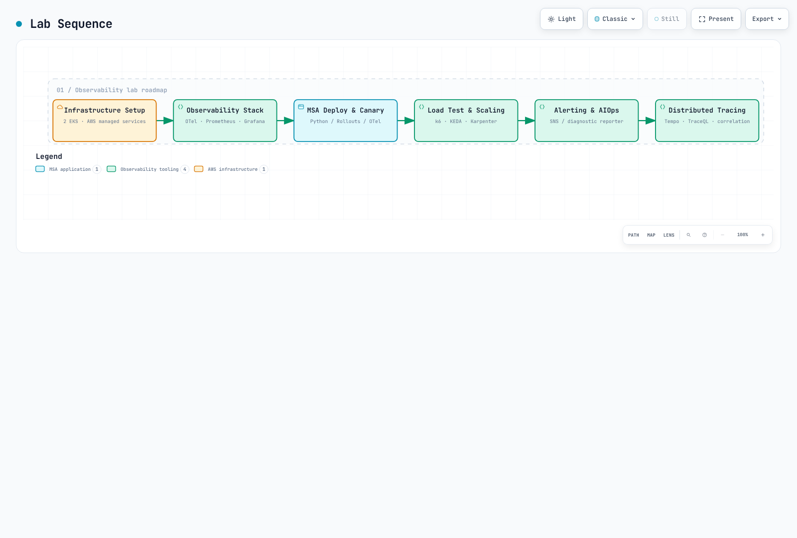

# Serie de labs de observabilidad

> **Dificultad**: Avanzado
> **Última actualización**: September 13, 2026
Conecta una aplicación sintética de pedidos ejecutable y sus métricas/logs/trazas a través de dos clústeres de EKS. La base utiliza Prometheus, Loki, Tempo y Grafana con AWS SNS/SQS, Aurora y CloudWatch. La configuración del lab es distinta de la validación de HA/capacidad en producción.

[🔍 View interactive diagram](https://www.atomai.click/kubernetes-docs/archmaps/en-labs-observability-overview-0.html)

## Requisitos previos {#prerequisites}

Usa un rol temporal de AWS aprobado, VPC/subredes/rutas/DNS/SGs privados revisados, EBS CSI/gp3, un CNI compatible con NetworkPolicy y AWS Load Balancer Controller. No se requiere ningún FullAccess general de servicio ni claves de acceso de larga duración. Vuelve a comprobar versiones, permisos y cuotas en cada etapa.

| Herramienta | Base revisada |
|---|---|
| EKS / kubectl | 1.36 / 1.36.2 |
| eksctl / Helm | 0.229.0 / 3.21.3 |
| Python / AWS CLI | 3.12 / v2 |
| k6 / Locust | 2.2.0 / 2.46.5 |
| Aplicación / controllers | Requisitos fijados, digest de imagen y versiones de chart en los ejemplos |

## Código ejecutable y secuencia {#sequence}

Usa los ejemplos [application](https://github.com/Atom-oh/kubernetes-docs/tree/main/examples/labs/observability/application), [stack](https://github.com/Atom-oh/kubernetes-docs/tree/main/examples/labs/observability/stack), [load-test](https://github.com/Atom-oh/kubernetes-docs/tree/main/examples/labs/observability/load-test) y [aiops](https://github.com/Atom-oh/kubernetes-docs/tree/main/examples/labs/observability/aiops) de este repositorio. Fija un commit/tag revisado y conserva el LAB_STATE privado; no clones el antiguo repositorio de ejemplos inexistente.

[🔍 View interactive diagram](https://www.atomai.click/kubernetes-docs/archmaps/en-labs-observability-overview-2.html)

| Parte | Etapa | Resultado |
|---|---|---|
| 1 | [Infraestructura](01-infrastructure-setup-lab.md) | EKS, base de datos privada, fanout de SNS, roles restringidos |
| 2 | [Stack de observabilidad](02-observability-stack-lab.md) | Colectores/remote-write con mTLS, Loki/Tempo/Grafana |
| 3 | [MSA/canary](03-msa-deployment-lab.md) | Cinco roles ejecutables, outbox, análisis solo por revisión |
| 4 | [Carga/escalado](04-load-testing-scaling-lab.md) | Peticiones medidas y observaciones de consumidores/nodos |
| 5 | [Alertas/AIOps](05-alerting-aiops-lab.md) | Reporter de diagnóstico con topic separado, revisión humana |
| 6 | [Trazado distribuido](06-distributed-tracing-lab.md) | Correlación real de métricas/exemplars/trazas/logs, limpieza |

## Aplicación y flujo de datos {#application}

Una única imagen de Python se ejecuta como los roles separados api-gateway, order-service, payment-service, notification y analytics. Los pagos y notificaciones son sintéticos, sin cargos, correos ni SMS reales. Los pedidos y el outbox comparten una transacción; colas independientes y la deduplicación por ID de evento sirven a notification/analytics. La autenticación en el gateway, la limitación de tasa general y una pasarela de pago real no están implementadas ni se afirman.

[🔍 View interactive diagram](https://www.atomai.click/kubernetes-docs/archmaps/en-labs-observability-overview-3.html)

## Base frente a extensiones opcionales {#coverage}

[🔍 View interactive diagram](https://www.atomai.click/kubernetes-docs/archmaps/en-labs-observability-overview-1.html)

| Base | Integración opcional independiente |
|---|---|
| Métricas de Prometheus / CloudWatch | VictoriaMetrics, Mimir, AMP |
| Loki / CloudWatch Logs | ClickHouse, OpenSearch |
| OTel / Tempo | X-Ray, Dynatrace |
| Grafana | Amazon Managed Grafana, herramientas comerciales |
| Alertmanager / SNS / Lambda de diagnóstico | Plataforma de on-call existente, grupo de CloudWatch Investigations |
| Consumidores de eventos sintéticos | Programación con MWAA/analítica por lotes, sistemas transaccionales de producción |

La instalación es distinta de la ingesta, las consultas, los permisos y los costes verificados. Consulta las guías de [métricas](../../observability/metrics/README.md), [logging](../../observability/logging/README.md), [trazado](../../observability/tracing/README.md) y [Grafana](../../observability/grafana/README.md) para las extensiones. La Part5 incorpora cambios como el archivado de OnCall OSS.

## Coste, verificación y limpieza {#cost-and-cleanup}

Estima a partir del uso real los nodos específicos de la Región, NAT, EBS, ACU/almacenamiento/E-S de Aurora, la ingesta/retención de logs, los mensajes, KMS, los LBs, la transferencia y las llamadas al modelo. No mezcles cargos mensuales por usuario con infraestructura por horas en un total fijo. Los labs con un único writer/backend no tienen HA de nivel de producción; los límites de réplicas no son topes absolutos de gasto.

Distingue la validación local nativa/de SDK/de esquema/de navegador de los resultados reales en AWS. Inventaria recursos, asociaciones de IAM, snapshots, DNS y LBs/PVCs; realiza la limpieza en el orden de dependencias de la Part6. No silencies todos los fallos ni elimines clústeres antes que sus dependientes gestionados.
