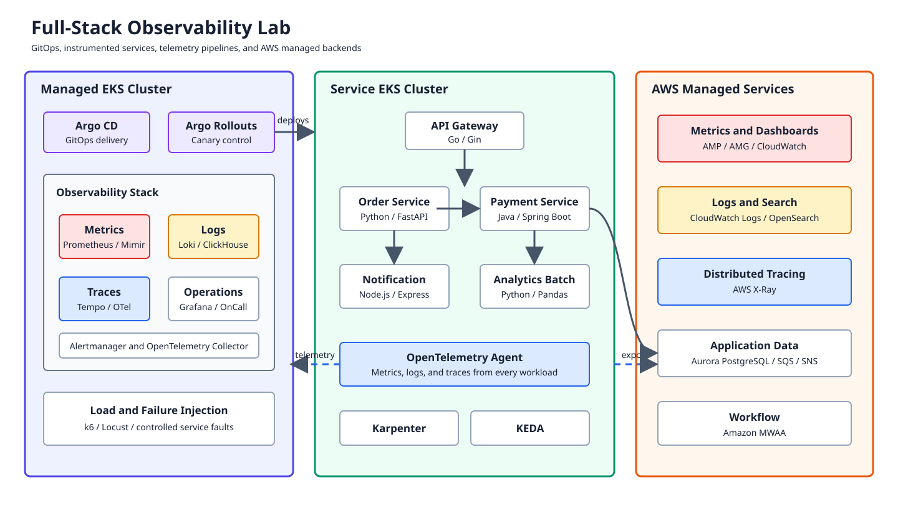
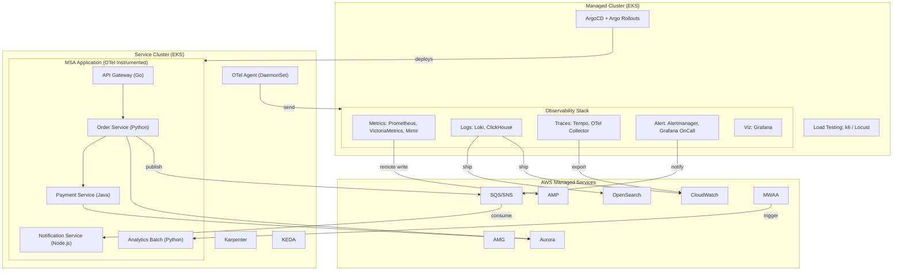
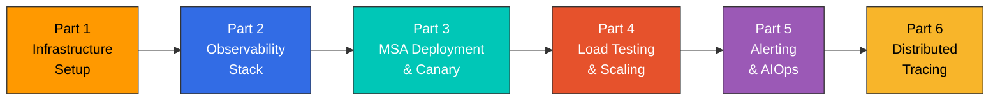
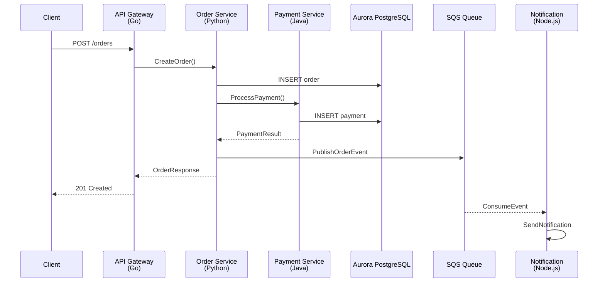

# Introducción a la serie de laboratorios

> **Dificultad**: Avanzado **Última actualización**: February 23, 2026

## Descripción general

Esta serie de laboratorios proporciona un recorrido completo y práctico para crear una plataforma de observabilidad full-stack para microservicios basados en Kubernetes. Desplegarás e integrarás múltiples herramientas de observabilidad en dos clústeres EKS, implementando los tres pilares de la observabilidad (Metrics, Logs, Traces) con patrones del mundo real.

La arquitectura simula un entorno de nivel de producción con un **Managed Cluster** que aloja la pila de observabilidad y un **Service Cluster** que ejecuta aplicaciones MSA con instrumentación OTel.

## Diagrama de arquitectura

## Requisitos previos

Antes de comenzar esta serie de laboratorios, asegúrate de contar con lo siguiente:

| Requisito | Versión  | Comando de verificación        |
| --------- | -------- | ------------------------------ |
| Cuenta de AWS | -        | `aws sts get-caller-identity` |
| AWS CLI   | >= 2.15  | `aws --version`               |
| eksctl    | >= 0.175 | `eksctl version`              |
| kubectl   | >= 1.29  | `kubectl version --client`    |
| Helm      | >= 3.14  | `helm version`                |
| Terraform | >= 1.7   | `terraform version`           |
| k6        | >= 0.49  | `k6 version`                  |
| Docker    | >= 24.0  | `docker --version`            |

### Permisos de IAM necesarios

Tu usuario/rol de AWS necesita los siguientes permisos:

* Acceso completo a EKS
* Acceso completo a EC2 (para grupos de nodos)
* Acceso completo a VPC
* Acceso limitado a IAM (para IRSA)
* Acceso completo a CloudFormation
* Acceso completo a SQS/SNS
* Acceso completo a RDS (para Aurora)
* Acceso completo a OpenSearch
* Acceso completo a Managed Prometheus/Grafana
* Acceso completo a MWAA

## Estimación de costos

> **Advertencia**: Esta serie de laboratorios crea recursos de AWS significativos. A continuación se proporcionan los costos estimados.

| Servicio                  | Configuración                     | Costo por hora (USD) |
| ------------------------- | --------------------------------- | -------------------- |
| Plano de control de EKS   | 2 clústeres                       | $0.20                |
| EC2 (Managed Cluster)     | 3x m5.xlarge                      | $0.58                |
| EC2 (Service Cluster)     | 3x m5.large (+ escalado de Karpenter) | $0.29+            |
| Aurora PostgreSQL         | db.r6g.large (multi-AZ)           | $0.52                |
| OpenSearch                | m6g.large.search (2 nodos)        | $0.25                |
| Amazon Managed Prometheus | Según la ingesta                  | \~$0.10             |
| Amazon Managed Grafana    | 1 espacio de trabajo              | $0.15                |
| MWAA                      | mw1.small                         | $0.31                |
| SQS/SNS                   | Según el uso                      | \~$0.01             |
| **Total estimado**        |                                   | **\~$2.50/hora**    |

**Consejo**: Completa el laboratorio en una sola sesión y ejecuta la limpieza de inmediato para minimizar los costos.

## Secuencia de laboratorios

| Parte | Título                                                   | Duración | Temas clave                                     |
| ----- | -------------------------------------------------------- | -------- | ----------------------------------------------- |
| 1     | [Configuración de infraestructura](01-infrastructure-setup-lab.md) | 60 min   | Clústeres EKS, servicios de AWS, ArgoCD         |
| 2     | [Pila de observabilidad](02-observability-stack-lab.md) | 90 min   | OTel, Prometheus, Loki, Tempo, Grafana          |
| 3     | [Despliegue MSA y Canary](03-msa-deployment-lab.md)     | 60 min   | ArgoCD, Argo Rollouts, instrumentación OTel     |
| 4     | [Pruebas de carga y escalado](04-load-testing-scaling-lab.md) | 45 min   | k6, KEDA, Karpenter                             |
| 5     | [Alerting y AIOps](05-alerting-aiops-lab.md)            | 60 min   | Alertmanager, OnCall, investigaciones de CloudWatch |
| 6     | [Tracing distribuido](06-distributed-tracing-lab.md)    | 45 min   | Tempo, TraceQL, correlación Log-Trace           |

## Descripción general de la aplicación MSA

El laboratorio utiliza una aplicación MSA de comercio electrónico de ejemplo con 5 servicios:

| Servicio             | Lenguaje           | Función                         | Dependencias             |
| -------------------- | ------------------ | ------------------------------- | ------------------------ |
| API Gateway          | Go                 | Enrutamiento de solicitudes, autenticación | Order, Payment   |
| Order Service        | Python (FastAPI)   | Gestión de pedidos, inventario  | Aurora, SQS              |
| Payment Service      | Java (Spring Boot) | Procesamiento de pagos          | Aurora                   |
| Notification Service | Node.js (Express)  | Notificaciones por correo electrónico/SMS | Consumidor de SQS |
| Analytics Batch      | Python             | Agregación diaria de analíticas | Aurora, activado por MWAA |

### Flujo de llamadas de servicios

## Cobertura de herramientas de observabilidad

Este laboratorio cubre las siguientes herramientas de observabilidad:

| Categoría         | Herramientas cubiertas             | Integración con AWS          |
| ----------------- | ---------------------------------- | ---------------------------- |
| **Metrics**       | Prometheus, VictoriaMetrics, Mimir | AMP (remote write)           |
| **Logging**       | Loki, ClickHouse, Fluent Bit       | CloudWatch Logs, OpenSearch  |
| **Tracing**       | Tempo, OTel Collector              | X-Ray (mediante OTel)        |
| **Visualización** | Grafana                            | AMG                          |
| **Alerting**      | Alertmanager, Grafana OnCall       | CloudWatch Alarms, SNS       |
| **AIOps**         | CloudWatch Investigations          | Integración con Bedrock Claude |

> **Nota**: Este laboratorio se centra en herramientas de código abierto y nativas de AWS. Las soluciones comerciales como Datadog y Dynatrace se tratan en documentación independiente, pero no se despliegan en este laboratorio.

## Resultados de aprendizaje

Al completar esta serie de laboratorios, podrás:

1. **Diseñar** una arquitectura de observabilidad de nivel de producción para Kubernetes
2. **Desplegar** la pila LGTM completa (Loki, Grafana, Tempo, Mimir) con OTel
3. **Configurar** pipelines de telemetría multi-backend mediante OTel Collector
4. **Implementar** despliegues Canary con análisis impulsado por observabilidad
5. **Crear** flujos de trabajo de AIOps con CloudWatch Investigations y Bedrock
6. **Analizar** trazas distribuidas para identificar cuellos de botella de rendimiento
7. **Correlacionar** métricas, logs y trazas para el análisis de causa raíz

## Referencias

* [Descripción general de observabilidad](../../observability/README.md)
* [Documentación de Prometheus](../../observability/metrics/01-prometheus.md)
* [Dashboard de Grafana](../../observability/grafana/README.md)
* [Documentación de Loki](../../observability/logging/01-loki.md)
* [Documentación de Tempo](../../observability/tracing/01-tempo.md)
* [Documentación de OpenTelemetry](../../observability/tracing/03-opentelemetry.md)
* [Documentación de ArgoCD](../../gitops/argocd/README.md)
* [Documentación de KEDA](../../autoscaling/01-keda.md)
* [Documentación de Karpenter](../../autoscaling/02-karpenter.md)

***

**¿Listo para comenzar?** Comienza con [Parte 1: Configuración de infraestructura](01-infrastructure-setup-lab.md)
