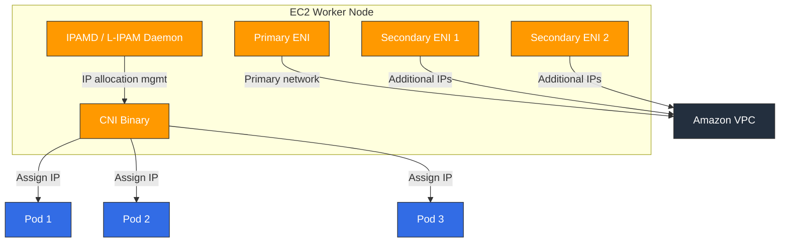

# Amazon VPC CNI

> **Versiones compatibles**: VPC CNI v1.19+, EKS 1.25+
> **Última actualización**: February 22, 2026

## Tabla de contenido
- [Descripción general de VPC CNI](#vpc-cni-overview)
- [Modelo de red](#networking-model)
- [Instalación y configuración](#installation-and-configuration)
- [Administración de direcciones IP](#ip-address-management)
- [Compatibilidad con Network Policy](#network-policy-support)
- [Características avanzadas](#advanced-features)
- [Solución de problemas](#troubleshooting)
- [Prácticas recomendadas](#best-practices)

## Descripción general de VPC CNI

Amazon VPC CNI (Container Network Interface) es el plugin de red predeterminado para Amazon EKS. Asigna direcciones IP reales de las subredes de VPC a cada Pod, lo que permite que los Pods se comuniquen de forma nativa dentro de la red de VPC.

### Características clave

1. **Red de VPC nativa**: Los Pods usan IP reales de VPC y se comunican sin redes superpuestas
2. **Integración con servicios de AWS**: Integración directa con características de red de AWS como Security Groups, VPC Flow Logs y tablas de enrutamiento
3. **Alto rendimiento**: Rendimiento de red nativo sin la sobrecarga de redes superpuestas
4. **Pila dual IPv4/IPv6**: Compatibilidad con redes IPv4 e IPv6

### Arquitectura

VPC CNI consta de dos componentes principales:



1. **IPAMD (L-IPAM Daemon)**: Un daemon que se ejecuta en cada nodo y preasigna y administra ENI y direcciones IP
2. **CNI Binary**: El plugin CNI invocado por kubelet que recibe IP de IPAMD y configura los namespaces de red de los Pods

### Modos de asignación de IP

VPC CNI admite dos modos de asignación de IP:

| Característica | Secondary IP Mode | Prefix Delegation Mode |
|---------|-------------------|----------------------|
| Unidad de asignación | Direcciones IP individuales | Prefijo IPv4 /28 (16 IP) |
| Eficiencia de IP | Media | Alta |
| Densidad de Pods | Limitada por las IP por ENI | Mayor densidad de Pods |
| Disponible desde | Versión inicial | v1.9+ |
| Recomendado para | Clústeres pequeños | Clústeres grandes |

## Modelo de red

### Arquitectura de ENI

Cada instancia EC2 puede tener uno o más ENI (Elastic Network Interfaces), y a cada ENI se le pueden asignar varias direcciones IP privadas.

```
┌─────────────────────────────────────────────────┐
│                 EC2 Instance                      │
│                                                   │
│  ┌─────────────┐  ┌─────────────┐  ┌──────────┐ │
│  │ Primary ENI  │  │Secondary ENI│  │Secondary │ │
│  │ (eth0)       │  │ (eth1)      │  │ENI (eth2)│ │
│  │              │  │             │  │          │ │
│  │ Primary IP   │  │ IP 1→Pod A  │  │IP 1→PodD│ │
│  │ IP 1 → Pod X │  │ IP 2→Pod B  │  │IP 2→PodE│ │
│  │ IP 2 → Pod Y │  │ IP 3→Pod C  │  │IP 3→PodF│ │
│  └─────────────┘  └─────────────┘  └──────────┘ │
└─────────────────────────────────────────────────┘
```

### Límites de ENI/IP por tipo de instancia

| Tipo de instancia | ENI máx. | IPv4 por ENI | Pods máx. |
|--------------|----------|-------------|----------|
| t3.medium | 3 | 6 | 17 |
| t3.large | 3 | 12 | 35 |
| m5.large | 3 | 10 | 29 |
| m5.xlarge | 4 | 15 | 58 |
| m5.2xlarge | 4 | 15 | 58 |
| c5.4xlarge | 8 | 30 | 234 |
| m5.8xlarge | 8 | 30 | 234 |

> **Nota**: Pods máx. = (Número de ENI × IP por ENI) - Número de ENI. Las IP principales son usadas por el nodo.

### Prefix Delegation (IPv4/IPv6)

En el modo Prefix Delegation, se asignan prefijos IPv4 /28 (16 IP) a los ENI en lugar de IP individuales:

```bash
# Enable Prefix Delegation
kubectl set env daemonset aws-node -n kube-system ENABLE_PREFIX_DELEGATION=true

# Or via EKS add-on configuration
aws eks create-addon \
  --cluster-name my-cluster \
  --addon-name vpc-cni \
  --configuration-values '{"env":{"ENABLE_PREFIX_DELEGATION":"true"}}'
```

Beneficios de Prefix Delegation:
- **Mayor densidad de Pods**: 16 IP por prefijo /28 aumentan significativamente los Pods por nodo
- **Asignación de IP más rápida**: Obtiene 16 IP con una sola llamada a la API
- **Optimización de instancias Nitro**: Rendimiento óptimo en instancias basadas en Nitro

## Instalación y configuración

### Instalación como add-on de EKS

```bash
# Install VPC CNI add-on (latest version)
aws eks create-addon \
  --cluster-name my-cluster \
  --addon-name vpc-cni \
  --resolve-conflicts OVERWRITE

# Check add-on status
aws eks describe-addon \
  --cluster-name my-cluster \
  --addon-name vpc-cni

# Update add-on version
aws eks update-addon \
  --cluster-name my-cluster \
  --addon-name vpc-cni \
  --addon-version v1.19.0-eksbuild.1
```

### Instalación mediante Helm Chart

```bash
# Add Helm repository
helm repo add eks https://aws.github.io/eks-charts

# Install
helm install aws-vpc-cni eks/aws-vpc-cni \
  --namespace kube-system \
  --set init.image.tag=v1.19.0 \
  --set image.tag=v1.19.0
```

### Variables de entorno clave

| Variable | Descripción | Predeterminado |
|----------|------------|---------|
| `WARM_IP_TARGET` | Número de IP de reserva que se preasignan | No establecido |
| `MINIMUM_IP_TARGET` | IP mínimas que se deben mantener en el nodo | No establecido |
| `WARM_ENI_TARGET` | Número de ENI de reserva que se preasignan | 1 |
| `WARM_PREFIX_TARGET` | Número de prefijos de reserva que se preasignan | No establecido |
| `ENABLE_PREFIX_DELEGATION` | Habilita Prefix Delegation | false |
| `AWS_VPC_K8S_CNI_CUSTOM_NETWORK_CFG` | Habilita Custom Networking | false |
| `ENI_CONFIG_LABEL_DEF` | Etiqueta para la selección de ENIConfig | No establecido |
| `ENABLE_POD_ENI` | Habilita Security Groups por Pod | false |
| `POD_SECURITY_GROUP_ENFORCING_MODE` | Modo de aplicación de Security Group | strict |

### Custom Networking (ENIConfig)

Custom Networking permite asignar IP desde una subred diferente a la del nodo:

```yaml
apiVersion: crd.k8s.amazonaws.com/v1alpha1
kind: ENIConfig
metadata:
  name: us-east-1a
spec:
  subnet: subnet-0123456789abcdef0
  securityGroups:
    - sg-0123456789abcdef0
---
apiVersion: crd.k8s.amazonaws.com/v1alpha1
kind: ENIConfig
metadata:
  name: us-east-1b
spec:
  subnet: subnet-0abcdef0123456789
  securityGroups:
    - sg-0123456789abcdef0
```

```bash
# Enable Custom Networking
kubectl set env daemonset aws-node -n kube-system AWS_VPC_K8S_CNI_CUSTOM_NETWORK_CFG=true
kubectl set env daemonset aws-node -n kube-system ENI_CONFIG_LABEL_DEF=topology.kubernetes.io/zone
```

## Administración de direcciones IP

### Ajuste de WARM_IP_TARGET

`WARM_IP_TARGET` controla el número de IP de reserva que se preasignan en cada nodo:

```bash
# Small clusters: fewer spare IPs
kubectl set env daemonset aws-node -n kube-system WARM_IP_TARGET=2 MINIMUM_IP_TARGET=4

# Large clusters: more spare IPs for faster Pod startup
kubectl set env daemonset aws-node -n kube-system WARM_IP_TARGET=5 MINIMUM_IP_TARGET=10
```

### Adición de CIDR secundario

Cuando el CIDR de VPC principal es insuficiente, agregue un CIDR secundario:

```bash
# Add Secondary CIDR to VPC
aws ec2 associate-vpc-cidr-block \
  --vpc-id vpc-0123456789abcdef0 \
  --cidr-block 100.64.0.0/16

# Create subnets for Secondary CIDR
aws ec2 create-subnet \
  --vpc-id vpc-0123456789abcdef0 \
  --cidr-block 100.64.0.0/19 \
  --availability-zone us-east-1a
```

### Configuración de clúster IPv6

```bash
# Create IPv6 EKS cluster
eksctl create cluster \
  --name ipv6-cluster \
  --version 1.28 \
  --ip-family ipv6
```

## Compatibilidad con Network Policy

### Network Policy nativa de VPC CNI (v1.14+)

A partir de VPC CNI v1.14, se admite Network Policy nativa basada en eBPF:

```bash
# Enable Network Policy
aws eks create-addon \
  --cluster-name my-cluster \
  --addon-name vpc-cni \
  --configuration-values '{"enableNetworkPolicy":"true"}'
```

### Ejemplo de Network Policy

```yaml
apiVersion: networking.k8s.io/v1
kind: NetworkPolicy
metadata:
  name: allow-frontend-to-backend
  namespace: app
spec:
  podSelector:
    matchLabels:
      app: backend
  policyTypes:
    - Ingress
  ingress:
    - from:
        - podSelector:
            matchLabels:
              app: frontend
      ports:
        - protocol: TCP
          port: 8080
```

### Verificación de Network Policies

```bash
# Check Network Policy controller logs
kubectl logs -n kube-system -l k8s-app=aws-node -c aws-network-policy-agent

# List Network Policies
kubectl get networkpolicy -A

# Check eBPF policy maps
kubectl exec -n kube-system ds/aws-node -c aws-node -- ebpf-sdk list-maps
```

## Características avanzadas

### Security Groups por Pod

Asigne Security Groups de AWS directamente a Pods individuales:

```yaml
apiVersion: vpcresources.k8s.aws/v1beta1
kind: SecurityGroupPolicy
metadata:
  name: my-security-group-policy
  namespace: app
spec:
  podSelector:
    matchLabels:
      app: database
  securityGroups:
    groupIds:
      - sg-0123456789abcdef0
      - sg-0abcdef0123456789
```

```bash
# Enable Pod Security Groups
kubectl set env daemonset aws-node -n kube-system ENABLE_POD_ENI=true
```

### Trunk ENI / Branch ENI

Los Security Groups por Pod usan la arquitectura Trunk ENI y Branch ENI:

- **Trunk ENI**: El ENI principal del nodo que aloja Branch ENI
- **Branch ENI**: ENI virtuales asignados a cada Pod con aplicación independiente de Security Group

### Integración con Multus CNI

Use VPC CNI como CNI predeterminado mientras configura interfaces de red adicionales mediante Multus:

```yaml
apiVersion: k8s.cni.cncf.io/v1
kind: NetworkAttachmentDefinition
metadata:
  name: ipvlan-conf
spec:
  config: |
    {
      "cniVersion": "0.3.1",
      "type": "ipvlan",
      "master": "eth1",
      "mode": "l2",
      "ipam": {
        "type": "host-local",
        "subnet": "192.168.1.0/24"
      }
    }
```

### Compatibilidad con nodos Windows

VPC CNI también está disponible en nodos Windows:

```bash
# Create Windows node group
eksctl create nodegroup \
  --cluster my-cluster \
  --name windows-ng \
  --node-type m5.large \
  --nodes 2 \
  --node-ami-family WindowsServer2022FullContainer
```

## Solución de problemas

### Agotamiento de IP

**Síntoma**: Pods bloqueados en estado `Pending` con error de asignación de IP

```bash
# Check IPAMD logs
kubectl logs -n kube-system -l k8s-app=aws-node -c aws-node | grep -i "insufficient"

# Check per-node IP usage
kubectl get nodes -o json | jq '.items[] | {name: .metadata.name, allocatable_pods: .status.allocatable.pods}'

# Check available IPs in subnet
aws ec2 describe-subnets --subnet-ids subnet-xxx --query 'Subnets[].AvailableIpAddressCount'
```

**Soluciones**:
1. Habilite Prefix Delegation para aumentar la densidad de Pods
2. Agregue un CIDR secundario para ampliar el grupo de IP
3. Use Custom Networking con subredes dedicadas para Pods
4. Ajuste `WARM_IP_TARGET` para optimizar la preasignación de IP

### Límite de ENI superado

**Síntoma**: Error `ENI limit reached`

```bash
# Check node's ENI count
aws ec2 describe-instances --instance-ids i-xxx \
  --query 'Reservations[].Instances[].NetworkInterfaces | length(@)'

# Check ENI limits for instance type
aws ec2 describe-instance-types --instance-types m5.large \
  --query 'InstanceTypes[].NetworkInfo.{MaxENI: MaximumNetworkInterfaces, IPv4PerENI: Ipv4AddressesPerInterface}'
```

### Análisis de logs de IPAMD

```bash
# Watch IPAMD logs in real-time
kubectl logs -n kube-system -l k8s-app=aws-node -c aws-node -f

# Filter IP allocation events
kubectl logs -n kube-system -l k8s-app=aws-node -c aws-node | grep -E "(allocated|freed|assigned)"

# Check IPAMD metrics
kubectl exec -n kube-system ds/aws-node -c aws-node -- curl http://localhost:61678/v1/enis
```

### Errores comunes y soluciones

| Error | Causa | Solución |
|-------|-------|----------|
| `InsufficientFreeAddressesInSubnet` | Agotamiento de IP de la subred | Agregue un CIDR secundario o habilite Prefix Delegation |
| `SecurityGroupLimitExceeded` | Demasiados Security Groups | Limpie los SG sin usar o consolídelos |
| `ENI limit reached` | Se superó el número de ENI | Use un tipo de instancia más grande |
| `Failed to create ENI` | Permisos IAM insuficientes | Agregue permisos de creación de ENI al rol de nodo |
| `Timeout waiting for pod IP` | Retraso de IPAMD | Reinicie IPAMD y revise los logs |

## Prácticas recomendadas

### Planificación de CIDR de subredes

1. **Garantice un tamaño de subred suficiente**: Use subredes /19 o mayores
2. **Separe las subredes por AZ**: Asigne subredes dedicadas para Pods a cada zona de disponibilidad
3. **Aproveche el rango 100.64.0.0/10**: Use el espacio de direcciones RFC 6598 para Pods

```
VPC CIDR: 10.0.0.0/16
├── 10.0.0.0/19   - Node subnet (AZ-a)
├── 10.0.32.0/19  - Node subnet (AZ-b)
├── 10.0.64.0/19  - Node subnet (AZ-c)
└── Secondary CIDR: 100.64.0.0/16
    ├── 100.64.0.0/19  - Pod subnet (AZ-a)
    ├── 100.64.32.0/19 - Pod subnet (AZ-b)
    └── 100.64.64.0/19 - Pod subnet (AZ-c)
```

### Configuración recomendada de Prefix Delegation

```bash
kubectl set env daemonset aws-node -n kube-system \
  ENABLE_PREFIX_DELEGATION=true \
  WARM_PREFIX_TARGET=1 \
  WARM_IP_TARGET=5 \
  MINIMUM_IP_TARGET=2
```

### Optimización de clústeres grandes

1. **Prefix Delegation obligatoria**: Maximice la eficiencia de IP a escala
2. **Use Custom Networking**: Separe las subredes para nodos y Pods
3. **Ajuste WARM_IP_TARGET**: Minimice los retrasos de programación de Pods
4. **Configure la monitorización**: Supervise la utilización de IP y configure alertas

```yaml
# IP utilization monitoring Prometheus rule
apiVersion: monitoring.coreos.com/v1
kind: PrometheusRule
metadata:
  name: vpc-cni-alerts
spec:
  groups:
    - name: vpc-cni
      rules:
        - alert: HighIPUtilization
          expr: awscni_assigned_ip_addresses / awscni_total_ip_addresses > 0.9
          for: 5m
          labels:
            severity: warning
          annotations:
            summary: "VPC CNI IP utilization is above 90%"
```

## Referencias

- [Documentación oficial de AWS VPC CNI](https://docs.aws.amazon.com/eks/latest/userguide/managing-vpc-cni.html)
- [Repositorio de GitHub de VPC CNI](https://github.com/aws/amazon-vpc-cni-k8s)
- [Prácticas recomendadas de EKS - Networking](https://aws.github.io/aws-eks-best-practices/networking/)
- [Guía de Prefix Delegation](https://docs.aws.amazon.com/eks/latest/userguide/cni-increase-ip-addresses.html)
- [Security Groups para Pods](https://docs.aws.amazon.com/eks/latest/userguide/security-groups-for-pods.html)

## Cuestionario

Para comprobar lo que ha aprendido en este capítulo, pruebe el [Cuestionario de VPC CNI](../quizzes/networking/01-vpc-cni-quiz.md).
