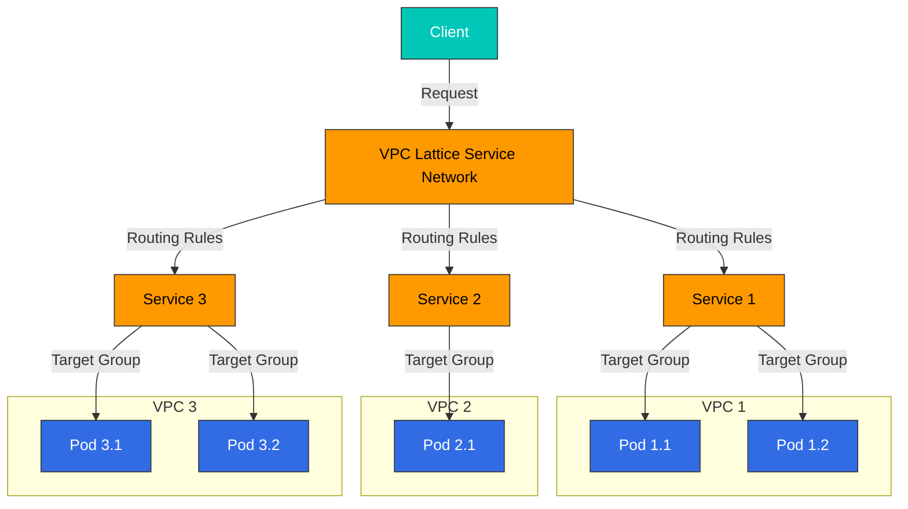
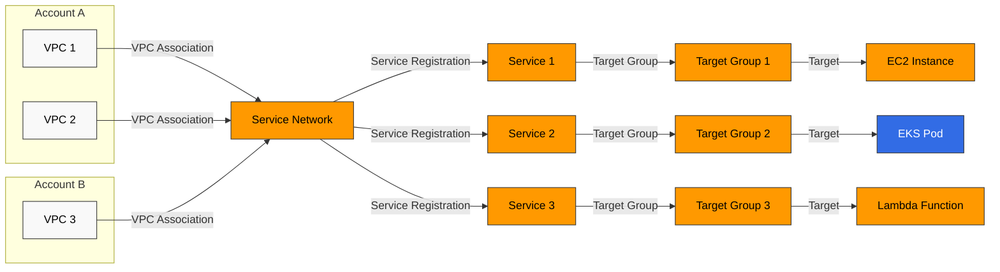
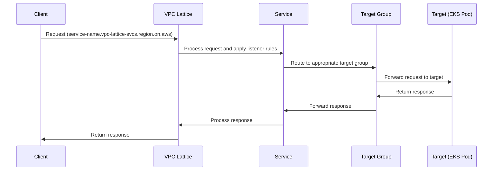
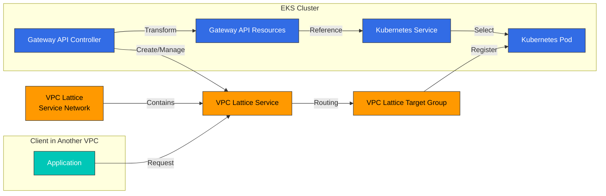

# VPC Lattice

Amazon VPC Lattice es un servicio de redes de aplicaciones de AWS que permite conectar y administrar de forma segura servicios entre distintas VPC y cuentas. Este documento explica los conceptos, la arquitectura, los métodos de integración con Amazon EKS y las mejores prácticas de VPC Lattice.

## Tabla de contenidos

1. [Descripción general](#overview)
2. [Arquitectura](#architecture)
3. [Integración de EKS y VPC Lattice](#eks-and-vpc-lattice-integration)
4. [Instalación y configuración](#installation-and-configuration)
5. [Gestión de servicios](#service-management)
6. [Enrutamiento y gestión del tráfico](#routing-and-traffic-management)
7. [Seguridad y autenticación](#security-and-authentication)
8. [Monitoreo y registros](#monitoring-and-logging)
9. [Mejores prácticas](#best-practices)
10. [Solución de problemas](#troubleshooting)
11. [Conclusión](#conclusion)

## Descripción general

### ¿Qué es VPC Lattice?

Amazon VPC Lattice es un servicio de redes de aplicaciones totalmente administrado para la conectividad, seguridad y monitoreo de servicio a servicio. Sus características principales incluyen:

- **Service Network**: Un límite lógico que conecta servicios entre varias VPC y cuentas
- **Service Discovery**: Descubrimiento automático de servicios dentro de la red de servicios
- **Traffic Management**: Compatibilidad con reglas de enrutamiento, enrutamiento ponderado y enrutamiento basado en rutas
- **Authentication and Authorization**: Control de acceso mediante AWS IAM y políticas de recursos
- **Observability**: Capacidades integradas de monitoreo, registro y trazabilidad

### Casos de uso principales

1. **Arquitectura de microservicios**: Simplificar y proteger la comunicación entre microservicios
2. **Entornos de varias cuentas**: Comunicación segura entre servicios de varias cuentas de AWS
3. **Cargas de trabajo híbridas**: Comunicación entre cargas de trabajo contenerizadas y no contenerizadas
4. **Alternativa a service mesh**: Proporcionar funcionalidad ligera de service mesh para reducir la complejidad
5. **Conectividad multiclúster**: Simplificar la comunicación de servicios entre varios clústeres de EKS

### VPC Lattice frente a otros servicios

#### VPC Lattice frente a API Gateway

| Característica | VPC Lattice | API Gateway |
|---------|------------|------------|
| Uso principal | Comunicación interna de servicio a servicio | Exposición de API externa |
| Ubicación de red | Dentro de la VPC | Conectado a Internet |
| Protocolos | HTTP/HTTPS, gRPC | HTTP/HTTPS, WebSocket, REST, GraphQL |
| Autenticación | AWS IAM, políticas de recursos | IAM, autorizadores de Lambda, Cognito |
| Escalabilidad | Escalado automático | Escalado automático |
| Precios | Por hora + rendimiento de datos | Cantidad de solicitudes + rendimiento de datos |

#### VPC Lattice frente a AWS App Mesh

| Característica | VPC Lattice | AWS App Mesh |
|---------|------------|-------------|
| Arquitectura | Servicio administrado | Basada en proxy sidecar |
| Complejidad | Baja | Media |
| Protocolos | HTTP/HTTPS, gRPC | HTTP/HTTPS, gRPC, TCP |
| Service Discovery | Integrado | Integración con AWS Cloud Map |
| Control de tráfico | Reglas de enrutamiento básicas | Control de tráfico avanzado |
| Observability | Integración con CloudWatch | Métricas detalladas mediante Envoy |

#### VPC Lattice frente a Transit Gateway

| Característica | VPC Lattice | Transit Gateway |
|---------|------------|----------------|
| Uso principal | Comunicación de servicio a servicio | Conectividad de red de VPC a VPC |
| Nivel de abstracción | Nivel de servicio | Nivel de red |
| Protocolo | Capa de aplicación (L7) | Capa de red (L3) |
| Enrutamiento | Basado en nombre de servicio | Basado en IP |
| Seguridad | Políticas a nivel de servicio | Grupos de seguridad, NACL |

## Arquitectura

### Componentes de VPC Lattice

VPC Lattice consta de los siguientes componentes principales:

1. **Service Network**: Un límite lógico para la comunicación de servicio a servicio
2. **Service**: Un endpoint que representa una aplicación o un microservicio
3. **Target Group**: Un conjunto de destinos al que se enruta el tráfico hacia un servicio
4. **Listener**: Un proceso que controla las solicitudes de conexión a un servicio
5. **Rule**: Define cómo un listener enruta el tráfico
6. **VPC Association**: Conecta una VPC a una red de servicios



### Arquitectura de Service Network

La red de servicios es un componente central de VPC Lattice que conecta servicios entre varias VPC y cuentas.



### Flujo de tráfico

Cómo fluye el tráfico en VPC Lattice:

1. El cliente envía una solicitud al nombre DNS del servicio de VPC Lattice
2. VPC Lattice recibe la solicitud y la procesa según las reglas del listener
3. Las reglas del listener enrutan la solicitud al target group adecuado
4. El target group reenvía la solicitud a los destinos registrados (EC2, Pods de EKS, Lambda, etc.)
5. El destino procesa la respuesta y la devuelve al cliente



### Service Discovery

VPC Lattice proporciona automáticamente service discovery dentro de la red de servicios:

1. Cada servicio tiene un nombre DNS único (`service-name.vpc-lattice-svcs.region.on.aws`)
2. Los clientes acceden a los servicios mediante este nombre DNS
3. VPC Lattice controla la resolución DNS y el enrutamiento
4. Los servicios son accesibles desde todas las VPC conectadas a la red de servicios

### Modelo de seguridad

VPC Lattice proporciona los siguientes mecanismos de seguridad:

1. **Aislamiento de red**: La red de servicios proporciona un entorno lógicamente aislado
2. **Authentication and Authorization**: Control de acceso a servicios mediante AWS IAM
3. **Resource Policies**: Control de acceso granular para servicios y redes de servicios
4. **Cifrado TLS**: Cifrado de la comunicación de servicio a servicio
5. **VPC Security Groups**: Capa de seguridad adicional para los destinos

## Integración de EKS y VPC Lattice

### Arquitectura de integración

La integración de Amazon EKS y VPC Lattice consta de los siguientes componentes:

1. **AWS Gateway API Controller**: Transforma Kubernetes Gateway API en recursos de VPC Lattice
2. **Kubernetes Gateway API**: API estándar de Kubernetes para el enrutamiento de servicios
3. **VPC Lattice Service Network**: Red de servicios a la que se conectan los clústeres de EKS
4. **VPC Lattice Service**: Servicios de VPC Lattice asignados a servicios de Kubernetes
5. **VPC Lattice Target Group**: Target groups asignados a Pods de Kubernetes



### Beneficios de la integración

La integración de EKS con VPC Lattice proporciona los siguientes beneficios:

1. **API estandarizada**: Gestión coherente de servicios mediante Kubernetes Gateway API
2. **Comunicación entre clústeres**: Comunicación fluida entre varios clústeres de EKS
3. **Cargas de trabajo híbridas**: Comunicación entre Pods de EKS y cargas de trabajo no contenerizadas
4. **Gestión centralizada**: Administrar todas las redes de servicios desde la consola de AWS
5. **Observabilidad unificada**: Monitoreo y registro integrados mediante CloudWatch y CloudTrail
6. **Service mesh simplificado**: Proporcionar funcionalidad de service mesh sin sidecars

### VPC Lattice como alternativa a Service Mesh

VPC Lattice puede ser una alternativa a los service meshes tradicionales (Istio, Linkerd, etc.) por los siguientes motivos:

1. **Baja complejidad**: Proporciona funcionalidad de service mesh sin proxies sidecar
2. **Menor sobrecarga de gestión**: Servicio totalmente administrado por AWS
3. **Eficiencia de recursos**: Menor uso de recursos sin proxies sidecar
4. **Integración con servicios de AWS**: Integración fluida con el ecosistema de servicios de AWS

| Característica | VPC Lattice | Service Mesh tradicional |
|---------|------------|-----------------|
| Service Discovery | Integrado | Requiere configuración independiente |
| Enrutamiento de tráfico | Compatible | Compatible |
| División de tráfico | Compatible | Compatible |
| Control detallado del tráfico | Limitado | Amplio |
| Proxy sidecar | No requerido | Requerido |
| Complejidad de gestión | Baja | Alta |
| Sobrecarga de recursos | Baja | Alta |
| Observability | Integración con CloudWatch | Compatibilidad con varias herramientas |
## Instalación y configuración
### Requisitos previos

Requisitos previos para integrar VPC Lattice con EKS:

1. **Clúster de Amazon EKS**: Kubernetes versión 1.23 o superior
2. **Permisos de IAM**: Permisos para crear y administrar recursos de VPC Lattice
3. **Configuración de VPC**: VPC con subredes privadas
4. **AWS CLI**: Versión más reciente de AWS CLI
5. **kubectl**: Versión más reciente de kubectl
6. **Helm**: (Opcional) Helm 3 para la instalación de AWS Gateway API Controller

### Instalación de AWS Gateway API Controller

AWS Gateway API Controller es responsable de transformar los recursos de Kubernetes Gateway API en recursos de VPC Lattice.

#### Instalación mediante Helm

```bash
# Add Helm repository
helm repo add eks https://aws.github.io/eks-charts
helm repo update

# Install AWS Gateway API Controller
helm install gateway-api-controller eks/aws-gateway-controller \
  --namespace aws-gateway-controller \
  --create-namespace \
  --set serviceAccount.create=true \
  --set serviceAccount.name=aws-gateway-controller \
  --set serviceAccount.annotations."eks\.amazonaws\.com/role-arn"=arn:aws:iam::<AWS_ACCOUNT_ID>:role/AmazonGatewayControllerRole
```

#### Instalación mediante manifiestos YAML

1. Configuración de la cuenta de servicio y RBAC:

```yaml
apiVersion: v1
kind: ServiceAccount
metadata:
  name: aws-gateway-controller
  namespace: aws-gateway-controller
  annotations:
    eks.amazonaws.com/role-arn: arn:aws:iam::<AWS_ACCOUNT_ID>:role/AmazonGatewayControllerRole
---
apiVersion: rbac.authorization.k8s.io/v1
kind: ClusterRole
metadata:
  name: aws-gateway-controller
rules:
- apiGroups: ["gateway.networking.k8s.io"]
  resources: ["gatewayclasses", "gateways", "httproutes"]
  verbs: ["get", "list", "watch", "update", "patch"]
- apiGroups: [""]
  resources: ["services", "secrets", "namespaces"]
  verbs: ["get", "list", "watch"]
- apiGroups: [""]
  resources: ["events"]
  verbs: ["create", "patch"]
---
apiVersion: rbac.authorization.k8s.io/v1
kind: ClusterRoleBinding
metadata:
  name: aws-gateway-controller
roleRef:
  apiGroup: rbac.authorization.k8s.io
  kind: ClusterRole
  name: aws-gateway-controller
subjects:
- kind: ServiceAccount
  name: aws-gateway-controller
  namespace: aws-gateway-controller
```

2. Despliegue del Controller:

```yaml
apiVersion: apps/v1
kind: Deployment
metadata:
  name: aws-gateway-controller
  namespace: aws-gateway-controller
spec:
  replicas: 1
  selector:
    matchLabels:
      app: aws-gateway-controller
  template:
    metadata:
      labels:
        app: aws-gateway-controller
    spec:
      serviceAccountName: aws-gateway-controller
      containers:
      - name: controller
        image: public.ecr.aws/aws-application-networking-k8s/aws-gateway-controller:v1.0.0
        args:
        - --health-probe-bind-address=:8081
        - --metrics-bind-address=:8080
        - --leader-elect
        resources:
          limits:
            cpu: 500m
            memory: 128Mi
          requests:
            cpu: 10m
            memory: 64Mi
```

### Configuración de roles de IAM

AWS Gateway API Controller requiere los permisos de IAM adecuados para administrar recursos de VPC Lattice.

#### Configuración de IRSA (IAM Roles for Service Accounts)

```bash
# Create IAM policy
cat <<EOF > vpc-lattice-policy.json
{
  "Version": "2012-10-17",
  "Statement": [
    {
      "Effect": "Allow",
      "Action": [
        "vpc-lattice:*",
        "ec2:DescribeVpcs",
        "ec2:DescribeSubnets",
        "ec2:DescribeSecurityGroups",
        "elasticloadbalancing:DescribeTargetGroups",
        "elasticloadbalancing:DescribeTargetHealth",
        "elasticloadbalancing:RegisterTargets",
        "elasticloadbalancing:DeregisterTargets"
      ],
      "Resource": "*"
    }
  ]
}
EOF

aws iam create-policy \
  --policy-name AmazonGatewayControllerPolicy \
  --policy-document file://vpc-lattice-policy.json

# Create IAM role and associate with service account
eksctl create iamserviceaccount \
  --name aws-gateway-controller \
  --namespace aws-gateway-controller \
  --cluster <CLUSTER_NAME> \
  --attach-policy-arn arn:aws:iam::<AWS_ACCOUNT_ID>:policy/AmazonGatewayControllerPolicy \
  --approve \
  --override-existing-serviceaccounts
```

### Creación de una VPC Lattice Service Network

Las redes de servicios de VPC Lattice se pueden crear mediante AWS Management Console, AWS CLI o AWS CloudFormation.

#### Creación mediante AWS CLI

```bash
# Create service network
aws vpc-lattice create-service-network \
  --name my-service-network \
  --auth-type AWS_IAM

# Store service network ID
SERVICE_NETWORK_ID=$(aws vpc-lattice list-service-networks \
  --query "items[?name=='my-service-network'].id" \
  --output text)

# Associate VPC with service network
aws vpc-lattice create-service-network-vpc-association \
  --service-network-identifier $SERVICE_NETWORK_ID \
  --vpc-identifier <VPC_ID> \
  --security-group-ids <SECURITY_GROUP_ID>
```

#### Creación mediante AWS CloudFormation

```yaml
Resources:
  MyServiceNetwork:
    Type: AWS::VpcLattice::ServiceNetwork
    Properties:
      Name: my-service-network
      AuthType: AWS_IAM

  MyVpcAssociation:
    Type: AWS::VpcLattice::ServiceNetworkVpcAssociation
    Properties:
      ServiceNetworkIdentifier: !Ref MyServiceNetwork
      VpcIdentifier: !Ref MyVPC
      SecurityGroupIds:
        - !Ref MySecurityGroup
```

### Configuración de recursos de Gateway API

Configure los recursos de Kubernetes Gateway API para integrarlos con VPC Lattice.

#### 1. Crear GatewayClass

GatewayClass define la implementación de los recursos Gateway.

```yaml
apiVersion: gateway.networking.k8s.io/v1beta1
kind: GatewayClass
metadata:
  name: amazon-vpc-lattice
spec:
  controllerName: application-networking.k8s.aws/gateway-api-controller
```

#### 2. Crear Gateway

Gateway define cómo entra el tráfico en el clúster.

```yaml
apiVersion: gateway.networking.k8s.io/v1beta1
kind: Gateway
metadata:
  name: my-gateway
  namespace: default
  annotations:
    application-networking.k8s.aws/service-network-id: <SERVICE_NETWORK_ID>
spec:
  gatewayClassName: amazon-vpc-lattice
  listeners:
  - name: http
    port: 80
    protocol: HTTP
```

#### 3. Crear HTTPRoute

HTTPRoute define cómo se enruta el tráfico HTTP a los servicios.

```yaml
apiVersion: gateway.networking.k8s.io/v1beta1
kind: HTTPRoute
metadata:
  name: my-http-route
  namespace: default
spec:
  parentRefs:
  - name: my-gateway
    kind: Gateway
  rules:
  - matches:
    - path:
        type: PathPrefix
        value: /api
    backendRefs:
    - name: my-service
      port: 8080
```

### Configuración de Service y Pod

Configure los servicios y Pods de Kubernetes para integrarlos con VPC Lattice.

#### 1. Crear Service

```yaml
apiVersion: v1
kind: Service
metadata:
  name: my-service
  namespace: default
spec:
  selector:
    app: my-app
  ports:
  - port: 8080
    targetPort: 8080
  type: ClusterIP
```

#### 2. Crear Deployment

```yaml
apiVersion: apps/v1
kind: Deployment
metadata:
  name: my-app
  namespace: default
spec:
  replicas: 3
  selector:
    matchLabels:
      app: my-app
  template:
    metadata:
      labels:
        app: my-app
    spec:
      containers:
      - name: my-container
        image: nginx:latest
        ports:
        - containerPort: 8080
        readinessProbe:
          httpGet:
            path: /health
            port: 8080
          initialDelaySeconds: 5
          periodSeconds: 10
```

## Gestión de servicios

### Creación de servicios de VPC Lattice

Los servicios de VPC Lattice se pueden crear directamente mediante AWS Management Console, AWS CLI o AWS CloudFormation, o indirectamente mediante Kubernetes Gateway API.

#### Creación directa mediante AWS CLI

```bash
# Create target group
aws vpc-lattice create-target-group \
  --name my-target-group \
  --type INSTANCE \
  --config '{"port":80,"protocol":"HTTP","vpcIdentifier":"<VPC_ID>","healthCheck":{"enabled":true,"protocol":"HTTP","path":"/health","port":80,"healthCheckIntervalSeconds":30,"healthCheckTimeoutSeconds":5,"healthyThresholdCount":5,"unhealthyThresholdCount":2}}'

# Store target group ID
TARGET_GROUP_ID=$(aws vpc-lattice list-target-groups \
  --query "items[?name=='my-target-group'].id" \
  --output text)

# Create service
aws vpc-lattice create-service \
  --name my-service \
  --auth-type AWS_IAM

# Store service ID
SERVICE_ID=$(aws vpc-lattice list-services \
  --query "items[?name=='my-service'].id" \
  --output text)

# Create listener
aws vpc-lattice create-listener \
  --service-identifier $SERVICE_ID \
  --name my-listener \
  --protocol HTTP \
  --port 80 \
  --default-action '{"forward":{"targetGroups":[{"targetGroupIdentifier":"'$TARGET_GROUP_ID'"}]}}'

# Associate service with service network
aws vpc-lattice create-service-network-service-association \
  --service-network-identifier $SERVICE_NETWORK_ID \
  --service-identifier $SERVICE_ID
```

#### Creación indirecta mediante Kubernetes Gateway API

Al crear recursos de Gateway API, AWS Gateway API Controller crea automáticamente recursos de VPC Lattice.

```yaml
apiVersion: gateway.networking.k8s.io/v1beta1
kind: Gateway
metadata:
  name: my-gateway
  namespace: default
  annotations:
    application-networking.k8s.aws/service-network-id: <SERVICE_NETWORK_ID>
spec:
  gatewayClassName: amazon-vpc-lattice
  listeners:
  - name: http
    port: 80
    protocol: HTTP
---
apiVersion: gateway.networking.k8s.io/v1beta1
kind: HTTPRoute
metadata:
  name: my-http-route
  namespace: default
spec:
  parentRefs:
  - name: my-gateway
    kind: Gateway
  rules:
  - matches:
    - path:
        type: PathPrefix
        value: /api
    backendRefs:
    - name: my-service
      port: 8080
```

### Service Discovery y acceso

A los servicios de VPC Lattice se les asignan automáticamente nombres DNS y se pueden descubrir dentro de la red de servicios.

#### Formato del nombre DNS

```
<service-name>.<service-network-id>.vpc-lattice-svcs.<region>.on.aws
```

#### Ejemplo de acceso al servicio

```bash
# Query service DNS name
SERVICE_DNS=$(aws vpc-lattice get-service \
  --service-identifier $SERVICE_ID \
  --query "dnsEntry.domainName" \
  --output text)

# Access service
curl -v http://$SERVICE_DNS/api
```

### Actualización y eliminación de servicios

#### Actualización de servicios mediante AWS CLI

```bash
# Update service
aws vpc-lattice update-service \
  --service-identifier $SERVICE_ID \
  --auth-type NONE

# Update listener
aws vpc-lattice update-listener \
  --service-identifier $SERVICE_ID \
  --listener-identifier <LISTENER_ID> \
  --default-action '{"forward":{"targetGroups":[{"targetGroupIdentifier":"'$TARGET_GROUP_ID'","weight":100}]}}'
```

#### Eliminación de servicios mediante AWS CLI

```bash
# Dissociate from service network
aws vpc-lattice delete-service-network-service-association \
  --service-network-service-association-identifier <ASSOCIATION_ID>

# Delete listener
aws vpc-lattice delete-listener \
  --service-identifier $SERVICE_ID \
  --listener-identifier <LISTENER_ID>

# Delete service
aws vpc-lattice delete-service \
  --service-identifier $SERVICE_ID

# Delete target group
aws vpc-lattice delete-target-group \
  --target-group-identifier $TARGET_GROUP_ID
```

#### Gestión de servicios mediante Kubernetes Gateway API

Al actualizar o eliminar recursos de Gateway API, AWS Gateway API Controller actualiza o elimina automáticamente los recursos de VPC Lattice.

```bash
# Update HTTPRoute
kubectl apply -f updated-http-route.yaml

# Delete HTTPRoute
kubectl delete httproute my-http-route

# Delete Gateway
kubectl delete gateway my-gateway
```

## Enrutamiento y gestión del tráfico

### Enrutamiento básico

VPC Lattice proporciona diversas opciones de enrutamiento, incluido el basado en rutas, el basado en encabezados y el ponderado.

#### Enrutamiento basado en rutas

```yaml
apiVersion: gateway.networking.k8s.io/v1beta1
kind: HTTPRoute
metadata:
  name: path-based-route
  namespace: default
spec:
  parentRefs:
  - name: my-gateway
    kind: Gateway
  rules:
  - matches:
    - path:
        type: PathPrefix
        value: /api/v1
    backendRefs:
    - name: service-v1
      port: 8080
  - matches:
    - path:
        type: PathPrefix
        value: /api/v2
    backendRefs:
    - name: service-v2
      port: 8080
```

#### Enrutamiento basado en encabezados

```yaml
apiVersion: gateway.networking.k8s.io/v1beta1
kind: HTTPRoute
metadata:
  name: header-based-route
  namespace: default
spec:
  parentRefs:
  - name: my-gateway
    kind: Gateway
  rules:
  - matches:
    - headers:
      - name: "version"
        value: "v1"
    backendRefs:
    - name: service-v1
      port: 8080
  - matches:
    - headers:
      - name: "version"
        value: "v2"
    backendRefs:
    - name: service-v2
      port: 8080
```

### División de tráfico y despliegue canary

VPC Lattice admite la división de tráfico y los despliegues canary mediante el enrutamiento ponderado.

#### Enrutamiento ponderado mediante AWS CLI

```bash
# Set up weighted routing
aws vpc-lattice update-listener \
  --service-identifier $SERVICE_ID \
  --listener-identifier <LISTENER_ID> \
  --default-action '{
    "forward": {
      "targetGroups": [
        {
          "targetGroupIdentifier": "'$TARGET_GROUP_ID_V1'",
          "weight": 80
        },
        {
          "targetGroupIdentifier": "'$TARGET_GROUP_ID_V2'",
          "weight": 20
        }
      ]
    }
  }'
```

#### Enrutamiento ponderado mediante Kubernetes Gateway API

Actualmente, Kubernetes Gateway API no admite directamente el enrutamiento ponderado, pero AWS Gateway API Controller admite esta funcionalidad mediante anotaciones.

```yaml
apiVersion: gateway.networking.k8s.io/v1beta1
kind: HTTPRoute
metadata:
  name: weighted-route
  namespace: default
  annotations:
    application-networking.k8s.aws/traffic-weights: |
      {
        "service-v1": 80,
        "service-v2": 20
      }
spec:
  parentRefs:
  - name: my-gateway
    kind: Gateway
  rules:
  - matches:
    - path:
        type: PathPrefix
        value: /api
    backendRefs:
    - name: service-v1
      port: 8080
    - name: service-v2
      port: 8080
```

### Configuración de health checks

VPC Lattice admite health checks para target groups.

#### Configuración de health checks mediante AWS CLI

```bash
# Update health check configuration
aws vpc-lattice update-target-group \
  --target-group-identifier $TARGET_GROUP_ID \
  --health-check '{
    "enabled": true,
    "protocol": "HTTP",
    "path": "/health",
    "port": 8080,
    "healthCheckIntervalSeconds": 30,
    "healthCheckTimeoutSeconds": 5,
    "healthyThresholdCount": 5,
    "unhealthyThresholdCount": 2,
    "matcher": {
      "httpCode": "200-299"
    }
  }'
```

#### Configuración de health checks mediante Kubernetes Gateway API

AWS Gateway API Controller admite la configuración de health checks mediante anotaciones.

```yaml
apiVersion: gateway.networking.k8s.io/v1beta1
kind: HTTPRoute
metadata:
  name: health-check-route
  namespace: default
  annotations:
    application-networking.k8s.aws/health-check: |
      {
        "enabled": true,
        "protocol": "HTTP",
        "path": "/health",
        "port": 8080,
        "intervalSeconds": 30,
        "timeoutSeconds": 5,
        "healthyThresholdCount": 5,
        "unhealthyThresholdCount": 2,
        "matcher": {
          "httpCode": "200-299"
        }
      }
spec:
  parentRefs:
  - name: my-gateway
    kind: Gateway
  rules:
  - matches:
    - path:
        type: PathPrefix
        value: /api
    backendRefs:
    - name: my-service
      port: 8080
```
## Seguridad y autenticación

### Métodos de autenticación

VPC Lattice admite los siguientes métodos de autenticación:

1. **AWS IAM**: Autenticación mediante AWS Identity and Access Management
2. **Sin autenticación**: Permitir todas las solicitudes sin autenticación

#### Configuración de la autenticación de AWS IAM

```bash
# Create service with IAM authentication
aws vpc-lattice create-service \
  --name my-service \
  --auth-type AWS_IAM
```

#### Configuración de la autenticación de IAM mediante Kubernetes Gateway API

```yaml
apiVersion: gateway.networking.k8s.io/v1beta1
kind: Gateway
metadata:
  name: my-gateway
  namespace: default
  annotations:
    application-networking.k8s.aws/service-network-id: <SERVICE_NETWORK_ID>
    application-networking.k8s.aws/auth-type: "AWS_IAM"
spec:
  gatewayClassName: amazon-vpc-lattice
  listeners:
  - name: http
    port: 80
    protocol: HTTP
```

### Políticas de recursos

VPC Lattice proporciona control de acceso granular para servicios y redes de servicios mediante políticas de recursos.

#### Configuración de la política de recursos del servicio

```bash
# Set service resource policy
aws vpc-lattice put-resource-policy \
  --resource-arn arn:aws:vpc-lattice:<REGION>:<ACCOUNT_ID>:service/<SERVICE_ID> \
  --policy '{
    "Version": "2012-10-17",
    "Statement": [
      {
        "Effect": "Allow",
        "Principal": {
          "AWS": "arn:aws:iam::<ACCOUNT_ID>:role/MyRole"
        },
        "Action": "vpc-lattice:Invoke",
        "Resource": "arn:aws:vpc-lattice:<REGION>:<ACCOUNT_ID>:service/<SERVICE_ID>"
      }
    ]
  }'
```

#### Configuración de la política de recursos de Service Network

```bash
# Set service network resource policy
aws vpc-lattice put-resource-policy \
  --resource-arn arn:aws:vpc-lattice:<REGION>:<ACCOUNT_ID>:servicenetwork/<SERVICE_NETWORK_ID> \
  --policy '{
    "Version": "2012-10-17",
    "Statement": [
      {
        "Effect": "Allow",
        "Principal": {
          "AWS": "arn:aws:iam::<ACCOUNT_ID>:role/MyRole"
        },
        "Action": [
          "vpc-lattice:CreateServiceNetworkVpcAssociation",
          "vpc-lattice:CreateServiceNetworkServiceAssociation"
        ],
        "Resource": "arn:aws:vpc-lattice:<REGION>:<ACCOUNT_ID>:servicenetwork/<SERVICE_NETWORK_ID>"
      }
    ]
  }'
```

### Acceso entre cuentas

VPC Lattice admite la comunicación entre servicios de varias cuentas de AWS mediante redes de servicios.

#### Compartir Service Network entre cuentas

1. Comparta la red de servicios mediante AWS RAM (Resource Access Manager):

```bash
# Share service network
aws ram create-resource-share \
  --name my-service-network-share \
  --resource-arns arn:aws:vpc-lattice:<REGION>:<ACCOUNT_ID>:servicenetwork/<SERVICE_NETWORK_ID> \
  --principals arn:aws:organizations::o-<ORGANIZATION_ID>:organization

# Or share with specific account
aws ram create-resource-share \
  --name my-service-network-share \
  --resource-arns arn:aws:vpc-lattice:<REGION>:<ACCOUNT_ID>:servicenetwork/<SERVICE_NETWORK_ID> \
  --principals <TARGET_ACCOUNT_ID>
```

2. Acepte la red de servicios compartida en la cuenta de destino:

```bash
# Accept share invitation
aws ram accept-resource-share-invitation \
  --resource-share-invitation-arn arn:aws:ram:<REGION>:<ACCOUNT_ID>:resource-share-invitation/<INVITATION_ID>
```

3. Conecte la VPC a la red de servicios compartida en la cuenta de destino:

```bash
# VPC association
aws vpc-lattice create-service-network-vpc-association \
  --service-network-identifier <SERVICE_NETWORK_ID> \
  --vpc-identifier <VPC_ID> \
  --security-group-ids <SECURITY_GROUP_ID>
```

### Configuración de TLS

VPC Lattice admite el cifrado TLS para servicios.

#### Configuración de TLS mediante AWS CLI

```bash
# Create or import ACM certificate
CERTIFICATE_ARN=$(aws acm request-certificate \
  --domain-name my-service.example.com \
  --validation-method DNS \
  --query CertificateArn \
  --output text)

# Create TLS listener
aws vpc-lattice create-listener \
  --service-identifier $SERVICE_ID \
  --name my-tls-listener \
  --protocol HTTPS \
  --port 443 \
  --tls '{
    "certificateArn": "'$CERTIFICATE_ARN'",
    "mode": "STRICT"
  }' \
  --default-action '{
    "forward": {
      "targetGroups": [
        {
          "targetGroupIdentifier": "'$TARGET_GROUP_ID'"
        }
      ]
    }
  }'
```

#### Configuración de TLS mediante Kubernetes Gateway API

```yaml
apiVersion: gateway.networking.k8s.io/v1beta1
kind: Gateway
metadata:
  name: my-tls-gateway
  namespace: default
  annotations:
    application-networking.k8s.aws/service-network-id: <SERVICE_NETWORK_ID>
spec:
  gatewayClassName: amazon-vpc-lattice
  listeners:
  - name: https
    port: 443
    protocol: HTTPS
    tls:
      mode: Terminate
      certificateRefs:
      - kind: Secret
        name: my-tls-cert
```

## Monitoreo y registros

### Métricas de CloudWatch

VPC Lattice proporciona varias métricas de CloudWatch para monitorear el rendimiento y el estado de los servicios.

#### Métricas principales

| Nombre de métrica | Descripción | Dimensiones |
|------------|------|------|
| RequestCount | Número de solicitudes procesadas | ServiceId, ServiceName, TargetGroupId |
| HTTP_4XX_Count | Número de códigos de respuesta HTTP 4XX | ServiceId, ServiceName, TargetGroupId |
| HTTP_5XX_Count | Número de códigos de respuesta HTTP 5XX | ServiceId, ServiceName, TargetGroupId |
| ProcessedBytes | Número de bytes procesados | ServiceId, ServiceName, TargetGroupId |
| TargetProcessingTime | Tiempo de procesamiento del destino (ms) | ServiceId, ServiceName, TargetGroupId |
| HealthyTargetCount | Número de destinos en buen estado | TargetGroupId |
| UnhealthyTargetCount | Número de destinos en mal estado | TargetGroupId |

#### Creación de un panel de CloudWatch

```bash
# Create CloudWatch dashboard
aws cloudwatch put-dashboard \
  --dashboard-name VPCLatticeMonitoring \
  --dashboard-body '{
    "widgets": [
      {
        "type": "metric",
        "x": 0,
        "y": 0,
        "width": 12,
        "height": 6,
        "properties": {
          "metrics": [
            ["AWS/VpcLattice", "RequestCount", "ServiceName", "my-service"]
          ],
          "period": 60,
          "stat": "Sum",
          "region": "<REGION>",
          "title": "Request Count"
        }
      },
      {
        "type": "metric",
        "x": 12,
        "y": 0,
        "width": 12,
        "height": 6,
        "properties": {
          "metrics": [
            ["AWS/VpcLattice", "HTTP_4XX_Count", "ServiceName", "my-service"],
            ["AWS/VpcLattice", "HTTP_5XX_Count", "ServiceName", "my-service"]
          ],
          "period": 60,
          "stat": "Sum",
          "region": "<REGION>",
          "title": "Error Count"
        }
      }
    ]
  }'
```
### Alarmas de CloudWatch

Configure alarmas de CloudWatch para las métricas de VPC Lattice a fin de detectar problemas de forma temprana.

```bash
# Create 5XX error alarm
aws cloudwatch put-metric-alarm \
  --alarm-name VPCLattice-5XX-Errors \
  --alarm-description "Alarm when 5XX errors exceed threshold" \
  --metric-name HTTP_5XX_Count \
  --namespace AWS/VpcLattice \
  --dimensions Name=ServiceName,Value=my-service \
  --statistic Sum \
  --period 60 \
  --evaluation-periods 5 \
  --threshold 10 \
  --comparison-operator GreaterThanThreshold \
  --alarm-actions arn:aws:sns:<REGION>:<ACCOUNT_ID>:my-alert-topic
```

### Registro de acceso

VPC Lattice puede enviar registros de acceso de los servicios a Amazon S3, Amazon CloudWatch Logs o Amazon Kinesis Data Firehose.

#### Configuración del registro de acceso en S3

```bash
# Create S3 bucket
aws s3 mb s3://vpc-lattice-access-logs-<ACCOUNT_ID>

# Set bucket policy
aws s3api put-bucket-policy \
  --bucket vpc-lattice-access-logs-<ACCOUNT_ID> \
  --policy '{
    "Version": "2012-10-17",
    "Statement": [
      {
        "Effect": "Allow",
        "Principal": {
          "Service": "delivery.logs.amazonaws.com"
        },
        "Action": "s3:PutObject",
        "Resource": "arn:aws:s3:::vpc-lattice-access-logs-<ACCOUNT_ID>/*",
        "Condition": {
          "StringEquals": {
            "s3:x-amz-acl": "bucket-owner-full-control"
          }
        }
      }
    ]
  }'

# Enable access logging
aws vpc-lattice create-access-log-subscription \
  --resource-identifier $SERVICE_ID \
  --destination-arn arn:aws:s3:::vpc-lattice-access-logs-<ACCOUNT_ID> \
  --destination-name my-s3-logs
```

#### Configuración del registro de acceso en CloudWatch Logs

```bash
# Create log group
aws logs create-log-group \
  --log-group-name /aws/vpc-lattice/my-service

# Enable access logging
aws vpc-lattice create-access-log-subscription \
  --resource-identifier $SERVICE_ID \
  --destination-arn arn:aws:logs:<REGION>:<ACCOUNT_ID>:log-group:/aws/vpc-lattice/my-service \
  --destination-name my-cloudwatch-logs
```

### Integración con AWS X-Ray

VPC Lattice se integra con AWS X-Ray para admitir la trazabilidad distribuida.

#### Habilitación de la trazabilidad de X-Ray

```bash
# Enable X-Ray tracing
aws vpc-lattice update-service \
  --service-identifier $SERVICE_ID \
  --auth-type AWS_IAM \
  --tracing-config '{
    "enabled": true
  }'
```

#### Habilitación de la trazabilidad de X-Ray mediante Kubernetes Gateway API

```yaml
apiVersion: gateway.networking.k8s.io/v1beta1
kind: Gateway
metadata:
  name: my-gateway
  namespace: default
  annotations:
    application-networking.k8s.aws/service-network-id: <SERVICE_NETWORK_ID>
    application-networking.k8s.aws/xray-tracing: "enabled"
spec:
  gatewayClassName: amazon-vpc-lattice
  listeners:
  - name: http
    port: 80
    protocol: HTTP
```

## Mejores prácticas

### Diseño y arquitectura

1. **Diseño de Service Network**
   - Separe las redes de servicios por límites lógicos
   - Separe las redes de servicios por entorno (desarrollo, staging, producción)
   - Separe las redes de servicios según los requisitos de seguridad

2. **Convenciones de nomenclatura de servicios**
   - Use convenciones de nomenclatura coherentes
   - Incluya el entorno, el tipo de servicio y la versión en los nombres
   - Ejemplo: `<env>-<service-name>-<version>`

3. **Diseño de Target Group**
   - Coloque destinos con características similares en el mismo target group
   - Optimice la ruta y el intervalo de los health checks
   - Establezca un umbral adecuado de destinos no saludables

### Optimización del rendimiento

1. **Optimización de health checks**
   - Establezca un intervalo adecuado de health checks (no demasiado corto)
   - Implemente endpoints de health check ligeros
   - Configure la ruta de health check para verificar dependencias críticas

2. **Reutilización de conexiones**
   - Implemente agrupación de conexiones en el lado del cliente
   - Use encabezados Keep-Alive
   - Optimice el tiempo de espera de conexión

3. **Estrategia de almacenamiento en caché**
   - Implemente almacenamiento en caché del lado del cliente para contenido estático
   - Optimice los encabezados Cache-Control
   - Integre una CDN si es necesario

### Fortalecimiento de la seguridad

1. **Principio de privilegio mínimo**
   - Conceda solo los permisos mínimos necesarios
   - Cree políticas de IAM específicas para cada servicio
   - Revise y audite los permisos periódicamente

2. **Seguridad de red**
   - Restrinja el tráfico mediante grupos de seguridad
   - Abra únicamente los puertos necesarios
   - Considere usar endpoints de VPC

3. **Cifrado**
   - Use TLS para cifrar los datos en tránsito
   - Use las versiones y suites de cifrado TLS más recientes
   - Configure la renovación automática de certificados

### Monitoreo y observabilidad

1. **Monitoreo integral**
   - Cree paneles de CloudWatch para todos los servicios
   - Configure alarmas para métricas clave
   - Implemente análisis de registros y detección de anomalías

2. **Estrategia de registros**
   - Habilite el registro de acceso para todos los servicios
   - Configure políticas de retención de registros
   - Integre herramientas de análisis de registros

3. **Trazabilidad distribuida**
   - Habilite la trazabilidad de X-Ray
   - Implemente la correlación de trazas entre servicios
   - Analice y visualice los datos de trazas

### Optimización de costos

1. **Monitoreo del uso de recursos**
   - Realice seguimiento del uso de servicios y target groups
   - Identifique y elimine recursos no utilizados
   - Use etiquetas de asignación de costos

2. **Optimización del tráfico**
   - Reduzca las solicitudes innecesarias
   - Optimice los tamaños de las respuestas
   - Implemente procesamiento por lotes (cuando sea posible)

3. **Escalado automático**
   - Escale automáticamente los destinos según los patrones de tráfico
   - Implemente escalado programado (para patrones de tráfico previsibles)
   - Optimice los umbrales de escalado

## Solución de problemas

### Problemas y soluciones comunes

#### 1. Problemas de conectividad

**Problema**: El cliente no puede conectarse al servicio de VPC Lattice

**Solución**:
- Compruebe la conectividad entre la VPC y la red de servicios
- Verifique las reglas del grupo de seguridad
- Compruebe la resolución DNS
- Compruebe el estado del destino

```bash
# Check VPC association
aws vpc-lattice list-service-network-vpc-associations \
  --service-network-identifier $SERVICE_NETWORK_ID

# Check target status
aws vpc-lattice list-targets \
  --target-group-identifier $TARGET_GROUP_ID
```

#### 2. Problemas de autenticación

**Problema**: El cliente recibe un error de autenticación

**Solución**:
- Verifique las políticas y los permisos de IAM
- Compruebe las políticas de recursos
- Compruebe la versión de la firma y los encabezados
- Compruebe la expiración de las credenciales temporales

```bash
# Check resource policy
aws vpc-lattice get-resource-policy \
  --resource-arn arn:aws:vpc-lattice:<REGION>:<ACCOUNT_ID>:service/<SERVICE_ID>
```

#### 3. Problemas de enrutamiento

**Problema**: La solicitud se enruta al destino incorrecto

**Solución**:
- Compruebe las reglas y prioridades del listener
- Compruebe los patrones de ruta y las condiciones de coincidencia
- Compruebe la configuración del target group
- Compruebe la configuración de enrutamiento ponderado

```bash
# Check listener rules
aws vpc-lattice list-listeners \
  --service-identifier $SERVICE_ID

# Check target group
aws vpc-lattice get-target-group \
  --target-group-identifier $TARGET_GROUP_ID
```

#### 4. Fallos de health checks

**Problema**: El destino está fallando los health checks

**Solución**:
- Compruebe la disponibilidad del endpoint de health check
- Compruebe la configuración de health checks
- Compruebe los registros de la aplicación de destino
- Compruebe la conectividad de red

```bash
# Check health check configuration
aws vpc-lattice get-target-group \
  --target-group-identifier $TARGET_GROUP_ID \
  --query "config.healthCheck"

# Check target status
aws vpc-lattice list-targets \
  --target-group-identifier $TARGET_GROUP_ID
```

### Registros y depuración

#### 1. Análisis de registros de acceso

Puede analizar los registros de acceso de VPC Lattice para diagnosticar problemas.

```bash
# Download access logs from S3
aws s3 cp s3://vpc-lattice-access-logs-<ACCOUNT_ID>/ . --recursive

# Query access logs from CloudWatch Logs
aws logs start-query \
  --log-group-name /aws/vpc-lattice/my-service \
  --start-time $(date -d '1 hour ago' +%s) \
  --end-time $(date +%s) \
  --query-string 'fields @timestamp, client_ip, request_path, status_code, request_processing_time | filter status_code >= 400'
```

#### 2. Análisis de métricas de CloudWatch

Puede analizar las métricas de CloudWatch para diagnosticar problemas de rendimiento.

```bash
# Query request count metrics
aws cloudwatch get-metric-statistics \
  --namespace AWS/VpcLattice \
  --metric-name RequestCount \
  --dimensions Name=ServiceName,Value=my-service \
  --start-time $(date -d '1 hour ago' -u +%Y-%m-%dT%H:%M:%SZ) \
  --end-time $(date -u +%Y-%m-%dT%H:%M:%SZ) \
  --period 60 \
  --statistics Sum

# Query error metrics
aws cloudwatch get-metric-statistics \
  --namespace AWS/VpcLattice \
  --metric-name HTTP_5XX_Count \
  --dimensions Name=ServiceName,Value=my-service \
  --start-time $(date -d '1 hour ago' -u +%Y-%m-%dT%H:%M:%SZ) \
  --end-time $(date -u +%Y-%m-%dT%H:%M:%SZ) \
  --period 60 \
  --statistics Sum
```

#### 3. Análisis de trazas de X-Ray

Puede analizar trazas distribuidas mediante AWS X-Ray.

```bash
# Query X-Ray traces
aws xray get-service-graph \
  --start-time $(date -d '1 hour ago' +%s) \
  --end-time $(date +%s)

# Query specific trace
aws xray batch-get-traces \
  --trace-ids <TRACE_ID>
```

### Herramientas de soporte y solución de problemas de AWS

#### 1. Creación de casos de soporte de AWS

Para problemas graves, puede crear casos de soporte de AWS.

```bash
# Create AWS support case
aws support create-case \
  --subject "VPC Lattice Connectivity Issue" \
  --service-code vpc-lattice \
  --category-code connectivity \
  --severity-code urgent \
  --communication-body "We are experiencing connectivity issues with our VPC Lattice service. Service ID: $SERVICE_ID" \
  --language en
```

#### 2. Comprobación de estado de recursos de AWS

Puede comprobar el estado de los servicios de AWS mediante AWS Health Dashboard.

```bash
# Check AWS Health events
aws health describe-events \
  --filter 'eventTypeCategories=issue,scheduledChange,accountNotification' \
  --region <REGION>
```

## Conclusión

Amazon VPC Lattice es un servicio de redes de aplicaciones de AWS que permite conectar y administrar de forma segura servicios entre distintas VPC y cuentas. Mediante la integración con EKS, proporciona funcionalidad de service mesh en entornos de Kubernetes de manera simplificada.

Este documento cubrió el siguiente contenido:

1. **Descripción general**: Conceptos de VPC Lattice, casos de uso principales y comparación con otros servicios
2. **Arquitectura**: Componentes de VPC Lattice, arquitectura de la red de servicios y flujo de tráfico
3. **Integración de EKS y VPC Lattice**: Integración mediante AWS Gateway API Controller y sus beneficios
4. **Instalación y configuración**: Instalación de AWS Gateway API Controller, configuración de roles de IAM y creación de redes de servicios
5. **Gestión de servicios**: Creación, descubrimiento, acceso, actualización y eliminación de servicios de VPC Lattice
6. **Enrutamiento y gestión del tráfico**: Enrutamiento básico, división de tráfico, despliegue canary y health checks
7. **Seguridad y autenticación**: Métodos de autenticación, políticas de recursos, acceso entre cuentas y configuración de TLS
8. **Monitoreo y registros**: Métricas y alarmas de CloudWatch, registro de acceso e integración con X-Ray
9. **Mejores prácticas**: Optimización de diseño, rendimiento, seguridad, monitoreo y costos
10. **Solución de problemas**: Problemas y soluciones comunes, registros y depuración

Implementar y administrar VPC Lattice de forma eficaz reduce la complejidad de la arquitectura de microservicios, mejora la seguridad de la comunicación de servicio a servicio y aumenta la observabilidad. Como servicio administrado de AWS, proporciona los beneficios de un service mesh y minimiza la sobrecarga operativa.

## Referencias

- [Documentación oficial de Amazon VPC Lattice](https://docs.aws.amazon.com/vpc-lattice/)
- [Documentación oficial de AWS Gateway API Controller](https://github.com/aws/aws-application-networking-k8s)
- [Documentación de Kubernetes Gateway API](https://gateway-api.sigs.k8s.io/)
- [Taller de Amazon EKS - VPC Lattice](https://www.eksworkshop.com/networking/vpc-lattice/)
- [Blog de AWS - Introducción a VPC Lattice](https://aws.amazon.com/blogs/aws/amazon-vpc-lattice-a-new-application-networking-service/)
- [Blog de AWS - Integración de EKS y VPC Lattice](https://aws.amazon.com/blogs/containers/amazon-eks-and-vpc-lattice-integration/)
- [AWS re:Invent 2022 - Sesión de VPC Lattice](https://www.youtube.com/watch?v=bGHZlJGQl1I)
- [Ejemplos de AWS - Ejemplos de VPC Lattice](https://github.com/aws-samples/aws-vpc-lattice-examples)

## Cuestionario

Para poner a prueba lo aprendido en este capítulo, pruebe el [cuestionario de VPC Lattice](../quizzes/networking/02-vpc-lattice-quiz.md).
