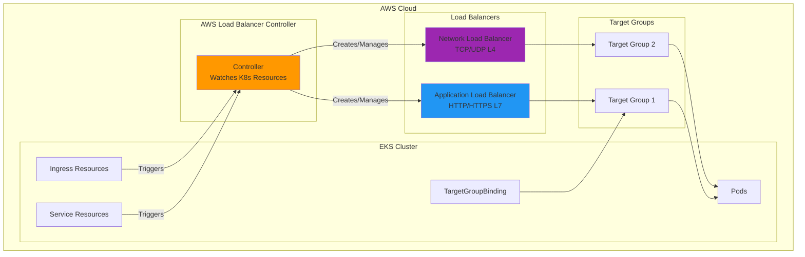
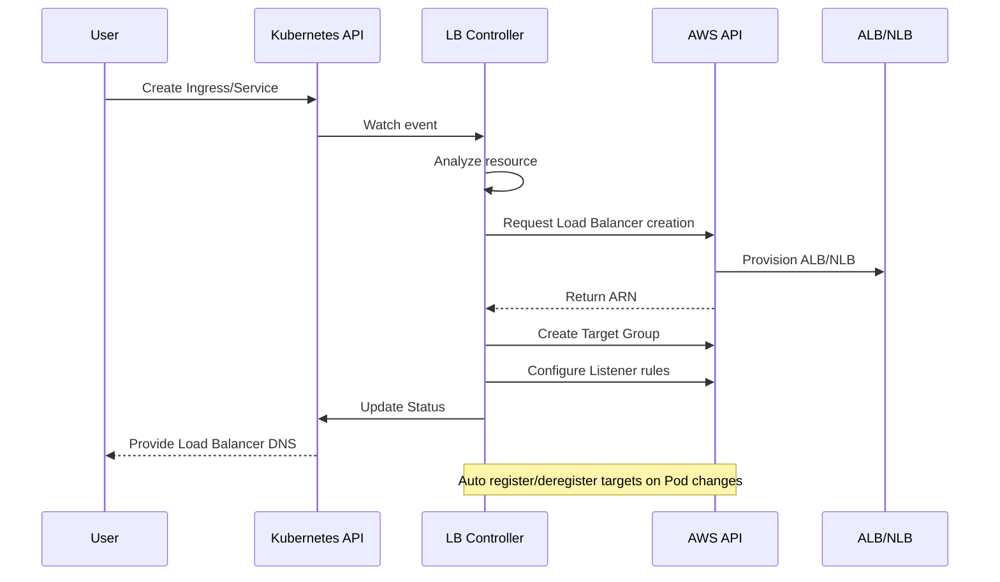

# AWS Load Balancer Controller

> **Versiones compatibles**: AWS Load Balancer Controller v2.8+
> **Última actualización**: July 3, 2026

## Descripción general

AWS Load Balancer Controller es un controlador que administra AWS Elastic Load Balancers (ELB) para clústeres de Kubernetes. Integra automáticamente los recursos Ingress y Service de Kubernetes con AWS Application Load Balancer (ALB) y Network Load Balancer (NLB).

### Características principales

- **Application Load Balancer (ALB)**: tráfico HTTP/HTTPS, enrutamiento basado en rutas, enrutamiento basado en hosts
- **Network Load Balancer (NLB)**: tráfico TCP/UDP, balanceo de carga L4 de alto rendimiento
- **TargetGroupBinding**: conecta Target Groups existentes a Services de Kubernetes
- **Integración con AWS WAF**: aplicación de Web Application Firewall
- **AWS Shield**: protección contra DDoS



## Arquitectura

### Cómo funciona el controlador



### Estructura de componentes

```yaml
# Deployment structure
apiVersion: apps/v1
kind: Deployment
metadata:
  name: aws-load-balancer-controller
  namespace: kube-system
spec:
  replicas: 2  # HA configuration
  selector:
    matchLabels:
      app.kubernetes.io/name: aws-load-balancer-controller
  template:
    spec:
      serviceAccountName: aws-load-balancer-controller
      containers:
        - name: controller
          image: public.ecr.aws/eks/aws-load-balancer-controller:v2.8.0
          args:
            - --cluster-name=my-cluster
            - --ingress-class=alb
            - --aws-vpc-id=vpc-xxxxxxxxx
            - --aws-region=us-east-1
```

## Requisitos previos

### 1. Crear una política IAM

```json
{
  "Version": "2012-10-17",
  "Statement": [
    {
      "Effect": "Allow",
      "Action": [
        "iam:CreateServiceLinkedRole"
      ],
      "Resource": "*",
      "Condition": {
        "StringEquals": {
          "iam:AWSServiceName": "elasticloadbalancing.amazonaws.com"
        }
      }
    },
    {
      "Effect": "Allow",
      "Action": [
        "ec2:DescribeAccountAttributes",
        "ec2:DescribeAddresses",
        "ec2:DescribeAvailabilityZones",
        "ec2:DescribeInternetGateways",
        "ec2:DescribeVpcs",
        "ec2:DescribeVpcPeeringConnections",
        "ec2:DescribeSubnets",
        "ec2:DescribeSecurityGroups",
        "ec2:DescribeInstances",
        "ec2:DescribeNetworkInterfaces",
        "ec2:DescribeTags",
        "ec2:GetCoipPoolUsage",
        "ec2:DescribeCoipPools",
        "elasticloadbalancing:DescribeLoadBalancers",
        "elasticloadbalancing:DescribeLoadBalancerAttributes",
        "elasticloadbalancing:DescribeListeners",
        "elasticloadbalancing:DescribeListenerCertificates",
        "elasticloadbalancing:DescribeSSLPolicies",
        "elasticloadbalancing:DescribeRules",
        "elasticloadbalancing:DescribeTargetGroups",
        "elasticloadbalancing:DescribeTargetGroupAttributes",
        "elasticloadbalancing:DescribeTargetHealth",
        "elasticloadbalancing:DescribeTags",
        "elasticloadbalancing:DescribeTrustStores"
      ],
      "Resource": "*"
    },
    {
      "Effect": "Allow",
      "Action": [
        "cognito-idp:DescribeUserPoolClient",
        "acm:ListCertificates",
        "acm:DescribeCertificate",
        "iam:ListServerCertificates",
        "iam:GetServerCertificate",
        "waf-regional:GetWebACL",
        "waf-regional:GetWebACLForResource",
        "waf-regional:AssociateWebACL",
        "waf-regional:DisassociateWebACL",
        "wafv2:GetWebACL",
        "wafv2:GetWebACLForResource",
        "wafv2:AssociateWebACL",
        "wafv2:DisassociateWebACL",
        "shield:GetSubscriptionState",
        "shield:DescribeProtection",
        "shield:CreateProtection",
        "shield:DeleteProtection"
      ],
      "Resource": "*"
    },
    {
      "Effect": "Allow",
      "Action": [
        "ec2:AuthorizeSecurityGroupIngress",
        "ec2:RevokeSecurityGroupIngress"
      ],
      "Resource": "*"
    },
    {
      "Effect": "Allow",
      "Action": [
        "ec2:CreateSecurityGroup"
      ],
      "Resource": "*"
    },
    {
      "Effect": "Allow",
      "Action": [
        "ec2:CreateTags"
      ],
      "Resource": "arn:aws:ec2:*:*:security-group/*",
      "Condition": {
        "StringEquals": {
          "ec2:CreateAction": "CreateSecurityGroup"
        },
        "Null": {
          "aws:RequestTag/elbv2.k8s.aws/cluster": "false"
        }
      }
    },
    {
      "Effect": "Allow",
      "Action": [
        "ec2:CreateTags",
        "ec2:DeleteTags"
      ],
      "Resource": "arn:aws:ec2:*:*:security-group/*",
      "Condition": {
        "Null": {
          "aws:RequestTag/elbv2.k8s.aws/cluster": "true",
          "aws:ResourceTag/elbv2.k8s.aws/cluster": "false"
        }
      }
    },
    {
      "Effect": "Allow",
      "Action": [
        "ec2:AuthorizeSecurityGroupIngress",
        "ec2:RevokeSecurityGroupIngress",
        "ec2:DeleteSecurityGroup"
      ],
      "Resource": "*",
      "Condition": {
        "Null": {
          "aws:ResourceTag/elbv2.k8s.aws/cluster": "false"
        }
      }
    },
    {
      "Effect": "Allow",
      "Action": [
        "elasticloadbalancing:CreateLoadBalancer",
        "elasticloadbalancing:CreateTargetGroup"
      ],
      "Resource": "*",
      "Condition": {
        "Null": {
          "aws:RequestTag/elbv2.k8s.aws/cluster": "false"
        }
      }
    },
    {
      "Effect": "Allow",
      "Action": [
        "elasticloadbalancing:CreateListener",
        "elasticloadbalancing:DeleteListener",
        "elasticloadbalancing:CreateRule",
        "elasticloadbalancing:DeleteRule"
      ],
      "Resource": "*"
    },
    {
      "Effect": "Allow",
      "Action": [
        "elasticloadbalancing:AddTags",
        "elasticloadbalancing:RemoveTags"
      ],
      "Resource": [
        "arn:aws:elasticloadbalancing:*:*:targetgroup/*/*",
        "arn:aws:elasticloadbalancing:*:*:loadbalancer/net/*/*",
        "arn:aws:elasticloadbalancing:*:*:loadbalancer/app/*/*"
      ],
      "Condition": {
        "Null": {
          "aws:RequestTag/elbv2.k8s.aws/cluster": "true",
          "aws:ResourceTag/elbv2.k8s.aws/cluster": "false"
        }
      }
    },
    {
      "Effect": "Allow",
      "Action": [
        "elasticloadbalancing:AddTags",
        "elasticloadbalancing:RemoveTags"
      ],
      "Resource": [
        "arn:aws:elasticloadbalancing:*:*:listener/net/*/*/*",
        "arn:aws:elasticloadbalancing:*:*:listener/app/*/*/*",
        "arn:aws:elasticloadbalancing:*:*:listener-rule/net/*/*/*",
        "arn:aws:elasticloadbalancing:*:*:listener-rule/app/*/*/*"
      ]
    },
    {
      "Effect": "Allow",
      "Action": [
        "elasticloadbalancing:ModifyLoadBalancerAttributes",
        "elasticloadbalancing:SetIpAddressType",
        "elasticloadbalancing:SetSecurityGroups",
        "elasticloadbalancing:SetSubnets",
        "elasticloadbalancing:DeleteLoadBalancer",
        "elasticloadbalancing:ModifyTargetGroup",
        "elasticloadbalancing:ModifyTargetGroupAttributes",
        "elasticloadbalancing:DeleteTargetGroup"
      ],
      "Resource": "*",
      "Condition": {
        "Null": {
          "aws:ResourceTag/elbv2.k8s.aws/cluster": "false"
        }
      }
    },
    {
      "Effect": "Allow",
      "Action": [
        "elasticloadbalancing:AddTags"
      ],
      "Resource": [
        "arn:aws:elasticloadbalancing:*:*:targetgroup/*/*",
        "arn:aws:elasticloadbalancing:*:*:loadbalancer/net/*/*",
        "arn:aws:elasticloadbalancing:*:*:loadbalancer/app/*/*"
      ],
      "Condition": {
        "StringEquals": {
          "elasticloadbalancing:CreateAction": [
            "CreateTargetGroup",
            "CreateLoadBalancer"
          ]
        },
        "Null": {
          "aws:RequestTag/elbv2.k8s.aws/cluster": "false"
        }
      }
    },
    {
      "Effect": "Allow",
      "Action": [
        "elasticloadbalancing:RegisterTargets",
        "elasticloadbalancing:DeregisterTargets"
      ],
      "Resource": "arn:aws:elasticloadbalancing:*:*:targetgroup/*/*"
    },
    {
      "Effect": "Allow",
      "Action": [
        "elasticloadbalancing:SetWebAcl",
        "elasticloadbalancing:ModifyListener",
        "elasticloadbalancing:AddListenerCertificates",
        "elasticloadbalancing:RemoveListenerCertificates",
        "elasticloadbalancing:ModifyRule"
      ],
      "Resource": "*"
    }
  ]
}
```

### 2. Configuración de IRSA

```bash
# Check OIDC Provider
aws eks describe-cluster --name my-cluster --query "cluster.identity.oidc.issuer" --output text

# Create OIDC Provider if not exists
eksctl utils associate-iam-oidc-provider --cluster my-cluster --approve

# Create IAM policy
curl -o iam_policy.json https://raw.githubusercontent.com/kubernetes-sigs/aws-load-balancer-controller/v2.8.0/docs/install/iam_policy.json

aws iam create-policy \
  --policy-name AWSLoadBalancerControllerIAMPolicy \
  --policy-document file://iam_policy.json

# Create Service Account
eksctl create iamserviceaccount \
  --cluster=my-cluster \
  --namespace=kube-system \
  --name=aws-load-balancer-controller \
  --role-name AmazonEKSLoadBalancerControllerRole \
  --attach-policy-arn=arn:aws:iam::<ACCOUNT_ID>:policy/AWSLoadBalancerControllerIAMPolicy \
  --approve
```

## Instalación

### Instalación con Helm

```bash
# Add Helm repo
helm repo add eks https://aws.github.io/eks-charts
helm repo update

# Install
helm install aws-load-balancer-controller eks/aws-load-balancer-controller \
  -n kube-system \
  --set clusterName=my-cluster \
  --set serviceAccount.create=false \
  --set serviceAccount.name=aws-load-balancer-controller \
  --set region=us-east-1 \
  --set vpcId=vpc-xxxxxxxxx
```

```yaml
# values.yaml example
clusterName: my-cluster
serviceAccount:
  create: false
  name: aws-load-balancer-controller

region: us-east-1
vpcId: vpc-xxxxxxxxx

# Resource settings
resources:
  requests:
    cpu: 100m
    memory: 128Mi
  limits:
    cpu: 200m
    memory: 256Mi

# Replica count
replicaCount: 2

# Pod Disruption Budget
podDisruptionBudget:
  minAvailable: 1

# Anti-Affinity for HA
affinity:
  podAntiAffinity:
    preferredDuringSchedulingIgnoredDuringExecution:
      - weight: 100
        podAffinityTerm:
          labelSelector:
            matchExpressions:
              - key: app.kubernetes.io/name
                operator: In
                values:
                  - aws-load-balancer-controller
          topologyKey: kubernetes.io/hostname

# Webhook certificates
enableCertManager: false

# Log level
logLevel: info

# IngressClass settings
ingressClass: alb
createIngressClassResource: true

# Additional settings
enableShield: false
enableWaf: false
enableWafv2: true
```

### Verificar la instalación

```bash
# Check Deployment status
kubectl get deployment -n kube-system aws-load-balancer-controller

# Check Pod status
kubectl get pods -n kube-system -l app.kubernetes.io/name=aws-load-balancer-controller

# Check logs
kubectl logs -n kube-system -l app.kubernetes.io/name=aws-load-balancer-controller

# Check IngressClass
kubectl get ingressclass
```

## Application Load Balancer (ALB)

### Configuración básica de Ingress

```yaml
apiVersion: networking.k8s.io/v1
kind: Ingress
metadata:
  name: my-ingress
  namespace: default
  annotations:
    # ALB scheme (internet-facing or internal)
    alb.ingress.kubernetes.io/scheme: internet-facing

    # Target Type (ip or instance)
    alb.ingress.kubernetes.io/target-type: ip

    # Listener ports
    alb.ingress.kubernetes.io/listen-ports: '[{"HTTP": 80}, {"HTTPS": 443}]'

    # SSL redirect
    alb.ingress.kubernetes.io/ssl-redirect: "443"

    # ACM certificate
    alb.ingress.kubernetes.io/certificate-arn: arn:aws:acm:us-east-1:ACCOUNT:certificate/CERT_ID

    # Subnet specification
    alb.ingress.kubernetes.io/subnets: subnet-xxx,subnet-yyy,subnet-zzz

    # Security groups
    alb.ingress.kubernetes.io/security-groups: sg-xxxxxxxxx

    # Health check settings
    alb.ingress.kubernetes.io/healthcheck-path: /health
    alb.ingress.kubernetes.io/healthcheck-interval-seconds: "15"
    alb.ingress.kubernetes.io/healthcheck-timeout-seconds: "5"
    alb.ingress.kubernetes.io/healthy-threshold-count: "2"
    alb.ingress.kubernetes.io/unhealthy-threshold-count: "2"

spec:
  ingressClassName: alb
  rules:
    - host: api.example.com
      http:
        paths:
          - path: /
            pathType: Prefix
            backend:
              service:
                name: api-service
                port:
                  number: 80
```

### Configuración avanzada de Ingress

```yaml
apiVersion: networking.k8s.io/v1
kind: Ingress
metadata:
  name: advanced-ingress
  annotations:
    alb.ingress.kubernetes.io/scheme: internet-facing
    alb.ingress.kubernetes.io/target-type: ip

    # Group multiple Ingresses into single ALB
    alb.ingress.kubernetes.io/group.name: my-app-group
    alb.ingress.kubernetes.io/group.order: "10"

    # Sticky Sessions
    alb.ingress.kubernetes.io/target-group-attributes: stickiness.enabled=true,stickiness.lb_cookie.duration_seconds=60

    # Slow start
    alb.ingress.kubernetes.io/target-group-attributes: slow_start.duration_seconds=30

    # Connection draining
    alb.ingress.kubernetes.io/target-group-attributes: deregistration_delay.timeout_seconds=30

    # IP address type
    alb.ingress.kubernetes.io/ip-address-type: dualstack

    # Load balancer attributes
    alb.ingress.kubernetes.io/load-balancer-attributes: >-
      idle_timeout.timeout_seconds=60,
      routing.http2.enabled=true,
      routing.http.drop_invalid_header_fields.enabled=true

    # Access logs
    alb.ingress.kubernetes.io/load-balancer-attributes: >-
      access_logs.s3.enabled=true,
      access_logs.s3.bucket=my-alb-logs,
      access_logs.s3.prefix=my-app

    # Tags
    alb.ingress.kubernetes.io/tags: Environment=production,Team=platform

    # WAF v2 integration
    alb.ingress.kubernetes.io/wafv2-acl-arn: arn:aws:wafv2:us-east-1:ACCOUNT:regional/webacl/my-acl/xxx

    # Shield Advanced
    alb.ingress.kubernetes.io/shield-advanced-protection: "true"

spec:
  ingressClassName: alb
  tls:
    - hosts:
        - api.example.com
        - www.example.com
  rules:
    - host: api.example.com
      http:
        paths:
          - path: /v1
            pathType: Prefix
            backend:
              service:
                name: api-v1
                port:
                  number: 80
          - path: /v2
            pathType: Prefix
            backend:
              service:
                name: api-v2
                port:
                  number: 80
    - host: www.example.com
      http:
        paths:
          - path: /
            pathType: Prefix
            backend:
              service:
                name: web-frontend
                port:
                  number: 80
```

### Enrutamiento basado en rutas

```yaml
apiVersion: networking.k8s.io/v1
kind: Ingress
metadata:
  name: path-based-routing
  annotations:
    alb.ingress.kubernetes.io/scheme: internet-facing
    alb.ingress.kubernetes.io/target-type: ip

    # Condition-based routing
    alb.ingress.kubernetes.io/conditions.api-v2: >-
      [{"field":"http-header","httpHeaderConfig":{"httpHeaderName":"X-Api-Version","values":["v2"]}}]

spec:
  ingressClassName: alb
  rules:
    - host: api.example.com
      http:
        paths:
          # Exact path matching
          - path: /health
            pathType: Exact
            backend:
              service:
                name: health-service
                port:
                  number: 80

          # API version routing
          - path: /api
            pathType: Prefix
            backend:
              service:
                name: api-v1
                port:
                  number: 80

          # Static files
          - path: /static
            pathType: Prefix
            backend:
              service:
                name: static-service
                port:
                  number: 80

          # Default path
          - path: /
            pathType: Prefix
            backend:
              service:
                name: default-service
                port:
                  number: 80
```

### Configuración de autenticación

```yaml
apiVersion: networking.k8s.io/v1
kind: Ingress
metadata:
  name: auth-ingress
  annotations:
    alb.ingress.kubernetes.io/scheme: internet-facing
    alb.ingress.kubernetes.io/target-type: ip

    # Cognito authentication
    alb.ingress.kubernetes.io/auth-type: cognito
    alb.ingress.kubernetes.io/auth-idp-cognito: >-
      {"userPoolARN":"arn:aws:cognito-idp:us-east-1:ACCOUNT:userpool/us-east-1_xxxxx",
       "userPoolClientID":"xxxxxxxxx",
       "userPoolDomain":"my-domain"}
    alb.ingress.kubernetes.io/auth-on-unauthenticated-request: authenticate
    alb.ingress.kubernetes.io/auth-scope: "openid profile email"
    alb.ingress.kubernetes.io/auth-session-cookie: "AWSELBAuthSessionCookie"
    alb.ingress.kubernetes.io/auth-session-timeout: "3600"

spec:
  ingressClassName: alb
  rules:
    - host: app.example.com
      http:
        paths:
          - path: /
            pathType: Prefix
            backend:
              service:
                name: protected-app
                port:
                  number: 80
```

```yaml
# OIDC Authentication Example
apiVersion: networking.k8s.io/v1
kind: Ingress
metadata:
  name: oidc-ingress
  annotations:
    alb.ingress.kubernetes.io/scheme: internet-facing
    alb.ingress.kubernetes.io/target-type: ip

    # OIDC authentication
    alb.ingress.kubernetes.io/auth-type: oidc
    alb.ingress.kubernetes.io/auth-idp-oidc: >-
      {"issuer":"https://accounts.google.com",
       "authorizationEndpoint":"https://accounts.google.com/o/oauth2/v2/auth",
       "tokenEndpoint":"https://oauth2.googleapis.com/token",
       "userInfoEndpoint":"https://openidconnect.googleapis.com/v1/userinfo",
       "secretName":"oidc-secret"}
    alb.ingress.kubernetes.io/auth-on-unauthenticated-request: authenticate

spec:
  ingressClassName: alb
  rules:
    - host: app.example.com
      http:
        paths:
          - path: /
            pathType: Prefix
            backend:
              service:
                name: protected-app
                port:
                  number: 80
---
# OIDC Secret
apiVersion: v1
kind: Secret
metadata:
  name: oidc-secret
type: Opaque
stringData:
  clientID: your-client-id
  clientSecret: your-client-secret
```

## Network Load Balancer (NLB)

### Configuración básica de Service NLB

```yaml
apiVersion: v1
kind: Service
metadata:
  name: nlb-service
  annotations:
    # Specify NLB type
    service.beta.kubernetes.io/aws-load-balancer-type: "external"
    service.beta.kubernetes.io/aws-load-balancer-nlb-target-type: "ip"

    # Scheme
    service.beta.kubernetes.io/aws-load-balancer-scheme: "internet-facing"

    # Subnet specification
    service.beta.kubernetes.io/aws-load-balancer-subnets: subnet-xxx,subnet-yyy

    # Health check
    service.beta.kubernetes.io/aws-load-balancer-healthcheck-protocol: "HTTP"
    service.beta.kubernetes.io/aws-load-balancer-healthcheck-path: "/health"
    service.beta.kubernetes.io/aws-load-balancer-healthcheck-port: "8080"
    service.beta.kubernetes.io/aws-load-balancer-healthcheck-interval: "10"
    service.beta.kubernetes.io/aws-load-balancer-healthcheck-healthy-threshold: "2"
    service.beta.kubernetes.io/aws-load-balancer-healthcheck-unhealthy-threshold: "2"

spec:
  type: LoadBalancer
  selector:
    app: my-app
  ports:
    - name: tcp
      port: 80
      targetPort: 8080
      protocol: TCP
```

### Terminación TLS de NLB

```yaml
apiVersion: v1
kind: Service
metadata:
  name: nlb-tls-service
  annotations:
    service.beta.kubernetes.io/aws-load-balancer-type: "external"
    service.beta.kubernetes.io/aws-load-balancer-nlb-target-type: "ip"
    service.beta.kubernetes.io/aws-load-balancer-scheme: "internet-facing"

    # TLS configuration
    service.beta.kubernetes.io/aws-load-balancer-ssl-cert: "arn:aws:acm:us-east-1:ACCOUNT:certificate/CERT_ID"
    service.beta.kubernetes.io/aws-load-balancer-ssl-ports: "443"
    service.beta.kubernetes.io/aws-load-balancer-ssl-negotiation-policy: "ELBSecurityPolicy-TLS13-1-2-2021-06"

    # Backend is HTTP
    service.beta.kubernetes.io/aws-load-balancer-backend-protocol: "tcp"

spec:
  type: LoadBalancer
  selector:
    app: my-app
  ports:
    - name: https
      port: 443
      targetPort: 8080
      protocol: TCP
```

### NLB interno

```yaml
apiVersion: v1
kind: Service
metadata:
  name: internal-nlb
  annotations:
    service.beta.kubernetes.io/aws-load-balancer-type: "external"
    service.beta.kubernetes.io/aws-load-balancer-nlb-target-type: "ip"

    # Internal scheme
    service.beta.kubernetes.io/aws-load-balancer-scheme: "internal"

    # Cross-zone load balancing
    service.beta.kubernetes.io/aws-load-balancer-attributes: "load_balancing.cross_zone.enabled=true"

    # Private subnets
    service.beta.kubernetes.io/aws-load-balancer-subnets: subnet-private-a,subnet-private-b

    # Security groups (optional)
    service.beta.kubernetes.io/aws-load-balancer-security-groups: sg-xxxxxxxxx

spec:
  type: LoadBalancer
  selector:
    app: internal-service
  ports:
    - port: 80
      targetPort: 8080
```

### Compatibilidad con UDP de NLB

```yaml
apiVersion: v1
kind: Service
metadata:
  name: udp-nlb
  annotations:
    service.beta.kubernetes.io/aws-load-balancer-type: "external"
    service.beta.kubernetes.io/aws-load-balancer-nlb-target-type: "ip"
    service.beta.kubernetes.io/aws-load-balancer-scheme: "internet-facing"

spec:
  type: LoadBalancer
  selector:
    app: dns-server
  ports:
    - name: dns-udp
      port: 53
      targetPort: 53
      protocol: UDP
    - name: dns-tcp
      port: 53
      targetPort: 53
      protocol: TCP
```

### Proxy Protocol v2

```yaml
apiVersion: v1
kind: Service
metadata:
  name: proxy-protocol-nlb
  annotations:
    service.beta.kubernetes.io/aws-load-balancer-type: "external"
    service.beta.kubernetes.io/aws-load-balancer-nlb-target-type: "ip"
    service.beta.kubernetes.io/aws-load-balancer-scheme: "internet-facing"

    # Enable Proxy Protocol v2
    service.beta.kubernetes.io/aws-load-balancer-proxy-protocol: "*"

    # Target Group attributes
    service.beta.kubernetes.io/aws-load-balancer-target-group-attributes: >-
      proxy_protocol_v2.enabled=true,
      preserve_client_ip.enabled=true

spec:
  type: LoadBalancer
  selector:
    app: proxy-aware-app
  ports:
    - port: 80
      targetPort: 8080
```

## IngressClass e IngressClassParams

### Definición de IngressClass

```yaml
apiVersion: networking.k8s.io/v1
kind: IngressClass
metadata:
  name: alb
  annotations:
    ingressclass.kubernetes.io/is-default-class: "true"
spec:
  controller: ingress.k8s.aws/alb
  parameters:
    apiGroup: elbv2.k8s.aws
    kind: IngressClassParams
    name: alb-params
```

### Configuración de IngressClassParams

```yaml
apiVersion: elbv2.k8s.aws/v1beta1
kind: IngressClassParams
metadata:
  name: alb-params
spec:
  # Default scheme
  scheme: internet-facing

  # IP address type
  ipAddressType: dualstack

  # Namespace selector (allow only specific namespaces)
  namespaceSelector:
    matchLabels:
      alb-enabled: "true"

  # Default tags
  tags:
    - key: Environment
      value: production
    - key: ManagedBy
      value: aws-load-balancer-controller

  # Load balancer attributes
  loadBalancerAttributes:
    - key: idle_timeout.timeout_seconds
      value: "60"
    - key: routing.http2.enabled
      value: "true"

  # Subnet selection
  # subnets:
  #   ids:
  #     - subnet-xxx
  #     - subnet-yyy
  #   tags:
  #     - key: kubernetes.io/role/elb
  #       value: "1"

  # Group settings
  group:
    name: my-default-group
```

## TargetGroupBinding

El CRD TargetGroupBinding permite conectar directamente Target Groups de AWS existentes a Services de Kubernetes.

### TargetGroupBinding básico

```yaml
apiVersion: elbv2.k8s.aws/v1beta1
kind: TargetGroupBinding
metadata:
  name: my-tgb
  namespace: default
spec:
  # Existing Target Group ARN
  targetGroupARN: arn:aws:elasticloadbalancing:us-east-1:ACCOUNT:targetgroup/my-tg/xxxxxxxxxxxx

  # Service to connect
  serviceRef:
    name: my-service
    port: 80

  # Target Type (ip or instance)
  targetType: ip

  # Networking settings
  networking:
    ingress:
      - from:
          - securityGroup:
              groupID: sg-xxxxxxxxx
        ports:
          - port: 80
            protocol: TCP
```

### TargetGroupBinding avanzado

```yaml
apiVersion: elbv2.k8s.aws/v1beta1
kind: TargetGroupBinding
metadata:
  name: advanced-tgb
  namespace: production
spec:
  targetGroupARN: arn:aws:elasticloadbalancing:us-east-1:ACCOUNT:targetgroup/prod-tg/xxxxxxxxxxxx

  serviceRef:
    name: production-service
    port: 8080

  targetType: ip

  # IP address type
  ipAddressType: ipv4

  # VPC ID (auto-detected, can be explicit)
  # vpcID: vpc-xxxxxxxxx

  # Networking settings
  networking:
    ingress:
      # Allow traffic from multiple security groups
      - from:
          - securityGroup:
              groupID: sg-alb-sg
          - securityGroup:
              groupID: sg-internal-sg
        ports:
          - port: 8080
            protocol: TCP
          - port: 8443
            protocol: TCP

  # Node Selector (only Pods on specific nodes as targets)
  # nodeSelector:
  #   matchLabels:
  #     node-type: compute
```

### TargetGroupBinding de varios puertos

```yaml
# Separate TargetGroupBindings for multiple ports
---
apiVersion: elbv2.k8s.aws/v1beta1
kind: TargetGroupBinding
metadata:
  name: http-tgb
spec:
  targetGroupARN: arn:aws:elasticloadbalancing:...:targetgroup/http-tg/xxx
  serviceRef:
    name: multi-port-service
    port: 80
  targetType: ip
---
apiVersion: elbv2.k8s.aws/v1beta1
kind: TargetGroupBinding
metadata:
  name: https-tgb
spec:
  targetGroupARN: arn:aws:elasticloadbalancing:...:targetgroup/https-tg/yyy
  serviceRef:
    name: multi-port-service
    port: 443
  targetType: ip
```

## Integración con WAF y Shield

### Integración con AWS WAF v2

```yaml
apiVersion: networking.k8s.io/v1
kind: Ingress
metadata:
  name: waf-protected-ingress
  annotations:
    alb.ingress.kubernetes.io/scheme: internet-facing
    alb.ingress.kubernetes.io/target-type: ip

    # Connect WAF v2 WebACL
    alb.ingress.kubernetes.io/wafv2-acl-arn: arn:aws:wafv2:us-east-1:ACCOUNT:regional/webacl/my-webacl/xxxxxxxx-xxxx-xxxx-xxxx-xxxxxxxxxxxx

spec:
  ingressClassName: alb
  rules:
    - host: api.example.com
      http:
        paths:
          - path: /
            pathType: Prefix
            backend:
              service:
                name: api-service
                port:
                  number: 80
```

### AWS Shield Advanced

```yaml
apiVersion: networking.k8s.io/v1
kind: Ingress
metadata:
  name: shield-protected-ingress
  annotations:
    alb.ingress.kubernetes.io/scheme: internet-facing
    alb.ingress.kubernetes.io/target-type: ip

    # Enable Shield Advanced protection
    alb.ingress.kubernetes.io/shield-advanced-protection: "true"

spec:
  ingressClassName: alb
  rules:
    - host: critical-app.example.com
      http:
        paths:
          - path: /
            pathType: Prefix
            backend:
              service:
                name: critical-service
                port:
                  number: 80
```

## Actualizaciones destacadas de versiones

### v2.16 (diciembre de 2025)

- **ALB Target Optimizer**: un contenedor sidecar recopila métricas de rendimiento de targets en tiempo real y enruta el tráfico según la capacidad de los targets
- **NLB Weighted Target Groups**: habilita despliegues Blue/Green y Canary mediante un único NLB
- **ALB JWT Validation**: realiza validación de JWT a nivel de ALB mediante la anotación `alb.ingress.kubernetes.io/jwt-validation`
- **NLB QUIC Passthrough**: compatibilidad con el paso de tráfico del protocolo QUIC

```yaml
# ALB JWT Validation example
alb.ingress.kubernetes.io/jwt-validation: >-
  {"issuer":"https://accounts.example.com","jwksUri":"https://accounts.example.com/.well-known/jwks.json"}
```

### v2.17 (v2.17.0 / v2.17.1, diciembre de 2025 - enero de 2026, Kubernetes 1.22+)

- **Se introdujo AWS Global Accelerator Controller**: administra declarativamente Global Accelerator como recursos de Kubernetes mediante CRD `Accelerator`/`Listener`/`EndpointGroup`/`Endpoint`
- Se amplió la compatibilidad con el protocolo QUIC
- Se añadió la opción `--default-load-balancer-scheme` (establece un esquema predeterminado cuando no se especifica la anotación)

> A partir de esta versión, la compatibilidad con Gateway API alcanzó el estado de Release Candidate antes de GA. Consulta la [documentación de Gateway API](./04-gateway-api.md) para Gateway API GA (v3.0.0) y las herramientas de migración posteriores.

## Referencia de anotaciones

### Anotaciones de ALB Ingress

| Annotation | Descripción | Predeterminado |
|------------|-------------|----------------|
| `alb.ingress.kubernetes.io/scheme` | internet-facing o internal | internal |
| `alb.ingress.kubernetes.io/target-type` | ip o instance | instance |
| `alb.ingress.kubernetes.io/subnets` | ID o nombres de Subnet | Detección automática |
| `alb.ingress.kubernetes.io/security-groups` | ID de Security Group | Creación automática |
| `alb.ingress.kubernetes.io/listen-ports` | JSON de puertos de Listener | [{"HTTP": 80}] |
| `alb.ingress.kubernetes.io/certificate-arn` | ARN de certificado ACM | - |
| `alb.ingress.kubernetes.io/ssl-redirect` | puerto de redirección SSL | - |
| `alb.ingress.kubernetes.io/ssl-policy` | política SSL | ELBSecurityPolicy-2016-08 |
| `alb.ingress.kubernetes.io/healthcheck-path` | ruta de Health Check | / |
| `alb.ingress.kubernetes.io/healthcheck-port` | puerto de Health Check | traffic-port |
| `alb.ingress.kubernetes.io/healthcheck-protocol` | protocolo de Health Check | HTTP |
| `alb.ingress.kubernetes.io/healthcheck-interval-seconds` | intervalo de Health Check | 15 |
| `alb.ingress.kubernetes.io/healthcheck-timeout-seconds` | tiempo de espera de Health Check | 5 |
| `alb.ingress.kubernetes.io/healthy-threshold-count` | umbral de estado correcto | 2 |
| `alb.ingress.kubernetes.io/unhealthy-threshold-count` | umbral de estado incorrecto | 2 |
| `alb.ingress.kubernetes.io/group.name` | nombre del grupo Ingress | - |
| `alb.ingress.kubernetes.io/group.order` | prioridad dentro del grupo | 0 |
| `alb.ingress.kubernetes.io/ip-address-type` | ipv4 o dualstack | ipv4 |
| `alb.ingress.kubernetes.io/load-balancer-attributes` | atributos de LB | - |
| `alb.ingress.kubernetes.io/target-group-attributes` | atributos de TG | - |
| `alb.ingress.kubernetes.io/tags` | tags de recursos | - |
| `alb.ingress.kubernetes.io/wafv2-acl-arn` | ARN de WebACL de WAF v2 | - |
| `alb.ingress.kubernetes.io/shield-advanced-protection` | protección de Shield | false |
| `alb.ingress.kubernetes.io/auth-type` | tipo de autenticación (none, cognito, oidc) | none |

### Anotaciones de Service NLB

| Annotation | Descripción | Predeterminado |
|------------|-------------|----------------|
| `service.beta.kubernetes.io/aws-load-balancer-type` | external (NLB) o nlb | - |
| `service.beta.kubernetes.io/aws-load-balancer-nlb-target-type` | ip o instance | instance |
| `service.beta.kubernetes.io/aws-load-balancer-scheme` | internet-facing o internal | internal |
| `service.beta.kubernetes.io/aws-load-balancer-subnets` | ID de Subnet | Detección automática |
| `service.beta.kubernetes.io/aws-load-balancer-ssl-cert` | ARN de certificado ACM | - |
| `service.beta.kubernetes.io/aws-load-balancer-ssl-ports` | puertos con SSL habilitado | - |
| `service.beta.kubernetes.io/aws-load-balancer-ssl-negotiation-policy` | política SSL | - |
| `service.beta.kubernetes.io/aws-load-balancer-backend-protocol` | protocolo de backend | - |
| `service.beta.kubernetes.io/aws-load-balancer-proxy-protocol` | Proxy Protocol | - |
| `service.beta.kubernetes.io/aws-load-balancer-cross-zone-load-balancing-enabled` | LB entre zonas | true |
| `service.beta.kubernetes.io/aws-load-balancer-healthcheck-protocol` | protocolo de Health Check | TCP |
| `service.beta.kubernetes.io/aws-load-balancer-healthcheck-path` | ruta de Health Check | - |
| `service.beta.kubernetes.io/aws-load-balancer-healthcheck-port` | puerto de Health Check | - |
| `service.beta.kubernetes.io/aws-load-balancer-attributes` | atributos de LB | - |
| `service.beta.kubernetes.io/aws-load-balancer-target-group-attributes` | atributos de TG | - |
| `service.beta.kubernetes.io/aws-load-balancer-security-groups` | Security Groups | Creación automática |

## Prácticas recomendadas para EKS

### 1. Etiquetado de Subnet

```bash
# Public subnets (for internet-facing ALB/NLB)
aws ec2 create-tags \
  --resources subnet-xxx \
  --tags Key=kubernetes.io/role/elb,Value=1

# Private subnets (for internal ALB/NLB)
aws ec2 create-tags \
  --resources subnet-yyy \
  --tags Key=kubernetes.io/role/internal-elb,Value=1

# Cluster-specific tag (optional)
aws ec2 create-tags \
  --resources subnet-xxx subnet-yyy \
  --tags Key=kubernetes.io/cluster/my-cluster,Value=shared
```

### 2. Administración de Security Groups

```yaml
apiVersion: networking.k8s.io/v1
kind: Ingress
metadata:
  name: secure-ingress
  annotations:
    alb.ingress.kubernetes.io/scheme: internet-facing
    alb.ingress.kubernetes.io/target-type: ip

    # Explicit security group specification
    alb.ingress.kubernetes.io/security-groups: sg-alb-external

    # Restrict inbound CIDRs
    alb.ingress.kubernetes.io/inbound-cidrs: "10.0.0.0/8, 172.16.0.0/12"

    # Additional security groups (for backend communication)
    alb.ingress.kubernetes.io/manage-backend-security-group-rules: "true"

spec:
  ingressClassName: alb
  rules:
    - host: api.example.com
      http:
        paths:
          - path: /
            pathType: Prefix
            backend:
              service:
                name: api-service
                port:
                  number: 80
```

### 3. Optimización de costos

```yaml
# Share ALB using Ingress groups
apiVersion: networking.k8s.io/v1
kind: Ingress
metadata:
  name: app1-ingress
  annotations:
    alb.ingress.kubernetes.io/group.name: shared-alb
    alb.ingress.kubernetes.io/group.order: "1"
spec:
  ingressClassName: alb
  rules:
    - host: app1.example.com
      http:
        paths:
          - path: /
            pathType: Prefix
            backend:
              service:
                name: app1
                port:
                  number: 80
---
apiVersion: networking.k8s.io/v1
kind: Ingress
metadata:
  name: app2-ingress
  annotations:
    alb.ingress.kubernetes.io/group.name: shared-alb
    alb.ingress.kubernetes.io/group.order: "2"
spec:
  ingressClassName: alb
  rules:
    - host: app2.example.com
      http:
        paths:
          - path: /
            pathType: Prefix
            backend:
              service:
                name: app2
                port:
                  number: 80
```

### 4. Configuración de alta disponibilidad

```yaml
apiVersion: networking.k8s.io/v1
kind: Ingress
metadata:
  name: ha-ingress
  annotations:
    alb.ingress.kubernetes.io/scheme: internet-facing
    alb.ingress.kubernetes.io/target-type: ip

    # Specify subnets in 3+ AZs
    alb.ingress.kubernetes.io/subnets: subnet-az-a,subnet-az-b,subnet-az-c

    # Cross-zone load balancing
    alb.ingress.kubernetes.io/load-balancer-attributes: load_balancing.cross_zone.enabled=true

    # Health check optimization
    alb.ingress.kubernetes.io/healthcheck-interval-seconds: "10"
    alb.ingress.kubernetes.io/healthy-threshold-count: "2"
    alb.ingress.kubernetes.io/unhealthy-threshold-count: "2"

    # Draining timeout
    alb.ingress.kubernetes.io/target-group-attributes: deregistration_delay.timeout_seconds=30

spec:
  ingressClassName: alb
  rules:
    - host: api.example.com
      http:
        paths:
          - path: /
            pathType: Prefix
            backend:
              service:
                name: api-service
                port:
                  number: 80
```

## Solución de problemas

### Problemas comunes

#### 1. ALB no se crea

```bash
# Check controller logs
kubectl logs -n kube-system -l app.kubernetes.io/name=aws-load-balancer-controller

# Check Ingress events
kubectl describe ingress <ingress-name>

# Common causes:
# - Insufficient IAM permissions
# - Missing subnet tags
# - IngressClass not specified
```

#### 2. Targets no saludables

```bash
# Check Target Group status
aws elbv2 describe-target-health \
  --target-group-arn arn:aws:elasticloadbalancing:...

# Check Pod logs
kubectl logs <pod-name>

# Test health check endpoint
kubectl exec -it <pod-name> -- curl localhost:8080/health

# Check security groups
aws ec2 describe-security-groups --group-ids sg-xxx
```

#### 3. 502 Bad Gateway

```bash
# Root cause analysis:
# 1. Pod not ready
kubectl get pods -l app=my-app

# 2. Target Group draining
aws elbv2 describe-target-health --target-group-arn ...

# 3. Health check failure
# - Verify health check path
# - Adjust health check timeout

# 4. Security group rules
# - Verify ALB -> Pod communication allowed
```

#### 4. Problemas con certificados SSL

```bash
# Check ACM certificate status
aws acm describe-certificate --certificate-arn arn:aws:acm:...

# Verify certificate is ISSUED status
# Check domain validation completed

# Verify region (must be same region as ALB)
```

### Comandos de depuración

```bash
# Controller detailed logs
kubectl logs -n kube-system deployment/aws-load-balancer-controller -f

# Ingress status check
kubectl get ingress -o wide
kubectl describe ingress <name>

# Service status check
kubectl get svc -o wide
kubectl describe svc <name>

# TargetGroupBinding status check
kubectl get targetgroupbindings -A
kubectl describe targetgroupbinding <name>

# AWS resource check
aws elbv2 describe-load-balancers --query 'LoadBalancers[?contains(LoadBalancerName, `k8s`)]'
aws elbv2 describe-target-groups --query 'TargetGroups[?contains(TargetGroupName, `k8s`)]'
```

---

## Referencias

- [Documentación de AWS Load Balancer Controller](https://kubernetes-sigs.github.io/aws-load-balancer-controller/)
- [Repositorio de GitHub](https://github.com/kubernetes-sigs/aws-load-balancer-controller)
- [Guía del usuario de EKS](https://docs.aws.amazon.com/eks/latest/userguide/aws-load-balancer-controller.html)
- [Documentación de ALB](https://docs.aws.amazon.com/elasticloadbalancing/latest/application/)
- [Documentación de NLB](https://docs.aws.amazon.com/elasticloadbalancing/latest/network/)
