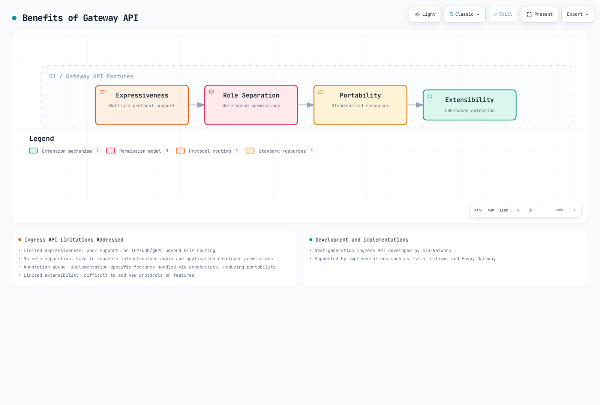
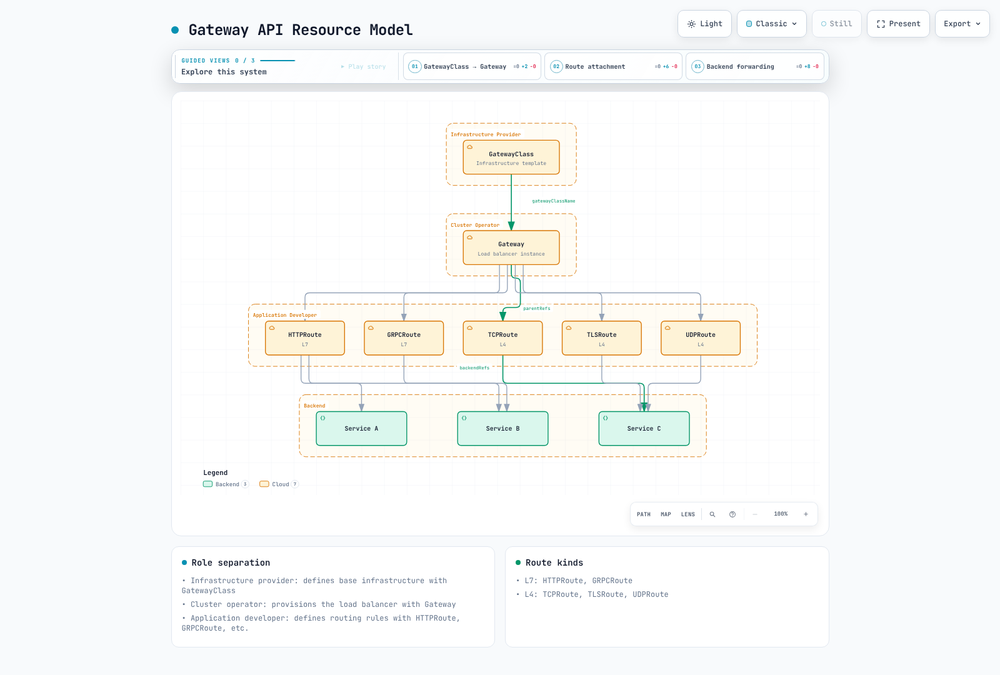

# Kubernetes Gateway API

> **Base de API**: Gateway API v1.6 Standard; seleccione el paquete exacto compatible con su controlador.
> **Última actualización**: 12 de septiembre de 2026

## Descripción general

Gateway API es la API de entrada de nueva generación para Kubernetes, diseñada para superar las limitaciones de Ingress y ofrecer un enrutamiento de red más expresivo y extensible. Desarrollada por SIG-Network, cuenta con implementaciones como Istio, Cilium, Envoy Gateway y otras.

### Limitaciones de Ingress API

| Problema | Descripción |
|---------|-------------|
| **Expresividad limitada** | Soporte escaso para TCP/UDP/gRPC más allá del enrutamiento HTTP |
| **Responsabilidades combinadas** | RBAC/IngressClass pueden restringir acceso, pero las funciones de listeners y rutas están menos separadas explícitamente |
| **Abuso de anotaciones** | Las funciones específicas de implementación se gestionan mediante anotaciones, reduciendo la portabilidad |
| **Extensibilidad limitada** | Dificultad para añadir protocolos o funciones |
| **Entre namespaces** | Enrutamiento complejo entre namespaces |

### Ventajas de Gateway API



[🔍 Ver diagrama interactivo](https://www.atomai.click/kubernetes-docs/archmaps/en-networking-04-gateway-api-0.html)

La expresividad, la separación de responsabilidades, la portabilidad y la extensibilidad son objetivos independientes. El soporte real depende del controlador y su perfil de conformidad; RBAC y las políticas de admisión de Kubernetes controlan quién puede modificar cada recurso.

## Modelo de recursos

Gateway API utiliza un modelo de recursos por capas.



[🔍 Ver diagrama interactivo](https://www.atomai.click/kubernetes-docs/archmaps/en-networking-04-gateway-api-1.html)

La figura muestra relaciones entre recursos y un modelo habitual de despliegue. Un Gateway no equivale universalmente a un balanceador de nube: Istio puede aprovisionar un Deployment/Service de proxy, mientras VPC Lattice lo asigna a una red de servicios. El propietario de un **namespace referenciado** concede acceso entre namespaces a backends/Secrets mediante ReferenceGrant.

### Separación de roles

| Rol | Recursos gestionados | Responsabilidad |
|------|------------------|----------------|
| **Proveedor de infraestructura** | GatewayClass | Definir la configuración básica de infraestructura |
| **Operador del clúster** | Gateway | Infraestructura del gateway y política de asociación de Route |
| **Propietario del namespace referenciado** | ReferenceGrant | Autorizar referencias a sus backends/Secrets |
| **Desarrollador de aplicaciones** | HTTPRoute, GRPCRoute, etc. | Definir reglas de enrutamiento de aplicaciones |

## GatewayClass

GatewayClass define el controlador y la configuración que se usarán al crear Gateways.

```yaml
apiVersion: gateway.networking.k8s.io/v1
kind: GatewayClass
metadata:
  name: istio
spec:
  controllerName: istio.io/gateway-controller
  description: Istio Gateway Controller for production workloads
```

GatewayClass selecciona un controlador ya instalado; crear la clase no lo instala. Las definiciones siguientes son alternativas. Use una clase cuya condición `Accepted` sea true y sustituya los nombres de ejemplo por los aceptados en su clúster.

El soporte de `parametersRef` y su group/kind dependen de la implementación. En Istio 1.31, un ConfigMap por Gateway se referencia en `Gateway.spec.infrastructure.parametersRef` y reside en su namespace. Los valores predeterminados de toda la clase usan un ConfigMap etiquetado `gateway.istio.io/defaults-for-class` en el namespace raíz de Istio. El ejemplo ALB→Istio posterior muestra la forma por Gateway.

### GatewayClass según implementación

```yaml
# Istio
apiVersion: gateway.networking.k8s.io/v1
kind: GatewayClass
metadata:
  name: istio
spec:
  controllerName: istio.io/gateway-controller
---
# Cilium
apiVersion: gateway.networking.k8s.io/v1
kind: GatewayClass
metadata:
  name: cilium
spec:
  controllerName: io.cilium/gateway-controller
---
# AWS Gateway API Controller
apiVersion: gateway.networking.k8s.io/v1
kind: GatewayClass
metadata:
  name: amazon-vpc-lattice
spec:
  controllerName: application-networking.k8s.aws/gateway-api-controller
---
# Envoy Gateway
apiVersion: gateway.networking.k8s.io/v1
kind: GatewayClass
metadata:
  name: envoy-gateway
spec:
  controllerName: gateway.envoyproxy.io/gatewayclass-controller
---
# Contour
apiVersion: gateway.networking.k8s.io/v1
kind: GatewayClass
metadata:
  name: contour
spec:
  controllerName: projectcontour.io/gateway-controller
---
# NGINX Gateway Fabric
apiVersion: gateway.networking.k8s.io/v1
kind: GatewayClass
metadata:
  name: nginx
spec:
  controllerName: gateway.nginx.org/nginx-gateway-controller
```

## Gateway

Gateway describe la infraestructura que procesa tráfico y sus listeners. Su asignación a cargas de proxy, balanceadores gestionados o una red de servicios depende del controlador.

### Configuración básica de Gateway

Estos son escenarios separados, no un conjunto de Routes para aplicar a la vez. Las Routes superpuestas en el mismo host/listener pueden cambiar la precedencia. Instale primero el controlador elegido y sus CRD compatibles, cree `gateway-system` y proporcione los Services, endpoints preparados y Secrets TLS indicados. Los certificados deben cubrir los nombres DNS configurados. Configure exposición del Service del plano de datos, DNS y controles de red para la plataforma; una GatewayClass o una IP solicitada no reservan por sí solas una dirección externa.

Los ejemplos HTTP/gRPC/TCP/TLS usan Istio 1.31. El ejemplo UDP utiliza una instancia separada de Envoy Gateway porque Istio 1.31 rechaza explícitamente listeners UDP. Envoy Gateway 1.9 requiere Gateway API 1.6.1 y su combinación publicada de Kubernetes. Revise los CRD compartidos antes de cambiar su versión/canal.

El Namespace del ejemplo básico tiene `gateway-access: "true"`. Es una **etiqueta de Namespace**, cuyo permiso de modificación debe quedar en manos de los administradores que controlan el acceso al Gateway. `allowedRoutes` no autentica clientes de la aplicación.

```yaml
apiVersion: v1
kind: Namespace
metadata:
  name: production
  labels:
    gateway-access: 'true'
---
apiVersion: gateway.networking.k8s.io/v1
kind: Gateway
metadata:
  name: production-gateway
  namespace: gateway-system
spec:
  gatewayClassName: istio
  listeners:
  - name: http
    protocol: HTTP
    port: 80
    allowedRoutes:
      namespaces:
        from: Selector
        selector:
          matchLabels:
            gateway-access: 'true'
  - name: https
    protocol: HTTPS
    port: 443
    tls:
      mode: Terminate
      certificateRefs:
      - kind: Secret
        name: tls-cert
        namespace: gateway-system
    allowedRoutes:
      namespaces:
        from: Selector
        selector:
          matchLabels:
            gateway-access: 'true'
```

### Configuración avanzada de Gateway

El siguiente Gateway independiente se llama `multi-protocol-gateway`. Las Routes gRPC, TLS y TCP posteriores se asocian a sus listeners por nombre. Los ejemplos de base de datos y otros TCP tienen listeners distintos, por lo que pueden usarse sin competir por un único listener L4.

```yaml
apiVersion: gateway.networking.k8s.io/v1
kind: Gateway
metadata:
  name: multi-protocol-gateway
  namespace: gateway-system
spec:
  gatewayClassName: istio
  listeners:
  - name: http
    protocol: HTTP
    port: 80
    allowedRoutes:
      namespaces:
        from: Selector
        selector:
          matchLabels:
            gateway-access: 'true'
  - name: https-wildcard
    protocol: HTTPS
    port: 443
    hostname: '*.example.com'
    tls:
      mode: Terminate
      certificateRefs:
      - kind: Secret
        name: wildcard-cert
    allowedRoutes:
      namespaces:
        from: Selector
        selector:
          matchLabels:
            gateway-access: 'true'
      kinds:
      - kind: HTTPRoute
  - name: grpc
    protocol: HTTPS
    port: 443
    hostname: grpc.example.com
    tls:
      mode: Terminate
      certificateRefs:
      - kind: Secret
        name: grpc-cert
    allowedRoutes:
      namespaces:
        from: Selector
        selector:
          matchLabels:
            gateway-access: 'true'
      kinds:
      - kind: GRPCRoute
  - name: tcp-passthrough
    protocol: TLS
    port: 8443
    tls:
      mode: Passthrough
    allowedRoutes:
      namespaces:
        from: Selector
        selector:
          matchLabels:
            gateway-access: 'true'
      kinds:
      - kind: TLSRoute
  - name: tcp
    protocol: TCP
    port: 9000
    allowedRoutes:
      namespaces:
        from: Selector
        selector:
          matchLabels:
            gateway-access: 'true'
      kinds:
      - kind: TCPRoute
  - name: database
    protocol: TCP
    port: 5432
    allowedRoutes:
      namespaces:
        from: Selector
        selector:
          matchLabels:
            gateway-access: 'true'
      kinds:
      - kind: TCPRoute
```

### Modos TLS

La terminación finaliza la conexión TLS downstream en el gateway. La conexión al backend se configura aparte y puede usar HTTP o TLS, por ejemplo mediante una BackendTLSPolicy admitida. Passthrough usa un listener `TLS` con `mode: Passthrough`, y el backend termina TLS. No se puede convertir un listener `HTTPS` a passthrough cambiando solo `mode`.

| Modo | Descripción | Uso |
|------|-------------|----------|
| **Terminate** | Terminación TLS en Gateway | HTTPS estándar |
| **Passthrough** | Paso de TLS al backend | Cifrado de extremo a extremo |

```yaml
# TLS Terminate example
listeners:
  - name: https
    protocol: HTTPS
    port: 443
    tls:
      mode: Terminate
      certificateRefs:
        - kind: Secret
          name: server-cert
---
# TLS Passthrough example
listeners:
  - name: tls-passthrough
    protocol: TLS
    port: 443
    tls:
      mode: Passthrough
```

## HTTPRoute

HTTPRoute define reglas para tráfico HTTP/HTTPS.

### HTTPRoute básica

```yaml
apiVersion: gateway.networking.k8s.io/v1
kind: HTTPRoute
metadata:
  name: basic-route
  namespace: production
spec:
  # Gateway to attach to
  parentRefs:
    - name: production-gateway
      namespace: gateway-system
      sectionName: https  # Target specific listener

  # Host matching
  hostnames:
    - "api.example.com"
    - "www.example.com"

  # Routing rules
  rules:
    - matches:
        - path:
            type: PathPrefix
            value: /api/v1
      backendRefs:
        - name: api-v1-service
          port: 80

    - matches:
        - path:
            type: PathPrefix
            value: /api/v2
      backendRefs:
        - name: api-v2-service
          port: 80

    # Default path
    - backendRefs:
        - name: default-service
          port: 80
```

### Reglas de coincidencia avanzadas

Los campos de un elemento `matches` se combinan con AND; varios elementos se combinan con OR. PathPrefix compara elementos de ruta, no un prefijo arbitrario de cadena. El soporte y la sintaxis de RegularExpression dependen de la implementación. La cabecera de tenant del ejemplo es un selector de enrutamiento que cualquier cliente podría enviar, no autenticación para la aplicación administrativa.

```yaml
apiVersion: gateway.networking.k8s.io/v1
kind: HTTPRoute
metadata:
  name: advanced-matching
  namespace: production
spec:
  parentRefs:
  - name: production-gateway
    namespace: gateway-system
    sectionName: https
  hostnames:
  - api.example.com
  rules:
  - matches:
    - path:
        type: Exact
        value: /health
    backendRefs:
    - name: health-service
      port: 80
  - matches:
    - path:
        type: RegularExpression
        value: /users/[0-9]+
    backendRefs:
    - name: user-service
      port: 80
  - matches:
    - headers:
      - name: X-Version
        value: v2
    backendRefs:
    - name: api-v2-service
      port: 80
  - matches:
    - queryParams:
      - name: debug
        value: 'true'
    backendRefs:
    - name: debug-service
      port: 80
  - matches:
    - method: POST
      path:
        type: PathPrefix
        value: /api/data
    backendRefs:
    - name: write-service
      port: 80
  - matches:
    - method: GET
      path:
        type: PathPrefix
        value: /api/data
    backendRefs:
    - name: read-service
      port: 80
  - matches:
    - path:
        type: PathPrefix
        value: /admin
      headers:
      - name: X-Demo-Tenant
        type: Exact
        value: operations
    backendRefs:
    - name: admin-service
      port: 80
  - matches:
    - path:
        type: PathPrefix
        value: /api
    - path:
        type: PathPrefix
        value: /v1
    backendRefs:
    - name: api-service
      port: 80
```

### Filtros

Los modificadores de cabeceras establecen valores literales. `X-Example-Source: gateway-demo` es una marca estática, no un ID único generado; use las funciones de trazado del proxy/aplicación para IDs. El ejemplo de espejo usa su ruta `/mirror` para que la regla `/api` anterior no lo oculte. Copia solicitudes GET a un backend sombra e ignora su respuesta. Aísle los efectos secundarios y revise los datos/credenciales copiados. La cabecera de caché pública solo es apropiada para contenido realmente seguro de almacenar públicamente.

Los filtros permiten modificar solicitudes/respuestas.

```yaml
apiVersion: gateway.networking.k8s.io/v1
kind: HTTPRoute
metadata:
  name: filtered-route
  namespace: production
spec:
  parentRefs:
  - name: production-gateway
    namespace: gateway-system
    sectionName: https
  rules:
  - matches:
    - path:
        type: PathPrefix
        value: /api
    filters:
    - type: RequestHeaderModifier
      requestHeaderModifier:
        add:
        - name: X-Example-Source
          value: gateway-demo
        set:
        - name: X-Api-Version
          value: v1
        remove:
        - X-Internal-Header
    backendRefs:
    - name: api-service
      port: 80
  - matches:
    - path:
        type: PathPrefix
        value: /public
    filters:
    - type: ResponseHeaderModifier
      responseHeaderModifier:
        add:
        - name: Cache-Control
          value: public, max-age=3600
        set:
        - name: X-Content-Type-Options
          value: nosniff
    backendRefs:
    - name: public-service
      port: 80
  - matches:
    - path:
        type: PathPrefix
        value: /old-api
    filters:
    - type: URLRewrite
      urlRewrite:
        path:
          type: ReplacePrefixMatch
          replacePrefixMatch: /new-api
        hostname: new-api.example.com
    backendRefs:
    - name: new-api-service
      port: 80
  - matches:
    - path:
        type: PathPrefix
        value: /legacy
    filters:
    - type: RequestRedirect
      requestRedirect:
        scheme: https
        hostname: new.example.com
        port: 443
        statusCode: 301
        path:
          type: ReplacePrefixMatch
          replacePrefixMatch: /modern
  - matches:
    - method: GET
      path:
        type: PathPrefix
        value: /mirror
    filters:
    - type: RequestMirror
      requestMirror:
        backendRef:
          name: shadow-service
          port: 80
    backendRefs:
    - name: main-service
      port: 80
```

### División de tráfico mediante pesos

```yaml
apiVersion: gateway.networking.k8s.io/v1
kind: HTTPRoute
metadata:
  name: canary-route
  namespace: production
spec:
  parentRefs:
  - name: production-gateway
    namespace: gateway-system
    sectionName: https
  hostnames:
  - app.example.com
  rules:
  - matches:
    - path:
        type: PathPrefix
        value: /
    backendRefs:
    - name: app-stable
      port: 80
      weight: 90
    - name: app-canary
      port: 80
      weight: 10
```

### Tiempos de espera y reintentos

El esquema v1.6 Standard incluye `timeouts`, pero no `HTTPRoute.rules.retry`. Los esquemas Experimental añaden campos de reintento con requisitos independientes de admisión/implementación. El ejemplo solo establece presupuestos para GET: `backendRequest` no debe superar el presupuesto total no nulo `request`.

Omitir un campo de reintento no demuestra que un cliente, gateway, proxy de malla o SDK nunca reintente. Configure y verifique cada capa aplicable, especialmente para escrituras no idempotentes. Un contador de cero no es una forma válida de desactivar `retry.attempts` experimental de v1.6, cuyo mínimo es uno. Use los controles documentados de la implementación y la idempotencia de la aplicación.

```yaml
apiVersion: gateway.networking.k8s.io/v1
kind: HTTPRoute
metadata:
  name: resilient-route
  namespace: production
spec:
  parentRefs:
  - name: production-gateway
    namespace: gateway-system
    sectionName: https
  rules:
  - matches:
    - path:
        type: PathPrefix
        value: /api
      method: GET
    timeouts:
      request: 30s
      backendRequest: 25s
    backendRefs:
    - name: api-service
      port: 80
```

## GRPCRoute

Los backends deben servir el transporte gRPC/HTTP2 esperado y la configuración TLS adecuada. Un número de puerto no configura ese comportamiento.

Define reglas de enrutamiento para tráfico gRPC.

```yaml
apiVersion: gateway.networking.k8s.io/v1
kind: GRPCRoute
metadata:
  name: grpc-route
  namespace: production
spec:
  parentRefs:
  - name: multi-protocol-gateway
    namespace: gateway-system
    sectionName: grpc
  hostnames:
  - grpc.example.com
  rules:
  - matches:
    - method:
        service: myapp.UserService
    backendRefs:
    - name: user-grpc-service
      port: 50051
  - matches:
    - method:
        service: myapp.OrderService
        method: CreateOrder
    backendRefs:
    - name: order-grpc-service
      port: 50052
  - matches:
    - headers:
      - name: x-environment
        value: staging
    backendRefs:
    - name: staging-grpc-service
      port: 50051
  - backendRefs:
    - name: default-grpc-service
      port: 50051
```

## TCPRoute

Define el enrutamiento de tráfico TCP.

```yaml
apiVersion: gateway.networking.k8s.io/v1
kind: TCPRoute
metadata:
  name: database-route
  namespace: production
spec:
  parentRefs:
  - name: multi-protocol-gateway
    namespace: gateway-system
    sectionName: database
  rules:
  - backendRefs:
    - name: database-service
      port: 5432
---
apiVersion: gateway.networking.k8s.io/v1
kind: TCPRoute
metadata:
  name: tcp-loadbalance
  namespace: production
spec:
  parentRefs:
  - name: multi-protocol-gateway
    namespace: gateway-system
    sectionName: tcp
  rules:
  - backendRefs:
    - name: tcp-backend-1
      port: 9000
      weight: 50
    - name: tcp-backend-2
      port: 9000
      weight: 50
```

## TLSRoute

Define el enrutamiento de tráfico TLS passthrough.

```yaml
apiVersion: gateway.networking.k8s.io/v1
kind: TLSRoute
metadata:
  name: tls-passthrough-route
  namespace: production
spec:
  parentRefs:
  - name: multi-protocol-gateway
    namespace: gateway-system
    sectionName: tcp-passthrough
  hostnames:
  - secure.example.com
  rules:
  - backendRefs:
    - name: secure-backend
      port: 8443
```

## UDPRoute

Este escenario requiere Envoy Gateway instalado, una clase `envoy-gateway` aceptada, su paquete Gateway API compatible y el backend UDP `dns-service`. Expone UDP 5300 y enruta al puerto 53 del backend. El proxy UDP de Envoy no es transparente: el backend ve la IP/puerto de origen del gateway. Asegure que el balanceador/Service de la plataforma soporte esta exposición UDP.

Define el enrutamiento de tráfico UDP.

```yaml
apiVersion: gateway.networking.k8s.io/v1
kind: Gateway
metadata:
  name: udp-gateway
  namespace: gateway-system
spec:
  gatewayClassName: envoy-gateway
  listeners:
  - name: udp
    protocol: UDP
    port: 5300
    allowedRoutes:
      namespaces:
        from: Selector
        selector:
          matchLabels:
            gateway-access: 'true'
      kinds:
      - kind: UDPRoute
---
apiVersion: gateway.networking.k8s.io/v1
kind: UDPRoute
metadata:
  name: dns-route
  namespace: production
spec:
  parentRefs:
  - name: udp-gateway
    namespace: gateway-system
    sectionName: udp
  rules:
  - backendRefs:
    - name: dns-service
      port: 53
```

## ReferenceGrant

ReferenceGrant se crea en el namespace **que contiene el Service o Secret referenciado**, por su propietario. `from` selecciona group/kind/namespace de origen; `to.name` puede restringir el nombre objetivo. Los permisos son aditivos y autorizan referencias, no llamantes de aplicaciones.

La asociación Route→Gateway entre namespaces usa `parentRefs` y el acuerdo de `allowedRoutes` del listener, no ReferenceGrant. Las referencias de backend y certificados usan ReferenceGrant como se muestra. Deben existir el Service `shared-api` y el Secret `shared-tls`; un permiso no los crea.

ReferenceGrant permite referencias entre namespaces.

```yaml
apiVersion: gateway.networking.k8s.io/v1beta1
kind: ReferenceGrant
metadata:
  name: allow-routes-to-backend
  namespace: backend-services
spec:
  from:
  - group: gateway.networking.k8s.io
    kind: HTTPRoute
    namespace: production
  - group: gateway.networking.k8s.io
    kind: HTTPRoute
    namespace: staging
  to:
  - group: ''
    kind: Service
    name: shared-api
---
apiVersion: gateway.networking.k8s.io/v1beta1
kind: ReferenceGrant
metadata:
  name: allow-gateway-to-secrets
  namespace: cert-management
spec:
  from:
  - group: gateway.networking.k8s.io
    kind: Gateway
    namespace: gateway-system
  to:
  - group: ''
    kind: Secret
    name: shared-tls
```

## Comparación de implementaciones

### Implementaciones principales

| Implementación | Controlador | Funciones |
|----------------|------------|----------|
| **Istio** | istio.io/gateway-controller | Integración con malla y gestión avanzada de tráfico |
| **Cilium** | io.cilium/gateway-controller | Redes Cilium con procesamiento L7 de Envoy |
| **Envoy Gateway** | gateway.envoyproxy.io/gatewayclass-controller | Basado en Envoy, conforme a estándares |
| **AWS Gateway API Controller** | application-networking.k8s.aws/gateway-api-controller | Integración con VPC Lattice |
| **Contour** | projectcontour.io/gateway-controller | Basado en Envoy, configuración sencilla |
| **NGINX Gateway Fabric** | gateway.nginx.org/nginx-gateway-controller | Basado en NGINX |
| **Traefik** | traefik.io/gateway-controller | Configuración dinámica |

### Notas de implementación por versión

El canal de publicación de la API, el nivel Core/Extended/específico de una función y el perfil de conformidad del controlador son conceptos diferentes. Que un CRD acepte un campo no demuestra que el controlador lo implemente. Revise resultados de conformidad y condiciones de recursos, incluidas `Accepted`, `ResolvedRefs` y `Programmed` donde corresponda.

| Implementación comprobada | Alcance verificado y límites importantes |
|---|---|
| Istio **1.31.0** | HTTP/gRPC y rutas v1 TCP/TLS; listeners UDP explícitamente no admitidos. Plano de datos Envoy configurable, sin garantizar todas las extensiones Gateway API |
| Cilium **1.20.1** | Gateway API **1.6.1**, incluidos TCPRoute/UDPRoute; combina redes Cilium y Envoy para L7 |
| Envoy Gateway **1.9.1** | Gateway API **1.6.1**; matriz Kubernetes publicada **1.33–1.36**. Admite UDP y TLS passthrough con su comportamiento documentado |
| AWS Load Balancer Controller **3.5.0** | Gateway API **1.6.0**; ALB gestiona HTTP/gRPC y NLB rutas L4. Solo la Route L4 asociada más antigua es elegible por listener NLB; use una Route por listener |
| AWS Gateway API Controller **2.1.3** | Integración VPC Lattice; v2.1 requiere Gateway API **1.5+**. Admite HTTPRoute, GRPCRoute y TLSRoute. El acceso TCP a recursos es otro modelo de configuración de Lattice, no soporte TCPRoute/UDPRoute genérico |
| Contour **1.33.7** | Compilado con Gateway API **1.3.0** y probado en Kubernetes **1.32–1.34**. Documenta HTTP/gRPC/TCP/TLS; use su canal/configuración de aprovisionamiento compatible en vez de aplicar un paquete nuevo a ciegas |
| NGINX Gateway Fabric **2.7.0** | Gateway API **1.6.1**, mínimo Kubernetes publicado **1.32**; añade v1 TCPRoute/UDPRoute. Producto separado del ingress-nginx comunitario retirado |

Estas notas sustituyen una tabla de sí/no sin versiones. Consulte cada implementación para filtros, políticas TLS, extensiones, versiones admitidas y requisitos operativos. La página de compatibilidad incluida en Contour no tiene una fila específica 1.33.7; la dependencia API y el intervalo Kubernetes anteriores proceden del archivo de módulos y las notas de esa versión exacta.

## Soporte de Gateway API en AWS Load Balancer Controller

Gateway API alcanzó GA en **LBC v3.0.0 el 2026-01-23**. Ingress y Service siguen admitidos, por lo que la migración a Gateway puede planificarse separadamente de la actualización del controlador. v3.5.0 requiere los CRD Gateway API y LBC Gateway compatibles descritos en la [guía de instalación de LBC](./03-aws-lb-controller.md). EKS Auto Mode tiene una implementación gestionada independiente; las funciones del LBC autogestionado no describen automáticamente Auto Mode.

El controlador retirado es el proyecto comunitario Kubernetes **ingress-nginx**, cuyo mantenimiento terminó en marzo de 2026. No significa que se retiraran Ingress API ni otros productos NGINX de F5.

La solución temporal `keepTLSSecret=false` de las notas v3.0 se aplicaba a usuarios **que permanecían en versiones anteriores** afectadas por el error de propiedad de cert-manager. Quienes actualizaban a v3.0 recibían la corrección sin esa acción adicional. Siga las opciones de certificados del chart actual en vez de aplicar la mitigación histórica a todas las actualizaciones.

### Herramientas de migración de LBC v3.4.0

La versión del **2026-06-03** introdujo la CLI real `lbc-migrate` y Migration Console. Se dirigen a recursos **LBC Ingress** funcionales; no son un conversor genérico para cualquier implementación Ingress.

- `lbc-migrate` lee archivos o, con `--from-cluster`, lista/obtiene recursos del clúster. Traduce anotaciones admitidas y emite recursos Gateway API. La salida predeterminada contiene la anotación dry-run de LBC Gateway.
- Migration Console compara planes de recursos generados por el controlador. Requiere anotaciones de plan, configuración de funciones y acceso de lectura adecuados. Trate los planes como datos de configuración que pueden necesitar restricciones de acceso y ocultación de información sensible.
- Aplicar manifiestos Gateway activos revisados crea **ALB nuevos junto a los existentes**. Valídelos y cambie el tráfico frontend por separado. Los pesos de backend de una HTTPRoute no realizan esa migración frontend.

Para un binario compilado desde la versión LBC elegida, la conversión basada en archivos puede comenzar con:

```bash
lbc-migrate -f ingress.yaml --output-dir ./gateway-output/
```

El conversor no genera los Deployments/Services existentes ni revalida todas las anotaciones Ingress. Revise anotaciones no admitidas, sobrescrituras Service/IngressClassParams, miembros IngressGroup entre namespaces, precedencia de reglas y TLS. Los grupos de destino externos ya asociados al ALB antiguo no pueden adjuntarse sin más simultáneamente al nuevo; planifique una estrategia compatible de duplicación/cambio.

Las herramientas proporcionan un flujo de migración, no una garantía de cero interrupciones. Consulte la [guía de migración versionada](https://github.com/kubernetes-sigs/aws-load-balancer-controller/blob/v3.5.0/docs/guide/ingress2gateway/migrate_from_ingress.md) y la [referencia CLI](https://github.com/kubernetes-sigs/aws-load-balancer-controller/blob/v3.5.0/docs/guide/ingress2gateway/lbc_migrate_reference.md).

## Migración de Ingress a Gateway API

### Guía paso a paso

#### Paso 1: Analizar el Ingress existente

Lo siguiente es una **entrada histórica de ingress-nginx comunitario** para explicar una traducción manual a Istio Gateway API. No es una recomendación de instalación nueva de ingress-nginx ni entrada para el conversor específico de LBC. Preserve el comportamiento real de las solicitudes, no solo los nombres de ajustes.

```yaml
apiVersion: networking.k8s.io/v1
kind: Ingress
metadata:
  name: my-ingress
  annotations:
    kubernetes.io/ingress.class: nginx
    nginx.ingress.kubernetes.io/rewrite-target: /
    nginx.ingress.kubernetes.io/ssl-redirect: 'true'
  namespace: default
spec:
  tls:
  - hosts:
    - api.example.com
    secretName: api-tls
  rules:
  - host: api.example.com
    http:
      paths:
      - path: /api/v1
        pathType: Prefix
        backend:
          service:
            name: api-v1
            port:
              number: 80
      - path: /api/v2
        pathType: Prefix
        backend:
          service:
            name: api-v2
            port:
              number: 80
```

#### Paso 2: Crear Gateway y GatewayClass

El nuevo Gateway se llama `migration-gateway`. El Secret existente `api-tls` permanece en `default`; un ReferenceGrant de ese namespace permite explícitamente que el namespace Gateway lo referencie. Proporcione un certificado válido para `api.example.com`. La etiqueta integrada de nombre del Namespace `default` proporciona el selector de asociación de rutas.

```yaml
apiVersion: gateway.networking.k8s.io/v1
kind: GatewayClass
metadata:
  name: production
spec:
  controllerName: istio.io/gateway-controller
---
apiVersion: gateway.networking.k8s.io/v1beta1
kind: ReferenceGrant
metadata:
  name: migration-tls
  namespace: default
spec:
  from:
  - group: gateway.networking.k8s.io
    kind: Gateway
    namespace: gateway-system
  to:
  - group: ''
    kind: Secret
    name: api-tls
---
apiVersion: gateway.networking.k8s.io/v1
kind: Gateway
metadata:
  name: migration-gateway
  namespace: gateway-system
spec:
  gatewayClassName: production
  listeners:
  - name: http
    protocol: HTTP
    port: 80
    allowedRoutes:
      namespaces:
        from: Selector
        selector:
          matchLabels:
            kubernetes.io/metadata.name: default
    hostname: api.example.com
  - name: https
    protocol: HTTPS
    port: 443
    tls:
      mode: Terminate
      certificateRefs:
      - kind: Secret
        name: api-tls
        namespace: default
    allowedRoutes:
      namespaces:
        from: Selector
        selector:
          matchLabels:
            kubernetes.io/metadata.name: default
    hostname: api.example.com
```

#### Paso 3: Crear HTTPRoute

La Route de redirección solo se asocia al listener HTTP. La Route HTTPS reenvía solicitudes de aplicación. El antiguo ejemplo `rewrite-target: /` sustituye toda la ruta coincidente por `/`, por lo que la traducción usa **ReplaceFullPath**. ReplacePrefixMatch conservaría un sufijo (`/api/v1/users` → `/users`) y cambiaría el comportamiento. Pruebe rutas raíz, subrutas, cadenas de consulta y redirecciones frente a la aplicación antigua antes del cambio.

La redirección supone el **308** predeterminado de ingress-nginx, conservando método/cuerpo; revise cualquier sobrescritura `http-redirect-code`. Su anotación de reescritura también habilita ubicaciones regex sin distinción de mayúsculas para ese host, mientras PathPrefix distingue mayúsculas y compara elementos de ruta. Por eso `/API/V1` o `/api/v10` pueden diferir. El ejemplo muestra una política PathPrefix más estricta, no equivalencia completa. Si los clientes dependen del comportamiento anterior, diseñe y pruebe una coincidencia regex admitida u otra regla explícita de compatibilidad antes de cambiar.

```yaml
apiVersion: gateway.networking.k8s.io/v1
kind: HTTPRoute
metadata:
  name: api-route
  namespace: default
spec:
  parentRefs:
  - name: migration-gateway
    namespace: gateway-system
    sectionName: http
  hostnames:
  - api.example.com
  rules:
  - matches:
    - path:
        type: PathPrefix
        value: /
    filters:
    - type: RequestRedirect
      requestRedirect:
        scheme: https
        statusCode: 308
---
apiVersion: gateway.networking.k8s.io/v1
kind: HTTPRoute
metadata:
  name: api-route-https
  namespace: default
spec:
  parentRefs:
  - name: migration-gateway
    namespace: gateway-system
    sectionName: https
  hostnames:
  - api.example.com
  rules:
  - matches:
    - path:
        type: PathPrefix
        value: /api/v1
    filters:
    - type: URLRewrite
      urlRewrite:
        path:
          type: ReplaceFullPath
          replaceFullPath: /
    backendRefs:
    - name: api-v1
      port: 80
  - matches:
    - path:
        type: PathPrefix
        value: /api/v2
    filters:
    - type: URLRewrite
      urlRewrite:
        path:
          type: ReplaceFullPath
          replaceFullPath: /
    backendRefs:
    - name: api-v2
      port: 80
```

#### Paso 4: Cambiar el tráfico frontend

Valide dirección, certificado, redirecciones HTTP, coincidencias de ruta, comportamiento del backend y observabilidad antes de mover clientes. Cambie el tráfico mediante el mecanismo adecuado para los frontends, como enrutamiento DNS/balanceador revisado, y monitorice fallos y latencia. Considere cachés DNS, conexiones persistentes y sesiones. Conserve una vía probada de retorno al frontend antiguo.

Los pesos de backend HTTPRoute controlan tráfico **dentro del Gateway elegido**; la sección específica de división de tráfico explica esa operación. Para la migración frontend, conserve el Ingress/controlador antiguo hasta mover los clientes y completar las comprobaciones de drenaje/reversión.

### Lista de migración

- [ ] Analizar anotaciones Ingress existentes
- [ ] Seleccionar implementación y crear GatewayClass
- [ ] Crear Gateway y configurar listeners
- [ ] Convertir reglas a HTTPRoute
- [ ] Configurar allowedRoutes para asociación y ReferenceGrant para referencias backend/Secret
- [ ] Migrar certificados TLS
- [ ] Verificar y cambiar tráfico frontend con una reversión probada
- [ ] Configurar monitorización y registros
- [ ] Eliminar Ingress antiguos solo tras el cambio y las comprobaciones de drenaje/reversión

## Patrones EKS

### AWS Gateway API Controller (VPC Lattice)

Use el controlador instalado, la red `my-network` con su política `AWS_IAM` revisada, los permisos del llamante y el backend `service-stable:8080` de la [guía VPC Lattice](./02-vpc-lattice.md). El nombre Gateway selecciona la red; no la crea. Esta Route independiente tiene su propio servicio y dominio Lattice. IAMAuthPolicy protege ese servicio; conserve la política de red durante la reconciliación. Obtenga el dominio asignado y use el cliente HTTPS firmado de la guía. La referencia de certificado `unused` sigue el comportamiento documentado de certificado gestionado por AWS de este controlador, no la carga genérica de Secrets Kubernetes.

```yaml
apiVersion: gateway.networking.k8s.io/v1
kind: GatewayClass
metadata:
  name: amazon-vpc-lattice
spec:
  controllerName: application-networking.k8s.aws/gateway-api-controller
---
apiVersion: gateway.networking.k8s.io/v1
kind: Gateway
metadata:
  name: my-network
  namespace: lattice-demo
spec:
  gatewayClassName: amazon-vpc-lattice
  listeners:
  - name: https
    protocol: HTTPS
    port: 443
    tls:
      mode: Terminate
      certificateRefs:
      - name: unused
---
apiVersion: gateway.networking.k8s.io/v1
kind: HTTPRoute
metadata:
  name: lattice-route
  namespace: lattice-demo
spec:
  parentRefs:
  - name: my-network
    sectionName: https
  rules:
  - matches:
    - path:
        type: PathPrefix
        value: /api
    backendRefs:
    - name: service-stable
      port: 8080
---
apiVersion: application-networking.k8s.aws/v1alpha1
kind: IAMAuthPolicy
metadata:
  name: lattice-route-auth
  namespace: lattice-demo
spec:
  targetRef:
    group: gateway.networking.k8s.io
    kind: HTTPRoute
    name: lattice-route
  policy: '{"Version":"2012-10-17","Statement":[{"Effect":"Allow","Principal":{"AWS":"arn:aws:iam::123456789012:role/MyAppRole"},"Action":"vpc-lattice-svcs:Invoke","Resource":"*","Condition":{"StringLike":{"vpc-lattice-svcs:RequestPath":["/api","/api/*"]}}}]}'
```

### Uso con ALB Controller

Esta topología coloca un ALB delante de un gateway Istio cuando la aplicación necesita su comportamiento. El ConfigMap establece el Service generado como ClusterIP mediante los parámetros de infraestructura documentados. El Ingress ALB está en el **mismo namespace** que ese Service y referencia su nombre generado, `internal-gateway-istio`.

La HTTPRoute de aplicación está en el namespace etiquetado `production` y apunta a `api-service:80` existente allí. Sustituya el ARN ACM y configure los requisitos LBC/red. En este ejemplo TLS termina en ALB; su conexión a Istio es HTTP. Permita los puertos reales de tráfico y estado del gateway en los controles de seguridad. `/healthz/ready` en 15021 comprueba el gateway, no la salud de cada aplicación. Verifique condiciones Route y respuestas de aplicación por separado.

```yaml
apiVersion: v1
kind: ConfigMap
metadata:
  name: internal-gateway-options
  namespace: istio-system
data:
  service: |
    spec:
      type: ClusterIP
---
apiVersion: gateway.networking.k8s.io/v1
kind: Gateway
metadata:
  name: internal-gateway
  namespace: istio-system
spec:
  gatewayClassName: istio
  listeners:
  - name: http
    protocol: HTTP
    port: 80
    allowedRoutes:
      namespaces:
        from: Selector
        selector:
          matchLabels:
            gateway-access: 'true'
  infrastructure:
    parametersRef:
      group: ''
      kind: ConfigMap
      name: internal-gateway-options
---
apiVersion: gateway.networking.k8s.io/v1
kind: HTTPRoute
metadata:
  name: alb-internal-route
  namespace: production
spec:
  parentRefs:
  - name: internal-gateway
    namespace: istio-system
    sectionName: http
  hostnames:
  - api.example.com
  rules:
  - backendRefs:
    - name: api-service
      port: 80
---
apiVersion: networking.k8s.io/v1
kind: Ingress
metadata:
  name: alb-to-gateway
  annotations:
    alb.ingress.kubernetes.io/scheme: internet-facing
    alb.ingress.kubernetes.io/target-type: ip
    alb.ingress.kubernetes.io/listen-ports: '[{"HTTP":80},{"HTTPS":443}]'
    alb.ingress.kubernetes.io/ssl-redirect: '443'
    alb.ingress.kubernetes.io/certificate-arn: arn:aws:acm:us-east-1:123456789012:certificate/12345678-1234-1234-1234-123456789012
    alb.ingress.kubernetes.io/healthcheck-port: '15021'
    alb.ingress.kubernetes.io/healthcheck-path: /healthz/ready
  namespace: istio-system
spec:
  ingressClassName: alb
  rules:
  - host: api.example.com
    http:
      paths:
      - path: /
        pathType: Prefix
        backend:
          service:
            name: internal-gateway-istio
            port:
              number: 80
```

## Canales y madurez de la API

### El canal y la versión API son independientes

| Paquete Gateway API v1.6.0 | Recursos/campos incluidos |
|---|---|
| Standard | GatewayClass, Gateway, HTTPRoute, GRPCRoute, TLSRoute, TCPRoute, UDPRoute, ReferenceGrant, BackendTLSPolicy y ListenerSet |
| Experimental | Standard más campos experimentales como reintentos/persistencia de sesión HTTPRoute, y XBackend, XBackendTrafficPolicy y XMesh |

Los ejemplos Standard actuales usan `v1` para los tipos Route. El paquete Standard v1.6.0 ya no **sirve** las versiones alpha antiguas de TLSRoute/TCPRoute/UDPRoute. Experimental aún sirve algunas versiones obsoletas, por lo que un manifiesto funcional allí no demuestra compatibilidad con Standard.

ReferenceGrant contradice la idea de que «Standard siempre significa solo v1»: el paquete v1.6.0 sirve `v1` y `v1beta1`, con `v1beta1` como versión de almacenamiento. Los ejemplos conservan la beta que se sigue sirviendo.

Los recursos X experimentales nuevos usan `gateway.networking.x-k8s.io`. Los campos experimentales de recursos establecidos aún pueden estar en `gateway.networking.k8s.io`; no se trasladó todo el canal Experimental a otro grupo. Sus garantías de compatibilidad difieren de Standard, y las políticas de admisión protegen los límites de canal/campo. Revise el procedimiento publicado de actualización en vez de eliminar CRD compartidos o políticas de admisión para forzar el cambio.

### Contexto de la versión v1.6

Gateway API v1.6.0 se publicó el **2026-06-29 UTC / 2026-06-30 KST**. TCPRoute y UDPRoute pasaron a Standard `v1`. GRPCRoute y TLSRoute también están en el paquete Standard actual. Elija el paquete/canal admitido por la implementación, sin equiparar la versión más reciente del catálogo con compatibilidad.

## Comparación con Ingress API

| Aspecto | Ingress | Gateway API |
|---|---|---|
| Modelo de recursos | Ingress e IngressClass; funciones de listener/ruta mayormente combinadas | GatewayClass, Gateway y tipos Route separados |
| Autorización | RBAC/admisión Kubernetes pueden restringir propiedad | RBAC/admisión más acuerdos explícitos de asociación y referencia |
| Enrutamiento HTTP | Enrutamiento HTTP estándar | Campos HTTPRoute estándar, con niveles de soporte por función |
| TCP/UDP/gRPC | Extensiones específicas del controlador fuera de Ingress API | Tipos API dedicados; soporte real según controlador/versión |
| TLS passthrough / división / reescrituras | Configuración específica del controlador | Campos Route/filtro pertinentes y requisitos de implementación |
| Referencias entre namespaces | Comportamiento específico | ReferenceGrant para backends/Secrets; allowedRoutes para asociación Gateway |
| Portabilidad | Reducida por diferencias semánticas de anotaciones | Mejorada por campos estándar y conformidad; las extensiones aún varían |

## Buenas prácticas

### 1. Respetar la separación de roles

```yaml
# Infrastructure team: Manage GatewayClass
# Platform team: Manage Gateway
# App team: Manage HTTPRoute
```

### 2. ReferenceGrant con mínimo privilegio

```yaml
# Explicitly allow only required namespaces
apiVersion: gateway.networking.k8s.io/v1beta1
kind: ReferenceGrant
metadata:
  name: minimal-access
  namespace: backend
spec:
  from:
    - group: gateway.networking.k8s.io
      kind: HTTPRoute
      namespace: frontend  # Specific namespace only
  to:
    - group: ""
      kind: Service
      name: specific-service  # Specific service only
```

### 3. Separación de Gateways

```yaml
# Separate Gateway by environment
# production-gateway, staging-gateway

# Separate Gateway by protocol
# http-gateway, grpc-gateway
```

### 4. Configuración de monitorización

```yaml
# Prometheus metrics collection (varies by implementation)
# - Request count, latency, error rate
# - Backend status
# - TLS certificate expiry
```

---

## Referencias

- [Documentación oficial de Gateway API](https://gateway-api.sigs.k8s.io/)
- [Gateway API en GitHub](https://github.com/kubernetes-sigs/gateway-api)
- [Soporte Gateway API de Istio](https://istio.io/latest/docs/tasks/traffic-management/ingress/gateway-api/)
- [Gateway API de Cilium](https://github.com/cilium/cilium/blob/v1.20.1/Documentation/network/servicemesh/gateway-api/gateway-api.rst)
- [AWS Gateway API Controller](https://github.com/aws/aws-application-networking-k8s/tree/v2.1.3/docs)
- [Envoy Gateway](https://gateway.envoyproxy.io/)

- [Versionado de Gateway API 1.6](https://github.com/kubernetes-sigs/gateway-api/blob/v1.6.0/site/content/en/docs/concepts/versioning.md)
- [ReferenceGrant y excepciones de asociación](https://github.com/kubernetes-sigs/gateway-api/blob/v1.6.0/site/content/en/reference/api-types/referencegrant.md)
- [Compatibilidad de Envoy Gateway](https://github.com/envoyproxy/gateway/blob/v1.9.1/site/content/en/news/releases/matrix.md)
- [Versión NGINX Gateway Fabric 2.7](https://github.com/nginx/nginx-gateway-fabric/blob/v2.7.0/CHANGELOG.md)
- [Versión Contour 1.33.7](https://github.com/projectcontour/contour/releases/tag/v1.33.7)
- [Retirada de ingress-nginx comunitario](https://kubernetes.io/blog/2025/11/11/ingress-nginx-retirement/)

- [Comportamiento antiguo de redirección y reescritura de ingress-nginx](https://github.com/kubernetes/ingress-nginx/blob/main/docs/user-guide/nginx-configuration/annotations.md)
- [Configuración antigua de códigos de redirección de ingress-nginx](https://github.com/kubernetes/ingress-nginx/blob/main/docs/user-guide/nginx-configuration/configmap.md)
