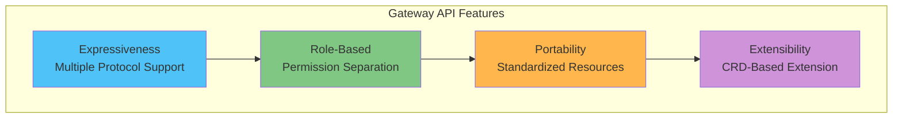
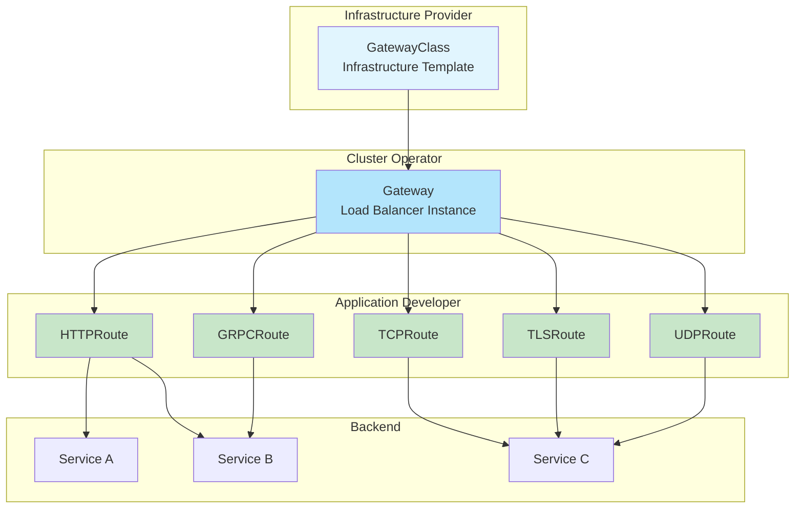

# Kubernetes Gateway API

> **Versiones compatibles**: Gateway API v1.2+
> **Última actualización**: July 3, 2026

## Descripción general

Gateway API es la API de ingress de nueva generación para Kubernetes, diseñada para superar las limitaciones de la API Ingress existente y proporcionar capacidades de enrutamiento de red más expresivas y extensibles. Desarrollada por SIG-Network, es compatible con diversas implementaciones, incluidas Istio, Cilium, Envoy Gateway y más.

### Limitaciones de la API Ingress

| Problema | Descripción |
|---------|-------------|
| **Expresividad limitada** | Compatibilidad deficiente con TCP/UDP/gRPC más allá del enrutamiento HTTP |
| **Sin separación de roles** | Es difícil separar los permisos de administradores de infraestructura y desarrolladores de aplicaciones |
| **Abuso de anotaciones** | Las características específicas de la implementación se gestionan mediante anotaciones, lo que reduce la portabilidad |
| **Extensibilidad limitada** | Es difícil añadir nuevos protocolos o características |
| **Entre namespaces** | Enrutamiento complejo entre namespaces |

### Beneficios de Gateway API



## Modelo de recursos

Gateway API utiliza un modelo de recursos por capas.



### Separación de roles

| Rol | Recursos administrados | Responsabilidad |
|------|------------------|----------------|
| **Proveedor de infraestructura** | GatewayClass | Definir la configuración básica de la infraestructura |
| **Operador del clúster** | Gateway, ReferenceGrant | Aprovisionamiento del balanceador de carga, gestión de permisos |
| **Desarrollador de aplicaciones** | HTTPRoute, GRPCRoute, etc. | Definir reglas de enrutamiento de la aplicación |

## GatewayClass

GatewayClass define el controlador y la configuración que se utilizarán al crear Gateways.

```yaml
apiVersion: gateway.networking.k8s.io/v1
kind: GatewayClass
metadata:
  name: istio
spec:
  # Controller that handles this GatewayClass
  controllerName: istio.io/gateway-controller

  # Controller-specific parameters (optional)
  parametersRef:
    group: ""
    kind: ConfigMap
    name: istio-gateway-config
    namespace: istio-system

  # Description
  description: "Istio Gateway Controller for production workloads"
```

### GatewayClass por implementación

```yaml
# Istio
apiVersion: gateway.networking.k8s.io/v1
kind: GatewayClass
metadata:
  name: istio
spec:
  controllerName: istio.io/gateway-controller
---
# Cilium
apiVersion: gateway.networking.k8s.io/v1
kind: GatewayClass
metadata:
  name: cilium
spec:
  controllerName: io.cilium/gateway-controller
---
# AWS Gateway API Controller
apiVersion: gateway.networking.k8s.io/v1
kind: GatewayClass
metadata:
  name: amazon-vpc-lattice
spec:
  controllerName: application-networking.k8s.aws/gateway-api-controller
---
# Envoy Gateway
apiVersion: gateway.networking.k8s.io/v1
kind: GatewayClass
metadata:
  name: envoy-gateway
spec:
  controllerName: gateway.envoyproxy.io/gatewayclass-controller
---
# Contour
apiVersion: gateway.networking.k8s.io/v1
kind: GatewayClass
metadata:
  name: contour
spec:
  controllerName: projectcontour.io/gateway-controller
---
# NGINX Gateway Fabric
apiVersion: gateway.networking.k8s.io/v1
kind: GatewayClass
metadata:
  name: nginx
spec:
  controllerName: gateway.nginx.org/nginx-gateway-controller
```

## Gateway

Gateway define la instancia real del balanceador de carga.

### Configuración básica de Gateway

```yaml
apiVersion: gateway.networking.k8s.io/v1
kind: Gateway
metadata:
  name: production-gateway
  namespace: gateway-system
spec:
  # GatewayClass to use
  gatewayClassName: istio

  # Listener configuration
  listeners:
    # HTTP listener
    - name: http
      protocol: HTTP
      port: 80
      # Allow Routes from all namespaces
      allowedRoutes:
        namespaces:
          from: All

    # HTTPS listener
    - name: https
      protocol: HTTPS
      port: 443
      tls:
        mode: Terminate
        certificateRefs:
          - kind: Secret
            name: tls-cert
            namespace: gateway-system
      allowedRoutes:
        namespaces:
          from: Selector
          selector:
            matchLabels:
              gateway-access: "true"

    # Host-specific listener
    - name: api
      protocol: HTTPS
      port: 443
      hostname: "api.example.com"
      tls:
        mode: Terminate
        certificateRefs:
          - kind: Secret
            name: api-tls-cert
      allowedRoutes:
        namespaces:
          from: Same

  # Address configuration (optional)
  addresses:
    - type: IPAddress
      value: "192.168.1.100"
```

### Configuración avanzada de Gateway

```yaml
apiVersion: gateway.networking.k8s.io/v1
kind: Gateway
metadata:
  name: multi-protocol-gateway
  namespace: gateway-system
  annotations:
    # Implementation-specific annotation
    networking.istio.io/service-type: LoadBalancer
spec:
  gatewayClassName: istio

  listeners:
    # For HTTP -> HTTPS redirect
    - name: http-redirect
      protocol: HTTP
      port: 80
      allowedRoutes:
        namespaces:
          from: All

    # HTTPS wildcard
    - name: https-wildcard
      protocol: HTTPS
      port: 443
      hostname: "*.example.com"
      tls:
        mode: Terminate
        certificateRefs:
          - kind: Secret
            name: wildcard-cert
      allowedRoutes:
        namespaces:
          from: All
        kinds:
          - kind: HTTPRoute

    # gRPC dedicated
    - name: grpc
      protocol: HTTPS
      port: 443
      hostname: "grpc.example.com"
      tls:
        mode: Terminate
        certificateRefs:
          - kind: Secret
            name: grpc-cert
      allowedRoutes:
        kinds:
          - kind: GRPCRoute

    # TCP passthrough
    - name: tcp-passthrough
      protocol: TLS
      port: 8443
      tls:
        mode: Passthrough
      allowedRoutes:
        kinds:
          - kind: TLSRoute

    # TCP
    - name: tcp
      protocol: TCP
      port: 9000
      allowedRoutes:
        kinds:
          - kind: TCPRoute
```

### Modos de TLS

| Modo | Descripción | Caso de uso |
|------|-------------|----------|
| **Terminate** | Terminación de TLS en Gateway | HTTPS estándar |
| **Passthrough** | Pasa TLS al backend | Cifrado de extremo a extremo |

```yaml
# TLS Terminate example
listeners:
  - name: https
    protocol: HTTPS
    port: 443
    tls:
      mode: Terminate
      certificateRefs:
        - kind: Secret
          name: server-cert
---
# TLS Passthrough example
listeners:
  - name: tls-passthrough
    protocol: TLS
    port: 443
    tls:
      mode: Passthrough
```

## HTTPRoute

HTTPRoute define reglas de enrutamiento para tráfico HTTP/HTTPS.

### HTTPRoute básico

```yaml
apiVersion: gateway.networking.k8s.io/v1
kind: HTTPRoute
metadata:
  name: basic-route
  namespace: production
spec:
  # Gateway to attach to
  parentRefs:
    - name: production-gateway
      namespace: gateway-system
      sectionName: https  # Target specific listener

  # Host matching
  hostnames:
    - "api.example.com"
    - "www.example.com"

  # Routing rules
  rules:
    - matches:
        - path:
            type: PathPrefix
            value: /api/v1
      backendRefs:
        - name: api-v1-service
          port: 80

    - matches:
        - path:
            type: PathPrefix
            value: /api/v2
      backendRefs:
        - name: api-v2-service
          port: 80

    # Default path
    - backendRefs:
        - name: default-service
          port: 80
```

### Reglas de coincidencia avanzadas

```yaml
apiVersion: gateway.networking.k8s.io/v1
kind: HTTPRoute
metadata:
  name: advanced-matching
  namespace: production
spec:
  parentRefs:
    - name: production-gateway
      namespace: gateway-system

  hostnames:
    - "api.example.com"

  rules:
    # Exact path matching
    - matches:
        - path:
            type: Exact
            value: /health
      backendRefs:
        - name: health-service
          port: 80

    # Regex path matching (implementation dependent)
    - matches:
        - path:
            type: RegularExpression
            value: "/users/[0-9]+"
      backendRefs:
        - name: user-service
          port: 80

    # Header-based routing
    - matches:
        - headers:
            - name: X-Version
              value: "v2"
      backendRefs:
        - name: api-v2-service
          port: 80

    # Query parameter based
    - matches:
        - queryParams:
            - name: debug
              value: "true"
      backendRefs:
        - name: debug-service
          port: 80

    # HTTP method based
    - matches:
        - method: POST
          path:
            type: PathPrefix
            value: /api/data
      backendRefs:
        - name: write-service
          port: 80

    - matches:
        - method: GET
          path:
            type: PathPrefix
            value: /api/data
      backendRefs:
        - name: read-service
          port: 80

    # Combined conditions (AND)
    - matches:
        - path:
            type: PathPrefix
            value: /admin
          headers:
            - name: X-Admin-Token
              type: Exact
              value: "secret-token"
      backendRefs:
        - name: admin-service
          port: 80

    # Multiple conditions (OR)
    - matches:
        - path:
            type: PathPrefix
            value: /api
        - path:
            type: PathPrefix
            value: /v1
      backendRefs:
        - name: api-service
          port: 80
```

### Filtros

Los filtros permiten modificar solicitudes/respuestas.

```yaml
apiVersion: gateway.networking.k8s.io/v1
kind: HTTPRoute
metadata:
  name: filtered-route
  namespace: production
spec:
  parentRefs:
    - name: production-gateway
      namespace: gateway-system

  rules:
    # Request header modification
    - matches:
        - path:
            type: PathPrefix
            value: /api
      filters:
        - type: RequestHeaderModifier
          requestHeaderModifier:
            add:
              - name: X-Request-ID
                value: "generated-id"
            set:
              - name: X-Forwarded-Proto
                value: "https"
            remove:
              - X-Internal-Header
      backendRefs:
        - name: api-service
          port: 80

    # Response header modification
    - matches:
        - path:
            type: PathPrefix
            value: /public
      filters:
        - type: ResponseHeaderModifier
          responseHeaderModifier:
            add:
              - name: Cache-Control
                value: "public, max-age=3600"
            set:
              - name: X-Content-Type-Options
                value: "nosniff"
      backendRefs:
        - name: public-service
          port: 80

    # URL rewrite
    - matches:
        - path:
            type: PathPrefix
            value: /old-api
      filters:
        - type: URLRewrite
          urlRewrite:
            path:
              type: ReplacePrefixMatch
              replacePrefixMatch: /new-api
            hostname: "new-api.example.com"
      backendRefs:
        - name: new-api-service
          port: 80

    # Redirect
    - matches:
        - path:
            type: PathPrefix
            value: /legacy
      filters:
        - type: RequestRedirect
          requestRedirect:
            scheme: https
            hostname: "new.example.com"
            port: 443
            statusCode: 301
            path:
              type: ReplacePrefixMatch
              replacePrefixMatch: /modern

    # Mirroring
    - matches:
        - path:
            type: PathPrefix
            value: /api
      filters:
        - type: RequestMirror
          requestMirror:
            backendRef:
              name: shadow-service
              port: 80
      backendRefs:
        - name: main-service
          port: 80
```

### División de tráfico (pesos)

```yaml
apiVersion: gateway.networking.k8s.io/v1
kind: HTTPRoute
metadata:
  name: canary-route
  namespace: production
spec:
  parentRefs:
    - name: production-gateway
      namespace: gateway-system

  hostnames:
    - "app.example.com"

  rules:
    - matches:
        - path:
            type: PathPrefix
            value: /
      backendRefs:
        # 90% traffic to stable version
        - name: app-stable
          port: 80
          weight: 90

        # 10% traffic to canary version
        - name: app-canary
          port: 80
          weight: 10
```

### Tiempos de espera y reintentos

```yaml
apiVersion: gateway.networking.k8s.io/v1
kind: HTTPRoute
metadata:
  name: resilient-route
  namespace: production
spec:
  parentRefs:
    - name: production-gateway
      namespace: gateway-system

  rules:
    - matches:
        - path:
            type: PathPrefix
            value: /api
      # Timeout configuration (implementation dependent)
      timeouts:
        request: "30s"
        backendRequest: "25s"
      backendRefs:
        - name: api-service
          port: 80
```

## GRPCRoute

Define reglas de enrutamiento para tráfico gRPC.

```yaml
apiVersion: gateway.networking.k8s.io/v1
kind: GRPCRoute
metadata:
  name: grpc-route
  namespace: production
spec:
  parentRefs:
    - name: production-gateway
      namespace: gateway-system
      sectionName: grpc

  hostnames:
    - "grpc.example.com"

  rules:
    # Service-based routing
    - matches:
        - method:
            service: "myapp.UserService"
      backendRefs:
        - name: user-grpc-service
          port: 50051

    - matches:
        - method:
            service: "myapp.OrderService"
            method: "CreateOrder"
      backendRefs:
        - name: order-grpc-service
          port: 50052

    # Header-based routing
    - matches:
        - headers:
            - name: x-environment
              value: "staging"
      backendRefs:
        - name: staging-grpc-service
          port: 50051

    # Default routing
    - backendRefs:
        - name: default-grpc-service
          port: 50051
```

## TCPRoute

Define el enrutamiento de tráfico TCP.

```yaml
apiVersion: gateway.networking.k8s.io/v1alpha2
kind: TCPRoute
metadata:
  name: database-route
  namespace: production
spec:
  parentRefs:
    - name: production-gateway
      namespace: gateway-system
      sectionName: tcp

  rules:
    - backendRefs:
        - name: database-service
          port: 5432
---
# Multi-backend TCP routing
apiVersion: gateway.networking.k8s.io/v1alpha2
kind: TCPRoute
metadata:
  name: tcp-loadbalance
  namespace: production
spec:
  parentRefs:
    - name: production-gateway
      namespace: gateway-system
      sectionName: tcp

  rules:
    - backendRefs:
        - name: tcp-backend-1
          port: 9000
          weight: 50
        - name: tcp-backend-2
          port: 9000
          weight: 50
```

## TLSRoute

Define el enrutamiento de tráfico TLS passthrough.

```yaml
apiVersion: gateway.networking.k8s.io/v1alpha2
kind: TLSRoute
metadata:
  name: tls-passthrough-route
  namespace: production
spec:
  parentRefs:
    - name: production-gateway
      namespace: gateway-system
      sectionName: tcp-passthrough

  hostnames:
    - "secure.example.com"

  rules:
    - backendRefs:
        - name: secure-backend
          port: 8443
```

## UDPRoute

Define el enrutamiento de tráfico UDP.

```yaml
apiVersion: gateway.networking.k8s.io/v1alpha2
kind: UDPRoute
metadata:
  name: dns-route
  namespace: production
spec:
  parentRefs:
    - name: production-gateway
      namespace: gateway-system
      sectionName: udp

  rules:
    - backendRefs:
        - name: dns-service
          port: 53
```

## ReferenceGrant

ReferenceGrant permite referencias entre namespaces.

```yaml
# Allow Routes from other namespaces to reference Services in this namespace
apiVersion: gateway.networking.k8s.io/v1beta1
kind: ReferenceGrant
metadata:
  name: allow-routes-to-backend
  namespace: backend-services
spec:
  from:
    # HTTPRoute from production namespace
    - group: gateway.networking.k8s.io
      kind: HTTPRoute
      namespace: production
    # HTTPRoute from staging namespace too
    - group: gateway.networking.k8s.io
      kind: HTTPRoute
      namespace: staging
  to:
    # Can reference Services in this namespace
    - group: ""
      kind: Service
---
# Allow Gateway to reference Secrets (TLS certificates) from another namespace
apiVersion: gateway.networking.k8s.io/v1beta1
kind: ReferenceGrant
metadata:
  name: allow-gateway-to-secrets
  namespace: cert-management
spec:
  from:
    - group: gateway.networking.k8s.io
      kind: Gateway
      namespace: gateway-system
  to:
    - group: ""
      kind: Secret
```

## Comparación de implementaciones

### Implementaciones principales

| Implementación | Controlador | Características |
|----------------|------------|----------|
| **Istio** | istio.io/gateway-controller | Integración con Service Mesh, gestión avanzada del tráfico |
| **Cilium** | io.cilium/gateway-controller | Basado en eBPF, alto rendimiento |
| **Envoy Gateway** | gateway.envoyproxy.io/gatewayclass-controller | Basado en Envoy, conforme a estándares |
| **AWS Gateway API Controller** | application-networking.k8s.aws/gateway-api-controller | Integración con VPC Lattice |
| **Contour** | projectcontour.io/gateway-controller | Basado en Envoy, configuración sencilla |
| **NGINX Gateway Fabric** | gateway.nginx.org/nginx-gateway-controller | Basado en NGINX |
| **Traefik** | traefik.io/gateway-controller | Configuración dinámica |

### Estado de compatibilidad de características

| Característica | Istio | Cilium | Envoy GW | AWS | Contour |
|---------|-------|--------|----------|-----|---------|
| HTTPRoute | Sí | Sí | Sí | Sí | Sí |
| GRPCRoute | Sí | Sí | Sí | Parcial | Sí |
| TCPRoute | Sí | Sí | Sí | No | Sí |
| TLSRoute | Sí | Sí | Sí | No | Sí |
| UDPRoute | Sí | Sí | Parcial | No | No |
| ReferenceGrant | Sí | Sí | Sí | Sí | Sí |
| División de tráfico | Sí | Sí | Sí | Sí | Sí |
| Modificación de encabezados | Sí | Sí | Sí | Parcial | Sí |
| Reescritura de URL | Sí | Sí | Sí | Parcial | Sí |
| Duplicación | Sí | Parcial | Sí | No | Sí |

## Compatibilidad con Gateway API de AWS Load Balancer Controller (v3.0 GA)

A partir de AWS Load Balancer Controller v3.0.0 (enero de 2026), la compatibilidad con Gateway API alcanzó GA, lo que permite la gestión declarativa de ALB/NLB mediante el modelo de separación de roles GatewayClass/Gateway/HTTPRoute.

- **Contexto**: Con NGINX Ingress Controller alcanzando el fin de soporte en marzo de 2026, AWS posiciona LBC v3.0 + Gateway API como la alternativa nativa.
- **Compatibilidad con versiones anteriores**: Los recursos Ingress/Service existentes continúan siendo totalmente compatibles; no se requiere una transición inmediata y la migración puede realizarse gradualmente.
- **Beneficios**: Enrutamiento basado en encabezados/consultas, distribución de tráfico ponderada (Blue/Green, Canary) y un diseño multiprotocolo que cubre TCP/UDP/gRPC.
- **Precaución al actualizar**: Si realiza la instalación mediante Helm con `enableCertManager=true`, establezca `keepTLSSecret=false` antes de actualizar (esto se gestiona automáticamente desde v3.0.0 en adelante).

### Herramientas de migración de v3.4.0 (junio de 2026)

Se añadieron herramientas para migrar Ingress existentes basados en ALB a Gateway API sin tiempo de inactividad.

- **Herramienta de migración de Ingress a Gateway**: Crea nuevos recursos de Gateway API junto al ALB existente, lo que permite una transición sin tiempo de inactividad.
- **CLI lbc-migrate**: Convierte automáticamente las anotaciones, reglas de enrutamiento e IngressGroups existentes en recursos de Gateway API; la opción `--from-cluster` analiza el clúster directamente.
- **Consola de migración**: Una interfaz web para validar la configuración convertida antes de migrar.

> **Precaución**: El comportamiento cambió para las combinaciones de Gateway API + NLB. Si varias Routes TCP/UDP/TLS se conectan a un único Listener, solo la Route más antigua recibe tráfico. Revise la configuración de Route de L4 antes de actualizar.

(Fuente común: [AWS Load Balancer Controller Releases](https://github.com/kubernetes-sigs/aws-load-balancer-controller/releases))

## Migración de Ingress a Gateway API

### Guía de migración paso a paso

#### Paso 1: Analizar el Ingress existente

```yaml
# Existing Ingress
apiVersion: networking.k8s.io/v1
kind: Ingress
metadata:
  name: my-ingress
  annotations:
    kubernetes.io/ingress.class: "nginx"
    nginx.ingress.kubernetes.io/rewrite-target: /
    nginx.ingress.kubernetes.io/ssl-redirect: "true"
spec:
  tls:
    - hosts:
        - api.example.com
      secretName: api-tls
  rules:
    - host: api.example.com
      http:
        paths:
          - path: /api/v1
            pathType: Prefix
            backend:
              service:
                name: api-v1
                port:
                  number: 80
          - path: /api/v2
            pathType: Prefix
            backend:
              service:
                name: api-v2
                port:
                  number: 80
```

#### Paso 2: Crear Gateway y GatewayClass

```yaml
# GatewayClass (Infrastructure Admin)
apiVersion: gateway.networking.k8s.io/v1
kind: GatewayClass
metadata:
  name: production
spec:
  controllerName: istio.io/gateway-controller
---
# Gateway (Cluster Operator)
apiVersion: gateway.networking.k8s.io/v1
kind: Gateway
metadata:
  name: production-gateway
  namespace: gateway-system
spec:
  gatewayClassName: production
  listeners:
    - name: http
      protocol: HTTP
      port: 80
      allowedRoutes:
        namespaces:
          from: All
    - name: https
      protocol: HTTPS
      port: 443
      tls:
        mode: Terminate
        certificateRefs:
          - kind: Secret
            name: api-tls
            namespace: gateway-system
      allowedRoutes:
        namespaces:
          from: All
```

#### Paso 3: Crear HTTPRoute

```yaml
# HTTPRoute (Application Developer)
apiVersion: gateway.networking.k8s.io/v1
kind: HTTPRoute
metadata:
  name: api-route
  namespace: default
spec:
  parentRefs:
    - name: production-gateway
      namespace: gateway-system

  hostnames:
    - "api.example.com"

  rules:
    # HTTP -> HTTPS redirect
    - matches:
        - path:
            type: PathPrefix
            value: /
      filters:
        - type: RequestRedirect
          requestRedirect:
            scheme: https
            statusCode: 301

---
# HTTPRoute for HTTPS
apiVersion: gateway.networking.k8s.io/v1
kind: HTTPRoute
metadata:
  name: api-route-https
  namespace: default
spec:
  parentRefs:
    - name: production-gateway
      namespace: gateway-system
      sectionName: https

  hostnames:
    - "api.example.com"

  rules:
    - matches:
        - path:
            type: PathPrefix
            value: /api/v1
      filters:
        - type: URLRewrite
          urlRewrite:
            path:
              type: ReplacePrefixMatch
              replacePrefixMatch: /
      backendRefs:
        - name: api-v1
          port: 80

    - matches:
        - path:
            type: PathPrefix
            value: /api/v2
      filters:
        - type: URLRewrite
          urlRewrite:
            path:
              type: ReplacePrefixMatch
              replacePrefixMatch: /
      backendRefs:
        - name: api-v2
          port: 80
```

#### Paso 4: Transición gradual

```yaml
# Gradual transition via traffic splitting
apiVersion: gateway.networking.k8s.io/v1
kind: HTTPRoute
metadata:
  name: gradual-migration
spec:
  parentRefs:
    - name: production-gateway
      namespace: gateway-system

  rules:
    - backendRefs:
        # Existing service (gradually decrease)
        - name: legacy-service
          port: 80
          weight: 90
        # New service (gradually increase)
        - name: new-service
          port: 80
          weight: 10
```

### Lista de comprobación de migración

- [ ] Analizar las anotaciones de Ingress existentes
- [ ] Seleccionar la implementación y crear GatewayClass
- [ ] Crear el recurso Gateway y configurar los listeners
- [ ] Convertir las reglas de enrutamiento a HTTPRoute
- [ ] Configurar el acceso entre namespaces con ReferenceGrant
- [ ] Migrar certificados TLS
- [ ] Realizar una transición gradual mediante división de tráfico
- [ ] Configurar monitorización y registro
- [ ] Eliminar los recursos Ingress existentes

## Patrones de EKS

### AWS Gateway API Controller (VPC Lattice)

```yaml
# GatewayClass
apiVersion: gateway.networking.k8s.io/v1
kind: GatewayClass
metadata:
  name: amazon-vpc-lattice
spec:
  controllerName: application-networking.k8s.aws/gateway-api-controller
---
# Gateway (maps to VPC Lattice Service Network)
apiVersion: gateway.networking.k8s.io/v1
kind: Gateway
metadata:
  name: lattice-gateway
  namespace: default
spec:
  gatewayClassName: amazon-vpc-lattice
  listeners:
    - name: http
      protocol: HTTP
      port: 80
      allowedRoutes:
        namespaces:
          from: All
---
# HTTPRoute (maps to VPC Lattice Service)
apiVersion: gateway.networking.k8s.io/v1
kind: HTTPRoute
metadata:
  name: lattice-route
spec:
  parentRefs:
    - name: lattice-gateway
  rules:
    - backendRefs:
        - name: my-service
          port: 80
```

### Uso con ALB Controller

```yaml
# Istio Gateway API + ALB Ingress combination
apiVersion: gateway.networking.k8s.io/v1
kind: Gateway
metadata:
  name: internal-gateway
  namespace: istio-system
  annotations:
    # Internal Gateway
    networking.istio.io/service-type: ClusterIP
spec:
  gatewayClassName: istio
  listeners:
    - name: http
      protocol: HTTP
      port: 80
      allowedRoutes:
        namespaces:
          from: All
---
# ALB receives external traffic and forwards to Gateway
apiVersion: networking.k8s.io/v1
kind: Ingress
metadata:
  name: alb-to-gateway
  annotations:
    alb.ingress.kubernetes.io/scheme: internet-facing
    alb.ingress.kubernetes.io/target-type: ip
spec:
  ingressClassName: alb
  rules:
    - host: "*.example.com"
      http:
        paths:
          - path: /
            pathType: Prefix
            backend:
              service:
                name: internal-gateway
                port:
                  number: 80
```

## Canales y madurez de la API

Gateway API proporciona características con diversos niveles de madurez.

### Clasificación de canales

| Canal | Madurez | Recursos |
|---------|----------|-----------|
| **Estándar** | GA | GatewayClass, Gateway, HTTPRoute, ReferenceGrant |
| **Experimental** | Beta/Alpha | GRPCRoute, TCPRoute, TLSRoute, UDPRoute |

### Versiones y compatibilidad

```yaml
# Standard channel (stable)
apiVersion: gateway.networking.k8s.io/v1
kind: HTTPRoute

# Experimental channel
apiVersion: gateway.networking.k8s.io/v1alpha2
kind: TCPRoute
```

## Comparación con la API Ingress

| Característica | Ingress | Gateway API |
|---------|---------|-------------|
| **Separación de roles** | No | Sí (3 capas) |
| **Enrutamiento HTTP** | Sí | Sí |
| **TCP/UDP** | No | Sí |
| **gRPC** | Mediante anotación | Nativo |
| **TLS Passthrough** | Depende de la implementación | Sí |
| **División de tráfico** | Mediante anotación | Nativo |
| **Enrutamiento basado en encabezados** | Mediante anotación | Nativo |
| **Entre namespaces** | Limitado | ReferenceGrant |
| **Portabilidad** | Depende de anotaciones | Estandarizado |
| **Extensibilidad** | No | CRD |

## Prácticas recomendadas

### 1. Seguir la separación de roles

```yaml
# Infrastructure team: Manage GatewayClass
# Platform team: Manage Gateway
# App team: Manage HTTPRoute
```

### 2. ReferenceGrant con mínimo privilegio

```yaml
# Explicitly allow only required namespaces
apiVersion: gateway.networking.k8s.io/v1beta1
kind: ReferenceGrant
metadata:
  name: minimal-access
  namespace: backend
spec:
  from:
    - group: gateway.networking.k8s.io
      kind: HTTPRoute
      namespace: frontend  # Specific namespace only
  to:
    - group: ""
      kind: Service
      name: specific-service  # Specific service only
```

### 3. Separación de Gateway

```yaml
# Separate Gateway by environment
# production-gateway, staging-gateway

# Separate Gateway by protocol
# http-gateway, grpc-gateway
```

### 4. Configuración de monitorización

```yaml
# Prometheus metrics collection (varies by implementation)
# - Request count, latency, error rate
# - Backend status
# - TLS certificate expiry
```

---

## Referencias

- [Gateway API Official Documentation](https://gateway-api.sigs.k8s.io/)
- [Gateway API GitHub](https://github.com/kubernetes-sigs/gateway-api)
- [Istio Gateway API Support](https://istio.io/latest/docs/tasks/traffic-management/ingress/gateway-api/)
- [Cilium Gateway API](https://docs.cilium.io/en/stable/network/servicemesh/gateway-api/)
- [AWS Gateway API Controller](https://www.gateway-api-controller.eks.aws.dev/)
- [Envoy Gateway](https://gateway.envoyproxy.io/)
