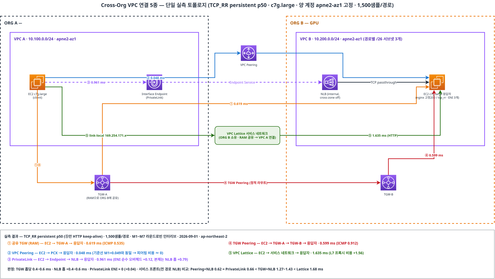

# Conectividad VPC entre Organizations

> **Última actualización**: September 1, 2026

Este documento cubre cinco formas de **conectar VPCs entre dos AWS Organizations diferentes** — por ejemplo, cuando las cargas de trabajo de GPU se contratan bajo un pagador independiente (Organization independiente) del pagador MSP existente. Cada cifra de este documento procede de una verificación en vivo de construcción y medición entre dos Organizations reales (ap-northeast-2, ambas cuentas fijadas a ZoneId `apne2-az1`).

## Tabla de contenidos

1. [Por qué la conectividad entre Organizations](#why-cross-org-connectivity)
2. [Comparación de las cinco opciones](#comparing-the-five-options)
3. [Resultados de la verificación de campo](#field-verification-results)
4. [Mediciones de latencia (M1–M7)](#latency-measurements-m1m7)
5. [Hallazgos operativos del campo](#operational-findings-from-the-field)
6. [Arquitectura recomendada por escenario](#recommended-architecture-by-scenario)
7. [Conclusión](#conclusion)

## Por qué la conectividad entre Organizations

Las instancias de GPU (P5/P6, etc.) conllevan costes suficientemente altos como para que las organizaciones las contraten cada vez más bajo un **pagador independiente (AWS Organization independiente)** en lugar del pagador MSP existente. Las motivaciones habituales son:

- **Separación de facturación**: descuentos por volumen específicos de GPU / optimización de EDP
- **Aislamiento de cuotas de servicio**: gestionar de forma independiente los límites de vCPU de GPU y los Capacity Blocks
- **Contención del radio de impacto**: mantener las configuraciones erróneas de SCP y los incidentes de seguridad alejados de la producción existente
- **Cumplimiento normativo**: separar los límites de datos y las pistas de auditoría para cargas de trabajo de AI/ML

El desafío clave pasa a ser conectar el entorno existente (ORG A) con el entorno de GPU (ORG B). Desde la perspectiva de EKS, esto cubre los clústeres de entrenamiento (ORG B) que acceden a los pipelines de datos existentes (ORG A), o la exposición de APIs de inferencia a los servicios existentes.

## Comparación de las cinco opciones

| Aspecto | ① Compartición de TGW con RAM | ② VPC Peering | ③ PrivateLink | ④ TGW Peering | ⑤ VPC Lattice |
|---|---|---|---|---|---|
| Mecanismo | Compartir TGW con una cuenta externa mediante RAM | Conexión VPC 1:1 | Endpoint basado en NLB | Peering entre TGWs por ORG | Red de servicios L7 |
| CIDRs superpuestos | ❌ | ❌ | ✅ (basado en ENI) | ❌ | ✅ (basado en link-local) |
| Dirección | L3 bidireccional | L3 bidireccional | Unidireccional (Consumer→Provider) | L3 bidireccional | Unidireccional (Consumer→Provider) |
| Enrutamiento transitivo | ✅ mediante TGW RT | ❌ | ❌ | ✅ | ❌ (por servicio) |
| Control de enrutamiento | **Cuenta propietaria de TGW (ORG A)** | Ambos lados independientes | Provider controla los principals | **Cada ORG independiente** | Propietario de la red de servicios |
| Tiempo de aprovisionamiento (medido) | TGW ~3 min + pasos de aceptación | **Menos de 1 min** | Endpoint ~3 min | **~7 min (el más largo)** | ~5 min |

## Resultados de la verificación de campo

Las cinco opciones se construyeron entre cuentas de dos Organizations diferentes y se probaron tanto mediante el plano de control (establecimiento de conexión) como el plano de datos (tráfico real). **Las cinco son implementables.** Nada está bloqueado por el límite de la Organization en sí: el límite solo se manifiesta como procedimientos explícitos: **indicar el ID de la cuenta más la aceptación en el lado receptor**.

## Mediciones de latencia (M1–M7)

**Diseño de la medición** — la señal está por debajo del milisegundo, por lo que el error de medición debe ser menor que la señal:

- Instancias **c7g.large** (sin tipos burstable); el respondedor es **una instancia EC2 (nginx fijo en 200)** — los balanceadores de carga aparecen solo donde son estructuralmente necesarios (③⑤, además de M7 para aislar el salto NLB)
- El respondedor tiene 3 ENIs (subredes por ruta con tablas de rutas de retorno separadas), por lo que **M1–M7 se ejecutan intercalados en round-robin ×5 rondas** sin intercambiar rutas
- Métrica principal: **ping-pong TCP_RR persistente, 1,500 muestras/ruta** (elimina los costes de inicio de proceso y handshake); secundaria: ICMP 100/ruta, HTTP keep-alive 275/ruta

| ID | Ruta | ICMP p50 | TCP_RR p50 | RR p99 | RR sd | HTTP KA p50 | TTL |
|---|---|---|---|---|---|---|---|
| M1 | Misma VPC → EC2 (referencia) | 0.121 | **0.049** | 0.062 | 0.007 | 0.087 | 127 |
| M2 | ② VPC Peering → EC2 | 0.125 | **0.048** | 0.057 | 0.011 | 0.080 | 127 |
| M3 | ① TGW compartido (RAM) → EC2 | 0.535 | **0.619** | 0.695 | 0.141 | 0.686 | 126 |
| M4 | ④ TGW Peering (2 saltos) → EC2 | 0.912 | **0.599** | 0.855 | 0.133 | 0.488 | 125 |
| M5 | ③ PrivateLink → NLB → EC2 | no medido | **0.961** | 1.084 | 0.035 | 0.711 | — |
| M6 | ⑤ VPC Lattice → destino EC2 | no medido | no medido (solo L7) | — | — | **1.635** | — |
| M7 | ② Peering → NLB → EC2 (aislamiento del salto NLB) | no medido | **0.841** | 0.909 | 0.119 | 0.883 | — |

**Métricas derivadas (p50, ms):**

| Métrica | Definición | TCP_RR | ICMP |
|---|---|---|---|
| Coste de 1 salto de TGW | M3 − M2 | **+0.571** | +0.410 |
| Coste de 2 saltos de TGW | M4 − M2 | **+0.551** | +0.787 |
| Coste del salto NLB | M7 − M2 | **+0.793** | — |
| Sobrecarga pura de ENI de PrivateLink | M5 − M7 | **+0.120** | — |
| Coste del proxy de Lattice (HTTP) | M6 − M2 | +1.555 | — |

**Veredicto:**

> **Dentro de la misma AZ, un salto de TGW añade 0.4–0.6 ms en p50** — coherente con la observación habitual de «menos de 1 ms por salto».
> **El coste de latencia de VPC Peering es cero dentro de los límites de medición** (M2 0.048 ≈ referencia M1 0.049).
> **El propio ENI de PrivateLink añade solo +0.12 ms** — la mayor parte de la latencia total de PrivateLink (0.96 ms) corresponde al **salto NLB estructuralmente necesario (+0.79 ms)**. El proxy L7 de Lattice cuesta +1.6 ms.

**Medición adicional — comparación justa con servicios expuestos en el front-end (NLB en cada ruta):** En despliegues reales, las rutas de Peering y TGW también sitúan el servicio detrás de un NLB, por lo que se construyó y midió adicionalmente una configuración con NLB en el front-end para cada ruta L3 (NLB por subred, destinos IP, misma metodología).

| Configuración | TCP_RR p50 | HTTP KA p50 |
|---|---|---|
| ② Peering → NLB → EC2 | **0.622** | 0.648 |
| ③ PrivateLink → NLB → EC2 | **0.658** | 0.845 |
| ① TGW compartido → NLB → EC2 | **1.273** | 1.257 |
| ④ TGW Peering → NLB → EC2 | **1.425** | 1.279 |
| ⑤ Lattice (actúa como el propio LB — no se necesita NLB) | — | **1.680** |

> **Veredicto para el marco de exposición de servicios:** el coste puro del ENI de PrivateLink es +0.036 ms (N5−N2) — prácticamente cero. En una configuración real de exposición de servicios, donde un NLB delante del respondedor es la referencia habitual, **③ PrivateLink iguala a Peering+NLB y es aproximadamente 2× más rápido que las rutas TGW + NLB.** «TGW directo supera a PrivateLink» solo se cumple en el marco directo sin LB. Lattice actúa como el propio balanceador de carga, por lo que no se necesita un NLB separado — su diferencia frente a TGW+NLB en el mismo marco se reduce a +0.3–0.4 ms.

**Lección metodológica** (por qué se descartó y repitió una ronda de medición anterior): combinar una instancia burstable (familia t), una cadena proxy NLB→ALB de dos etapas y una conexión nueva por solicitud (curl) oculta una señal sub-ms bajo ruido (p95 independiente de la ruta de unos 7 ms). Los nuevos flujos TCP sí pagan un coste real de configuración de flujo de +0.6–1.6 ms en el primer RTT a través de TGW/NLB, por lo que **evalúe la latencia por separado para cargas de trabajo de conexiones keep-alive/de larga duración (gRPC, NCCL, pools de DB) frente a cargas de trabajo de conexiones de un solo uso**.

## Hallazgos operativos del campo

1. **La compartición de RAM entre Organizations requiere un paso explícito de aceptación de la invitación** — la compartición se rechaza sin `--allow-external-principals`, y el recurso es invisible hasta que el receptor ejecuta `accept-resource-share-invitation` (igual para TGW y Lattice). Los pipelines de automatización necesitan este paso de aceptación.
2. **El attachment de una ORG externa a un TGW compartido se detiene en `pendingAcceptance`** — el propietario del TGW debe aceptarlo. El «control centralizado del lado del propietario» se aplica en el nivel de la API.
3. **TGW Peering muestra IDs de attachment diferentes en cada lado** — llamar a la API de aceptación con el ID del lado solicitante devuelve `NotFound`. La cuenta aceptante debe listar y encontrar su propio ID, y la propagación tarda unos 2 minutos.
4. **TGW Peering no admite BGP** — se deben añadir manualmente rutas estáticas a ambas tablas de rutas de TGW.
5. **El plano de datos de Lattice llega desde link-local (169.254.171.0/24)** — si el SG de destino solo permite el CIDR de la VPC, todas las comprobaciones de estado pasan a UNHEALTHY. Añada la lista de prefijos administrada `com.amazonaws.<region>.vpc-lattice` al SG.
6. **Las rutas estáticas de TGW tienen prioridad sobre las rutas propagadas** — vigile la selección involuntaria de rutas cuando ambas coexistan.
7. **La automatización de cuentas interfiere con el desmontaje** — el SG administrado de GuardDuty Runtime Monitoring bloquea la eliminación de VPC (DependencyViolation), y las políticas de IAM adjuntas automáticamente bloquean la eliminación de roles; un grupo de destino de Lattice residual también bloquea la eliminación de VPC.

## Arquitectura recomendada por escenario

| Escenario | Primera opción | Justificación (medida) |
|---|---|---|
| Separación completa de ORG de GPU, tráfico masivo bidireccional (datos de entrenamiento) | **④ TGW Peering** | Enrutamiento independiente por ORG + la penalización de 0.4–0.6 ms/salto es insignificante |
| Exponer solo una API de inferencia (unidireccional) | **③ PrivateLink** | Exposición mínima, CIDRs superpuestos permitidos, iguala a Peering+NLB en la comparación con servicios en front-end (~2× más rápido que las rutas TGW + NLB) |
| Superposición de CIDR inevitable (M&A, migración de MSP) | **③ PrivateLink / ⑤ Lattice** | Basado en ENI / link-local — independiente del CIDR |
| Añadir solo una cuenta de GPU a un TGW existente | **① Compartición de TGW con RAM** | Reutiliza el hub existente; la ORG externa no puede cambiar el enrutamiento |
| PoC pequeño (1–2 VPCs) | **② VPC Peering** | Menos de 1 minuto para configurar, coste de latencia ≈ 0, sin infraestructura adicional |
| Exposición de servicios que necesita autenticación/gobernanza L7 | **⑤ VPC Lattice** | IAM Auth y descubrimiento de servicios integrados (aceptando un coste de proxy de +1.6 ms) |

Para la mayoría de los escenarios de separación de GPU, el híbrido de **④ TGW Peering (infraestructura bidireccional) + ③ PrivateLink (exposición de API de inferencia)** es óptimo, y las mediciones respaldan esa recomendación.

## Conclusión

- Las cinco opciones se pueden configurar entre Organizations diferentes únicamente mediante APIs; el límite de la Organization aparece solo como «indicar el ID de la cuenta + aceptación en el lado receptor».
- En la misma AZ: TGW 0.4–0.6 ms/salto, VPC Peering ≈ 0, salto NLB +0.79 ms, ENI de PrivateLink +0.12 ms, proxy de Lattice +1.6 ms — el coste de latencia escala fielmente con los saltos y las capas de proxy.
- Para EKS: enrute la transferencia masiva de datos de entrenamiento (conexiones de larga duración) mediante TGW y exponga las APIs de inferencia mediante PrivateLink.

**Limitaciones (no medidas):** rutas a través de inspección de Network Firewall, Cross-Region, entornos con CIDRs superpuestos (solo confirmados funcionalmente) y el eje de rendimiento/concurrencia.

---

## Referencias

- [Infraestructura de red Multi-VPC escalable (AWS Whitepaper)](https://docs.aws.amazon.com/whitepapers/latest/building-scalable-secure-multi-vpc-network-infrastructure/welcome.html)
- [Compartición de TGW entre Organizations con RAM (AWS Prescriptive Guidance)](https://docs.aws.amazon.com/prescriptive-guidance/latest/integrate-third-party-services/architecture-3-1.html)
- [Elección entre una o varias Organizations (AWS Architecture Blog)](https://aws.amazon.com/blogs/architecture/choosing-between-single-or-multiple-organizations-in-aws-organizations/)
- [VPC Lattice (esta serie)](02-vpc-lattice.md)
