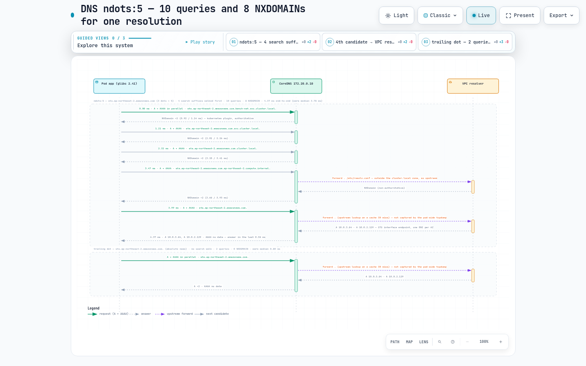

# Benchmark de red de Pod — mismo nodo, misma AZ, entre AZ y DNS ndots

> **Versiones compatibles**: Kubernetes 1.36 (Amazon EKS), Amazon VPC CNI v1.21.1, modo iptables de kube-proxy
> **Última actualización**: September 2, 2026

¿Qué cambia realmente cuando dos Pods en EKS están en el mismo nodo, en nodos diferentes de la misma AZ o en AZ diferentes? Dos conceptos erróneos acompañan esa pregunta. El primero es que cruzar una AZ «hace todo más lento y reduce el ancho de banda»; en esta ejecución, el límite de la AZ cambió la **latencia y la factura**, pero no el ancho de banda. El segundo es DNS: `ndots:5` y la lista de búsqueda de cuatro entradas que recibe cada Pod de EKS convierten silenciosamente una búsqueda externa —para cualquier nombre con menos de cinco puntos— en 10 consultas DNS en lugar de 2. Esta página recopila los conteos de RTT, latencia HTTP/gRPC, rendimiento de iperf3, costo de transferencia de datos dentro de la región y consultas DNS medidos en `fsi-demo-cluster` (Seúl) el **September 2, 2026** con el entorno descrito en «Cómo reproducirlo». Cada número es de IP de Pod a IP de Pod (sin ClusterIP); la razón está en «Advertencias».


[🔍 Ver diagrama interactivo](https://www.atomai.click/kubernetes-docs/archmaps/en-networking-06-pod-network-benchmark-0.html)

## TL;DR — Lo que medimos

1. **La escalera de RTT**: mismo nodo **0.040 ms** → misma AZ **0.339 ms** → entre AZ **0.544 ms** (ping, promedio de 200 sondas). Un salto de AZ cuesta +0.21 ms, o +0.50 ms respecto al mismo nodo.
2. **HTTP p50 / p99** (fortio, 100 qps, 4 conexiones, keepalive, 60 s): 0.259 / 0.350 ms → 0.461 / 0.667 ms → 0.704 / 0.812 ms — la misma escalera vista desde la aplicación.
3. **Ancho de banda**: un flujo TCP alcanza un máximo de **4.96 Gbps**, tanto si permanece dentro de la AZ como si la cruza (el límite de 5 Gbps por flujo de EC2). Ocho flujos alcanzan **9.94 Gbps** = el pico de 10 Gbps de m5.xlarge. **Cruzar la AZ no reduce el rendimiento.**
4. **Pod a Pod en el mismo nodo**: **29.97 Gbps** en un único flujo (limitado por CPU: el cliente usó el 99.8 % de un núcleo), **48.15 Gbps** con 8 flujos. El tráfico cruza un par veth y nunca toca la NIC.
5. **La factura**: 3 minutos a velocidad de línea entre AZ = **223.4 GB** = unos **$4.47** de transferencia regional de datos ($0.01/GB en cada dirección). No se observó una reducción por créditos de ráfaga hacia la línea base de 1.25 Gbps en 180 s.
6. **DNS**: con el `ndots:5` predeterminado, un Pod glibc que resuelve `sts.ap-northeast-2.amazonaws.com` una vez envía **10 consultas** (8 respondidas NXDOMAIN), mediana en caliente de **3.78 ms**. Un punto final lo reduce a **2 consultas** (A+AAAA) / 0.80 ms; `ndots:1` da 2 consultas / 0.54 ms.
7. **Una conexión nueva cuesta un RTT más por solicitud**: sin keepalive, p50 pasa de 0.259 → 0.664, 0.461 → 1.079 y 0.704 → **1.517 ms**. Entre AZ, la latencia por solicitud se duplica con creces.

## Entorno de prueba

| Elemento | Valor |
|---|---|
| Cluster | Amazon EKS `fsi-demo-cluster`, ap-northeast-2 (Seúl), plano de control `v1.36.2-eks-bca9cf6`, se usaron dos AZ (2a, 2b) |
| Nodos | **3 × m5.xlarge** lanzados recién por el NodePool `system` de Karpenter para esta prueba: un nodo cliente en 2a, un nodo servidor en 2a y un nodo servidor en 2b. 4 vCPU, Intel Xeon Platinum 8175M @ 2.50GHz |
| SO del nodo | Amazon Linux 2023.12.20260817, kernel `6.18.41-94.142.amzn2023.x86_64`, containerd 2.2.5, kubelet v1.36.3-eks-cb19647 |
| CNI | Amazon VPC CNI `v1.21.1-eksbuild.8` (+ network-policy-agent v1.3.4); `ENABLE_PREFIX_DELEGATION=false`, `ENABLE_POD_ENI=false`, `AWS_VPC_K8S_CNI_EXTERNALSNAT=false`, `NETWORK_POLICY_ENFORCING_MODE=standard`, `WARM_ENI_TARGET=1`, `WARM_IP_TARGET=3` |
| kube-proxy | `v1.35.3-eksbuild.5`, `mode: "iptables"` |
| CoreDNS | `v1.14.2-eksbuild.4`, 2 réplicas — una por AZ (`10.0.2.106` / 2a, `10.0.3.14` / 2b); Service `kube-dns` ClusterIP `172.20.0.10`; Corefile `kubernetes cluster.local … { pods insecure }`, `forward . /etc/resolv.conf`, `cache 30`, `loadbalance`; **sin NodeLocal DNSCache**, sin plugin `autopath` |
| resolv.conf del Pod (predeterminado) | `search bench-net.svc.cluster.local svc.cluster.local cluster.local ap-northeast-2.compute.internal` / `nameserver 172.20.0.10` / `options ndots:5` |
| NIC del Pod | eth0 MTU **9001** (tramas jumbo), control de congestión TCP `cubic`, iperf3 `tcp_mss_default: 8949` |
| Especificación de red de EC2 | m5.xlarge «Hasta 10 Gigabit» — línea base **1.25 Gbps**, pico **10 Gbps**, 4 vCPU (para comparar: m5.large, línea base 0.75 Gbps, pico 10 Gbps, 2 vCPU). Verificado con `aws ec2 describe-instance-types`; ENA obligatorio |
| Precios | usagetype `APN2-DataTransfer-Regional-Bytes`, «Transferencia regional de datos - entrada/salida/entre AZ o al usar direcciones IP públicas o Elastic IP», **$0.01/GB** (`aws pricing get-products --region us-east-1`, consultado en 2026-09) |
| Herramientas | `nicolaka/netshoot:v0.14` — iperf **3.19**, fortio **1.69.5**, iputils ping 20250605, tcpdump 4.99.5; cliente DNS `python:3.12-slim` (Debian 13, **glibc 2.41**, Python 3.12.14) |
| Ventana de prueba | 2026-09-02 07:58–08:40 UTC (primer Pod a las 07:58:22Z, Pods DNS a las 08:16:24Z) |

«Hasta» significa red con ráfagas: la instancia puede usar su ancho de banda máximo mientras tiene créditos de E/S de red y se limita hacia la línea base cuando se agotan (Guía del usuario de AWS EC2, «Amazon EC2 instance network bandwidth»). La ejecución sostenida de la Medición 2 solo muestra que este límite no se activó en 180 s (no se observó reducción hacia la línea base y no se probó nada más largo).

Ubicación del entorno durante la ejecución:

| Pod | IP | Nodo | Zona | Rol / solicitudes |
|---|---|---|---|---|
| `cli` | 10.0.2.109 | ip-10-0-2-128 (nodeclaim `system-76r87`) | ap-northeast-2a | cliente; 2500m / 1Gi |
| `srv-same` | 10.0.2.72 | ip-10-0-2-128 — mismo nodo que `cli` (podAffinity requerida) | ap-northeast-2a | servidor; 200m / 256Mi |
| `srv-a` | 10.0.2.37 | ip-10-0-2-20 (nodeclaim `system-ksrbg`, podAntiAffinity respecto a `cli`) | ap-northeast-2a | servidor; 2800m / 1Gi |
| `srv-b` | 10.0.3.65 | ip-10-0-3-32 (nodeclaim `system-svdvk`) | ap-northeast-2b | servidor; 2500m / 1Gi |
| `dns-default` | 10.0.2.5 | ip-10-0-2-20 (podAffinity respecto a `srv-a`) | ap-northeast-2a | resolvedor glibc, `ndots:5` predeterminado |
| `dns-ndots1` | 10.0.2.143 | ip-10-0-2-20 | ap-northeast-2a | resolvedor glibc, `dnsConfig.options ndots=1` |

Los Pods de servidor ejecutan `sh -c "iperf3 -s -p 5201 & exec fortio server -http-port 8080 -grpc-port 8079 -tcp-port 8078"`, y cada Pod de benchmark lleva `karpenter.sh/do-not-disrupt: "true"`. Inicialmente se solicitó `srv-a` como m5.large / 1500m, pero Karpenter informó `no instance type has enough resources` —la sobrecarga de DaemonSet consume 821m de los 1930m asignables de un m5.large—, por lo que se cambió a m5.xlarge / 2800m.

### Manifiesto del entorno

Solo se eliminó el encabezado largo de comentarios en inglés; `nodeSelector`, `affinity`, `requests`, `command` y `annotations` son exactamente los que se ejecutaron. No hay objetos Service porque el entorno solo usa IP de Pod (consulte «Advertencias» para saber por qué).

```yaml
apiVersion: v1
kind: Namespace
metadata:
  name: bench-net
  labels:
    bench: net
---
# client — fresh m5.xlarge in ap-northeast-2a
apiVersion: v1
kind: Pod
metadata:
  name: cli
  namespace: bench-net
  labels: { app: cli, role: client }
  annotations: { karpenter.sh/do-not-disrupt: "true" }
spec:
  nodeSelector:
    topology.kubernetes.io/zone: ap-northeast-2a
    node.kubernetes.io/instance-type: m5.xlarge
    karpenter.sh/nodepool: system
  terminationGracePeriodSeconds: 5
  containers:
    - name: netshoot
      image: nicolaka/netshoot:v0.14
      command: ["sleep", "infinity"]
      resources:
        requests: { cpu: "2500m", memory: "1Gi" }
---
# same-node — co-located with cli through required podAffinity
apiVersion: v1
kind: Pod
metadata:
  name: srv-same
  namespace: bench-net
  labels: { app: srv-same, role: server, zone: a }
  annotations: { karpenter.sh/do-not-disrupt: "true" }
spec:
  affinity:
    podAffinity:
      requiredDuringSchedulingIgnoredDuringExecution:
        - labelSelector: { matchLabels: { app: cli } }
          topologyKey: kubernetes.io/hostname
  terminationGracePeriodSeconds: 5
  containers:
    - name: netshoot
      image: nicolaka/netshoot:v0.14
      command: ["sh", "-c", "iperf3 -s -p 5201 & exec fortio server -http-port 8080 -grpc-port 8079 -tcp-port 8078"]
      ports: [{ containerPort: 8080 }, { containerPort: 5201 }]
      resources:
        requests: { cpu: "200m", memory: "256Mi" }
---
# same-AZ — same AZ as cli, different node (podAntiAffinity). m5.large did not fit because of DaemonSet overhead, hence m5.xlarge
apiVersion: v1
kind: Pod
metadata:
  name: srv-a
  namespace: bench-net
  labels: { app: srv-a, role: server, zone: a }
  annotations: { karpenter.sh/do-not-disrupt: "true" }
spec:
  nodeSelector:
    topology.kubernetes.io/zone: ap-northeast-2a
    node.kubernetes.io/instance-type: m5.xlarge
    karpenter.sh/nodepool: system
  affinity:
    podAntiAffinity:
      requiredDuringSchedulingIgnoredDuringExecution:
        - labelSelector: { matchLabels: { app: cli } }
          topologyKey: kubernetes.io/hostname
  terminationGracePeriodSeconds: 5
  containers:
    - name: netshoot
      image: nicolaka/netshoot:v0.14
      command: ["sh", "-c", "iperf3 -s -p 5201 & exec fortio server -http-port 8080 -grpc-port 8079 -tcp-port 8078"]
      ports: [{ containerPort: 8080 }, { containerPort: 5201 }]
      resources:
        requests: { cpu: "2800m", memory: "1Gi" }
---
# cross-AZ — fresh m5.xlarge in ap-northeast-2b
apiVersion: v1
kind: Pod
metadata:
  name: srv-b
  namespace: bench-net
  labels: { app: srv-b, role: server, zone: b }
  annotations: { karpenter.sh/do-not-disrupt: "true" }
spec:
  nodeSelector:
    topology.kubernetes.io/zone: ap-northeast-2b
    node.kubernetes.io/instance-type: m5.xlarge
    karpenter.sh/nodepool: system
  terminationGracePeriodSeconds: 5
  containers:
    - name: netshoot
      image: nicolaka/netshoot:v0.14
      command: ["sh", "-c", "iperf3 -s -p 5201 & exec fortio server -http-port 8080 -grpc-port 8079 -tcp-port 8078"]
      ports: [{ containerPort: 8080 }, { containerPort: 5201 }]
      resources:
        requests: { cpu: "2500m", memory: "1Gi" }
```

Los dos Pods DNS se ubicaron en el mismo nodo que `srv-a`. El contenedor `app` usa glibc (`python:3.12-slim`, Debian 13, glibc 2.41): esta página mide el resolvedor glibc y no se midieron resultados con otros resolvedores (musl/alpine); `sniffer` (netshoot) comparte el espacio de nombres de red del Pod, por lo que su tcpdump ve cada consulta que envía `app`. La única diferencia entre los dos Pods es `dnsConfig`.

```yaml
apiVersion: v1
kind: Pod
metadata:
  name: dns-default          # the second Pod is name: dns-ndots1 plus the dnsConfig block below
  namespace: bench-net
  labels: { app: dns-default, role: dns }
  annotations: { karpenter.sh/do-not-disrupt: "true" }
spec:
  affinity:
    podAffinity:
      requiredDuringSchedulingIgnoredDuringExecution:
        - labelSelector: { matchLabels: { app: srv-a } }
          topologyKey: kubernetes.io/hostname
  # present only in dns-ndots1:
  # dnsConfig:
  #   options:
  #     - name: ndots
  #       value: "1"
  terminationGracePeriodSeconds: 5
  containers:
    - name: app
      image: python:3.12-slim
      command: ["sleep", "infinity"]
      resources: { requests: { cpu: "50m", memory: "64Mi" } }
    - name: sniffer
      image: nicolaka/netshoot:v0.14
      command: ["sleep", "infinity"]
      resources: { requests: { cpu: "50m", memory: "64Mi" } }
```

## Medición 1 — RTT y latencia HTTP: mismo nodo → misma AZ → entre AZ

Primero ICMP, para medir la ruta de red pura (`ping -c 200 -i 0.05 -q`), y después las mismas tres rutas como solicitudes HTTP/1.1 y gRPC con fortio. Se muestra como referencia el tiempo de conexión / total de una única solicitud `curl` en frío.

| Ruta | RTT mín. / **prom.** / máx. / mdev (ms) | Pérdida | curl, 1 solicitud en frío: conexión / total |
|---|---|---|---|
| mismo nodo → 10.0.2.72 | 0.021 / **0.040** / 0.089 / 0.007 | 0/200 | 0.194 ms / 0.497 ms |
| misma AZ → 10.0.2.37 | 0.300 / **0.339** / 0.450 / 0.017 | 0/200 | 0.497 ms / 2.333 ms |
| entre AZ → 10.0.3.65 | 0.504 / **0.544** / 0.625 / 0.015 | 0/200 | 0.694 ms / 4.038 ms |

Deltas: misma AZ − mismo nodo = +0.30 ms, entre AZ − misma AZ = **+0.21 ms**, entre AZ − mismo nodo = +0.50 ms. Las tres rutas son muy estables: mdev es 0.017 ms o menos. El «total» de curl es una ejecución en frío que incluye el inicio del proceso; considérelo solo indicativo y lea la latencia de las tablas de fortio que siguen.

### HTTP/1.1 — 100 qps, 4 conexiones, keepalive, 60 s (6,000 solicitudes), ms

| Ruta | prom. | **p50** | p90 | p99 | p99.9 | máx. | mín. |
|---|---|---|---|---|---|---|---|
| mismo nodo | 0.260 | **0.259** | 0.299 | 0.350 | 1.267 | 2.080 | 0.111 |
| misma AZ | 0.468 | **0.461** | 0.560 | 0.667 | 0.783 | 2.823 | 0.336 |
| entre AZ | 0.706 | **0.704** | 0.782 | 0.812 | 1.150 | 4.581 | 0.551 |

### ping gRPC — 100 qps, 4 conexiones, 30 s (3,000 solicitudes), ms

| Ruta | prom. | **p50** | p90 | p99 | p99.9 | máx. | mín. |
|---|---|---|---|---|---|---|---|
| mismo nodo | 0.410 | **0.397** | 0.449 | 0.869 | 1.187 | 1.314 | 0.241 |
| misma AZ | 0.601 | **0.592** | 0.687 | 0.889 | 1.052 | 1.105 | 0.448 |
| entre AZ | 0.878 | **0.865** | 0.967 | 1.209 | 2.582 | 2.826 | 0.692 |

El cuerpo de respuesta tiene unos 75 bytes (eco de fortio, carga útil vacía) y cada ejecución terminó con 0 errores (200 / SERVING).

**Cómo interpretarlo.** El p50 de HTTP es el promedio de ping más 0.12–0.22 ms (0.259 − 0.040 ≈ 0.22, 0.461 − 0.339 ≈ 0.12, 0.704 − 0.544 ≈ 0.16); el resto es la pila de espacio de usuario del cliente y del servidor. El salto de AZ cuesta **+0.24 ms** en p50 (0.461 → 0.704), el mismo orden que los +0.21 ms de ping y cercano al salto de nodo (+0.20 ms, 0.259 → 0.461). En otras palabras, «mismo nodo → nodo diferente» y «misma AZ → AZ diferente» son cada uno un paso constante de aproximadamente 0.2 ms. El p50 de ping gRPC se sitúa unos 0.13–0.16 ms por encima de HTTP/1.1 en cada ruta (0.397 / 0.592 / 0.865 frente a 0.259 / 0.461 / 0.704): framing HTTP/2 más protobuf en el ping de fortio. Donde más se separan las rutas es en la cola: el p99 de HTTP pasa de 0.350 → 0.667 → 0.812 ms, y el p99.9 de gRPC pasa de 1.187 → 1.052 → **2.582 ms**, y supera 2 ms solo en la ruta entre AZ.

> **Un punto de comparación.** En las [mediciones de sidecar de Istio frente a ambient](../service-mesh/istio/comparison/03-sidecar-vs-ambient.md) de este repositorio, un único sidecar añade **+1.29 ms** en p50. Un salto de AZ aquí cuesta +0.21–0.24 ms: **un salto de malla cuesta más que un salto de AZ.** Antes de culpar a «la otra AZ» por una solicitud lenta, cuente los proxies de su ruta.

### El costo de una conexión nueva — keepalive=false, 100 qps, 4 conexiones, 30 s (3,000 solicitudes), ms

¿Qué ocurre con la latencia cuando cada solicitud abre una conexión TCP nueva (fortio `-keepalive=false`)?

| Ruta | prom. | **p50** | p90 | p99 | p99.9 | máx. | mín. | frente a p50 con keepalive |
|---|---|---|---|---|---|---|---|---|
| mismo nodo | 0.672 | **0.664** | 0.782 | 0.957 | 1.253 | 1.306 | 0.364 | **+0.405 ms** |
| misma AZ | 1.066 | **1.079** | 1.185 | 1.369 | 1.582 | 1.795 | 0.769 | **+0.618 ms** |
| entre AZ | 1.530 | **1.517** | 1.678 | 1.796 | 1.981 | 2.009 | 1.300 | **+0.813 ms** |

Una conexión nueva cuesta aproximadamente **un RTT (el handshake TCP) más unos 0.3 ms de configuración y desmontaje de socket**. Cuanto mayor es el RTT de la ruta, mayor es el recargo: entre AZ, el p50 de una única solicitud pasa de 0.704 a 1.517 ms, **más del doble**. El pooling de conexiones (HTTP keepalive, reutilización de canales gRPC, pools de conexiones de bases de datos) no es un ajuste de rendimiento; es la condición previa para cualquier llamada que cruce una AZ (y, como ocurre con cualquier cliente que usa una conexión por solicitud, cada conexión nueva también deja un socket TIME_WAIT; no se midió aquí).

### Máximo de qps de un pool de conexiones fijo — la latencia es rendimiento (bucle cerrado, 16 conexiones, 20 s)

Con `-qps 0` (ilimitado, bucle cerrado), la tasa máxima de solicitudes que pueden sostener 16 conexiones convierte la diferencia de latencia en una diferencia de rendimiento.

| Ruta | Solicitudes | **qps logrados** | prom. ms | p50 | p90 | p99 | p99.9 | máx. |
|---|---|---|---|---|---|---|---|---|
| mismo nodo | 899,827 | **44,991** | 0.355 | 0.249 | 0.733 | 1.695 | 3.389 | 13.593 |
| misma AZ | 770,156 | **38,507** | 0.415 | 0.396 | 0.537 | 0.728 | 1.147 | 4.502 |
| entre AZ | 512,060 | **25,602** | 0.624 | 0.597 | 0.770 | 0.949 | 1.293 | 4.725 |

La ley de Little (derivada: rendimiento = concurrencia ÷ latencia) se cumple casi exactamente: 16 ÷ 0.000355 s = 45,070 (medido 44,991), 16 ÷ 0.000415 = 38,554 (38,507), 16 ÷ 0.000624 = 25,641 (25,602). Con un pool de tamaño fijo, los +0.2 ms del salto de AZ **reducen el rendimiento alcanzable en un 34 %** (38.5k → 25.6k qps). Para un Service de solicitud/respuesta, lo que encarece la otra AZ es esta latencia, no el ancho de banda. Que el p99/máximo del mismo nodo sea peor que el de la misma AZ tampoco se debe a la red: a 45k qps, el cliente y el servidor comparten las 4 vCPU de un nodo y compiten por CPU.

## Medición 2 — Rendimiento: el límite de 5 Gbps por flujo y el límite de 10 Gbps por instancia

iperf3 3.19, TCP, 20 s por ejecución, `-J`, cliente `cli`. Las columnas de CPU son las cifras por proceso de iperf3, donde 100 % = una vCPU.

| Ruta | Flujos (-P) | Gbps enviados | Gbps recibidos | Retransmisiones | Bytes enviados | CPU cliente | CPU servidor | RTT TCP medio del emisor (flujo 1) | max snd_cwnd |
|---|---|---|---|---|---|---|---|---|---|
| mismo nodo (cli→srv-same) | 1 | **29.97** | 29.97 | 13 | 74,921,541,632 | **99.8 %** | 80.9 % | 34 µs | 1,861,392 B |
| mismo nodo | 8 | **48.15** | 48.08 | 14,567 | 120,375,083,008 | 179.0 % | 186.9 % | 201 µs / 767 µs (flujos 1, 2) | 5,888,442 B |
| misma AZ (cli→srv-a, 2a→2a) | 1 | **4.96** | 4.96 | 4 | 12,411,731,968 | 19.5 % | 15.4 % | **5,641 µs** | 4,349,214 B |
| misma AZ | 8 | **9.94** | 9.93 | 5,874 | 24,846,139,392 | 36.3 % | 159.3 % | 2,720 µs / 1,626 µs | 1,163,370 B |
| entre AZ (cli→srv-b, 2a→2b) | 1 | **4.96** | 4.96 | 2 | 12,411,994,112 | 20.0 % | 22.5 % | **5,420 µs** | 4,304,469 B |
| entre AZ | 8 | **9.94** | 9.93 | 5,979 | 24,845,090,816 | 36.7 % | 138.2 % | 3,671 µs / 3,237 µs | 1,226,013 B |

Hay cuatro puntos que leer aquí.

1. **El mismo nodo tiene velocidad de copia de memoria.** A 29.97 Gbps en un único flujo, el iperf3 cliente usaba el 99.8 % de un núcleo, y 8 flujos lo llevaron a 48.15 Gbps. Los paquetes sobre un par veth nunca pasan por la NIC ni por el limitador ENA, por lo que estas son cifras de CPU de esta instancia y serán distintas en otra familia de instancias.
2. **Un único flujo TCP entre nodos se detiene en 4.96 Gbps, idéntico hasta el segundo decimal para misma AZ y entre AZ.** AWS documenta que fuera de un cluster placement group un flujo único está limitado a 5 Gbps («Amazon EC2 instance network bandwidth»), y ese es el límite que aparece. El flujo usa aproximadamente el 20 % de un núcleo, así que la CPU no es el cuello de botella.
3. **Ocho flujos dan 9.94 Gbps = el pico de 10 Gbps de m5.xlarge**, de nuevo idéntico en ambas rutas. **Cruzar el límite de AZ no reduce el ancho de banda.** Las retransmisiones aparecen solo cuando se alcanza el techo de la instancia (5,874 / 5,979 con 8 flujos frente a 2–13 con 1 flujo): una **señal indirecta** coherente con el shaping de allowance de ENA que descarta paquetes en el límite; los contadores `*_allowance_exceeded` de ENA no se recopilaron en esta ejecución (Advertencias).
4. **Cuando un flujo está saturado, cada solicitud que viaja en él espera.** Con un único flujo fijado en el límite, el RTT TCP del emisor creció desde un RTT de ping en reposo de 0.34 ms (misma AZ) / 0.54 ms (entre AZ) a **5.6 ms** / **5.4 ms** con una ventana de congestión de unos 4.3 MB. Ese retraso es espera en cola en el limitador, de modo que un intercambio de solicitud/respuesta multiplexado en la misma conexión TCP que una transferencia masiva pierde unos 5 ms.

MSS 8949 procede de la MTU de 9001 bytes (tramas jumbo), y la columna de bytes enviados es la base de la aritmética de costos de la siguiente sección.

> **Qué implica:** un stream gRPC, un Kafka replica fetcher, una copia de volumen: «una conexión» entre dos Pods de nodos diferentes nunca supera unos 5 Gbps, con independencia de lo que transporte. Para usar los 10 Gbps de la instancia hay que dividir el trabajo entre conexiones paralelas (`num.replica.fetchers`, cargas multipart, rsync paralelo y similares); a la inversa, la expectativa de que «mantenerlo en una AZ duplica el ancho de banda» no tiene respaldo en estas mediciones.

### La ejecución sostenida de 3 minutos y los créditos de ráfaga

La línea base de «Hasta 10 Gigabit» es 1.25 Gbps. Cuando se agotan los créditos, la instancia debería bajar del pico hacia la línea base, por lo que se observó una ejecución entre AZ de 4 flujos durante 180 s a intervalos de 10 s (`iperf3 -c 10.0.3.65 -p 5201 -t 180 -P 4 -i 10 -J`).

| Elemento | Valor |
|---|---|
| Gbps por intervalo de 10 s (18 intervalos) | 9.94, 9.93 ×12, 9.92, 9.93 ×4 — **mín. 9.92, máx. 9.94** |
| Total enviado | 223,376,179,200 B = **223.4 GB** en 180.0 s (9.93 Gbps) |
| Retransmisiones | 44,842 (≈ 249/s; 2,273–2,669 por intervalo de 10 s) |
| CPU | cliente 30.7 % (sistema 30.1 %), servidor 54.2 % (sistema 52.2 %) |

**No se observó ninguna reducción hacia la línea base de 1.25 Gbps en 180 s.** Esto no significa que los créditos de ráfaga no existan. AWS documenta que en instancias «Hasta» las transferencias sostenidas más largas pueden limitarse hacia la línea base; aquí no se probó nada más allá de 180 s, por lo que esta ejecución no puede indicar cuándo —o si, para un nodo recién creado— se alcanza ese punto. Si planea respaldos, reequilibrios o reproducciones de varias horas en m5.xlarge, presupueste la línea base de 1.25 Gbps (otros tamaños tienen su propia línea base) y considere 10 Gbps como una bonificación.

## Medición 3 — El verdadero costo entre AZ es la factura

Las mediciones 1 y 2 mostraron que el salto de AZ añade +0.2 ms de latencia y deja intacto el ancho de banda. Entonces, ¿dónde está la diferencia real entre AZ? En la factura.

Dentro de una región, AWS cobra $0.01/GB en cada lado de un cruce de AZ: «salida» de la AZ emisora y «entrada» a la AZ receptora (página de precios On-Demand de EC2, «Data Transfer within the same AWS Region»). El elemento de la API de precios para esta cuenta es `APN2-DataTransfer-Regional-Bytes`, «Transferencia regional de datos - entrada/salida/entre AZ o al usar direcciones IP públicas o Elastic IP», **$0.0100000000 USD/GB**. Para una transferencia masiva en un sentido, se factura a la AZ emisora $0.01/GB de «salida» y a la receptora $0.01/GB de «entrada», por lo que dentro de una cuenta equivale efectivamente a **$0.02 por GB que cruza un límite de AZ** (derivado: $0.01 × 2).

| Escenario | Bytes que cruzan el límite de AZ | Costo (derivado: GB × $0.01 × 2) |
|---|---|---|
| La ejecución sostenida de 180 s de esta página (medida) | 223.4 GB | 223.4 × $0.01 = **$2.23 por dirección, $4.47 en total** |
| Toda la transferencia entre AZ de la Medición 2 (medida: 12.41 + 24.85 + 223.38 GB) | 260.6 GB | ≈ $2.61 por dirección, **≈ $5.21 en total** (tráfico de fortio y ping, menos de 0.2 GB, ignorado) |
| Un promedio de 1 Gbps cruzando AZ durante 30 días (**suposición**) | 0.125 GB/s × 86,400 s × 30 días = 324,000 GB ≈ **324 TB** | 324,000 × $0.02 ≈ **$6,480 / mes** |
| Un StatefulSet RF3 distribuido en 3 AZ con 100 MiB/s de ingestión del líder (**suposición**, solo tráfico de replicación) | dos seguidores, cada uno en otra AZ → 2 × 100 MiB/s = 209,715,200 B/s × 2,592,000 s ≈ 543,600 GB ≈ **544 TB / mes** | 543,600 × $0.02 ≈ **$10,870 / mes** |

Las dos últimas filas no son mediciones, sino **estimaciones** con este precio unitario; ignoran el tráfico de productor/consumidor y la ubicación de AZ. El punto es la magnitud: un benchmark de tres nodos gastó $4.47 en tres minutos, y mantener esa tasa las 24 horas se convierte en miles de dólares al mes. El ancho de banda cruza el límite sin disminuir, pero cada byte lleva una etiqueta de precio.

**Lo que debe hacer un operador.**

- **Mantenga el tráfico dentro de la AZ.** `Service.spec.trafficDistribution: PreferClose` —beta en Kubernetes 1.31, GA en 1.33 (documentación de Kubernetes, «Traffic Distribution»)— hace que kube-proxy prefiera endpoints de la misma zona. **No se midió en esta ejecución**: no se pudo crear ningún Service (Advertencias), por lo que esta página no tiene una cifra de su efecto.
- **Alinee por zona las cargas de trabajo con estado.** Los StatefulSets con gran fan-out de replicación (Kafka RF3, bases de datos distribuidas) envían la mayoría de sus bytes de replicación entre AZ, como en la cuarta fila anterior. La ubicación a nivel de zona y el diseño de failover de AZ se cubren en la [guía de operaciones de cluster zonal](../ops/15-zonal-operations-guide.md).
- **Conozca la dirección y el volumen de las transferencias masivas.** Registre desde y hacia qué AZ fluyen los respaldos, reequilibrios y reproducciones, y cuánto, y recuerde que «entrada» y «salida» se facturan como dos partidas separadas en la misma cuenta.

## Medición 4 — DNS: la amplificación de consultas de ndots:5



[🔍 Ver diagrama interactivo](https://www.atomai.click/kubernetes-docs/archmaps/en-networking-06-pod-network-benchmark-1.html)

El `/etc/resolv.conf` de un Pod de EKS tiene cuatro dominios de búsqueda (`bench-net.svc.cluster.local svc.cluster.local cluster.local ap-northeast-2.compute.internal`) y `options ndots:5`. El resolvedor glibc toma cualquier nombre con menos de `ndots` puntos y **primero lo prueba con cada sufijo de búsqueda**, enviando A y AAAA en paralelo para cada candidato (`single-request` está desactivado de forma predeterminada). Por ello, `sts.ap-northeast-2.amazonaws.com`, con 3 puntos, tiene que recopilar NXDOMAIN para los cuatro candidatos antes de consultar el nombre absoluto. Método: en el contenedor `app` de `dns-default` / `dns-ndots1`, se hace una llamada fría a `socket.getaddrinfo(name, 80, AF_UNSPEC, SOCK_STREAM)` mientras tcpdump (`-i eth0 -nn udp port 53`) en el sidecar `sniffer` captura los paquetes DNS de esa única resolución, que se cuentan; luego se resuelve el mismo nombre 20 veces más y se cronometra dentro del proceso: esa es la latencia en caliente.

### Consultas enviadas para una resolución y latencia en caliente (20 repeticiones), ms

| Pod / ndots | Nombre (puntos) | Consultas enviadas | Respuestas NXDOMAIN | mín. en caliente | **mediana** | p90 | máx. |
|---|---|---|---|---|---|---|---|
| predeterminado / 5 | `kubernetes.default` (1) | 4 | 2 | 0.87 | **1.71** | 1.97 | 2.61 |
| predeterminado / 5 | `kubernetes.default.svc.cluster.local` (4) | **10** | 8 | 1.53 | **3.63** | 4.45 | 6.41 |
| predeterminado / 5 | `kubernetes.default.svc.cluster.local.` (punto final) | 2 | 0 | 0.33 | **0.46** | 1.09 | 1.58 |
| predeterminado / 5 | `sts.ap-northeast-2.amazonaws.com` (3) | **10** | 8 | 3.08 | **3.78** | 4.66 | 4.84 |
| predeterminado / 5 | `sts.ap-northeast-2.amazonaws.com.` (punto final) | 2 | 0 | 0.42 | **0.80** | 1.25 | 2.17 |
| predeterminado / 5 | `www.amazon.com` (2) | **10** | 8 | 2.51 | **3.46** | 3.74 | 5.86 |
| ndots1 / 1 | `kubernetes.default` (1) | **6** | 4 | 1.16 | **2.04** | 2.80 | 4.54 |
| ndots1 / 1 | `kubernetes.default.svc.cluster.local` (4) | 2 | 0 | 0.35 | **0.97** | 1.08 | 1.35 |
| ndots1 / 1 | `kubernetes.default.svc.cluster.local.` | 2 | 0 | 0.34 | **0.40** | 0.97 | 1.17 |
| ndots1 / 1 | `sts.ap-northeast-2.amazonaws.com` (3) | 2 | 0 | 0.45 | **0.54** | 1.22 | 1.42 |
| ndots1 / 1 | `sts.ap-northeast-2.amazonaws.com.` | 2 | 0 | 0.47 | **0.75** | 1.20 | 1.30 |
| ndots1 / 1 | `www.amazon.com` (2) | 2 | 0 | 0.63 | **0.90** | 1.27 | 2.74 |

La primera resolución en frío (incluida la inicialización NSS de glibc; solo indicativa) fue: predeterminado / `sts` 6.22 ms, predeterminado / `sts.` 2.87 ms, predeterminado / `www.amazon.com` 9.58 ms, predeterminado / `kubernetes.default.svc.cluster.local` 7.40 ms, ndots1 / `kubernetes.default` 10.52 ms, ndots1 / `sts` 2.84 ms.

**Cómo interpretarlo.** Con el `ndots:5` predeterminado, los dos nombres externos (`sts.…`, `www.amazon.com`) y —quizá de forma sorprendente— el **FQDN de cluster sin punto final** (`kubernetes.default.svc.cluster.local`: 4 puntos, menos de 5) cuestan todos **10 consultas, 8 NXDOMAIN, mediana de 3.5–3.8 ms**. Añada un punto al mismo nombre (`….com.`) y son 2 consultas / 0.46–0.80 ms: **una quinta parte de las consultas, con la mediana en caliente bajando de 3.78 a 0.80 ms para `sts` y de 3.63 a 0.46 ms para el FQDN de cluster**. El nombre corto `kubernetes.default` coincide en el segundo candidato (`svc.cluster.local`) y se detiene en 4 consultas / 1.71 ms. El `cache 30` de CoreDNS también almacena NXDOMAIN hasta 30 s, por lo que lo costoso en estado caliente no son las búsquedas ascendentes, sino **esperar 5 viajes de ida y vuelta secuenciales Pod↔CoreDNS**.

### El recorrido — una resolución en frío de `sts.ap-northeast-2.amazonaws.com` (ndots:5, tcpdump, ms desde el primer paquete)

| t (ms) | Candidato enviado a 172.20.0.10 (A + AAAA en paralelo) | Respuesta |
|---|---|---|
| 0.00 | `sts.ap-northeast-2.amazonaws.com.bench-net.svc.cluster.local.` | NXDomain (autoritativa, plugin kubernetes de CoreDNS) a 0.92 / 1.14 |
| 1.21 | `sts.ap-northeast-2.amazonaws.com.svc.cluster.local.` | NXDomain a 2.01 / 2.26 |
| 2.32 | `sts.ap-northeast-2.amazonaws.com.cluster.local.` | NXDomain a 3.15 / 3.41 |
| 3.47 | `sts.ap-northeast-2.amazonaws.com.ap-northeast-2.compute.internal.` | NXDomain (reenviada al resolvedor VPC — no autoritativa) a 3.68 / 3.93 |
| 3.99 | `sts.ap-northeast-2.amazonaws.com.` | **A 10.0.3.84, A 10.0.2.129** a 4.37 (AAAA: sin datos) |

10 consultas, 8 NXDOMAIN, 5 viajes de ida y vuelta secuenciales, 4.37 ms de extremo a extremo: la respuesta útil llega en los últimos 0.38 ms. El viaje de ida y vuelta Pod→CoreDNS→Pod de cada candidato tardó 0.8–1.1 ms, lo que incluye el tiempo de procesamiento de CoreDNS más la escalera de RTT de la Medición 1. `172.20.0.10` se distribuye entre los dos Pods CoreDNS mediante selección aleatoria de iptables, y uno de ellos está en la otra AZ, por lo que **aproximadamente la mitad de todas las consultas DNS cruzan el límite de AZ.** `sts.ap-northeast-2.amazonaws.com` se resuelve en dos IP privadas (10.0.2.x / 10.0.3.x) porque esta VPC tiene un endpoint de interfaz STS con una ENI por AZ. `kubernetes.default.svc.cluster.local` sin punto final recorre la misma ruta; su candidato `.ap-northeast-2.compute.internal` tardó 2.2 ms porque CoreDNS lo reenvió aguas arriba, y todo el recorrido tardó 5.6 ms en frío frente a 0.4–0.5 ms con el punto final.

### Qué hace `ndots:1` y su efecto secundario

- **Nombres externos**: 10 → **2 consultas**, mediana 3.5–3.8 → **0.5–0.9 ms** (aproximadamente 4–7× más rápido, una quinta parte de las consultas).
- **Los nombres cortos de cluster empeoran.** `kubernetes.default` (1 punto, que es ≥ ndots 1) se prueba primero como nombre absoluto `kubernetes.default.`; CoreDNS no tiene una zona para él y **lo reenvía al resolvedor VPC** (NXDomain tras 1.6 ms), luego recorre `bench-net.svc.cluster.local` (NXDOMAIN) y finalmente obtiene `172.20.0.1` de `svc.cluster.local`: 6 consultas, 4 NXDOMAIN, mediana de 2.04 ms, más lento que los 1.71 ms con ndots:5. Los nombres internos del cluster también se filtran al resolvedor ascendente. Si usa `ndots:1`, dirija los Services dentro del cluster mediante FQDN (`name.namespace.svc.cluster.local`).
- **El punto final funciona independientemente de ndots**: 2 consultas, 0.4–0.8 ms en todos los casos.

### Aritmética de la amplificación (derivada)

Una aplicación que resuelve un nombre externo por solicitud envía 10 consultas DNS en vez de 2 con `ndots:5` y emplea **unos +3 ms** por resolución (derivado: 3.78 − 0.80 = 2.98 ms para `sts`, 3.63 − 0.46 = 3.17 ms para el FQDN sin punto final). Suponga 1,000 resoluciones/s en todo el cluster y CoreDNS recibe **10,000** consultas/s en vez de 2,000, 8,000 de ellas respondidas NXDOMAIN. Cuatro quintas partes de la carga de las dos réplicas de CoreDNS se destinan a producir «no existe», y aproximadamente la mitad de esos paquetes también cruza el límite de AZ a la tarifa de transferencia regional de datos (poco volumen, pero no cero).

> **Qué implica — cuatro formas de corregirlo.** (1) Ponga un **punto final** en los endpoints externos de la configuración (`sts.ap-northeast-2.amazonaws.com.`): 2 consultas inmediatamente, sin cambio de código. (2) Asigne a los Pods que realizan muchas llamadas externas `dnsConfig: {options: [{name: ndots, value: "1"}]}`; pero entonces dirija los nombres de cluster mediante FQDN. (3) **NodeLocal DNSCache**: ausente de este cluster; con ella, los viajes de ida y vuelta Pod↔CoreDNS (la mitad entre AZ) se convierten en aciertos de caché locales al nodo (no medido). (4) El plugin `autopath` de CoreDNS recorre la ruta de búsqueda del lado del servidor en nombre del Pod; no estaba en este Corefile (no medido).

## Cómo reproducirlo

1. Guarde el manifiesto anterior como `bench-net.yaml`, aplíquelo y compruebe que la ubicación resultante sea la prevista. Las IP de Pod son diferentes en cada ejecución, por lo que debe leerlas de `-o wide` y sustituirlas en los comandos siguientes.

   ```bash
   kubectl apply -f bench-net.yaml
   kubectl -n bench-net get pods -o wide   # cli and srv-same on one node (2a), srv-a on another 2a node, srv-b in 2b
   kubectl -n bench-net exec -it cli -- bash
   ```

2. **RTT** — 200 sondas por ruta a intervalos de 50 ms:

   ```bash
   ping -c 200 -i 0.05 -q 10.0.2.72   # same-node
   ping -c 200 -i 0.05 -q 10.0.2.37   # same-AZ
   ping -c 200 -i 0.05 -q 10.0.3.65   # cross-AZ
   curl -s -o /dev/null -w 'connect=%{time_connect} total=%{time_total}\n' http://10.0.3.65:8080/   # one cold request, for reference
   ```

3. **Rendimiento** — iperf3, 20 s, 1 flujo y 8 flujos, salida JSON. La ejecución sostenida es entre AZ durante 180 s / 4 flujos / intervalos de 10 s:

   ```bash
   for SRV in 10.0.2.72 10.0.2.37 10.0.3.65; do
     iperf3 -c $SRV -p 5201 -t 20 -P 1 -J > t1-$SRV-P1.json
     iperf3 -c $SRV -p 5201 -t 20 -P 8 -J > t1-$SRV-P8.json
   done
   iperf3 -c 10.0.3.65 -p 5201 -t 180 -P 4 -i 10 -J > t1-b-sustained180-P4.json
   ```

   Las columnas de la tabla proceden del JSON: `end.sum_sent.bits_per_second`, `retransmits`, `end.cpu_utilization_percent.host_total` / `remote_total`, y por flujo `sender.mean_rtt` y `max_snd_cwnd`.

4. **Latencia de solicitud** — fortio. Cada ejecución usa `-quiet -r 0.00001 -json -`:

   ```bash
   SRV=10.0.3.65   # repeat per path
   fortio load -quiet -r 0.00001 -json - -qps 100 -c 4 -t 60s http://$SRV:8080/                    # HTTP keepalive
   fortio load -quiet -r 0.00001 -json - -qps 100 -c 4 -t 30s -keepalive=false http://$SRV:8080/   # new connection per request
   fortio load -quiet -r 0.00001 -json - -qps 0 -c 16 -t 20s http://$SRV:8080/                     # qps 0 = unlimited, closed loop
   fortio load -quiet -r 0.00001 -json - -grpc -ping -qps 100 -c 4 -t 30s $SRV:8079                # gRPC ping
   ```

   **No elimine `-r 0.00001`.** La resolución predeterminada del histograma de fortio es `-r 0.001`, es decir, buckets de 1 ms. Cada latencia de esta página está por debajo de 1 ms, por lo que con el valor predeterminado cada solicitud cae en el primer bucket y p50/p99 se convierten en interpolaciones lineales dentro de ese único bucket: p50 = 0.5 ms para cualquier valor inferior a 1 ms. Eso es exactamente lo que produjo la primera ejecución T2; sus percentiles se descartaron (los promedios eran válidos) y las tablas anteriores son la repetición con resolución de 10 µs. Cualquiera que mida latencia submilisegundo con fortio se encuentra con esto alguna vez.

5. **DNS** — despliegue los dos Pods de `bench-dns.yaml`; capture con el sidecar `sniffer` en una terminal mientras el contenedor `app` resuelve una vez el nombre en frío y 20 veces en caliente en otra:

   ```bash
   kubectl apply -f bench-dns.yaml
   kubectl -n bench-net exec dns-default -c app -- cat /etc/resolv.conf        # confirm 4 search domains + ndots:5
   kubectl -n bench-net exec dns-ndots1  -c app -- grep ndots /etc/resolv.conf  # options ndots:1
   # terminal 1 — every DNS packet this Pod sends or receives
   kubectl -n bench-net exec dns-default -c sniffer -- tcpdump -i eth0 -nn udp port 53
   # terminal 2 — one cold resolution (count queries and NXDOMAIN in the capture above) + 20 warm timings
   kubectl -n bench-net exec dns-default -c app -- python3 - <<'PY'
   import socket, statistics, time
   name = "sts.ap-northeast-2.amazonaws.com"       # trailing-dot variant: name + "."
   def one():
       t = time.perf_counter()
       socket.getaddrinfo(name, 80, socket.AF_UNSPEC, socket.SOCK_STREAM)
       return (time.perf_counter() - t) * 1000
   print("cold ms", round(one(), 2))
   xs = sorted(one() for _ in range(20))
   print("warm min/median/p90/max", round(xs[0], 2), round(statistics.median(xs), 2), round(xs[int(len(xs)*0.9)-1], 2), round(xs[-1], 2))
   PY
   ```

   Repita el mismo procedimiento con `dns-ndots1` para las seis filas inferiores de la tabla. La tabla mide el resolvedor glibc (`python:3.12-slim`); los resultados con otros resolvedores (musl/alpine) no se midieron, así que use una imagen glibc para reproducir estas cifras.

6. Cuando termine, elimine el namespace: `kubectl delete ns bench-net`. Karpenter elimina los nodos vacíos.

## Advertencias

- **Los nodos eran nuevos, pero no estaban completamente solos.** Poco después de que Karpenter lanzara los tres nodos m5.xlarge para esta prueba, la consolidación trasladó algunos Pods pequeños de otros namespaces a ellos (uno al nodo `cli`, tres al nodo `srv-b`: pequeños Services internos y controladores sin relación con el tráfico de benchmark). Estaban inactivos o con poco tráfico durante las ejecuciones, y la carga se limitó a ráfagas de un máximo de 180 s. El nodo `cli` mostró 3901m / 3920m (99 %) de CPU *solicitada*, lo que no dice nada sobre la utilización real.
- **Una sola ejecución (n = 1 por celda, un día).** No se hicieron repeticiones para estimar la varianza. Lea las cifras como anclas de orden de magnitud, no como SLA, y base las conclusiones en las proporciones y los patrones (la escalera de RTT, el límite de flujo de 5 Gbps, el límite de instancia de 10 Gbps, 10 frente a 2 consultas).
- **No se pudieron medir ClusterIP (el salto iptables de kube-proxy) ni `trafficDistribution: PreferClose`.** Cada `kubectl apply` de un Service en el cluster fue rechazado con `Internal error occurred: failed calling webhook "mservice.elbv2.k8s.aws": … no endpoints available for service "aws-load-balancer-webhook-service"`. El diagnóstico de solo lectura: `aws-load-balancer-controller` llevaba semanas en CrashLoopBackOff, así que el webhook `failurePolicy: Fail` que tenía detrás contaba con cero endpoints preparados, y hasta que se recupere el controlador no se puede crear ningún Service en ninguna parte del cluster. No se evitó el webhook para este benchmark; el entorno solo usa IP de Pod. Síntoma → diagnóstico → solución se documenta en el [Manual de resolución de problemas, entrada 11 «No se puede crear ningún Service: failed calling webhook»](../ops/16-troubleshooting-playbook.md#11-no-service-can-be-created-failed-calling-webhook).
- **No se recopilaron contadores de allowance de ENA.** `ethtool -S eth0 | grep allowance_exceeded` (`bw_in_allowance_exceeded`, `bw_out_allowance_exceeded`, `pps_allowance_exceeded`, `conntrack_allowance_exceeded`, `linklocal_allowance_exceeded`) necesita un Pod hostNetwork en el nodo y no se ejecutó aquí. Los conteos de retransmisiones son la señal indirecta.
- **El agotamiento del crédito de ráfaga simplemente no se observó en 180 s.** En instancias «Hasta», las transferencias sostenidas más largas pueden limitarse hacia la línea base (1.25 Gbps). No se probó nada más allá de 180 s.
- **La latencia DNS incluye efectos de caché de CoreDNS.** La primera resolución en frío y las 20 repeticiones en caliente son diferentes (`cache 30` también almacena NXDOMAIN), y los nombres externos atraviesan el resolvedor VPC. Las comparaciones entre valores en caliente son válidas; los valores absolutos dependen del estado de caché.
- **iperf3 en el mismo nodo está limitado por un núcleo del cliente (99.8 %).** 29.97 / 48.15 Gbps son cifras de CPU para esta familia de instancias y serán distintas en otras.
- **No se compararon otros modos de CNI.** Delegación de prefijo desactivada, Security Groups for Pods desactivado, modo de aplicación de network policy `standard` (el agente eBPF está presente, pero el namespace no tiene policies). Esta página no cubre qué cambia al modificar esos ajustes.

## Lecturas relacionadas

- [Amazon VPC CNI](./01-vpc-cni.md) — el plano de datos bajo estas mediciones: Pods que reciben IP de VPC directamente, delegación de prefijo, calentamiento de ENI/IP
- [Operaciones de cluster zonal](../ops/15-zonal-operations-guide.md) — ubicación alineada por zona y diseño de failover de AZ que reducen la factura de la Medición 3
- [Manual de resolución de problemas, entrada 11 — No se puede crear ningún Service: failed calling webhook](../ops/16-troubleshooting-playbook.md#11-no-service-can-be-created-failed-calling-webhook) — la interrupción que dejó ClusterIP fuera de este benchmark
- [Guía de selección de modo Sidecar frente a Ambient](../service-mesh/istio/comparison/03-sidecar-vs-ambient.md) — compare los +1.29 ms de p50 del salto de sidecar con los +0.21 ms del salto de AZ medido aquí
- [Benchmark medido de EBS gp2 frente a gp3](../storage/01-ebs-gp2-gp3-benchmark.md) — la ruta de almacenamiento del mismo cluster, medida
- [Benchmark medido de Kafka en EKS](../data-on-eks/kafka/09-kafka-benchmark.md) — cómo el tráfico de replicación RF3 se encuentra con el límite de flujo de 5 Gbps y los precios entre AZ de esta página
- [Hoja de ruta de la guía — la serie de benchmarks medidos](../roadmap.md)
- [Cuestionario: Benchmark de red de Pod](../quizzes/networking/06-pod-network-benchmark-quiz.md)
