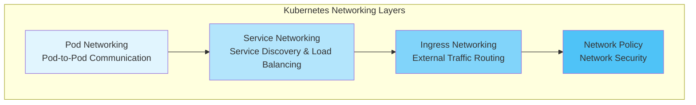
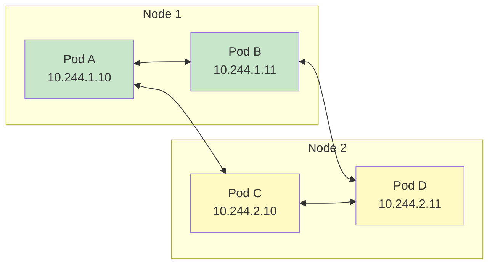
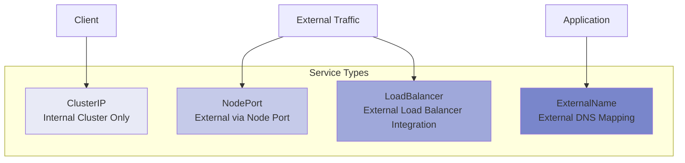
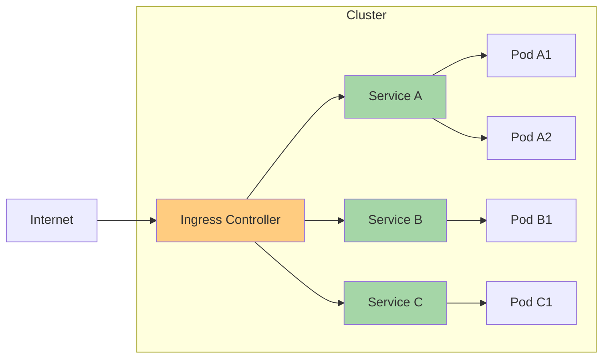
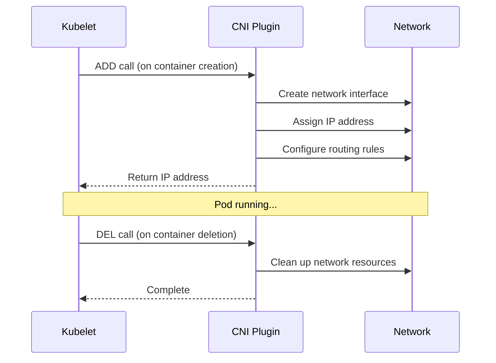
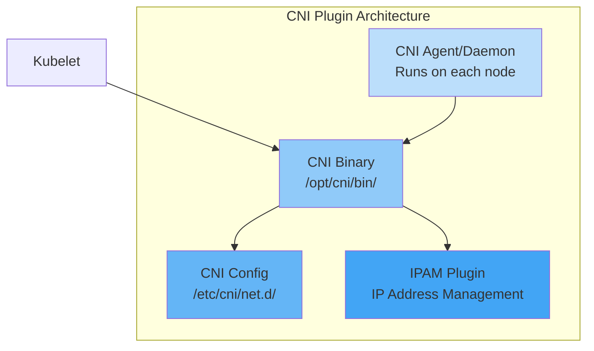
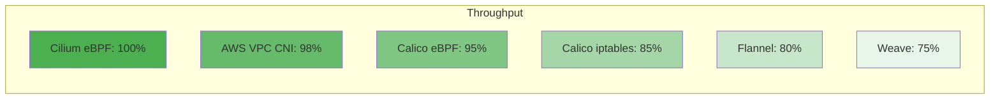
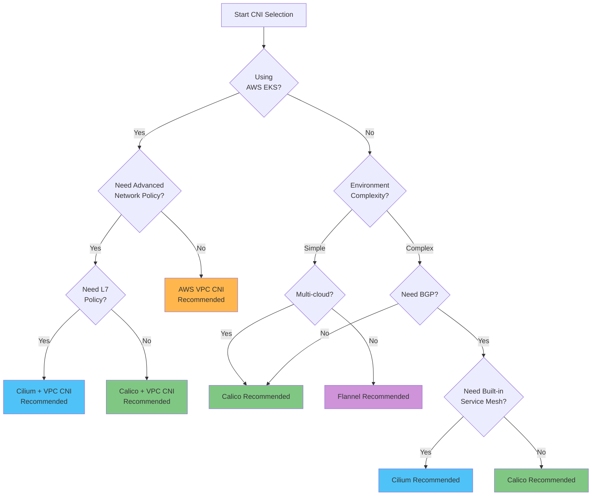
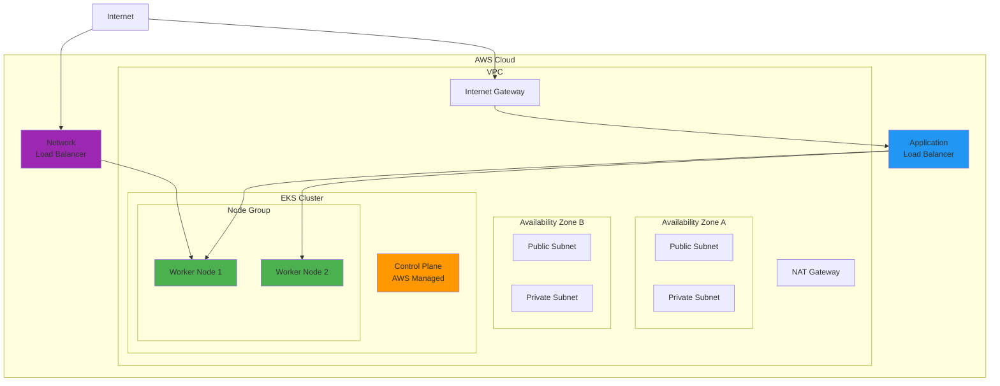
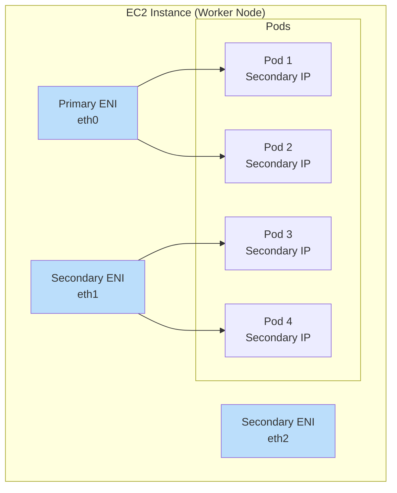

# Redes de Kubernetes

> **Última actualización**: February 22, 2026

## Descripción general

Las redes de Kubernetes constituyen la capa central de infraestructura que permite la comunicación entre aplicaciones en contenedores. Esta sección abarca desde los conceptos básicos de redes de Kubernetes hasta soluciones avanzadas de CNI (Container Network Interface) y patrones de red en entornos de AWS EKS.

## Modelo de red de Kubernetes

Kubernetes está diseñado con base en los siguientes requisitos de red:

1. **Cada Pod puede comunicarse con cualquier otro Pod sin NAT**
2. **Cada Node puede comunicarse con cada Pod sin NAT**
3. **La IP con la que un Pod se identifica es la misma IP con la que los demás lo identifican**



### Redes de Pods

Las redes de Pods son la capa más fundamental de las redes de Kubernetes. Cada Pod tiene una dirección IP única y puede comunicarse directamente con todos los demás Pods del clúster.



#### Métodos de implementación de redes de Pods

| Método | Descripción | CNI de ejemplo |
|--------|-------------|-------------|
| **Overlay Network** | Red virtual construida sobre la red existente | Flannel (VXLAN), Calico (IPIP), Weave Net |
| **Underlay Network** | Enrutamiento directo en la red física | AWS VPC CNI, Calico (BGP), Cilium (Native Routing) |
| **Hybrid** | Elegir overlay/underlay según el entorno | Cilium, Calico |

### Redes de Services

Los Services proporcionan endpoints de red estables para un conjunto de Pods.



#### Características de los tipos de Service

```yaml
# ClusterIP Service Example
apiVersion: v1
kind: Service
metadata:
  name: my-service
  namespace: default
spec:
  type: ClusterIP
  selector:
    app: my-app
  ports:
    - protocol: TCP
      port: 80
      targetPort: 8080
---
# NodePort Service Example
apiVersion: v1
kind: Service
metadata:
  name: my-nodeport-service
spec:
  type: NodePort
  selector:
    app: my-app
  ports:
    - protocol: TCP
      port: 80
      targetPort: 8080
      nodePort: 30080  # Range: 30000-32767
---
# LoadBalancer Service Example
apiVersion: v1
kind: Service
metadata:
  name: my-loadbalancer-service
  annotations:
    service.beta.kubernetes.io/aws-load-balancer-type: "nlb"
spec:
  type: LoadBalancer
  selector:
    app: my-app
  ports:
    - protocol: TCP
      port: 443
      targetPort: 8443
```

### Redes de Ingress

Ingress define reglas para enrutar el tráfico HTTP/HTTPS a Services internos del clúster.



```yaml
# Ingress Example
apiVersion: networking.k8s.io/v1
kind: Ingress
metadata:
  name: my-ingress
  annotations:
    kubernetes.io/ingress.class: "alb"
    alb.ingress.kubernetes.io/scheme: "internet-facing"
spec:
  rules:
    - host: api.example.com
      http:
        paths:
          - path: /v1
            pathType: Prefix
            backend:
              service:
                name: api-v1
                port:
                  number: 80
          - path: /v2
            pathType: Prefix
            backend:
              service:
                name: api-v2
                port:
                  number: 80
    - host: web.example.com
      http:
        paths:
          - path: /
            pathType: Prefix
            backend:
              service:
                name: web-frontend
                port:
                  number: 80
```

## CNI (Container Network Interface)

CNI es una interfaz estándar para la conectividad de red de contenedores. Kubernetes implementa las redes de Pods mediante plugins de CNI.

### Cómo funciona CNI



### Componentes del plugin de CNI



## Matriz de comparación de CNI

### Comparación de las principales soluciones de CNI

| Característica | Cilium | Calico | Flannel | AWS VPC CNI | Weave Net |
|---------|--------|--------|---------|-------------|-----------|
| **Tecnología principal** | eBPF | iptables/eBPF | VXLAN/host-gw | AWS ENI | VXLAN |
| **Network Policy** | Avanzada (L3-L7) | Avanzada (L3-L4) | Ninguna | Básica (L3-L4) | Básica |
| **Cifrado** | WireGuard/IPsec | WireGuard/IPsec | Ninguno | Ninguno | Integrado |
| **Service Mesh** | Integrado | Ninguno | Ninguno | Ninguno | Ninguno |
| **Observabilidad** | Hubble | Limitada | Ninguna | Ninguna | Ninguna |
| **Compatibilidad con BGP** | Sí | Sí | No | No | No |
| **Multiclúster** | ClusterMesh | Federation | No | No | Sí |
| **Compatibilidad con Windows** | Beta | Sí | Sí | Sí | Sí |
| **Rendimiento** | Excelente | Muy bueno | Bueno | Excelente | Bueno |
| **Complejidad** | Media-alta | Media | Baja | Baja | Baja |
| **Comunidad** | Activa | Muy activa | Activa | Compatible con AWS | Moderada |

### Comparación detallada de características

#### Modos de red

| CNI | Overlay | Native Routing | BGP | Direct Routing |
|-----|---------|----------------|-----|----------------|
| **Cilium** | VXLAN, Geneve | Sí | Sí | Sí |
| **Calico** | VXLAN, IPIP | Sí | Sí | Sí |
| **Flannel** | VXLAN | host-gw | No | No |
| **AWS VPC CNI** | No | VPC Native | No | Sí |
| **Weave Net** | VXLAN | No | No | No |

#### Características de Network Policy

| Característica | Cilium | Calico | AWS VPC CNI |
|---------|--------|--------|-------------|
| **Ingress Policy** | Sí | Sí | Sí |
| **Egress Policy** | Sí | Sí | Sí |
| **L7 Policy (HTTP)** | Sí | No | No |
| **DNS-based Policy** | Sí | Sí | No |
| **FQDN Policy** | Sí | Sí | No |
| **Host Policy** | Sí | Sí | No |
| **Global Policy** | Sí | Sí | No |
| **Policy Tiers** | Sí | Sí | No |

#### Benchmark de rendimiento (comparación relativa)



## Guía de selección de CNI

### Diagrama de flujo de decisión



### CNI recomendado según el caso de uso

#### 1. Entorno de producción de AWS EKS

**Recomendado: AWS VPC CNI + Calico (Network Policy)**

```yaml
# eksctl cluster configuration example
apiVersion: eksctl.io/v1alpha5
kind: ClusterConfig
metadata:
  name: production-cluster
  region: ap-northeast-2
vpc:
  cidr: "10.0.0.0/16"
addons:
  - name: vpc-cni
    version: latest
    configurationValues: |
      enableNetworkPolicy: "true"
  - name: coredns
  - name: kube-proxy
```

#### 2. Requisitos de seguridad avanzados

**Recomendado: Cilium**

- Compatibilidad con L7 Network Policy
- Política basada en DNS
- Políticas de seguridad a nivel de proceso/archivo
- Comunicación cifrada (WireGuard)

#### 3. Entorno on-premises/bare-metal

**Recomendado: Calico (modo BGP)**

- Integración con la infraestructura de red existente
- Emparejamiento BGP con switches ToR
- Alto rendimiento (sin overlay)

#### 4. Entorno de desarrollo/pruebas

**Recomendado: Flannel**

- Instalación y configuración sencillas
- Bajo uso de recursos
- Características básicas suficientes

#### 5. Entorno de integración de Service Mesh

**Recomendado: Cilium (Service Mesh sin Sidecar)**

- Puede sustituir a Istio/Envoy
- mTLS, gestión de tráfico
- Baja sobrecarga

## Fundamentos de redes de EKS

### Arquitectura de red predeterminada de EKS



### Cómo funciona VPC CNI

AWS VPC CNI asigna direcciones IP reales de VPC a cada Pod.



#### Límites de ENI e IP

| Tipo de instancia | ENI máximos | IPv4 por ENI | Pods máximos (recomendado) |
|---------------|----------|--------------|------------------------|
| t3.medium | 3 | 6 | 17 |
| t3.large | 3 | 12 | 35 |
| m5.large | 3 | 10 | 29 |
| m5.xlarge | 4 | 15 | 58 |
| m5.2xlarge | 4 | 15 | 58 |
| c5.4xlarge | 8 | 30 | 234 |

### Consideraciones de red de EKS

#### Gestión de direcciones IP

```yaml
# VPC CNI Configuration - IP Prefix Delegation
apiVersion: v1
kind: ConfigMap
metadata:
  name: amazon-vpc-cni
  namespace: kube-system
data:
  enable-prefix-delegation: "true"
  warm-prefix-target: "1"
  minimum-ip-target: "5"
  warm-ip-target: "2"
```

#### Redes personalizadas

```yaml
# ENIConfig for Custom Subnets
apiVersion: crd.k8s.amazonaws.com/v1alpha1
kind: ENIConfig
metadata:
  name: us-east-1a
spec:
  securityGroups:
    - sg-0123456789abcdef0
  subnet: subnet-0123456789abcdef0
---
apiVersion: crd.k8s.amazonaws.com/v1alpha1
kind: ENIConfig
metadata:
  name: us-east-1b
spec:
  securityGroups:
    - sg-0123456789abcdef0
  subnet: subnet-fedcba9876543210f
```

## Subpáginas de redes

Esta sección cubre los siguientes temas en detalle:

### [VPC CNI](01-vpc-cni.md)
CNI predeterminado de EKS. Asigna IP de VPC a cada Pod para redes nativas de VPC.

### [Análisis detallado de Cilium](cilium/README.md)
Solución de CNI de alto rendimiento basada en eBPF. Proporciona características avanzadas como L7 Network Policy, Service Mesh y observabilidad (Hubble).

### [Análisis detallado de Calico](calico/README.md)
Uno de los CNI más utilizados. Network Policy potente, compatibilidad con BGP y características empresariales. Abarca introducción, arquitectura, modos de red, análisis detallado de BGP, Network Policy, eBPF, temas avanzados, integración de EKS y guía de operaciones.

### [VPC Lattice](02-vpc-lattice.md)
Servicio de red de aplicaciones administrado por AWS. Comunicación de Service a Service entre VPC y entre cuentas.

### [AWS Load Balancer Controller](03-aws-lb-controller.md)
Integra Services e Ingress de Kubernetes con AWS ELB (ALB/NLB).

### [Gateway API](04-gateway-api.md)
API de Ingress de Kubernetes de próxima generación. Modelo de recursos estandarizado y configuración basada en roles.

## Solución de problemas de red

### Problemas comunes y soluciones

#### Error de comunicación de Pod a Pod

```bash
# 1. Check Pod IPs
kubectl get pods -o wide

# 2. Test network connectivity
kubectl exec -it <pod-name> -- ping <target-pod-ip>

# 3. Test DNS resolution
kubectl exec -it <pod-name> -- nslookup <service-name>

# 4. Check CNI logs
kubectl logs -n kube-system -l k8s-app=aws-node
kubectl logs -n kube-system -l k8s-app=cilium
```

#### Service inaccesible

```bash
# 1. Check Service status
kubectl get svc <service-name> -o yaml

# 2. Check Endpoints
kubectl get endpoints <service-name>

# 3. Check kube-proxy logs
kubectl logs -n kube-system -l k8s-app=kube-proxy
```

#### Depuración de Network Policy

```bash
# For Cilium
kubectl exec -n kube-system -it <cilium-pod> -- cilium policy get
kubectl exec -n kube-system -it <cilium-pod> -- cilium endpoint list

# For Calico
kubectl get networkpolicy -A
kubectl get globalnetworkpolicy
calicoctl get policy -o yaml
```

### Pruebas de rendimiento de red

```yaml
# Network performance test using iperf3
apiVersion: v1
kind: Pod
metadata:
  name: iperf-server
  labels:
    app: iperf-server
spec:
  containers:
  - name: iperf
    image: networkstatic/iperf3
    command: ["iperf3", "-s"]
    ports:
    - containerPort: 5201
---
apiVersion: v1
kind: Pod
metadata:
  name: iperf-client
spec:
  containers:
  - name: iperf
    image: networkstatic/iperf3
    command: ["sleep", "infinity"]
```

```bash
# Run the test
kubectl exec -it iperf-client -- iperf3 -c <iperf-server-ip> -t 30
```

## Prácticas recomendadas

### 1. Planificación de direcciones IP

- Diseñar bloques CIDR lo suficientemente grandes
- Separar la red de Pods de la red de Services
- Diseñar subnets teniendo en cuenta la expansión futura

### 2. Aplicar Network Policies

- Aplicar políticas predeterminadas de denegación (Zero Trust)
- Permitir explícitamente solo el tráfico necesario
- Aislar namespaces

```yaml
# Default deny policy example
apiVersion: networking.k8s.io/v1
kind: NetworkPolicy
metadata:
  name: default-deny-all
  namespace: production
spec:
  podSelector: {}
  policyTypes:
    - Ingress
    - Egress
```

### 3. Optimización del rendimiento

- Elegir el CNI adecuado (según la carga de trabajo)
- Optimización de MTU
- Ajuste de parámetros del kernel

### 4. Fortalecimiento de la seguridad

- Comunicación cifrada (WireGuard, IPsec)
- Aplicar mTLS
- Auditorías de seguridad periódicas

### 5. Garantizar la observabilidad

- Recopilar métricas de red
- Habilitar logs de flujo
- Implementar trazado distribuido

## Próximos pasos

1. [VPC CNI](01-vpc-cni.md) - CNI predeterminado de EKS
2. [Análisis detallado de Cilium](cilium/README.md) - Redes basadas en eBPF
3. [Análisis detallado de Calico](calico/README.md) - CNI empresarial
4. [VPC Lattice](02-vpc-lattice.md) - Redes administradas por AWS
5. [AWS Load Balancer Controller](03-aws-lb-controller.md) - Integración con ELB
6. [Gateway API](04-gateway-api.md) - Ingress de próxima generación

---

## Referencias

- [Modelo de red de Kubernetes](https://kubernetes.io/docs/concepts/cluster-administration/networking/)
- [Especificación de CNI](https://github.com/containernetworking/cni/blob/master/SPEC.md)
- [Documentación de AWS VPC CNI](https://docs.aws.amazon.com/eks/latest/userguide/pod-networking.html)
- [Guía de Network Policy](https://kubernetes.io/docs/concepts/services-networking/network-policies/)
