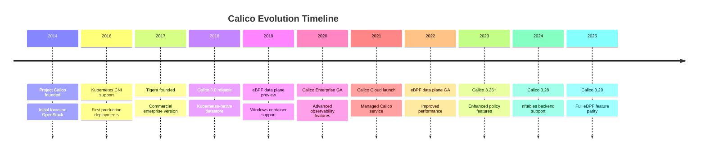
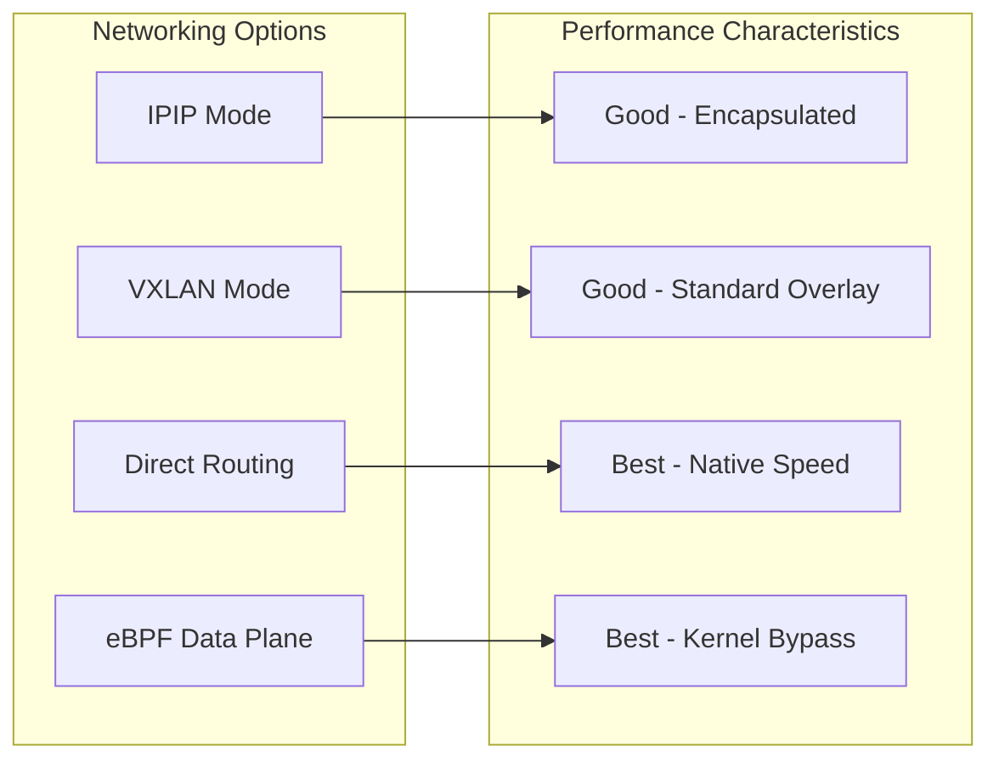
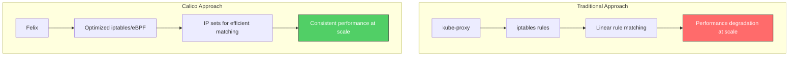
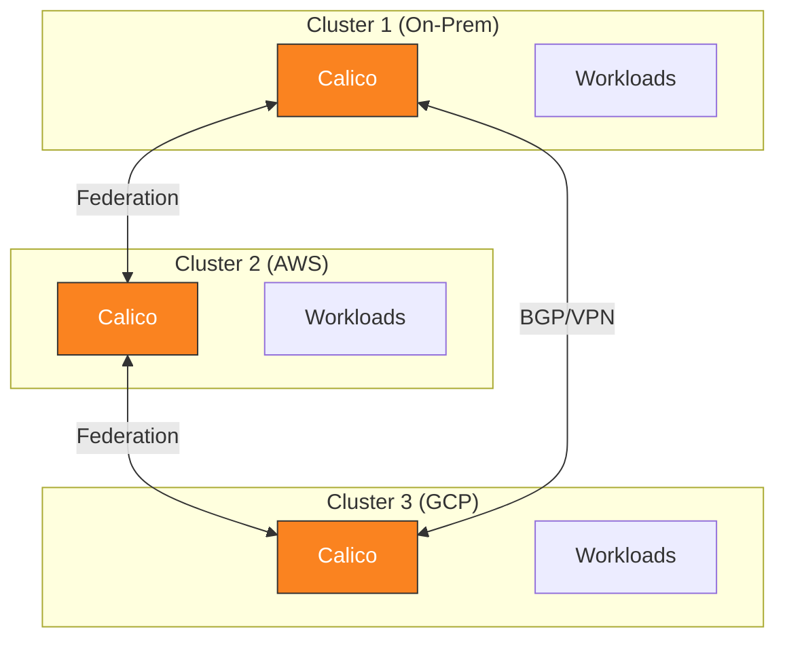

# Parte 1: Introducción a Calico

> **Versiones compatibles**: Calico v3.29+ / Kubernetes 1.28+
> **Última actualización**: February 22, 2026

## Configuración del entorno de laboratorio

Para seguir los ejemplos de este documento, necesitarás las siguientes herramientas y entorno.

### Herramientas necesarias

| Herramienta | Versión | Propósito |
|------|---------|---------|
| kubectl | v1.28+ | Administración de clústeres Kubernetes |
| calicoctl | v3.29+ | Administración de recursos de Calico |
| Helm | v3.12+ | Administración de paquetes (opcional) |
| kind/minikube | Última | Clúster Kubernetes local |

### Instalación de calicoctl

```bash
# Download calicoctl binary
curl -L https://github.com/projectcalico/calico/releases/download/v3.29.0/calicoctl-linux-amd64 -o calicoctl
chmod +x calicoctl
sudo mv calicoctl /usr/local/bin/

# Verify installation
calicoctl version

# Configure datastore access (Kubernetes API)
export DATASTORE_TYPE=kubernetes
export KUBECONFIG=~/.kube/config
```

### Configuración de un clúster local con kind

```bash
# Create kind cluster configuration
cat <<EOF > kind-calico.yaml
kind: Cluster
apiVersion: kind.x-k8s.io/v1alpha4
networking:
  disableDefaultCNI: true
  podSubnet: 192.168.0.0/16
nodes:
- role: control-plane
- role: worker
- role: worker
EOF

# Create the cluster
kind create cluster --config kind-calico.yaml --name calico-lab

# Install Calico
kubectl create -f https://raw.githubusercontent.com/projectcalico/calico/v3.29.0/manifests/tigera-operator.yaml
kubectl create -f https://raw.githubusercontent.com/projectcalico/calico/v3.29.0/manifests/custom-resources.yaml

# Wait for Calico to be ready
kubectl wait --for=condition=Ready pods -l k8s-app=calico-node -n calico-system --timeout=300s
```

### Verificación de la instalación

```bash
# Check all Calico components
kubectl get pods -n calico-system

# Expected output:
# NAME                                       READY   STATUS    RESTARTS   AGE
# calico-kube-controllers-xxxxxxxxx-xxxxx    1/1     Running   0          2m
# calico-node-xxxxx                          1/1     Running   0          2m
# calico-node-yyyyy                          1/1     Running   0          2m
# calico-typha-xxxxxxxxx-xxxxx               1/1     Running   0          2m
# csi-node-driver-xxxxx                      2/2     Running   0          2m

# Check node status
calicoctl node status

# Check IP pools
calicoctl get ippools -o wide
```

## ¿Qué es Calico?

Calico es una solución de redes y seguridad de red de código abierto diseñada para cargas de trabajo cloud-native. Proporciona una solución de redes y políticas de red altamente escalable para Kubernetes, máquinas virtuales y cargas de trabajo bare metal.

### Historia del proyecto: de Project Calico a Tigera



| Año | Hito | Importancia |
|------|-----------|--------------|
| 2014 | Fundación de Project Calico | Comenzó como una solución de redes para OpenStack |
| 2016 | Compatibilidad con Kubernetes CNI | Se expandió a la orquestación de contenedores |
| 2017 | Fundación de Tigera | Respaldo comercial y características Enterprise |
| 2018 | Calico 3.0 | Compatibilidad con datastore nativo de Kubernetes |
| 2019 | Compatibilidad con Windows | Se aceleró la adopción empresarial |
| 2020 | Calico Enterprise GA | Conjunto completo de características Enterprise |
| 2021 | Calico Cloud | Lanzamiento de la oferta SaaS |
| 2022 | eBPF data plane GA | Opción moderna de data plane |
| 2024 | Backend de nftables | Compatibilidad con firewall Linux de próxima generación |
| 2025 | Calico 3.29 | Paridad total de características de eBPF |

## Características principales

Calico proporciona cinco capacidades fundamentales que lo convierten en una opción líder para las redes de Kubernetes.

### 1. Redes de alto rendimiento

Calico ofrece varios modos de red optimizados para distintos entornos:



**Características clave de rendimiento:**
- Integración con el stack de redes nativo de Linux
- Data plane eBPF opcional para reducir la sobrecarga
- Enrutamiento basado en BGP para seleccionar la ruta óptima
- Sobrecarga de encapsulación mínima en el modo de enrutamiento directo

### 2. Aplicación de políticas de red

Calico implementa la API NetworkPolicy de Kubernetes y la amplía con potentes características adicionales:

```yaml
# Standard Kubernetes NetworkPolicy (supported by Calico)
apiVersion: networking.k8s.io/v1
kind: NetworkPolicy
metadata:
  name: default-deny-ingress
  namespace: production
spec:
  podSelector: {}
  policyTypes:
  - Ingress
---
# Calico-specific GlobalNetworkPolicy
apiVersion: projectcalico.org/v3
kind: GlobalNetworkPolicy
metadata:
  name: security-baseline
spec:
  selector: all()
  types:
  - Ingress
  - Egress
  ingress:
  - action: Allow
    source:
      selector: trusted == 'true'
  egress:
  - action: Allow
    destination:
      nets:
      - 10.0.0.0/8
```

**Capacidades de las políticas:**
- Selección de Pod basada en etiquetas
- Aislamiento de Namespace
- Reglas basadas en CIDR
- Filtrado por protocolo y puerto
- Políticas globales (para todo el clúster)
- Niveles de políticas ordenados (Enterprise)
- Políticas de egress basadas en FQDN

### 3. Administración flexible de direcciones IP (IPAM)

El sistema IPAM de Calico asigna eficientemente direcciones IP en todo el clúster:

```yaml
apiVersion: projectcalico.org/v3
kind: IPPool
metadata:
  name: default-ipv4-pool
spec:
  cidr: 192.168.0.0/16
  blockSize: 26              # 64 IPs per block
  ipipMode: Always
  vxlanMode: Never
  natOutgoing: true
  nodeSelector: all()
```

**Características de IPAM:**
- Asignación basada en bloques (predeterminado: bloques /26)
- Varios IP pools para distintos tipos de cargas de trabajo
- Asignación de IP pool específica por Node
- Compatibilidad con dual-stack IPv4 e IPv6
- Recuperación automática de IP

### 4. Enrutamiento basado en BGP

La compatibilidad BGP nativa de Calico permite una integración fluida con la infraestructura de red existente:

```yaml
apiVersion: projectcalico.org/v3
kind: BGPConfiguration
metadata:
  name: default
spec:
  logSeverityScreen: Info
  nodeToNodeMeshEnabled: true
  asNumber: 64512
---
apiVersion: projectcalico.org/v3
kind: BGPPeer
metadata:
  name: rack-tor-switch
spec:
  peerIP: 10.0.0.1
  asNumber: 64513
  nodeSelector: rack == 'rack-1'
```

**Capacidades de BGP:**
- Malla completa entre Nodes (configurada automáticamente)
- Peering con routers externos (switches ToR, firewalls)
- Compatibilidad con route reflectors para clústeres grandes
- Prepend de ruta AS y communities
- Compatibilidad con reinicio elegante

### 5. Compatibilidad multiplataforma

Calico funciona de forma consistente en diversos entornos:

| Plataforma | Nivel de compatibilidad | Notas |
|----------|---------------|-------|
| AWS EKS | Completo | Integración VPC nativa disponible |
| Azure AKS | Completo | Opción Azure CNI + políticas de Calico |
| Google GKE | Completo | Dataplane V2 basado en Calico |
| On-Premises | Completo | Integración BGP con la red física |
| OpenStack | Completo | Compatibilidad con la plataforma original |
| Windows | Completo | Windows Server 2019/2022 |
| Bare Metal | Completo | Se recomienda el enrutamiento directo |

## Calico frente a las redes tradicionales

### Desafíos de las redes Kubernetes tradicionales



### Tabla comparativa

| Aspecto | Tradicional (kube-proxy) | Calico |
|--------|-------------------------|--------|
| **Organización de reglas** | Cadenas lineales de iptables | IP sets + cadenas optimizadas |
| **Impacto de escala** | Recorrido de reglas O(n) | Búsquedas de IP set O(1) |
| **Compatibilidad con políticas** | Ninguna (requiere CNI independiente) | Características nativas y ampliadas |
| **Enrutamiento** | Solo a nivel de Service | Enrutamiento L3 completo |
| **Visibilidad** | Limitada | Logs de flujo, métricas |
| **BGP** | No compatible | Compatibilidad nativa |
| **Opciones de data plane** | Solo iptables | iptables, nftables, eBPF |

### Rendimiento a escala

```
Cluster Size: 1000 nodes, 50,000 pods

Traditional iptables (kube-proxy):
- Rules: ~150,000 iptables rules
- Latency: 2-5ms added per connection
- Memory: ~500MB per node

Calico (optimized):
- Rules: ~5,000 rules + IP sets
- Latency: <0.5ms added per connection
- Memory: ~150MB per node
```

## Casos de uso

### 1. Centro de datos On-Premises

Calico destaca en implementaciones On-Premises donde se requiere la integración BGP con la infraestructura de red existente:

```yaml
# BGP peering with data center ToR switches
apiVersion: projectcalico.org/v3
kind: BGPPeer
metadata:
  name: datacenter-tor
spec:
  peerIP: 10.1.0.1
  asNumber: 65001
  password:
    secretKeyRef:
      name: bgp-secrets
      key: tor-password
```

**Beneficios:**
- Sin sobrecarga de overlay
- Integración directa con el enrutamiento existente
- Compatibilidad con balanceadores de carga de hardware
- Políticas de seguridad coherentes en VM y contenedores

### 2. Implementaciones en la nube (AWS, GCP, Azure)

Calico proporciona características mejoradas de seguridad y políticas sobre las redes del proveedor de nube:

```yaml
# EKS deployment with VXLAN
apiVersion: operator.tigera.io/v1
kind: Installation
metadata:
  name: default
spec:
  kubernetesProvider: EKS
  cni:
    type: Calico
  calicoNetwork:
    bgp: Disabled
    ipPools:
    - cidr: 10.244.0.0/16
      encapsulation: VXLAN
```

**Beneficios:**
- Funciona dentro de las restricciones de VPC de la nube
- Políticas de red mejoradas más allá de las opciones cloud-native
- Modelo de políticas coherente en entornos multi-cloud
- Integración con grupos de seguridad de la nube

### 3. Híbrido y multi-clúster

Calico Federation permite políticas y enrutamiento entre varios clústeres:



**Beneficios:**
- Administración de políticas unificada entre clústeres
- Descubrimiento de Service entre clústeres
- Postura de seguridad coherente
- Compatibilidad con migraciones graduales

### 4. Entornos orientados al cumplimiento normativo

Calico Enterprise proporciona características avanzadas para sectores regulados:

- **Registro de auditoría**: Registro completo de los cambios y la aplicación de políticas
- **Informes de cumplimiento**: Informes predefinidos para PCI-DSS, SOC 2, HIPAA
- **Cifrado**: Cifrado node-to-node basado en WireGuard
- **Defensa frente a amenazas**: Protección DDoS y detección de anomalías

## Gobernanza del proyecto y comunidad

### Gobernanza de código abierto

Calico es un proyecto de código abierto alojado dentro del ecosistema de Cloud Native Computing Foundation (CNCF):

- **Licencia**: Apache 2.0
- **Gobernanza**: Comunidad abierta con Tigera como mantenedor principal
- **Contribución**: Abierto a contribuciones de la comunidad a través de GitHub
- **Lanzamientos**: Cadencia de lanzamientos regular (aproximadamente trimestral)

### Recursos de la comunidad

| Recurso | URL |
|----------|-----|
| GitHub | https://github.com/projectcalico/calico |
| Documentación | https://docs.tigera.io/calico/latest/ |
| Slack | https://calicousers.slack.com |
| Reuniones de la comunidad | Quincenales, abiertas a todos |
| Stack Overflow | Etiqueta: `project-calico` |

### Cómo obtener ayuda

```bash
# Join the Calico Slack community
# Visit: https://slack.projectcalico.org

# File issues on GitHub
# https://github.com/projectcalico/calico/issues

# Check the FAQ
# https://docs.tigera.io/calico/latest/reference/faq
```

## Resumen

Calico proporciona una solución de redes madura y probada en batalla para Kubernetes con:

1. **Estabilidad comprobada**: Utilizado en producción por miles de organizaciones
2. **Arquitectura flexible**: Varias opciones de data plane (iptables, nftables, eBPF)
3. **Políticas integrales**: Kubernetes NetworkPolicy más las políticas ampliadas de Calico
4. **BGP nativo**: Compatibilidad de primera clase para implementaciones On-Premises e híbridas
5. **Multiplataforma**: Experiencia coherente en nube, On-Premises e híbrido

En la siguiente sección, profundizaremos en la arquitectura de Calico para comprender cómo funcionan juntos estos componentes.

[Siguiente: Parte 2 - Análisis detallado de la arquitectura de Calico](02-architecture.md)

[Volver a la descripción general de Calico](README.md)

## Cuestionario

Para poner a prueba lo que has aprendido en este capítulo, prueba el [Cuestionario de introducción](../../quizzes/networking/calico/01-introduction-quiz.md).
