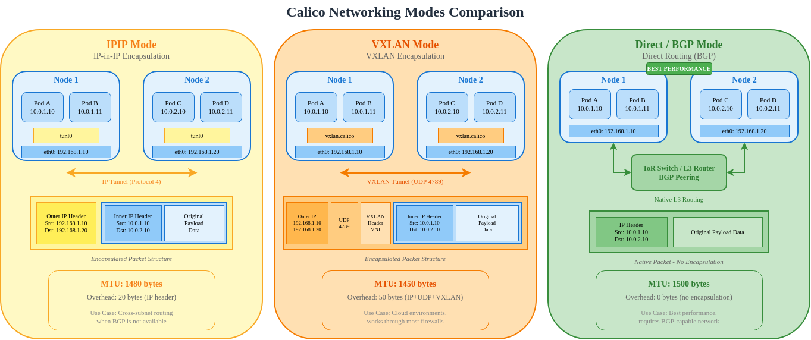
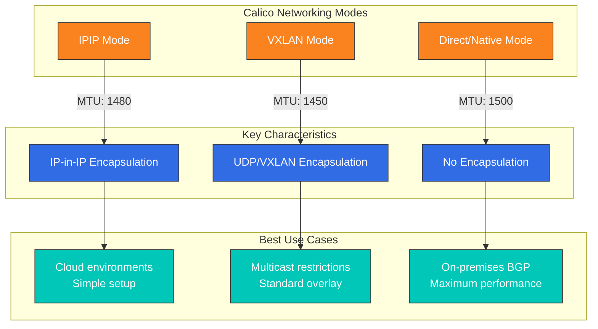
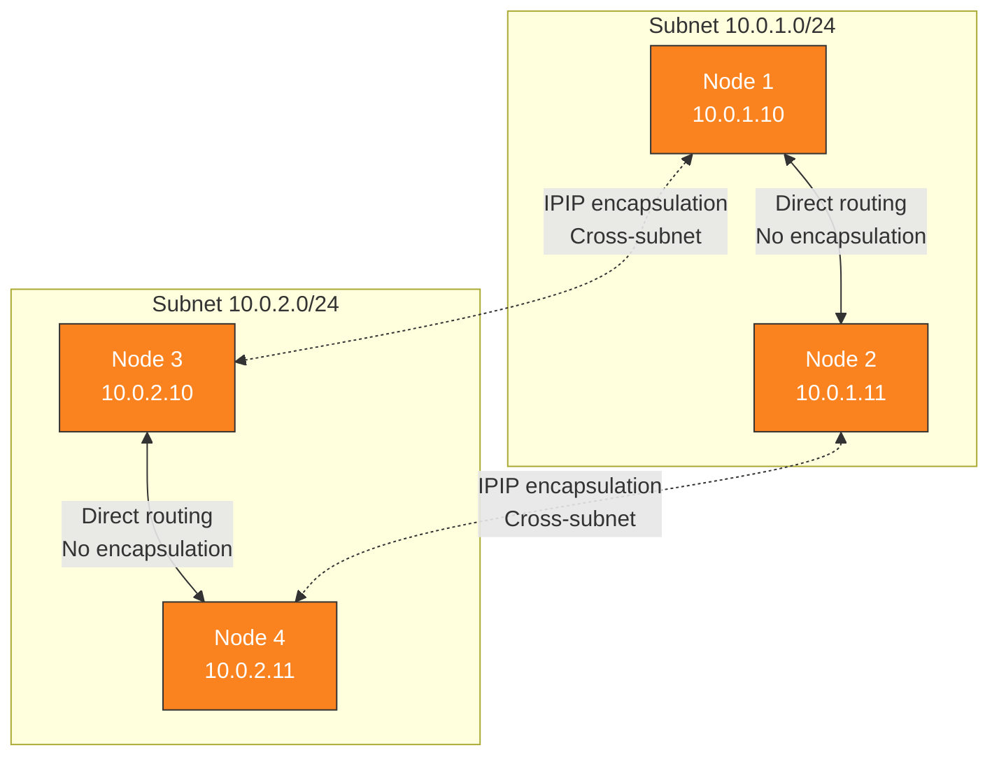
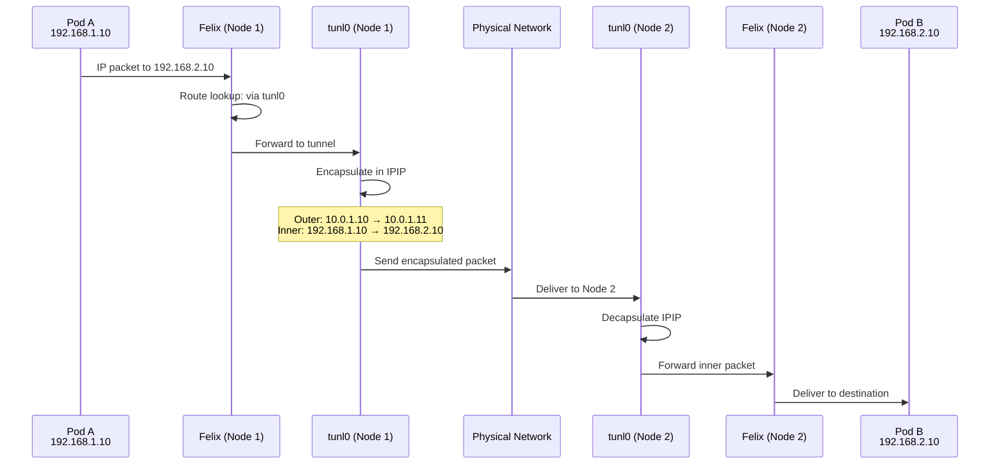
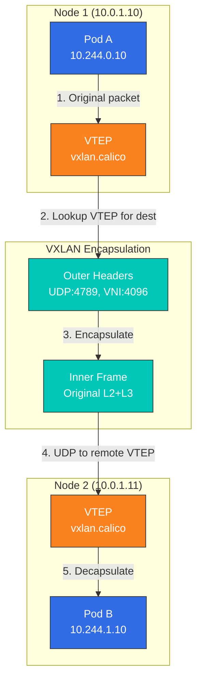
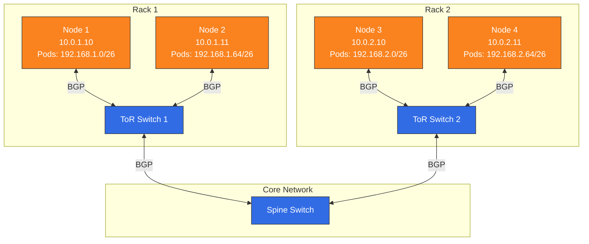
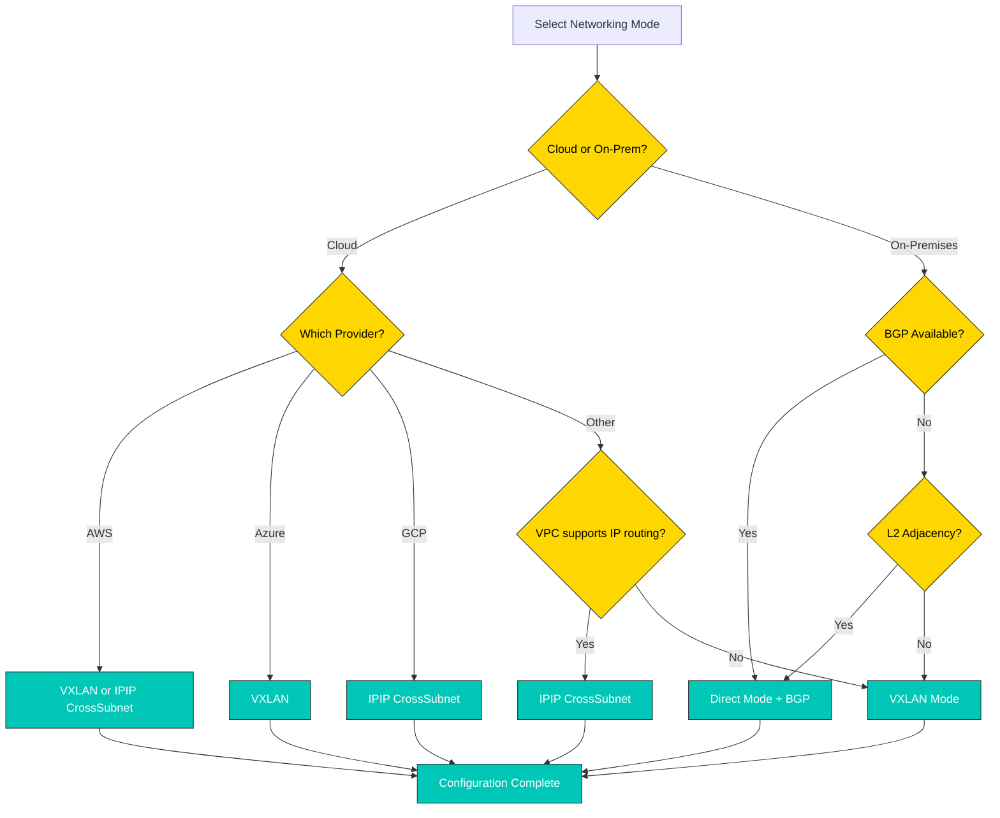

# Parte 3: Modos de red

> **Versiones compatibles**: Calico v3.29+ / Kubernetes 1.28+ **Última actualización**: February 23, 2026

## Descripción general

Calico admite varios modos de red para adaptarse a diferentes requisitos de infraestructura, necesidades de rendimiento y restricciones operativas. Esta sección profundiza en cada modo de red y te ayuda a elegir y configurar el modo óptimo para tu entorno.

## Resumen de los modos de red





## Modo IPIP

IP-in-IP (IPIP) es el modo de encapsulación predeterminado de Calico. Envuelve el paquete IP original dentro de otro paquete IP para la comunicación entre subredes.

### Estructura de paquete IPIP

```
Standard IP Packet (1500 bytes MTU):
┌──────────────────────────────────────────────────────────────────┐
│ Ethernet │    IP Header (20B)    │  TCP/UDP  │     Payload      │
│   (14B)  │ Src: 192.168.1.10     │   (20B)   │   (up to 1460B)  │
│          │ Dst: 192.168.2.10     │           │                   │
└──────────────────────────────────────────────────────────────────┘

IPIP Encapsulated Packet (1500 bytes outer MTU):
┌───────────────────────────────────────────────────────────────────────────────┐
│ Ethernet │  Outer IP (20B)   │  Inner IP (20B)   │ TCP/UDP │    Payload     │
│   (14B)  │ Src: 10.0.1.10    │ Src: 192.168.1.10 │  (20B)  │ (up to 1440B)  │
│          │ Dst: 10.0.1.11    │ Dst: 192.168.2.10 │         │                │
│          │ Proto: 4 (IPIP)   │                   │         │                │
└───────────────────────────────────────────────────────────────────────────────┘
                                ▲
                                │
                         20 bytes overhead
                         Effective MTU: 1480
```

### Opciones del modo IPIP

| Modo            | Descripción                               | Caso de uso                                   |
| --------------- | ----------------------------------------- | ------------------------------------------ |
| **Siempre**      | Todo el tráfico de Pod a Pod se encapsula    | Entornos de nube, configuración sencilla           |
| **CrossSubnet** | Solo se encapsula el tráfico entre subredes | Entornos híbridos, rendimiento optimizado |
| **Nunca**       | IPIP deshabilitado (usar con enrutamiento Direct)   | On-premises con BGP                       |

### Modo IPIP CrossSubnet

CrossSubnet es una optimización que encapsula únicamente el tráfico que cruza límites L3:



### Configuración de IPPool de IPIP

```yaml
apiVersion: projectcalico.org/v3
kind: IPPool
metadata:
  name: default-ipv4-ippool
spec:
  cidr: 192.168.0.0/16
  blockSize: 26                    # /26 = 64 IPs per block
  ipipMode: Always                 # Options: Always, CrossSubnet, Never
  vxlanMode: Never
  natOutgoing: true
  nodeSelector: all()
---
# CrossSubnet mode for optimized performance
apiVersion: projectcalico.org/v3
kind: IPPool
metadata:
  name: crosssubnet-ippool
spec:
  cidr: 10.244.0.0/16
  blockSize: 26
  ipipMode: CrossSubnet
  vxlanMode: Never
  natOutgoing: true
  nodeSelector: all()
```

### Interfaz de túnel IPIP

```bash
# View IPIP tunnel interface on a node
ip link show tunl0

# Expected output:
# tunl0@NONE: <NOARP,UP,LOWER_UP> mtu 1480 qdisc noqueue state UNKNOWN mode DEFAULT group default qlen 1000
#     link/ipip 0.0.0.0 brd 0.0.0.0

# View IPIP routes
ip route | grep tunl0

# Expected output:
# 192.168.2.0/26 via 10.0.1.11 dev tunl0 proto bird onlink
# 192.168.3.0/26 via 10.0.1.12 dev tunl0 proto bird onlink
```

### Diagrama de flujo de paquetes IPIP



## Modo VXLAN

VXLAN (Virtual Extensible LAN) es un protocolo de overlay estándar de la industria que encapsula tramas de capa 2 en paquetes UDP.

### Estructura de paquete VXLAN

```
VXLAN Encapsulated Packet:
┌─────────────────────────────────────────────────────────────────────────────────────────┐
│ Outer    │ Outer IP (20B)   │  UDP (8B)  │ VXLAN  │ Inner    │ Inner IP │ TCP/ │ Pay- │
│ Ethernet │ Src: 10.0.1.10   │ Src: rand  │ Header │ Ethernet │  (20B)   │ UDP  │ load │
│  (14B)   │ Dst: 10.0.1.11   │ Dst: 4789  │  (8B)  │  (14B)   │          │(20B) │      │
└─────────────────────────────────────────────────────────────────────────────────────────┘
                                                      ▲
                                                      │
                                               50 bytes overhead
                                               Effective MTU: 1450
```

### Componentes de VXLAN

| Componente             | Descripción                                      |
| --------------------- | ------------------------------------------------ |
| **VTEP**              | Endpoint de túnel VXLAN: punto de encapsulación/desencapsulación        |
| **VNI**               | Identificador de red VXLAN (Calico usa un VNI fijo) |
| **Puerto UDP**          | 4789 (asignado por IANA)                             |
| **Multicast/Unicast** | Calico usa unicast con VTEP de pares conocidos        |

### Configuración de IPPool de VXLAN

```yaml
apiVersion: projectcalico.org/v3
kind: IPPool
metadata:
  name: vxlan-ippool
spec:
  cidr: 10.244.0.0/16
  blockSize: 26
  ipipMode: Never
  vxlanMode: Always                # Options: Always, CrossSubnet, Never
  natOutgoing: true
  nodeSelector: all()
---
# VXLAN CrossSubnet mode
apiVersion: projectcalico.org/v3
kind: IPPool
metadata:
  name: vxlan-crosssubnet-ippool
spec:
  cidr: 10.245.0.0/16
  blockSize: 26
  ipipMode: Never
  vxlanMode: CrossSubnet
  natOutgoing: true
  nodeSelector: all()
```

### Configuración de interfaz VXLAN

```bash
# View VXLAN interface
ip link show vxlan.calico

# Expected output:
# vxlan.calico: <BROADCAST,MULTICAST,UP,LOWER_UP> mtu 1450 qdisc noqueue state UNKNOWN mode DEFAULT group default
#     link/ether 66:5b:5c:5d:5e:5f brd ff:ff:ff:ff:ff:ff

# View VXLAN FDB (Forwarding Database)
bridge fdb show dev vxlan.calico

# Expected output:
# 66:a1:a2:a3:a4:a5 dst 10.0.1.11 self permanent
# 66:b1:b2:b3:b4:b5 dst 10.0.1.12 self permanent

# View VXLAN routes
ip route | grep vxlan

# Expected output:
# 10.244.1.0/26 via 10.244.1.0 dev vxlan.calico onlink
# 10.244.2.0/26 via 10.244.2.0 dev vxlan.calico onlink
```

### Flujo de paquetes VXLAN



## Modo Direct/sin encapsulación

El modo de enrutamiento Direct usa enrutamiento IP nativo sin encapsulación, lo que proporciona el mejor rendimiento posible.

### Requisitos para el modo Direct

| Requisito           | Descripción                                    |
| --------------------- | ---------------------------------------------- |
| **Adyacencia L2**      | Los Nodes deben estar en la misma red L2, O       |
| **Enrutamiento BGP**       | Los routers externos deben aprender las rutas de Pod mediante BGP |
| **Propagación de rutas** | La red física debe enrutar los CIDR de Pod          |

### Topología del modo Direct



### Configuración de IPPool del modo Direct

```yaml
apiVersion: projectcalico.org/v3
kind: IPPool
metadata:
  name: direct-routing-pool
spec:
  cidr: 192.168.0.0/16
  blockSize: 26
  ipipMode: Never                  # Disable IPIP
  vxlanMode: Never                 # Disable VXLAN
  natOutgoing: true
  nodeSelector: all()
```

### Configuración de BGP para el modo Direct

```yaml
# Global BGP configuration
apiVersion: projectcalico.org/v3
kind: BGPConfiguration
metadata:
  name: default
spec:
  logSeverityScreen: Info
  nodeToNodeMeshEnabled: true      # Full mesh for small clusters
  asNumber: 64512
---
# Peer with ToR switches
apiVersion: projectcalico.org/v3
kind: BGPPeer
metadata:
  name: rack1-tor
spec:
  peerIP: 10.0.1.1
  asNumber: 65001
  nodeSelector: rack == 'rack1'
---
apiVersion: projectcalico.org/v3
kind: BGPPeer
metadata:
  name: rack2-tor
spec:
  peerIP: 10.0.2.1
  asNumber: 65001
  nodeSelector: rack == 'rack2'
```

### Rutas del modo Direct

```bash
# View routes on a node in direct mode
ip route

# Expected output (no tunnel interfaces):
# default via 10.0.1.1 dev eth0
# 10.0.1.0/24 dev eth0 proto kernel scope link src 10.0.1.10
# 192.168.1.0/26 dev cali123456 scope link           # Local pods
# 192.168.1.64/26 via 10.0.1.11 dev eth0 proto bird  # Node 2 pods
# 192.168.2.0/26 via 10.0.1.1 dev eth0 proto bird    # Rack 2 via ToR
# 192.168.2.64/26 via 10.0.1.1 dev eth0 proto bird   # Rack 2 via ToR
```

## Comparación de modos

### IPIP vs VXLAN vs Direct

| Característica               | IPIP                | VXLAN                | Direct       |
| --------------------- | ------------------- | -------------------- | ------------ |
| **Protocolo**          | Protocolo IP 4       | Puerto UDP 4789        | IP nativo    |
| **Sobrecarga**          | 20 bytes            | 50 bytes             | 0 bytes      |
| **MTU**               | 1480                | 1450                 | 1500         |
| **Compatible con firewall** | Puede necesitar protocolo IP 4 | Paso de UDP     | Nativo       |
| **Descarga de hardware**  | Limitada             | Mejor compatibilidad       | Compatibilidad completa |
| **Requisito L2**    | No                  | No                   | Sí (o BGP) |
| **Multicast**         | No es necesario          | No es necesario (unicast) | No es necesario   |
| **Rendimiento**       | Bueno                | Bueno                 | Mejor         |
| **Complejidad**        | Baja                 | Baja                  | Media       |

### Comparación de benchmarks de rendimiento

```
Test Environment:
- Nodes: 3x c5.xlarge (AWS)
- Network: 10 Gbps
- Tool: iperf3 TCP, 60 second test

Results (TCP throughput, single stream):

┌─────────────────────────────────────────────────────────────┐
│                    Throughput (Gbps)                        │
├─────────────────────────────────────────────────────────────┤
│ Direct Mode      ████████████████████████████████  9.41     │
│ IPIP Mode        ███████████████████████████████   9.12     │
│ VXLAN Mode       ██████████████████████████████    8.89     │
└─────────────────────────────────────────────────────────────┘

Latency (microseconds, p99):

┌─────────────────────────────────────────────────────────────┐
│                    Latency (μs)                             │
├─────────────────────────────────────────────────────────────┤
│ Direct Mode      ████                              45       │
│ IPIP Mode        █████                             52       │
│ VXLAN Mode       ██████                            61       │
└─────────────────────────────────────────────────────────────┘

CPU Usage (% per Gbps):

┌─────────────────────────────────────────────────────────────┐
│                    CPU (% per Gbps)                         │
├─────────────────────────────────────────────────────────────┤
│ Direct Mode      ███                               2.1      │
│ IPIP Mode        ████                              2.8      │
│ VXLAN Mode       █████                             3.4      │
└─────────────────────────────────────────────────────────────┘
```

### Comparación de flujo de paquetes


## Compatibilidad con proveedores de nube

| Proveedor        | IPIP | VXLAN | Direct           | Recomendado               |
| --------------- | ---- | ----- | ---------------- | ------------------------- |
| **AWS EC2**     | Sí  | Sí   | Con enrutamiento VPC | VXLAN o IPIP CrossSubnet |
| **AWS EKS**     | Sí  | Sí   | Limitado          | VXLAN (predeterminado)           |
| **Azure**       | Sí  | Sí   | Con UDR         | VXLAN                     |
| **GCP**         | Sí  | Sí   | Con rutas VPC  | IPIP CrossSubnet          |
| **On-Premises** | Sí  | Sí   | Sí (BGP)        | Direct (con BGP)         |
| **Bare Metal**  | Sí  | Sí   | Sí              | Direct (con BGP)         |
| **OpenStack**   | Sí  | Sí   | Sí              | Depende de la configuración de neutron |

### Configuración específica para AWS

```yaml
# For AWS EC2/EKS with VXLAN
apiVersion: operator.tigera.io/v1
kind: Installation
metadata:
  name: default
spec:
  kubernetesProvider: EKS
  cni:
    type: Calico
  calicoNetwork:
    bgp: Disabled                  # AWS VPC doesn't support BGP
    ipPools:
    - cidr: 10.244.0.0/16
      encapsulation: VXLAN
      natOutgoing: Enabled
      nodeSelector: all()
```

### On-Premises con BGP

```yaml
# For on-premises with BGP peering
apiVersion: operator.tigera.io/v1
kind: Installation
metadata:
  name: default
spec:
  kubernetesProvider: ""
  cni:
    type: Calico
  calicoNetwork:
    bgp: Enabled
    ipPools:
    - cidr: 192.168.0.0/16
      encapsulation: None          # Direct routing
      natOutgoing: Enabled
      nodeSelector: all()
```

## Guía de migración de modos

### Migración de IPIP a VXLAN

```bash
# Step 1: Create new VXLAN IPPool
cat <<EOF | kubectl apply -f -
apiVersion: projectcalico.org/v3
kind: IPPool
metadata:
  name: vxlan-pool
spec:
  cidr: 10.245.0.0/16
  blockSize: 26
  ipipMode: Never
  vxlanMode: Always
  natOutgoing: true
  nodeSelector: all()
EOF

# Step 2: Disable old IPIP pool (prevents new allocations)
calicoctl patch ippool default-ipv4-ippool -p '{"spec": {"disabled": true}}'

# Step 3: Rolling restart workloads to get new IPs
kubectl rollout restart deployment -n <namespace>

# Step 4: After all pods migrated, delete old pool
calicoctl delete ippool default-ipv4-ippool
```

### Migración de Overlay a Direct

```yaml
# Step 1: Ensure BGP is configured
apiVersion: projectcalico.org/v3
kind: BGPConfiguration
metadata:
  name: default
spec:
  nodeToNodeMeshEnabled: true
  asNumber: 64512
---
# Step 2: Configure BGP peers (for external routing)
apiVersion: projectcalico.org/v3
kind: BGPPeer
metadata:
  name: tor-peer
spec:
  peerIP: 10.0.0.1
  asNumber: 65001
---
# Step 3: Create direct mode IPPool
apiVersion: projectcalico.org/v3
kind: IPPool
metadata:
  name: direct-pool
spec:
  cidr: 192.168.0.0/16
  ipipMode: Never
  vxlanMode: Never
  natOutgoing: true
```

## Guía de optimización de MTU

### Cálculo de MTU por modo

| Modo             | MTU base | Sobrecarga | MTU efectiva | Configuración        |
| ---------------- | -------- | -------- | ------------- | -------------------- |
| Direct           | 1500     | 0        | 1500          | No se necesita ningún cambio     |
| IPIP             | 1500     | 20       | 1480          | `ipipMTU: 1480`      |
| VXLAN            | 1500     | 50       | 1450          | `vxlanMTU: 1450`     |
| WireGuard        | 1500     | 60       | 1440          | `wireguardMTU: 1440` |
| IPIP + WireGuard | 1500     | 80       | 1420          | Sobrecarga combinada    |

### Configuración de MTU

```yaml
apiVersion: projectcalico.org/v3
kind: FelixConfiguration
metadata:
  name: default
spec:
  # Auto-detect MTU (recommended)
  mtuIfacePattern: ^((en|wl|eth).*|bond[0-9]+)$

  # Or set explicit values
  ipipMTU: 1480
  vxlanMTU: 1450
  wireguardMTU: 1440
```

### Configuración de Jumbo Frames

```yaml
# For networks supporting jumbo frames (MTU 9000)
apiVersion: projectcalico.org/v3
kind: FelixConfiguration
metadata:
  name: default
spec:
  ipipMTU: 8980              # 9000 - 20 (IPIP overhead)
  vxlanMTU: 8950             # 9000 - 50 (VXLAN overhead)
```

### Verificación de MTU

```bash
# Check interface MTU
ip link show | grep mtu

# Test path MTU
ping -M do -s 1472 <destination-pod-ip>   # For 1500 MTU
ping -M do -s 1452 <destination-pod-ip>   # For IPIP (1480 MTU)
ping -M do -s 1422 <destination-pod-ip>   # For VXLAN (1450 MTU)

# Check for MTU issues in tcpdump
tcpdump -i eth0 'icmp[icmptype] == 3 and icmp[icmpcode] == 4'
```

## Diagrama de flujo de decisión



## Resumen

Elegir el modo de red adecuado es fundamental para un rendimiento óptimo de Calico:

1. **Modo IPIP**: Opción predeterminada para entornos de nube, fácil de configurar
2. **Modo VXLAN**: Mejor compatibilidad con firewall, protocolo de overlay estándar
3. **Modo Direct**: Máximo rendimiento para entornos on-premises con infraestructura BGP

Consideraciones clave:

* **Despliegues en la nube**: Usa VXLAN o IPIP CrossSubnet
* **On-premises con BGP**: Usa el modo Direct para obtener el mejor rendimiento
* **Entornos mixtos**: IPIP o VXLAN CrossSubnet proporcionan un buen equilibrio
* **Rendimiento crítico**: Modo Direct con la configuración BGP adecuada

[Anterior: Parte 2 - Análisis profundo de la arquitectura de Calico](02-architecture.md)

[Volver a la descripción general de Calico](./)

## Cuestionario

Para comprobar lo que has aprendido en este capítulo, prueba el [Cuestionario de modos de red](../../quizzes/networking/calico/03-networking-modes-quiz.md).
