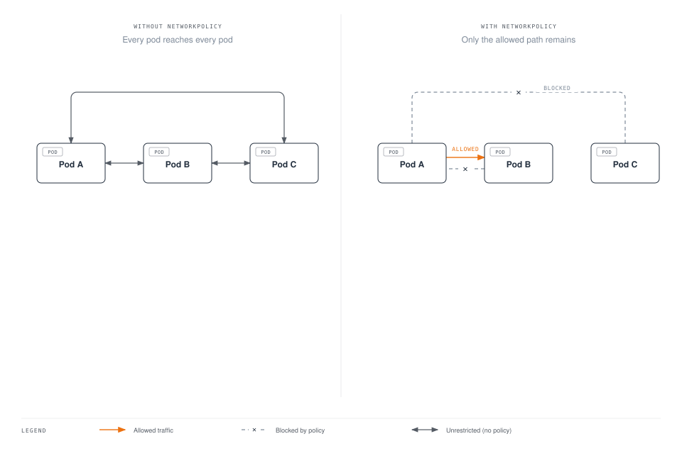
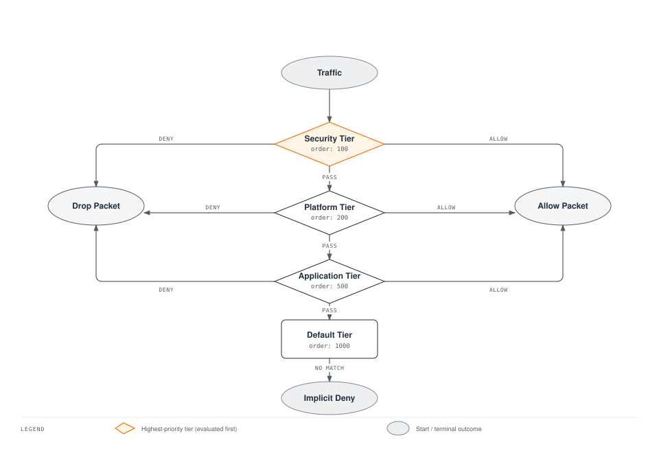

# Parte 5: Network Policy

> **Versiones compatibles**: Calico v3.29+ / Kubernetes 1.28+ **Última actualización**: February 23, 2026

## Introducción

Las políticas de red son fundamentales para la seguridad de Kubernetes, ya que controlan el flujo de tráfico entre pods, namespaces y endpoints externos. Aunque Kubernetes proporciona una API básica de NetworkPolicy, Calico la amplía con características potentes que incluyen políticas globales, evaluación de políticas por niveles, reglas basadas en DNS y filtrado de Capa 7.

Este análisis detallado cubre tanto las políticas estándar de Kubernetes como las capacidades ampliadas de Calico, y ofrece patrones y ejemplos para requisitos de seguridad empresariales.

***

## NetworkPolicy estándar de Kubernetes

### Fundamentos de NetworkPolicy

Kubernetes NetworkPolicy es un recurso con ámbito de namespace que controla el tráfico hacia y desde los pods según etiquetas, namespaces y bloques IP.



### Estructura básica de NetworkPolicy

```yaml
apiVersion: networking.k8s.io/v1
kind: NetworkPolicy
metadata:
  name: example-policy
  namespace: default
spec:
  # Which pods this policy applies to
  podSelector:
    matchLabels:
      app: web

  # Policy types: Ingress, Egress, or both
  policyTypes:
    - Ingress
    - Egress

  # Ingress rules (who can connect TO these pods)
  ingress:
    - from:
        - podSelector:
            matchLabels:
              app: frontend
        - namespaceSelector:
            matchLabels:
              purpose: monitoring
        - ipBlock:
            cidr: 10.0.0.0/8
            except:
              - 10.0.1.0/24
      ports:
        - protocol: TCP
          port: 8080

  # Egress rules (where these pods can connect TO)
  egress:
    - to:
        - podSelector:
            matchLabels:
              app: database
      ports:
        - protocol: TCP
          port: 5432
```

### Limitaciones de Kubernetes NetworkPolicy

| Limitación            | Descripción                         | Solución de Calico          |
| --------------------- | ----------------------------------- | -------------------------- |
| Solo con ámbito de namespace | No se pueden crear políticas para todo el clúster | GlobalNetworkPolicy      |
| Sin orden de políticas    | Todas las políticas se evalúan por igual      | Políticas por niveles          |
| Sin reglas de denegación         | Solo permitir (denegación implícita)          | Acciones Deny explícitas    |
| Filtrado L4 limitado  | Solo puerto/protocolo básico            | Rangos de puertos, puertos con nombre |
| Sin filtrado L7       | No se puede filtrar por métodos HTTP       | Reglas de coincidencia HTTP         |
| Sin compatibilidad con FQDN       | No se pueden usar nombres de dominio             | Política DNS               |
| Solo centrado en Pod      | No se pueden proteger nodos                | Host endpoints           |

***

## Extensiones de Calico NetworkPolicy

### Compatibilidad ampliada con protocolos

Calico admite protocolos adicionales además de TCP y UDP:

```yaml
apiVersion: projectcalico.org/v3
kind: NetworkPolicy
metadata:
  name: extended-protocols
  namespace: default
spec:
  selector: app == 'network-tools'

  ingress:
    # ICMP ping
    - action: Allow
      protocol: ICMP
      icmp:
        type: 8  # Echo Request
        code: 0

    # ICMPv6
    - action: Allow
      protocol: ICMPv6
      icmp:
        type: 128  # Echo Request

    # SCTP
    - action: Allow
      protocol: SCTP
      destination:
        ports:
          - 3868  # Diameter

    # UDP with port range
    - action: Allow
      protocol: UDP
      destination:
        ports:
          - 5000:6000  # Port range
```

### Rangos de puertos y puertos con nombre

```yaml
apiVersion: projectcalico.org/v3
kind: NetworkPolicy
metadata:
  name: port-examples
  namespace: default
spec:
  selector: app == 'multi-port-app'

  ingress:
    # Port range
    - action: Allow
      protocol: TCP
      destination:
        ports:
          - 8080:8090

    # Named ports (from pod spec)
    - action: Allow
      protocol: TCP
      destination:
        ports:
          - http      # References containerPort name
          - metrics   # References containerPort name

    # Mix of specific ports and ranges
    - action: Allow
      protocol: TCP
      destination:
        ports:
          - 22
          - 80
          - 443
          - 3000:3100
```

### Sintaxis de selectores mejorada

Calico utiliza una sintaxis de selectores más expresiva que Kubernetes:

```yaml
apiVersion: projectcalico.org/v3
kind: NetworkPolicy
metadata:
  name: selector-examples
  namespace: production
spec:
  # Label equality
  selector: app == 'web'

  ingress:
    # Set membership
    - action: Allow
      source:
        selector: app in {'frontend', 'api-gateway', 'monitoring'}

    # Negation
    - action: Allow
      source:
        selector: app != 'untrusted'

    # Label existence
    - action: Allow
      source:
        selector: has(security-cleared)

    # Combining conditions (AND)
    - action: Allow
      source:
        selector: app == 'backend' && tier == 'internal'

    # Complex expression (OR via multiple rules)
    - action: Allow
      source:
        selector: (app == 'frontend') || (app == 'api')

    # Namespace selector
    - action: Allow
      source:
        namespaceSelector: environment == 'production'
        selector: app == 'authorized-client'
```

***

## GlobalNetworkPolicy

GlobalNetworkPolicy se aplica en todos los namespaces y es ideal para reglas de seguridad de todo el clúster.

### Estructura de GlobalNetworkPolicy

```yaml
apiVersion: projectcalico.org/v3
kind: GlobalNetworkPolicy
metadata:
  name: cluster-wide-deny-egress
spec:
  # Applies to all pods (empty selector)
  selector: all()

  # Order determines priority (lower = higher priority)
  order: 1000

  types:
    - Egress

  egress:
    # Block access to metadata service
    - action: Deny
      destination:
        nets:
          - 169.254.169.254/32

    # Block access to internal DNS except kube-dns
    - action: Deny
      protocol: UDP
      destination:
        ports:
          - 53
        notSelector: k8s-app == 'kube-dns'
```

### Patrones comunes de GlobalNetworkPolicy

**Denegar todo el tráfico de forma predeterminada:**

```yaml
apiVersion: projectcalico.org/v3
kind: GlobalNetworkPolicy
metadata:
  name: default-deny-all
spec:
  selector: all()
  order: 10000  # Lowest priority
  types:
    - Ingress
    - Egress

  # Empty rules = deny all
  ingress: []
  egress: []
```

**Permitir servicios esenciales:**

```yaml
apiVersion: projectcalico.org/v3
kind: GlobalNetworkPolicy
metadata:
  name: allow-essential-services
spec:
  selector: all()
  order: 100
  types:
    - Egress

  egress:
    # Allow DNS
    - action: Allow
      protocol: UDP
      destination:
        selector: k8s-app == 'kube-dns'
        ports:
          - 53

    # Allow Kubernetes API
    - action: Allow
      protocol: TCP
      destination:
        nets:
          - 10.96.0.1/32  # ClusterIP of kubernetes service
        ports:
          - 443
```

**Bloquear namespaces sensibles:**

```yaml
apiVersion: projectcalico.org/v3
kind: GlobalNetworkPolicy
metadata:
  name: protect-kube-system
spec:
  namespaceSelector: kubernetes.io/metadata.name == 'kube-system'
  order: 50
  types:
    - Ingress

  ingress:
    # Only allow from pods with explicit access
    - action: Allow
      source:
        selector: has(kube-system-access)

    # Allow from kube-system itself
    - action: Allow
      source:
        namespaceSelector: kubernetes.io/metadata.name == 'kube-system'

    # Deny everything else (implicit)
```

***

## NetworkSet y GlobalNetworkSet

Los NetworkSets agrupan direcciones IP para reutilizarlas en varias políticas.

### NetworkSet (con ámbito de namespace)

```yaml
apiVersion: projectcalico.org/v3
kind: NetworkSet
metadata:
  name: corporate-networks
  namespace: default
  labels:
    network-type: corporate
spec:
  nets:
    - 10.0.0.0/8
    - 172.16.0.0/12
    - 192.168.0.0/16

---
# Reference in policy
apiVersion: projectcalico.org/v3
kind: NetworkPolicy
metadata:
  name: allow-corporate
  namespace: default
spec:
  selector: app == 'internal-app'

  ingress:
    - action: Allow
      source:
        selector: network-type == 'corporate'  # References NetworkSet by label
```

### GlobalNetworkSet (con ámbito de clúster)

```yaml
apiVersion: projectcalico.org/v3
kind: GlobalNetworkSet
metadata:
  name: external-trusted-ips
  labels:
    network-group: external-trusted
spec:
  nets:
    - 203.0.113.0/24     # Partner network
    - 198.51.100.0/24    # CDN network
    - 192.0.2.50/32      # Specific trusted IP

---
apiVersion: projectcalico.org/v3
kind: GlobalNetworkSet
metadata:
  name: blocked-countries
  labels:
    network-group: blocked
spec:
  nets:
    # Country IP ranges to block
    - 1.2.3.0/24
    - 5.6.7.0/24

---
# Reference in GlobalNetworkPolicy
apiVersion: projectcalico.org/v3
kind: GlobalNetworkPolicy
metadata:
  name: external-access-control
spec:
  selector: has(external-facing)
  order: 200
  types:
    - Ingress

  ingress:
    # Allow trusted external
    - action: Allow
      source:
        selector: network-group == 'external-trusted'

    # Block known bad actors
    - action: Deny
      source:
        selector: network-group == 'blocked'
```

***

## Políticas por niveles


[🔍 Ver diagrama interactivo](https://www.atomai.click/kubernetes-docs/archmaps/en-networking-calico-05-network-policy-2.html)

Los niveles proporcionan una evaluación jerárquica de políticas y permiten separar responsabilidades entre los equipos de plataforma, seguridad y aplicaciones.

### Orden de evaluación de políticas



### Creación de niveles

```yaml
# Security team tier (highest priority)
apiVersion: projectcalico.org/v3
kind: Tier
metadata:
  name: security
spec:
  order: 100

---
# Platform team tier
apiVersion: projectcalico.org/v3
kind: Tier
metadata:
  name: platform
spec:
  order: 200

---
# Application team tier
apiVersion: projectcalico.org/v3
kind: Tier
metadata:
  name: application
spec:
  order: 500

---
# Default tier (lowest priority, auto-created)
# order: 1000
```

### Ejemplo de política por niveles

```yaml
# Security tier: Block known threats
apiVersion: projectcalico.org/v3
kind: GlobalNetworkPolicy
metadata:
  name: security.block-threats
spec:
  tier: security
  order: 100
  selector: all()
  types:
    - Ingress
    - Egress

  ingress:
    - action: Deny
      source:
        selector: network-group == 'threat-intel'

  egress:
    - action: Deny
      destination:
        selector: network-group == 'malware-c2'

    # Pass to next tier for further evaluation
    - action: Pass

---
# Platform tier: Enforce baseline connectivity
apiVersion: projectcalico.org/v3
kind: GlobalNetworkPolicy
metadata:
  name: platform.baseline
spec:
  tier: platform
  order: 100
  selector: all()
  types:
    - Egress

  egress:
    # Allow DNS
    - action: Allow
      protocol: UDP
      destination:
        selector: k8s-app == 'kube-dns'
        ports:
          - 53

    # Allow Kubernetes API
    - action: Allow
      protocol: TCP
      destination:
        services:
          name: kubernetes
          namespace: default

    # Pass to application tier
    - action: Pass

---
# Application tier: Team-specific policies
apiVersion: projectcalico.org/v3
kind: NetworkPolicy
metadata:
  name: application.frontend-rules
  namespace: production
spec:
  tier: application
  order: 100
  selector: app == 'frontend'
  types:
    - Ingress
    - Egress

  ingress:
    - action: Allow
      source:
        selector: app == 'ingress-nginx'

  egress:
    - action: Allow
      destination:
        selector: app == 'backend'
        ports:
          - 8080
```

### Integración de RBAC de niveles

```yaml
# ClusterRole for security team
apiVersion: rbac.authorization.k8s.io/v1
kind: ClusterRole
metadata:
  name: security-team-policy-admin
rules:
  - apiGroups: ["projectcalico.org"]
    resources: ["globalnetworkpolicies", "tiers"]
    verbs: ["*"]
    # Can only manage policies in security tier
    resourceNames: ["security.*"]

---
# ClusterRole for application teams
apiVersion: rbac.authorization.k8s.io/v1
kind: ClusterRole
metadata:
  name: app-team-policy-admin
rules:
  - apiGroups: ["projectcalico.org"]
    resources: ["networkpolicies"]
    verbs: ["*"]
  - apiGroups: ["projectcalico.org"]
    resources: ["tiers"]
    verbs: ["get", "list"]
    resourceNames: ["application"]
```

***

## Política de Egress basada en FQDN

Calico puede filtrar el tráfico de Egress según nombres de dominio, lo que resulta útil para controlar el acceso a servicios externos.

### Configuración de políticas DNS

Primero, habilite la política DNS en Felix:

```yaml
apiVersion: projectcalico.org/v3
kind: FelixConfiguration
metadata:
  name: default
spec:
  dnsTrustedServers:
    - k8s-service:kube-system/kube-dns
  policySyncPathPrefix: /var/run/nodeagent
```

### Reglas de Egress de FQDN

```yaml
apiVersion: projectcalico.org/v3
kind: GlobalNetworkPolicy
metadata:
  name: allow-specific-domains
spec:
  selector: app == 'external-api-client'
  order: 500
  types:
    - Egress

  egress:
    # Allow specific domains
    - action: Allow
      destination:
        domains:
          - api.github.com
          - "*.amazonaws.com"
          - registry.npmjs.org
      protocol: TCP
      destination:
        ports:
          - 443

    # Allow Google APIs
    - action: Allow
      destination:
        domains:
          - "*.googleapis.com"
          - "*.google.com"
      protocol: TCP
      destination:
        ports:
          - 443

    # Deny all other external
    - action: Deny
      destination:
        notNets:
          - 10.0.0.0/8
          - 172.16.0.0/12
          - 192.168.0.0/16
```

### Patrones de dominios con comodines

```yaml
apiVersion: projectcalico.org/v3
kind: GlobalNetworkPolicy
metadata:
  name: dns-wildcards
spec:
  selector: all()
  egress:
    # Single wildcard - matches any subdomain
    - action: Allow
      destination:
        domains:
          - "*.example.com"     # Matches api.example.com, www.example.com

    # Does NOT match
    # example.com (no subdomain)
    # deep.sub.example.com (multiple levels)
```

***

## Filtrado por método HTTP (Capa 7)

Calico Enterprise y Calico Cloud admiten la política de Capa 7 para tráfico HTTP.

### Reglas de coincidencia HTTP

```yaml
apiVersion: projectcalico.org/v3
kind: GlobalNetworkPolicy
metadata:
  name: l7-http-policy
spec:
  selector: app == 'api-server'
  order: 300
  types:
    - Ingress

  ingress:
    # Allow only GET and HEAD for read-only clients
    - action: Allow
      source:
        selector: role == 'reader'
      http:
        methods:
          - GET
          - HEAD
        paths:
          - prefix: /api/v1/

    # Allow full access for admin clients
    - action: Allow
      source:
        selector: role == 'admin'
      http:
        methods:
          - GET
          - POST
          - PUT
          - DELETE
          - PATCH

    # Allow health checks
    - action: Allow
      http:
        methods:
          - GET
        paths:
          - exact: /health
          - exact: /ready
```

### Filtrado basado en rutas

```yaml
apiVersion: projectcalico.org/v3
kind: NetworkPolicy
metadata:
  name: path-based-policy
  namespace: production
spec:
  selector: app == 'web-app'

  ingress:
    # Public endpoints
    - action: Allow
      http:
        paths:
          - prefix: /public/
          - exact: /

    # Admin endpoints - restricted
    - action: Allow
      source:
        selector: role == 'admin'
      http:
        paths:
          - prefix: /admin/

    # API endpoints - authenticated only
    - action: Allow
      source:
        selector: has(api-access)
      http:
        paths:
          - prefix: /api/
```

***

## Protección de Host Endpoint

Los Host endpoints protegen el tráfico hacia y desde el propio nodo, no solo los pods.

### Habilitación de Host Endpoints

```yaml
apiVersion: projectcalico.org/v3
kind: FelixConfiguration
metadata:
  name: default
spec:
  defaultEndpointToHostAction: Drop  # or Accept, Return
```

### Definición de Host Endpoint

```yaml
apiVersion: projectcalico.org/v3
kind: HostEndpoint
metadata:
  name: node1-eth0
  labels:
    host: node1
    interface: external
spec:
  interfaceName: eth0
  node: node1
  expectedIPs:
    - 10.0.1.10

---
# Policy for host endpoints
apiVersion: projectcalico.org/v3
kind: GlobalNetworkPolicy
metadata:
  name: host-ssh-policy
spec:
  selector: interface == 'external'
  order: 100
  types:
    - Ingress

  ingress:
    # Allow SSH from bastion
    - action: Allow
      protocol: TCP
      source:
        nets:
          - 10.0.0.100/32  # Bastion IP
      destination:
        ports:
          - 22

    # Allow kubelet API from control plane
    - action: Allow
      protocol: TCP
      source:
        selector: has(control-plane)
      destination:
        ports:
          - 10250

    # Allow node exporter metrics
    - action: Allow
      protocol: TCP
      source:
        namespaceSelector: kubernetes.io/metadata.name == 'monitoring'
        selector: app == 'prometheus'
      destination:
        ports:
          - 9100
```

### Host Endpoints automáticos

Cree automáticamente Host endpoints para todos los nodos:

```yaml
apiVersion: projectcalico.org/v3
kind: FelixConfiguration
metadata:
  name: default
spec:
  defaultEndpointToHostAction: Drop

---
apiVersion: operator.tigera.io/v1
kind: Installation
metadata:
  name: default
spec:
  calicoNetwork:
    hostPorts: Enabled  # Creates auto host endpoints
```

***

## Políticas DoNotTrack y PreDNAT

### Políticas DoNotTrack

Las políticas DoNotTrack omiten el seguimiento de conexiones, lo que resulta útil para escenarios de alto rendimiento:

```yaml
apiVersion: projectcalico.org/v3
kind: GlobalNetworkPolicy
metadata:
  name: high-throughput-no-track
spec:
  selector: app == 'load-balancer'
  order: 10
  types:
    - Ingress
    - Egress

  doNotTrack: true
  applyOnForward: true

  ingress:
    - action: Allow
      protocol: TCP
      destination:
        ports:
          - 80
          - 443

  egress:
    - action: Allow
```

### Políticas PreDNAT

Las políticas PreDNAT se aplican antes del NAT de destino, lo que resulta útil para controlar el acceso a NodePort:

```yaml
apiVersion: projectcalico.org/v3
kind: GlobalNetworkPolicy
metadata:
  name: restrict-nodeport-access
spec:
  selector: has(kubernetes.io/os)  # Applies to host endpoints
  order: 100
  types:
    - Ingress

  preDNAT: true
  applyOnForward: true

  ingress:
    # Allow NodePort access only from trusted networks
    - action: Allow
      protocol: TCP
      source:
        nets:
          - 10.0.0.0/8
      destination:
        ports:
          - 30000:32767  # NodePort range

    # Deny NodePort from everywhere else
    - action: Deny
      protocol: TCP
      destination:
        ports:
          - 30000:32767
```

***

## Depuración de políticas

### Uso de calicoctl

```bash
# List all policies
calicoctl get networkpolicy -A
calicoctl get globalnetworkpolicy

# Get policy details
calicoctl get networkpolicy my-policy -n default -o yaml

# Describe endpoints affected by a policy
calicoctl get workloadendpoint -o wide

# Check policy selectors
calicoctl get networkpolicy -o yaml | grep -A5 selector
```

### Comprobación de reglas de iptables

```bash
# View Calico chains
iptables -L -n -v | grep -i cali

# View filter table
iptables -t filter -L -n -v

# View NAT table
iptables -t nat -L -n -v

# Count packets by rule
iptables -L cali-fw-xxxxx -n -v

# Watch traffic in real-time
watch -n 1 'iptables -L cali-fw-xxxxx -n -v'
```

### Registros de Felix

```bash
# View Felix logs
kubectl logs -n kube-system -l k8s-app=calico-node -c calico-node | grep -i policy

# Increase log verbosity
calicoctl patch felixconfiguration default -p '{"spec":{"logSeverityScreen":"Debug"}}'

# Check policy sync status
kubectl exec -n kube-system calico-node-xxxxx -c calico-node -- calico-node -felix-ready
```

### Depuración del flujo de evaluación de políticas

```bash
# Get workload endpoint details
calicoctl get workloadendpoint -n default --selector='app==web' -o yaml

# Check which policies apply
calicoctl get networkpolicy -A -o yaml | grep -B20 "app.*web"

# Test connectivity
kubectl exec -it test-pod -- nc -zv target-pod 8080
```

***

## Biblioteca de patrones de políticas comunes

### Patrón de microservicios

```yaml
# Frontend -> Backend -> Database
---
apiVersion: projectcalico.org/v3
kind: NetworkPolicy
metadata:
  name: frontend-policy
  namespace: production
spec:
  selector: app == 'frontend'
  types:
    - Ingress
    - Egress

  ingress:
    - action: Allow
      source:
        selector: app == 'ingress-nginx'

  egress:
    - action: Allow
      destination:
        selector: app == 'backend'
        ports:
          - 8080

---
apiVersion: projectcalico.org/v3
kind: NetworkPolicy
metadata:
  name: backend-policy
  namespace: production
spec:
  selector: app == 'backend'
  types:
    - Ingress
    - Egress

  ingress:
    - action: Allow
      source:
        selector: app == 'frontend'
        ports:
          - 8080

  egress:
    - action: Allow
      destination:
        selector: app == 'database'
        ports:
          - 5432

---
apiVersion: projectcalico.org/v3
kind: NetworkPolicy
metadata:
  name: database-policy
  namespace: production
spec:
  selector: app == 'database'
  types:
    - Ingress

  ingress:
    - action: Allow
      source:
        selector: app == 'backend'
        ports:
          - 5432
```

### Aislamiento multiinquilino

```yaml
# Each tenant namespace is fully isolated
apiVersion: projectcalico.org/v3
kind: GlobalNetworkPolicy
metadata:
  name: tenant-isolation
spec:
  namespaceSelector: has(tenant)
  order: 500
  types:
    - Ingress
    - Egress

  ingress:
    # Allow same-tenant traffic
    - action: Allow
      source:
        namespaceSelector: tenant == "$(namespace.tenant)"

  egress:
    # Allow same-tenant traffic
    - action: Allow
      destination:
        namespaceSelector: tenant == "$(namespace.tenant)"

    # Allow DNS
    - action: Allow
      protocol: UDP
      destination:
        selector: k8s-app == 'kube-dns'
        ports:
          - 53
```

### Patrón de confianza cero

```yaml
# Default deny everything
apiVersion: projectcalico.org/v3
kind: GlobalNetworkPolicy
metadata:
  name: zero-trust-default-deny
spec:
  selector: all()
  order: 10000
  types:
    - Ingress
    - Egress
  ingress: []
  egress: []

---
# Explicit allow for each service
apiVersion: projectcalico.org/v3
kind: NetworkPolicy
metadata:
  name: zero-trust-api-server
  namespace: production
spec:
  selector: app == 'api-server'
  order: 100
  types:
    - Ingress
    - Egress

  ingress:
    - action: Allow
      source:
        selector: app == 'api-gateway'
        namespaceSelector: kubernetes.io/metadata.name == 'production'
      destination:
        ports:
          - 8080

  egress:
    - action: Allow
      destination:
        selector: app == 'database'
        namespaceSelector: kubernetes.io/metadata.name == 'production'
        ports:
          - 5432

    # Allow DNS
    - action: Allow
      protocol: UDP
      destination:
        namespaceSelector: kubernetes.io/metadata.name == 'kube-system'
        selector: k8s-app == 'kube-dns'
        ports:
          - 53
```

### Patrón de control de Egress

```yaml
# Control outbound internet access
apiVersion: projectcalico.org/v3
kind: GlobalNetworkPolicy
metadata:
  name: egress-internet-control
spec:
  selector: has(internet-access)
  order: 300
  types:
    - Egress

  egress:
    # Allow approved external services
    - action: Allow
      destination:
        domains:
          - "*.amazonaws.com"
          - api.github.com
          - registry.npmjs.org
      protocol: TCP
      destination:
        ports:
          - 443

    # Allow internal traffic
    - action: Allow
      destination:
        nets:
          - 10.0.0.0/8
          - 172.16.0.0/12
          - 192.168.0.0/16

---
# Block internet for unlabeled pods
apiVersion: projectcalico.org/v3
kind: GlobalNetworkPolicy
metadata:
  name: egress-internet-deny
spec:
  selector: "!has(internet-access)"
  order: 400
  types:
    - Egress

  egress:
    # Allow internal only
    - action: Allow
      destination:
        nets:
          - 10.0.0.0/8
          - 172.16.0.0/12
          - 192.168.0.0/16

    # Deny external
    - action: Deny
```

### Patrón de aislamiento de namespace

```yaml
# Isolate namespaces by default
apiVersion: projectcalico.org/v3
kind: GlobalNetworkPolicy
metadata:
  name: namespace-isolation
spec:
  namespaceSelector: has(kubernetes.io/metadata.name)
  order: 800
  types:
    - Ingress

  ingress:
    # Allow same namespace
    - action: Allow
      source:
        namespaceSelector: kubernetes.io/metadata.name == "$(namespace.name)"

    # Allow monitoring namespace
    - action: Allow
      source:
        namespaceSelector: kubernetes.io/metadata.name == 'monitoring'
        selector: app in {'prometheus', 'grafana'}

    # Allow ingress namespace
    - action: Allow
      source:
        namespaceSelector: kubernetes.io/metadata.name == 'ingress-nginx'
```

***

## Impacto de las políticas en el rendimiento

### Consideraciones de rendimiento

| Factor              | Impacto                  | Mitigación                              |
| ------------------- | ------------------------ | --------------------------------------- |
| Número de políticas  | Evaluación lineal de reglas  | Use políticas por niveles, optimice selectores |
| Complejidad del selector | Mayor tiempo de coincidencia | Use coincidencias de etiquetas simples                |
| Tamaño del conjunto de IP         | Uso de memoria            | Agregue rangos IP                     |
| Frecuencia de registros       | CPU y almacenamiento         | Use muestreo para volúmenes altos            |
| Seguimiento de conexiones | Memoria para estado     | DoNotTrack para conexiones sin estado                |

### Consejos de optimización

1. **Use políticas por niveles**: Evalúe primero las reglas de denegación
2. **Minimice la complejidad del selector**: Prefiera la igualdad sobre las operaciones de conjuntos
3. **Agregue rangos IP**: Use bloques CIDR en lugar de IP individuales
4. **Use GlobalNetworkSet**: Reutilice grupos IP en varias políticas
5. **Habilite el almacenamiento en caché de políticas**: Predeterminado en versiones recientes de Calico

### Evaluación comparativa del rendimiento de las políticas

```bash
# Measure rule evaluation time
kubectl exec -n kube-system calico-node-xxxxx -c calico-node -- \
  calico-node -felix-ready

# Check dataplane programming time
kubectl logs -n kube-system -l k8s-app=calico-node -c calico-node | \
  grep "Policy sync"

# Monitor iptables rule count
iptables -L -n | wc -l
```

***

## Resumen de prácticas recomendadas

### Principios de diseño

1. **Comience con denegación predeterminada**: Incluya en la lista de permitidos el tráfico necesario
2. **Use el mínimo privilegio**: Permita solo los puertos y protocolos necesarios
3. **Organice sus políticas en capas**: Security -> Platform -> Application
4. **Etiquete de forma coherente**: Use etiquetas estándar para dirigir las políticas
5. **Documente las políticas**: Incluya comentarios que expliquen la intención

### Recomendaciones operativas

1. **Pruebe primero en staging**: Valide las políticas antes de producción
2. **Use el modo de auditoría**: Registre antes de aplicar nuevas políticas
3. **Supervise los recuentos de coincidencias de políticas**: Identifique reglas sin usar
4. **Revise las políticas periódicamente**: Elimine reglas obsoletas
5. **Automatice el despliegue de políticas**: Use GitOps para gestionar políticas

### Recomendaciones de seguridad

1. **Bloquee el servicio de metadatos**: Evite ataques SSRF
2. **Controle Egress**: Limite el acceso externo a destinos aprobados
3. **Proteja el plano de control**: Restrinja el acceso a kube-system
4. **Habilite los registros**: Audite las conexiones denegadas
5. **Use políticas FQDN**: Controle por nombre el acceso a servicios externos

***

## Referencias

* [Documentación de Calico Network Policy](https://docs.tigera.io/calico/latest/network-policy/)
* [Políticas de red de Kubernetes](https://kubernetes.io/docs/concepts/services-networking/network-policies/)
* [Tutorial de políticas de Calico](https://docs.tigera.io/calico/latest/network-policy/get-started/calico-policy/calico-policy-tutorial)
* [Prácticas recomendadas de políticas de Tigera](https://docs.tigera.io/calico/latest/network-policy/policy-best-practices)
