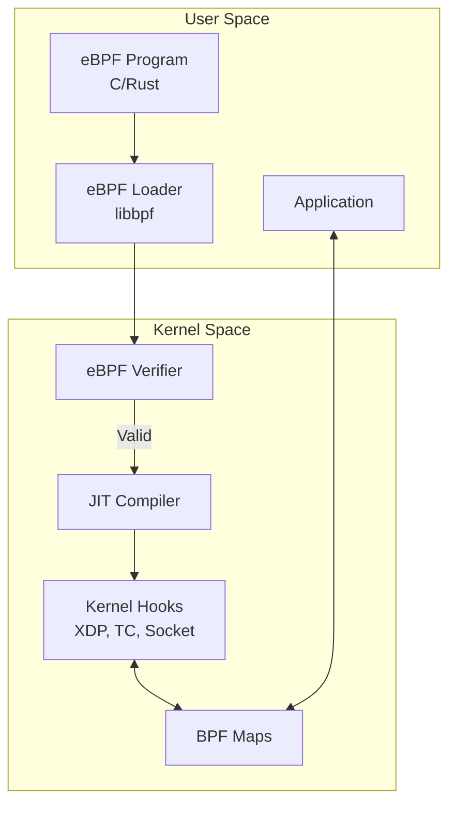
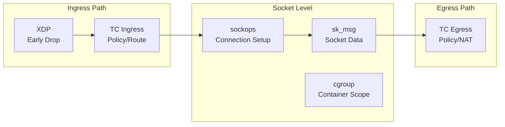
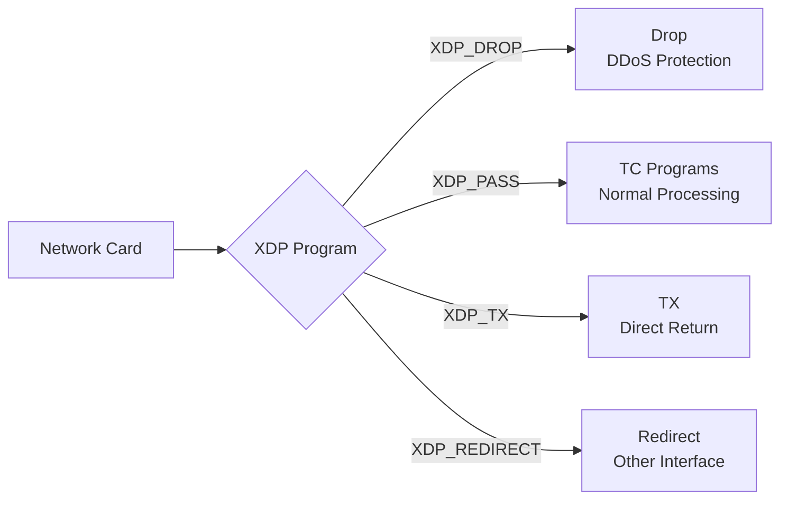
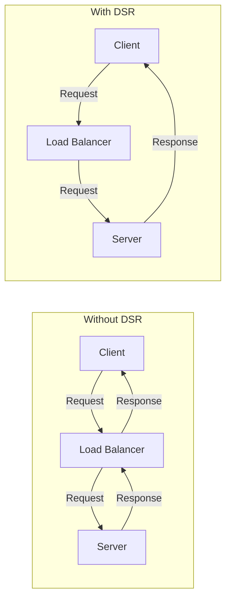
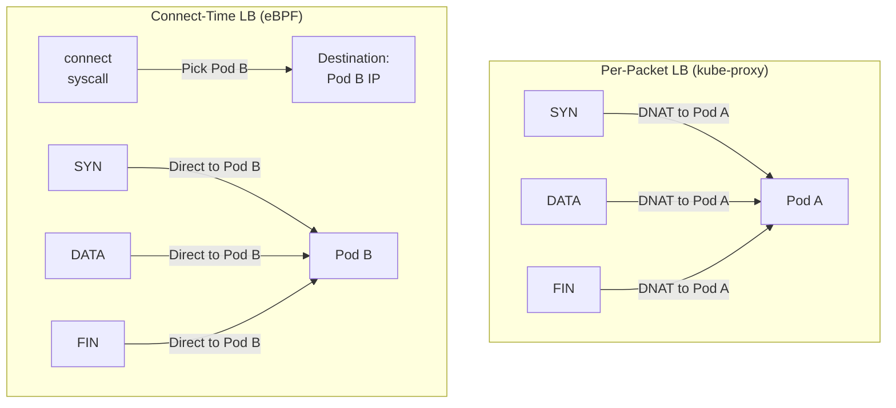
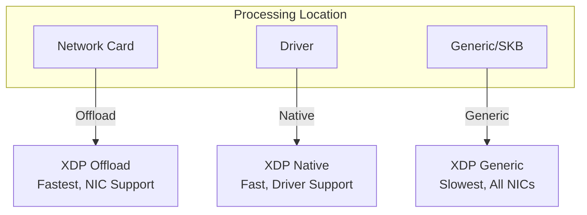

# Parte 6: Dataplane eBPF

> **Versiones compatibles**: Calico v3.29+ / Kubernetes 1.28+ **Última actualización**: February 23, 2026

## Introducción

El dataplane eBPF de Calico representa una evolución significativa en las redes de Kubernetes, ya que reemplaza el procesamiento tradicional de paquetes basado en iptables por programas eBPF modernos. Este enfoque ofrece mejoras sustanciales de rendimiento, menor latencia y capacidades de observabilidad mejoradas.

Este análisis en profundidad explora los fundamentos de eBPF desde una perspectiva de redes, la arquitectura eBPF de Calico, estrategias de migración y técnicas de optimización del rendimiento.

***

## Fundamentos de eBPF

### ¿Qué es eBPF?

eBPF (extended Berkeley Packet Filter) es una tecnología revolucionaria que permite ejecutar programas en un entorno aislado dentro del kernel de Linux sin modificar el código fuente del kernel ni cargar módulos del kernel.



### Conceptos clave de eBPF para redes

| Concepto      | Descripción                              | Uso en Calico                       |
| ------------ | ---------------------------------------- | ----------------------------------- |
| **Programas** | Bytecode ejecutado en hooks del kernel        | Filtrado de paquetes, enrutamiento           |
| **Maps**     | Almacenes de clave-valor compartidos entre programas | Tablas de rutas, reglas de políticas          |
| **Hooks**    | Puntos de conexión en el kernel              | XDP, TC, socket                     |
| **Helpers**  | Funciones del kernel invocables desde eBPF      | Manipulación de paquetes, operaciones de maps |
| **BTF**      | Información de tipos para maps/programas       | Información de depuración, CO-RE                   |

### eBPF frente a iptables

| Aspecto               | iptables                  | eBPF              |
| -------------------- | ------------------------- | ----------------- |
| **Arquitectura**     | Cadenas de reglas secuenciales    | Ejecución directa  |
| **Complejidad**       | Coincidencia de reglas O(n)        | Búsqueda en map O(1)   |
| **Cruces del kernel** | Múltiples por paquete       | Mínimos           |
| **Programabilidad**  | Tipos de reglas fijos          | Programas flexibles |
| **Observabilidad**    | Contadores limitados          | Métricas enriquecidas      |
| **Eficiencia de CPU**   | Mayor sobrecarga de interrupciones | Menor sobrecarga    |

***

## Arquitectura eBPF de Calico


### Comparación de arquitecturas

```mermaid
flowchart TB
    subgraph "iptables Dataplane"
        PKT1[Packet In] --> PREROUTE[PREROUTING]
        PREROUTE --> CONNTRACK1[Connection Track]
        CONNTRACK1 --> INPUT1[INPUT Chain]
        INPUT1 --> FILTER1[FILTER Chain]
        FILTER1 --> FORWARD1[FORWARD Chain]
        FORWARD1 --> OUTPUT1[OUTPUT Chain]
        OUTPUT1 --> POSTROUTE[POSTROUTING]
        POSTROUTE --> PKT1_OUT[Packet Out]
    end

    subgraph "eBPF Dataplane"
        PKT2[Packet In] --> TC_IN[TC Ingress]
        TC_IN --> BPF_PROG[eBPF Program]
        BPF_PROG --> BPF_MAP[BPF Maps<br/>Routes, Policies]
        BPF_MAP --> TC_OUT[TC Egress]
        TC_OUT --> PKT2_OUT[Packet Out]
    end
```



### Tipos de programas eBPF en Calico

Calico usa varios tipos de programas eBPF para distintas funciones:



### Programas TC (Traffic Control)

Los programas TC son el hook principal del dataplane para Calico:

```
Ingress TC Program Functions:
├── Policy enforcement (allow/deny)
├── Connection tracking lookup
├── Service load balancing (DNAT)
├── Tunnel decapsulation
└── Metrics collection

Egress TC Program Functions:
├── Policy enforcement (egress rules)
├── SNAT for masquerade
├── Tunnel encapsulation
└── DSR return path handling
```

### Programas XDP (eXpress Data Path)

XDP proporciona el hook más temprano para el procesamiento de paquetes:



### Programas de socket

eBPF en el nivel de socket para la integración con service mesh:

```yaml
# sockops: Intercept socket operations
- connect() -> Redirect to local sidecar
- accept() -> Apply connection policies
- close() -> Cleanup connection state

# sk_msg: Process socket data
- sendmsg() -> Apply L7 policy
- recvmsg() -> Inspect response
```

***

## Estructuras de BPF Map

### Tipos de Map usados por Calico

| Tipo de Map          | Propósito              | Ejemplo de uso         |
| ----------------- | -------------------- | ------------------- |
| **Hash Map**      | Búsqueda de clave-valor     | Seguimiento de conexiones |
| **LRU Hash**      | Caché con expulsión automática  | Tabla NAT           |
| **Array**         | Indexado de tamaño fijo   | Configuración de Endpoint     |
| **LPM Trie**      | Coincidencia de prefijo más largo | Búsqueda de rutas        |
| **Per-CPU Array** | Contadores escalables    | Estadísticas          |

### Estructura del Map de rutas

```c
// Simplified route map entry
struct calico_route_key {
    __be32 prefix;
    __u32 prefix_len;
};

struct calico_route_value {
    __u32 flags;          // LOCAL, REMOTE, HOST, etc.
    __be32 next_hop;      // Next hop IP
    __u32 ifindex;        // Interface index
    __u8 mac[6];          // Destination MAC
};
```

### Map de seguimiento de conexiones

```c
// Connection tracking key
struct calico_ct_key {
    __be32 src_ip;
    __be32 dst_ip;
    __be16 src_port;
    __be16 dst_port;
    __u8 protocol;
};

// Connection tracking value
struct calico_ct_value {
    __u64 created;        // Timestamp
    __u64 last_seen;      // Last packet
    __be32 orig_dst;      // Pre-DNAT destination
    __be16 orig_port;     // Pre-DNAT port
    __u32 flags;          // Connection state
};
```

### Estructura del Map de políticas

```c
// Policy rule entry
struct calico_policy_key {
    __u32 policy_id;
    __u32 rule_index;
};

struct calico_policy_value {
    __u32 action;         // ALLOW, DENY, PASS
    __u32 flags;
    __be32 src_net;
    __be32 src_mask;
    __be32 dst_net;
    __be32 dst_mask;
    __be16 port_start;
    __be16 port_end;
};
```

***

## Direct Server Return (DSR)

### Descripción general de DSR

DSR permite que el tráfico de respuesta omita el Load Balancer, lo que reduce la latencia y el consumo de recursos del Load Balancer.



### Modos de DSR en Calico

| Modo         | Descripción              | Caso de uso                  |
| ------------ | ------------------------ | ------------------------- |
| **Desactivado** | Todo el tráfico a través del LB   | Predeterminado, todos los entornos |
| **IPIP**     | Respuesta mediante túnel IPIP | Entre subredes              |
| **DSR**      | Respuesta directa          | Misma red L2           |

### Habilitar DSR

```yaml
apiVersion: projectcalico.org/v3
kind: FelixConfiguration
metadata:
  name: default
spec:
  bpfEnabled: true
  bpfExternalServiceMode: DSR
```

### Requisitos de DSR

* El servidor y el cliente deben estar en la misma red L2 O
* Usar encapsulación IPIP/VXLAN entre subredes
* La IP del cliente externo debe ser enrutable desde los servidores
* Sin SNAT en la ruta de ingreso

***

## Balanceo de carga en tiempo de conexión

### LB tradicional frente a LB en tiempo de conexión



### Beneficios del LB en tiempo de conexión

| Aspecto                  | Por paquete          | En tiempo de conexión          |
| ----------------------- | ------------------- | --------------------- |
| **Sobrecarga de NAT**        | Cada paquete        | Solo durante la configuración de la conexión |
| **Seguimiento de conexiones** | Requerido            | Mínimo               |
| **Latencia**             | Mayor (búsqueda NAT) | Menor (directa)        |
| **Uso de CPU**           | Mayor              | Menor                 |

### Cómo funciona el LB en tiempo de conexión

```c
// Simplified connect-time LB logic
int bpf_connect4(struct bpf_sock_addr *ctx) {
    // Check if destination is a Service IP
    struct lb_backend *backend = lookup_service(ctx->user_ip4, ctx->user_port);

    if (backend) {
        // Rewrite destination to backend pod
        ctx->user_ip4 = backend->pod_ip;
        ctx->user_port = backend->pod_port;
    }

    return 1; // Allow connection
}
```

***

## Aceleración XDP

### Niveles de procesamiento XDP



### Modos XDP

| Modo        | Ubicación      | Rendimiento | Requisitos   |
| ----------- | ------------- | ----------- | -------------- |
| **Offload** | Hardware NIC  | Más rápido     | SmartNIC       |
| **Native**  | Driver NIC    | Rápido        | Compatibilidad del driver |
| **Generic** | Stack de red | Base    | Cualquier NIC        |

### Habilitar XDP en Calico

```yaml
apiVersion: projectcalico.org/v3
kind: FelixConfiguration
metadata:
  name: default
spec:
  bpfEnabled: true

  # XDP mode: Disabled, Enabled, Offload
  xdpEnabled: Enabled

  # Interfaces for XDP
  # Uses same detection as BPF dataplane interface
```

### Casos de uso de XDP en Calico

1. **Protección DDoS**: Descartar tráfico malicioso en la NIC
2. **Aplicación de listas de bloqueo**: Rechazo temprano de IP bloqueadas
3. **Limitación de tasa**: Límites de tasa de paquetes antes del stack
4. **Recopilación de métricas**: Conteo de paquetes a velocidad de línea

***

## Requisitos del modo eBPF

### Requisitos del kernel

| Requisito      | Versión mínima | Notas                     |
| ---------------- | --------------- | ------------------------- |
| **Kernel Linux** | 5.3+            | Se recomienda 5.8+          |
| **Compatibilidad con BTF**  | Obligatoria        | `CONFIG_DEBUG_INFO_BTF=y` |
| **BPF Syscall**  | Obligatorio        | `CONFIG_BPF_SYSCALL=y`    |
| **BPF JIT**      | Obligatorio        | `CONFIG_BPF_JIT=y`        |

### Verificar compatibilidad del kernel

```bash
# Check kernel version
uname -r

# Check BTF support
ls /sys/kernel/btf/vmlinux

# Check BPF support
cat /boot/config-$(uname -r) | grep -E "CONFIG_BPF|CONFIG_DEBUG_INFO_BTF"

# Required output:
# CONFIG_BPF=y
# CONFIG_BPF_SYSCALL=y
# CONFIG_BPF_JIT=y
# CONFIG_DEBUG_INFO_BTF=y
```

### Compatibilidad de distribuciones

| Distribución      | Lista para eBPF | Notas                        |
| ----------------- | ---------- | ---------------------------- |
| Ubuntu 20.04+     | Sí        | Kernel 5.4+                  |
| Ubuntu 22.04+     | Sí        | Kernel 5.15+ (recomendado)   |
| RHEL/CentOS 8.2+  | Sí        | Kernel 4.18+ con backports  |
| Amazon Linux 2    | Parcial    | Puede necesitar actualización del kernel      |
| Amazon Linux 2023 | Sí        | Kernel 6.1+                  |
| Bottlerocket      | Sí        | Diseñado específicamente para contenedores |

### Requisitos de versión de Calico

```yaml
# Minimum Calico versions for eBPF features
eBPF dataplane basic:     v3.13.0
Connect-time LB:          v3.16.0
XDP acceleration:         v3.18.0
Dual-stack eBPF:         v3.20.0
Host-networked pods:      v3.13.0 (with limitations)
```

### Configuración de nodos

```yaml
apiVersion: projectcalico.org/v3
kind: FelixConfiguration
metadata:
  name: default
spec:
  # Enable eBPF dataplane
  bpfEnabled: true

  # Data interface detection
  # Auto-detect: first interface with default route
  # Or specify pattern: "eth*"
  bpfDataIfacePattern: "^((en|eth|wl)[opsx].*|(eth|wlan|eno)[0-9].*)"

  # External service mode: Tunnel or DSR
  bpfExternalServiceMode: Tunnel

  # Log level for BPF programs
  bpfLogLevel: Info

  # Kube-proxy replacement
  bpfKubeProxyIptablesCleanupEnabled: true

  # Connection tracking
  bpfConnectTimeLoadBalancingEnabled: true
```

***

## Migración de iptables a eBPF

### Lista de comprobación previa a la migración

```bash
# 1. Verify kernel requirements
uname -r  # Should be 5.3+
ls /sys/kernel/btf/vmlinux  # BTF must exist

# 2. Check Calico version
kubectl get deployment -n kube-system calico-kube-controllers -o jsonpath='{.spec.template.spec.containers[0].image}'
# Should be v3.13.0+

# 3. Verify CNI plugin
kubectl get ds -n kube-system calico-node -o jsonpath='{.spec.template.spec.containers[0].env}' | grep -i cni

# 4. Check existing networking mode
calicoctl get felixconfiguration default -o yaml | grep -i bpf

# 5. Verify no conflicting CNI
ls /etc/cni/net.d/
```

### Pasos de migración

**Paso 1: Actualizar FelixConfiguration (dry-run)**

```yaml
# Save current configuration
kubectl get felixconfiguration default -o yaml > felix-backup.yaml

# Create eBPF configuration
apiVersion: projectcalico.org/v3
kind: FelixConfiguration
metadata:
  name: default
spec:
  bpfEnabled: false  # Not enabled yet
  bpfLogLevel: Debug  # For troubleshooting
  bpfDataIfacePattern: "^((en|eth|wl)[opsx].*|(eth|wlan|eno)[0-9].*)"
  bpfExternalServiceMode: Tunnel
  bpfKubeProxyIptablesCleanupEnabled: false  # Don't cleanup yet
```

**Paso 2: Deshabilitar kube-proxy (si se usa Calico como reemplazo)**

```bash
# Option A: Scale down kube-proxy
kubectl -n kube-system patch daemonset kube-proxy -p '{"spec":{"template":{"spec":{"nodeSelector":{"non-calico":"true"}}}}}'

# Option B: Add calico node selector to skip kube-proxy nodes
# Only if running both temporarily
```

**Paso 3: Habilitar eBPF en el nodo de prueba**

```bash
# Label test node
kubectl label node test-node-1 calico-ebpf=enabled

# Apply node-specific config
calicoctl apply -f - <<EOF
apiVersion: projectcalico.org/v3
kind: FelixConfiguration
metadata:
  name: node.test-node-1
spec:
  bpfEnabled: true
EOF
```

**Paso 4: Validar el nodo de prueba**

```bash
# Check BPF programs loaded
kubectl exec -n kube-system calico-node-xxxxx -c calico-node -- \
  bpftool prog list

# Verify connectivity
kubectl run test-pod --image=busybox --restart=Never --overrides='{"spec":{"nodeName":"test-node-1"}}' -- sleep 3600
kubectl exec test-pod -- wget -O- http://kubernetes.default.svc

# Check logs
kubectl logs -n kube-system -l k8s-app=calico-node -c calico-node | grep -i bpf
```

**Paso 5: Implementar en todos los nodos**

```yaml
apiVersion: projectcalico.org/v3
kind: FelixConfiguration
metadata:
  name: default
spec:
  bpfEnabled: true
  bpfLogLevel: Info
  bpfDataIfacePattern: "^((en|eth|wl)[opsx].*|(eth|wlan|eno)[0-9].*)"
  bpfExternalServiceMode: Tunnel
  bpfKubeProxyIptablesCleanupEnabled: true
  bpfConnectTimeLoadBalancingEnabled: true
```

**Paso 6: Limpiar reglas de iptables**

```bash
# After confirming eBPF is working
calicoctl patch felixconfiguration default -p '{"spec":{"bpfKubeProxyIptablesCleanupEnabled":true}}'

# Verify iptables rules are minimal
iptables -L -n | wc -l  # Should be significantly reduced
```

### Procedimiento de reversión

```bash
# Disable eBPF
calicoctl patch felixconfiguration default -p '{"spec":{"bpfEnabled":false}}'

# Restore kube-proxy if disabled
kubectl -n kube-system patch daemonset kube-proxy -p '{"spec":{"template":{"spec":{"nodeSelector":null}}}}'

# Wait for calico-node restart
kubectl rollout status ds/calico-node -n kube-system

# Verify iptables rules restored
iptables -L -n -v
```

***

## Benchmarks de rendimiento

### Comparación de latencia

| Escenario                | iptables | eBPF  | Mejora |
| ----------------------- | -------- | ----- | ----------- |
| Pod a Pod (mismo nodo)  | 45 μs    | 25 μs | 44%         |
| Pod a Pod (entre nodos) | 120 μs   | 80 μs | 33%         |
| Service (ClusterIP)     | 150 μs   | 60 μs | 60%         |
| Service (NodePort)      | 180 μs   | 70 μs | 61%         |

### Comparación de rendimiento

| Escenario            | iptables | eBPF    | Mejora |
| ------------------- | -------- | ------- | ----------- |
| Flujo único TCP   | 15 Gbps  | 23 Gbps | 53%         |
| Varios flujos TCP    | 35 Gbps  | 48 Gbps | 37%         |
| Flujo único UDP   | 8 Gbps   | 18 Gbps | 125%        |
| Paquetes pequeños (64B) | 2M pps   | 5M pps  | 150%        |

### Eficiencia de CPU

```
Connection rate test (connections/sec):

iptables dataplane:
├── 1000 rules: 50,000 conn/s
├── 5000 rules: 35,000 conn/s
└── 10000 rules: 20,000 conn/s

eBPF dataplane:
├── 1000 rules: 120,000 conn/s
├── 5000 rules: 115,000 conn/s
└── 10000 rules: 110,000 conn/s

Note: eBPF performance remains nearly constant regardless of rule count
```

### Ejecutar tus propios benchmarks

```bash
# Install netperf
apt-get install netperf

# Pod-to-Pod latency (TCP_RR)
kubectl exec client-pod -- netperf -H server-pod-ip -t TCP_RR -l 30

# Throughput (TCP_STREAM)
kubectl exec client-pod -- netperf -H server-pod-ip -t TCP_STREAM -l 30

# Service latency
kubectl exec client-pod -- netperf -H service-cluster-ip -t TCP_RR -l 30

# Compare with iperf3
kubectl exec client-pod -- iperf3 -c server-pod-ip -t 30
```

***

## Depuración de eBPF

### Comandos de bpftool

```bash
# List loaded BPF programs
bpftool prog list

# Show program details
bpftool prog show id 123

# Dump program instructions
bpftool prog dump xlated id 123

# List BPF maps
bpftool map list

# Dump map contents
bpftool map dump id 456

# Show map entries
bpftool map lookup id 456 key 0x0a 0x00 0x01 0x0a
```

### Inspección de filtros TC

```bash
# Show TC filters on interface
tc filter show dev eth0 ingress
tc filter show dev eth0 egress

# Show BPF program attached to TC
tc filter show dev eth0 ingress | grep bpf

# Detailed filter info
tc -s filter show dev eth0 ingress
```

### Depuración de Calico BPF

```bash
# Enable debug logging
calicoctl patch felixconfiguration default -p '{"spec":{"bpfLogLevel":"Debug"}}'

# View BPF debug logs
kubectl logs -n kube-system -l k8s-app=calico-node -c calico-node | grep -i "bpf\|ebpf"

# Check BPF map contents via calico-node
kubectl exec -n kube-system calico-node-xxxxx -c calico-node -- \
  calico-bpf conntrack dump

# Show routes in BPF map
kubectl exec -n kube-system calico-node-xxxxx -c calico-node -- \
  calico-bpf routes dump

# Show NAT entries
kubectl exec -n kube-system calico-node-xxxxx -c calico-node -- \
  calico-bpf nat dump
```

### Escenarios comunes de depuración

**Problemas de conectividad:**

```bash
# Check if BPF programs are loaded
bpftool prog list | grep calico

# Verify route is in BPF map
kubectl exec -n kube-system calico-node-xxxxx -c calico-node -- \
  calico-bpf routes dump | grep "10.244.1.5"

# Check conntrack entries
kubectl exec -n kube-system calico-node-xxxxx -c calico-node -- \
  calico-bpf conntrack dump | grep "10.244.1.5"

# Verify policy is allowing traffic
kubectl exec -n kube-system calico-node-xxxxx -c calico-node -- \
  calico-bpf policy dump
```

**Problemas de balanceo de carga de Service:**

```bash
# Check service backends in NAT map
kubectl exec -n kube-system calico-node-xxxxx -c calico-node -- \
  calico-bpf nat dump | grep "10.96.0.1"

# Verify frontend entry exists
kubectl exec -n kube-system calico-node-xxxxx -c calico-node -- \
  calico-bpf nat frontend list
```

***

## Limitaciones y problemas conocidos

### Limitaciones actuales

| Limitación              | Descripción            | Solución alternativa                      |
| ----------------------- | ---------------------- | ------------------------------- |
| **Pods en red del host** | Compatibilidad de políticas limitada | Usar iptables para Pods del host      |
| **IPv6**                | Compatibilidad parcial        | Usar modo dual-stack             |
| **Wireguard**           | No con eBPF          | Usar IPsec o deshabilitar el cifrado |
| **Topología de Service**    | Compatibilidad limitada        | Usar kube-proxy estándar         |
| **Nodos Windows**       | No compatible          | Usar dataplane iptables          |

### Problemas conocidos

```yaml
# Issue: BPF program fails to load
# Cause: Kernel too old or BTF missing
# Solution: Upgrade kernel or enable BTF

# Issue: Services not accessible
# Cause: kube-proxy and Calico BPF conflict
# Solution: Fully disable kube-proxy

# Issue: NodePort not working
# Cause: DSR mode with non-routable client IPs
# Solution: Use Tunnel mode instead of DSR

# Issue: High memory usage
# Cause: Large conntrack table
# Solution: Tune conntrack limits
```

### Comprobación de problemas

```bash
# Check for BPF verifier errors
dmesg | grep -i "bpf\|verifier"

# Check Felix logs for BPF errors
kubectl logs -n kube-system -l k8s-app=calico-node -c calico-node | grep -i error

# Verify BPF map limits
cat /proc/sys/kernel/bpf_map_max_entries
```

***

## Reemplazo de Kube-proxy

### Reemplazo completo de Kube-proxy

eBPF de Calico puede reemplazar por completo kube-proxy para el balanceo de carga de Service:

```yaml
apiVersion: projectcalico.org/v3
kind: FelixConfiguration
metadata:
  name: default
spec:
  bpfEnabled: true
  bpfKubeProxyIptablesCleanupEnabled: true
  bpfKubeProxyMinSyncPeriod: 1s

  # Disable kube-proxy IPVS/iptables cleanup
  # (Calico will manage service rules)
```

### Deshabilitar kube-proxy

```bash
# Method 1: Scale to zero
kubectl -n kube-system scale deployment kube-proxy --replicas=0

# Method 2: Delete DaemonSet
kubectl -n kube-system delete ds kube-proxy

# Method 3: Prevent scheduling (reversible)
kubectl -n kube-system patch ds kube-proxy -p '{"spec":{"template":{"spec":{"nodeSelector":{"non-calico":"true"}}}}}'
```

### Verificar el reemplazo

```bash
# Check no kube-proxy rules in iptables
iptables -t nat -L KUBE-SERVICES 2>/dev/null | wc -l
# Should be 0 or minimal

# Verify Calico is handling services
kubectl exec -n kube-system calico-node-xxxxx -c calico-node -- \
  calico-bpf nat frontend list

# Test service connectivity
kubectl run test --image=busybox --rm -it -- wget -O- http://kubernetes.default.svc
```

### Comparación de características de Service

| Característica         | kube-proxy (iptables) | kube-proxy (IPVS) | Calico eBPF |
| --------------- | --------------------- | ----------------- | ----------- |
| ClusterIP       | Sí                   | Sí               | Sí         |
| NodePort        | Sí                   | Sí               | Sí         |
| LoadBalancer    | Sí                   | Sí               | Sí         |
| ExternalIPs     | Sí                   | Sí               | Sí         |
| SessionAffinity | Sí                   | Sí               | Sí         |
| Topology        | Sí                   | Sí               | Limitado     |
| ProxyMode       | iptables              | IPVS              | eBPF        |

***

## Mejores prácticas

### Recomendaciones de implementación

1. **Verifica los requisitos del kernel** antes de habilitar eBPF
2. **Prueba primero en un cluster que no sea de producción**
3. **Habilita de forma incremental** mediante selectores de nodo
4. **Supervisa el rendimiento** durante el rollout
5. **Mantén listo un plan de reversión**

### Mejores prácticas de configuración

```yaml
apiVersion: projectcalico.org/v3
kind: FelixConfiguration
metadata:
  name: default
spec:
  # Production settings
  bpfEnabled: true
  bpfLogLevel: Warn  # Reduce logging in production

  # Interface detection
  bpfDataIfacePattern: "^((en|eth)[0-9]+)"

  # Service mode based on topology
  bpfExternalServiceMode: Tunnel  # Safe default

  # Connection tracking
  bpfConnectTimeLoadBalancingEnabled: true

  # Cleanup legacy rules
  bpfKubeProxyIptablesCleanupEnabled: true
```

### Supervisar el dataplane eBPF

```yaml
# Prometheus metrics to monitor
calico_bpf_num_maps                    # Number of BPF maps
calico_bpf_map_size_bytes              # Size of each map
calico_bpf_conntrack_entries           # Active connections
calico_bpf_nat_frontend_entries        # Service frontends
calico_bpf_nat_backend_entries         # Service backends
felix_bpf_dataplane_apply_time_seconds # Dataplane sync time
```

***

## Resumen

El dataplane eBPF de Calico representa un avance significativo en las redes de Kubernetes:

| Beneficio           | Impacto                      |
| ----------------- | --------------------------- |
| **Rendimiento**   | Hasta un 60% de reducción de latencia |
| **Escalabilidad**   | Búsqueda de reglas O(1) frente a O(n)    |
| **Eficiencia**    | Menor uso de CPU             |
| **Observabilidad** | Métricas enriquecidas basadas en BPF      |
| **Simplicidad**    | Reemplaza kube-proxy         |

### Cuándo usar el dataplane eBPF

* Cargas de trabajo de alto rendimiento
* Aplicaciones sensibles a la latencia
* Clusters grandes con muchos servicios
* Entornos que requieren observabilidad detallada
* Kernel Linux 5.3+ disponible

### Cuándo seguir usando iptables

* Se requiere compatibilidad con nodos Windows
* Versiones antiguas del kernel
* Se necesita cifrado Wireguard
* Requisitos de topología de Service complejos
* Entornos con aversión al riesgo que requieren tecnología probada

***

## Referencias

* [Documentación de eBPF de Calico](https://docs.tigera.io/calico/latest/operations/ebpf/)
* [Documentación de eBPF de Linux](https://ebpf.io/what-is-ebpf/)
* [Guía de referencia de BPF y XDP](https://docs.cilium.io/en/stable/bpf/)
* [Guía de migración a eBPF de Calico](https://docs.tigera.io/calico/latest/operations/ebpf/enabling-ebpf)
* [Manual de bpftool](https://man7.org/linux/man-pages/man8/bpftool.8.html)
