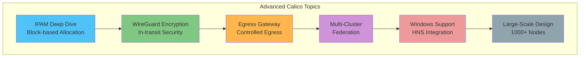
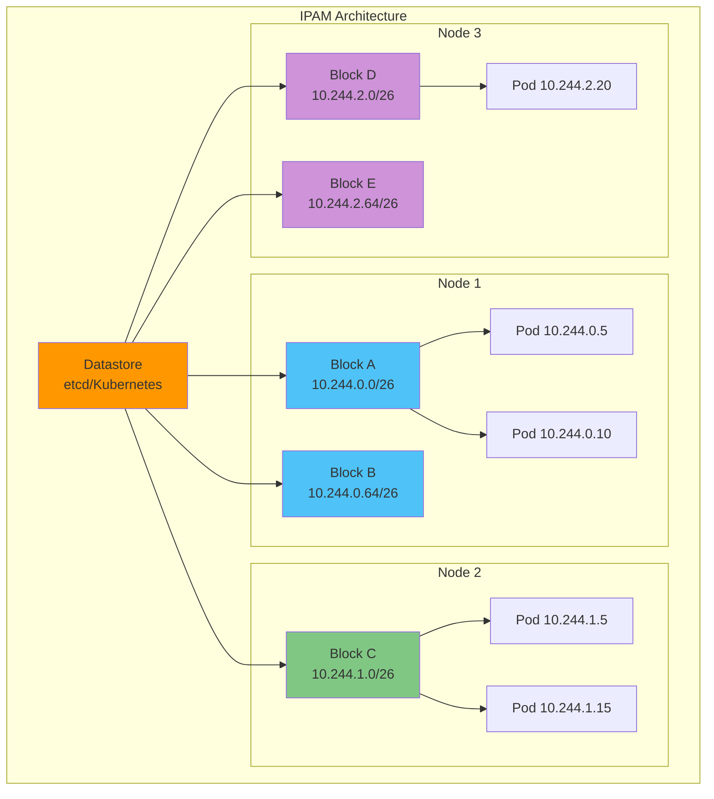
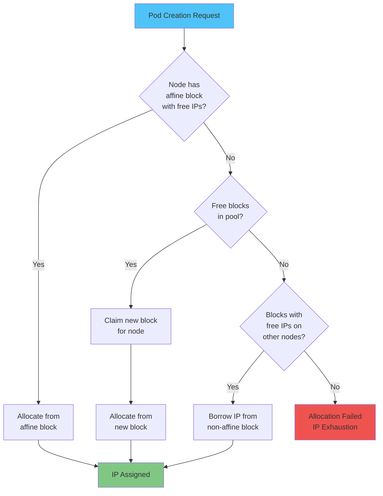
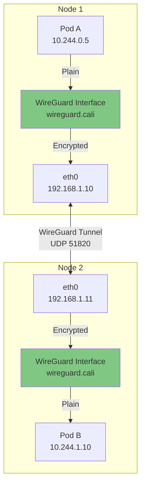
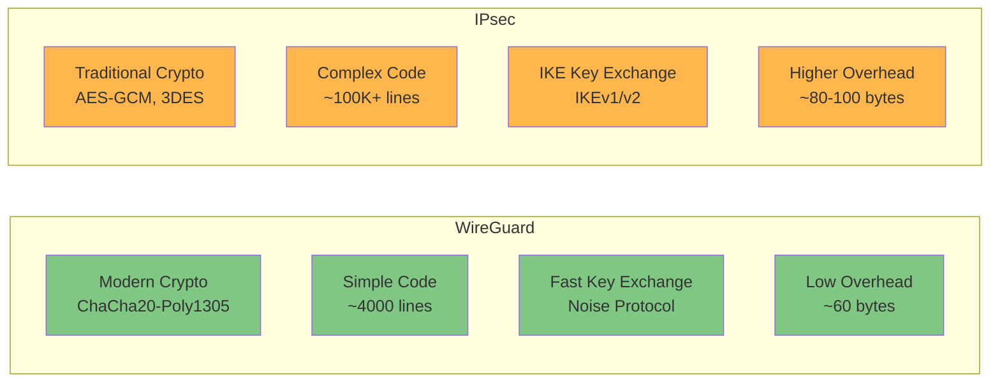
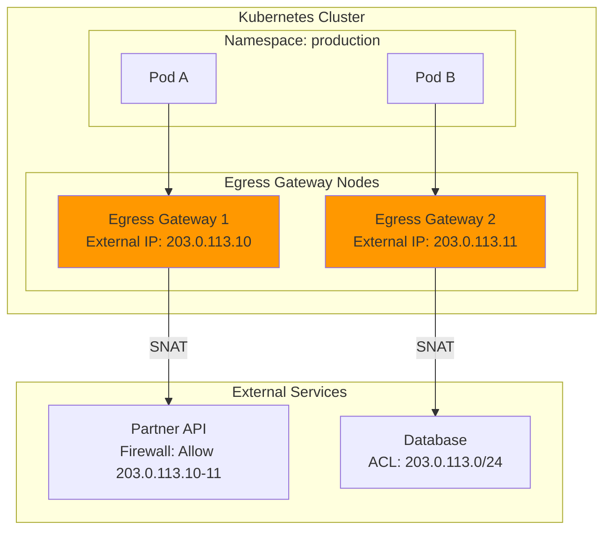
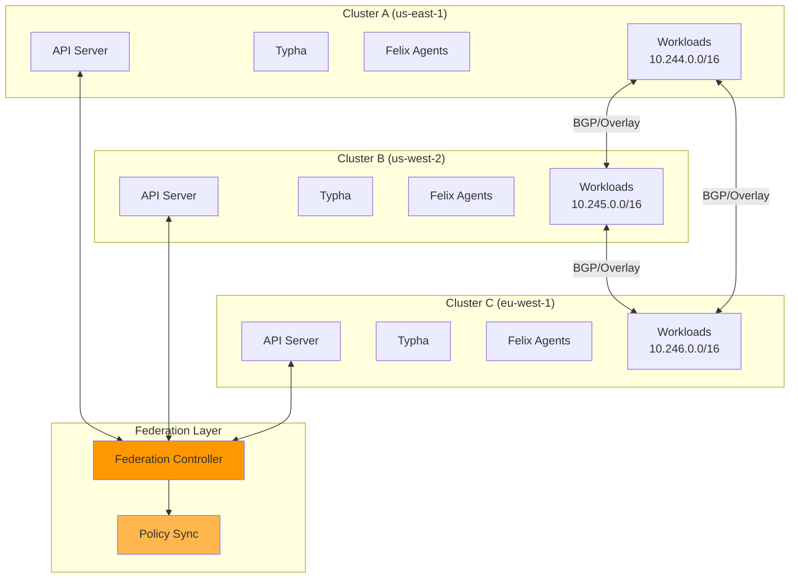
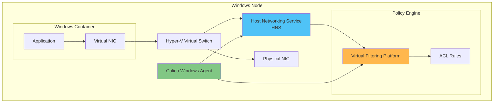
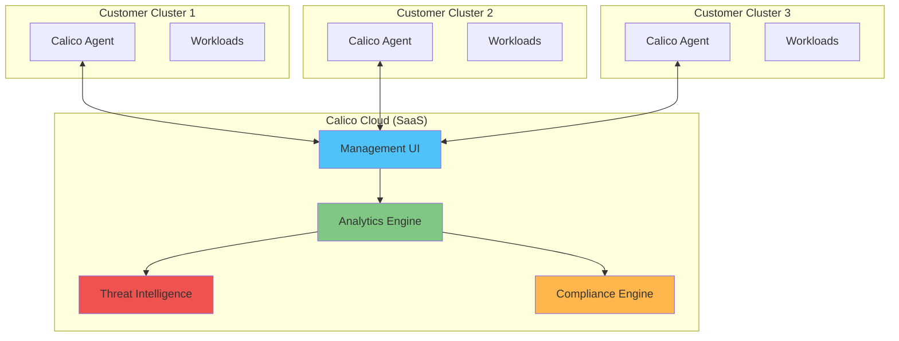
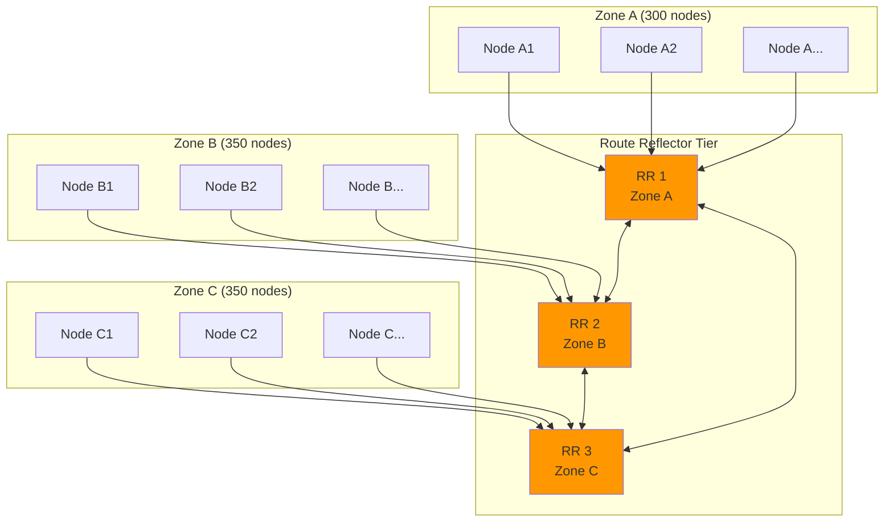

# Parte 7: Temas avanzados de Calico

> **Versiones compatibles**: Calico v3.29+ / Kubernetes 1.28+
> **Última actualización**: February 23, 2026

## Descripción general

Este capítulo cubre temas avanzados de Calico para entornos de producción, incluidos un análisis detallado de IPAM, el cifrado WireGuard, Egress Gateway, la federación multiclúster, la compatibilidad con contenedores Windows y patrones de diseño para clústeres a gran escala.



## Análisis detallado de IPAM

El sistema de gestión de direcciones IP (IPAM) de Calico está diseñado para ofrecer alto rendimiento y escalabilidad. Comprender su arquitectura es crucial para optimizar implementaciones grandes.

### Arquitectura de IPAM basada en bloques

Calico utiliza un sistema IPAM basado en bloques, en el que las direcciones IP se asignan a los nodos en bloques (el valor predeterminado /26 = 64 IP). Este enfoque minimiza las interacciones con el almacén de datos y mejora la velocidad de asignación.



### Afinidad de bloques IP

La afinidad de bloques garantiza que los bloques IP se asignen preferentemente a nodos específicos, lo que mejora la eficiencia del enrutamiento y reduce el tamaño de la tabla de rutas.

```yaml
# View block affinities
# calicoctl get blockaffinity -o yaml

apiVersion: projectcalico.org/v3
kind: BlockAffinity
metadata:
  name: node1-10-244-0-0-26
spec:
  cidr: 10.244.0.0/26
  node: node1
  state: confirmed
  # States: pending, confirmed, pendingDeletion
---
apiVersion: projectcalico.org/v3
kind: BlockAffinity
metadata:
  name: node1-10-244-0-64-26
spec:
  cidr: 10.244.0.64/26
  node: node1
  state: confirmed
```

### Algoritmo de asignación

La asignación de IPAM sigue este proceso:



### Configuración del tamaño de bloque

El tamaño de bloque predeterminado es /26 (64 IP). Ajústelo según las características de su clúster:

```yaml
# IPPool with custom block size
apiVersion: projectcalico.org/v3
kind: IPPool
metadata:
  name: default-ipv4-ippool
spec:
  cidr: 10.244.0.0/16
  blockSize: 26  # Default: /26 (64 IPs per block)
  # Options:
  # /24 = 256 IPs (large pods per node)
  # /26 = 64 IPs (default, balanced)
  # /28 = 16 IPs (many nodes, few pods each)
  # /29 = 8 IPs (minimum recommended)
  # /30 = 4 IPs (not recommended)
  ipipMode: CrossSubnet
  vxlanMode: Never
  natOutgoing: true
  nodeSelector: all()
```

**Directrices para seleccionar el tamaño de bloque:**

| Tamaño de bloque | IP por bloque | Escenario recomendado |
|------------|---------------|---------------------|
| /24 | 256 | Alta densidad de Pods (50+ Pods/nodo) |
| /25 | 128 | Densidad media-alta |
| /26 | 64 | Predeterminado, equilibrado |
| /27 | 32 | Muchos nodos, cantidad moderada de Pods |
| /28 | 16 | Clúster grande, baja densidad |
| /29 | 8 | Clúster muy grande, mínima cantidad de Pods |

### IPAM local al host

Para implementaciones más sencillas o casos de uso específicos, Calico admite el modo IPAM local al host:

```yaml
# Installation with host-local IPAM
apiVersion: operator.tigera.io/v1
kind: Installation
metadata:
  name: default
spec:
  calicoNetwork:
    ipPools:
      - cidr: 10.244.0.0/16
        encapsulation: VXLANCrossSubnet
        natOutgoing: Enabled
    # Use host-local IPAM instead of Calico IPAM
    hostLocalIPAMEnabled: true
```

**IPAM de Calico frente a IPAM local al host:**

| Característica | IPAM de Calico | IPAM local al host |
|---------|-------------|-----------------|
| Reutilización de IP | En todo el clúster | Local al nodo |
| Gestión de bloques | Dinámica | Estática |
| Agregación de rutas | Sí | Limitada |
| Liberación de IP | Inmediata | Retrasada |
| Complejidad | Mayor | Menor |
| Escalabilidad | Mejor | Limitada |

### Estrategia de varios pools

Configure varios pools de IP para distintos tipos de cargas de trabajo:

```yaml
# Production workloads pool
apiVersion: projectcalico.org/v3
kind: IPPool
metadata:
  name: production-pool
spec:
  cidr: 10.244.0.0/18
  blockSize: 26
  ipipMode: CrossSubnet
  natOutgoing: true
  nodeSelector: "node-type == 'production'"
---
# Development workloads pool
apiVersion: projectcalico.org/v3
kind: IPPool
metadata:
  name: development-pool
spec:
  cidr: 10.244.64.0/18
  blockSize: 28  # Smaller blocks for dev
  ipipMode: CrossSubnet
  natOutgoing: true
  nodeSelector: "node-type == 'development'"
---
# High-performance pool (no encapsulation)
apiVersion: projectcalico.org/v3
kind: IPPool
metadata:
  name: highperf-pool
spec:
  cidr: 10.244.128.0/18
  blockSize: 26
  ipipMode: Never
  vxlanMode: Never
  natOutgoing: false
  nodeSelector: "network == 'direct'"
```

**Asignación de Pods a pools específicos:**

```yaml
# Pod annotation to select IP pool
apiVersion: v1
kind: Pod
metadata:
  name: production-app
  annotations:
    cni.projectcalico.org/ipv4pools: '["production-pool"]'
spec:
  containers:
    - name: app
      image: nginx
---
# Namespace-level pool assignment
apiVersion: v1
kind: Namespace
metadata:
  name: production
  annotations:
    cni.projectcalico.org/ipv4pools: '["production-pool"]'
```

### Configuración de IPv6 y doble pila

Calico admite implementaciones solo IPv6 y de doble pila:

```yaml
# Dual-stack IPPool configuration
apiVersion: projectcalico.org/v3
kind: IPPool
metadata:
  name: default-ipv4-pool
spec:
  cidr: 10.244.0.0/16
  blockSize: 26
  ipipMode: CrossSubnet
  natOutgoing: true
  nodeSelector: all()
---
apiVersion: projectcalico.org/v3
kind: IPPool
metadata:
  name: default-ipv6-pool
spec:
  cidr: fd00:10:244::/48
  blockSize: 122  # /122 = 64 IPv6 addresses
  ipipMode: Never  # IPIP not supported for IPv6
  vxlanMode: CrossSubnet
  natOutgoing: true
  nodeSelector: all()
```

```yaml
# FelixConfiguration for dual-stack
apiVersion: projectcalico.org/v3
kind: FelixConfiguration
metadata:
  name: default
spec:
  ipv6Support: true
  # IPv6 auto-detection
  ipAutoDetectionMethod: "kubernetes-internal-ip"
  ip6AutoDetectionMethod: "kubernetes-internal-ip"
```

### Estrategias ante el agotamiento de IP

Cuando las direcciones IP escaseen, implemente estas estrategias:

```yaml
# 1. Enable strict block affinity release
apiVersion: projectcalico.org/v3
kind: FelixConfiguration
metadata:
  name: default
spec:
  # Release unused blocks faster
  ipamAutoGC: true
  # Garbage collection interval
  # ipamAutoGCInterval: "5m"
---
# 2. Configure node-specific IP limits
apiVersion: projectcalico.org/v3
kind: IPPool
metadata:
  name: limited-pool
spec:
  cidr: 10.244.0.0/16
  blockSize: 26
  # Limit blocks per node
  allowedUses:
    - Workload
  # Disable tunnel addresses from this pool
  disableBGPExport: false
```

```bash
# Monitor IP usage
calicoctl ipam show

# Show detailed block allocation
calicoctl ipam show --show-blocks

# Check for leaked IPs
calicoctl ipam check

# Release orphaned IPs
calicoctl ipam release --ip=10.244.1.5

# Show IP usage per node
calicoctl ipam show --show-blocks | grep -E "Node|Block"
```

## Consulta de PodCIDR por nodo mediante BlockAffinity

En el IPAM basado en bloques de Calico, el bloque CIDR asignado a cada nodo se rastrea mediante los **CR de BlockAffinity**. Estos CR se usan para identificar los CIDR de Pods por nodo para la configuración de rutas estáticas o la depuración de IPAM.

> **⚠ Nota sobre EKS Hybrid Nodes**: Calico **ya no cuenta con soporte oficial** en EKS Hybrid Nodes. Use [Cilium](../cilium/04-ipam-policy.md) para implementaciones nuevas. La información siguiente se proporciona como referencia para entornos de Calico existentes.

### Consulta de CR de BlockAffinity

```bash
# Query IPAM blocks using calicoctl
calicoctl ipam show --show-blocks

# Check per-node CIDRs via BlockAffinity CRs
kubectl get blockaffinities

# Table format query
kubectl get blockaffinities -o custom-columns='\
NAME:.metadata.name,\
CIDR:.spec.cidr,\
NODE:.spec.node'
```

Salida de ejemplo:

```
NAME                                    CIDR               NODE
hybrid-node-001-10-85-0-0-25            10.85.0.0/25       hybrid-node-001
hybrid-node-002-10-85-0-128-25          10.85.0.128/25     hybrid-node-002
hybrid-node-003-10-85-1-0-25            10.85.1.0/25       hybrid-node-003
```

### Comprobación del IPPool general

```bash
kubectl get ippools -o custom-columns='\
NAME:.metadata.name,\
CIDR:.spec.cidr,\
BLOCK_SIZE:.spec.blockSize'
```

### Generación automática de rutas estáticas

Ejemplo de generación de comandos de rutas estáticas a partir de BlockAffinity:

```bash
# Generate ip route commands from BlockAffinity
kubectl get blockaffinities -o json | jq -r \
  '.items[] | "ip route add \(.spec.cidr) via <NODE_IP_FOR_\(.spec.node)>"'
```

> **Caso de uso**: Esta información se utiliza para configurar rutas estáticas sin BGP en entornos de EKS Hybrid Nodes. Para obtener más detalles, consulte [EKS Hybrid Nodes - Network Configuration](../../eks-hybrid-nodes/02-network-configuration.md).

## Cifrado WireGuard

WireGuard proporciona cifrado eficiente para el tráfico de Pod a Pod entre nodos.

### Arquitectura de WireGuard



### Configuración

```yaml
# Enable WireGuard encryption
apiVersion: projectcalico.org/v3
kind: FelixConfiguration
metadata:
  name: default
spec:
  # Enable WireGuard for IPv4
  wireguardEnabled: true

  # Enable WireGuard for IPv6 (if using dual-stack)
  wireguardEnabledV6: true

  # WireGuard interface MTU (default: auto)
  wireguardMTU: 1440

  # WireGuard listen port
  wireguardListeningPort: 51820

  # Keep-alive interval for NAT traversal
  wireguardPersistentKeepAlive: "25s"

  # Host encryption (encrypt host-networked pod traffic)
  wireguardHostEncryptionEnabled: true
```

```yaml
# Operator-based installation with WireGuard
apiVersion: operator.tigera.io/v1
kind: Installation
metadata:
  name: default
spec:
  calicoNetwork:
    ipPools:
      - cidr: 10.244.0.0/16
        encapsulation: WireguardCrossSubnet
        natOutgoing: Enabled
```

### Verificar el estado de WireGuard

```bash
# Check WireGuard status on nodes
kubectl exec -n calico-system -it $(kubectl get pods -n calico-system -l k8s-app=calico-node -o name | head -1) -- wg show

# Sample output:
# interface: wireguard.cali
#   public key: ABC123...
#   private key: (hidden)
#   listening port: 51820
#
# peer: DEF456...
#   endpoint: 192.168.1.11:51820
#   allowed ips: 10.244.1.0/26
#   latest handshake: 5 seconds ago
#   transfer: 1.5 MiB received, 2.3 MiB sent

# Check Felix WireGuard statistics
calicoctl node status

# View WireGuard public keys
kubectl get nodes -o jsonpath='{range .items[*]}{.metadata.name}: {.metadata.annotations.projectcalico\.org/WireguardPublicKey}{"\n"}{end}'
```

### Impacto en el rendimiento

| Métrica | Sin cifrado | WireGuard | IPsec (AES-GCM) |
|--------|-------------------|-----------|-----------------|
| Rendimiento | Referencia | -5 a -10% | -15 a -25% |
| Latencia | Referencia | +0.1-0.3ms | +0.5-1.0ms |
| Uso de CPU | Referencia | +10-15% | +30-50% |
| Complejidad de configuración | N/A | Baja | Media |
| Gestión de claves | N/A | Automática | Manual/IKE |

### Comparación de WireGuard e IPsec



| Característica | WireGuard | IPsec |
|---------|-----------|-------|
| Criptografía | ChaCha20-Poly1305, Curve25519 | AES-GCM, SHA-256, DH |
| Complejidad del código | ~4,000 líneas | 100,000+ líneas |
| Superficie de ataque | Mínima | Amplia |
| Rotación de claves | Automática | Manual o IKE |
| Traversal de NAT | Integrado | Requiere NAT-T |
| Roaming | Fluido | Restablecimiento de sesión |
| Compatibilidad con kernel | 5.6+ (mainline) | Todas las versiones |
| Descarga de hardware | Limitada | Ampliamente compatible |

## Egress Gateway

Egress Gateway proporciona salida controlada y predecible para Pods que requieren IP de origen específicas.

### Arquitectura



### Configuración

```yaml
# 1. Label egress gateway nodes
# kubectl label node egress-node-1 egress-gateway=true
# kubectl label node egress-node-2 egress-gateway=true

# 2. Create Egress Gateway IP Pool
apiVersion: projectcalico.org/v3
kind: IPPool
metadata:
  name: egress-gateway-pool
spec:
  cidr: 203.0.113.0/28
  blockSize: 32
  nodeSelector: "!all()"  # Don't auto-assign
  allowedUses:
    - Workload
  natOutgoing: false
---
# 3. Create Egress Gateway deployment
apiVersion: apps/v1
kind: Deployment
metadata:
  name: egress-gateway
  namespace: calico-system
spec:
  replicas: 2
  selector:
    matchLabels:
      app: egress-gateway
  template:
    metadata:
      labels:
        app: egress-gateway
      annotations:
        cni.projectcalico.org/ipv4pools: '["egress-gateway-pool"]'
    spec:
      nodeSelector:
        egress-gateway: "true"
      tolerations:
        - key: "egress-gateway"
          operator: "Equal"
          value: "true"
          effect: "NoSchedule"
      containers:
        - name: egress-gateway
          image: calico/egress-gateway:v3.29.0
          env:
            - name: EGRESS_POD_IP
              valueFrom:
                fieldRef:
                  fieldPath: status.podIP
          securityContext:
            privileged: true
          resources:
            requests:
              cpu: 100m
              memory: 128Mi
            limits:
              cpu: 500m
              memory: 256Mi
---
# 4. Configure egress gateway selector
apiVersion: projectcalico.org/v3
kind: EgressGateway
metadata:
  name: production-egress
  namespace: production
spec:
  # Select egress gateway pods
  selector: app == 'egress-gateway'
  # Maximum gateways per client (for HA)
  maxGatewaysPerClient: 2
```

### Configuración de la política SNAT

```yaml
# Egress IP policy for specific namespaces
apiVersion: projectcalico.org/v3
kind: BGPConfiguration
metadata:
  name: default
spec:
  serviceExternalIPs:
    - cidr: 203.0.113.0/28
---
# Network policy to route through egress gateway
apiVersion: projectcalico.org/v3
kind: NetworkPolicy
metadata:
  name: use-egress-gateway
  namespace: production
spec:
  selector: requires-egress == 'true'
  egress:
    - action: Allow
      destination:
        notNets:
          - 10.0.0.0/8
          - 172.16.0.0/12
          - 192.168.0.0/16
      # Route through egress gateway
```

### Caso de uso de cumplimiento

Las organizaciones con requisitos de cumplimiento (PCI-DSS, HIPAA) suelen necesitar IP de salida predecibles:

```yaml
# Compliance-focused egress configuration
apiVersion: projectcalico.org/v3
kind: GlobalNetworkPolicy
metadata:
  name: compliance-egress
spec:
  selector: "compliance-level in {'pci', 'hipaa'}"
  order: 100
  egress:
    # Allow only through egress gateway
    - action: Allow
      destination:
        selector: app == 'egress-gateway'
    # Block direct external access
    - action: Deny
      destination:
        notNets:
          - 10.0.0.0/8
```

## Federación multiclúster

Calico admite implementaciones multiclúster para la comunicación y las políticas entre clústeres.

### Arquitectura de federación



### Configuración de conectividad entre clústeres

```yaml
# Cluster A configuration
apiVersion: projectcalico.org/v3
kind: IPPool
metadata:
  name: cluster-a-pool
spec:
  cidr: 10.244.0.0/16
  ipipMode: CrossSubnet
  natOutgoing: true
---
apiVersion: projectcalico.org/v3
kind: BGPConfiguration
metadata:
  name: default
spec:
  asNumber: 64512
  nodeToNodeMeshEnabled: false
---
# BGP peer to Cluster B
apiVersion: projectcalico.org/v3
kind: BGPPeer
metadata:
  name: cluster-b-peer
spec:
  peerIP: 192.168.2.1  # Cluster B border router
  asNumber: 64513
  password:
    secretKeyRef:
      name: bgp-secrets
      key: cluster-b-password
```

```yaml
# Cluster B configuration
apiVersion: projectcalico.org/v3
kind: IPPool
metadata:
  name: cluster-b-pool
spec:
  cidr: 10.245.0.0/16
  ipipMode: CrossSubnet
  natOutgoing: true
---
apiVersion: projectcalico.org/v3
kind: BGPConfiguration
metadata:
  name: default
spec:
  asNumber: 64513
  nodeToNodeMeshEnabled: false
---
# BGP peer to Cluster A
apiVersion: projectcalico.org/v3
kind: BGPPeer
metadata:
  name: cluster-a-peer
spec:
  peerIP: 192.168.1.1  # Cluster A border router
  asNumber: 64512
  password:
    secretKeyRef:
      name: bgp-secrets
      key: cluster-a-password
```

### Política de red entre clústeres

```yaml
# Global policy that applies across clusters
apiVersion: projectcalico.org/v3
kind: GlobalNetworkPolicy
metadata:
  name: cross-cluster-allow
spec:
  selector: all()
  order: 500
  ingress:
    # Allow from other clusters' pod CIDRs
    - action: Allow
      source:
        nets:
          - 10.244.0.0/16  # Cluster A
          - 10.245.0.0/16  # Cluster B
          - 10.246.0.0/16  # Cluster C
      protocol: TCP
      destination:
        ports:
          - 80
          - 443
          - 8080
  egress:
    - action: Allow
      destination:
        nets:
          - 10.244.0.0/16
          - 10.245.0.0/16
          - 10.246.0.0/16
```

## Compatibilidad con contenedores Windows

Calico proporciona redes y políticas para contenedores Windows en Kubernetes.

### Características y limitaciones

| Característica | Linux | Windows |
|---------|-------|---------|
| Overlay (VXLAN) | Sí | Sí |
| Enrutamiento directo | Sí | Limitado |
| BGP | Sí | Sí |
| NetworkPolicy L3-L4 | Sí | Sí |
| NetworkPolicy L7 | Sí | No |
| Plano de datos eBPF | Sí | No |
| WireGuard | Sí | No |
| IPsec | Sí | Sí |
| Política de endpoint de host | Sí | Limitada |
| IPAM | Completo | Completo |

### Instalación de Windows

```yaml
# Installation resource for Windows support
apiVersion: operator.tigera.io/v1
kind: Installation
metadata:
  name: default
spec:
  # Kubernetes provider
  kubernetesProvider: AKS  # or EKS, GKE, etc.

  # Windows dataplane
  windowsDataplane: HNS

  calicoNetwork:
    bgp: Enabled
    ipPools:
      - cidr: 10.244.0.0/16
        encapsulation: VXLAN
        natOutgoing: Enabled

    # Windows-specific settings
    windowsIPAM: Calico
```

### Integración de HNS (Host Networking Service)



### Política de red de Windows

```yaml
# Network policy for Windows workloads
apiVersion: projectcalico.org/v3
kind: NetworkPolicy
metadata:
  name: windows-web-policy
  namespace: windows-apps
spec:
  selector: app == 'iis-web'
  ingress:
    - action: Allow
      protocol: TCP
      source:
        selector: app == 'load-balancer'
      destination:
        ports:
          - 80
          - 443
  egress:
    - action: Allow
      protocol: TCP
      destination:
        selector: app == 'sql-server'
        ports:
          - 1433
```

### Clúster híbrido Linux/Windows

```yaml
# Separate IP pools for Linux and Windows
apiVersion: projectcalico.org/v3
kind: IPPool
metadata:
  name: linux-pool
spec:
  cidr: 10.244.0.0/17
  ipipMode: CrossSubnet
  natOutgoing: true
  nodeSelector: "kubernetes.io/os == 'linux'"
---
apiVersion: projectcalico.org/v3
kind: IPPool
metadata:
  name: windows-pool
spec:
  cidr: 10.244.128.0/17
  vxlanMode: Always  # Windows requires VXLAN
  natOutgoing: true
  nodeSelector: "kubernetes.io/os == 'windows'"
```

## Calico Enterprise / Tigera

Tigera ofrece Calico Enterprise con características adicionales para implementaciones empresariales.

### Comparación de OSS y Enterprise

| Característica | Calico OSS | Calico Enterprise |
|---------|-----------|-------------------|
| **Redes** | | |
| Plugin de CNI | Sí | Sí |
| Enrutamiento BGP | Sí | Sí |
| Overlay VXLAN/IPIP | Sí | Sí |
| Plano de datos eBPF | Sí | Sí |
| Cifrado WireGuard | Sí | Sí |
| Egress Gateway | Básico | Avanzado |
| **Política de red** | | |
| NetworkPolicy de Kubernetes | Sí | Sí |
| NetworkPolicy de Calico | Sí | Sí |
| GlobalNetworkPolicy | Sí | Sí |
| Niveles de políticas | Sí | Sí |
| Política de DNS | Sí | Sí |
| Política L7 (HTTP) | Básica | Completa |
| Vista previa de políticas | No | Sí |
| Recomendaciones de políticas | No | Sí |
| **Seguridad** | | |
| Detección de amenazas | No | Sí |
| Detección de anomalías | No | Sí |
| Informes de cumplimiento | No | Sí |
| Alertas de seguridad | No | Sí |
| Identidad de carga de trabajo | Básica | SPIFFE/SPIRE |
| **Observabilidad** | | |
| Registros de flujo | Básicos | Completos |
| Gráfico de Service | No | Sí |
| Paneles de Kibana | No | Sí |
| Registros de DNS | Básicos | Completos |
| Registros de L7 | No | Sí |
| **Operaciones** | | |
| UI web | No | Sí |
| Gestión multiclúster | Manual | Unificada |
| RBAC | Kubernetes | Ampliado |
| Registros de auditoría | Básicos | Completos |
| **Soporte** | | |
| Soporte de la comunidad | Sí | Sí |
| Soporte empresarial | No | SLA 24/7 |
| Servicios profesionales | No | Sí |

### Calico Cloud

Calico Cloud es una oferta SaaS que proporciona:



## Diseño de clústeres a gran escala (1000+ nodos)

Diseñar Calico para clústeres grandes requiere planificar cuidadosamente los componentes y los recursos.

### Fórmula de dimensionamiento de Typha

Typha reduce la carga del servidor API mediante la agregación de conexiones al almacén de datos:

```
Typha Replicas = max(3, ceil(Node Count / 200))

Examples:
- 100 nodes: 3 Typha replicas (minimum)
- 500 nodes: 3 Typha replicas
- 1000 nodes: 5 Typha replicas
- 2000 nodes: 10 Typha replicas
- 5000 nodes: 25 Typha replicas
```

```yaml
# Large cluster Typha configuration
apiVersion: operator.tigera.io/v1
kind: Installation
metadata:
  name: default
spec:
  typhaDeployment:
    spec:
      replicas: 10  # For ~2000 nodes
      template:
        spec:
          containers:
            - name: calico-typha
              resources:
                requests:
                  cpu: 500m
                  memory: 512Mi
                limits:
                  cpu: 2000m
                  memory: 1Gi
          affinity:
            podAntiAffinity:
              requiredDuringSchedulingIgnoredDuringExecution:
                - labelSelector:
                    matchLabels:
                      k8s-app: calico-typha
                  topologyKey: kubernetes.io/hostname
          topologySpreadConstraints:
            - maxSkew: 1
              topologyKey: topology.kubernetes.io/zone
              whenUnsatisfiable: DoNotSchedule
              labelSelector:
                matchLabels:
                  k8s-app: calico-typha
```

### Topología de Route Reflector

Para implementaciones BGP grandes, use Route Reflectors en lugar de una malla completa:



```yaml
# Route Reflector node configuration
apiVersion: projectcalico.org/v3
kind: Node
metadata:
  name: rr-node-1
  labels:
    route-reflector: "true"
    topology.kubernetes.io/zone: "zone-a"
spec:
  bgp:
    routeReflectorClusterID: 244.0.0.1
    ipv4Address: 192.168.1.10/24
---
# Regular nodes peer with zone-local RR
apiVersion: projectcalico.org/v3
kind: BGPPeer
metadata:
  name: node-to-rr-zone-a
spec:
  nodeSelector: "topology.kubernetes.io/zone == 'zone-a' && !has(route-reflector)"
  peerSelector: "route-reflector == 'true' && topology.kubernetes.io/zone == 'zone-a'"
---
# RR mesh between zones
apiVersion: projectcalico.org/v3
kind: BGPPeer
metadata:
  name: rr-full-mesh
spec:
  nodeSelector: "has(route-reflector)"
  peerSelector: "has(route-reflector)"
```

### Ajuste de Felix para clústeres grandes

```yaml
# Optimized Felix configuration for large clusters
apiVersion: projectcalico.org/v3
kind: FelixConfiguration
metadata:
  name: default
spec:
  # Reduce datastore polling
  datastoreType: kubernetes

  # Increase refresh intervals (reduce API load)
  routeRefreshInterval: "90s"
  iptablesRefreshInterval: "180s"
  ipSetsRefreshInterval: "90s"

  # Optimize iptables
  iptablesBackend: NFT  # Use nftables if available
  iptablesMarkMask: 0xffff0000

  # Reduce logging overhead
  logSeverityScreen: Warning
  logSeverityFile: Warning

  # Flow logs (if enabled, optimize)
  flowLogsFlushInterval: "60s"
  flowLogsFileAggregationKindForAllowed: 2
  flowLogsFileAggregationKindForDenied: 1

  # Health check optimization
  healthEnabled: true
  healthPort: 9099
  healthTimeoutOverrides:
    - name: "InternalDataplaneMainLoop"
      timeout: "120s"

  # BPF mode optimization (if using eBPF)
  bpfEnabled: true
  bpfConnectTimeLoadBalancingEnabled: true
  bpfExternalServiceMode: "DSR"
  bpfMapSizeConntrack: 512000
  bpfMapSizeNATFrontend: 65536
  bpfMapSizeNATBackend: 262144
  bpfMapSizeNATAffinity: 65536
```

### Almacén de datos a escala

```yaml
# etcd optimization for large Calico deployments
# (if using etcd datastore instead of Kubernetes)
apiVersion: v1
kind: ConfigMap
metadata:
  name: etcd-config
  namespace: kube-system
data:
  etcd.conf.yaml: |
    name: etcd-0
    data-dir: /var/lib/etcd

    # Increase quota for large deployments
    quota-backend-bytes: 8589934592  # 8GB

    # Snapshot tuning
    snapshot-count: 50000
    auto-compaction-mode: periodic
    auto-compaction-retention: "1h"

    # Performance tuning
    heartbeat-interval: 250
    election-timeout: 2500

    # Enable gRPC gateway
    enable-grpc-gateway: true
```

## Ajuste del rendimiento

### Parámetros de Felix

```yaml
# Comprehensive Felix performance tuning
apiVersion: projectcalico.org/v3
kind: FelixConfiguration
metadata:
  name: default
spec:
  # === CPU Optimization ===
  # Use eBPF for better CPU efficiency
  bpfEnabled: true
  bpfDisableUnprivileged: true

  # Batch iptables updates
  iptablesPostWriteCheckIntervalSecs: 5
  iptablesLockFilePath: "/run/xtables.lock"
  iptablesLockTimeoutSecs: 30
  iptablesLockProbeIntervalMillis: 50

  # === Memory Optimization ===
  # Limit in-memory caches
  routeTableRanges:
    - min: 1
      max: 250

  # === Network Optimization ===
  # MTU configuration
  mtuIfacePattern: "^(en.*|eth.*|bond.*)"

  # Failsafe inbound/outbound ports
  failsafeInboundHostPorts:
    - protocol: tcp
      port: 22
    - protocol: udp
      port: 68
  failsafeOutboundHostPorts:
    - protocol: tcp
      port: 443
    - protocol: udp
      port: 53

  # === Logging Optimization ===
  logFilePath: "/var/log/calico/felix.log"
  logSeverityFile: Warning
  logSeverityScreen: Warning
  logSeveritySys: Warning

  # === Health Check Optimization ===
  healthEnabled: true
  healthPort: 9099
  healthHost: "0.0.0.0"
```

### Proporción y configuración de Typha

```yaml
# Typha deployment for optimal performance
apiVersion: apps/v1
kind: Deployment
metadata:
  name: calico-typha
  namespace: calico-system
spec:
  replicas: 5  # Adjust based on cluster size
  selector:
    matchLabels:
      k8s-app: calico-typha
  template:
    metadata:
      labels:
        k8s-app: calico-typha
    spec:
      priorityClassName: system-cluster-critical
      tolerations:
        - key: CriticalAddonsOnly
          operator: Exists
      affinity:
        podAntiAffinity:
          requiredDuringSchedulingIgnoredDuringExecution:
            - labelSelector:
                matchLabels:
                  k8s-app: calico-typha
              topologyKey: kubernetes.io/hostname
      containers:
        - name: calico-typha
          image: calico/typha:v3.29.0
          ports:
            - containerPort: 5473
              name: calico-typha
            - containerPort: 9093
              name: metrics
          env:
            - name: TYPHA_LOGSEVERITYSCREEN
              value: "warning"
            - name: TYPHA_DATASTORETYPE
              value: "kubernetes"
            # Max connections per Typha
            - name: TYPHA_MAXCONNECTIONSLOWERLIMIT
              value: "200"
            - name: TYPHA_MAXCONNECTIONSUPPERLIMIT
              value: "400"
            # Connection rebalancing
            - name: TYPHA_CONNECTIONREBALANCINGMODE
              value: "kubernetes"
            # Reduce sync interval
            - name: TYPHA_SNAPSHOTSYNCSINTERVAL
              value: "300s"
          resources:
            requests:
              cpu: 250m
              memory: 256Mi
            limits:
              cpu: 1000m
              memory: 512Mi
          livenessProbe:
            httpGet:
              path: /liveness
              port: 9098
            periodSeconds: 30
            initialDelaySeconds: 30
            failureThreshold: 5
          readinessProbe:
            httpGet:
              path: /readiness
              port: 9098
            periodSeconds: 10
            failureThreshold: 3
```

### Directrices para la asignación de recursos

| Tamaño del clúster | CPU de Felix | Memoria de Felix | CPU de Typha | Memoria de Typha | Réplicas de Typha |
|--------------|-----------|--------------|-----------|--------------|----------------|
| < 50 nodos | 100m-250m | 128Mi-256Mi | N/A | N/A | 0 |
| 50-200 | 250m-500m | 256Mi-512Mi | 100m-250m | 128Mi-256Mi | 3 |
| 200-500 | 500m-1000m | 512Mi-1Gi | 250m-500m | 256Mi-512Mi | 3 |
| 500-1000 | 500m-1000m | 512Mi-1Gi | 500m-1000m | 512Mi-1Gi | 5 |
| 1000-2000 | 1000m-2000m | 1Gi-2Gi | 500m-1000m | 512Mi-1Gi | 10 |
| 2000+ | 1000m-2000m | 1Gi-2Gi | 1000m-2000m | 1Gi-2Gi | Nodo/200 |

---

## Referencias

- [Documentación de IPAM de Calico](https://docs.tigera.io/calico/latest/networking/ipam/)
- [Cifrado WireGuard](https://docs.tigera.io/calico/latest/network-policy/encrypt-cluster-pod-traffic)
- [Egress Gateway](https://docs.tigera.io/calico/latest/networking/egress/egress-gateway/)
- [Contenedores Windows](https://docs.tigera.io/calico/latest/getting-started/kubernetes/windows-calico/)
- [Calico Enterprise](https://docs.tigera.io/calico-enterprise/)
- [Ajuste del rendimiento](https://docs.tigera.io/calico/latest/operations/monitor/component-performance)

## Cuestionario

Para poner a prueba lo aprendido en este capítulo, realice el [Cuestionario de temas avanzados](../../quizzes/networking/calico/07-advanced-topics-quiz.md).
