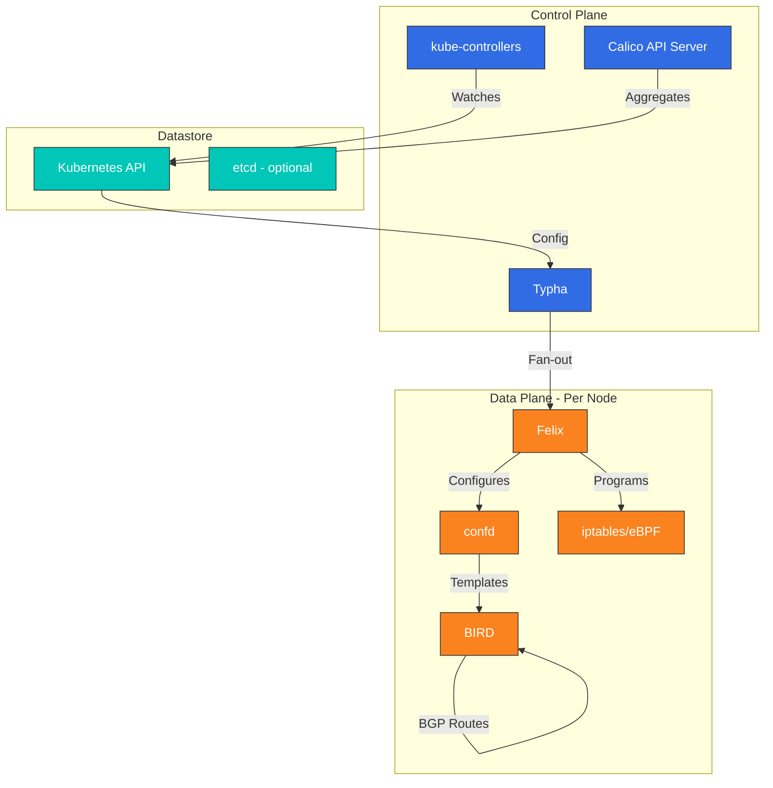
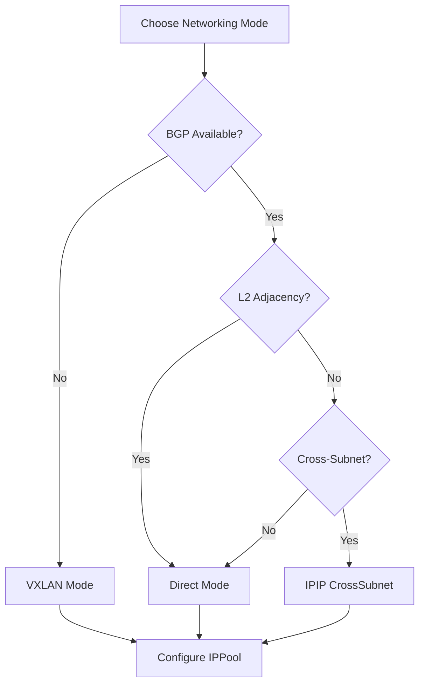

# Análisis profundo de Calico: redes Kubernetes de nivel empresarial

> **Versiones compatibles**: Calico v3.29+ / Kubernetes 1.28+
> **Última actualización**: July 27, 2026

## Descripción general

Esta sección proporciona una comprensión integral de los conceptos y tecnologías centrales de Calico. Exploraremos en profundidad la arquitectura de Calico, los modos de red, las políticas de red, las características de seguridad y la integración con proveedores de nube.

## ¿Qué es Calico?

Calico es una solución de redes y seguridad de red de código abierto para contenedores, máquinas virtuales y cargas de trabajo nativas basadas en host. Desarrollado originalmente por Tigera, Calico se ha convertido en uno de los plugins CNI de Kubernetes más ampliamente implementados, en el que empresas de todo el mundo confían por su estabilidad, rendimiento y sólidas capacidades de políticas de red.

### Actualización de julio de 2026: Calico para VMs en Kubernetes

El 21 de julio de 2026, Tigera lanzó **Calico for VMs on Kubernetes**, una plataforma impulsada por eBPF que ofrece redes y seguridad de red tanto para máquinas virtuales como para contenedores en un único plano de control nativo de Kubernetes. Está dirigida a las migraciones de VMware/NSX: una VM trasladada a Kubernetes conserva su dirección IP, puede permanecer en una VLAN existente mediante extensión de puente L2 y hereda la misma política de red de Calico, microsegmentación (incluidos los niveles de políticas y las políticas por etapas), enrutamiento, balanceo de carga y visibilidad de flujos que los contenedores junto a ella. Consulte el [comunicado de prensa](https://www.storagenewsletter.com/2026/07/21/tigera-launches-calico-unified-platform-3-23-the-definitive-vmware-migration-solution-with-one-network-and-one-security-model-for-every-vm-and-container-on-kubernetes/) para más detalles.

### Ventajas principales

1. **Madurez probada en batalla**: Utilizado en producción por miles de organizaciones desde 2016
2. **Plano de datos flexible**: Elección entre planos de datos iptables, nftables o eBPF
3. **Soporte nativo de BGP**: Integración BGP de primera clase para implementaciones on-premises e híbridas
4. **Políticas de red integrales**: Kubernetes NetworkPolicy más políticas extendidas de Calico
5. **Soporte de Windows**: Soporte completo de redes para contenedores Windows
6. **Características empresariales**: Tigera Calico Enterprise añade observabilidad, cumplimiento y defensa ante amenazas
7. **Integración cloud-native**: Integración fluida con infraestructura AWS, GCP, Azure y on-premises

### ¿Por qué elegir Calico?

- **Probado a escala**: Ejecuta cargas de trabajo de producción en empresas que procesan miles de millones de transacciones
- **Simplicidad operativa**: Instalación y configuración sencillas
- **Comunidad sólida**: Comunidad activa de código abierto con amplia documentación
- **Flexibilidad de proveedor**: Funciona de forma coherente en cualquier distribución de Kubernetes
- **Preparado para el cumplimiento**: Características integradas para registros de auditoría y aplicación de políticas

## Aspectos destacados de la versión: Calico v3.29

Calico v3.29 ofrece mejoras significativas en redes, seguridad y observabilidad:

### Mejoras de redes
- **Plano de datos eBPF GA**: Plano de datos eBPF listo para producción con paridad completa de características
- **Rendimiento BGP mejorado**: Convergencia de rutas optimizada y menor uso de memoria
- **VXLAN mejorado**: Mejor enrutamiento entre subredes con detección automática de MTU
- **IPv6 Dual-Stack**: Soporte completo para entornos de red dual-stack

### Mejoras de seguridad
- **Mejoras de políticas DNS**: Políticas de red basadas en FQDN más granulares
- **Recomendaciones de políticas**: Generación de políticas asistida por IA basada en el tráfico observado
- **Opciones de cifrado**: Configuración simplificada de WireGuard para cifrado de nodo a nodo

### Características operativas
- **Calico API Server**: Agregación nativa de Kubernetes API para recursos de Calico
- **Diagnósticos mejorados**: Herramientas de solución de problemas y comprobaciones de estado mejoradas
- **Optimización de recursos**: Menor consumo de CPU y memoria

## Comparación de CNI

| Característica | Calico | Cilium |
|---------|--------|--------|
| **Tecnología central** | iptables/eBPF | eBPF |
| **Madurez** | Muy alta (2016+) | Alta (2017+) |
| **Política de red** | L3-L4 (L7 Enterprise) | L3-L7 |
| **Service Mesh** | Independiente (Enterprise) | Integrado |
| **Soporte BGP** | Sólido (nativo) | Compatible |
| **Observabilidad** | Básica (Enterprise: avanzada) | Hubble (potente) |
| **Soporte de Windows** | Completo | Beta |
| **Plano de datos eBPF** | Opcional | Obligatorio |
| **Curva de aprendizaje** | Moderada | Más pronunciada |
| **Reemplazo de kube-proxy** | Sí (modo eBPF) | Sí |
| **Multi-Cluster** | Federación | Cluster Mesh |

## Descripción general de la arquitectura

La arquitectura de Calico consta de varios componentes clave que trabajan juntos para proporcionar redes y seguridad de red.



### Componentes clave

| Componente | Función | Se ejecuta en |
|-----------|------|---------|
| **Felix** | Programa rutas y ACL en cada host | Cada nodo |
| **BIRD** | Demonio BGP para distribución de rutas | Cada nodo |
| **confd** | Supervisa el datastore, genera la configuración de BIRD | Cada nodo |
| **Typha** | Proxy de caché para reducir la carga del servidor API | Pods dedicados |
| **kube-controllers** | Sincroniza recursos de Kubernetes con Calico | Plano de control |
| **Calico API Server** | Capa de agregación de Kubernetes API | Plano de control |

## Modos de red

Calico admite varios modos de red para adaptarse a distintos requisitos de infraestructura:

### 1. Modo IPIP (predeterminado)
- Encapsulación IP-in-IP para tráfico entre subredes
- MTU: 1480 bytes
- Ideal para: Entornos de nube, configuración sencilla

### 2. Modo VXLAN
- Encapsulación VXLAN (puerto UDP 4789)
- MTU: 1450 bytes
- Ideal para: Entornos que requieren un protocolo overlay estándar

### 3. Modo directo/sin encapsulación
- Sin encapsulación, enrutamiento nativo
- MTU: 1500 bytes (completo)
- Ideal para: On-premises con BGP, cargas de trabajo críticas para el rendimiento

### Guía de selección de modo



## Integración con Amazon EKS

Calico se integra fluidamente con Amazon EKS y proporciona capacidades mejoradas de políticas de red.

### Instalación rápida en EKS

```bash
# Install Calico operator
kubectl create -f https://raw.githubusercontent.com/projectcalico/calico/v3.29.0/manifests/tigera-operator.yaml

# Configure Calico for EKS (VXLAN mode)
cat <<EOF | kubectl apply -f -
apiVersion: operator.tigera.io/v1
kind: Installation
metadata:
  name: default
spec:
  kubernetesProvider: EKS
  cni:
    type: Calico
  calicoNetwork:
    bgp: Disabled
    ipPools:
    - blockSize: 26
      cidr: 10.244.0.0/16
      encapsulation: VXLAN
      natOutgoing: Enabled
      nodeSelector: all()
EOF

# Verify installation
kubectl get pods -n calico-system
```

### EKS con VPC CNI + política de Calico

Para entornos EKS que utilizan AWS VPC CNI para las redes, pero requieren políticas de red avanzadas:

```bash
# Install Calico for network policy only
kubectl apply -f https://raw.githubusercontent.com/aws/amazon-vpc-cni-k8s/master/config/master/calico-operator.yaml
kubectl apply -f https://raw.githubusercontent.com/aws/amazon-vpc-cni-k8s/master/config/master/calico-crs.yaml
```

## Métodos de instalación

### Método 1: Tigera Operator (recomendado)

```bash
# Install the operator
kubectl create -f https://raw.githubusercontent.com/projectcalico/calico/v3.29.0/manifests/tigera-operator.yaml

# Install Calico with custom configuration
cat <<EOF | kubectl apply -f -
apiVersion: operator.tigera.io/v1
kind: Installation
metadata:
  name: default
spec:
  calicoNetwork:
    ipPools:
    - blockSize: 26
      cidr: 192.168.0.0/16
      encapsulation: IPIP
      natOutgoing: Enabled
      nodeSelector: all()
EOF
```

### Método 2: instalación con Helm

```bash
# Add Calico Helm repository
helm repo add projectcalico https://docs.tigera.io/calico/charts
helm repo update

# Install Calico
helm install calico projectcalico/tigera-operator \
  --version v3.29.0 \
  --namespace tigera-operator \
  --create-namespace \
  --set installation.kubernetesProvider=EKS
```

### Método 3: instalación basada en manifests

```bash
# For clusters with 50 nodes or less
kubectl apply -f https://raw.githubusercontent.com/projectcalico/calico/v3.29.0/manifests/calico.yaml

# For larger clusters (enables Typha)
kubectl apply -f https://raw.githubusercontent.com/projectcalico/calico/v3.29.0/manifests/calico-typha.yaml
```

## Ejemplos de políticas de red

### Kubernetes NetworkPolicy básica

```yaml
apiVersion: networking.k8s.io/v1
kind: NetworkPolicy
metadata:
  name: allow-frontend-to-backend
  namespace: production
spec:
  podSelector:
    matchLabels:
      app: backend
  policyTypes:
  - Ingress
  ingress:
  - from:
    - podSelector:
        matchLabels:
          app: frontend
    ports:
    - protocol: TCP
      port: 8080
```

### Calico GlobalNetworkPolicy

```yaml
apiVersion: projectcalico.org/v3
kind: GlobalNetworkPolicy
metadata:
  name: deny-all-egress-except-dns
spec:
  selector: all()
  types:
  - Egress
  egress:
  - action: Allow
    protocol: UDP
    destination:
      ports:
      - 53
  - action: Allow
    protocol: TCP
    destination:
      ports:
      - 53
  - action: Deny
```

### Calico NetworkPolicy con FQDN

```yaml
apiVersion: projectcalico.org/v3
kind: NetworkPolicy
metadata:
  name: allow-external-api
  namespace: production
spec:
  selector: app == 'web'
  types:
  - Egress
  egress:
  - action: Allow
    protocol: TCP
    destination:
      domains:
      - "api.example.com"
      - "*.amazonaws.com"
      ports:
      - 443
```

## Monitorización y observabilidad

### Métricas de Prometheus

Calico expone métricas mediante Prometheus. Métricas clave que se deben supervisar:

```yaml
# Felix metrics endpoint configuration
apiVersion: projectcalico.org/v3
kind: FelixConfiguration
metadata:
  name: default
spec:
  prometheusMetricsEnabled: true
  prometheusMetricsPort: 9091
```

### Métricas clave

| Métrica | Descripción |
|--------|-------------|
| `felix_active_local_endpoints` | Número de endpoints activos en el nodo |
| `felix_iptables_rules` | Número de reglas iptables programadas |
| `felix_ipsets_calico` | Número de conjuntos IP mantenidos |
| `felix_int_dataplane_failures` | Fallos de programación del plano de datos |
| `felix_cluster_num_hosts` | Total de hosts en el clúster |

### Endpoints de comprobación de estado

```bash
# Check Felix health
curl -s http://localhost:9099/liveness
curl -s http://localhost:9099/readiness

# Check Typha health
curl -s http://localhost:9098/liveness
```

## Referencia rápida de solución de problemas

### Comandos comunes

```bash
# Check Calico system status
kubectl get pods -n calico-system

# View Calico node status
kubectl get nodes -o custom-columns=NAME:.metadata.name,CALICO:.status.conditions[*].type

# Check IP pools
kubectl get ippools -o wide

# View network policies
kubectl get networkpolicies -A
kubectl get globalnetworkpolicies

# Felix logs
kubectl logs -n calico-system -l k8s-app=calico-node -c calico-node

# BIRD status (BGP)
kubectl exec -n calico-system calico-node-xxxxx -c calico-node -- birdcl show protocols
```

### Problemas y soluciones comunes

| Problema | Diagnóstico | Solución |
|-------|-----------|----------|
| Pods bloqueados en ContainerCreating | Compruebe los logs de Felix para detectar errores de IPAM | Verifique la configuración de IPPool |
| Falla la conectividad entre nodos | Compruebe el modo de encapsulación | Asegúrese de que IPIP/VXLAN esté habilitado |
| Las políticas de red no se aplican | Compruebe el orden de las políticas y los selectores | Use `calicoctl` para verificar las políticas |
| CPU alta en Felix | Demasiadas reglas iptables | Considere el plano de datos eBPF |

## Índice del análisis profundo

**[Parte 1: Introducción a Calico](01-introduction.md)**
- Qué es Calico e historia del proyecto
- Configuración del entorno de laboratorio
- Descripción general de las características principales
- Casos de uso y escenarios de implementación
- Comunidad y gobernanza

**[Parte 2: Análisis profundo de la arquitectura de Calico](02-architecture.md)**
- Descripción general de la arquitectura de componentes
- Felix: el agente de Calico
- BIRD: demonio de enrutamiento BGP
- confd: gestión de configuración
- Typha: componente de escalado
- kube-controllers: integración con Kubernetes
- Opciones de datastore
- Análisis del flujo de paquetes

**[Parte 3: Modos de red](03-networking-modes.md)**
- Modo de encapsulación IPIP
- Modo de encapsulación VXLAN
- Modo directo/sin encapsulación
- Comparación y selección de modos
- Pruebas de rendimiento
- Compatibilidad con proveedores de nube
- Optimización de MTU

## Guía de selección: Calico frente a Cilium

### Elija Calico cuando:
- Necesite estabilidad y madurez comprobadas en producción
- Se requiera soporte para contenedores Windows
- La integración BGP con la infraestructura de red existente sea crítica
- Prefiera la simplicidad operativa frente a las características avanzadas
- La eficiencia de recursos sea una prioridad
- Ya esté familiarizado con redes basadas en iptables

### Elija Cilium cuando:
- Necesite políticas de red L7 avanzadas
- Se deseen capacidades de service mesh integradas
- Sea importante una observabilidad profunda con Hubble
- Desee aprovechar las características eBPF más avanzadas
- Se necesite conectividad multi-cluster con Cluster Mesh

### Enfoque híbrido
Algunas organizaciones utilizan ambos:
- Calico para cargas de trabajo de producción que requieren estabilidad
- Cilium para entornos de desarrollo/staging que exploran nuevas características

## Referencias

- [Documentación oficial de Calico](https://docs.tigera.io/calico/latest/about/)
- [Repositorio de GitHub de Calico](https://github.com/projectcalico/calico)
- [Tigera Calico Enterprise](https://www.tigera.io/tigera-products/calico-enterprise/)
- [Guía de políticas de red de Calico](https://docs.tigera.io/calico/latest/network-policy/)
- [Integración de Calico con Amazon EKS](https://docs.aws.amazon.com/eks/latest/userguide/calico.html)
- [Referencia de calicoctl](https://docs.tigera.io/calico/latest/reference/calicoctl/)
- [Plano de datos eBPF de Calico](https://docs.tigera.io/calico/latest/operations/ebpf/)

## Cuestionario

Para comprobar lo que ha aprendido en esta sección, pruebe el [cuestionario de análisis profundo de Calico](../../quizzes/networking/calico/01-introduction-quiz.md).
