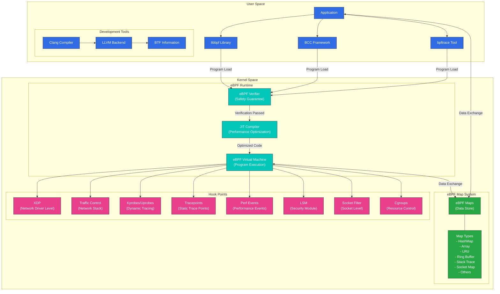
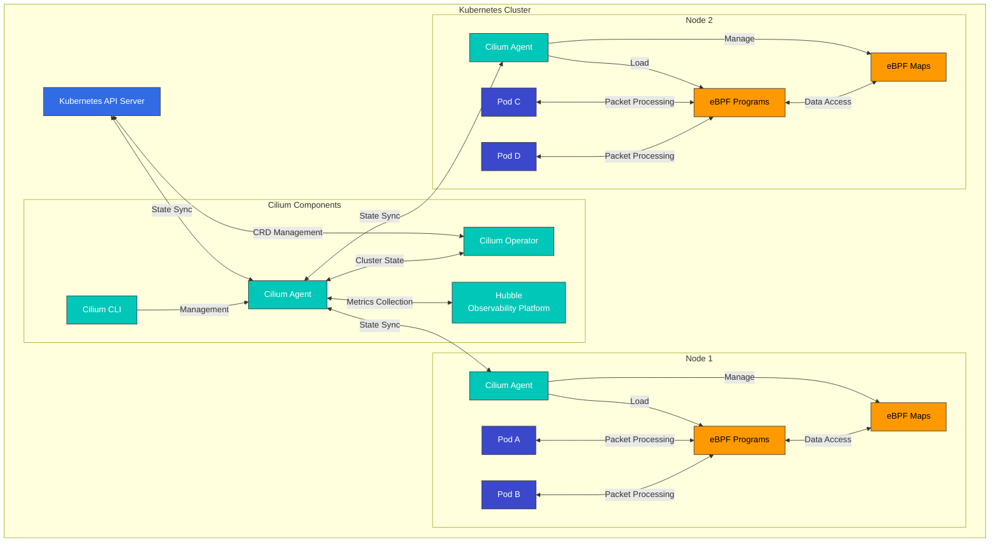

# Análisis profundo de la tecnología eBPF

> **Versiones compatibles**: Linux kernel 4.19+
> **Última actualización**: February 22, 2026

## Configuración del entorno de laboratorio

Para seguir los ejemplos de este documento, necesitarás las siguientes herramientas y entorno:

### Herramientas necesarias
- Linux kernel 4.19 o posterior (se recomienda 5.10+)
- bpftool, libbpf-dev, clang, llvm
- bcc (BPF Compiler Collection)

### Configuración del entorno

```bash
# Install required packages on Ubuntu/Debian systems
sudo apt-get update
sudo apt-get install -y build-essential clang llvm libelf-dev libbpf-dev bpftool linux-tools-common linux-tools-generic

# Install BCC
sudo apt-get install -y bpfcc-tools python3-bpfcc

# Check kernel version
uname -r

# Check eBPF feature support
bpftool feature
```

## Introducción a la tecnología eBPF y antecedentes históricos

eBPF (extended Berkeley Packet Filter) es una tecnología revolucionaria que permite que los programas se ejecuten de forma segura dentro del Linux kernel. Esta tecnología proporciona un mecanismo potente para extender y observar el comportamiento del kernel sin modificar su código. En los entornos cloud-native modernos, eBPF ha aportado cambios revolucionarios en redes, seguridad, monitorización y análisis de rendimiento.

### De BPF a eBPF: historia de la evolución

#### Nacimiento y limitaciones de BPF inicial (1992-2013)
En 1992, Steven McCanne y Van Jacobson de UC Berkeley publicaron un artículo titulado "The BSD Packet Filter: A New Architecture for User-level Packet Capture", que introdujo Berkeley Packet Filter (BPF). Esta tecnología presentó un enfoque innovador para el filtrado de paquetes de red.

BPF introdujo los siguientes conceptos fundamentales:
- **Máquina virtual en el kernel**: Ejecutar de forma segura código definido por el usuario dentro del kernel
- **Diseño basado en registros**: Modelo de ejecución más eficiente que el basado en pila
- **Garantías de seguridad**: Prevención de bucles infinitos y restricciones de acceso a memoria
- **Optimización del filtrado de paquetes**: Prevención de copias de paquetes innecesarias

BPF inicial se utilizaba principalmente en herramientas de monitorización de red como tcpdump y tenía las siguientes limitaciones:
- Conjunto de instrucciones limitado (solo 2 registros de 32 bits)
- Tamaño de programa limitado (máximo de 4096 instrucciones)
- Funcionalidad limitada (principalmente usada para filtrar paquetes)
- Interacción limitada con el espacio de usuario
- Incapacidad de aprovechar arquitecturas de CPU modernas

A pesar de estas limitaciones, BPF siguió siendo una parte importante del Linux kernel durante más de 20 años.

#### Nacimiento y desarrollo inicial de eBPF (2013-2016)
En 2013, Alexei Starovoitov de PLUMgrid propuso BPF extendido (eBPF) para superar las limitaciones de BPF existente. Esta propuesta buscaba rediseñar BPF por completo para adaptarlo a las arquitecturas de procesadores modernas.

Los objetivos iniciales de diseño de eBPF incluían:
- Compatibilidad con arquitectura de 64 bits
- Más registros (10 → actualmente 11)
- Mayor espacio de pila (512 bytes)
- Almacenamiento de estado y comunicación con el espacio de usuario mediante maps
- Capacidad de propósito general para adjuntarse a diversos eventos

Etapas clave de desarrollo:
- **Mayo de 2014 (Linux kernel 3.15)**: Infraestructura inicial de eBPF integrada en el Linux kernel
  - Introducción del nuevo conjunto de instrucciones eBPF
  - Adición de una capa de traducción de BPF clásico (cBPF) a eBPF
  - Introducción de los tipos iniciales de eBPF map (hash, array)

- **Diciembre de 2014 (Linux kernel 3.18)**: Introducción del compilador eBPF JIT (Just-In-Time)
  - Compatibilidad de compilación JIT para la arquitectura x86_64
  - Mejora significativa del rendimiento de ejecución
  - Adición de la funcionalidad de tail call para encadenar programas

- **Junio de 2015 (Linux kernel 4.1)**: Expansión de la funcionalidad de eBPF maps
  - Mecanismo mejorado para compartir datos entre el espacio de usuario y el espacio del kernel
  - Adición de nuevos tipos de map (LRU hash, stack trace)
  - Adición de la capacidad de adjuntar programas eBPF a kprobes

- **Enero de 2016 (Linux kernel 4.4)**: Introducción de XDP (eXpress Data Path)
  - Procesamiento de paquetes de alto rendimiento posible en el nivel del driver de red
  - Procesamiento de paquetes antes de entrar en el stack de red del kernel
  - Rendimiento capaz de procesar millones de paquetes por segundo

- **Julio de 2016 (Linux kernel 4.7)**: Introducción de tipos adicionales de programas eBPF
  - Compatibilidad con programas Traffic Control (TC)
  - Capacidades mejoradas de filtrado de sockets
  - Expansión de funciones helper

Durante este período, eBPF comenzó a evolucionar de una simple herramienta de filtrado de paquetes a una infraestructura de programación del kernel de propósito general, expandiéndose a diversos usos más allá de las redes.

#### Crecimiento e innovación del ecosistema eBPF moderno (2017-presente)
Desde 2017, eBPF se ha establecido como una tecnología central de la informática cloud-native, y diversos proyectos y empresas han adoptado esta tecnología.

##### Proyectos principales y desarrollos técnicos:

- **2017**:
  - **Inicio del proyecto Cilium**: Primer gran proyecto que utiliza eBPF para redes y seguridad de contenedores
  - **BCC (BPF Compiler Collection)**: Aparición de una colección de herramientas de alto nivel para el desarrollo de programas eBPF
  - **Linux kernel 4.10-4.14**: Adición de tipos de programas cgroup, socket y tracepoint

- **2018**:
  - **Linux kernel 4.18**: Introducción de BTF (BPF Type Format), que sentó las bases para la compatibilidad con CO-RE (Compile Once – Run Everywhere)
  - **bpftrace**: Aparición de un lenguaje de trazado de alto nivel al estilo de DTrace
  - **Facebook Katran**: Publicación como open source de un balanceador de carga L4 basado en eBPF

- **2019**:
  - **Linux kernel 5.0-5.3**: Compatibilidad con llamadas de función BPF-to-BPF, adición de programas raw tracepoint
  - **Falco**: Creciente popularidad de la herramienta de monitorización de seguridad en runtime basada en eBPF
  - **Hubble**: Aparición de una herramienta de observabilidad de red basada en Cilium

- **2020**:
  - **Linux kernel 5.5-5.10**: Abstracción BPF link, variables globales, capacidad de suspensión, compatibilidad con bucles
  - **libbpf**: Maduración de la biblioteca de espacio de usuario
  - **Fundación eBPF establecida**: Formación de una organización oficial para el avance tecnológico
  - **Inversión Serie A de Isovalent (desarrollador de Cilium)**: Aparición de soluciones comerciales de eBPF

- **2021**:
  - **Linux kernel 5.11-5.15**: Funcionalidad de asignación de memoria, compatibilidad con temporizadores, adición de punteros dinámicos
  - **Integración mejorada con Kubernetes**: Adopción ampliada en los ámbitos de service mesh, redes y seguridad
  - **Lanzamientos de productos comerciales**: Múltiples empresas lanzando productos basados en eBPF

- **2022-presente**:
  - **Linux kernel 6.0+**: Expansión y optimización continuas de funcionalidades
  - **Estandarización como tecnología cloud-native**: Integración ampliada con proyectos CNCF
  - **eBPF Summit**: Conferencia dedicada y crecimiento de la comunidad
  - **Adopción por grandes proveedores cloud**: AWS, GCP y Azure utilizan tecnología eBPF

##### Áreas actuales de aplicación de eBPF:

1. **Redes**:
   - Redes de contenedores (Cilium, Calico)
   - Balanceo de carga (Katran, Cilium)
   - Filtrado de paquetes y firewalls (bpfilter)
   - Aceleración de red (soluciones basadas en XDP)

2. **Seguridad**:
   - Monitorización de seguridad en runtime (Falco, Tracee)
   - Sistemas de detección de intrusiones (Tetragon)
   - Filtrado de llamadas al sistema (seccomp-bpf)
   - Gestión de permisos (LSM BPF)

3. **Observabilidad**:
   - Monitorización y trazado del sistema (bpftrace, BCC)
   - Análisis de rendimiento (BPF Performance Tools)
   - Trazado distribuido (Hubble)
   - Recopilación de métricas (eBPF Exporter)

4. **Service Mesh**:
   - Service mesh sin sidecar (Cilium Service Mesh)
   - Proxy L7 y balanceo de carga
   - Gestión y enrutamiento del tráfico

5. **Almacenamiento**:
   - Trazado y optimización de I/O de bloques
   - Monitorización de sistemas de archivos
   - Análisis del rendimiento de caché

### Evolución técnica de eBPF: características clave por versión de kernel

El avance técnico de eBPF ha sido gradual a lo largo de varias versiones de Linux kernel, añadiéndose características importantes en cada versión. La tabla siguiente muestra las principales incorporaciones de eBPF por versión de kernel:

| Versión de kernel | Año | Característica principal de eBPF añadida | Importancia técnica |
|---------------|------|-------------------------|----------------------|
| 3.15 | 2014 | Introducción de la infraestructura inicial de eBPF | Nuevo conjunto de instrucciones, expansión de registros |
| 3.18 | 2014 | Adición del compilador JIT | Mejora significativa del rendimiento de ejecución |
| 4.1 | 2015 | Funcionalidad de eBPF maps, API de espacio de usuario | Posible almacenamiento de estado y compartición de datos |
| 4.4 | 2016 | Introducción de XDP (eXpress Data Path) | Posible procesamiento ultrarrápido de paquetes |
| 4.7 | 2016 | Tipos de programa adicionales, compatibilidad con tail call | Mejora del encadenamiento de programas y la escalabilidad |
| 4.10 | 2017 | Programas socket y cgroup | Control de sockets de red, compatibilidad con contenedores |
| 4.14 | 2017 | XDP offload, más funciones helper | Compatibilidad con aceleración de hardware |
| 4.18 | 2018 | Introducción de BTF (BPF Type Format) | Base para la compatibilidad con CO-RE |
| 5.0 | 2019 | Compatibilidad con llamadas de función BPF-to-BPF | Posibles modularización y reutilización de código |
| 5.5 | 2020 | Abstracción BPF link, variables globales | Gestión de programas mejorada |
| 5.8 | 2020 | Compatibilidad con bucles (bucles acotados) | Mayor flexibilidad de programación |
| 5.10 | 2020 | Capacidad de suspensión | Posible programación asíncrona |
| 5.13 | 2021 | Funcionalidad de asignación de memoria | Posible gestión dinámica de memoria |
| 5.15 | 2021 | Compatibilidad con temporizadores | Gestión de eventos basada en tiempo |
| 6.0+ | 2022+ | Expansión y optimización continuas de funcionalidades | Evolución a un entorno de programación completo |

Mediante estos desarrollos, eBPF ha evolucionado de un simple filtro de paquetes a un entorno de programación completo y ahora es una de las tecnologías más importantes del Linux kernel. En particular, la introducción de la característica CO-RE (Compile Once – Run Everywhere) ha mejorado enormemente la portabilidad de los programas eBPF, lo que permite que el mismo programa se ejecute sin recompilación en distintas versiones de kernel.

### eBPF frente a módulos tradicionales de kernel: cambio de paradigma

eBPF proporciona un enfoque fundamentalmente diferente para extender el Linux kernel en comparación con los módulos de kernel tradicionales. Comprender estas diferencias es importante para entender la innovación de eBPF.

| Característica | eBPF | Módulo de kernel |
|---------------|------|---------------|
| **Seguridad** | Seguridad garantizada mediante verifier, kernel crash imposible | Kernel panic posible, afecta a la estabilidad global del sistema |
| **Despliegue** | Carga dinámica en runtime, se mantiene la compatibilidad binaria | Recompilación necesaria por versión de kernel, posibles problemas de compatibilidad |
| **Actualización** | Actualizaciones en tiempo real posibles sin reiniciar el kernel | Generalmente requiere reinicio, interrupción del servicio |
| **Rendimiento** | Optimizado mediante compilación JIT, rendimiento cercano al nativo | Rendimiento nativo, acceso directo al kernel |
| **Complejidad de desarrollo** | Entorno restringido, se necesitan herramientas especiales, depuración difícil | Acceso completo a la API del kernel, herramientas de depuración estándar disponibles |
| **Modelo de permisos** | Permisos limitados, entorno aislado | Permisos completos de kernel, acceso ilimitado |
| **Portabilidad** | Compatibilidad con CO-RE (Compile Once – Run Everywhere) | Recompilación necesaria por versión de kernel |
| **Ámbito de despliegue** | Puede desplegarse de forma segura en entornos de producción | Generalmente limitado a módulos de kernel proporcionados por proveedores |

La mayor innovación de eBPF es su seguridad y capacidad de carga dinámica. Los módulos de kernel tradicionales se ejecutan sin restricciones dentro del kernel, y los errores pueden desestabilizar todo el sistema. En contraste, los programas eBPF solo pueden cargarse después de pasar el verifier del kernel, que comprueba exhaustivamente el acceso a memoria, los bucles infinitos y las posibilidades de kernel crash.

## Análisis en profundidad de la arquitectura eBPF dentro del kernel

> **Concepto clave**: eBPF opera como una máquina virtual aislada dentro del Linux kernel, lo que permite extender el comportamiento del kernel sin modificar su código.

eBPF no es solo una tecnología simple, sino un stack tecnológico completo formado por diversos componentes, desde la máquina virtual dentro del kernel hasta las bibliotecas de espacio de usuario. Comprender esta arquitectura es esencial para captar el poder y la flexibilidad de eBPF.

### Diagrama detallado de la arquitectura eBPF



### Descripción detallada de los componentes de la arquitectura eBPF

#### 1. Componentes del espacio de usuario

**Herramientas y bibliotecas de desarrollo**:
- **Clang/LLVM**: Compila programas eBPF de C o Rust a bytecode eBPF
- **libbpf**: Biblioteca de manipulación eBPF de bajo nivel, interacción directa con el kernel
- **BCC (BPF Compiler Collection)**: Biblioteca de alto nivel que proporciona bindings de Python y Lua
- **bpftrace**: Lenguaje de trazado basado en eBPF, con sintaxis similar a DTrace

**CO-RE (Compile Once – Run Everywhere)**:
- Proporciona portabilidad entre versiones de kernel usando BTF (BPF Type Format)
- Ejecuta el mismo programa eBPF en distintas versiones de kernel sin recompilación
- Responde a los cambios de estructuras del kernel mediante funcionalidad de struct relocation

#### 2. Componentes del espacio del kernel

**Runtime de eBPF**:
- **eBPF Verifier**: Componente central que garantiza la seguridad del programa
  - Prevención de bucles infinitos
  - Solo se permite acceso válido a memoria
  - Garantía de estabilidad del kernel
  - Comprobación de permisos

- **Compilador JIT (Just-In-Time)**:
  - Convierte bytecode eBPF en código máquina nativo
  - Optimización específica de arquitectura (x86_64, ARM64, RISC-V, etc.)
  - Rendimiento de ejecución mejorado significativamente

- **Máquina virtual eBPF**:
  - 11 registros
  - Pila de 512 bytes
  - Acceso a funciones del kernel mediante funciones helper
  - Compatibilidad con tail call para encadenar programas

**Sistema de eBPF Maps**:
- Estructuras de datos implementadas como almacenes clave-valor
- Compartición de datos entre el espacio del kernel y el espacio de usuario
- Compatibilidad con varios tipos de map:
  - **BPF_MAP_TYPE_HASH**: Tabla hash general
  - **BPF_MAP_TYPE_ARRAY**: Array de tamaño fijo
  - **BPF_MAP_TYPE_LRU_HASH**: Realiza seguimiento de elementos usados recientemente
  - **BPF_MAP_TYPE_RINGBUF**: Ring buffer de alto rendimiento
  - **BPF_MAP_TYPE_STACK_TRACE**: Almacenamiento de stack trace
  - **BPF_MAP_TYPE_SOCKHASH**: Almacenamiento de referencias de socket
  - **BPF_MAP_TYPE_DEVMAP**: Referencia de dispositivo de red
  - **BPF_MAP_TYPE_PROG_ARRAY**: Referencia de programa eBPF

**Hook Points**:

Los programas eBPF pueden adjuntarse a diversos puntos dentro del kernel, llamados hook points. Cada hook point permite que los programas eBPF se ejecuten cuando se producen eventos u operaciones específicos. Los hook points principales son:

- **XDP (eXpress Data Path)**:
  - Procesamiento de paquetes en el nivel del driver de red
  - Procesa paquetes desde la NIC antes de entrar en el kernel
  - Punto de procesamiento de paquetes de máximo rendimiento (capaz de procesar decenas de millones de paquetes por segundo)
  - Acciones posibles: descartar, pasar, redirigir, modificar paquetes
  - Casos de uso: defensa DDoS, filtrado de paquetes, balanceo de carga
  - Compatibilidad con hardware offload (en NIC específicas)

- **Traffic Control (TC)**:
  - Capa de control de tráfico del stack de red
  - Punto de cola de entrada/salida
  - Proporciona más contexto que XDP
  - Posible modificación de encabezados y payload de paquetes
  - Casos de uso: Network Policy, NAT, transformación de paquetes
  - Compatible tanto con entrada como con salida

- **Socket Filter**:
  - Filtrado de paquetes a nivel de socket
  - Programas adjuntos a sockets específicos
  - Controla las operaciones de socket de aplicaciones de espacio de usuario
  - Casos de uso: filtrado de paquetes por aplicación, estadísticas a nivel de socket
  - Puede aplicarse en la creación, el binding y la conexión de sockets

- **Kprobes/Uprobes**:
  - Trazado dinámico de funciones del kernel/del espacio de usuario
  - Se ejecuta en la entrada/retorno de funciones
  - Puede enlazarse a funciones arbitrarias del kernel
  - Casos de uso: análisis de rendimiento, depuración, monitorización de seguridad
  - Puede añadirse/eliminarse dinámicamente
  - Tiene sobrecarga (se requiere precaución en entornos de producción)

- **Tracepoints**:
  - Puntos de trazado definidos estáticamente dentro del kernel
  - Proporciona ABI estable (compatibilidad entre versiones de kernel)
  - Compatibilidad de trazado para eventos principales del kernel
  - Casos de uso: trazado de llamadas al sistema, monitorización de I/O de bloques, trazado de eventos de red
  - Menor sobrecarga que Kprobes

- **Perf Events**:
  - Eventos de monitorización de rendimiento
  - Acceso a contadores de rendimiento de CPU
  - Monitorización de eventos de hardware/software
  - Casos de uso: análisis de uso de CPU, seguimiento de cache miss, monitorización de fallos de predicción de ramas
  - Posible medición precisa del rendimiento

- **LSM (Linux Security Module)**:
  - Aplicación de políticas de seguridad
  - Comprobaciones de seguridad de llamadas al sistema
  - Verificación de permisos y control de acceso
  - Casos de uso: seguridad de contenedores, detección de escalada de privilegios, control de acceso a archivos
  - Compatibilidad con kernel 5.7+

- **Cgroups**:
  - Control de recursos de contenedores
  - Aplicación de políticas por contenedor
  - Limitación y monitorización de uso de recursos
  - Casos de uso: Network Policy de contenedores, limitación de recursos, aislamiento
  - Importante en entornos de orquestación de contenedores

### Análisis detallado del ciclo de vida de un programa eBPF

Los programas eBPF pasan por varias etapas desde el desarrollo hasta la ejecución. Comprender este proceso ayuda a aclarar cómo funciona eBPF y sus restricciones.

1. **Etapa de desarrollo**:
   - Escribir programas en lenguajes de alto nivel como C y Rust
   - Usar headers del kernel y funciones helper de eBPF
   - Utilizar información BTF (para compatibilidad con CO-RE)
   - Definir secciones (usando la macro `SEC()`)
   - Especificar licencia (se requiere compatibilidad con GPL)

2. **Etapa de compilación**:
   - Compilar a bytecode eBPF usando Clang/LLVM
   - Especificar el objetivo eBPF con la opción `-target bpf`
   - Generar BTF e información de depuración
   - Salida en formato de archivo ELF

3. **Etapa de carga**:
   - Cargar el programa en el kernel mediante la llamada al sistema `bpf()`
   - La biblioteca libbpf o BCC gestiona este proceso
   - Especificar el tipo de programa y hook al que adjuntarlo
   - Crear los maps necesarios

4. **Etapa de verificación**:
   - El verifier en el kernel comprueba la seguridad del programa
   - Análisis de grafo de flujo de control (CFG)
   - Verificación de acceso a memoria
   - Prevención de bucles infinitos
   - Comprobación de permisos
   - Se proporcionan mensajes de error detallados ante un fallo

5. **Etapa de compilación JIT**:
   - Convertir bytecode en código nativo para la arquitectura host
   - Aplicar optimizaciones específicas de arquitectura
   - Mejorar el rendimiento de ejecución
   - Compatible con la mayoría de arquitecturas (x86_64, ARM64, RISC-V, etc.)

6. **Etapa de adjunción**:
   - Adjuntar el programa a eventos específicos del kernel (hooks)
   - Crear e inicializar los maps necesarios
   - Establecer metadatos de programa
   - Gestionar descriptores de archivos

7. **Etapa de ejecución**:
   - El programa se ejecuta cuando suceden eventos
   - Acceder a datos de contexto
   - Procesar paquetes/eventos según las decisiones
   - Llamar a funciones helper

8. **Etapa de intercambio de datos**:
   - Almacenar y recuperar datos mediante eBPF maps
   - Comunicarse con aplicaciones de espacio de usuario
   - Compartir métricas de rendimiento, información de estado, etc.
   - Notificación de eventos (perf event buffer, ring buffer, etc.)

9. **Etapa de actualización/descarga**:
   - Actualizaciones dinámicas de programa si es necesario
   - Descargar el programa al finalizar su uso
   - Limpiar recursos relacionados
   - Mantener o eliminar los datos de map

### Tipos y características de programas eBPF

Los programas eBPF se clasifican en varios tipos según el hook point al que se adjuntan. Cada tipo de programa tiene un contexto y capacidades específicos:

1. **Programas XDP (eXpress Data Path)**:
   - Tipo de programa: `BPF_PROG_TYPE_XDP`
   - Contexto: Datos de paquetes de red, información de interfaz
   - Valores de retorno: `XDP_DROP`, `XDP_PASS`, `XDP_TX`, `XDP_REDIRECT`, etc.
   - Características: Procesamiento de paquetes de máximo rendimiento, ejecución a nivel de driver/hardware

2. **Programas Traffic Control (TC)**:
   - Tipos de programa: `BPF_PROG_TYPE_SCHED_CLS`, `BPF_PROG_TYPE_SCHED_ACT`
   - Contexto: Datos de paquetes de red, información de planificación
   - Valores de retorno: `TC_ACT_OK`, `TC_ACT_SHOT`, `TC_ACT_REDIRECT`, etc.
   - Características: Clasificación y manipulación de paquetes, compatibilidad con entrada/salida

3. **Programas Socket Filter**:
   - Tipo de programa: `BPF_PROG_TYPE_SOCKET_FILTER`
   - Contexto: Datos de buffer de socket
   - Valores de retorno: 0 (descartar paquete) o longitud del paquete (permitir paquete)
   - Características: Filtrado de paquetes a nivel de socket, funcionalidad similar a tcpdump

4. **Programas kprobe/uprobe**:
   - Tipos de programa: `BPF_PROG_TYPE_KPROBE`, `BPF_PROG_TYPE_UPROBE`
   - Contexto: Argumentos de función, valores de registro
   - Valores de retorno: Entero (sin significado)
   - Características: Trazado dinámico de funciones, depuración y profiling

5. **Programas tracepoint**:
   - Tipo de programa: `BPF_PROG_TYPE_TRACEPOINT`
   - Contexto: Struct de definición de tracepoint
   - Valores de retorno: Entero (sin significado)
   - Características: Puntos de trazado estables del kernel, compatibilidad de versiones

6. **Programas perf Event**:
   - Tipo de programa: `BPF_PROG_TYPE_PERF_EVENT`
   - Contexto: Datos de evento de rendimiento
   - Valores de retorno: Entero (sin significado)
   - Características: Monitorización de eventos de rendimiento de hardware/software

7. **Programas cgroup**:
   - Tipos de programa: `BPF_PROG_TYPE_CGROUP_SKB`, `BPF_PROG_TYPE_CGROUP_SOCK`, etc.
   - Contexto: Información de cgroup, datos de socket/paquete
   - Valores de retorno: 0 (denegar) o 1 (permitir)
   - Características: Network Policy por contenedor, control de recursos

8. **Programas LSM (Linux Security Module)**:
   - Tipo de programa: `BPF_PROG_TYPE_LSM`
   - Contexto: Información de operaciones relacionadas con seguridad
   - Valores de retorno: 0 (permitir) o código de error (denegar)
   - Características: Aplicación de políticas de seguridad, comprobación de permisos

9. **Programas de operaciones de socket**:
   - Tipo de programa: `BPF_PROG_TYPE_SOCK_OPS`
   - Contexto: Información de operación de socket
   - Valores de retorno: Entero (sin significado)
   - Características: Control de conexión TCP, configuración de opciones de socket

10. **Programas fentry/fexit**:
    - Tipo de programa: `BPF_PROG_TYPE_TRACING`
    - Contexto: Argumentos de función, valores de retorno
    - Valores de retorno: Entero (sin significado)
    - Características: Trazado de funciones de baja sobrecarga, más eficiente que kprobe

### Ejemplo y explicación de un programa eBPF simple

El siguiente es un ejemplo de programa eBPF simple que traza la ejecución de una llamada al sistema:

```c
// hello_world.c
#include <linux/bpf.h>
#include <bpf/bpf_helpers.h>

// Program section definition - this program executes on execve system call entry
SEC("tracepoint/syscalls/sys_enter_execve")
int hello_execve(void *ctx) {
    // Print simple message
    char msg[] = "Hello, eBPF!";
    bpf_trace_printk(msg, sizeof(msg));
    return 0;
}

// License definition (GPL compatible required)
char LICENSE[] SEC("license") = "GPL";
```

**Explicación del código**:
1. **Archivos header**: Incluyen los headers necesarios relacionados con eBPF
2. **Definición de sección**: Especifica el tipo de programa y punto de adjunción con la macro `SEC()`
3. **Función de programa**: Función llamada cuando se ejecuta la llamada al sistema `execve`
4. **Parámetro de contexto**: Contiene datos relacionados con el evento
5. **Uso de función helper**: Genera un mensaje de depuración con `bpf_trace_printk()`
6. **Especificación de licencia**: Se requiere una licencia compatible con GPL (para acceso a símbolos del kernel)

**Compilar y ejecutar**:
```bash
# Compile
clang -O2 -target bpf -c hello_world.c -o hello_world.o

# Load and run
bpftool prog load hello_world.o /sys/fs/bpf/hello_world

# Check output
cat /sys/kernel/debug/tracing/trace_pipe
```

**Resultado de ejecución**:
```
<...>-1234  [001] d... 123456.789012: bpf_trace_printk: Hello, eBPF!
<...>-5678  [002] d... 123456.789102: bpf_trace_printk: Hello, eBPF!
```

Este ejemplo simple demuestra los conceptos básicos de eBPF. En aplicaciones reales, se puede utilizar lógica y maps más complejos para recopilar y analizar datos.

### eBPF Maps: núcleo del intercambio de datos y el almacenamiento de estado

eBPF maps son almacenes clave-valor para compartir datos entre programas eBPF y aplicaciones de espacio de usuario. Estos maps son el mecanismo central para que los programas eBPF mantengan estado y se comuniquen con el espacio de usuario.

#### Conceptos básicos de eBPF Maps

eBPF maps tienen las siguientes características:

- **Almacenamiento persistente**: Los datos persisten incluso cuando se recargan los programas
- **Diversas estructuras de datos**: Compatibilidad con distintas formas, incluidas tablas hash, arrays, colas y pilas
- **Compatibilidad con concurrencia**: Posible acceso simultáneo desde múltiples CPU
- **Limitación de tamaño**: El tamaño máximo debe especificarse al crear el map
- **Formato flexible de clave/valor**: Se pueden almacenar diversos tipos de datos
- **Acceso bidireccional**: Accesible desde el espacio del kernel y el espacio de usuario

#### Tipos principales de Map y casos de uso

1. **Hash Map (BPF_MAP_TYPE_HASH)**:
   - Almacén clave-valor general
   - Rendimiento de búsqueda con complejidad temporal O(1)
   - Gestión de tamaño dinámica (limitada por entradas máximas)
   - Casos de uso: Seguimiento de conexiones, almacenamiento de información de sesión, contadores
   - Código de ejemplo:
     ```c
     struct bpf_map_def SEC("maps") connection_map = {
         .type = BPF_MAP_TYPE_HASH,
         .key_size = sizeof(struct connection_key),
         .value_size = sizeof(struct connection_info),
         .max_entries = 1024,
     };
     ```

2. **Array Map (BPF_MAP_TYPE_ARRAY)**:
   - Array de tamaño fijo basado en índices
   - Rendimiento de búsqueda muy rápido
   - Todas las entradas se preasignan
   - Casos de uso: Configuración global, estadísticas, datos que requieren búsqueda rápida
   - Código de ejemplo:
     ```c
     struct bpf_map_def SEC("maps") config_array = {
         .type = BPF_MAP_TYPE_ARRAY,
         .key_size = sizeof(u32),
         .value_size = sizeof(struct config),
         .max_entries = 1,
     };
     ```

3. **LRU Hash Map (BPF_MAP_TYPE_LRU_HASH)**:
   - Hash map con seguimiento de elementos usados menos recientemente
   - Elimina automáticamente las entradas más antiguas al superar las entradas máximas
   - Adecuado para la implementación de caché
   - Casos de uso: Caché de conexión, caché de rutas
   - Código de ejemplo:
     ```c
     struct bpf_map_def SEC("maps") connection_cache = {
         .type = BPF_MAP_TYPE_LRU_HASH,
         .key_size = sizeof(struct connection_key),
         .value_size = sizeof(struct connection_info),
         .max_entries = 10000,
     };
     ```

4. **Ring Buffer (BPF_MAP_TYPE_RINGBUF)**:
   - Buffer de alto rendimiento con modelo productor-consumidor
   - Compatibilidad con productor único y consumidor único
   - Compatibilidad con notificación basada en eventos
   - Casos de uso: Recopilación de logs, entrega de eventos, streaming de datos de alto rendimiento
   - Código de ejemplo:
     ```c
     struct bpf_map_def SEC("maps") events = {
         .type = BPF_MAP_TYPE_RINGBUF,
         .max_entries = 256 * 1024, // 256 KB
     };
     ```

5. **Perf Event Array (BPF_MAP_TYPE_PERF_EVENT_ARRAY)**:
   - Transmisión de datos de eventos de rendimiento
   - Entrega de eventos del kernel al espacio de usuario
   - Casos de uso: Eventos de trazado, recopilación de datos de rendimiento
   - Código de ejemplo:
     ```c
     struct bpf_map_def SEC("maps") perf_events = {
         .type = BPF_MAP_TYPE_PERF_EVENT_ARRAY,
         .key_size = sizeof(int),
         .value_size = sizeof(u32),
         .max_entries = 128,
     };
     ```

6. **Program Array (BPF_MAP_TYPE_PROG_ARRAY)**:
   - Almacena referencias a otros programas eBPF
   - Se usa para implementar tail call
   - Posible encadenamiento de programas
   - Casos de uso: Modularización de lógica de procesamiento compleja, ejecución condicional
   - Código de ejemplo:
     ```c
     struct bpf_map_def SEC("maps") jump_table = {
         .type = BPF_MAP_TYPE_PROG_ARRAY,
         .key_size = sizeof(u32),
         .value_size = sizeof(u32),
         .max_entries = 10,
     };
     ```

7. **Maps por CPU (BPF_MAP_TYPE_PERCPU_HASH/ARRAY)**:
   - Almacenamiento de datos independiente por CPU
   - Acceso de alto rendimiento sin problemas de concurrencia
   - Casos de uso: Contadores de alto rendimiento, estadísticas por CPU
   - Código de ejemplo:
     ```c
     struct bpf_map_def SEC("maps") cpu_stats = {
         .type = BPF_MAP_TYPE_PERCPU_ARRAY,
         .key_size = sizeof(u32),
         .value_size = sizeof(struct stats),
         .max_entries = 1,
     };
     ```

8. **Socket Map (BPF_MAP_TYPE_SOCKMAP)**:
   - Almacenamiento de referencias de socket
   - Compatibilidad con redirección de socket a socket
   - Casos de uso: Aceleración de socket, implementación de proxy
   - Código de ejemplo:
     ```c
     struct bpf_map_def SEC("maps") socket_map = {
         .type = BPF_MAP_TYPE_SOCKMAP,
         .key_size = sizeof(u32),
         .value_size = sizeof(u32),
         .max_entries = 1024,
     };
     ```

#### Ejemplo de operación de eBPF Map

El siguiente es un ejemplo simple de uso de maps en un programa eBPF:

```c
#include <linux/bpf.h>
#include <bpf/bpf_helpers.h>

// Map definition
struct bpf_map_def SEC("maps") counter_map = {
    .type = BPF_MAP_TYPE_ARRAY,
    .key_size = sizeof(u32),
    .value_size = sizeof(u64),
    .max_entries = 1,
};

SEC("tracepoint/syscalls/sys_enter_execve")
int count_execve(void *ctx) {
    u32 key = 0;
    u64 *value, init_val = 1;

    // Lookup value from map
    value = bpf_map_lookup_elem(&counter_map, &key);
    if (value) {
        // Increment if value exists
        __sync_fetch_and_add(value, 1);
    } else {
        // Initialize if value doesn't exist
        bpf_map_update_elem(&counter_map, &key, &init_val, BPF_ANY);
    }

    return 0;
}

char LICENSE[] SEC("license") = "GPL";
```

Acceso al map desde el espacio de usuario:

```c
#include <bpf/bpf.h>
#include <stdio.h>

int main() {
    // Open map file descriptor
    int map_fd = bpf_obj_get("/sys/fs/bpf/counter_map");
    if (map_fd < 0) {
        perror("Failed to open map");
        return 1;
    }

    // Lookup value from map
    u32 key = 0;
    u64 value;
    if (bpf_map_lookup_elem(map_fd, &key, &value) == 0) {
        printf("execve count: %llu\n", value);
    } else {
        perror("Failed to lookup value");
    }

    return 0;
}
```

## Uso de eBPF en Cilium: innovación en redes de contenedores

Cilium es un proyecto open source que utiliza eBPF para implementar redes de contenedores, balanceo de carga, Network Policy y visibilidad. Proporciona capacidades de red y seguridad para plataformas de orquestación de contenedores como Kubernetes.

### Arquitectura de Cilium y el papel de eBPF

Cilium consta de los siguientes componentes, y eBPF desempeña un papel importante en cada uno:



#### Componentes clave:

1. **Cilium Agent**:
   - Daemon que se ejecuta en cada nodo
   - Compilación y carga de programas eBPF
   - Gestión de endpoints y aplicación de políticas
   - Detección de topología de red
   - Monitorización de estado y recopilación de métricas

2. **Cilium Operator**:
   - Gestión de recursos de todo el cluster
   - Procesamiento de CRD (Custom Resource Definition)
   - Coordinación entre nodos
   - Gestión de características con ámbito de cluster

3. **Programas eBPF**:
   - Programas de datapath adjuntos a hooks XDP y TC
   - Programas de balanceo de carga a nivel de socket
   - Programas de seguimiento de conexiones
   - Programas de aplicación de Network Policy

4. **eBPF Maps**:
   - Almacenamiento de información de endpoints
   - Almacenamiento de reglas de políticas
   - Gestión de estado de seguimiento de conexiones
   - Información de Service para balanceo de carga

5. **Hubble**:
   - Plataforma de observabilidad de red basada en eBPF
   - Monitorización de flujos de red
   - Visibilidad de seguridad
   - Análisis de rendimiento y troubleshooting

### Análisis detallado del datapath eBPF de Cilium

El datapath de Cilium se implementa mediante programas eBPF, que procesan paquetes en múltiples puntos mientras pasan por el stack de red:

1. **Recepción de paquetes (XDP/TC Ingress)**:
   - Recepción de paquetes en la interfaz de red
   - Intercepción de paquetes en hook XDP o TC
   - Filtrado inicial y defensa DDOS
   - Clasificación de tipo de paquete (local/forwarding/host)

2. **Verificación de identidad**:
   - Análisis de IP y puerto de origen/destino de los paquetes
   - Identificación de endpoint de Kubernetes
   - Verificación de backend de Service
   - Recopilación de información de contexto

3. **Aplicación de políticas**:
   - Comprobación de reglas de Network Policy
   - Aplicación de políticas L3/L4 (basadas en IP/puerto)
   - Aplicación de políticas L7 (HTTP/gRPC/DNS, etc.)
   - Permitir/denegar según la decisión de política

4. **Seguimiento de conexiones**:
   - Seguimiento y gestión del estado de conexiones
   - Funcionalidad de firewall con estado
   - Mantenimiento del estado de NAT
   - Gestión del timeout de conexiones

5. **NAT y balanceo de carga**:
   - Traducción de direcciones cuando sea necesaria
   - Balanceo de carga de Service (hashing consistente, afinidad de sesión)
   - Compatibilidad con DSR (Direct Server Return)
   - Selección de endpoint basada en health check

6. **Reenvío de paquetes**:
   - Reenvío de paquetes al endpoint de destino
   - Enrutamiento overlay o nativo
   - Encapsulación/desencapsulación de paquetes (si es necesario)
   - Transformación y optimización de paquetes

7. **Monitorización y visibilidad**:
   - Recopilación de información de flujo
   - Actualización de métricas
   - Generación de eventos
   - Registro de información de depuración

### Descripción detallada de los principales programas eBPF de Cilium

Cilium utiliza diversos programas eBPF para implementar la funcionalidad de redes de contenedores:

1. **bpf_lxc.c**: Gestión de comunicación endpoint a endpoint
   - Gestión de comunicación entre el namespace de red del contenedor y el host
   - Aplicación de políticas y seguimiento de conexiones
   - Identificación y enrutamiento de endpoints
   - Funciones clave: `handle_xgress`, `__tail_handle_ipv{4,6}`

2. **bpf_overlay.c**: Gestión de red overlay
   - Encapsulación y desencapsulación VXLAN/Geneve
   - Enrutamiento de paquetes entre nodos
   - Gestión de claves de túnel
   - Funciones clave: `from_overlay`, `to_overlay`

3. **bpf_host.c**: Gestión de red del host
   - Comunicación entre el stack de red del host y los contenedores
   - Funcionalidad de firewall del host
   - Gestión de Service basada en host
   - Funciones clave: `handle_netdev`, `handle_from_host`

4. **bpf_xdp.c**: Procesamiento de paquetes basado en XDP
   - Filtrado temprano de paquetes
   - Defensa DDoS
   - Descarte y redirección de paquetes de alto rendimiento
   - Funciones clave: `cilium_xdp_entry`

5. **bpf_sock.c**: Balanceo de carga a nivel de socket
   - Balanceo de carga en la creación de socket
   - Omisión de seguimiento de conexiones
   - Acceso a Service de alto rendimiento
   - Funciones clave: `sock4_load_balancer`, `sock6_load_balancer`

6. **bpf_lb.c**: Balanceo de carga de Service
   - Implementación de Service de Kubernetes
   - Selección de backend y NAT
   - Compatibilidad con afinidad de sesión
   - Funciones clave: `lb{4,6}_service`

7. **bpf_network.c**: Aplicación de Network Policy
   - Aplicación de políticas L3/L4
   - Caché de decisiones de política
   - Recopilación de estadísticas de políticas
   - Funciones clave: `policy_can_access`, `policy_apply_verdict`

### Uso de eBPF Map en Cilium

Cilium utiliza diversos eBPF maps para almacenar estado y compartir datos:

1. **endpoints_map**: Almacenamiento de información de endpoints
   - Clave: ID de endpoint
   - Valor: Metadatos de endpoint (IP, ID de seguridad, interfaz, etc.)
   - Propósito: Enrutamiento de paquetes, aplicación de políticas

2. **connection_map**: Información de seguimiento de conexiones
   - Clave: Tupla de conexión (IP/puerto de origen, IP/puerto de destino, protocolo)
   - Valor: Estado de conexión, timestamp, estadísticas
   - Propósito: Firewall con estado, seguimiento de NAT

3. **policy_map**: Reglas de Network Policy
   - Clave: Identificador de política
   - Valor: Reglas de política (permitir/denegar, puerto, protocolo, etc.)
   - Propósito: Aplicación de Network Policy

4. **lb_map**: Información de Service para balanceo de carga
   - Clave: Dirección de Service (IP virtual:puerto)
   - Valor: Lista de backends, algoritmo de selección, estado
   - Propósito: Balanceo de carga de Service

5. **tunnel_map**: Información de red overlay
   - Clave: IP de nodo remoto
   - Valor: Información de endpoint de túnel
   - Propósito: Enrutamiento de paquetes entre nodos

6. **metrics_map**: Recopilación de métricas de rendimiento
   - Clave: Tipo de métrica
   - Valor: Contadores, gauges, etc.
   - Propósito: Monitorización y depuración

### Características de Cilium basadas en eBPF

Cilium proporciona las siguientes características avanzadas de red y seguridad mediante eBPF:

1. **Kubernetes Network Policies**:
   - Políticas a nivel de Namespace, Pod y Service
   - Compatibilidad con políticas L3/L4/L7
   - Filtrado basado en CIDR
   - Control de comunicación dentro/fuera del cluster

2. **Cifrado transparente**:
   - Cifrado entre nodos basado en WireGuard o IPsec
   - Configuración sin configuración
   - Implementación optimizada para rendimiento
   - Gestión automatizada de claves

3. **Características de Service Mesh**:
   - Integración de proxy L7
   - Conocimiento de protocolos HTTP, gRPC y Kafka
   - Enrutamiento basado en headers
   - Service mesh sin sidecar

4. **Balanceo de carga**:
   - Algoritmo de hashing consistente
   - Afinidad de sesión
   - Balanceo de carga de microservicios
   - Compatibilidad con DSR (Direct Server Return)

5. **Observabilidad y monitorización**:
   - Visibilidad de flujos de red
   - Mapas de dependencia de Service
   - Identificación de cuellos de botella de rendimiento
   - Detección de eventos de seguridad

6. **Gestión de ancho de banda**:
   - Limitación de ancho de banda por endpoint
   - Priorización de tráfico
   - Control de congestión
   - Garantía de Quality of Service (QoS)

7. **Redes multi-cluster**:
   - Conectividad entre clusters
   - Enrutamiento global de Service
   - Aplicación coherente de políticas
   - Compatibilidad con federación

## Laboratorio: desarrollo y depuración de programas eBPF

Esta sección cubre la experiencia práctica de desarrollar y depurar programas eBPF. Comenzaremos con programas eBPF básicos y exploraremos las características eBPF de Cilium.

### 1. Desarrollo básico de programas eBPF

#### 1.1 Programa de trazado de llamadas al sistema

El siguiente es un programa eBPF simple que traza la llamada al sistema `execve`:

```c
// hello_ebpf.c
#include <linux/bpf.h>
#include <bpf/bpf_helpers.h>

// Specify tracepoint for program execution
SEC("tracepoint/syscalls/sys_enter_execve")
int hello_execve(void *ctx) {
    // Output debug message
    char msg[] = "Hello, eBPF! Process executed.";
    bpf_trace_printk(msg, sizeof(msg));
    return 0;
}

// Specify GPL compatible license (required)
char LICENSE[] SEC("license") = "GPL";
```

#### 1.2 Compilar y cargar

```bash
# Verify required packages are installed
sudo apt-get update
sudo apt-get install -y clang llvm libelf-dev libbpf-dev bpftool

# Compile
clang -O2 -target bpf -c hello_ebpf.c -o hello_ebpf.o

# Load program
sudo bpftool prog load hello_ebpf.o /sys/fs/bpf/hello_execve

# Check output
sudo cat /sys/kernel/debug/tracing/trace_pipe
```

Resultado de ejecución:
```
<...>-1234  [001] d... 123456.789012: bpf_trace_printk: Hello, eBPF! Process executed.
<...>-5678  [002] d... 123456.789102: bpf_trace_printk: Hello, eBPF! Process executed.
```

#### 1.3 Comprobar información del programa

```bash
# List loaded eBPF programs
sudo bpftool prog list

# Check specific program details
sudo bpftool prog show id 123

# Dump program bytecode
sudo bpftool prog dump xlated id 123
```

### 2. Programa eBPF avanzado que usa Maps

#### 2.1 Programa contador de ejecución de procesos

El siguiente es un programa que realiza seguimiento de los recuentos de ejecución de procesos usando maps:

```c
// process_counter.c
#include <linux/bpf.h>
#include <bpf/bpf_helpers.h>
#include <linux/sched.h>

// Struct to store process name
struct process_key {
    char comm[16];
};

// Map definition
struct {
    __uint(type, BPF_MAP_TYPE_HASH);
    __uint(max_entries, 1024);
    __type(key, struct process_key);
    __type(value, u64);
} process_map SEC(".maps");

SEC("tracepoint/syscalls/sys_enter_execve")
int count_execve(void *ctx) {
    struct process_key key = {};
    u64 *count, zero = 1;

    // Get current process name
    bpf_get_current_comm(&key.comm, sizeof(key.comm));

    // Lookup counter from map
    count = bpf_map_lookup_elem(&process_map, &key);
    if (count) {
        // Increment counter
        __sync_fetch_and_add(count, 1);
    } else {
        // Add new entry
        bpf_map_update_elem(&process_map, &key, &zero, BPF_ANY);
    }

    return 0;
}

char LICENSE[] SEC("license") = "GPL";
```

#### 2.2 Aplicación de espacio de usuario

Programa de espacio de usuario para leer datos de map:

```c
// process_reader.c
#include <stdio.h>
#include <stdlib.h>
#include <bpf/libbpf.h>
#include <bpf/bpf.h>
#include <unistd.h>

struct process_key {
    char comm[16];
};

int main() {
    // Open map file descriptor
    int map_fd = bpf_obj_get("/sys/fs/bpf/process_map");
    if (map_fd < 0) {
        perror("Failed to open map");
        return 1;
    }

    // Iterate through map entries
    struct process_key key, next_key;
    u64 value;

    while (bpf_map_get_next_key(map_fd, &key, &next_key) == 0) {
        if (bpf_map_lookup_elem(map_fd, &next_key, &value) == 0) {
            printf("Process: %-16s Count: %llu\n", next_key.comm, value);
        }
        key = next_key;
    }

    return 0;
}
```

#### 2.3 Compilar y ejecutar

```bash
# Compile eBPF program
clang -O2 -target bpf -c process_counter.c -o process_counter.o

# Compile user-space program
gcc -o process_reader process_reader.c -lbpf

# Load eBPF program
sudo bpftool prog load process_counter.o /sys/fs/bpf/process_counter map name process_map /sys/fs/bpf/process_map

# Check map pin
ls -la /sys/fs/bpf/

# Run some commands to increment counters
ls -la
echo "Hello"
find . -name "*.c"

# Check results
sudo ./process_reader
```

### 3. Exploración y depuración de programas eBPF de Cilium

Cilium utiliza diversos programas eBPF y maps. Aprendamos a explorarlos y depurarlos.

#### 3.1 Comprobar eBPF Maps de Cilium

```bash
# List Cilium eBPF maps
cilium bpf maps list

# Check specific map contents
cilium bpf maps get cilium_policy_00001

# Check endpoint information
cilium endpoint list

# Check eBPF programs for specific endpoint
cilium bpf endpoint list -e 1234
```

#### 3.2 Depurar Cilium Network Policies

```bash
# Check network policy status
cilium policy get

# Check policy for specific endpoint
cilium endpoint get 1234 -o json | jq '.policy'

# Enable policy tracing
cilium policy trace --src-k8s-pod default:app-frontend --dst-k8s-pod default:app-backend -p TCP --dport 80

# Enable policy debug mode
cilium config Debug=true
```

#### 3.3 Comprobar el balanceo de carga de Service de Cilium

```bash
# List services
cilium service list

# Check service backends
cilium service get 1

# Check load balancer map
cilium bpf lb list

# Check backend status for specific service
cilium bpf lb maglev list
```

#### 3.4 Monitorizar flujos de red de Cilium

```bash
# Enable network flow monitoring
cilium monitor

# Monitor flows for specific endpoint only
cilium monitor --related-to 1234

# Monitor dropped packets only
cilium monitor --type drop

# Monitor L7 protocol flows
cilium monitor --type l7
```

#### 3.5 Observabilidad avanzada con Hubble

```bash
# Check Hubble status
cilium status | grep Hubble

# Access Hubble UI
kubectl port-forward -n kube-system svc/hubble-ui 12000:80

# Observe flows for specific namespace
hubble observe --namespace default

# Observe HTTP requests
hubble observe --protocol http

# Generate service dependency map
hubble observe --output json | jq
```

### 4. Análisis y optimización de rendimiento

#### 4.1 Análisis de rendimiento de programas eBPF

```bash
# Measure eBPF program execution time
bpftool prog profile name hello_execve

# Measure specific map lookup performance
bpftool map dump name process_map -p

# Trace kernel function calls
bpftrace -e 'kprobe:bpf_prog_run { @start[arg0] = nsecs; } kretprobe:bpf_prog_run /@start[arg0]/ { @runtime_ns[arg0] = nsecs - @start[arg0]; delete(@start[arg0]); }'
```

#### 4.2 Optimización del rendimiento de Cilium

```bash
# Check Cilium datapath optimization settings
cilium config | grep -E 'EnableAutoDirectRouting|EnableBPFMasquerade|EnableIPv4Masquerade'

# Check XDP acceleration status
cilium status | grep XDP

# Check native routing mode
cilium status | grep Routing

# Check performance metrics
cilium metrics list
```

### 5. Consejos para troubleshooting

#### 5.1 Depurar errores de verificación de programas eBPF

```bash
# Check verifier logs
sudo cat /sys/kernel/debug/tracing/trace_pipe | grep "bpf_verifier"

# Enable detailed logs during program load
sudo bpftool prog load hello_ebpf.o /sys/fs/bpf/hello_execve -d

# Check kernel logs
dmesg | grep bpf
```

#### 5.2 Troubleshooting de Cilium

```bash
# Check Cilium status
cilium status --verbose

# Check Cilium agent logs
kubectl logs -n kube-system -l k8s-app=cilium

# Check endpoint status
cilium endpoint list | grep "not-ready"

# Check health status
cilium status --all-health

# Connectivity test
cilium connectivity test
```

#### 5.3 Métodos comunes de troubleshooting

1. **El programa eBPF no se carga**:
   - Comprobar la versión de kernel (se requiere 4.19+)
   - Comprobar los permisos necesarios (CAP_BPF, CAP_SYS_ADMIN)
   - Comprobar los mensajes de error del verifier

2. **Errores de acceso a Map**:
   - Comprobar la ruta y los permisos del map
   - Comprobar el tipo de map y los tamaños de clave/valor
   - Comprobar los límites de descriptores de archivos

3. **Problemas de conectividad de red de Cilium**:
   - Comprobar el estado de endpoint
   - Comprobar las reglas de política
   - Comprobar las tablas de enrutamiento
   - Comprobar la configuración de CNI

4. **Problemas de rendimiento**:
   - Comprobar la complejidad del programa eBPF
   - Optimizar el tamaño de map y los patrones de búsqueda
   - Verificar que el compilador JIT esté habilitado
   - Considerar posibilidades de hardware offload

[Volver a la página principal](README.md)

## Cuestionario

Para comprobar lo que has aprendido en este capítulo, prueba el [cuestionario del tema](../../quizzes/networking/cilium/02-ebpf-quiz.md).
