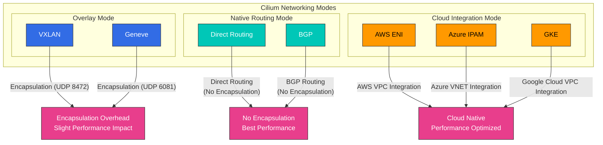
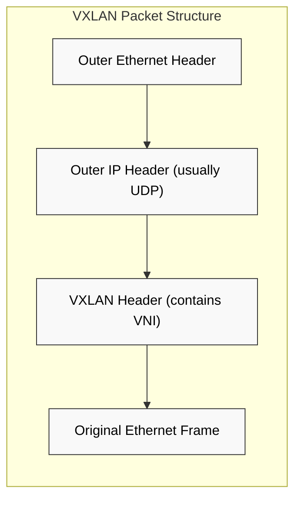
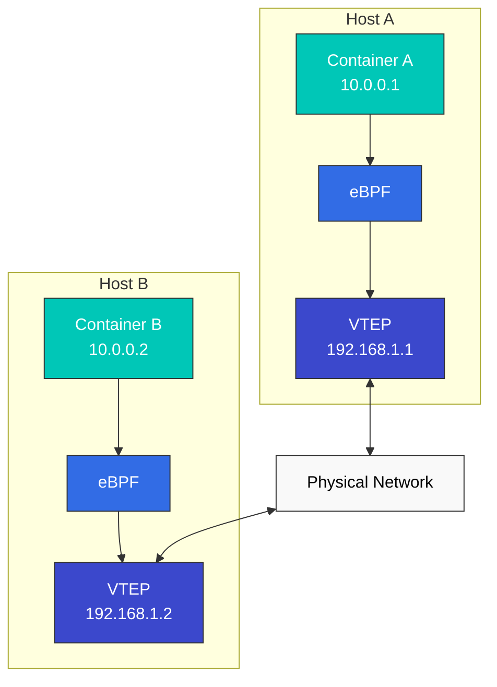

# Modelos de networking y VXLAN

> **Versiones compatibles**: Cilium 1.18
> **Última actualización**: February 22, 2026

## Configuración del entorno de laboratorio

Para seguir los ejemplos de este documento, necesitas las siguientes herramientas y entorno:

### Herramientas necesarias
- kubectl v1.31 o superior
- Un clúster Kubernetes en funcionamiento (EKS, minikube, kind, etc.)
- Cilium CLI
- tcpdump, wireshark (para el análisis de paquetes de red)

### Instalación de herramientas de análisis de red

```bash
# Install tcpdump
sudo apt-get update
sudo apt-get install -y tcpdump

# Cilium network packet capture
kubectl exec -n kube-system -it $(kubectl get pods -n kube-system -l k8s-app=cilium -o jsonpath='{.items[0].metadata.name}') -- cilium monitor -v

# VXLAN traffic analysis
sudo tcpdump -i any udp port 8472 -vv
```

## Comparación de modelos de networking de Container

Los modelos de networking de Container definen cómo se comunican los Container entre sí. Cada modelo tiene ventajas y desventajas en cuanto a rendimiento, escalabilidad, seguridad y complejidad de implementación.

### Principales modelos de networking:

1. **Modelo de red Host**:
   - El Container comparte el namespace de red del Host
   - El mejor rendimiento, pero con posibilidad de conflictos de puertos
   - Aislamiento de seguridad limitado

2. **Modelo de red Bridge**:
   - Los Container se conectan mediante un bridge virtual dentro del Host
   - Eficiente para la comunicación entre Container en el mismo Host
   - Se necesitan mecanismos adicionales para la comunicación entre Host

3. **Modelo de red Overlay**:
   - Construye una red virtual sobre la red física
   - Usa encapsulación para la comunicación entre Host
   - Flexible, pero con una ligera sobrecarga de rendimiento

4. **Modelo de red Underlay**:
   - Utiliza directamente la infraestructura de red física
   - El mejor rendimiento con una sobrecarga mínima
   - Dependiente de la configuración de la red física

### Comparación de modelos de networking:

| Modelo | Rendimiento | Escalabilidad | Seguridad | Complejidad de implementación | Casos de uso |
|-------|-------------|-------------|----------|---------------------------|-----------|
| Host | Muy alto | Bajo | Baja | Baja | Cargas de trabajo de alto rendimiento, Container único |
| Bridge | Alto | Media | Media | Media | Deployments de Host único |
| Overlay | Medio | Alta | Alta | Alta | Clústeres con varios Host |
| Underlay | Alto | Media | Media | Muy alta | Entornos de producción centrados en el rendimiento |

### Modos de networking de Cilium



## Análisis detallado de la tecnología VXLAN

> **Concepto clave**: VXLAN (Virtual Extensible LAN) es una tecnología de virtualización de red que superpone una red de Capa 2 sobre una red de Capa 3.

VXLAN es una tecnología de virtualización de red que superpone una red de Capa 2 sobre una red de Capa 3. Se utiliza ampliamente en entornos cloud para ampliar el número de segmentos de red y admitir entornos multi-tenant.

### Conceptos básicos de VXLAN:

- **Segmento VXLAN**: Segmento L2 lógico identificado por el VXLAN Network Identifier (VNI)
- **VXLAN Tunnel Endpoint (VTEP)**: Responsable de la encapsulación y desencapsulación de paquetes VXLAN
- **VNI (VXLAN Network Identifier)**: Admite hasta 16,777,216 (2^24) segmentos de red únicos
- **Encapsulación**: Encapsula la trama L2 original en un paquete UDP

### Estructura de paquetes VXLAN:

```
+-------------------------------+
| Outer Ethernet Header         |
+-------------------------------+
| Outer IP Header (usually IPv4)|
+-------------------------------+
| Outer UDP Header (port 8472)  |
+-------------------------------+
| VXLAN Header (contains VNI)   |
+-------------------------------+
| Original Ethernet Frame       |
| (Inner Ethernet Header +      |
|  Payload)                     |
+-------------------------------+
```

### Ejemplo de configuración de Cilium VXLAN

```yaml
apiVersion: v1
kind: ConfigMap
metadata:
  name: cilium-config
  namespace: kube-system
data:
  tunnel: "vxlan"
  enable-ipv4: "true"
  enable-ipv6: "false"
  ipv4-range: "10.0.0.0/16"
  ipv4-service-range: "10.96.0.0/12"
```

Esta configuración indica a Cilium que establezca la comunicación entre Pod dentro del clúster mediante tunneling VXLAN. Cada nodo actúa como un VTEP y encapsula el tráfico de Pod en paquetes VXLAN para transmitirlos a otros nodos.



### Funcionamiento de VXLAN:

1. **Encapsulación**: El VTEP de origen encapsula la trama L2 original con un header VXLAN
2. **Transmisión**: El paquete encapsulado se envía al VTEP de destino a través de la red IP
3. **Desencapsulación**: El VTEP de destino elimina el header VXLAN y extrae la trama L2 original
4. **Entrega**: La trama L2 original se entrega al endpoint de destino

### VXLAN frente a otras tecnologías Overlay:

| Tecnología | Encapsulación | Máximo de redes | Puerto | Ventajas | Desventajas |
|------------|---------------|--------------|------|------------|---------------|
| VXLAN | L2 sobre UDP | 16,777,216 (2^24) | 4789 | Amplio soporte, escalabilidad a gran escala | Sobrecarga (50 bytes) |
| GENEVE | Header de longitud variable | 16,777,216 (2^24) | 6081 | Metadatos extensibles | Más reciente, soporte limitado |
| GRE | IP sobre IP | Ilimitado | Protocolo IP 47 | Baja sobrecarga | Problemas al atravesar firewalls |
| NVGRE | L2 sobre GRE | 16,777,216 (2^24) | Protocolo IP 47 | Integración con entornos Microsoft | Offload de hardware limitado |

## Networking Overlay de Cilium

Cilium usa VXLAN de forma predeterminada para implementar networking Overlay, pero también admite otros protocolos de encapsulación como Geneve. El networking Overlay de Cilium aprovecha eBPF para proporcionar una ruta de datos optimizada.

### Arquitectura de red Overlay de Cilium:



### Funcionamiento del networking Overlay de Cilium:

1. **Generación de paquetes**: El Container A envía un paquete al Container B
2. **Procesamiento eBPF**: El programa eBPF intercepta el paquete y aplica políticas
3. **Identificación de VTEP**: Identifica el VTEP del Container de destino
4. **Encapsulación**: Encapsula el paquete con un header VXLAN
5. **Transmisión**: Envía el paquete encapsulado al Host de destino a través de la red física
6. **Desencapsulación**: Elimina el header VXLAN en el Host de destino
7. **Procesamiento eBPF**: El programa eBPF en el Host de destino procesa el paquete
8. **Entrega**: Entrega el paquete al Container de destino

### Optimizaciones de red Overlay de Cilium:

- **Ruta directa**: Usa direct routing cuando es posible
- **DSR (Direct Server Return)**: Optimización para respuestas con load balancing
- **Omisión de Connection Tracking**: Omite el seguimiento de conexiones conocidas
- **Integración de XDP**: Aprovecha XDP para el procesamiento temprano de paquetes
- **Optimización de Header Push/Pop**: Manejo eficiente de headers

### Configuración de red Overlay de Cilium:

```yaml
# cilium-config.yaml
apiVersion: v1
kind: ConfigMap
metadata:
  name: cilium-config
  namespace: kube-system
data:
  # Enable overlay mode
  tunnel: "vxlan"

  # VXLAN port setting (default: 8472)
  tunnel-port: "8472"

  # MTU setting
  mtu: "1450"

  # Auto direct node routes
  auto-direct-node-routes: "true"
```

## Técnicas de optimización del rendimiento

Cilium proporciona varias técnicas de optimización del rendimiento para minimizar la latencia de red y maximizar el throughput.

### Optimización del modo de red:

1. **Modo Direct Routing**:
   - Usa direct routing sin encapsulación Overlay
   - Mejora del rendimiento al eliminar la sobrecarga de encapsulación
   - Requiere una red enrutable entre Host

2. **Modo híbrido**:
   - Usa direct routing cuando es posible y Overlay en caso contrario
   - Equilibrio entre flexibilidad y rendimiento

3. **Modo Native Routing**:
   - Se integra con la infraestructura de red existente
   - Aprovecha protocolos de routing como BGP

### Optimización de la ruta de datos:

1. **Uso de XDP**:
   - Procesamiento de paquetes en una etapa temprana del stack de red
   - Mejora del rendimiento al descartar antes los paquetes innecesarios

2. **Optimización de mapas eBPF**:
   - Estructura de mapas eficiente y ajuste de tamaño
   - Optimización del uso de memoria con mapas LRU (Least Recently Used)

3. **Optimización de Connection Tracking**:
   - Ajuste del tamaño de la tabla de seguimiento de conexiones
   - Omisión de Connection Tracking para conexiones conocidas

4. **Load Balancing basado en Socket**:
   - Load balancing a nivel de Socket
   - Reducción de la sobrecarga de procesamiento de paquetes

### Optimización a nivel de sistema:

1. **Afinidad de CPU**:
   - Vincula el procesamiento de red a cores de CPU específicos
   - Mejora la localidad de caché y reduce los cambios de contexto

2. **Consciencia de NUMA**:
   - Consciencia de la topología NUMA (Non-Uniform Memory Access)
   - Optimización del acceso a memoria local

3. **Ajuste de interrupciones**:
   - Optimización del procesamiento de interrupciones de red
   - Coalescencia y distribución de interrupciones

4. **Huge Pages**:
   - Reducción de la sobrecarga de gestión de memoria
   - Reducción de fallos de TLB (Translation Lookaside Buffer)

## Mecanismos de routing

Cilium admite dos mecanismos de routing principales: Encapsulation y Native-Routing.

### 1. Encapsulación

La encapsulación es un método para transmitir el paquete original envolviéndolo dentro de otro paquete. Cilium admite protocolos de encapsulación como VXLAN y Geneve.

**Cómo funciona**:
1. Se genera un paquete en el nodo de origen.
2. Cilium encapsula el paquete envolviendo el paquete original con un header de encapsulación.
3. El paquete encapsulado se envía al nodo de destino a través de la red física.
4. En el nodo de destino, Cilium desencapsula el paquete para extraer el paquete original.
5. El paquete extraído se entrega al Container de destino.

**Ventajas**:
- Compatibilidad con la infraestructura de red existente
- Independencia de la topología de red
- Prevención de conflictos de IP en entornos multi-cluster

**Desventajas**:
- Impacto en el rendimiento debido a la sobrecarga de encapsulación
- Tamaño de MTU reducido
- Uso adicional de CPU

### 2. Native-Routing

El native routing es un método que usa direct routing sin encapsulación. En este modo, la infraestructura de red subyacente debe poder enrutar direcciones IP de Pod.

**Cómo funciona**:
1. Cada nodo anuncia el bloque CIDR de los Pod que se ejecutan en ese nodo.
2. Las tablas de routing se configuran para enrutar cada bloque CIDR de Pod al nodo correspondiente.
3. Los paquetes se enrutan directamente al nodo de destino sin encapsulación.

**Ventajas**:
- Sin sobrecarga de encapsulación
- Mejor rendimiento de red
- Menor uso de CPU

**Desventajas**:
- Dependencia de la infraestructura de red subyacente
- Restricciones de topología de red
- Complejidad de la gestión de direcciones IP

## Networking específico de proveedores cloud

Cilium se integra con características de networking de diversos proveedores cloud.

### 1. AWS ENI (Elastic Network Interface)

En el modo AWS ENI, Cilium usa AWS Elastic Network Interfaces para asignar direcciones IP VPC nativas a los Pod.

**Características clave**:
- Asignación de direcciones IP VPC nativas a los Pod
- Networking VPC nativo sin red Overlay
- Integración de AWS security group y network policy
- Mejor rendimiento de red

### 2. Networking de Google Cloud

En Google Kubernetes Engine (GKE), Cilium se integra con características de networking de Google Cloud.

**Características clave**:
- Asignación de direcciones IP nativas de GCP VPC
- Integración de reglas de firewall de GCP
- Optimización de networking de GKE

## Laboratorio: configuración del modo de networking de Cilium y pruebas de rendimiento

### Configuraciones de distintos modos de networking:

```bash
# VXLAN overlay mode configuration
cilium install --config tunnel=vxlan

# Geneve overlay mode configuration
cilium install --config tunnel=geneve

# Direct routing mode configuration
cilium install --config tunnel=disabled --config auto-direct-node-routes=true

# Hybrid mode configuration
cilium install --config tunnel=vxlan --config auto-direct-node-routes=true
```

### Pruebas de rendimiento de red:

```bash
# Deploy test pods
kubectl apply -f https://raw.githubusercontent.com/cilium/cilium/master/examples/kubernetes/connectivity-check/connectivity-check.yaml

# Latency test
kubectl exec -it pod/netperf-client -- netperf -H netperf-server -t TCP_RR

# Throughput test
kubectl exec -it pod/netperf-client -- netperf -H netperf-server -t TCP_STREAM

# Connection establishment speed test
kubectl exec -it pod/netperf-client -- netperf -H netperf-server -t TCP_CRR
```

[Volver a la página principal](README.md)

## Cuestionario

Para comprobar lo que aprendiste en este capítulo, prueba el [cuestionario del tema](../../quizzes/networking/cilium/03-networking-quiz.md).
