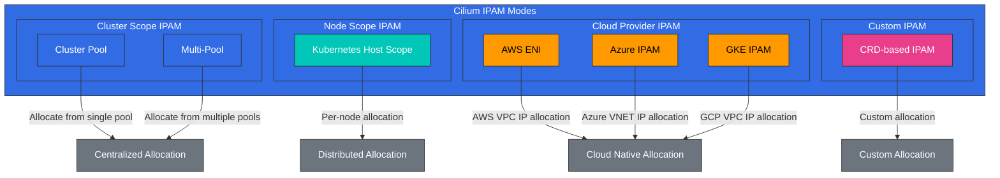

# IPAM y Network Policies

> **Versiones compatibles**: Cilium 1.18
> **Última actualización**: February 23, 2026

## Configuración del entorno de laboratorio

Para seguir los ejemplos de este documento, necesitas las siguientes herramientas y entorno:

### Herramientas necesarias
- kubectl v1.31 o superior
- Un clúster de Kubernetes funcional (EKS, minikube, kind, etc.)
- Cilium CLI

### Configuración del laboratorio de IPAM y Network Policy

```bash
# Check Cilium status
cilium status --wait

# Check current IPAM configuration
kubectl -n kube-system get configmap cilium-config -o yaml | grep -E 'ipam|allocator'

# Create namespace for network policy testing
kubectl create namespace policy-test

# Deploy test application
kubectl -n policy-test apply -f https://raw.githubusercontent.com/cilium/cilium/v1.14/examples/minikube/http-sw-app.yaml
```

## Estrategias de gestión de direcciones IP (IPAM)

> **Concepto clave**: IPAM (IP Address Management) es un sistema responsable de asignar, rastrear y gestionar direcciones IP.

IPAM es un sistema responsable de asignar, rastrear y gestionar direcciones IP. Cilium admite varios modos de IPAM que se pueden configurar de forma flexible para adaptarse a distintos entornos y requisitos.

### Arquitectura de IPAM de Cilium



### Modos de IPAM de Cilium:

1. **Cluster Pool**:
   - Modo de IPAM predeterminado
   - Asignación centralizada de direcciones IP en todo el clúster
   - Permite configurar uno o varios IP pools
   - Sencillo y fácil de usar

2. **Kubernetes Host Scope**:
   - Asigna un rango de direcciones IP a cada node
   - El node asigna direcciones IP desde su propio rango
   - No se necesita coordinación central
   - Evita conflictos de IP entre nodes

3. **CRD-based IPAM**:
   - Definición de IP pool mediante el recurso personalizado CiliumIPPool
   - Asigna IP pools a namespaces o Pods específicos
   - Gestión granular de direcciones IP
   - Gestión dinámica de IP pools

4. **AWS ENI (Elastic Network Interface)**:
   - Integración con AWS VPC ENI
   - Asigna direcciones IP nativas de VPC a los Pods
   - Redes nativas de VPC sin red overlay
   - Optimizado para el entorno de AWS

5. **Azure IPAM**:
   - Integración con Azure VNET
   - Asigna direcciones IP nativas de VNET a los Pods
   - Optimizado para el entorno de Azure

### Componentes de IPAM:

- **IP Pool**: Rango de direcciones IP disponible para la asignación
- **IP Allocation**: Asignación de direcciones IP a endpoints
- **IP Release**: Recuperación de direcciones IP no utilizadas
- **IP Conflict Detection**: Prevención de conflictos de direcciones IP
- **IP Reservation**: Reserva de direcciones IP para fines específicos

### Consideraciones de IPAM:

- **Tamaño del espacio de direcciones**: Número de direcciones IP necesarias
- **Segmentación de red**: Diseño de subredes y bloques CIDR
- **Escalabilidad**: Consideración del crecimiento futuro

### Ejemplo de configuración de IPAM

Configuración de IPAM de Cluster Pool:
```yaml
apiVersion: v1
kind: ConfigMap
metadata:
  name: cilium-config
  namespace: kube-system
data:
  ipam: "cluster-pool"
  cluster-pool-ipv4-cidr: "10.0.0.0/16"
  cluster-pool-ipv4-mask-size: "24"
  enable-ipv4: "true"
  enable-ipv6: "false"
```

Configuración de IPAM de AWS ENI:
```yaml
apiVersion: v1
kind: ConfigMap
metadata:
  name: cilium-config
  namespace: kube-system
data:
  ipam: "eni"
  enable-ipv4: "true"
  enable-ipv6: "false"
  eni-tags: "{\"cluster\": \"eks-cluster\"}"
  ec2-api-endpoint: "ec2.us-west-2.amazonaws.com"
```
- **Integración con la nube**: Integración con las redes del proveedor de nube
- **IPv4 frente a IPv6**: Configuración de pila única o doble pila

## Integración de IPAM de Kubernetes y Cilium

Cilium se integra estrechamente con Kubernetes para asignar y gestionar direcciones IP para Pods y Services.

### Flujo de integración de IPAM de Kubernetes:

1. **Creación de Pod**: Kubernetes solicita la creación de un Pod
2. **Llamada de CNI**: kubelet llama al plugin CNI de Cilium
3. **Solicitud de asignación de IP**: Cilium solicita una dirección IP al módulo de IPAM
4. **Asignación de IP**: IPAM asigna una dirección IP disponible
5. **Configuración de red**: Cilium configura el namespace de red del Pod
6. **Almacenamiento de estado**: Se almacena la información de asignación de IP
7. **Inicio de Pod**: El Pod se inicia con la red configurada

### Configuración de Cluster Pool de Cilium:

```yaml
# cilium-config.yaml
apiVersion: v1
kind: ConfigMap
metadata:
  name: cilium-config
  namespace: kube-system
data:
  # Cluster pool IPAM mode
  ipam: "cluster-pool"

  # IPv4 CIDR range
  cluster-pool-ipv4-cidr: "10.0.0.0/8"
  cluster-pool-ipv4-mask-size: "24"

  # IPv6 CIDR range (optional)
  cluster-pool-ipv6-cidr: "fd00::/104"
  cluster-pool-ipv6-mask-size: "120"

  # Enable dual stack
  enable-ipv4: "true"
  enable-ipv6: "true"
```

### Ejemplo de IPAM basado en CRD:

```yaml
# cilium-ippool.yaml
apiVersion: "cilium.io/v2alpha1"
kind: CiliumIPPool
metadata:
  name: "production-pool"
spec:
  ipv4:
    cidr: "10.10.0.0/16"
    blockSize: 27  # 32 IP address blocks
  selector:
    matchLabels:
      environment: production
```

### Configuración de IPAM de AWS ENI:

```yaml
# cilium-aws-config.yaml
apiVersion: v1
kind: ConfigMap
metadata:
  name: cilium-config
  namespace: kube-system
data:
  # AWS ENI IPAM mode
  ipam: "eni"

  # AWS ENI configuration
  enable-endpoint-routes: "true"
  auto-create-cilium-node-resource: "true"

  # ENI tags (optional)
  eni-tags: "{\"team\": \"platform\"}"

  # Prefix delegation (optional)
  enable-prefix-delegation: "true"
  eni-prefix-delegation-enabled: "true"
```

## Análisis detallado de los modos de IPAM

### 1. Alcance de clúster - Modo predeterminado

Cluster Scope IPAM es el modo de IPAM predeterminado de Cilium y asigna direcciones IP de forma centralizada en todo el clúster.

**Características clave**:
- Asignación centralizada de direcciones IP
- Garantiza la unicidad de las direcciones IP en todo el clúster
- Permite configurar uno o varios IP pools
- Sencillo y fácil de usar

**Cómo funciona**:
1. El agente de Cilium asigna direcciones IP desde el IP pool de todo el clúster.
2. Las direcciones IP asignadas se almacenan en CRDs de Kubernetes.
3. La información de asignación de direcciones IP se comparte entre todos los nodes del clúster.

### 2. Kubernetes Host Scope

Kubernetes Host Scope IPAM asigna rangos de direcciones IP a cada node, y los nodes asignan direcciones IP desde su propio rango.

**Características clave**:
- Asignación de rangos de direcciones IP por node
- No se necesita coordinación central
- Evita conflictos de IP entre nodes
- Escalabilidad mejorada

**Cómo funciona**:
1. Kubernetes asigna un PodCIDR a cada node.
2. Cilium asigna direcciones IP desde el PodCIDR del node.
3. Cada node gestiona de forma independiente su propio rango de direcciones IP.

### 3. Multi-Pool - Beta

Multi-Pool IPAM permite definir varios IP pools y asignar pools específicos a cargas de trabajo específicas.

**Características clave**:
- Definir y gestionar varios IP pools
- Asignar IP pools por namespace, Pod o node
- Gestión granular de direcciones IP
- Compatibilidad con diversos requisitos de red

**Cómo funciona**:
1. Define varios IP pools mediante el CRD CiliumIPPool.
2. Usa selectores para asignar pools específicos a cargas de trabajo específicas.
3. Cilium asigna direcciones IP desde el pool adecuado de acuerdo con las reglas definidas.

### 4. Azure IPAM

Azure IPAM se integra con Azure VNET para asignar direcciones IP nativas de VNET a los Pods.

**Características clave**:
- Asignación de direcciones IP nativas de Azure VNET
- Integración con Azure network security group
- Optimización de redes de Azure

### 5. Azure Delegated IPAM

Azure Delegated IPAM es un modo que delega la gestión de direcciones IP en Azure CNI.

**Características clave**:
- Integración con Azure CNI
- Asignación de direcciones IP gestionada por Azure
- Aprovecha las características de red de Azure

### 6. IPAM basado en CRD

IPAM basado en CRD utiliza CRDs de Kubernetes para gestionar la asignación de direcciones IP.

**Características clave**:
- Gestión de direcciones IP mediante CRDs de Kubernetes
- Asignación declarativa de direcciones IP
- Integración con flujos de trabajo nativos de Kubernetes

**Cómo funciona**:
1. La información del IP pool se almacena en el CRD CiliumNode.
2. El agente de Cilium lee la información de asignación de direcciones IP desde el CRD.
3. El estado de asignación de direcciones IP se actualiza en el CRD.

## Consulta de PodCIDRs por node mediante CiliumNode CR

En el modo de IPAM `cluster-pool` de Cilium, la información de asignación de CIDR de Pod para cada node se registra en el **CiliumNode CR**. Este CR sirve como fuente autoritativa para la configuración de rutas estáticas, la depuración de IPAM y la resolución de problemas de red.

> **Nota**: El `spec.podCIDR` del objeto Kubernetes Node puede diferir de `spec.ipam.podCIDRs` del CiliumNode CR. En entornos de Cilium, usa siempre el CiliumNode CR como fuente de referencia.

### Estructura de CiliumNode CR (campos clave)

```yaml
apiVersion: cilium.io/v2
kind: CiliumNode
metadata:
  name: hybrid-node-001
spec:
  addresses:
  - ip: 10.80.1.10        # Node IP (used as next hop for static routes)
    type: InternalIP
  ipam:
    podCIDRs:
    - 10.85.0.0/25         # Pod CIDR allocated to this node
```

- **`spec.addresses[].ip`**: La dirección IP real del node. Se utiliza como siguiente salto al configurar rutas estáticas.
- **`spec.ipam.podCIDRs`**: Lista de CIDRs de Pod asignados a este node por Cilium Operator.

### Comandos de consulta

```bash
# List all CiliumNodes
kubectl get ciliumnodes

# Query node IP and PodCIDR in table format
kubectl get ciliumnodes -o custom-columns='\
NAME:.metadata.name,\
NODE_IP:.spec.addresses[0].ip,\
POD_CIDR:.spec.ipam.podCIDRs[0]'
```

Salida de ejemplo:

```
NAME                NODE_IP       POD_CIDR
hybrid-node-001     10.80.1.10    10.85.0.0/25
hybrid-node-002     10.80.1.11    10.85.0.128/25
hybrid-node-003     10.80.1.12    10.85.1.0/25
```

### Uso en scripts

```bash
# Extract routing table information using jq
kubectl get ciliumnodes -o json | jq -r \
  '.items[] | "\(.metadata.name)\t\(.spec.addresses[0].ip)\t\(.spec.ipam.podCIDRs[0])"'

# Auto-generate static route commands (useful for EKS Hybrid Nodes, etc.)
kubectl get ciliumnodes -o json | jq -r \
  '.items[] | "ip route add \(.spec.ipam.podCIDRs[0]) via \(.spec.addresses[0].ip)"'
```

> **Caso de uso**: Esta información se utiliza para configurar rutas estáticas sin BGP en entornos de EKS Hybrid Nodes. Para más detalles, consulta [EKS Hybrid Nodes - Configuración de red](../../eks-hybrid-nodes/02-network-configuration.md).

## Diseño e implementación de Network Policy

Las Network Policies de Cilium proporcionan un mecanismo potente para controlar la comunicación entre microservicios en las capas L3-L7. Estas políticas amplían la API NetworkPolicy de Kubernetes para proporcionar un control más granular.

### Conceptos básicos de Network Policy:

- **Endpoint Selector**: Define los endpoints a los que se aplica la política
- **Ingress Rules**: Controla el tráfico entrante
- **Egress Rules**: Controla el tráfico saliente
- **L3/L4 Policy**: Filtrado basado en direcciones IP y puertos
- **L7 Policy**: Filtrado con reconocimiento de protocolos de capa de aplicación

### Ejemplo de Network Policy L3/L4:

```yaml
# l3-l4-policy.yaml
apiVersion: "cilium.io/v2"
kind: CiliumNetworkPolicy
metadata:
  name: "l3-l4-policy"
spec:
  endpointSelector:
    matchLabels:
      app: backend
  ingress:
  - fromEndpoints:
    - matchLabels:
        app: frontend
    toPorts:
    - ports:
      - port: "8080"
        protocol: TCP
  egress:
  - toEndpoints:
    - matchLabels:
        app: database
    toPorts:
    - ports:
      - port: "3306"
        protocol: TCP
```

### Ejemplo de política HTTP L7:

```yaml
# l7-http-policy.yaml
apiVersion: "cilium.io/v2"
kind: CiliumNetworkPolicy
metadata:
  name: "l7-http-policy"
spec:
  endpointSelector:
    matchLabels:
      app: backend
  ingress:
  - fromEndpoints:
    - matchLabels:
        app: frontend
    toPorts:
    - ports:
      - port: "8080"
        protocol: TCP
      rules:
        http:
        - method: "GET"
          path: "/api/v1/users"
        - method: "POST"
          path: "/api/v1/users"
          headers:
          - "Content-Type: application/json"
```

### Ejemplo de política Kafka L7:

```yaml
# l7-kafka-policy.yaml
apiVersion: "cilium.io/v2"
kind: CiliumNetworkPolicy
metadata:
  name: "l7-kafka-policy"
spec:
  endpointSelector:
    matchLabels:
      app: kafka-broker
  ingress:
  - fromEndpoints:
    - matchLabels:
        app: kafka-client
    toPorts:
    - ports:
      - port: "9092"
        protocol: TCP
      rules:
        kafka:
        - apiKey: "Produce"
          topic: "allowed-topic-1"
        - apiKey: "Fetch"
          topic: "allowed-topic-1"
        - apiKey: "CreateTopics"
          topic: "allowed-topic-.*"
          apiVersions: ["0", "1"]
```

### Ejemplo de política basada en DNS:

```yaml
# dns-policy.yaml
apiVersion: "cilium.io/v2"
kind: CiliumNetworkPolicy
metadata:
  name: "dns-policy"
spec:
  endpointSelector:
    matchLabels:
      app: client
  egress:
  - toEndpoints:
    - matchLabels:
        "k8s:io.kubernetes.pod.namespace": kube-system
        "k8s:k8s-app": kube-dns
    toPorts:
    - ports:
      - port: "53"
        protocol: UDP
      - port: "53"
        protocol: TCP
  - toFQDNs:
    - matchName: "api.example.com"
    - matchPattern: "*.googleapis.com"
    toPorts:
    - ports:
      - port: "443"
        protocol: TCP
```

### Prácticas recomendadas de Network Policy:

1. **Aplicar una política Default Deny**:
   - Bloquea todo el tráfico que no esté explícitamente permitido
   - Aplica el principio de mínimo privilegio

2. **Enfoque gradual**:
   - Comienza con el modo de observación para evaluar el impacto
   - Aplica y refuerza las políticas gradualmente

3. **Usar selectores basados en labels**:
   - Usa selectores basados en labels en lugar de direcciones IP
   - Proporciona flexibilidad en entornos dinámicos

4. **Capas de políticas**:
   - Combina políticas base y políticas específicas
   - Separación de responsabilidades y mantenibilidad

5. **Pruebas y validación de políticas**:
   - Prueba antes de aplicar la política
   - Validación y monitorización continuas de las políticas

## Escenarios multiclúster

Cilium proporciona características potentes para redes y seguridad en varios clústeres de Kubernetes. Esto permite la comunicación de Services entre clústeres, la aplicación de Network Policies y el balanceo de carga.

### Modelos de conectividad multiclúster:

1. **Global Services**:
   - Expone Services en varios clústeres
   - Balanceo de carga entre clústeres
   - Failover automático y alta disponibilidad

2. **Cluster Mesh**:
   - Conectividad directa entre clústeres
   - Network Policies entre clústeres
   - Observabilidad unificada

3. **Remote Nodes**:
   - Muestra nodes de clústeres remotos como locales
   - Comunicación transparente entre clústeres
   - Simulación de un único namespace de red

### Arquitectura de Cilium Cluster Mesh:

```
+-------------------+        +-------------------+
| Cluster A         |        | Cluster B         |
|                   |        |                   |
| +---------------+ |        | +---------------+ |
| | Service A     | |        | | Service B     | |
| | (Global)      | |        | | (Global)      | |
| +-------+-------+ |        | +-------+-------+ |
|         |         |        |         |         |
|     +---v---+     |        |     +---v---+     |
|     | eBPF  |     |        |     | eBPF  |     |
|     +---+---+     |        |     +---+---+     |
|         |         |        |         |         |
| +-------v-------+ |        | +-------v-------+ |
| | Cilium        | |<------>| | Cilium        | |
| | Clustermesh   | |        | | Clustermesh   | |
| +---------------+ |        | +---------------+ |
|                   |        |                   |
+-------------------+        +-------------------+
```

### Configuración de Cilium Cluster Mesh:

```bash
# Enable Cluster Mesh on Cluster A
cilium clustermesh enable --context cluster-a

# Enable Cluster Mesh on Cluster B
cilium clustermesh enable --context cluster-b

# Connect clusters
cilium clustermesh connect --context cluster-a --destination-context cluster-b

# Check status
cilium clustermesh status --context cluster-a
```

### Definición de Global Service:

```yaml
# global-service.yaml
apiVersion: v1
kind: Service
metadata:
  name: global-service
  annotations:
    io.cilium/global-service: "true"
spec:
  selector:
    app: global-app
  ports:
  - port: 80
    targetPort: 8080
  type: ClusterIP
```

### Network Policy entre clústeres:

```yaml
# cross-cluster-policy.yaml
apiVersion: "cilium.io/v2"
kind: CiliumNetworkPolicy
metadata:
  name: "cross-cluster-policy"
spec:
  endpointSelector:
    matchLabels:
      app: backend
  ingress:
  - fromEndpoints:
    - matchLabels:
        app: frontend
        io.kubernetes.pod.namespace: frontend-ns
        io.cilium.k8s.policy.cluster: cluster-a
    toPorts:
    - ports:
      - port: "8080"
        protocol: TCP
```

[Volver a la página principal](README.md)

## Cuestionario

Para comprobar lo que aprendiste en este capítulo, prueba el [cuestionario del tema](../../quizzes/networking/cilium/04-ipam-policy-quiz.md).
