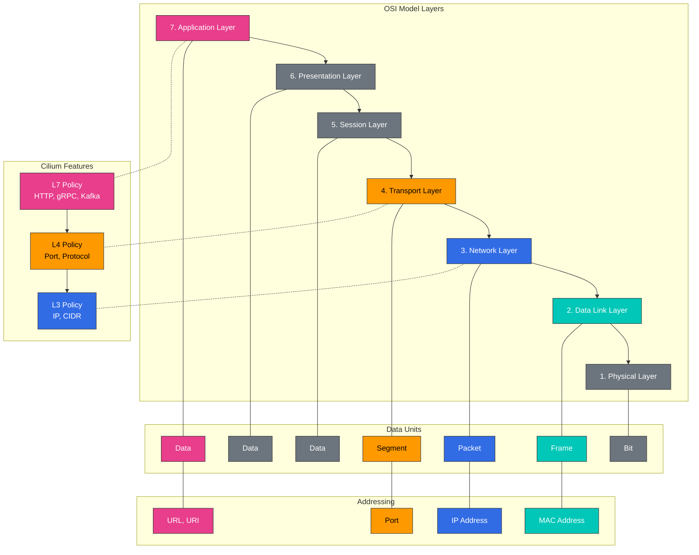

# Redes L2-L7 y balanceo de carga

> **Versiones compatibles**: Cilium 1.18
> **Última actualización**: February 22, 2026

## Configuración del entorno de laboratorio

Para seguir los ejemplos de este documento, necesita las siguientes herramientas y entorno:

### Herramientas necesarias
- kubectl v1.31 o superior
- Un clúster de Kubernetes funcional (EKS, minikube, kind, etc.)
- Cilium CLI
- curl, jq (para pruebas de API)

### Configuración del entorno de pruebas de políticas L7

```bash
# Create test namespace
kubectl create namespace l7-test

# Deploy sample application
kubectl -n l7-test apply -f https://raw.githubusercontent.com/cilium/cilium/v1.14/examples/kubernetes/l7-policy/l7-application.yaml

# Verify deployment
kubectl -n l7-test get pods,svc

# Deploy test client
kubectl -n l7-test run client --image=curlimages/curl --restart=Never -- sleep 3600

# Basic connectivity test
kubectl -n l7-test exec client -- curl -s app1-service/public
```

## Comprensión de las capas del modelo OSI (L2, L3, L4, L7)

> **Concepto clave**: El modelo OSI (Open Systems Interconnection) es un modelo conceptual que clasifica la comunicación de red en 7 capas de abstracción.

El modelo OSI es un modelo conceptual que clasifica la comunicación de red en 7 capas de abstracción. Cilium proporciona características de red y seguridad en estas diversas capas.

### Diagrama de capas del modelo OSI



### Capas del modelo OSI:

1. **Capa física (L1)**:
   - Medio físico para la transmisión de bits
   - Define las características eléctricas, mecánicas y funcionales
   - Ejemplos: cables, switches, repetidores

2. **Capa de enlace de datos (L2)**:
   - Direccionamiento físico (dirección MAC)
   - Formato de trama y control de flujo
   - Ejemplos: Ethernet, switches, bridges

3. **Capa de red (L3)**:
   - Direccionamiento lógico (dirección IP)
   - Enrutamiento y reenvío de paquetes
   - Ejemplos: IP, routers, ICMP

4. **Capa de transporte (L4)**:
   - Conexión y fiabilidad de extremo a extremo
   - Direccionamiento basado en puertos
   - Ejemplos: TCP, UDP, puertos

5. **Capa de sesión (L5)**:
   - Establecimiento, gestión y terminación de sesiones
   - Control de diálogo y sincronización
   - Ejemplos: NetBIOS, RPC

6. **Capa de presentación (L6)**:
   - Conversión y cifrado de formato de datos
   - Compresión y codificación de datos
   - Ejemplos: SSL/TLS, JPEG, ASCII

7. **Capa de aplicación (L7)**:
   - Interfaz de usuario y servicios de aplicación
   - Protocolos y APIs
   - Ejemplos: HTTP, DNS, FTP, gRPC

### Características clave de cada capa:

| Capa | Direccionamiento | Unidad | Dispositivo/Protocolo | Característica de Cilium |
|-------|------------|------|-----------------|----------------|
| L2 | Dirección MAC | Trama | Switch, Bridge | Gestión de ARP, filtrado MAC |
| L3 | Dirección IP | Paquete | Router, IP | Enrutamiento IP, política basada en CIDR |
| L4 | Puerto | Segmento | TCP, UDP | Filtrado basado en puertos, seguimiento de conexiones |
| L7 | URL, método | Mensaje | HTTP, gRPC, Kafka | Filtrado con reconocimiento de API, enrutamiento basado en encabezados |

### Ejemplo de política L7

El siguiente es un ejemplo de una política L7 de Cilium que filtra el tráfico según métodos y rutas HTTP:

```yaml
apiVersion: cilium.io/v2
kind: CiliumNetworkPolicy
metadata:
  name: l7-policy
  namespace: l7-test
spec:
  endpointSelector:
    matchLabels:
      app: app1
  ingress:
  - fromEndpoints:
    - matchLabels:
        app: client
    toPorts:
    - ports:
      - port: "80"
        protocol: TCP
      rules:
        http:
        - method: "GET"
          path: "/public"
        - method: "POST"
          path: "/api/v1"
          headers:
          - "X-Auth-Token: ^[a-zA-Z0-9]{32}$"
```

Esta política permite:
1. Solicitudes GET a la ruta `/public`
2. Solicitudes POST a la ruta `/api/v1` (con un encabezado X-Auth-Token válido)

Todas las demás solicitudes se bloquean.
| L7 | URI, método | Mensaje | HTTP, gRPC, Kafka | Filtrado con reconocimiento de API, inspección de encabezados |

## Características de Cilium específicas por capa

Cilium proporciona características en varias capas de red, desde L2 hasta L7, para ofrecer una solución integral de red y seguridad.

### Características de L2 (capa de enlace de datos):

- **Gestión de ARP**: Gestión de Address Resolution Protocol
- **Filtrado de direcciones MAC**: Filtrado basado en direcciones MAC
- **Etiquetado VLAN**: Gestión de etiquetas de LAN virtual
- **Modo bridge**: Compatibilidad con el modo bridge de L2
- **Modo promiscuo**: Captura de todo el tráfico

### Características de L3 (capa de red):

- **Enrutamiento IP**: Enrutamiento de paquetes IP
- **Política basada en CIDR**: Filtrado basado en rangos de direcciones IP
- **Fragmentación IP**: Gestión de fragmentos de paquetes IP
- **Gestión de ICMP**: Gestión de mensajes ICMP
- **Multicast**: Compatibilidad con multicast IP

### Características de L4 (capa de transporte):

- **Filtrado basado en puertos**: Filtrado basado en puertos TCP/UDP
- **Seguimiento de conexiones**: Seguimiento del estado de las conexiones
- **Gestión de opciones TCP**: Gestión de opciones y flags TCP
- **Balanceo de carga basado en sockets**: Balanceo de carga a nivel de socket
- **Afinidad de sesión**: Mantenimiento de sesiones persistentes

### Características de L7 (capa de aplicación):

- **Filtrado HTTP**: Filtrado basado en métodos, rutas y encabezados HTTP
- **Filtrado gRPC**: Filtrado basado en métodos y metadatos gRPC
- **Filtrado Kafka**: Filtrado basado en topics y operaciones Kafka
- **Filtrado DNS**: Filtrado basado en consultas y respuestas DNS
- **Inspección TLS**: Filtrado basado en certificados TLS y SNI

### Integración entre capas:

Cilium integra características entre varias capas para proporcionar una solución integral de red y seguridad:

- **Política L3/L4 + L7**: Combina el filtrado basado en IP/puertos con el filtrado de capa de aplicación
- **Compatibilidad multiprotocolo**: Compatible con varios protocolos como HTTP, gRPC y Kafka
- **Aplicación de políticas por capas**: Aplica políticas en varias capas
- **Observabilidad unificada**: Monitorización y visibilidad del tráfico en todas las capas

## Integración de Service Mesh

Cilium se integra con service meshes como Istio para proporcionar una potente solución de red, seguridad y observabilidad para arquitecturas de microservicios.

### Arquitectura de integración de Cilium-Istio:

```
+-------------------+
| Service Mesh      |
| Control Plane     |
| (Istio Pilot)     |
+--------+----------+
         |
         v
+-------------------+
| Envoy Proxy       |
| (Sidecar)         |
+--------+----------+
         |
         v
+-------------------+
| Cilium eBPF       |
| (Data Plane)      |
+-------------------+
```

### Beneficios de la integración de Cilium-Istio:

1. **Mejora del rendimiento**:
   - Latencia reducida mediante la omisión del sidecar Envoy
   - Ruta de datos optimizada basada en eBPF

2. **Seguridad mejorada**:
   - Aplicación de políticas a nivel de kernel
   - Integración de políticas de seguridad L3-L7

3. **Observabilidad mejorada**:
   - Monitorización y tracing unificados
   - Visibilidad del flujo de red

4. **Simplificación operativa**:
   - Modelo coherente de red y seguridad
   - Eliminación de características redundantes

### Configuración de Cilium-Istio:

```bash
# Cilium installation (with Istio integration enabled)
cilium install --config enable-envoy-config=true --config enable-l7-proxy=true

# Istio installation
istioctl install --set profile=default

# Enable Istio sidecar auto-injection
kubectl label namespace default istio-injection=enabled

# Verify Cilium-Istio integration
cilium status --verbose
```

### Combinación de Istio Virtual Service con una política de Cilium:

```yaml
# istio-virtual-service.yaml
apiVersion: networking.istio.io/v1alpha3
kind: VirtualService
metadata:
  name: reviews-route
spec:
  hosts:
  - reviews
  http:
  - match:
    - headers:
        end-user:
          exact: jason
    route:
    - destination:
        host: reviews
        subset: v2
  - route:
    - destination:
        host: reviews
        subset: v1
---
# cilium-l7-policy.yaml
apiVersion: "cilium.io/v2"
kind: CiliumNetworkPolicy
metadata:
  name: "reviews-policy"
spec:
  endpointSelector:
    matchLabels:
      app: reviews
  ingress:
  - fromEndpoints:
    - matchLabels:
        app: productpage
    toPorts:
    - ports:
      - port: "9080"
        protocol: TCP
      rules:
        http:
        - method: "GET"
          path: "/reviews/.*"
```

## Arquitectura de balanceo de carga

Cilium aprovecha eBPF para proporcionar una solución de balanceo de carga eficiente y escalable. Puede funcionar como reemplazo de kube-proxy para los servicios de Kubernetes.

### Modos de balanceo de carga de Cilium:

1. **Modo DSR (Direct Server Return)**:
   - El tráfico de respuesta omite el balanceador de carga y va directamente al cliente
   - Elimina el cuello de botella del balanceador de carga
   - Optimizado para gestionar respuestas grandes

2. **Modo SNAT (Source Network Address Translation)**:
   - Traduce la dirección IP de origen a la IP del balanceador de carga
   - Útil cuando no se necesita conservar la IP del cliente
   - Comportamiento similar al kube-proxy existente

3. **Modo híbrido**:
   - Usa el modo DSR o SNAT según la situación
   - Equilibrio entre flexibilidad y rendimiento

### Componentes de balanceo de carga de Cilium:

- **Service Map**: Mapeo de IP:puerto de Service a Pods de backend
- **Backend Map**: Almacenamiento de información de Pods de backend
- **Reverse NAT Map**: Seguimiento de conexiones y gestión de respuestas
- **Socket LB**: Balanceo de carga a nivel de socket
- **Aceleración XDP**: Aceleración temprana del procesamiento de paquetes

### Cilium frente a kube-proxy:

| Característica | Cilium | kube-proxy |
|---------|--------|------------|
| Implementación | eBPF | iptables/IPVS |
| Rendimiento | Alto | Medio/Bajo |
| Escalabilidad | Alta | Media |
| Seguimiento de conexiones | Opcional | Siempre habilitado |
| Compatibilidad con DSR | Compatibilidad nativa | Limitada (solo modo IPVS) |
| LB a nivel de socket | Compatible | No compatible |
| Reconocimiento de L7 | Compatible | No compatible |
| Observabilidad | Alta | Limitada |

### Configuración de balanceo de carga de Cilium:

```yaml
# cilium-config.yaml
apiVersion: v1
kind: ConfigMap
metadata:
  name: cilium-config
  namespace: kube-system
data:
  # Enable kube-proxy replacement
  kube-proxy-replacement: "strict"

  # Enable DSR mode
  enable-dsr: "true"

  # External service load balancing
  enable-external-ips: "true"

  # NodePort acceleration
  enable-node-port: "true"

  # XDP acceleration
  enable-xdp-acceleration: "true"
```

## Enmascaramiento

El enmascaramiento es el proceso de traducir direcciones IP de red internas a direcciones IP diferentes al comunicarse con redes externas. Cilium admite varias configuraciones y modos de implementación de enmascaramiento.

### 1. Configuración de enmascaramiento

En Cilium, el enmascaramiento se utiliza para los siguientes fines:
- Ocultar las direcciones IP internas del clúster de las redes externas
- Proporcionar acceso a servicios fuera del clúster
- Implementar Network Address Translation (NAT)

**Opciones de configuración**:
- `enable-ipv4-masquerade`: Habilitar/deshabilitar el enmascaramiento IPv4
- `enable-ipv6-masquerade`: Habilitar/deshabilitar el enmascaramiento IPv6
- `masquerade-all`: Habilitar el enmascaramiento para todo el tráfico
- `masquerade-interfaces`: Especificar interfaces a las que aplicar el enmascaramiento

**Ejemplo de configuración**:
```yaml
# cilium-masquerade-config.yaml
apiVersion: v1
kind: ConfigMap
metadata:
  name: cilium-config
  namespace: kube-system
data:
  enable-ipv4-masquerade: "true"
  enable-ipv6-masquerade: "false"
  masquerade-all: "false"
  ipv4-native-routing-cidr: "10.0.0.0/8"
```

### 2. Modos de implementación

Cilium admite dos modos de implementación de enmascaramiento: basado en iptables y basado en eBPF.

**Enmascaramiento basado en iptables**:
- Implementa el enmascaramiento mediante reglas iptables tradicionales
- Compatible con todas las distribuciones Linux
- Limitaciones de rendimiento en entornos grandes

**Enmascaramiento basado en eBPF**:
- Implementa el enmascaramiento mediante programas eBPF
- Rendimiento y escalabilidad mejorados
- Requiere un kernel Linux reciente

**Ejemplo de configuración**:
```yaml
# cilium-ebpf-masquerade-config.yaml
apiVersion: v1
kind: ConfigMap
metadata:
  name: cilium-config
  namespace: kube-system
data:
  enable-ipv4-masquerade: "true"
  enable-bpf-masquerade: "true"  # Enable eBPF-based masquerading
```

## Gestión de fragmentos IPv4

Los fragmentos IPv4 son paquetes IP que se han dividido en varios paquetes más pequeños porque superan la MTU (Maximum Transmission Unit). Cilium proporciona diversos mecanismos para gestionar fragmentos IPv4.

### 1. Mecanismos de gestión de fragmentos

Cilium admite los siguientes mecanismos de gestión de fragmentos IPv4:
- **Seguimiento de fragmentos**: Rastrear y reensamblar fragmentos
- **Coincidencia de fragmentos**: Decisiones de política basadas en el primer fragmento
- **Enrutamiento basado en LPM (Longest Prefix Match)**: Enrutamiento eficiente para fragmentos

### 2. Configuración relacionada con fragmentos

Cilium proporciona varias opciones de configuración para la gestión de fragmentos IPv4:
- `enable-ipv4-fragment-tracking`: Habilitar/deshabilitar el seguimiento de fragmentos IPv4
- `fragment-tracking-timeout`: Establecer el tiempo de espera para el seguimiento de fragmentos
- `max-fragments-per-flow`: Establecer el máximo de fragmentos por flujo

**Ejemplo de configuración**:
```yaml
# cilium-fragment-config.yaml
apiVersion: v1
kind: ConfigMap
metadata:
  name: cilium-config
  namespace: kube-system
data:
  enable-ipv4-fragment-tracking: "true"
  fragment-tracking-timeout: "60"  # in seconds
  max-fragments-per-flow: "10"
```

### 3. Consideraciones sobre la gestión de fragmentos

Consideraciones al gestionar fragmentos IPv4:
- **Impacto en el rendimiento**: El seguimiento y reensamblaje de fragmentos consume recursos adicionales.
- **Impacto en la seguridad**: Los fragmentos pueden utilizarse para eludir las políticas de seguridad.
- **Optimización de MTU**: Es mejor optimizar la MTU para evitar la fragmentación.
- **Path MTU Discovery**: Se puede habilitar PMTUD para evitar la fragmentación.

**Prácticas recomendadas**:
- Configure la MTU de forma coherente para evitar la fragmentación cuando sea posible.
- Al utilizar redes overlay, ajuste la MTU considerando la sobrecarga de encapsulación.
- Habilite el seguimiento de fragmentos para evitar ataques basados en fragmentos.
- Considere la gestión de fragmentos en las políticas de red.

## Laboratorio: configuración de balanceo de carga y enmascaramiento

### 1. Configuración del modo de reemplazo de kube-proxy:

```bash
# Enable kube-proxy replacement mode
cilium install --config kube-proxy-replacement=strict

# Check status
cilium status --verbose
```

### 2. Configuración del modo DSR:

```bash
# Enable DSR mode
cilium install --config enable-dsr=true

# Create service
kubectl create deployment echo --image=cilium/json-mock
kubectl expose deployment echo --port=8080 --target-port=80

# Test service
kubectl run client --rm -it --image=busybox -- wget -O- echo:8080
```

### 3. Configuración de enmascaramiento:

```bash
# Enable eBPF-based masquerading
cilium install --config enable-ipv4-masquerade=true --config enable-bpf-masquerade=true

# Test external service access
kubectl run client --rm -it --image=busybox -- wget -O- google.com
```

### 4. Configuración de gestión de fragmentos IPv4:

```bash
# Enable fragment tracking
cilium install --config enable-ipv4-fragment-tracking=true

# MTU setting
cilium install --config mtu=1450
```

[Volver a la página principal](README.md)

## Cuestionario

Para comprobar lo que aprendió en este capítulo, pruebe el [cuestionario del tema](../../quizzes/networking/cilium/05-l2-l7-networking-quiz.md).
