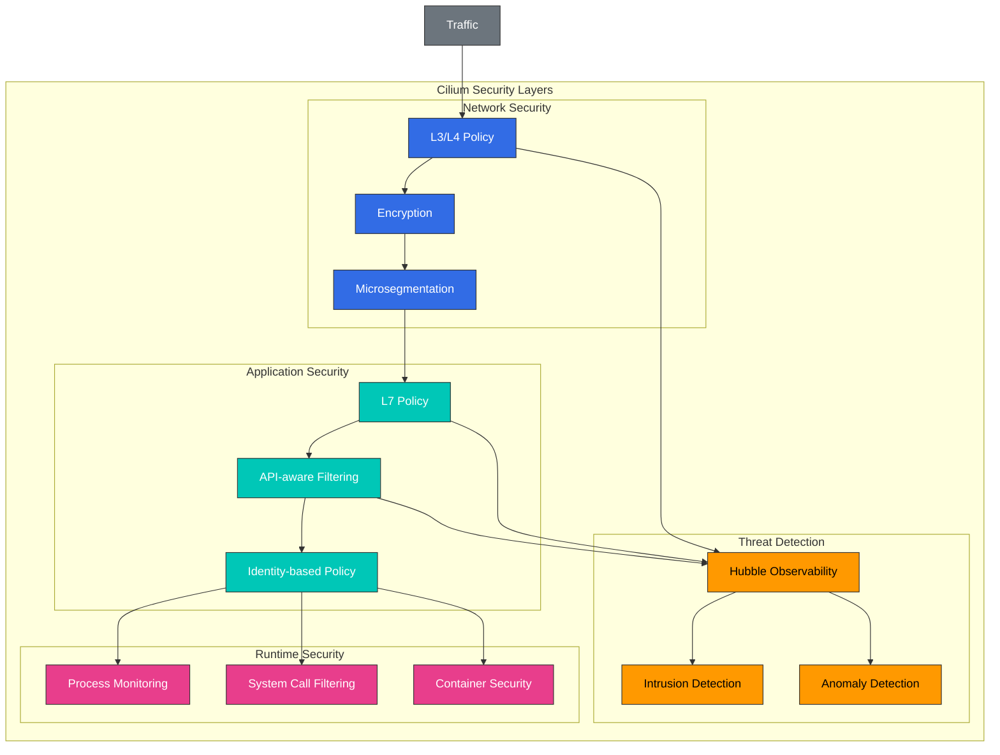

# Seguridad y visibilidad

> **Versiones compatibles**: Cilium 1.18
> **Última actualización**: February 22, 2026

## Configuración del entorno de laboratorio

Para seguir los ejemplos de este documento, necesitas las siguientes herramientas y entorno:

### Herramientas necesarias
- kubectl v1.31 o superior
- Un clúster de Kubernetes funcional (EKS, minikube, kind, etc.)
- Cilium CLI
- Hubble CLI

### Instalación y configuración de Hubble

```bash
# Enable Hubble
cilium hubble enable --ui

# Install Hubble CLI
export HUBBLE_VERSION=$(curl -s https://raw.githubusercontent.com/cilium/hubble/master/stable.txt)
curl -L --remote-name-all https://github.com/cilium/hubble/releases/download/$HUBBLE_VERSION/hubble-linux-amd64.tar.gz
tar xzvfC hubble-linux-amd64.tar.gz /usr/local/bin
rm hubble-linux-amd64.tar.gz

# Set up Hubble port forwarding
cilium hubble port-forward &

# Verify Hubble connection
hubble status
```

## Características de seguridad de Cilium

Cilium aprovecha eBPF para proporcionar potentes características de seguridad para entornos con contenedores. Estas características proporcionan seguridad integral desde la capa de red hasta la capa de aplicación.

### Arquitectura de seguridad de Cilium



### Características de seguridad de red:

1. **Microsegmentación**:
   - Evita el movimiento lateral mediante Network Policies granulares
   - Aplica el principio de mínimo privilegio
   - Restringe la comunicación entre Services

2. **Cifrado**:
   - Cifrado IPsec o WireGuard entre nodos
   - Protección de datos en tránsito
   - Implementación de cifrado transparente

3. **Detección de amenazas**:
   - Detección de actividad de red anómala
   - Identificación de patrones de ataque conocidos
   - Alertas y respuesta en tiempo real

4. **Seguridad DNS**:
   - Network Policies basadas en DNS
   - Bloqueo de dominios maliciosos
   - Supervisión de solicitudes DNS

### Características de seguridad de aplicaciones:

1. **Seguridad con reconocimiento de API**:
   - Filtrado basado en métodos, rutas y encabezados HTTP
   - Filtrado basado en métodos y metadatos gRPC
   - Filtrado basado en topics y operaciones de Kafka

2. **Seguridad basada en identidad**:
   - Políticas basadas en la identidad de Service
   - Integración de TLS mutuo (mTLS)
   - Integración de SPIFFE/SPIRE

3. **Seguridad de Runtime**:
   - Supervisión de procesos y llamadas al sistema
   - Detección de escape de contenedores
   - Prevención de escalamiento de privilegios

### Ejemplo de Security Policy:

```yaml
# comprehensive-security-policy.yaml
apiVersion: "cilium.io/v2"
kind: CiliumNetworkPolicy
metadata:
  name: "comprehensive-security"
  namespace: app
spec:
  endpointSelector:
    matchLabels:
      app: backend
  ingress:
  - fromEndpoints:
    - matchLabels:
        app: frontend
    toPorts:
    - ports:
      - port: "8080"
        protocol: TCP
      rules:
        http:
        - method: "GET"
          path: "/api/v1/data"
  egress:
  - toEndpoints:
    - matchLabels:
        app: database
    toPorts:
    - ports:
      - port: "3306"
        protocol: TCP
  - toFQDNs:
    - matchName: "api.example.com"
    toPorts:
    - ports:
      - port: "443"
        protocol: TCP
```

## Visibilidad de red con Hubble

> **Concepto clave**: Hubble es la capa de observabilidad de Cilium que aprovecha eBPF para supervisar y analizar flujos de red en tiempo real.

Hubble es la capa de observabilidad de Cilium que aprovecha eBPF para supervisar y analizar flujos de red en tiempo real. Puede utilizarse para diversos fines, incluidos la resolución de problemas de red, la supervisión de seguridad y el análisis de rendimiento.

```yaml
apiVersion: "cilium.io/v2"
kind: CiliumNetworkPolicy
metadata:
  name: "comprehensive-security"
spec:
  endpointSelector:
    matchLabels:
      app: secure-app
  ingress:
  - fromEndpoints:
    - matchLabels:
        app: authorized-client
        io.kubernetes.pod.namespace: default
    toPorts:
    - ports:
      - port: "8443"
        protocol: TCP
      rules:
        http:
        - method: "GET"
          path: "/api/v1/secure"
          headers:
          - "Authorization: Bearer [a-zA-Z0-9\\.]*"
  egress:
  - toEndpoints:
    - matchLabels:
        k8s:app: kube-dns
        k8s:io.kubernetes.pod.namespace: kube-system
    toPorts:
    - ports:
      - port: "53"
        protocol: UDP
  - toFQDNs:
    - matchName: "api.internal.secure"
    toPorts:
    - ports:
      - port: "443"
        protocol: TCP
  - toCIDR:
    - 10.0.0.0/8
    toPorts:
    - ports:
      - port: "5432"
        protocol: TCP
```

### Configuración de cifrado:

```yaml
# encryption-config.yaml
apiVersion: v1
kind: ConfigMap
metadata:
  name: cilium-config
  namespace: kube-system
data:
  # Enable IPsec encryption
  enable-ipsec: "true"
  ipsec-key-file: /etc/ipsec/keys

  # Or enable WireGuard encryption
  enable-wireguard: "true"

  # Encryption node selection
  encrypt-node: "true"

  # Encryption interface
  encrypt-interface: "eth0"
```

## Visibilidad y supervisión de red

Cilium proporciona capacidades integrales de visibilidad y supervisión de red en entornos con contenedores mediante Hubble. Esto permite la observación y la resolución de problemas de los flujos de red en tiempo real.

### Arquitectura de Hubble:

```
+-------------------+        +-------------------+
| Hubble UI         |        | Grafana           |
+--------+----------+        +--------+----------+
         |                            |
         v                            v
+-------------------+        +-------------------+
| Hubble Relay      |        | Prometheus        |
+--------+----------+        +--------+----------+
         |                            |
         v                            v
+-------------------+        +-------------------+
| Hubble            |<-------| Cilium            |
+-------------------+        +-------------------+
         |                            |
         v                            v
+-------------------+        +-------------------+
| eBPF Maps         |        | Kernel            |
+-------------------+        +-------------------+
```

### Componentes de Hubble:

1. **Hubble Server**:
   - Integrado con el agente de Cilium
   - Recopila datos de flujos de red de los mapas eBPF
   - Proporciona un endpoint de API local

2. **Hubble Relay**:
   - Agrega datos de varios servidores Hubble
   - Proporciona visibilidad en todo el clúster
   - Proporciona un endpoint de API gRPC

3. **Hubble UI**:
   - Visualización de flujos de red
   - Mapas de dependencias de Services
   - Interfaz de consultas interactiva

4. **Hubble CLI**:
   - Interfaz de línea de comandos
   - Consulta y filtrado de flujos de red
   - Herramienta de resolución de problemas

### Instalación de Hubble:

```bash
# Enable Hubble
cilium hubble enable --ui

# Check Hubble status
cilium hubble status

# Hubble UI port forwarding
cilium hubble ui

# Install Hubble CLI
curl -L --remote-name-all https://github.com/cilium/hubble/releases/latest/download/hubble-linux-amd64.tar.gz
sudo tar xzvfC hubble-linux-amd64.tar.gz /usr/local/bin
```

### Ejemplos de uso de Hubble CLI:

```bash
# Observe all network flows
hubble observe

# Filter flows for a specific namespace
hubble observe --namespace default

# Filter HTTP requests
hubble observe --protocol http

# Filter dropped packets
hubble observe --verdict DROPPED

# Filter communication between specific pods
hubble observe --pod app1/pod-1 --to-pod app2/pod-2

# Filter traffic to a specific service
hubble observe --to-service kube-system/kube-dns

# Output in JSON format
hubble observe -o json
```

## Arquitectura y uso de Hubble

Hubble es la capa de observabilidad basada en eBPF de Cilium que proporciona una visibilidad profunda de las redes de contenedores. Hubble proporciona información en tiempo real sobre flujos de red, protocolos de aplicación, eventos de seguridad y más.

### Flujo de datos de Hubble:

1. **Recopilación de datos**:
   - Los programas eBPF capturan eventos de red
   - Extraen metadatos de paquetes
   - Recopilan información de seguimiento de conexiones

2. **Procesamiento de datos**:
   - Generan registros de flujos
   - Análisis de protocolos L7
   - Agregación de métricas

3. **Almacenamiento de datos**:
   - Almacenamiento temporal en ring buffer
   - Compatibilidad con almacenamiento persistente opcional
   - Exportación de métricas

4. **Consulta de datos**:
   - Observación de flujos en tiempo real
   - Filtrado y agregación
   - Visualización y análisis

### Métricas de Hubble:

Hubble recopila diversas métricas para supervisar el rendimiento de la red y el estado de seguridad:

- **Métricas TCP/IP**: Cantidad de conexiones, retransmisiones, RTT
- **Métricas HTTP**: Cantidad de solicitudes, códigos de respuesta, latencia
- **Métricas DNS**: Cantidad de consultas, códigos de respuesta, latencia
- **Métricas de seguridad**: Decisiones de Policy, paquetes descartados, eventos de seguridad
- **Métricas de Service**: Comunicación entre Services, decisiones de balanceo de carga

### Integración con Prometheus:

Hubble se integra con Prometheus para recopilar y supervisar métricas de red:

```yaml
# prometheus-config.yaml
apiVersion: v1
kind: ConfigMap
metadata:
  name: prometheus-config
  namespace: monitoring
data:
  prometheus.yml: |
    global:
      scrape_interval: 15s
    scrape_configs:
      - job_name: 'cilium-hubble'
        static_configs:
          - targets: ['hubble-metrics.cilium.io:9091']
        metrics_path: '/metrics'
```

### Dashboards de Grafana:

Hubble se integra con Grafana para visualizar métricas de red:

1. **Dashboard de resumen de red**:
   - Volumen total de tráfico de red
   - Distribución de protocolos
   - Endpoints con mayor comunicación

2. **Dashboard de mapa de Services**:
   - Visualización de dependencias de Services
   - Análisis de patrones de comunicación
   - Supervisión del estado de Services

3. **Dashboard de seguridad**:
   - Visualización de decisiones de Policy
   - Análisis de paquetes descartados
   - Seguimiento de eventos de seguridad

4. **Dashboard HTTP**:
   - Volumen de solicitudes por endpoint
   - Distribución de códigos de respuesta
   - Distribución de latencia

## Detección de amenazas en tiempo real

Cilium y Hubble aprovechan eBPF para proporcionar capacidades de detección de amenazas en tiempo real. Esto permite detectar y responder a ataques basados en red.

### Tipos de amenazas detectables:

1. **Escaneos de red**:
   - Detección de escaneo de puertos
   - Intentos de enumeración de Services
   - Ataques de fuerza bruta

2. **Patrones de tráfico anómalos**:
   - Aumentos repentinos de tráfico
   - Uso anómalo de protocolos
   - Patrones de conexión anómalos

3. **Violaciones de Policy**:
   - Comunicación no autorizada entre Services
   - Conexiones externas no autorizadas
   - Uso de protocolos no autorizado

4. **Patrones de ataque conocidos**:
   - Intentos de inyección SQL
   - Intentos de XSS (Cross-Site Scripting)
   - Intentos de inyección de comandos

### Configuración de detección de amenazas:

```yaml
# threat-detection-config.yaml
apiVersion: v1
kind: ConfigMap
metadata:
  name: cilium-config
  namespace: kube-system
data:
  # Enable threat detection
  enable-threat-detection: "true"

  # Enable anomaly detection
  enable-anomaly-detection: "true"

  # Alert configuration
  alert-to-slack: "true"
  slack-webhook-url: "https://hooks.slack.com/services/..."

  # Logging configuration
  log-level: "info"
  enable-flow-logs: "true"
```

### Automatización de respuesta a amenazas:

Cilium puede configurar respuestas automáticas a las amenazas detectadas:

1. **Bloqueo automático**:
   - Bloqueo de direcciones IP maliciosas
   - Aislamiento de Pods anómalos
   - Bloqueo de dominios maliciosos

2. **Rate Limiting**:
   - Limitación de solicitudes excesivas
   - Limitación de cantidad de conexiones
   - Limitación de ancho de banda

3. **Alertas y registro**:
   - Alertas a Slack, PagerDuty, etc.
   - Reenvío de registros a sistemas de registro centralizados
   - Integración con Security Information and Event Management (SIEM)

### Supervisión de detección de amenazas:

```bash
# Monitor dropped packets
hubble observe --verdict DROPPED

# Monitor policy violations
hubble observe --verdict POLICY_DENIED

# Monitor HTTP errors
hubble observe --protocol http --http-status 4.. --http-status 5..

# Monitor traffic from specific IP
hubble observe --ip 10.0.0.1

# Set up real-time threat alerts
hubble observe --verdict DROPPED --output json | jq -c 'select(.verdict.reason == "Policy denied")' | webhook-forwarder
```

## Laboratorio: instalación y uso de Hubble

### 1. Instalación y configuración de Hubble:

```bash
# Enable Hubble
cilium hubble enable --ui

# Check Hubble status
cilium hubble status

# Access Hubble UI
cilium hubble ui
```

### 2. Aplicación y supervisión de Network Policies:

```bash
# Apply default deny policy
kubectl apply -f - <<EOF
apiVersion: "cilium.io/v2"
kind: CiliumNetworkPolicy
metadata:
  name: "deny-all"
spec:
  endpointSelector: {}
  ingress:
  - {}
  egress:
  - toEndpoints:
    - matchLabels:
        k8s:app: kube-dns
        k8s:io.kubernetes.pod.namespace: kube-system
    toPorts:
    - ports:
      - port: "53"
        protocol: UDP
EOF

# Monitor policy violations
hubble observe --verdict DROPPED
```

### 3. Creación de mapas de dependencias de Services:

```bash
# Deploy test application
kubectl apply -f https://raw.githubusercontent.com/cilium/cilium/master/examples/minikube/http-sw-app.yaml

# Generate traffic
kubectl exec -ti deployment/xwing -- curl -s -XPOST deathstar.default.svc.cluster.local/v1/request-landing

# View service map
cilium hubble ui
```

### 4. Supervisión de eventos de seguridad:

```bash
# Monitor security events
hubble observe --type drop --output json

# Monitor security events for specific pod
hubble observe --pod app=deathstar --verdict DROPPED

# Security event statistics
hubble observe --verdict DROPPED --output json | jq -c '.verdict.reason' | sort | uniq -c
```

[Volver a la página principal](README.md)

## Cuestionario

Para comprobar lo que aprendiste en este capítulo, prueba el [cuestionario del tema](../../quizzes/networking/cilium/06-security-visibility-quiz.md).
