# Temas avanzados y casos reales

> **Versiones compatibles**: Cilium 1.18
> **Última actualización**: February 22, 2026

## Configuración del entorno de laboratorio

Para seguir los ejemplos de este documento, necesitas las siguientes herramientas y entorno:

### Herramientas necesarias
- kubectl v1.31 o superior
- Un clúster de Kubernetes funcional (EKS, minikube, kind, etc.)
- Cilium CLI
- Helm v3.10 o superior
- Herramientas de monitoreo del sistema (sysstat, htop, bpftool)

### Configuración del entorno de pruebas de rendimiento

```bash
# Create performance testing namespace
kubectl create namespace perf-test

# Deploy test application
kubectl -n perf-test apply -f - <<EOF
apiVersion: apps/v1
kind: Deployment
metadata:
  name: load-generator
  namespace: perf-test
spec:
  replicas: 2
  selector:
    matchLabels:
      app: load-generator
  template:
    metadata:
      labels:
        app: load-generator
    spec:
      containers:
      - name: wrk
        image: skandyla/wrk
        command: ["sleep", "infinity"]
EOF

# Monitor system status
kubectl -n kube-system exec -it $(kubectl -n kube-system get pods -l k8s-app=cilium -o jsonpath='{.items[0].metadata.name}') -- cilium status --verbose
```

## Ajuste de rendimiento y solución de problemas

> **Concepto clave**: Para optimizar el rendimiento de Cilium, debes ajustar adecuadamente los parámetros del kernel, los tamaños de los mapas eBPF, la asignación de recursos y los modos de red.

Comprender cómo optimizar el rendimiento de Cilium y resolver problemas comunes es importante para operar Cilium de manera eficaz en entornos de producción.

### Arquitectura de ajuste de rendimiento

```mermaid
flowchart TD
    subgraph "Cilium Performance Tuning Areas"
        direction TB

        subgraph "Kernel Parameters"
            TCP[TCP Parameters]
            Conntrack[Connection Tracking]
            ARP[ARP Cache]
            Memory[Memory Management]
        end

        subgraph "eBPF Maps"
            CTMap[Connection Tracking Map]
            NATMap[NAT Map]
            PolicyMap[Policy Map]
            EndpointMap[Endpoint Map]
        end

        subgraph "Resource Allocation"
            CPULimit[CPU Limits]
            MemLimit[Memory Limits]
            PodPriority[Pod Priority]
            NodeAffinity[Node Affinity]
        end

        subgraph "Networking Mode"
            DirectRouting[Direct Routing]
            Overlay[Overlay]
            KubeProxy[kube-proxy Replacement]
            XDP[XDP Acceleration]
        end
    end

    Performance[Performance Optimization] --> TCP & Conntrack & ARP & Memory
    Performance --> CTMap & NATMap & PolicyMap & EndpointMap
    Performance --> CPULimit & MemLimit & PodPriority & NodeAffinity
    Performance --> DirectRouting & Overlay & KubeProxy & XDP

    classDef kernel fill:#326CE5,stroke:#333,stroke-width:1px,color:white;
    classDef ebpf fill:#00C7B7,stroke:#333,stroke-width:1px,color:white;
    classDef resource fill:#FF9900,stroke:#333,stroke-width:1px,color:black;
    classDef network fill:#E83E8C,stroke:#333,stroke-width:1px,color:white;
    classDef perf fill:#6c757d,stroke:#333,stroke-width:1px,color:white;

    class TCP,Conntrack,ARP,Memory kernel;
    class CTMap,NATMap,PolicyMap,EndpointMap ebpf;
    class CPULimit,MemLimit,PodPriority,NodeAffinity resource;
    class DirectRouting,Overlay,KubeProxy,XDP network;
    class Performance perf;
```



### Áreas de ajuste de rendimiento:

1. **Ajuste de parámetros del kernel**:
   - `net.core.somaxconn`: tamaño de la cola de conexiones TCP
   - `net.ipv4.tcp_max_syn_backlog`: tamaño del backlog de SYN
   - `net.ipv4.neigh.default.gc_thresh`: tamaño de la caché ARP
   - `net.netfilter.nf_conntrack_max`: tamaño de la tabla de seguimiento de conexiones

2. **Ajuste de mapas eBPF**:
   - Tamaño del mapa de seguimiento de conexiones
   - Tamaño del mapa NAT
   - Tamaño del mapa de endpoints
   - Tamaño del mapa de políticas

3. **Asignación de recursos**:
   - Solicitudes y límites de CPU del agente de Cilium
   - Solicitudes y límites de memoria del agente de Cilium
   - Asignación de recursos de los componentes de Hubble
   - Asignación de recursos de Node

4. **Selección del modo de red**:
   - Enrutamiento directo frente a overlay
   - Habilitación/deshabilitación de cifrado
   - Modo de reemplazo de kube-proxy
   - Aceleración XDP

### Ejemplo de configuración de ajuste de rendimiento:

```yaml
# performance-tuning.yaml
apiVersion: v1
kind: ConfigMap
metadata:
  name: cilium-config
  namespace: kube-system
data:
  # eBPF map size adjustment
  bpf-map-dynamic-size-ratio: "0.0025"
  bpf-ct-global-any-max: "262144"
  bpf-nat-global-max: "131072"

  # Proxy configuration
  proxy-max-memory-percentage: "30"
  proxy-max-threads: "8"

  # Networking mode
  tunnel: "disabled"
  enable-ipv4: "true"
  enable-ipv6: "false"
  auto-direct-node-routes: "true"

  # kube-proxy replacement
  kube-proxy-replacement: "strict"
  enable-node-port: "true"
  node-port-algorithm: "maglev"

  # XDP acceleration
  enable-xdp: "true"
```

### Escenarios comunes de solución de problemas:

| Problema | Síntomas | Comandos de diagnóstico | Resolución |
|-------|----------|---------------------|------------|
| Mapa de seguimiento de conexiones lleno | Fallos de conexión, pérdida de paquetes | `cilium bpf ct list global` | Aumentar el tamaño del mapa de seguimiento de conexiones |
| Memoria agotada | Finalizaciones OOM, reinicios | `kubectl top pods -n kube-system` | Aumentar los límites de memoria |
| Error de aplicación de políticas | Bloqueo inesperado de conexiones | `cilium policy get` | Depuración de políticas, revisión de logs |
| Problemas de comunicación entre nodos | Fallos de conexión de Pod a Pod | `cilium connectivity test` | Verificar tablas de enrutamiento y reglas de firewall |

### Problemas comunes y soluciones:

1. **Problemas de conexión**:
   - Síntomas: Fallos de conexión de Pod a Pod
   - Diagnóstico: `cilium status`, `cilium endpoint list`, `cilium bpf tunnel list`
   - Resolución: Revisar las políticas de red, verificar el estado de los endpoints y las tablas de enrutamiento

2. **Problemas de aplicación de políticas**:
   - Síntomas: Las políticas de red no funcionan como se espera
   - Diagnóstico: `cilium policy get`, `cilium endpoint get <id>`, `hubble observe`
   - Resolución: Verificar la sintaxis de las políticas, revisar las etiquetas y las prioridades de las políticas

3. **Problemas de rendimiento**:
   - Síntomas: Alta latencia, bajo rendimiento
   - Diagnóstico: `cilium bpf metrics list`, `cilium monitor`, monitoreo de recursos del sistema
   - Resolución: Aumentar la asignación de recursos, ajustar los tamaños de los mapas y los parámetros del kernel

4. **Problemas de actualización**:
   - Síntomas: Pérdida de funcionalidades o errores después de la actualización
   - Diagnóstico: `cilium status`, revisión de logs, comprobación de compatibilidad de versiones
   - Resolución: Actualización escalonada, migración de configuración, plan de reversión

### Comandos de solución de problemas:

```bash
# Check Cilium status
cilium status --verbose

# Check endpoint status
cilium endpoint list
cilium endpoint get <id>

# Check policies
cilium policy get
cilium policy selectors

# Check eBPF maps
cilium bpf metrics list
cilium bpf tunnel list
cilium bpf lb list

# Monitor network flows
cilium monitor
hubble observe --verdict DROPPED

# Check logs
kubectl logs -n kube-system -l k8s-app=cilium
kubectl logs -n kube-system -l k8s-app=hubble-relay
```

## Estrategias de implementación a gran escala

Las estrategias para implementar y gestionar Cilium de manera eficaz en clústeres de Kubernetes a gran escala son importantes para garantizar la estabilidad, el rendimiento y la eficiencia operativa.

### Consideraciones para implementaciones a gran escala:

1. **Planificación del tamaño del clúster**:
   - Número y densidad de Nodes
   - Número y densidad de Pods
   - Número y densidad de Services
   - Número y complejidad de las políticas de red

2. **Asignación de recursos**:
   - Requisitos de CPU y memoria del agente de Cilium
   - Requisitos de recursos de los componentes de Hubble
   - Requisitos de recursos de Node
   - Requisitos de almacenamiento

3. **Arquitectura de red**:
   - Enrutamiento directo frente a overlay
   - Conectividad entre clústeres
   - Integración de servicios externos
   - Estrategia de balanceo de carga

4. **Estrategia operativa**:
   - Monitoreo y alertas
   - Copia de seguridad y recuperación
   - Estrategia de actualización
   - Plan de respuesta ante incidentes

### Arquitectura de implementación a gran escala:

```
+-------------------+        +-------------------+
| Management        |        | Workload          |
| Cluster           |        | Cluster           |
|                   |        |                   |
| +---------------+ |        | +---------------+ |
| | Cilium        | |        | | Cilium        | |
| | Operator      | |        | | Agent         | |
| +---------------+ |        | +---------------+ |
|                   |        |                   |
| +---------------+ |        | +---------------+ |
| | Hubble        | |        | | Hubble        | |
| | Centralized   | |        | | Distributed   | |
| +---------------+ |        | +---------------+ |
|                   |        |                   |
| +---------------+ |        | +---------------+ |
| | Monitoring    | |        | | Workload      | |
| | Dashboard     | |        | | Pods          | |
| +---------------+ |        | +---------------+ |
|                   |        |                   |
+-------------------+        +-------------------+
```

### Mejores prácticas para implementaciones a gran escala:

1. **Despliegue gradual**:
   - Usar despliegues canary
   - Estrategia de despliegue blue/green
   - Preparar planes de reversión
   - Validar los cambios

2. **Automatización**:
   - Implementar flujos de trabajo GitOps
   - Integración de pipelines de CI/CD
   - Pruebas y validación automatizadas
   - Automatización de la gestión de configuración

3. **Monitoreo y alertas**:
   - Recopilación integral de métricas
   - Estrategia de alertas multinivel
   - Dashboards y visualización
   - Agregación y análisis de logs

4. **Recuperación ante desastres**:
   - Copias de seguridad periódicas
   - Procedimientos de recuperación documentados
   - Simulacros de recuperación ante desastres
   - Estrategia multizona/multirregión

### Ejemplo de configuración de implementación a gran escala:

```yaml
# large-scale-cilium.yaml
apiVersion: v1
kind: ConfigMap
metadata:
  name: cilium-config
  namespace: kube-system
data:
  # Large cluster optimization
  cluster-name: "prod-cluster"
  cluster-id: "1"

  # Resource optimization
  preallocate-bpf-maps: "true"
  bpf-map-dynamic-size-ratio: "0.005"

  # Scalability optimization
  enable-endpoint-slice: "true"
  enable-local-node-route: "false"
  auto-direct-node-routes: "true"

  # Operational optimization
  enable-ipv4: "true"
  enable-ipv6: "false"
  enable-ipv4-masquerade: "true"
  enable-bpf-masquerade: "true"

  # Monitoring optimization
  monitor-aggregation: "medium"
  hubble-export-file-max-size-mb: "100"
  hubble-export-file-max-backups: "5"
```

## Estudios de casos de uso reales

Exploremos cómo se utiliza Cilium en diversas industrias y entornos, compartiendo casos de implementación reales y lecciones aprendidas.

### Caso de estudio 1: Plataforma de comercio electrónico a gran escala

**Contexto**:
- Miles de microservicios
- Cientos de Nodes de Kubernetes
- Millones de solicitudes por segundo
- Requisitos estrictos de seguridad

**Desafíos**:
- Proteger la comunicación entre microservicios
- Gestionar políticas de red a gran escala
- Requisitos de alto rendimiento y baja latencia
- Dependencias de servicios complejas

**Implementación de Cilium**:
- Reemplazó kube-proxy por balanceo de carga basado en eBPF
- Protegió los microservicios con políticas L7
- Visibilidad de red mediante Hubble
- Conectividad multiclúster con Cluster Mesh

**Resultados**:
- Reducción del 30 % en la latencia de red
- Aumento del 40 % en el rendimiento
- Reducción del 80 % en los incidentes de seguridad
- Reducción del 50 % en la sobrecarga operativa

### Caso de estudio 2: Institución de servicios financieros

**Contexto**:
- Requisitos estrictos de cumplimiento normativo
- Procesamiento de datos financieros sensibles
- Entorno de nube híbrida
- Modelo de seguridad zero trust

**Desafíos**:
- Control de acceso granular
- Comunicación cifrada
- Informes de auditoría y cumplimiento
- Conectividad multicloud

**Implementación de Cilium**:
- Políticas de red L3-L7 estrictas
- Protección de la comunicación entre Nodes con cifrado WireGuard
- Registro de auditoría integral mediante Hubble
- Conectividad multicloud con Cluster Mesh

**Resultados**:
- Reducción del 70 % en el tiempo de aprobación de auditorías de cumplimiento
- Reducción del 90 % en los errores de configuración de seguridad
- Reducción del 60 % en el tiempo de solución de problemas de red
- Reducción del 80 % en el tiempo de configuración de conectividad multicloud

### Caso de estudio 3: Proveedor de servicios de telecomunicaciones

**Contexto**:
- Virtualización de funciones de red 5G (NFV)
- Implementación de computación en el borde
- Requisitos de alto rendimiento
- Entorno distribuido a gran escala

**Desafíos**:
- Redes de latencia ultrabaja
- Escalabilidad a gran escala
- Conectividad entre ubicaciones de borde
- Entornos con recursos limitados

**Implementación de Cilium**:
- Procesamiento de paquetes de alto rendimiento con aceleración XDP
- Latencia minimizada mediante una ruta de datos optimizada
- Conectividad de ubicaciones de borde con Cluster Mesh
- Mayor eficiencia de recursos con balanceo de carga basado en eBPF

**Resultados**:
- Reducción del 50 % en la latencia de procesamiento de paquetes
- Procesamiento de 10 millones de paquetes por segundo en un único Node
- Reducción del 75 % en el tiempo de configuración de conectividad de ubicaciones de borde
- Reducción del 40 % en el uso de recursos informáticos

## Hoja de ruta futura y dirección de desarrollo

Cilium continúa evolucionando, y la hoja de ruta futura incluye nuevas funcionalidades, mejoras de rendimiento y expansión de casos de uso.

### Dirección del desarrollo tecnológico:

1. **Avance de la tecnología eBPF**:
   - Soporte ampliado para CO-RE (Compile Once, Run Everywhere)
   - Mayor utilización de BTF (BPF Type Format)
   - Nuevas funcionalidades y helpers de eBPF
   - Mejor compatibilidad con versiones del kernel

2. **Mejora de funcionalidades de red**:
   - Mejoras en las redes multiclúster
   - Fortalecimiento de la conectividad híbrida y multicloud
   - Mejora del soporte de IPv6
   - Soporte para nuevos protocolos overlay

3. **Fortalecimiento de las funcionalidades de seguridad**:
   - Detección y prevención avanzadas de amenazas
   - Soporte ampliado para redes zero trust
   - Integración de seguridad en tiempo de ejecución
   - Automatización del cumplimiento

4. **Mejora de la observabilidad**:
   - Integración de trazabilidad distribuida
   - Detección de anomalías basada en machine learning
   - Visualización y análisis avanzados
   - Almacenamiento y análisis de datos a largo plazo

### Integración del ecosistema:

1. **Integración de Service Mesh**:
   - Integración mejorada con Istio, Linkerd, etc.
   - Soporte para service mesh sin sidecar
   - Gestión de políticas unificada
   - Observabilidad unificada

2. **Integración de proveedores de nube**:
   - Integración nativa mejorada con AWS, Azure y GCP
   - Optimización de redes cloud native
   - Integración de servicios de seguridad en la nube
   - Integración de observabilidad en la nube

3. **Integración de frameworks de aplicaciones**:
   - Integración mejorada con Kubernetes
   - Soporte para plataformas serverless
   - Integración con bases de datos y sistemas de mensajería
   - Integración de pipelines de CI/CD

### Expansión de casos de uso:

1. **Computación en el borde**:
   - Optimización para entornos con recursos limitados
   - Conectividad entre el borde y la nube
   - Procesamiento y filtrado de datos locales
   - Seguridad en el borde

2. **5G y telecomunicaciones**:
   - Soporte para virtualización de funciones de red (NFV)
   - Optimización de User Plane Function (UPF)
   - Integración de Mobile Edge Computing (MEC)
   - Soporte para segmentación de red

3. **IoT y sistemas embebidos**:
   - Agente ligero
   - Soporte para entornos con recursos limitados
   - Conectividad entre dispositivos y la nube
   - Seguridad de IoT

4. **Cargas de trabajo de AI/ML**:
   - Optimización de redes GPU
   - Soporte para entrenamiento distribuido
   - Optimización del servicio de modelos
   - Seguridad de pipelines de datos

### Comunidad y ecosistema:

1. **Colaboración de código abierto**:
   - Mayor colaboración con proyectos de CNCF
   - Ampliación de las contribuciones de la comunidad
   - Programas de educación y certificación
   - Grupos de usuarios y eventos

2. **Soporte comercial**:
   - Opciones de soporte de nivel empresarial
   - Ofertas de servicios gestionados
   - Consultoría y servicios profesionales
   - Formación y certificación

3. **Esfuerzos de estandarización**:
   - Participación en la estandarización de eBPF
   - Contribución a estándares de redes y seguridad
   - Mejora de la interoperabilidad
   - Definición de mejores prácticas de la industria

## Nuevas funcionalidades en Cilium 1.18

Cilium 1.18 incorpora mejoras importantes en las áreas de redes, seguridad y observabilidad.

### Mejoras del plano de control BGP

Cilium 1.18 mejora significativamente el plano de control BGP para proporcionar una configuración de enrutamiento más flexible y escalable:

```yaml
apiVersion: cilium.io/v2alpha1
kind: CiliumBGPPeeringPolicy
metadata:
  name: bgp-peering-policy
spec:
  virtualRouters:
  - localASN: 64512
    exportPodCIDR: true
    neighbors:
    - peerAddress: "192.168.1.1/32"
      peerASN: 64513
      connectRetryTimeSeconds: 120
      holdTimeSeconds: 90
      keepAliveTimeSeconds: 30
```

**Mejoras clave**:
- Configuración de pares BGP más granular
- Opciones mejoradas de filtrado de rutas
- Soporte mejorado para BGP multi-hop
- Soporte para BGP Graceful Restart

### Observabilidad de red mejorada

Las nuevas funcionalidades de Hubble proporcionan información más profunda sobre la red:

**Nuevas métricas**:
- Métricas de latencia granulares
- Análisis mejorado de motivos de descarte
- Mejoras en el seguimiento de consultas DNS
- Seguimiento del estado de conexiones TCP

**Análisis de flujos en tiempo real**:
```bash
# Enhanced Hubble queries
hubble observe --protocol tcp --verdict DROPPED --since 1h
hubble observe --dns --type A --from-label app=frontend
hubble observe --http-status 5xx --from-namespace production
```

### Optimización de rendimiento

Cilium 1.18 mejora significativamente el rendimiento en clústeres a gran escala:

**Optimización de memoria**:
- Reducción del 20 % en el uso de memoria de los mapas eBPF
- Mayor eficiencia de memoria con optimización del seguimiento de conexiones
- Gestión de endpoints más eficiente

**Optimización de CPU**:
- Mejora del 15 % en la velocidad de ejecución de programas eBPF
- Mejor rendimiento en la evaluación de políticas de red
- Balanceo de carga de Service más rápido

### Mejoras de seguridad

**Mejoras de las políticas de red**:
```yaml
apiVersion: "cilium.io/v2"
kind: CiliumNetworkPolicy
metadata:
  name: enhanced-l7-policy
spec:
  endpointSelector:
    matchLabels:
      app: backend
  ingress:
  - fromEndpoints:
    - matchLabels:
        app: frontend
    toPorts:
    - ports:
      - port: "8080"
        protocol: TCP
      rules:
        http:
        - method: "GET|POST"
          path: "/api/v1/.*"
          headers:
          - "X-API-Version: 1.0"
```

**Mejoras de cifrado**:
- Mejora del 30 % en el rendimiento del cifrado WireGuard
- Suites de cifrado IPsec ampliadas
- Rotación de claves más rápida

### Mejoras de redes multiclúster

Cilium 1.18 mejora el rendimiento y la estabilidad en escenarios multiclúster:

**Mejoras de ClusterMesh**:
- Descubrimiento de Services entre clústeres más rápido
- Mecanismos de recuperación ante fallos mejorados
- Mejores algoritmos de balanceo de carga
- Mejor propagación de políticas de red entre clústeres

### Soporte para Kubernetes 1.32

Cilium 1.18 admite por completo las nuevas funcionalidades de Kubernetes 1.32:

- Soporte para Gateway API v1.0
- Soporte mejorado para API de Service
- Integración de nuevas funcionalidades de red de Kubernetes

## Conclusión y próximos pasos

A través de este curso intensivo de una semana, hemos explorado de manera integral los conceptos centrales, la arquitectura, las funcionalidades y los casos de uso reales de Cilium. Ahora cuentas con los conocimientos y las herramientas para resolver desafíos de redes, seguridad y observabilidad en entornos contenerizados mediante Cilium.

### Puntos clave de aprendizaje:

- Conceptos básicos y arquitectura de Cilium
- Tecnología eBPF y su uso en Cilium
- Modelos de red y tecnología VXLAN
- IPAM y políticas de red
- Redes L2-L7 y balanceo de carga
- Funcionalidades de seguridad y visibilidad
- Ajuste de rendimiento y solución de problemas
- Estrategias de implementación a gran escala
- Casos de uso reales y dirección del desarrollo futuro

### Próximos pasos:

1. **Práctica y experimentación**:
   - Instalar y configurar Cilium en un entorno de prueba
   - Experimentar con diversos modos y funcionalidades de red
   - Diseñar y probar políticas de red
   - Explorar la visibilidad de red con Hubble

2. **Ampliación de conocimientos**:
   - Estudio profundo de la tecnología eBPF
   - Fortalecer los conceptos de redes de Kubernetes
   - Aprender las mejores prácticas de seguridad de red
   - Explorar patrones de redes cloud native

3. **Participación en la comunidad**:
   - Seguir el repositorio de GitHub de Cilium
   - Unirse al canal de Slack de Cilium
   - Asistir a eventos y webinars de la comunidad
   - Enviar informes de errores o solicitudes de funcionalidades

4. **Planificación de implementación en producción**:
   - Definir requisitos y objetivos
   - Diseñar y validar la arquitectura
   - Establecer un plan de implementación escalonada
   - Desarrollar una estrategia de monitoreo y operación

### Recursos adicionales:

- [Documentación oficial de Cilium](https://docs.cilium.io/)
- [Repositorio de GitHub de Cilium](https://github.com/cilium/cilium)
- [eBPF.io](https://ebpf.io/)
- [Sitio web de CNCF](https://www.cncf.io/)
- [Documentación de redes de Kubernetes](https://kubernetes.io/docs/concepts/cluster-administration/networking/)

Esperamos que este curso haya ayudado a profundizar tu comprensión de Cilium y las redes cloud native. Dado que Cilium continúa evolucionando, es importante seguir aprendiendo sobre los últimos avances y las mejores prácticas.

[Volver a la página principal](README.md)

## Cuestionario

Para comprobar lo que aprendiste en este capítulo, prueba el [Cuestionario del tema](../../quizzes/networking/cilium/07-advanced-topics-quiz.md).
