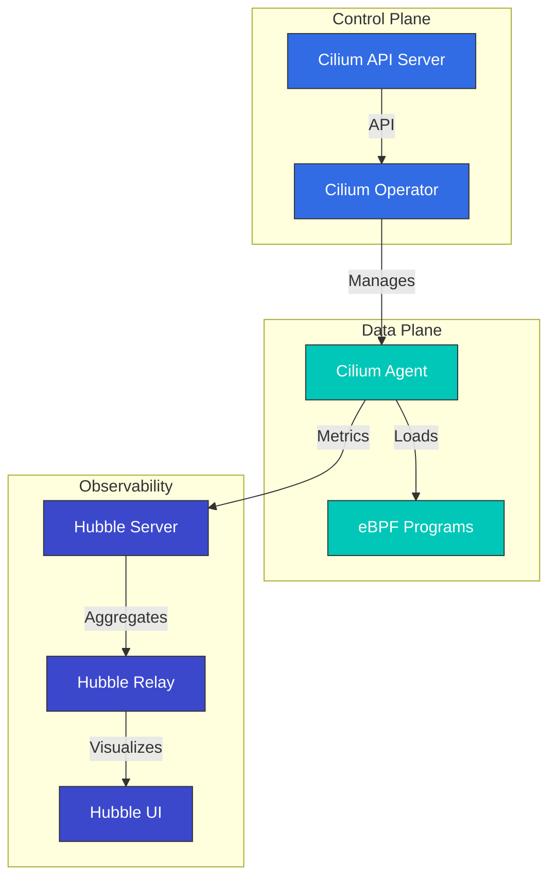

# Análisis detallado de Cilium: el futuro del Cloud Native Networking

## Descripción general

Esta sección proporciona una comprensión integral de los conceptos y tecnologías centrales de Cilium. Exploraremos en profundidad la arquitectura de Cilium, la tecnología eBPF, los modelos de networking, las características de seguridad y más.

> **Versiones compatibles**: Cilium 1.17, 1.18
> **Compatibilidad con Kubernetes**: 1.32 y versiones posteriores
> **Última actualización**: August 24, 2026

### Actualización de julio de 2026: versiones patch y un problema de seguridad de NetworkPolicy

El 16 de julio de 2026, se publicaron las versiones patch Cilium 1.19.6, 1.18.12 y 1.17.18. Junto con nuevo soporte para configurar los registros de acceso de Gateway API (`spec.telemetry.accessLogs` en `CiliumGatewayClassConfig`), corrigen una regresión que podía descartar brevemente conexiones establecidas durante el reinicio/actualización del agente y un error de ClusterMesh donde la anotación `service.cilium.io/affinity: "none"` causaba un agujero negro de tráfico.

Tenga también en cuenta el problema de seguridad **CVE-2026-56743**: en Cilium 1.19.0-1.19.4 con un `clusterName` no predeterminado, una Kubernetes NetworkPolicy que utilizara solo reglas `ipBlock` (sin selectores de Pod/namespace) podía permitir involuntariamente tráfico de otras cargas de trabajo en el mismo namespace. Actualice a 1.19.5 o posterior. Consulte los detalles en el [aviso de seguridad](https://github.com/cilium/cilium/security/advisories/GHSA-fm8w-2m5w-9j7r).

El 21 de julio de 2026, se publicó [Cilium 1.20.0-rc.1](https://github.com/cilium/cilium/releases/tag/v1.20.0-rc.1), el segundo candidato de lanzamiento para la próxima versión menor 1.20, después de rc.0 el 14 de julio.

### Actualización de agosto de 2026: Cilium 1.20.0 GA

El 29 de julio de 2026, se lanzó [Cilium 1.20.0](https://github.com/cilium/cilium/releases/tag/v1.20.0), con más de 2.660 nuevos commits de más de 1.100 contribuidores. Aspectos destacados:

- **Gateway API v1.6.1**: soporte para los recién disponibles de forma general TCPRoute/UDPRoute, `BackendTLSPolicy` para TLS a backends, ListenerSets para la gestión delegada de listeners, un filtro `ExternalAuth` (GEP-1494) y soporte nativo de CORS
- **Networking**: plugins de datapath para extender el datapath de eBPF sin hacer fork, selección automática de netkit (`bpf.datapathMode=auto`) e IP de egress IPv6 para clusters dual-stack
- **IPAM**: IPv6 para AWS ENI IPAM (Beta) y migración in situ de IPAM cluster-pool a multi-pool
- **Services/ClusterMesh**: distribución de tráfico `PreferSameZone`/`PreferSameNode`, backends Maglev ponderados mediante la anotación `service.cilium.io/weight` y soporte estable de la API Multi-Cluster Services (MCS)
- **Seguridad**: soporte para Kubernetes ClusterNetworkPolicy (KCNP) con niveles Admin/Baseline, identidad ztunnel mediante CA interna o SPIRE, y una nueva entidad de política `cluster-mesh`
- **Rendimiento**: el binario `cilium-cni` se redujo de ~77 MB a 16 MB, además de estado agregado de load-balancer y codificación de BPF policy-map optimizada para clusters grandes

Tome medidas durante la actualización si usa Mutual Authentication heredada, extensiones Envoy Go, políticas compatibles con Kafka, la API `CiliumNodeConfig` de `cilium.io/v2alpha1`, la integración libnetwork o una configuración de CNI personalizada; consulte la [guía de actualización](https://docs.cilium.io/en/v1.20/operations/upgrade/#upgrade-notes). La primera versión preliminar del siguiente ciclo, 1.21.0-pre.0, se publicó el 3 de agosto.

### Actualización de agosto de 2026: versiones patch 1.20.1 / 1.19.7 / 1.18.13

El 18 de agosto de 2026, se publicaron versiones patch coordinadas para las tres líneas mantenidas. [1.20.1](https://github.com/cilium/cilium/releases/tag/v1.20.1), el primer patch de la línea 1.20, incluye una revisión de la documentación de Cluster Mesh y correcciones de errores retroportadas desde 1.20.0; [1.19.7](https://github.com/cilium/cilium/releases/tag/v1.19.7) retroporta soporte para los protocolos VRRP e IGMP en el host firewall; y [1.18.13](https://github.com/cilium/cilium/releases/tag/v1.18.13) añade sincronización incremental de recursos Envoy (listeners, network policies, etc.), lo que reduce la carga de CPU y la latencia de actualización de políticas. Se recomienda actualizar al patch más reciente de su línea.

## Mejoras principales en Cilium 1.18

Cilium 1.18 ofrece las siguientes mejoras importantes de características y nuevas capacidades:

### Mejoras de networking
- **BGP Control Plane mejorado**: configuración de BGP más flexible y escalable
- **Mejor routing multi-cluster**: rendimiento de comunicación inter-cluster optimizado
- **Integración mejorada de Service Mesh**: mejor integración con el proxy Envoy

### Mejoras de seguridad
- **Network Policies mejoradas**: control de políticas más granular y mejoras de rendimiento
- **Opciones de cifrado mejoradas**: rendimiento de cifrado WireGuard e IPsec optimizado

### Mejoras de observabilidad
- **Mejoras de Hubble**: métricas e información de tracing más completas
- **Integración mejorada con Prometheus**: nuevas métricas y dashboards
- **Mejor registro de flujos**: información de flujos de red más detallada

### Optimizaciones de rendimiento
- **Optimización de programas eBPF**: procesamiento de paquetes más rápido
- **Mejoras en el uso de memoria**: mayor eficiencia de recursos en clusters de gran escala
- **Optimización del uso de CPU**: menor sobrecarga

## Introducción

Cilium es una solución de networking, seguridad y observabilidad de código abierto para plataformas de gestión de contenedores Linux como Kubernetes, Docker y Mesos. Cilium se basa en la tecnología eBPF (extended Berkeley Packet Filter), y proporciona características de networking y seguridad más potentes y eficientes que los enfoques tradicionales de networking de Linux.

### ¿Qué es eBPF?

eBPF es una tecnología que actúa como una máquina virtual aislada dentro del kernel de Linux, lo que permite ejecutar programas de forma segura dentro del kernel sin modificar su código. Esto permite la ejecución eficiente de diversas tareas como el procesamiento de paquetes de red, la supervisión de llamadas al sistema y el análisis de rendimiento.

Características principales de eBPF:
- Alto rendimiento mediante la ejecución en el espacio del kernel
- Rendimiento nativo mediante la compilación JIT (Just-In-Time)
- Entorno de ejecución seguro (verificación de programas mediante verifier)
- Carga y descarga dinámicas posibles

### Beneficios principales de Cilium

1. **Networking de alto rendimiento**: procesamiento eficiente de paquetes mediante eBPF
2. **Network Policies granulares**: soporte para políticas de red de nivel L3-L7
3. **Cifrado transparente**: cifrado transparente IPsec o WireGuard entre nodos
4. **Load Balancing**: load balancing de alto rendimiento basado en XDP (eXpress Data Path)
5. **Observabilidad**: visibilidad de flujos de red mediante Hubble
6. **Service Mesh**: gestión de tráfico L7 sin sidecars existentes
7. **Networking multi-cluster**: conectividad transparente entre clusters
8. **Soporte de BGP**: integración con redes externas

### Comparación con los CNI existentes

| Característica | Cilium | Calico | Flannel | AWS VPC CNI |
|---------|--------|--------|---------|-------------|
| Modelo de red | eBPF | iptables/IPVS | VXLAN/host-gw | AWS ENI |
| Network Policies | L3-L7 | L3-L4 | Limitado | AWS Security Groups |
| Cifrado | IPsec/WireGuard | IPsec | Ninguno | Ninguno |
| Observabilidad | Hubble | Flow Logs | Limitado | VPC Flow Logs |
| Service Mesh | Integrado | Requiere Istio | Requiere Istio | Requiere Istio/AppMesh |
| Rendimiento | Muy alto | Alto | Medio | Alto |
| Multi-Cluster | Integrado | Limitado | Ninguno | Requiere Transit Gateway |

## Arquitectura

Cilium consta de un data plane basado en eBPF y un control plane integrado con Kubernetes.



### Componentes principales

1. **Cilium Agent**: se ejecuta en cada nodo, carga y administra programas eBPF
2. **Cilium Operator**: administra recursos y operaciones a nivel de cluster
3. **Programas eBPF**: se cargan en el kernel para el procesamiento de paquetes y la aplicación de políticas
4. **Hubble**: proporciona supervisión de flujos de red y observabilidad
5. **Cilium CLI**: herramienta de línea de comandos para la administración de Cilium y Hubble

### Modelos de networking

Cilium admite varios modos de networking:

1. **Direct Routing**: routing directo entre nodos (BGP o routing estático)
2. **Tunneling**: networking overlay mediante túneles VXLAN o Geneve
3. **AWS ENI**: uso de Elastic Network Interface (ENI) en Amazon EKS
4. **Azure IPAM**: uso de Azure IPAM en Azure AKS

### Flujo de paquetes

Cómo se procesan los paquetes en Cilium:

1. El paquete llega a la interfaz de red
2. El programa eBPF XDP realiza el procesamiento inicial (defensa DDoS, load balancing)
3. El programa eBPF TC (Traffic Control) aplica las network policies
4. El paquete se entrega al namespace de red del contenedor
5. Los paquetes de respuesta se procesan mediante una ruta similar

## Integración con Amazon EKS

Hay dos formas principales de usar Cilium en Amazon EKS:

1. **Instalar como Amazon EKS Add-on**: Amazon EKS proporciona Cilium como un add-on administrado.
2. **Instalación manual**: instale directamente mediante el chart de Helm.

### Instalación como Amazon EKS Add-on

```bash
# Install Cilium add-on
aws eks create-addon \
  --cluster-name my-cluster \
  --addon-name cilium \
  --addon-version v1.17.0-eksbuild.1 \
  --service-account-role-arn arn:aws:iam::123456789012:role/AmazonEKSCiliumAddonRole

# Check add-on status
aws eks describe-addon \
  --cluster-name my-cluster \
  --addon-name cilium
```

### Instalación manual con Helm

```bash
# Add Cilium Helm repository
helm repo add cilium https://helm.cilium.io/

# Update Helm repository
helm repo update

# Install Cilium
helm install cilium cilium/cilium \
  --version 1.17.0 \
  --namespace kube-system \
  --set eni.enabled=true \
  --set ipam.mode=eni \
  --set egressMasqueradeInterfaces=eth0 \
  --set tunnel=disabled
```

### Opciones de configuración específicas de EKS

Opciones de configuración clave que se deben considerar al utilizar Cilium con EKS:

1. **Modo ENI**: aproveche el rendimiento de networking nativo de AWS mediante AWS Elastic Network Interface
2. **Modo IPAM**: integración con la administración de direcciones IP de AWS VPC
3. **Cifrado**: cifrado de tráfico entre nodos (WireGuard o IPsec)
4. **NodeLocal DNSCache**: mejora del rendimiento de DNS
5. **Hubble**: habilite la observabilidad de red

### Configuración del modo ENI

```yaml
apiVersion: v1
kind: ConfigMap
metadata:
  name: cilium-config
  namespace: kube-system
data:
  enable-endpoint-routes: "true"
  auto-create-cilium-node-resource: "true"
  ipam: "eni"
  eni-tags: "{\"Owner\": \"Cilium\"}"
  tunnel: "disabled"
  enable-ipv4: "true"
  enable-ipv6: "false"
  egress-masquerade-interfaces: "eth0"
```

### Instalación de Cilium en un EKS Cluster

#### Instalación de Cilium en un EKS Cluster existente

```bash
# Remove AWS CNI
kubectl delete daemonset -n kube-system aws-node

# Install Cilium
cilium install --set eni.enabled=true \
  --set ipam.mode=eni \
  --set egressMasqueradeInterfaces=eth0 \
  --set tunnel=disabled
```

#### Creación de un nuevo EKS Cluster con Cilium CNI

```bash
eksctl create cluster --name cilium-cluster \
  --without-nodegroup

eksctl create nodegroup --cluster cilium-cluster \
  --node-ami-family AmazonLinux2 \
  --node-type m5.large \
  --nodes 3 \
  --max-pods-per-node 110

# Install Cilium
cilium install --set eni.enabled=true \
  --set ipam.mode=eni \
  --set egressMasqueradeInterfaces=eth0 \
  --set tunnel=disabled
```

### Interconexión de EKS Clusters

Interconexión de EKS clusters mediante Cilium Cluster Mesh:

```bash
# On cluster 1
cilium clustermesh enable --service-type LoadBalancer

# On cluster 2
cilium clustermesh enable --service-type LoadBalancer

# Connect clusters
cilium clustermesh connect --context cluster1 --destination-context cluster2
```

## Instalación y configuración

### Requisitos previos

- Kubernetes cluster (v1.16 o posterior)
- Kernel de Linux 4.9 o posterior (recomendado: 5.4 o posterior)
- kubectl configurado
- Helm (opcional)

### Instalar Cilium CLI

```bash
curl -L --remote-name-all https://github.com/cilium/cilium-cli/releases/latest/download/cilium-linux-amd64.tar.gz
sudo tar xzvfC cilium-linux-amd64.tar.gz /usr/local/bin
rm cilium-linux-amd64.tar.gz
```

### Opciones de configuración

#### Configuración del modo de networking

Modo de direct routing:
```bash
cilium install --set tunnel=disabled --set autoDirectNodeRoutes=true
```

Modo VXLAN:
```bash
cilium install --set tunnel=vxlan
```

#### Configuración de reemplazo de kube-proxy

Modo de reemplazo completo:
```bash
cilium install --set kubeProxyReplacement=strict
```

#### Configuración de cifrado

Cifrado WireGuard:
```bash
cilium install --set encryption.enabled=true --set encryption.type=wireguard
```

Cifrado IPsec:
```bash
cilium install --set encryption.enabled=true --set encryption.type=ipsec
```

## Network Policies

Cilium amplía la API Kubernetes NetworkPolicy para proporcionar network policies granulares en niveles L3-L7.

### Network Policy básica

```yaml
apiVersion: networking.k8s.io/v1
kind: NetworkPolicy
metadata:
  name: allow-frontend-to-backend
  namespace: app
spec:
  podSelector:
    matchLabels:
      app: backend
  ingress:
  - from:
    - podSelector:
        matchLabels:
          app: frontend
    ports:
    - port: 8080
      protocol: TCP
```

### Cilium Network Policy

```yaml
apiVersion: cilium.io/v2
kind: CiliumNetworkPolicy
metadata:
  name: allow-specific-http-methods
  namespace: app
spec:
  endpointSelector:
    matchLabels:
      app: backend
  ingress:
  - fromEndpoints:
    - matchLabels:
        app: frontend
    toPorts:
    - ports:
      - port: "8080"
        protocol: TCP
      rules:
        http:
        - method: "GET"
          path: "/api/v1/products"
```

### Política basada en FQDN

```yaml
apiVersion: cilium.io/v2
kind: CiliumNetworkPolicy
metadata:
  name: allow-specific-domains
  namespace: app
spec:
  endpointSelector:
    matchLabels:
      app: web
  egress:
  - toFQDNs:
    - matchName: "api.example.com"
    - matchPattern: "*.amazonaws.com"
    toPorts:
    - ports:
      - port: "443"
        protocol: TCP
```

## Observabilidad con Hubble

Hubble es la capa de observabilidad de Cilium, que permite la visualización y el análisis de datos de flujos de red recopilados mediante eBPF.

### Instalación de Hubble

```bash
cilium hubble enable --ui
```

### Observación de flujos de red

```bash
# Observe all flows
hubble observe

# Observe flows in specific namespace
hubble observe --namespace app

# Observe HTTP requests
hubble observe --protocol http

# Observe flows between pods with specific labels
hubble observe --from-label app=frontend --to-label app=backend

# Observe failed connections
hubble observe --verdict DROPPED
```

### Integración con Prometheus

```bash
cilium hubble enable --metrics="{dns:query;ignoreAAAA,drop:sourceContext=pod;destinationContext=pod,tcp,flow,icmp,http}"
```

## Pruebas de Cilium

```bash
# Basic connectivity test
cilium connectivity test

# Run specific test
cilium connectivity test --test=client-to-echo-service

# Network performance test
cilium connectivity test --test=performance
```

## Prácticas recomendadas

### Optimización de rendimiento

1. **Optimización de la versión del kernel**: use Linux kernel 5.4 o posterior
2. **Habilitar BBR Congestion Control**: mejore el throughput de red
3. **Habilitar aceleración XDP**: mejore el rendimiento de procesamiento de paquetes
4. **Optimización de MTU**: establezca un MTU apropiado para el entorno de red

```bash
cilium install --set bpf.preallocateMaps=true \
  --set bpf.masquerade=true \
  --set devices=eth0 \
  --set loadBalancer.acceleration=native \
  --set loadBalancer.mode=dsr
```

### Fortalecimiento de seguridad

1. **Aplicar política de denegación predeterminada**: permita solo el tráfico explícitamente autorizado
2. **Habilitar cifrado**: cifre el tráfico entre nodos
3. **Aplicar el principio de mínimo privilegio**: diseñe políticas que permitan únicamente la comunicación necesaria

### Observabilidad mejorada

```bash
cilium hubble enable --metrics="{dns,drop,tcp,flow,http}"
```

## Solución de problemas

### Problemas de conectividad

```bash
# Check Cilium status
cilium status

# Check endpoint status
cilium endpoint list

# Review network policies
kubectl get cnp,ccnp -A

# Analyze flows
hubble observe --verdict DROPPED
```

### Problemas de rendimiento

```bash
# Check eBPF map status
cilium bpf maps list

# Monitor system resources
cilium metrics list
```

### Herramientas de depuración

```bash
# Check status
cilium status --verbose

# Collect environment information
cilium sysdump

# Cilium agent logs
kubectl logs -n kube-system -l k8s-app=cilium
```

## Índice del análisis detallado

**[Introducción a Cilium y conceptos básicos](01-introduction.md)**
- Descripción general e historia de Cilium
- Conceptos básicos de networking de contenedores
- Comprensión de CNI (Container Network Interface)
- Características diferenciadoras de Cilium

**[Análisis detallado de la tecnología eBPF](02-ebpf.md)**
- Introducción e historia de la tecnología eBPF
- Cómo funciona eBPF dentro del kernel
- Tipos de programas y maps de eBPF
- Uso de eBPF en Cilium

**[Modelos de networking y VXLAN](03-networking.md)**
- Comparación de modelos de networking de contenedores
- Análisis detallado de la tecnología VXLAN
- Networking overlay de Cilium
- Técnicas de optimización de rendimiento
- Mecanismos de routing (Encapsulation vs Native-Routing)
- Networking de proveedores cloud (AWS ENI, Google Cloud)

**[IPAM y Network Policies](04-ipam-policy.md)**
- Estrategias de administración de direcciones IP (IPAM)
- Integración de IPAM de Kubernetes y Cilium
- Diseño e implementación de Network Policies
- Escenarios multi-cluster
- Análisis detallado de modos IPAM (Cluster Scope, Kubernetes Host Scope, Multi-Pool)
- IPAM de proveedores cloud (Azure IPAM, AWS ENI, GKE)
- IPAM basado en CRD

**[Networking L2-L7 y Load Balancing](05-l2-l7-networking.md)**
- Comprensión de las capas del modelo OSI (L2, L3, L4, L7)
- Características específicas por capa de Cilium
- Integración de Service Mesh
- Arquitectura de Load Balancing
- Configuración y modos de implementación de masquerading
- Manejo de fragmentos IPv4

**[Seguridad y visibilidad](06-security-visibility.md)**
- Características de seguridad de Cilium
- Visibilidad y supervisión de red
- Arquitectura y uso de Hubble
- Detección de amenazas en tiempo real

**[Temas avanzados y casos reales](07-advanced-topics.md)**
- Ajuste de rendimiento y solución de problemas
- Estrategias de despliegue a gran escala
- Estudios de casos de uso reales
- Hoja de ruta futura y dirección de desarrollo

## Recursos adicionales

- [Análisis detallado de conceptos de networking](networking-concepts.md)
- [Glosario y abreviaturas](glossary.md)

## Referencias

- [Documentación oficial de Cilium](https://docs.cilium.io/)
- [Repositorio de GitHub de Cilium](https://github.com/cilium/cilium)
- [Documentación de eBPF](https://ebpf.io/)
- [Documentación de Hubble](https://github.com/cilium/hubble)
- [Editor de Cilium Network Policy](https://editor.cilium.io/)
- [AWS EKS Workshop - Cilium](https://www.eksworkshop.com/beginner/115_cilium/)

## Cuestionario

Para comprobar lo que ha aprendido en esta sección, pruebe el [Cuestionario de análisis detallado de Cilium](../../quizzes/networking/cilium/01-introduction-quiz.md).
