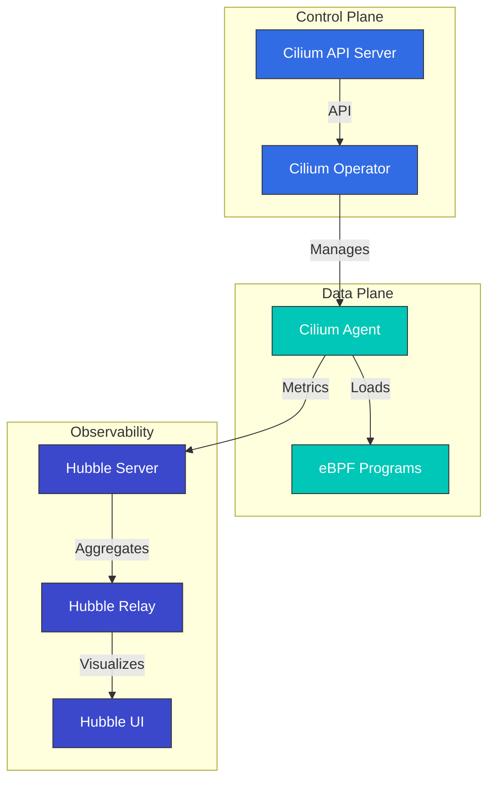

# Análisis profundo de Cilium: El futuro de las redes Cloud Native

## Descripción general

Esta sección proporciona una comprensión integral de los conceptos y tecnologías principales de Cilium. Exploraremos en profundidad la arquitectura de Cilium, la tecnología eBPF, los modelos de red, las características de seguridad y más.

> **Versiones compatibles**: Cilium 1.17, 1.18
> **Compatibilidad con Kubernetes**: 1.32 y superiores
> **Última actualización**: February 23, 2026

## Mejoras clave en Cilium 1.18

Cilium 1.18 ofrece las siguientes mejoras importantes de características y nuevas capacidades:

### Mejoras de red
- **Plano de control BGP mejorado**: Configuración BGP más flexible y escalable
- **Enrutamiento multi-clúster mejorado**: Rendimiento optimizado de la comunicación entre clústeres
- **Integración mejorada de Service Mesh**: Mejor integración con el proxy Envoy

### Mejoras de seguridad
- **Network Policies mejoradas**: Control de políticas más granular y mejoras de rendimiento
- **Opciones de cifrado mejoradas**: Rendimiento de cifrado WireGuard e IPsec optimizado

### Mejoras de observabilidad
- **Mejoras de Hubble**: Métricas e información de trazabilidad más completas
- **Integración mejorada con Prometheus**: Nuevas métricas y paneles
- **Registro de flujos mejorado**: Información más detallada de los flujos de red

### Optimizaciones de rendimiento
- **Optimización de programas eBPF**: Procesamiento de paquetes más rápido
- **Mejoras en el uso de memoria**: Mejor eficiencia de recursos en clústeres a gran escala
- **Optimización del uso de CPU**: Menor sobrecarga

## Introducción

Cilium es una solución de red, seguridad y observabilidad de código abierto para plataformas de gestión de contenedores Linux como Kubernetes, Docker y Mesos. Cilium se basa en la tecnología eBPF (extended Berkeley Packet Filter), y proporciona características de red y seguridad más potentes y eficientes que los enfoques tradicionales de red en Linux.

### ¿Qué es eBPF?

eBPF es una tecnología que actúa como una máquina virtual aislada dentro del kernel de Linux, lo que permite ejecutar programas de forma segura dentro del kernel sin modificar el código del kernel. Esto permite la ejecución eficiente de diversas tareas, como el procesamiento de paquetes de red, la supervisión de llamadas al sistema y el análisis de rendimiento.

Características principales de eBPF:
- Alto rendimiento mediante la ejecución en el espacio del kernel
- Rendimiento nativo mediante compilación JIT (Just-In-Time)
- Entorno de ejecución seguro (verificación de programas mediante el verificador)
- Posibilidad de carga y descarga dinámicas

### Beneficios clave de Cilium

1. **Redes de alto rendimiento**: Procesamiento eficiente de paquetes mediante eBPF
2. **Network Policies granulares**: Compatibilidad con políticas de red de nivel L3-L7
3. **Cifrado transparente**: Cifrado transparente IPsec o WireGuard entre nodos
4. **Balanceo de carga**: Balanceo de carga de alto rendimiento basado en XDP (eXpress Data Path)
5. **Observabilidad**: Visibilidad de flujos de red mediante Hubble
6. **Service Mesh**: Gestión de tráfico L7 sin sidecars existentes
7. **Redes multi-clúster**: Conectividad transparente entre clústeres
8. **Compatibilidad con BGP**: Integración con redes externas

### Comparación con CNI existentes

| Característica | Cilium | Calico | Flannel | AWS VPC CNI |
|---------|--------|--------|---------|-------------|
| Modelo de red | eBPF | iptables/IPVS | VXLAN/host-gw | AWS ENI |
| Network Policies | L3-L7 | L3-L4 | Limitado | AWS Security Groups |
| Cifrado | IPsec/WireGuard | IPsec | Ninguno | Ninguno |
| Observabilidad | Hubble | Flow Logs | Limitado | VPC Flow Logs |
| Service Mesh | Integrado | Requiere Istio | Requiere Istio | Requiere Istio/AppMesh |
| Rendimiento | Muy alto | Alto | Medio | Alto |
| Multi-clúster | Integrado | Limitado | Ninguno | Requiere Transit Gateway |

## Arquitectura

Cilium consta de un plano de datos basado en eBPF y un plano de control integrado con Kubernetes.



### Componentes clave

1. **Cilium Agent**: Se ejecuta en cada nodo, carga y administra programas eBPF
2. **Cilium Operator**: Administra recursos y operaciones a nivel de clúster
3. **Programas eBPF**: Se cargan en el kernel para el procesamiento de paquetes y la aplicación de políticas
4. **Hubble**: Proporciona supervisión y observabilidad de flujos de red
5. **Cilium CLI**: Herramienta de línea de comandos para la gestión de Cilium y Hubble

### Modelos de red

Cilium admite varios modos de red:

1. **Enrutamiento directo**: Enrutamiento directo entre nodos (BGP o enrutamiento estático)
2. **Túneles**: Redes de superposición mediante túneles VXLAN o Geneve
3. **AWS ENI**: Uso de Elastic Network Interface (ENI) en Amazon EKS
4. **Azure IPAM**: Uso de Azure IPAM en Azure AKS

### Flujo de paquetes

Cómo se procesan los paquetes en Cilium:

1. El paquete llega a la interfaz de red
2. El programa eBPF XDP realiza el procesamiento inicial (defensa DDoS, balanceo de carga)
3. El programa eBPF TC (Traffic Control) aplica Network Policies
4. El paquete se entrega al espacio de nombres de red del contenedor
5. Los paquetes de respuesta se procesan mediante una ruta similar

## Integración con Amazon EKS

Hay dos formas principales de usar Cilium en Amazon EKS:

1. **Instalación como complemento de Amazon EKS**: Amazon EKS proporciona Cilium como un complemento administrado.
2. **Instalación manual**: Instálelo directamente mediante un Helm chart.

### Instalación como complemento de Amazon EKS

```bash
# Install Cilium add-on
aws eks create-addon \
  --cluster-name my-cluster \
  --addon-name cilium \
  --addon-version v1.17.0-eksbuild.1 \
  --service-account-role-arn arn:aws:iam::123456789012:role/AmazonEKSCiliumAddonRole

# Check add-on status
aws eks describe-addon \
  --cluster-name my-cluster \
  --addon-name cilium
```

### Instalación manual con Helm

```bash
# Add Cilium Helm repository
helm repo add cilium https://helm.cilium.io/

# Update Helm repository
helm repo update

# Install Cilium
helm install cilium cilium/cilium \
  --version 1.17.0 \
  --namespace kube-system \
  --set eni.enabled=true \
  --set ipam.mode=eni \
  --set egressMasqueradeInterfaces=eth0 \
  --set tunnel=disabled
```

### Opciones de configuración específicas de EKS

Opciones de configuración clave que se deben considerar al usar Cilium con EKS:

1. **Modo ENI**: Aproveche el rendimiento de red nativo de AWS mediante AWS Elastic Network Interface
2. **Modo IPAM**: Integración con la administración de direcciones IP de AWS VPC
3. **Cifrado**: Cifrado del tráfico entre nodos (WireGuard o IPsec)
4. **NodeLocal DNSCache**: Mejora del rendimiento de DNS
5. **Hubble**: Habilite la observabilidad de red

### Configuración del modo ENI

```yaml
apiVersion: v1
kind: ConfigMap
metadata:
  name: cilium-config
  namespace: kube-system
data:
  enable-endpoint-routes: "true"
  auto-create-cilium-node-resource: "true"
  ipam: "eni"
  eni-tags: "{\"Owner\": \"Cilium\"}"
  tunnel: "disabled"
  enable-ipv4: "true"
  enable-ipv6: "false"
  egress-masquerade-interfaces: "eth0"
```

### Instalación de Cilium en un clúster de EKS

#### Instalación de Cilium en un clúster de EKS existente

```bash
# Remove AWS CNI
kubectl delete daemonset -n kube-system aws-node

# Install Cilium
cilium install --set eni.enabled=true \
  --set ipam.mode=eni \
  --set egressMasqueradeInterfaces=eth0 \
  --set tunnel=disabled
```

#### Creación de un nuevo clúster de EKS con Cilium CNI

```bash
eksctl create cluster --name cilium-cluster \
  --without-nodegroup

eksctl create nodegroup --cluster cilium-cluster \
  --node-ami-family AmazonLinux2 \
  --node-type m5.large \
  --nodes 3 \
  --max-pods-per-node 110

# Install Cilium
cilium install --set eni.enabled=true \
  --set ipam.mode=eni \
  --set egressMasqueradeInterfaces=eth0 \
  --set tunnel=disabled
```

### Interconexión de clústeres de EKS

Interconexión de clústeres de EKS mediante Cilium Cluster Mesh:

```bash
# On cluster 1
cilium clustermesh enable --service-type LoadBalancer

# On cluster 2
cilium clustermesh enable --service-type LoadBalancer

# Connect clusters
cilium clustermesh connect --context cluster1 --destination-context cluster2
```

## Instalación y configuración

### Requisitos previos

- Clúster de Kubernetes (v1.16 o superior)
- Kernel de Linux 4.9 o superior (recomendado: 5.4 o superior)
- kubectl configurado
- Helm (opcional)

### Instalación de Cilium CLI

```bash
curl -L --remote-name-all https://github.com/cilium/cilium-cli/releases/latest/download/cilium-linux-amd64.tar.gz
sudo tar xzvfC cilium-linux-amd64.tar.gz /usr/local/bin
rm cilium-linux-amd64.tar.gz
```

### Opciones de configuración

#### Configuración del modo de red

Modo de enrutamiento directo:
```bash
cilium install --set tunnel=disabled --set autoDirectNodeRoutes=true
```

Modo VXLAN:
```bash
cilium install --set tunnel=vxlan
```

#### Configuración de reemplazo de kube-proxy

Modo de reemplazo completo:
```bash
cilium install --set kubeProxyReplacement=strict
```

#### Configuración de cifrado

Cifrado WireGuard:
```bash
cilium install --set encryption.enabled=true --set encryption.type=wireguard
```

Cifrado IPsec:
```bash
cilium install --set encryption.enabled=true --set encryption.type=ipsec
```

## Network Policies

Cilium amplía la API Kubernetes NetworkPolicy para proporcionar Network Policies granulares en los niveles L3-L7.

### Network Policy básica

```yaml
apiVersion: networking.k8s.io/v1
kind: NetworkPolicy
metadata:
  name: allow-frontend-to-backend
  namespace: app
spec:
  podSelector:
    matchLabels:
      app: backend
  ingress:
  - from:
    - podSelector:
        matchLabels:
          app: frontend
    ports:
    - port: 8080
      protocol: TCP
```

### Cilium Network Policy

```yaml
apiVersion: cilium.io/v2
kind: CiliumNetworkPolicy
metadata:
  name: allow-specific-http-methods
  namespace: app
spec:
  endpointSelector:
    matchLabels:
      app: backend
  ingress:
  - fromEndpoints:
    - matchLabels:
        app: frontend
    toPorts:
    - ports:
      - port: "8080"
        protocol: TCP
      rules:
        http:
        - method: "GET"
          path: "/api/v1/products"
```

### Política basada en FQDN

```yaml
apiVersion: cilium.io/v2
kind: CiliumNetworkPolicy
metadata:
  name: allow-specific-domains
  namespace: app
spec:
  endpointSelector:
    matchLabels:
      app: web
  egress:
  - toFQDNs:
    - matchName: "api.example.com"
    - matchPattern: "*.amazonaws.com"
    toPorts:
    - ports:
      - port: "443"
        protocol: TCP
```

## Observabilidad con Hubble

Hubble es la capa de observabilidad de Cilium, que permite la visualización y el análisis de datos de flujos de red recopilados mediante eBPF.

### Instalación de Hubble

```bash
cilium hubble enable --ui
```

### Observación de flujos de red

```bash
# Observe all flows
hubble observe

# Observe flows in specific namespace
hubble observe --namespace app

# Observe HTTP requests
hubble observe --protocol http

# Observe flows between pods with specific labels
hubble observe --from-label app=frontend --to-label app=backend

# Observe failed connections
hubble observe --verdict DROPPED
```

### Integración con Prometheus

```bash
cilium hubble enable --metrics="{dns:query;ignoreAAAA,drop:sourceContext=pod;destinationContext=pod,tcp,flow,icmp,http}"
```

## Pruebas de Cilium

```bash
# Basic connectivity test
cilium connectivity test

# Run specific test
cilium connectivity test --test=client-to-echo-service

# Network performance test
cilium connectivity test --test=performance
```

## Prácticas recomendadas

### Optimización de rendimiento

1. **Optimización de la versión del kernel**: Use el kernel de Linux 5.4 o superior
2. **Habilite el control de congestión BBR**: Mejore el rendimiento de la red
3. **Habilite la aceleración XDP**: Mejore el rendimiento del procesamiento de paquetes
4. **Optimización de MTU**: Configure una MTU adecuada para el entorno de red

```bash
cilium install --set bpf.preallocateMaps=true \
  --set bpf.masquerade=true \
  --set devices=eth0 \
  --set loadBalancer.acceleration=native \
  --set loadBalancer.mode=dsr
```

### Fortalecimiento de seguridad

1. **Aplique una política de denegación predeterminada**: Permita únicamente el tráfico explícitamente autorizado
2. **Habilite el cifrado**: Cifre el tráfico entre nodos
3. **Aplique el principio de mínimo privilegio**: Diseñe políticas que permitan únicamente la comunicación necesaria

### Observabilidad mejorada

```bash
cilium hubble enable --metrics="{dns,drop,tcp,flow,http}"
```

## Solución de problemas

### Problemas de conectividad

```bash
# Check Cilium status
cilium status

# Check endpoint status
cilium endpoint list

# Review network policies
kubectl get cnp,ccnp -A

# Analyze flows
hubble observe --verdict DROPPED
```

### Problemas de rendimiento

```bash
# Check eBPF map status
cilium bpf maps list

# Monitor system resources
cilium metrics list
```

### Herramientas de depuración

```bash
# Check status
cilium status --verbose

# Collect environment information
cilium sysdump

# Cilium agent logs
kubectl logs -n kube-system -l k8s-app=cilium
```

## Índice del análisis profundo

**[Introducción a Cilium y conceptos básicos](01-introduction.md)**
- Descripción general e historia de Cilium
- Conceptos básicos de redes de contenedores
- Comprensión de CNI (Container Network Interface)
- Características diferenciadoras de Cilium

**[Análisis profundo de la tecnología eBPF](02-ebpf.md)**
- Introducción e historia de la tecnología eBPF
- Cómo funciona eBPF dentro del kernel
- Tipos de programas eBPF y mapas
- Uso de eBPF en Cilium

**[Modelos de red y VXLAN](03-networking.md)**
- Comparación de modelos de red de contenedores
- Análisis profundo de la tecnología VXLAN
- Redes de superposición de Cilium
- Técnicas de optimización de rendimiento
- Mecanismos de enrutamiento (encapsulación frente a Native-Routing)
- Redes de proveedores de nube (AWS ENI, Google Cloud)

**[IPAM y Network Policies](04-ipam-policy.md)**
- Estrategias de administración de direcciones IP (IPAM)
- Integración de IPAM de Kubernetes y Cilium
- Diseño e implementación de Network Policies
- Escenarios multi-clúster
- Análisis profundo del modo IPAM (alcance de clúster, alcance de host de Kubernetes, Multi-Pool)
- IPAM de proveedores de nube (Azure IPAM, AWS ENI, GKE)
- IPAM basado en CRD

**[Redes L2-L7 y balanceo de carga](05-l2-l7-networking.md)**
- Comprensión de las capas del modelo OSI (L2, L3, L4, L7)
- Características de Cilium específicas por capa
- Integración de Service Mesh
- Arquitectura de balanceo de carga
- Configuración de masquerading y modos de implementación
- Manejo de fragmentos IPv4

**[Seguridad y visibilidad](06-security-visibility.md)**
- Características de seguridad de Cilium
- Visibilidad y supervisión de red
- Arquitectura y uso de Hubble
- Detección de amenazas en tiempo real

**[Temas avanzados y casos reales](07-advanced-topics.md)**
- Ajuste de rendimiento y solución de problemas
- Estrategias de implementación a gran escala
- Estudios de casos de uso reales
- Hoja de ruta futura y dirección de desarrollo

## Recursos adicionales

- [Análisis profundo de conceptos de red](networking-concepts.md)
- [Glosario y abreviaturas](glossary.md)

## Referencias

- [Documentación oficial de Cilium](https://docs.cilium.io/)
- [Repositorio de GitHub de Cilium](https://github.com/cilium/cilium)
- [Documentación de eBPF](https://ebpf.io/)
- [Documentación de Hubble](https://github.com/cilium/hubble)
- [Editor de Cilium Network Policy](https://editor.cilium.io/)
- [AWS EKS Workshop - Cilium](https://www.eksworkshop.com/beginner/115_cilium/)

## Cuestionario

Para poner a prueba lo que ha aprendido en esta sección, intente el [Cuestionario de análisis profundo de Cilium](../../quizzes/networking/cilium/01-introduction-quiz.md).
