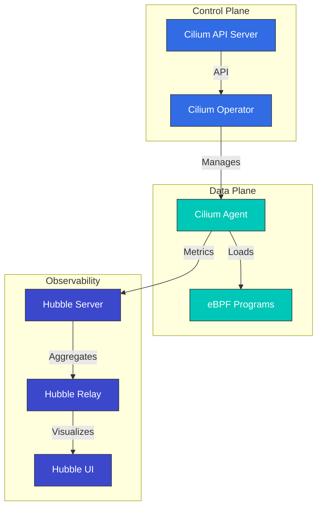

# Análisis profundo de Cilium: el futuro de las redes Cloud Native

## Descripción general

Esta sección proporciona una comprensión integral de los conceptos y tecnologías centrales de Cilium. Exploraremos en profundidad la arquitectura de Cilium, la tecnología eBPF, los modelos de red, las características de seguridad y más.

> **Versiones compatibles**: Cilium 1.17, 1.18
> **Compatibilidad con Kubernetes**: 1.32 y posteriores
> **Última actualización**: August 10, 2026

### Actualización de julio de 2026: lanzamientos de parches y un problema de seguridad de NetworkPolicy

El 16 de julio de 2026, se publicaron los lanzamientos de parches Cilium 1.19.6, 1.18.12 y 1.17.18. Además del nuevo soporte para configurar los registros de acceso de Gateway API (`spec.telemetry.accessLogs` en `CiliumGatewayClassConfig`), corrigen una regresión que podía interrumpir brevemente las conexiones establecidas durante el reinicio/actualización del agente y un error de ClusterMesh en el que la anotación `service.cilium.io/affinity: "none"` provocaba un agujero negro de tráfico.

También tenga en cuenta el problema de seguridad **CVE-2026-56743**: en Cilium 1.19.0-1.19.4 con un `clusterName` no predeterminado, una Kubernetes NetworkPolicy que utilizaba únicamente reglas `ipBlock` (sin selectores de pod/namespace) podía permitir involuntariamente el tráfico de otras cargas de trabajo en el mismo namespace. Actualice a 1.19.5 o posterior. Consulte el [aviso de seguridad](https://github.com/cilium/cilium/security/advisories/GHSA-fm8w-2m5w-9j7r) para obtener más detalles.

El 21 de julio de 2026, se publicó [Cilium 1.20.0-rc.1](https://github.com/cilium/cilium/releases/tag/v1.20.0-rc.1): el segundo candidato de lanzamiento para la próxima versión menor 1.20, después de rc.0 el 14 de julio.

### Actualización de agosto de 2026: Cilium 1.20.0 GA

El 29 de julio de 2026, se lanzó [Cilium 1.20.0](https://github.com/cilium/cilium/releases/tag/v1.20.0): más de 2.660 nuevos commits de más de 1.100 colaboradores. Aspectos destacados:

- **Gateway API v1.6.1**: soporte para los TCPRoute/UDPRoute recientemente disponibles de forma general, `BackendTLSPolicy` para TLS hacia backends, ListenerSets para la gestión delegada de listeners, un filtro `ExternalAuth` (GEP-1494) y soporte nativo de CORS
- **Redes**: plugins de datapath para extender el datapath eBPF sin realizar un fork, selección automática de netkit (`bpf.datapathMode=auto`) e IP de egress IPv6 para clústeres dual-stack
- **IPAM**: IPv6 para AWS ENI IPAM (Beta) y migración in situ de IPAM cluster-pool a multi-pool
- **Services/ClusterMesh**: distribución de tráfico `PreferSameZone`/`PreferSameNode`, backends Maglev ponderados mediante la anotación `service.cilium.io/weight` y soporte estable para la API Multi-Cluster Services (MCS)
- **Seguridad**: soporte para Kubernetes ClusterNetworkPolicy (KCNP) con niveles Admin/Baseline, identidad de ztunnel mediante CA interna o SPIRE y una nueva entidad de política `cluster-mesh`
- **Rendimiento**: el binario `cilium-cni` se redujo de ~77 MB a 16 MB, además de estado agregado de load balancer y codificación optimizada de BPF policy-map para clústeres grandes

Tome medidas durante la actualización si utiliza Mutual Authentication heredada, extensiones Envoy Go, políticas compatibles con Kafka, la API `CiliumNodeConfig` de `cilium.io/v2alpha1`, la integración libnetwork o una configuración CNI personalizada; consulte la [guía de actualización](https://docs.cilium.io/en/v1.20/operations/upgrade/#upgrade-notes). El primer prelanzamiento del siguiente ciclo, 1.21.0-pre.0, se publicó el 3 de agosto.

## Mejoras principales en Cilium 1.18

Cilium 1.18 ofrece las siguientes mejoras importantes de características y nuevas capacidades:

### Mejoras de redes
- **BGP Control Plane mejorado**: configuración de BGP más flexible y escalable
- **Enrutamiento multi-clúster mejorado**: rendimiento optimizado de la comunicación entre clústeres
- **Integración mejorada de Service Mesh**: mejor integración con el proxy Envoy

### Mejoras de seguridad
- **Network Policies mejoradas**: control de políticas más detallado y mejoras de rendimiento
- **Opciones de cifrado mejoradas**: rendimiento optimizado del cifrado WireGuard e IPsec

### Mejoras de observabilidad
- **Mejoras de Hubble**: métricas e información de trazado más enriquecidas
- **Integración mejorada de Prometheus**: nuevas métricas y dashboards
- **Registro de flujos mejorado**: información más detallada sobre los flujos de red

### Optimizaciones de rendimiento
- **Optimización de programas eBPF**: procesamiento de paquetes más rápido
- **Mejoras en el uso de memoria**: mayor eficiencia de recursos en clústeres a gran escala
- **Optimización del uso de CPU**: menor sobrecarga

## Introducción

Cilium es una solución de redes, seguridad y observabilidad de código abierto para plataformas de gestión de contenedores Linux como Kubernetes, Docker y Mesos. Cilium se basa en la tecnología eBPF (extended Berkeley Packet Filter), y proporciona características de redes y seguridad más potentes y eficientes que los enfoques tradicionales de redes de Linux.

### ¿Qué es eBPF?

eBPF es una tecnología que actúa como una máquina virtual aislada dentro del kernel de Linux, lo que permite ejecutar programas de forma segura dentro del kernel sin modificar su código. Esto posibilita la ejecución eficiente de varias tareas, como el procesamiento de paquetes de red, la monitorización de llamadas del sistema y el análisis de rendimiento.

Características principales de eBPF:
- Alto rendimiento mediante la ejecución en el espacio del kernel
- Rendimiento nativo mediante compilación JIT (Just-In-Time)
- Entorno de ejecución seguro (verificación de programas mediante verifier)
- Posibilidad de carga y descarga dinámica

### Beneficios principales de Cilium

1. **Redes de alto rendimiento**: procesamiento eficiente de paquetes mediante eBPF
2. **Network Policies granulares**: soporte de políticas de red de nivel L3-L7
3. **Cifrado transparente**: cifrado transparente IPsec o WireGuard entre nodos
4. **Load Balancing**: load balancing de alto rendimiento basado en XDP (eXpress Data Path)
5. **Observabilidad**: visibilidad de flujos de red mediante Hubble
6. **Service Mesh**: gestión del tráfico L7 sin sidecars existentes
7. **Redes multi-clúster**: conectividad transparente entre clústeres
8. **Soporte de BGP**: integración con redes externas

### Comparación con CNIs existentes

| Característica | Cilium | Calico | Flannel | AWS VPC CNI |
|---------|--------|--------|---------|-------------|
| Modelo de red | eBPF | iptables/IPVS | VXLAN/host-gw | AWS ENI |
| Network Policies | L3-L7 | L3-L4 | Limitado | AWS Security Groups |
| Cifrado | IPsec/WireGuard | IPsec | Ninguno | Ninguno |
| Observabilidad | Hubble | Flow Logs | Limitado | VPC Flow Logs |
| Service Mesh | Integrado | Requiere Istio | Requiere Istio | Requiere Istio/AppMesh |
| Rendimiento | Muy alto | Alto | Medio | Alto |
| Multi-Cluster | Integrado | Limitado | Ninguno | Requiere Transit Gateway |

## Arquitectura

Cilium consta de un plano de datos basado en eBPF y un plano de control integrado con Kubernetes.



### Componentes principales

1. **Cilium Agent**: se ejecuta en cada nodo, carga y administra programas eBPF
2. **Cilium Operator**: administra recursos y operaciones a nivel de clúster
3. **Programas eBPF**: se cargan en el kernel para el procesamiento de paquetes y la aplicación de políticas
4. **Hubble**: proporciona monitorización y observabilidad de flujos de red
5. **Cilium CLI**: herramienta de línea de comandos para la gestión de Cilium y Hubble

### Modelos de red

Cilium admite varios modos de red:

1. **Direct Routing**: enrutamiento directo entre nodos (BGP o enrutamiento estático)
2. **Tunneling**: redes overlay mediante túneles VXLAN o Geneve
3. **AWS ENI**: utiliza Elastic Network Interface (ENI) en Amazon EKS
4. **Azure IPAM**: utiliza Azure IPAM en Azure AKS

### Flujo de paquetes

Cómo se procesan los paquetes en Cilium:

1. El paquete llega a la interfaz de red
2. El programa eBPF XDP realiza el procesamiento inicial (defensa contra DDoS, load balancing)
3. El programa eBPF TC (Traffic Control) aplica Network Policies
4. El paquete se entrega al namespace de red del contenedor
5. Los paquetes de respuesta se procesan mediante una ruta similar

## Integración con Amazon EKS

Hay dos formas principales de usar Cilium en Amazon EKS:

1. **Instalar como Amazon EKS Add-on**: Amazon EKS proporciona Cilium como un add-on administrado.
2. **Instalación manual**: instale directamente mediante Helm chart.

### Instalación como Amazon EKS Add-on

```bash
# Install Cilium add-on
aws eks create-addon \
  --cluster-name my-cluster \
  --addon-name cilium \
  --addon-version v1.17.0-eksbuild.1 \
  --service-account-role-arn arn:aws:iam::123456789012:role/AmazonEKSCiliumAddonRole

# Check add-on status
aws eks describe-addon \
  --cluster-name my-cluster \
  --addon-name cilium
```

### Instalación manual con Helm

```bash
# Add Cilium Helm repository
helm repo add cilium https://helm.cilium.io/

# Update Helm repository
helm repo update

# Install Cilium
helm install cilium cilium/cilium \
  --version 1.17.0 \
  --namespace kube-system \
  --set eni.enabled=true \
  --set ipam.mode=eni \
  --set egressMasqueradeInterfaces=eth0 \
  --set tunnel=disabled
```

### Opciones de configuración específicas de EKS

Opciones de configuración principales que se deben considerar al usar Cilium con EKS:

1. **Modo ENI**: aproveche el rendimiento de redes nativas de AWS mediante AWS Elastic Network Interface
2. **Modo IPAM**: integración con la gestión de direcciones IP de AWS VPC
3. **Cifrado**: cifrado del tráfico entre nodos (WireGuard o IPsec)
4. **NodeLocal DNSCache**: mejora del rendimiento de DNS
5. **Hubble**: habilite la observabilidad de red

### Configuración del modo ENI

```yaml
apiVersion: v1
kind: ConfigMap
metadata:
  name: cilium-config
  namespace: kube-system
data:
  enable-endpoint-routes: "true"
  auto-create-cilium-node-resource: "true"
  ipam: "eni"
  eni-tags: "{\"Owner\": \"Cilium\"}"
  tunnel: "disabled"
  enable-ipv4: "true"
  enable-ipv6: "false"
  egress-masquerade-interfaces: "eth0"
```

### Instalación de Cilium en un clúster de EKS

#### Instalación de Cilium en un clúster de EKS existente

```bash
# Remove AWS CNI
kubectl delete daemonset -n kube-system aws-node

# Install Cilium
cilium install --set eni.enabled=true \
  --set ipam.mode=eni \
  --set egressMasqueradeInterfaces=eth0 \
  --set tunnel=disabled
```

#### Creación de un nuevo clúster de EKS con Cilium CNI

```bash
eksctl create cluster --name cilium-cluster \
  --without-nodegroup

eksctl create nodegroup --cluster cilium-cluster \
  --node-ami-family AmazonLinux2 \
  --node-type m5.large \
  --nodes 3 \
  --max-pods-per-node 110

# Install Cilium
cilium install --set eni.enabled=true \
  --set ipam.mode=eni \
  --set egressMasqueradeInterfaces=eth0 \
  --set tunnel=disabled
```

### Interconexión de clústeres de EKS

Interconexión de clústeres de EKS mediante Cilium Cluster Mesh:

```bash
# On cluster 1
cilium clustermesh enable --service-type LoadBalancer

# On cluster 2
cilium clustermesh enable --service-type LoadBalancer

# Connect clusters
cilium clustermesh connect --context cluster1 --destination-context cluster2
```

## Instalación y configuración

### Requisitos previos

- Clúster de Kubernetes (v1.16 o posterior)
- Kernel de Linux 4.9 o posterior (recomendado: 5.4 o posterior)
- kubectl configurado
- Helm (opcional)

### Instalar Cilium CLI

```bash
curl -L --remote-name-all https://github.com/cilium/cilium-cli/releases/latest/download/cilium-linux-amd64.tar.gz
sudo tar xzvfC cilium-linux-amd64.tar.gz /usr/local/bin
rm cilium-linux-amd64.tar.gz
```

### Opciones de configuración

#### Configuración del modo de red

Modo de enrutamiento directo:
```bash
cilium install --set tunnel=disabled --set autoDirectNodeRoutes=true
```

Modo VXLAN:
```bash
cilium install --set tunnel=vxlan
```

#### Configuración de reemplazo de kube-proxy

Modo de reemplazo completo:
```bash
cilium install --set kubeProxyReplacement=strict
```

#### Configuración de cifrado

Cifrado WireGuard:
```bash
cilium install --set encryption.enabled=true --set encryption.type=wireguard
```

Cifrado IPsec:
```bash
cilium install --set encryption.enabled=true --set encryption.type=ipsec
```

## Network Policies

Cilium amplía la API Kubernetes NetworkPolicy para proporcionar Network Policies granulares en los niveles L3-L7.

### Network Policy básica

```yaml
apiVersion: networking.k8s.io/v1
kind: NetworkPolicy
metadata:
  name: allow-frontend-to-backend
  namespace: app
spec:
  podSelector:
    matchLabels:
      app: backend
  ingress:
  - from:
    - podSelector:
        matchLabels:
          app: frontend
    ports:
    - port: 8080
      protocol: TCP
```

### Cilium Network Policy

```yaml
apiVersion: cilium.io/v2
kind: CiliumNetworkPolicy
metadata:
  name: allow-specific-http-methods
  namespace: app
spec:
  endpointSelector:
    matchLabels:
      app: backend
  ingress:
  - fromEndpoints:
    - matchLabels:
        app: frontend
    toPorts:
    - ports:
      - port: "8080"
        protocol: TCP
      rules:
        http:
        - method: "GET"
          path: "/api/v1/products"
```

### Política basada en FQDN

```yaml
apiVersion: cilium.io/v2
kind: CiliumNetworkPolicy
metadata:
  name: allow-specific-domains
  namespace: app
spec:
  endpointSelector:
    matchLabels:
      app: web
  egress:
  - toFQDNs:
    - matchName: "api.example.com"
    - matchPattern: "*.amazonaws.com"
    toPorts:
    - ports:
      - port: "443"
        protocol: TCP
```

## Observabilidad con Hubble

Hubble es la capa de observabilidad de Cilium y permite visualizar y analizar los datos de flujos de red recopilados mediante eBPF.

### Instalación de Hubble

```bash
cilium hubble enable --ui
```

### Observación de flujos de red

```bash
# Observe all flows
hubble observe

# Observe flows in specific namespace
hubble observe --namespace app

# Observe HTTP requests
hubble observe --protocol http

# Observe flows between pods with specific labels
hubble observe --from-label app=frontend --to-label app=backend

# Observe failed connections
hubble observe --verdict DROPPED
```

### Integración con Prometheus

```bash
cilium hubble enable --metrics="{dns:query;ignoreAAAA,drop:sourceContext=pod;destinationContext=pod,tcp,flow,icmp,http}"
```

## Pruebas de Cilium

```bash
# Basic connectivity test
cilium connectivity test

# Run specific test
cilium connectivity test --test=client-to-echo-service

# Network performance test
cilium connectivity test --test=performance
```

## Prácticas recomendadas

### Optimización del rendimiento

1. **Optimización de la versión del kernel**: use Linux kernel 5.4 o posterior
2. **Habilitar el control de congestión BBR**: mejore el rendimiento de la red
3. **Habilitar la aceleración XDP**: mejore el rendimiento del procesamiento de paquetes
4. **Optimización de MTU**: establezca una MTU adecuada para el entorno de red

```bash
cilium install --set bpf.preallocateMaps=true \
  --set bpf.masquerade=true \
  --set devices=eth0 \
  --set loadBalancer.acceleration=native \
  --set loadBalancer.mode=dsr
```

### Endurecimiento de seguridad

1. **Aplicar una política de denegación predeterminada**: permita solo el tráfico explícitamente autorizado
2. **Habilitar el cifrado**: cifre el tráfico entre nodos
3. **Aplicar el principio de privilegio mínimo**: diseñe políticas que permitan solo la comunicación necesaria

### Observabilidad mejorada

```bash
cilium hubble enable --metrics="{dns,drop,tcp,flow,http}"
```

## Resolución de problemas

### Problemas de conectividad

```bash
# Check Cilium status
cilium status

# Check endpoint status
cilium endpoint list

# Review network policies
kubectl get cnp,ccnp -A

# Analyze flows
hubble observe --verdict DROPPED
```

### Problemas de rendimiento

```bash
# Check eBPF map status
cilium bpf maps list

# Monitor system resources
cilium metrics list
```

### Herramientas de depuración

```bash
# Check status
cilium status --verbose

# Collect environment information
cilium sysdump

# Cilium agent logs
kubectl logs -n kube-system -l k8s-app=cilium
```

## Índice del análisis profundo

**[Introducción a Cilium y conceptos básicos](01-introduction.md)**
- Descripción general e historia de Cilium
- Fundamentos de redes de contenedores
- Comprensión de CNI (Container Network Interface)
- Características diferenciadoras de Cilium

**[Análisis profundo de la tecnología eBPF](02-ebpf.md)**
- Introducción e historia de la tecnología eBPF
- Cómo funciona eBPF dentro del kernel
- Tipos de programas eBPF y Maps
- Uso de eBPF en Cilium

**[Modelos de red y VXLAN](03-networking.md)**
- Comparación de modelos de redes de contenedores
- Análisis profundo de la tecnología VXLAN
- Redes overlay de Cilium
- Técnicas de optimización del rendimiento
- Mecanismos de enrutamiento (Encapsulation vs Native-Routing)
- Redes de proveedores Cloud (AWS ENI, Google Cloud)

**[IPAM y Network Policies](04-ipam-policy.md)**
- Estrategias de gestión de direcciones IP (IPAM)
- Integración de IPAM de Kubernetes y Cilium
- Diseño e implementación de Network Policies
- Escenarios multi-clúster
- Análisis profundo de los modos IPAM (alcance de clúster, alcance de host de Kubernetes, Multi-Pool)
- IPAM de proveedores Cloud (Azure IPAM, AWS ENI, GKE)
- IPAM basado en CRD

**[Redes L2-L7 y Load Balancing](05-l2-l7-networking.md)**
- Comprensión de las capas del modelo OSI (L2, L3, L4, L7)
- Características de Cilium específicas por capa
- Integración de Service Mesh
- Arquitectura de Load Balancing
- Configuración y modos de implementación de Masquerading
- Manejo de fragmentos IPv4

**[Seguridad y visibilidad](06-security-visibility.md)**
- Características de seguridad de Cilium
- Visibilidad y monitorización de redes
- Arquitectura y uso de Hubble
- Detección de amenazas en tiempo real

**[Temas avanzados y casos del mundo real](07-advanced-topics.md)**
- Ajuste del rendimiento y resolución de problemas
- Estrategias de implementación a gran escala
- Estudios de casos de uso del mundo real
- Hoja de ruta futura y dirección del desarrollo

## Recursos adicionales

- [Análisis profundo de conceptos de redes](networking-concepts.md)
- [Glosario y abreviaturas](glossary.md)

## Referencias

- [Documentación oficial de Cilium](https://docs.cilium.io/)
- [Repositorio de GitHub de Cilium](https://github.com/cilium/cilium)
- [Documentación de eBPF](https://ebpf.io/)
- [Documentación de Hubble](https://github.com/cilium/hubble)
- [Editor de Cilium Network Policy](https://editor.cilium.io/)
- [AWS EKS Workshop - Cilium](https://www.eksworkshop.com/beginner/115_cilium/)

## Cuestionario

Para comprobar lo que ha aprendido en esta sección, pruebe el [Cuestionario de análisis profundo de Cilium](../../quizzes/networking/cilium/01-introduction-quiz.md).
