# Profundización en los conceptos de redes

> **Última actualización**: February 22, 2026

Este documento proporciona explicaciones detalladas de los conceptos fundamentales de redes necesarios para comprender Cilium. Explora los conceptos técnicos que constituyen la base de Cilium, incluidos las redes de contenedores, las redes de superposición y los protocolos de enrutamiento.

## Objetivos de aprendizaje

A través de este documento, comprenderá:
- La estructura básica del modelo OSI y la pila TCP/IP, así como el rol de cada capa
- Los principios básicos y los métodos de implementación de las redes de contenedores
- Las diferencias entre las redes de superposición y las redes subyacentes
- Cómo se utilizan en Cilium los conceptos fundamentales de redes como NAT, enrutamiento y DNS

## Índice

1. [Modelo OSI y pila TCP/IP](#osi-model-and-tcpip-stack)
2. [Conceptos básicos de redes de contenedores](#container-networking-basics)
3. [Redes de superposición](#overlay-networks)
4. [Traducción de direcciones de red (NAT)](#network-address-translation-nat)
5. [Protocolos de enrutamiento](#routing-protocols)
6. [DNS y descubrimiento de servicios](#dns-and-service-discovery)
7. [Conceptos de balanceo de carga](#load-balancing-concepts)
8. [Conceptos básicos de seguridad de red](#network-security-basics)

## Modelo OSI y pila TCP/IP

> **Concepto clave**: El modelo OSI es un marco conceptual que clasifica la comunicación de red en 7 capas abstractas, lo que facilita la comprensión de procesos de red complejos.

El modelo OSI (Open Systems Interconnection) es un marco conceptual que clasifica la comunicación de red en 7 capas abstractas. Cada capa es responsable de funciones de red específicas, lo que permite descomponer procesos de red complejos para facilitar su comprensión.

### Comparación entre el modelo OSI y el modelo TCP/IP

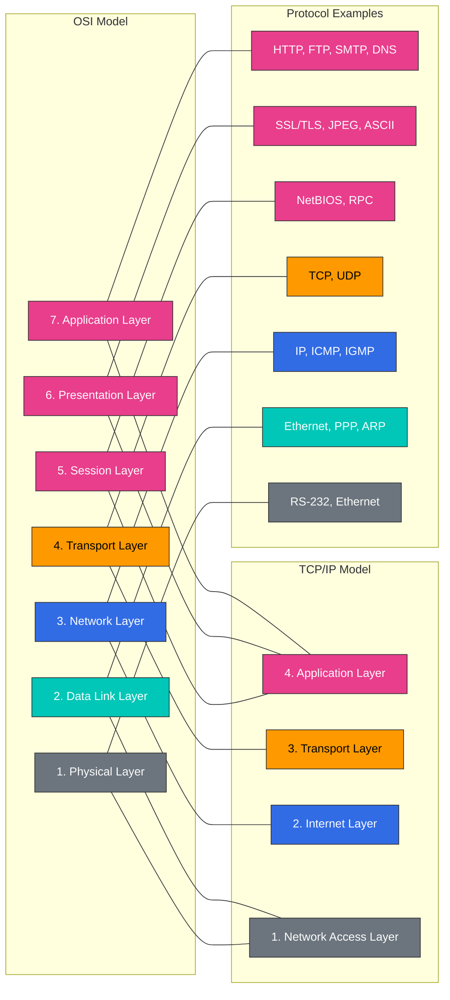

### Modelo OSI de 7 capas

1. **Capa física**
   - Convierte flujos de bits en señales eléctricas, ópticas o inalámbricas
   - Incluye dispositivos físicos como cables, switches y hubs
   - Unidad de datos: Bit

2. **Capa de enlace de datos**
   - Responsable de la transferencia de datos entre nodos en una red física
   - Identificación de dispositivos mediante direcciones MAC (Media Access Control)
   - Detección y corrección de errores
   - Unidad de datos: Trama
   - Los protocolos Ethernet y Wi-Fi operan en esta capa

3. **Capa de red**
   - Responsable del enrutamiento de paquetes entre redes diferentes
   - Direccionamiento lógico (direcciones IP)
   - Determinación de rutas y reenvío de paquetes
   - Unidad de datos: Paquete
   - IP (Internet Protocol) es el protocolo principal de esta capa

4. **Capa de transporte**
   - Control de la comunicación de extremo a extremo
   - Segmentación y reensamblaje de datos
   - Control de flujo y recuperación de errores
   - Unidad de datos: Segmento
   - TCP (Transmission Control Protocol) y UDP (User Datagram Protocol) son los protocolos principales de esta capa

5. **Capa de sesión**
   - Establecimiento, mantenimiento y terminación de sesiones de comunicación
   - Sincronización y control de diálogo
   - Establecimiento de puntos de control y recuperación
   - NetBIOS y RPC (Remote Procedure Call) son ejemplos de esta capa

6. **Capa de presentación**
   - Conversión y cifrado de formatos de datos
   - Codificación de caracteres, compresión de datos, cifrado/descifrado
   - SSL/TLS, JPEG y ASCII son ejemplos de esta capa

7. **Capa de aplicación**
   - Proporciona interfaz de usuario y servicios de aplicación
   - Servicios como correo electrónico, transferencia de archivos y navegación web
   - HTTP, FTP, SMTP y DNS son ejemplos de esta capa

### Relación entre Cilium y el modelo OSI

Cilium opera en varias capas OSI:

| Capa OSI | Funcionalidad de Cilium | Ejemplo |
|-----------|----------------|---------|
| L2 (enlace de datos) | Manejo de ARP, filtrado de MAC | Verificación de dirección MAC entre nodos |
| L3 (red) | Enrutamiento IP, políticas basadas en CIDR | Enrutamiento IP entre Pods |
| L4 (transporte) | Filtrado basado en puertos, seguimiento de conexiones | Control de acceso al puerto de Service |
| L7 (aplicación) | Filtrado de HTTP, gRPC y Kafka | Control de acceso basado en rutas de API |

### Pila TCP/IP

La pila TCP/IP es un conjunto de protocolos que constituye la base de Internet, un modelo simplificado de 4 capas del modelo OSI.

1. **Capa de interfaz de red**
   - Corresponde a las capas física y de enlace de datos del modelo OSI
   - Responsable de la interfaz con los medios de red físicos
   - Incluye protocolos como Ethernet y Wi-Fi

2. **Capa de Internet**
   - Corresponde a la capa de red del modelo OSI
   - Enrutamiento de paquetes mediante IP (Internet Protocol)
   - Incluye ICMP (Internet Control Message Protocol) y ARP (Address Resolution Protocol)

3. **Capa de transporte**
   - Igual que la capa de transporte del modelo OSI
   - Incluye los protocolos TCP y UDP
   - Proporciona comunicación orientada a conexión (TCP) y sin conexión (UDP)

4. **Capa de aplicación**
   - Integra las capas de sesión, presentación y aplicación del modelo OSI
   - Incluye protocolos como HTTP, SMTP, FTP y DNS
   - Proporciona una interfaz entre las aplicaciones de usuario y la red

### Funcionalidades de Cilium por capa

Cilium proporciona funcionalidades en diversas capas de red:

- **L2 (capa de enlace de datos)**: Filtrado basado en direcciones MAC, prevención de suplantación ARP
- **L3 (capa de red)**: Enrutamiento y filtrado basados en direcciones IP, IPAM
- **L4 (capa de transporte)**: Filtrado basado en puertos, balanceo de carga, seguimiento de conexiones
- **L7 (capa de aplicación)**: Filtrado y balanceo de carga conscientes del protocolo para HTTP, gRPC, Kafka, etc.

## Conceptos básicos de redes de contenedores

Las redes de contenedores son un mecanismo que permite que las aplicaciones en contenedores se comuniquen entre sí y con el mundo exterior. Las plataformas de orquestación de contenedores como Kubernetes utilizan diversos modelos y soluciones de red.

### Container Network Interface (CNI)

CNI (Container Network Interface) define una interfaz estándar entre los tiempos de ejecución de contenedores y los plugins de red. Esto permite integrar diversas soluciones de red en las plataformas de contenedores.

#### Componentes clave de CNI:

1. **Plugins**: Ejecutables responsables de crear y configurar interfaces de red
2. **Archivos de configuración**: Archivos en formato JSON que definen el comportamiento de los plugins
3. **IPAM (IP Address Management)**: Módulo responsable de la asignación y gestión de direcciones IP

#### Responsabilidades principales de los plugins de CNI:

- Agregar/eliminar interfaces a/de los espacios de nombres de red de contenedores
- Asignar y liberar direcciones IP
- Configurar tablas de enrutamiento
- Aplicar políticas de red

### Modelos de redes de contenedores

Existen varios modelos de redes de contenedores, cada uno adecuado para distintos casos de uso y requisitos.

#### 1. Redes de bridge

- Crea un bridge virtual en el host para conectar contenedores
- Cada contenedor se conecta al bridge mediante pares virtuales de ethernet (veth)
- Comunicación eficiente entre contenedores en el mismo host
- Modo de red predeterminado para Docker

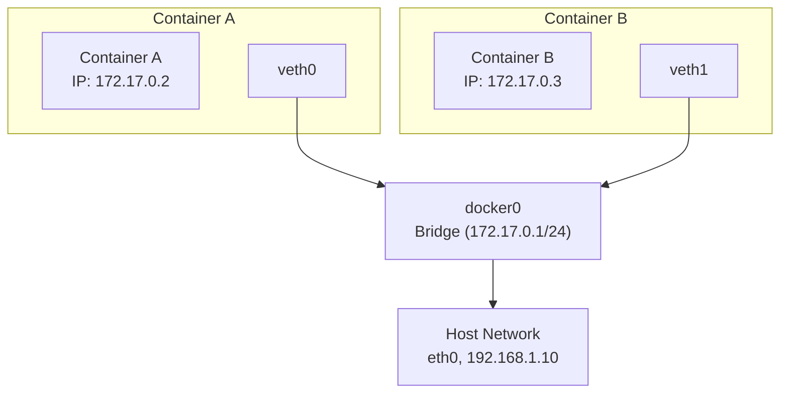

#### 2. Redes de host

- El contenedor utiliza directamente el espacio de nombres de red del host
- No hay aislamiento de red separado
- Proporciona el mejor rendimiento de red
- Posibilidad de conflictos de puertos

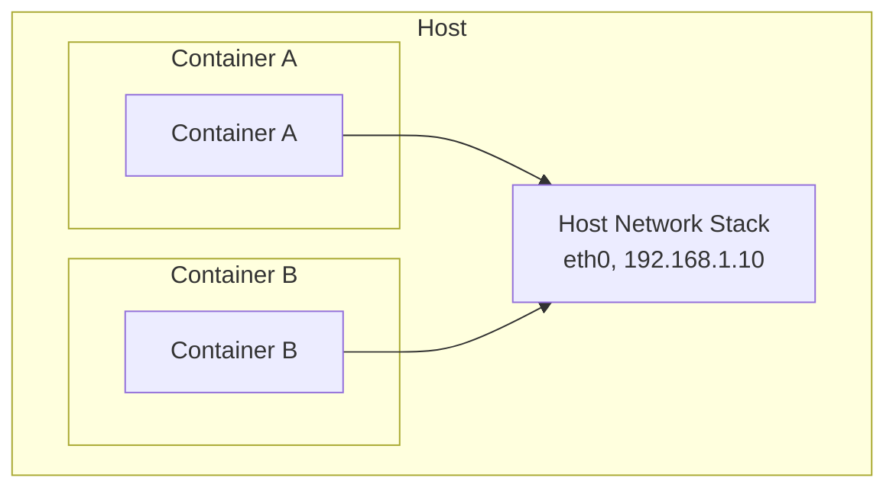

#### 3. Redes de superposición

- Admite la comunicación entre contenedores en varios hosts
- Utiliza protocolos de encapsulación como VXLAN y GENEVE
- Adecuado para clústeres a gran escala
- Compatible con Cilium, Calico, Flannel, etc.

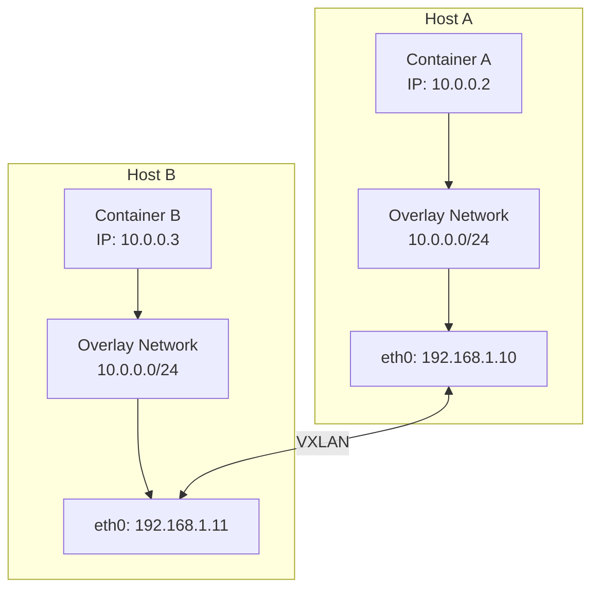

#### 4. Redes subyacentes (enrutamiento directo)

- Utiliza directamente la infraestructura de red física
- Sin sobrecarga de encapsulación
- Requiere control sobre la infraestructura de red
- Puede integrarse con protocolos de enrutamiento como BGP

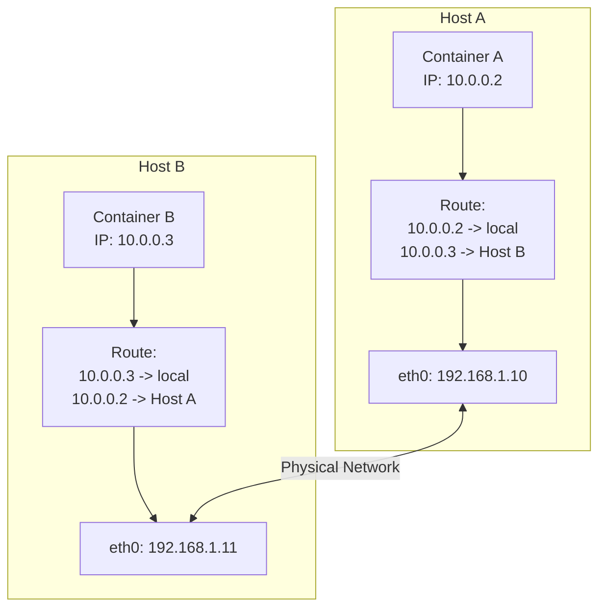

### Modelo de redes de Kubernetes

Kubernetes tiene un requisito fundamental: todos los Pods deben poder comunicarse entre sí sin NAT. Para lograrlo, define el siguiente modelo de red:

1. **Comunicación de Pod a Pod**: Todos los Pods deben poder comunicarse entre sí sin NAT
2. **Comunicación de nodo a Pod**: Los nodos deben poder comunicarse con todos los Pods sin NAT
3. **Comunicación de Pod a red externa**: Los Pods deben poder comunicarse con redes externas (normalmente mediante NAT)

#### Componentes de red de Kubernetes:

1. **Red de Pods**: Red que conecta todos los Pods del clúster
2. **Red de Services**: Proporciona endpoints estables para conjuntos de Pods
3. **DNS del clúster**: Servicio DNS para el descubrimiento de servicios
4. **Ingress/Egress**: Gestiona la comunicación con el exterior del clúster

### Enfoque de Cilium para las redes de contenedores

Cilium aprovecha eBPF para proporcionar una solución de redes de contenedores escalable y de alto rendimiento:

1. **Ruta de datos basada en eBPF**: Procesamiento directo de paquetes dentro del kernel
2. **Compatibilidad con diversos modos de red**: Superposición (VXLAN, Geneve) y subyacente (enrutamiento directo)
3. **Balanceo de carga avanzado**: Funcionalidad de reemplazo de kube-proxy
4. **Políticas de red**: Políticas granulares en los niveles L3-L7
5. **IPAM integrado**: Compatibilidad con diversas estrategias de asignación de direcciones IP

## Redes de superposición

Las redes de superposición son una tecnología que construye una capa de red virtual sobre la infraestructura de red existente. Esta tecnología permite crear topologías de red virtuales independientemente de la topología de red física. En entornos de contenedores, se utiliza ampliamente para habilitar la comunicación entre contenedores en varios hosts.

### Cómo funcionan las redes de superposición

Las redes de superposición funcionan mediante tecnología de encapsulación. Los paquetes originales se encapsulan dentro de otros paquetes y se transmiten a través de la red física.

1. **Encapsulación de paquetes**: El paquete original (paquete interno) se envuelve con nuevos encabezados y, a veces, nuevos tráileres.
2. **Tunelización**: Los paquetes encapsulados se transmiten a través de la red física hasta el host de destino.
3. **Desencapsulación de paquetes**: En el host de destino, se elimina el encabezado externo y se extrae el paquete original.
4. **Reenvío de paquetes**: El paquete original se reenvía al contenedor de destino.

### Principales protocolos de redes de superposición

#### VXLAN (Virtual Extensible LAN)

VXLAN es uno de los protocolos de superposición más utilizados en las redes de contenedores.

- **VXLAN Tunnel Endpoint (VTEP)**: Responsable de la encapsulación y desencapsulación de paquetes
- **VXLAN Network Identifier (VNI)**: Admite hasta 16,777,216 redes virtuales
- **Encapsulación UDP**: Los paquetes VXLAN se transmiten a través del puerto UDP 4789
- **Encapsulación MAC-en-UDP**: Encapsula las tramas L2 originales en paquetes UDP

Estructura de paquetes VXLAN:
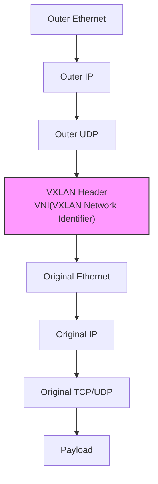

#### GENEVE (Generic Network Virtualization Encapsulation)

GENEVE es un protocolo de superposición más flexible diseñado para superar las limitaciones de VXLAN.

- **Encabezados de opciones extensibles**: Admite diversos metadatos
- **Independiente del protocolo**: Puede utilizarse con diversas tecnologías de virtualización
- **Encapsulación UDP**: Se transmite a través del puerto UDP 6081
- **Tunelización flexible**: Admite diversos requisitos de virtualización de red

#### IPsec

IPsec es un conjunto de protocolos que proporciona servicios de seguridad a nivel de paquetes IP.

- **Autenticación y cifrado**: Garantiza la integridad y confidencialidad de los datos
- **Modos de transporte y túnel**: Admite diversos escenarios de implementación
- **Asociación de seguridad (SA)**: Define parámetros de seguridad entre las partes que se comunican
- **Internet Key Exchange (IKE)**: Automatiza la gestión de claves de seguridad

### Ventajas y desventajas de las redes de superposición

#### Ventajas:

- **Flexibilidad**: Permite configurar redes virtuales independientemente de la topología de red física
- **Escalabilidad**: Admite grandes segmentos de red y numerosos endpoints
- **Aislamiento**: Proporciona aislamiento de red entre distintos tenants o aplicaciones
- **Compatibilidad**: Puede funcionar con la infraestructura de red existente

#### Desventajas:

- **Sobrecarga**: Aumento del tamaño de los paquetes y de la sobrecarga de procesamiento debido a la encapsulación
- **Consideraciones de MTU**: Reducción de la Maximum Transmission Unit (MTU) debido a la encapsulación
- **Complejidad**: La resolución de problemas y la depuración pueden ser más complejas
- **Latencia**: Se añade una ligera latencia durante la encapsulación y la desencapsulación

### Redes de superposición en Cilium

Cilium admite protocolos de superposición como VXLAN y Geneve, y aprovecha eBPF para proporcionar un procesamiento eficiente de paquetes.

- **Procesamiento VXLAN basado en eBPF**: Encapsulación y desencapsulación de paquetes directamente dentro del kernel
- **Enrutamiento eficiente**: Reenvío de paquetes a través de rutas optimizadas
- **Opciones de cifrado**: Superposición cifrada mediante IPsec o WireGuard
- **Híbrido con enrutamiento directo**: Puede combinar la superposición y el enrutamiento directo según sea necesario

#### Ejemplo de configuración de VXLAN de Cilium:

```yaml
apiVersion: v1
kind: ConfigMap
metadata:
  name: cilium-config
  namespace: kube-system
data:
  tunnel: "vxlan"
  enable-ipv4: "true"
  enable-ipv6: "false"
  ipv4-range: "10.0.0.0/16"
  ipv4-tunnel-endpoint-selector: "kubernetes.io/hostname"
```

## Traducción de direcciones de red (NAT)

La traducción de direcciones de red (NAT) es el proceso de modificar las direcciones de origen o destino de los paquetes IP. NAT se utiliza principalmente para permitir que los dispositivos de redes privadas se comuniquen con Internet pública, o para habilitar la comunicación entre dos redes con espacios de direcciones de red superpuestos.

### Tipos principales de NAT

#### 1. NAT de origen (SNAT)

NAT de origen modifica la dirección IP de origen de los paquetes. Normalmente se utiliza cuando los dispositivos de redes privadas acceden a Internet.

- **Cómo funciona**: Traduce la dirección IP privada de los hosts internos a una dirección IP pública
- **Casos de uso**: Acceso a Internet, conexiones salientes
- **Seguimiento**: Almacena el estado de la conexión en la tabla NAT

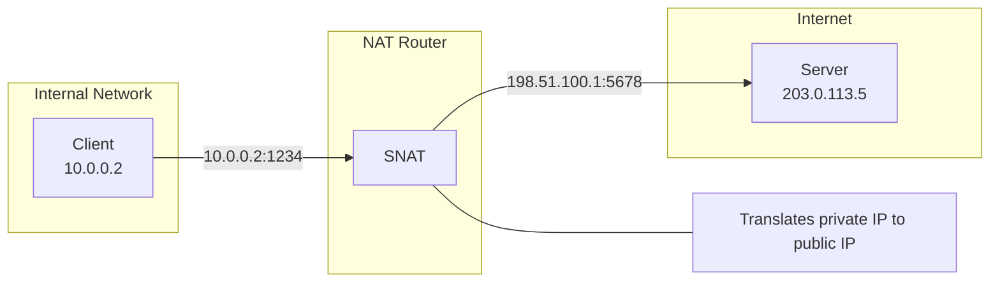

#### 2. NAT de destino (DNAT)

NAT de destino modifica la dirección IP de destino de los paquetes. Normalmente se utiliza al acceder desde Internet pública a servicios en redes privadas.

- **Cómo funciona**: Traduce las direcciones IP públicas a direcciones IP privadas de hosts internos
- **Casos de uso**: Reenvío de puertos, balanceo de carga, conexiones entrantes
- **Configuración**: Define asignaciones para puertos específicos o rangos de puertos

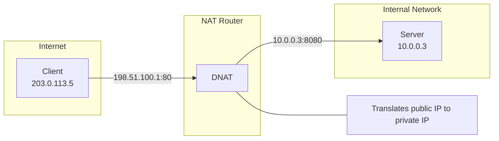

#### 3. Traducción de direcciones de puerto (PAT)

PAT modifica tanto las direcciones IP como los números de puerto. Esto permite que varios hosts internos compartan una única dirección IP pública.

- **Cómo funciona**: Traduce las combinaciones IP:puerto de los hosts internos a distintos puertos de una única IP pública
- **Casos de uso**: Conservación de direcciones IP, compatibilidad con muchos hosts internos
- **Limitaciones**: Limitada por el número de puertos disponibles (aproximadamente 65,000)

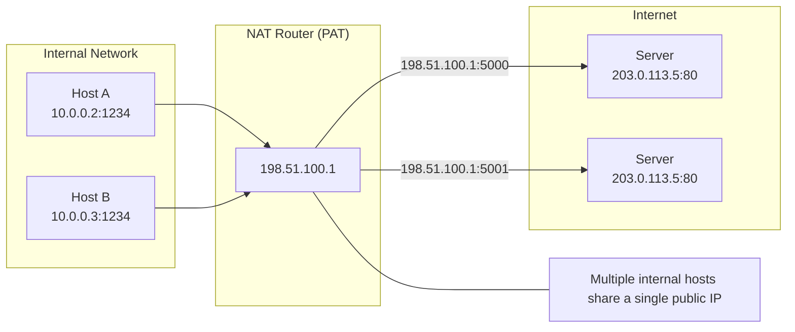

#### 4. NAT bidireccional

NAT bidireccional modifica tanto las direcciones de origen como las de destino. Esto permite la comunicación entre dos redes con espacios de direcciones de red superpuestos.

- **Cómo funciona**: Traducción de direcciones en ambas direcciones
- **Casos de uso**: Fusiones de redes, resolución de conflictos de espacio de direcciones
- **Complejidad**: Configuración y mantenimiento más complejos

### Ventajas y desventajas de NAT

#### Ventajas:

- **Conservación de direcciones IP**: Admite muchos hosts internos con un número limitado de direcciones IP públicas
- **Seguridad mejorada**: Oculta la topología de la red interna
- **Aislamiento de red**: Puede conectar redes con espacios de direcciones superpuestos
- **Diseño de red flexible**: Puede cambiar de ISP sin reconfigurar la red interna

#### Desventajas:

- **Sobrecarga del seguimiento de conexiones**: Recursos necesarios para el mantenimiento de la tabla de estado
- **Problemas con determinados protocolos**: Es posible que algunos protocolos no sean compatibles con NAT
- **Pérdida de conectividad de extremo a extremo**: Dificultad para la comunicación directa entre pares
- **Resolución de problemas compleja**: La depuración de problemas relacionados con NAT puede ser compleja

### NAT en Kubernetes y Cilium

#### NAT en Kubernetes

Kubernetes utiliza NAT en diversos escenarios:

1. **Comunicación fuera del clúster**: SNAT cuando los Pods se comunican fuera del clúster
2. **Implementación de Service**: Los Services Cluster IP utilizan DNAT para redirigir el tráfico a los Pods
3. **Services NodePort**: DNAT desde IP:puerto del nodo a los Pods
4. **Services LoadBalancer**: DNAT desde la IP externa del balanceador de carga a los Pods

#### NAT en Cilium

Cilium aprovecha eBPF para proporcionar una implementación eficiente de NAT:

1. **NAT basado en eBPF**: Realiza NAT directamente dentro del kernel
2. **Seguimiento de conexiones de alto rendimiento**: Seguimiento del estado de conexión mediante mapas BPF optimizados
3. **Políticas NAT**: Puede definir reglas NAT granulares
4. **Masquerading**: SNAT automático para la comunicación desde los Pods hacia fuera del clúster

#### Ejemplo de configuración NAT de Cilium:

```yaml
apiVersion: v1
kind: ConfigMap
metadata:
  name: cilium-config
  namespace: kube-system
data:
  # Enable masquerading for communication outside the cluster
  enable-ipv4-masquerade: "true"

  # Use eBPF-based masquerading
  enable-bpf-masquerade: "true"

  # NAT map size setting
  bpf-nat-global-max: "262144"

  # Exclude specific CIDRs from masquerading
  ipv4-masquerade-exclude-cidr: "10.0.0.0/8,172.16.0.0/12,192.168.0.0/16"
```

## Protocolos de enrutamiento

Los protocolos de enrutamiento definen las reglas y los procedimientos que determinan la ruta óptima para que los paquetes viajen desde el origen hasta el destino en una red. Estos protocolos desempeñan un papel importante al adaptarse a los cambios de topología de red, reenviar el tráfico de forma eficiente y evitar fallos de red.

### Clasificación de los protocolos de enrutamiento

#### 1. Protocolos de gateway interior (IGP)

Los protocolos de gateway interior se utilizan para intercambiar información de enrutamiento dentro de un único Autonomous System (AS).

##### Protocolos de vector de distancia

- **RIP (Routing Information Protocol)**
  - Utiliza el recuento de saltos como métrica
  - Límite máximo de 15 saltos
  - Implementación sencilla, adecuada para redes pequeñas
  - Actualiza toda la tabla de enrutamiento cada 30 segundos

- **EIGRP (Enhanced Interior Gateway Routing Protocol)**
  - Métrica compuesta que considera ancho de banda, retraso, carga y fiabilidad
  - Envía solo actualizaciones parciales
  - Convergencia rápida
  - Protocolo propietario de Cisco (anteriormente)

##### Protocolos de estado de enlace

- **OSPF (Open Shortest Path First)**
  - Calcula la ruta más corta mediante el algoritmo de Dijkstra
  - Jerarquía basada en áreas
  - Convergencia rápida
  - Admite redes a gran escala
  - Intercambia información de topología mediante Link State Advertisements (LSA)

- **IS-IS (Intermediate System to Intermediate System)**
  - Protocolo de estado de enlace similar a OSPF
  - Ampliamente utilizado en grandes redes de proveedores de servicios
  - Admite varias capas de red
  - Actualizaciones de enrutamiento eficientes

#### 2. Protocolos de gateway exterior (EGP)

Los protocolos de gateway exterior se utilizan para intercambiar información de enrutamiento entre Autonomous Systems diferentes.

- **BGP (Border Gateway Protocol)**
  - Protocolo de enrutamiento central de Internet
  - Protocolo de vector de ruta
  - Decisiones de enrutamiento basadas en políticas
  - Sesiones fiables sobre TCP
  - Selección de rutas mediante atributos de ruta (AS path, preferencia local, etc.)
  - Variantes iBGP (BGP interno) y eBGP (BGP externo)

### Protocolos de enrutamiento en las redes de contenedores

En los entornos de contenedores, los protocolos de enrutamiento tradicionales se utilizan junto con mecanismos de enrutamiento específicos para contenedores.

#### 1. Redes de contenedores con BGP

BGP está ganando popularidad en las redes de contenedores por los siguientes motivos:

- **Enrutamiento directo**: Enruta las IP de Pod directamente sin la sobrecarga de superposición
- **Escalabilidad**: Admite clústeres a gran escala y entornos multiclúster
- **Integración con la red existente**: Integración con la infraestructura de red del centro de datos
- **Alta disponibilidad**: Compatibilidad con múltiples rutas y failover rápido

#### 2. Mecanismos de enrutamiento de redes de contenedores

- **Enrutamiento basado en host**: Cada nodo anuncia información de enrutamiento para su propio CIDR de Pod
- **Enrutamiento centralizado**: Un controlador gestiona las decisiones de enrutamiento de forma centralizada
- **Enrutamiento distribuido**: Intercambio directo de información de enrutamiento entre nodos
- **Enrutamiento basado en políticas**: Decisiones de enrutamiento basadas en las características del tráfico

### Enrutamiento en Cilium

Cilium implementa un enrutamiento eficiente mediante eBPF y admite diversos modos de enrutamiento.

#### 1. Enrutamiento nativo (enrutamiento directo)

En el modo de enrutamiento nativo, Cilium enruta las IP de Pod directamente sin encapsulación de superposición.

- **Cómo funciona**: Cada nodo anuncia información de enrutamiento para su CIDR de Pod
- **Ventajas**: Sin sobrecarga de encapsulación, rendimiento óptimo
- **Requisitos**: Red enrutable entre nodos
- **Casos de uso**: Cargas de trabajo críticas para el rendimiento, clústeres de una sola subred

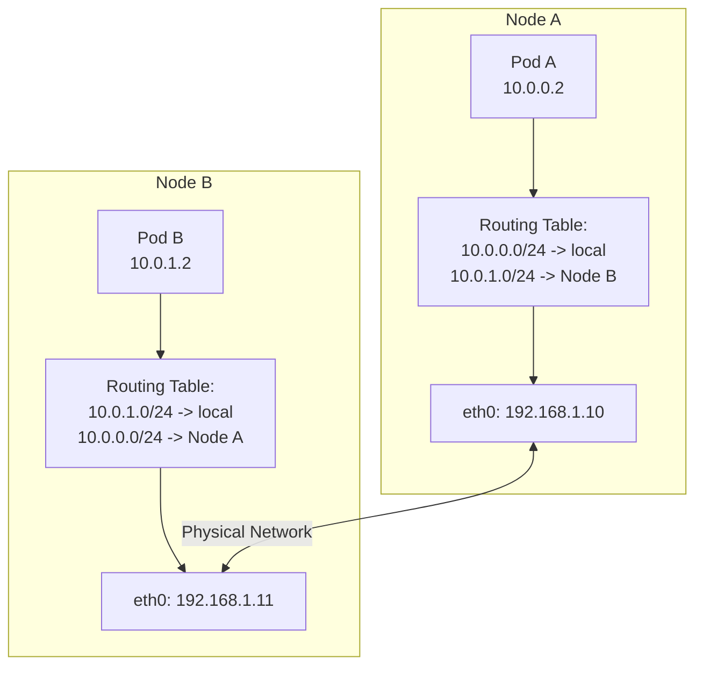

#### 2. Enrutamiento BGP

Cilium admite el enrutamiento BGP para integrar las IP de Pod con la infraestructura de red física.

- **Cómo funciona**: Cilium anuncia los CIDR de Pod a través de peering BGP
- **Ventajas**: Integración con la infraestructura de red existente, alta disponibilidad
- **Componentes**: Peering BGP, filtrado de rutas, atributos de comunidad
- **Casos de uso**: Integración con redes de centros de datos, entornos multiclúster

#### 3. Enrutamiento de superposición

Cilium puede enrutar el tráfico de Pod entre nodos mediante protocolos de superposición como VXLAN o Geneve.

- **Cómo funciona**: Encapsula paquetes de Pod para transmitirlos entre nodos
- **Ventajas**: Minimiza los requisitos de infraestructura de red, implementación flexible
- **Casos de uso**: Entornos de nube, topologías de red complejas

#### 4. Enrutamiento híbrido

Cilium admite un enfoque híbrido que combina el enrutamiento directo y el enrutamiento de superposición.

- **Cómo funciona**: Utiliza el enrutamiento directo cuando es posible y superposición en caso contrario
- **Ventajas**: Equilibrio entre rendimiento y flexibilidad
- **Casos de uso**: Entornos de red mixtos, implementaciones en la nube y on-premises

### Ejemplos de configuración de enrutamiento de Cilium

#### Configuración de enrutamiento nativo:

```yaml
apiVersion: v1
kind: ConfigMap
metadata:
  name: cilium-config
  namespace: kube-system
data:
  tunnel: "disabled"
  enable-auto-direct-node-routes: "true"
  ipv4-native-routing-cidr: "10.0.0.0/16"
```

#### Configuración de enrutamiento BGP:

```yaml
apiVersion: v1
kind: ConfigMap
metadata:
  name: cilium-config
  namespace: kube-system
data:
  tunnel: "disabled"
  enable-bgp: "true"
  bgp-announce-pod-cidr: "true"
  bgp-config-path: "/var/lib/cilium/bgp/config.yaml"
```

#### Configuración de enrutamiento de superposición:

```yaml
apiVersion: v1
kind: ConfigMap
metadata:
  name: cilium-config
  namespace: kube-system
data:
  tunnel: "vxlan"
  enable-ipv4: "true"
  ipv4-range: "10.0.0.0/16"
```

## DNS y descubrimiento de servicios

DNS (Domain Name System) y el descubrimiento de servicios desempeñan un papel fundamental en las aplicaciones de red modernas, especialmente en entornos dinámicos de contenedores. Estos mecanismos abstraen las ubicaciones de los servicios y permiten que las aplicaciones se adapten a los cambios en la topología de red.

### DNS (Domain Name System)

DNS es un sistema distribuido que traduce nombres de dominio legibles por humanos a direcciones IP.

#### Cómo funciona DNS

1. **Espacio de nombres jerárquico**: Los nombres de dominio se organizan en una estructura jerárquica separada por puntos (por ejemplo, www.example.com)
2. **Base de datos distribuida**: Red de servidores DNS distribuidos en todo el mundo
3. **Consultas iterativas y recursivas**: Dos métodos principales para procesar solicitudes de clientes
4. **Caché**: Almacenamiento temporal de resultados para mejorar el rendimiento

#### Tipos de registros DNS

- **Registro A**: Asigna un nombre de dominio a una dirección IPv4
- **Registro AAAA**: Asigna un nombre de dominio a una dirección IPv6
- **Registro CNAME**: Alias (nombre canónico) de un nombre de dominio
- **Registro MX**: Especifica el servidor de correo
- **Registro SRV**: Especifica el servidor que proporciona un servicio concreto
- **Registro TXT**: Almacena información de texto (utilizado principalmente para verificación y políticas)
- **Registro PTR**: Asignación inversa de dirección IP a nombre de dominio (DNS inverso)

#### Proceso de resolución DNS

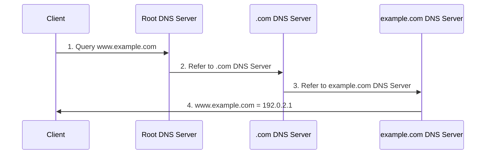

### Descubrimiento de servicios en entornos de contenedores

El descubrimiento de servicios es el proceso de detectar automáticamente los servicios disponibles y localizarlos en una red. En los entornos de contenedores, es especialmente importante para gestionar de manera eficaz los servicios creados y eliminados dinámicamente.

#### Enfoques de descubrimiento de servicios

1. **Descubrimiento de servicios basado en DNS**
   - Crea registros DNS cuando se registran servicios
   - Los clientes descubren servicios mediante búsquedas DNS estándar
   - Sencillo y ampliamente compatible
   - Ejemplos: Kubernetes DNS, CoreDNS

2. **Descubrimiento de servicios basado en almacén clave-valor**
   - Almacena información de servicios en almacenes clave-valor centralizados
   - Los clientes consultan el almacén para descubrir servicios
   - Compatibilidad con metadatos enriquecidos
   - Ejemplos: etcd, Consul, ZooKeeper

3. **Descubrimiento de servicios basado en API**
   - Proporciona información de servicios a través de API dedicadas
   - Los clientes llaman a las API para descubrir servicios
   - Compatibilidad con consultas y filtrado complejos
   - Ejemplo: Kubernetes API Server

4. **Descubrimiento de servicios basado en mesh**
   - La infraestructura de service mesh gestiona el descubrimiento de servicios
   - Admite balanceo de carga y enrutamiento en el lado del cliente
   - Funcionalidades avanzadas de gestión de tráfico
   - Ejemplos: Istio, Linkerd

### DNS y descubrimiento de servicios en Kubernetes

Kubernetes proporciona mecanismos integrados para el descubrimiento de servicios dentro del clúster.

#### Kubernetes Services

Los Kubernetes Services proporcionan endpoints estables para conjuntos de Pods:

- **ClusterIP**: IP virtual accesible solo dentro del clúster
- **NodePort**: Accesible mediante un puerto específico en todos los nodos
- **LoadBalancer**: Accesible mediante un balanceador de carga externo
- **ExternalName**: Alias DNS para un servicio externo

#### Kubernetes DNS

Kubernetes ejecuta un servicio DNS de clúster (normalmente CoreDNS) para admitir el descubrimiento de servicios:

- **DNS de Service**: `<service-name>.<namespace>.svc.cluster.local`
- **DNS de Pod**: `<pod-ip>.<namespace>.pod.cluster.local`
- **Headless Services**: El nombre del Service se resuelve en registros DNS de todas las IP de Pod

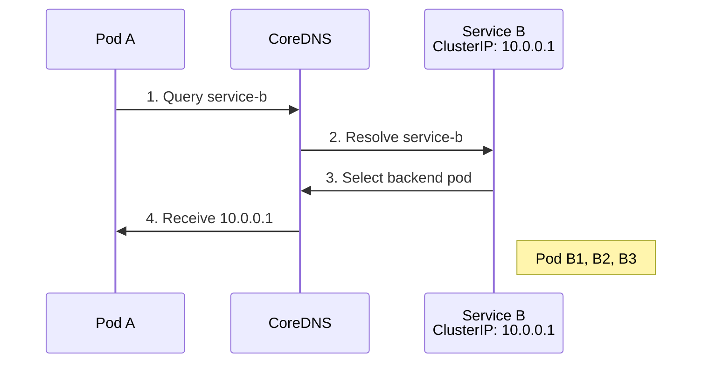

#### Mecanismos de descubrimiento de servicios de Kubernetes

1. **Variables de entorno**: Las variables de entorno para los servicios activos se inyectan en cada Pod
2. **DNS**: Resolución de nombres de Service a través del DNS del clúster
3. **API Server**: Recupera información de Service consultando directamente la API de Kubernetes
4. **Objetos Endpoint**: Proporcionan información de IP y puerto de los Pods backend de un Service

### DNS y descubrimiento de servicios en Cilium

Cilium se integra con los mecanismos de descubrimiento de servicios de Kubernetes y proporciona funcionalidades adicionales.

#### Políticas basadas en DNS de Cilium

Cilium puede definir políticas de red basadas en nombres DNS:

- **Filtrado basado en nombres DNS**: Control de acceso para nombres de dominio específicos
- **Compatibilidad con comodines**: Coincidencia de patrones como `*.example.com`
- **Políticas FQDN**: Políticas basadas en Fully Qualified Domain Names (FQDN)

```yaml
apiVersion: "cilium.io/v2"
kind: CiliumNetworkPolicy
metadata:
  name: "dns-policy"
spec:
  endpointSelector:
    matchLabels:
      app: myapp
  egress:
  - toFQDNs:
    - matchName: "api.example.com"
    - matchPattern: "*.api.example.com"
```

#### Mejoras de Cilium para el descubrimiento de servicios

Cilium proporciona varias funcionalidades que mejoran el descubrimiento de servicios de Kubernetes:

1. **Implementación de Service basada en eBPF**:
   - Reemplazo de kube-proxy
   - Balanceo de carga directo de Service dentro del kernel
   - Mejor rendimiento y funcionalidades

2. **Services globales**:
   - Descubrimiento de servicios en varios clústeres
   - Balanceo de carga entre clústeres
   - Espacio de nombres de Service unificado

3. **Afinidad de Service**:
   - Compatibilidad con afinidad de sesión
   - Selección consistente de backend basada en la IP de origen
   - Compatibilidad con conexiones con estado

4. **Integración de comprobaciones de estado**:
   - Supervisión del estado del backend
   - Eliminación automática de backends no saludables
   - Detección y recuperación rápidas de fallos

#### Ejemplo de configuración de Service de Cilium:

```yaml
apiVersion: v1
kind: ConfigMap
metadata:
  name: cilium-config
  namespace: kube-system
data:
  # Enable kube-proxy replacement
  enable-k8s-services: "true"
  kube-proxy-replacement: "strict"

  # Enable DNS policy support
  enable-fqdn-filter: "true"

  # Configure service affinity
  enable-session-affinity: "true"

  # Enable global services
  enable-global-services: "true"
```

## Conceptos de balanceo de carga

El balanceo de carga es una tecnología que distribuye el tráfico de red entre varios servidores o servicios backend para optimizar el uso de recursos, aumentar el rendimiento, reducir la latencia y garantizar una alta disponibilidad. En los entornos de contenedores, es especialmente importante distribuir eficazmente el tráfico entre instancias backend que cambian dinámicamente.

### Tipos de balanceo de carga

#### 1. Balanceo de carga L4 (capa de transporte)

El balanceo de carga L4 distribuye el tráfico basándose en información de la capa de transporte, como direcciones IP y números de puerto.

- **Cómo funciona**: Decisiones de enrutamiento basadas en información de encabezados TCP/UDP
- **Ventajas**: Procesamiento rápido, baja sobrecarga, puede manejar tráfico cifrado
- **Desventajas**: No puede realizar enrutamiento avanzado basado en información de la capa de aplicación
- **Casos de uso**: Servicios basados en TCP/UDP, requisitos de alto rendimiento

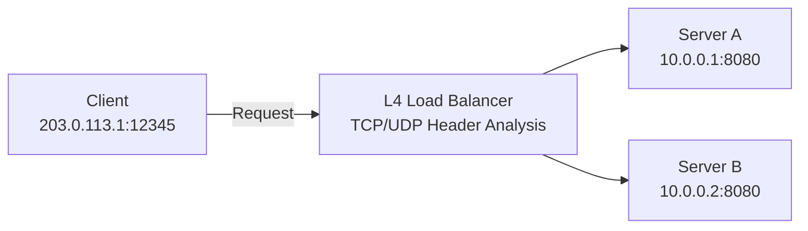

#### 2. Balanceo de carga L7 (capa de aplicación)

El balanceo de carga L7 distribuye el tráfico basándose en información de la capa de aplicación, como encabezados HTTP, URL y cookies.

- **Cómo funciona**: Decisiones de enrutamiento mediante la inspección del contenido de solicitudes HTTP/HTTPS
- **Ventajas**: Enrutamiento basado en contenido, gestión avanzada de tráfico, funcionalidades de seguridad
- **Desventajas**: Mayor sobrecarga de procesamiento, se requiere terminación SSL para el tráfico cifrado
- **Casos de uso**: Aplicaciones web, microservicios, API gateways

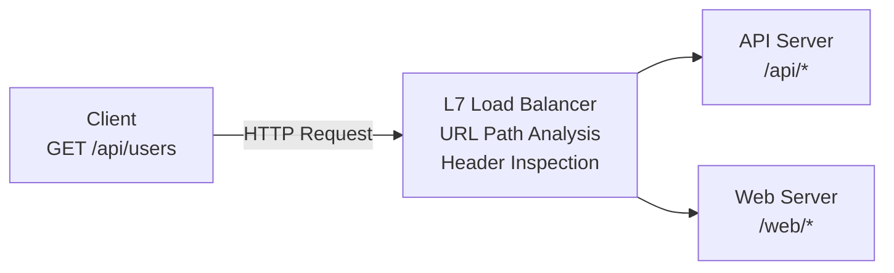

### Algoritmos de balanceo de carga

Los algoritmos de balanceo de carga determinan cómo se distribuye el tráfico a los servidores backend.

#### 1. Round Robin

- **Cómo funciona**: Distribuye las solicitudes a cada servidor backend de forma secuencial
- **Ventajas**: Implementación sencilla, distribución uniforme
- **Desventajas**: No considera las diferencias de capacidad de los servidores ni la carga actual
- **Variantes**: Round Robin ponderado (aplica pesos según la capacidad del servidor)

#### 2. Menor número de conexiones

- **Cómo funciona**: Reenvía las nuevas solicitudes al servidor con menos conexiones activas
- **Ventajas**: Considera la carga del servidor, eficaz para conexiones largas
- **Desventajas**: El número de conexiones no siempre refleja con precisión la carga
- **Variantes**: Menor número de conexiones ponderado (aplica pesos según la capacidad del servidor)

#### 3. Hash de IP

- **Cómo funciona**: Aplica hash a la dirección IP del cliente para una selección consistente del servidor backend
- **Ventajas**: Proporciona persistencia de sesión; el mismo cliente se enruta al mismo servidor
- **Desventajas**: Posible distribución desigual, posible sobrecarga en servidores específicos
- **Variantes**: Hash de IP de origen-destino (considera tanto las IP de origen como las de destino)

#### 4. Menor tiempo de respuesta

- **Cómo funciona**: Reenvía las solicitudes al servidor con el tiempo de respuesta más corto
- **Ventajas**: Considera el rendimiento y la disponibilidad, adecuado para aplicaciones sensibles a la latencia
- **Desventajas**: Sobrecarga de medición del tiempo de respuesta, afectado por la variabilidad de la red
- **Variantes**: Tiempo de respuesta ponderado (considera tanto la capacidad del servidor como el tiempo de respuesta)

#### 5. Selección aleatoria

- **Cómo funciona**: Selecciona aleatoriamente un servidor backend
- **Ventajas**: Implementación sencilla, no requiere seguimiento de estado especial
- **Desventajas**: Posible distribución desigual
- **Variantes**: Selección aleatoria ponderada (ajusta la probabilidad según la capacidad del servidor)

### Modelos de implementación de balanceadores de carga

#### 1. Balanceadores de carga de hardware

- **Características**: Equipos físicos dedicados
- **Ventajas**: Alto rendimiento, fiabilidad, aceleración de hardware dedicada
- **Desventajas**: Coste, escalabilidad limitada, falta de flexibilidad
- **Ejemplos**: F5 BIG-IP, Citrix ADC, A10 Networks

#### 2. Balanceadores de carga de software

- **Características**: Software que se ejecuta en servidores de propósito general
- **Ventajas**: Flexibilidad, eficiencia de costes, programabilidad
- **Desventajas**: Generalmente menor rendimiento que los balanceadores de carga de hardware
- **Ejemplos**: NGINX, HAProxy, Envoy

#### 3. Balanceadores de carga de nube

- **Características**: Servicios gestionados por proveedores de nube
- **Ventajas**: Menor sobrecarga de gestión, escalado automático, alta disponibilidad
- **Desventajas**: Dependencia del proveedor, personalización limitada
- **Ejemplos**: AWS ELB/ALB/NLB, Google Cloud Load Balancing, Azure Load Balancer

#### 4. Balanceadores de carga nativos para contenedores

- **Características**: Balanceo de carga optimizado para entornos de contenedores
- **Ventajas**: Integración con la orquestación de contenedores, descubrimiento dinámico de servicios
- **Desventajas**: Especializados para entornos de contenedores
- **Ejemplos**: Kubernetes Services, Istio, Cilium

### Balanceo de carga en Kubernetes

Kubernetes proporciona varios niveles de balanceo de carga:

#### 1. Balanceo de carga de Service

- **ClusterIP**: Balanceo de carga interno del clúster
- **NodePort**: Acceso externo a través de puertos de nodo
- **LoadBalancer**: Aprovisionamiento de balanceador de carga externo
- **ExternalName**: Alias DNS para servicios externos

#### 2. Controladores Ingress

- Balanceo de carga y enrutamiento L7
- Enrutamiento basado en URL, terminación SSL, autenticación
- Diversas implementaciones: NGINX, Traefik, HAProxy, Istio

#### 3. Service Mesh

- Gestión avanzada del tráfico entre microservicios
- Enrutamiento granular, división de tráfico, inyección de fallos
- Ejemplos: Istio, Linkerd, Consul Connect

### Balanceo de carga en Cilium

Cilium implementa un balanceo de carga eficiente mediante eBPF:

#### 1. Balanceo de carga basado en eBPF

- **Reemplazo de kube-proxy**: Balanceo de carga directo de Service dentro del kernel
- **Mejora del rendimiento**: Latencia reducida mediante la omisión de la pila de red
- **Escalabilidad**: Admite Services y endpoints a gran escala
- **Optimización del seguimiento de conexiones**: Gestión eficiente del estado

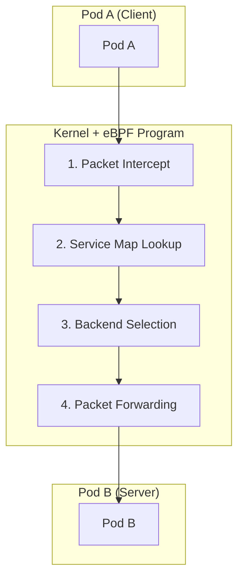

#### 2. Algoritmos de balanceo de carga

Cilium admite diversos algoritmos de balanceo de carga:

- **Round Robin**: Algoritmo predeterminado, distribución uniforme
- **Maglev**: Selección consistente de backend basada en la IP de origen
- **Afinidad de sesión**: Conexiones persistentes basadas en la IP del cliente
- **Tiempo de espera de Maglev**: Reequilibrio después del tiempo especificado

#### 3. Balanceo de carga L7

Cilium también admite el balanceo de carga L7 (capa de aplicación):

- **Enrutamiento basado en encabezados HTTP**: Enrutamiento basado en valores de encabezado específicos
- **Enrutamiento basado en rutas URL**: Distribución de tráfico basada en patrones URL
- **Enrutamiento gRPC**: Enrutamiento basado en métodos y metadatos gRPC
- **Enrutamiento Kafka**: Enrutamiento basado en temas Kafka y claves de mensaje

#### 4. Balanceo de carga de Service global

Cilium admite el balanceo de carga entre varios clústeres:

- **Balanceo de carga entre clústeres**: Distribución de tráfico entre backends de varios clústeres
- **Enrutamiento consciente de la ubicación**: Selección de backend que considera latencia y ubicación
- **Failover**: Failover automático durante fallos del clúster

#### Ejemplo de configuración de balanceo de carga de Cilium:

```yaml
apiVersion: v1
kind: ConfigMap
metadata:
  name: cilium-config
  namespace: kube-system
data:
  # Enable kube-proxy replacement
  kube-proxy-replacement: "strict"

  # Configure load balancing algorithm
  load-balancing-algorithm: "maglev"
  maglev-hash-seed: "Cilium"
  maglev-table-size: "16381"

  # Configure session affinity
  enable-session-affinity: "true"

  # Enable L7 load balancing
  enable-l7-proxy: "true"
```

## Conceptos básicos de seguridad de red

La seguridad de red es la práctica de proteger la infraestructura de red, las aplicaciones y los datos frente al acceso no autorizado, el uso indebido, los fallos o la modificación. En los entornos de contenedores, la seguridad de red es aún más importante debido a su naturaleza dinámica y distribuida.

### Conceptos fundamentales de seguridad de red

#### 1. Defensa en profundidad

La defensa en profundidad es un enfoque que implementa múltiples capas de seguridad para que el fallo de un único mecanismo de seguridad no provoque una brecha completa en la seguridad del sistema.

- **Múltiples capas de seguridad**: Protección en los niveles de red, host, aplicación y datos
- **Controles redundantes**: Combinación de diversos mecanismos de seguridad
- **Aislamiento de fallos**: El fallo en una capa no afecta a las demás capas
- **Detección y respuesta a amenazas**: Supervisión y respuesta en cada capa

#### 2. Principio de privilegio mínimo

El principio de privilegio mínimo es una práctica de seguridad que concede a usuarios, procesos o aplicaciones solo los privilegios mínimos necesarios para realizar sus tareas.

- **Control de acceso granular**: Restringir el acceso únicamente a los recursos necesarios
- **Separación de privilegios**: Separación de privilegios para diversas funciones
- **Denegación predeterminada**: Denegar todo acceso que no esté explícitamente permitido
- **Revisión regular**: Auditoría y ajuste periódicos de privilegios

#### 3. Segmentación de red

La segmentación de red es una técnica que divide una red en segmentos o zonas más pequeños para mejorar la seguridad y limitar el movimiento lateral de las amenazas.

- **Zonas de seguridad**: Agrupación de sistemas con requisitos de seguridad similares
- **Microsegmentación**: Control granular a nivel de carga de trabajo
- **Protección del perímetro**: Control y supervisión del tráfico entre zonas
- **Aislamiento de amenazas**: Limitación del alcance del impacto de una brecha

#### 4. Cifrado

El cifrado es el proceso de transformar datos para que no puedan ser leídos por partes no autorizadas.

- **Cifrado en tránsito**: Protección de los datos que se desplazan por la red (por ejemplo, TLS/SSL)
- **Cifrado en reposo**: Protección de los datos almacenados en disco o en bases de datos
- **Cifrado de extremo a extremo**: Protección de los datos a lo largo de toda la ruta de comunicación
- **Gestión de claves**: Generación, almacenamiento y rotación seguros de claves de cifrado

### Amenazas de seguridad en las redes de contenedores

Los entornos de contenedores presentan desafíos de seguridad únicos:

#### 1. Ataques basados en red

- **Ataques DDoS (Distributed Denial of Service)**: Grandes volúmenes de tráfico para interrumpir la disponibilidad del servicio
- **Escaneo de puertos**: Exploración de puertos abiertos y vulnerabilidades
- **Suplantación ARP**: Manipulación de Address Resolution Protocol para interceptar tráfico de red
- **Envenenamiento DNS**: Redirección de búsquedas DNS a destinos maliciosos

#### 2. Ataques de la capa de aplicación

- **Inyección SQL**: Inserción de código SQL malicioso
- **XSS (Cross-Site Scripting)**: Inserción de scripts del lado del cliente
- **CSRF (Cross-Site Request Forgery)**: Realización de acciones maliciosas a través de usuarios autenticados
- **Inyección de comandos**: Entrada maliciosa para ejecutar comandos del sistema

#### 3. Amenazas específicas de contenedores

- **Vulnerabilidades de imágenes**: Imágenes de contenedor que contienen componentes vulnerables
- **Escalada de privilegios**: Elevación de privilegios del contenedor al host
- **Movimiento lateral**: Acceso no autorizado de un contenedor a otro
- **Explotación de montajes de volumen**: Acceso a rutas sensibles del host

### Controles de seguridad de red

#### 1. Firewalls

Los firewalls son sistemas de seguridad de red que filtran el tráfico de red según reglas de seguridad definidas.

- **Filtrado de paquetes**: Filtrado basado en direcciones IP, puertos y protocolos
- **Inspección con estado**: Decisiones basadas en el contexto que rastrean el estado de conexión
- **Filtrado de capa de aplicación**: Comprensión e inspección de protocolos de aplicación
- **Firewalls de próxima generación (NGFW)**: Funcionalidades avanzadas de detección y prevención de amenazas

#### 2. Sistemas de detección y prevención de intrusiones (IDS/IPS)

IDS/IPS son sistemas que supervisan el tráfico de red y detectan o bloquean actividades maliciosas.

- **Detección basada en firmas**: Coincidencia con patrones de ataque conocidos
- **Detección de anomalías**: Identificación de actividades que se desvían del comportamiento normal
- **Supervisión de comportamiento**: Análisis de patrones de actividad sospechosa
- **Respuesta automatizada**: Respuesta en tiempo real ante amenazas detectadas

#### 3. Políticas de red

Las políticas de red son conjuntos de reglas que definen la comunicación permitida dentro de una red.

- **Control de Ingress**: Restricción del tráfico entrante
- **Control de Egress**: Restricción del tráfico saliente
- **Políticas granulares**: Control de comunicación a nivel de carga de trabajo
- **Políticas basadas en etiquetas**: Aplicación flexible de políticas en entornos dinámicos

#### 4. Protocolos de cifrado

Los protocolos de cifrado proporcionan comunicación segura a través de las redes.

- **TLS/SSL**: Protección del tráfico web y la comunicación de API
- **IPsec**: Cifrado de capa de red
- **WireGuard**: Protocolo VPN moderno y eficiente
- **mTLS (TLS mutuo)**: Autenticación tanto del cliente como del servidor

### Seguridad de red en Kubernetes

Kubernetes proporciona varios mecanismos para la seguridad de red de las aplicaciones en contenedores:

#### 1. Políticas de red

Las políticas de red de Kubernetes son especificaciones que controlan la comunicación entre Pods.

- **Selectores de Pod**: Selección de los Pods a los que se aplican políticas según etiquetas
- **Reglas de Ingress**: Control del tráfico entrante
- **Reglas de Egress**: Control del tráfico saliente
- **Reglas basadas en CIDR**: Filtrado basado en rangos de IP

```yaml
apiVersion: networking.k8s.io/v1
kind: NetworkPolicy
metadata:
  name: api-allow
spec:
  podSelector:
    matchLabels:
      app: api
  ingress:
  - from:
    - podSelector:
        matchLabels:
          app: frontend
    ports:
    - protocol: TCP
      port: 8080
  egress:
  - to:
    - podSelector:
        matchLabels:
          app: database
    ports:
    - protocol: TCP
      port: 5432
```

#### 2. Seguridad de Service Mesh

Service mesh es una capa de infraestructura que gestiona y protege la comunicación entre microservicios.

- **mTLS**: Comunicación cifrada entre servicios
- **Autenticación y autorización**: Verificación de identidad de Service y control de acceso
- **Políticas de tráfico**: Enrutamiento granular y control de acceso
- **Observabilidad**: Visibilidad de la comunicación de servicio a servicio

#### 3. Contextos de seguridad

Los contextos de seguridad definen la configuración de privilegios y control de acceso para Pods y contenedores.

- **Restricción de privilegios**: Ejecución como usuario no root
- **Restricción de capacidades**: Permitir solo las capacidades de Linux necesarias
- **Sistema de archivos de solo lectura**: Sistema de archivos de contenedor inmutable
- **seccomp y AppArmor**: Restricción de llamadas al sistema y comportamiento de la aplicación

### Funcionalidades de seguridad de red de Cilium

Cilium aprovecha eBPF para proporcionar potentes funcionalidades de seguridad de red:

#### 1. Seguridad basada en identidad

Cilium aplica políticas de seguridad basadas en la identidad de la carga de trabajo en lugar de direcciones IP.

- **Políticas basadas en etiquetas**: Seguridad coherente en entornos dinámicos
- **Políticas basadas en Service Account**: Control de acceso basado en cuentas de servicio de Kubernetes
- **Políticas basadas en DNS**: Control de Egress basado en FQDN
- **Seguridad consciente de API**: Filtrado basado en métodos y rutas HTTP

#### 2. Cifrado transparente

Cilium puede cifrar el tráfico de red sin modificar las aplicaciones.

- **IPsec**: Cifrado de capa de red para el tráfico entre nodos
- **WireGuard**: Protocolo de cifrado moderno y eficiente
- **Integración transparente**: Cifrado aplicado sin cambios en la aplicación
- **Rotación de claves**: Gestión automatizada de claves de cifrado

#### 3. Detección de amenazas y visibilidad

Cilium proporciona una visibilidad profunda de la actividad de red y capacidades de detección de amenazas.

- **Hubble**: Supervisión y análisis de flujos de red
- **Registros de flujo**: Registros detallados de la comunicación de Pod a Pod
- **Detección de anomalías**: Identificación de patrones de red anómalos
- **Alertas de eventos de seguridad**: Alertas ante infracciones de políticas e intentos de ataque

#### 4. Aplicación de políticas L3-L7

Cilium proporciona una aplicación integral de políticas desde la capa de red hasta la capa de aplicación.

- **Políticas L3/L4**: Filtrado basado en IP y puertos
- **Filtrado HTTP L7**: Control basado en URL, método y encabezados
- **Filtrado gRPC L7**: Control basado en métodos y metadatos gRPC
- **Filtrado Kafka L7**: Control basado en temas y mensajes Kafka

#### Ejemplo de configuración de seguridad de red de Cilium:

```yaml
apiVersion: "cilium.io/v2"
kind: CiliumNetworkPolicy
metadata:
  name: "secure-api"
spec:
  endpointSelector:
    matchLabels:
      app: api
  ingress:
  - fromEndpoints:
    - matchLabels:
        app: frontend
    toPorts:
    - ports:
      - port: "8080"
        protocol: TCP
      rules:
        http:
        - method: "GET"
          path: "/api/v1/products"
  egress:
  - toEndpoints:
    - matchLabels:
        app: database
    toPorts:
    - ports:
      - port: "5432"
        protocol: TCP
  - toFQDNs:
    - matchName: "api.external-service.com"
    toPorts:
    - ports:
      - port: "443"
        protocol: TCP
```

### Prácticas recomendadas de seguridad de red

#### 1. Política de denegación predeterminada

- Implementar una política de denegación predeterminada que permita solo el tráfico explícitamente autorizado
- Abrir únicamente las rutas de comunicación necesarias
- Revisión periódica de políticas y eliminación de reglas innecesarias
- Mantener un registro de auditoría de los cambios de políticas

#### 2. Enfoque de defensa en profundidad

- Implementar múltiples capas de seguridad
- Combinar protección a nivel de red, host y aplicación
- Controles redundantes con diversos mecanismos de seguridad
- Eliminar puntos únicos de fallo

#### 3. Redes con privilegio mínimo

- Permitir solo el acceso de red mínimo necesario
- Definir políticas granulares por Service
- Bloquear puertos y protocolos innecesarios
- Revisión y ajuste periódicos de acceso

#### 4. Supervisión y auditoría continuas

- Supervisar el tráfico de red y las infracciones de políticas
- Detectar anomalías y amenazas potenciales
- Alertas y respuesta ante eventos de seguridad
- Auditorías de seguridad y evaluaciones de vulnerabilidades periódicas

## Cuestionario

Para poner a prueba lo aprendido en este capítulo, pruebe el [Cuestionario del tema](../../quizzes/networking/cilium/networking-concepts-quiz.md).
