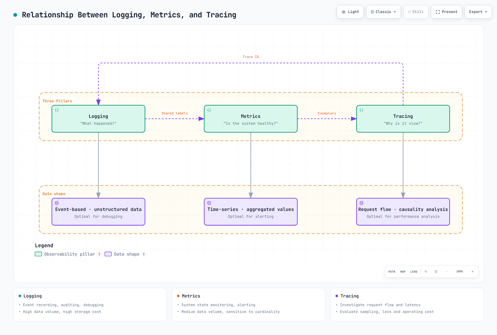

# Guía de optimización de observabilidad de EKS

> **Versiones de ejemplo validadas**: Prometheus 3.14.0 · OTel Collector Contrib 0.160.0 · Alertmanager 0.34.0 · OpenCost 1.121.2/chart 2.5.31

> **Última actualización**: September 13, 2026

Optimice la observabilidad en torno a las preguntas sobre incidentes, la calidad de recopilación y el costo medido. El número de nodos por sí solo no puede predecir el volumen de ingesta, la carga de consultas, el costo de retención ni los requisitos de personal. Este capítulo usa [ejemplos de configuración completos](https://github.com/Atom-oh/kubernetes-docs/tree/main/examples/observability/optimization) y enlaza a las guías de despliegue para la instalación del clúster. Las pruebas nativas usan datos sintéticos; no son benchmarks de capacidad de producción.

<span id="table-of-contents"></span>

## Contenido

- [1. Descripción general de los tres pilares de la observabilidad](#1-overview-of-the-three-pillars-of-observability)
- [2. Comparación de soluciones de registro](#2-logging-solution-comparison)
- [3. Recopilación y almacenamiento de métricas](#3-metrics-collection-and-storage)
- [4. Trazado distribuido](#4-distributed-tracing)
- [5. Monitoreo sin código basado en eBPF](#5-ebpf-based-no-code-monitoring)
- [6. Monitoreo de costos](#6-cost-monitoring)
- [7. Panel unificado de observabilidad](#7-unified-observability-dashboard)
- [8. Desafíos operativos y soluciones](#8-operational-challenges-and-solutions)
- [9. Prácticas recomendadas y próximos pasos](#9-best-practices-and-next-steps)

<span id="_1-1-relationship-between-logging-metrics-and-tracing"></span>

<span id="_1-2-role-of-each-pillar-and-selection-criteria"></span>

<span id="_1-3-overall-eks-observability-architecture"></span>

<span id="1-overview-of-the-three-pillars-of-observability"></span>

## 1. Descripción general de los tres pilares de la observabilidad

Los logs describen eventos, las métricas resumen el comportamiento a lo largo del tiempo y los traces describen rutas de solicitud instrumentadas. Un trace ausente o un panel sin actividad no demuestra que un Service esté en buen estado. Incluya las pérdidas del collector, las colas, las exportaciones fallidas y el estado de scrape en la misma vista operativa.



[🔍 Ver diagrama interactivo](https://www.atomai.click/kubernetes-docs/archmaps/en-observability-09-observability-optimization-0.html)

Use labels acotadas de service/route/status para las métricas y coloque los ID de solicitud de alta cardinalidad en logs/traces controlados adecuadamente. Un trace no necesariamente está completo: la instrumentación, la propagación, el sampling y la retención lo afectan.


[🔍 Ver diagrama interactivo](https://www.atomai.click/kubernetes-docs/archmaps/en-observability-09-observability-optimization-1.html)

Los agentes y los gateways tienen responsabilidades diferentes. Los agentes de nodo leen logs locales; los gateways pueden aplicar políticas centralizadas. El tail sampling necesita afinidad de trace y no puede hacerse correcto colocando réplicas arbitrarias de DaemonSet detrás de un balanceador de carga aleatorio.

<span id="_2-1-log-storage-comparison"></span>

<span id="_2-2-log-agent-comparison"></span>

<span id="_2-3-fluent-bit-loki-configuration-example-for-eks"></span>

<span id="2-logging-solution-comparison"></span>

## 2. Comparación de soluciones de registro

| Backend | Características útiles | Costos y restricciones operativas |
|---|---|---|
| CloudWatch Logs | Ingesta administrada, retención y Logs Insights | Región, clase de log, ingesta, almacenamiento, escaneo de consultas y cuotas |
| OpenSearch | Búsqueda y análisis indexados | Capacidad aprovisionada/serverless, indexación, réplicas, almacenamiento y carga de consultas |
| Loki | Logs indexados por labels, LogQL y almacenamiento de objetos | Cómputo, caché, solicitudes de objetos, retención, fanout de consultas y operación |
| ClickHouse | Análisis SQL, opciones de esquema y compresión | Cómputo, almacenamiento, replicación, esquema de ingesta y ajuste de consultas |

No existe una opción universalmente más rápida o económica. Compare el mismo volumen de entrada, compresión, retención, disponibilidad, latencia de consulta y alcance de soporte. El precio del almacenamiento de objetos por sí solo no es el costo total de Loki o Tempo. Los servicios administrados también tienen cuotas.

### Agentes y formato de logs de contenedor

Fluent Bit, Fluentd y Vector difieren en plugins, lenguajes, buffering y modelo de despliegue. Afirmaciones fijas como “15 MB” o “200K mensajes/segundo” necesitan una carga de trabajo, versión y hardware reproducibles. Mida los tamaños de sus registros, el costo del parser, los reintentos y la contrapresión.

Los logs modernos de containerd de EKS usan framing CRI. No aplique un parser JSON de Docker a ciegas ni suponga que existe `/var/lib/docker/containers`. Use el parser de contenedor/CRI compatible, gestione los mensajes multilínea, monte los logs del host como solo lectura y almacene offsets/buffers en una ubicación escribible separada. El enriquecimiento de metadatos de Kubernetes necesita el ServiceAccount/RBAC correspondiente. Un ConfigMap por sí solo no despliega ningún collector.

Limite las labels de Loki a dimensiones estables como cluster, namespace y service. Copiar automáticamente todas las labels de Pod puede hacer explotar los streams. Siga la [guía de collectors](./logging/05-collectors.md) y la [guía de Loki](./logging/01-loki.md) para conocer los perfiles completos actuales; confirme el Service de destino, el esquema, el almacenamiento, IAM y los controles de red antes de instalar.

### El filtrado no es sampling porcentual

Después de parsear JSON en un campo `level`, un fragmento de filtro de Fluent Bit puede excluir niveles exactos DEBUG/TRACE:

```ini
[FILTER]
    Name     grep
    Match    application.*
    Exclude  level ^(DEBUG|TRACE)$
```

Este fragmento necesita un pipeline de input/parser/output coincidente. No descarte registros simplemente porque el texto de mensaje arbitrario contiene “DEBUG”. `Rate` y `Window` de throttle de Fluent Bit implementan un límite de tasa de ventana móvil, no un sampler probabilístico del 10 %. Mida los registros descartados y preserve los requisitos de incidentes/auditoría antes de filtrar.

Para CloudWatch, use las opciones documentadas de `cloudwatch_logs`. `log_format json` y el fragmento antiguo de `max_batch_size`/`max_batch_put_limit` no son una configuración genérica válida de salida JSON/batching. El plugin gestiona el batching; compruebe las opciones de su versión fijada. Un ajuste de `log_retention_days` usado al crear un grupo no establece la retención de cada grupo existente.

<span id="_3-1-metrics-storage-comparison"></span>

<span id="_3-2-cardinality-management-strategy"></span>

<span id="_3-3-improving-query-performance-with-recording-rules"></span>

<span id="_3-4-long-term-storage-strategy"></span>

<span id="3-metrics-collection-and-storage"></span>

## 3. Recopilación y almacenamiento de métricas

Prometheus tiene almacenamiento TSDB local; el sharding, remote write y una capa de consulta/agregación amplían su modelo de despliegue. Los productos de nodo único y clúster de VictoriaMetrics tienen propiedades de disponibilidad y replicación diferentes. AMP es administrado, pero tiene cuotas de workspace y retención configurable. Nada de esto implica retención ilimitada, replicación automática desde “tres Pods de almacenamiento” o semántica idéntica para cada consulta extendida.

### Cardinalidad sin descartar métricas no relacionadas

El ejemplo `prometheus.yaml` descarta solo buckets seleccionados de un histogram conocido. Conserva las métricas que no son histogram, `_sum`, `_count`, el bucket de SLO `le="0.5"` y `+Inf`.

```yaml
- source_labels:
  - __name__
  - le
  regex: lab_http_request_duration_seconds_bucket;(0\.005|0\.01|0\.025|0\.05|0\.25)
  action: drop
```

Una `action: keep` que coincide solo con `.*_bucket;...` también elimina cada métrica que no coincida y, a menudo, `+Inf`. Cambiar los buckets de histogram afecta la precisión de los cuantiles; prefiera el esquema de instrumentación cuando sea posible y conserve el bucket que necesita el SLO. Prometheus 3 normaliza los valores `le` de histogram clásicos; por ejemplo, `1` se convierte en `1.0`; haga coincidir las labels realmente ingeridas.

`relabel_configs` cambia los targets descubiertos antes del scraping; `metric_relabel_configs` cambia las muestras recopiladas. Eliminar labels no agrega muestras y puede crear series duplicadas. Las labels `__meta_*` de discovery no son automáticamente labels persistentes de muestras. Reduzca las labels en el origen y demuestre que el conjunto de labels restante es único.

### Recording rules y retención

Use recording rules para cálculos repetidos, con claves consistentes de `service`, `cluster` y namespace. Node-exporter normalmente identifica targets con `instance`; no agrupe por una label `node` que nunca se agregó. Las métricas necesarias para diagnosticar el propio collector no deben descartarse a ciegas junto con todas las familias `go_.*` o `promhttp_.*`.


[🔍 Ver diagrama interactivo](https://www.atomai.click/kubernetes-docs/archmaps/en-observability-09-observability-optimization-2.html)

Una cola de remote-write no es un backup ni una garantía de entrega sin pérdidas. Planifique la capacidad de WAL/cola, el comportamiento de reintento, la autenticación, la interrupción de red y los límites del receptor. Una arquitectura de sidecar/carga de bloques de Thanos difiere de la ruta de Thanos Receive que se muestra aquí.

Para Prometheus Operator, `replicas: 2` y `shards: 3` significan seis Pods de Prometheus. Presupueste PVC y memoria para los seis, configure selectores y proporcione una capa de consulta que fusione shards y deduplique réplicas HA. Dos réplicas con un receptor de remote-write sin deduplicar pueden contar los datos dos veces. Verifique los campos de CRD y los ajustes de consulta dedicada compatibles con el Operator fijado; no añada argumentos genéricos conflictivos.

<span id="_4-1-opentelemetry-overview-and-architecture"></span>

<span id="_4-2-tracing-backend-comparison"></span>

<span id="_4-3-sampling-strategies"></span>

<span id="_4-4-otel-collector-daemonset-configuration-for-eks"></span>

<span id="4-distributed-tracing"></span>

## 4. Trazado distribuido

Tempo admite TraceQL además de la búsqueda por ID de trace. Jaeger 2 usa una arquitectura basada en OTel con almacenamiento seleccionado explícitamente. X-Ray es un backend de AWS; use la guía de integración actual de OTel/ADOT en lugar de tratar una versión antigua de SDK como universal. Considere la ingesta, la consulta, el almacenamiento y las operaciones en lugar de comparar solo los precios por trace y S3.


[🔍 Ver diagrama interactivo](https://www.atomai.click/kubernetes-docs/archmaps/en-observability-09-observability-optimization-3.html)

### Sampling y afinidad

El head sampling decide antes de conocer el resultado completo de la solicitud. El sampling probabilístico del collector también ocurre después de que la telemetría llega al collector y no es lo mismo que una decisión head de SDK. El tail sampling no puede recuperar spans que ya se descartaron upstream.

En la estrategia predeterminada `trace-complete`, `decision_wait` controla decisiones basadas en temporizador sobre los spans recibidos; no demuestra que cada span haya llegado ni que el trace haya terminado. Dirija todos los spans de un ID de trace al mismo sampler. Dimensione el buffer para tasa de llegada × tiempo de espera más margen para ráfagas y tamaño de span. El desbordamiento de capacidad, los traces sobredimensionados, los reinicios y los spans tardíos pueden frustrar una promesa de conservar cada trace de error.

El `collector-tail-local.yaml` solo de loopback es una demostración sintética, no un manifest de EKS. Usa un buffer de 1,000 traces, una espera de decisión de dos segundos y un ajuste memory-limiter de 192 MiB; ajuste los valores de producción a partir de traces medidos y el margen de memoria del contenedor. Sus políticas son:

```yaml
decision_wait: 2s
num_traces: 1000
maximum_trace_size_bytes: 1048576
policies:
- name: errors
  type: status_code
  status_code:
    status_codes:
    - ERROR
- name: slow
  type: latency
  latency:
    threshold_ms: 1000
- name: baseline
  type: probabilistic
  probabilistic:
    sampling_percentage: 10
```

Con estas políticas positivas, los traces de error/lentos que coinciden se conservan y los demás traces son elegibles para la política probabilística. Esto no implica una reducción general del volumen del 90 %. Las políticas drop/composite/inverted tienen semánticas de decisión diferentes; no generalice que “gana la primera regla coincidente”. El ejemplo elimina solo el atributo de span denominado específicamente `sensitive_data`. Sanee nombres de span, eventos, atributos de recurso y logs de aplicaciones mediante una política de datos explícita antes de exportar.

Para un despliegue de clúster, use la [guía de OTel](./tracing/03-opentelemetry.md) y el [laboratorio de stack de observabilidad](../labs/observability/02-observability-stack-lab.md). Las anotaciones de inyección de Operator requieren el Operator, el recurso `Instrumentation` coincidente, la imagen de runtime compatible y el reinicio de la carga de trabajo. Haga coincidir OTLP HTTP/4318 frente a gRPC/4317 y TLS/autenticación; una anotación por sí sola no instala instrumentación.

<span id="_5-1-why-ebpf-monitoring"></span>

<span id="_5-2-coroot-automatic-service-maps-and-latency-analysis"></span>

<span id="_5-3-pixie-now-new-relic-kubernetes-specific-observability"></span>

<span id="_5-4-cilium-hubble-network-flow-observation"></span>

<span id="_5-5-kepler-energy-consumption-monitoring"></span>

<span id="5-ebpf-based-no-code-monitoring"></span>

## 5. Monitoreo sin código basado en eBPF


[🔍 Ver diagrama interactivo](https://www.atomai.click/kubernetes-docs/archmaps/en-observability-09-observability-optimization-4.html)

eBPF puede reducir los cambios de código fuente para protocolos, kernels y runtimes compatibles. No captura automáticamente la semántica de negocio, cada lenguaje/biblioteca ni todo el tráfico TLS. Los uprobes pueden observar texto sin cifrar en límites de bibliotecas compatibles; eso no es descifrado general de TLS. Evalúe los privilegios, la captura de payloads sensibles, la compatibilidad del kernel y la sobrecarga medida. La auto-instrumentación de SDK también puede evitar cambios en el código fuente de la aplicación, aunque pueden ser necesarios reinicios/configuración.

| Herramienta | Consideración actual de despliegue |
|---|---|
| Coroot | El chart heredado `coroot/coroot` está deprecado. Use el flujo documentado de Operator/Coroot CR; el chart de Operator 0.9.10 y el chart CE 0.3.3 son componentes independientes. Revise los privilegios del agente, el almacenamiento y la autenticación. |
| Pixie | Un proyecto de código abierto con requisitos de kernel/protocolo y opciones de plano de control. El almacenamiento en clúster no hace imposibles las consultas/resultados exportados; revise el acceso real y las rutas de datos. |
| Cilium Hubble | Requiere un despliegue de Cilium compatible. La visibilidad de flujos, la cobertura de política/proxy L7 y las métricas habilitadas varían; no es un reemplazo de trazado distribuido para toda la aplicación. |
| Kepler | La versión 0.10+ reescribió la antigua arquitectura 0.7. Las métricas actuales y los prerrequisitos de despliegue difieren; no copie el antiguo DaemonSet privilegiado/BPF. |

Kepler 0.11.4 documenta métricas de CPU como `kepler_pod_cpu_watts` y `kepler_pod_cpu_joules_total` con `pod_namespace`/`pod_name`. El acceso y la atribución de energía de hardware deben funcionar en el host real; no se garantiza que los nodos virtuales ordinarios de EKS expongan datos RAPL del host. Consulte la documentación de despliegue y soporte de hardware de la versión antes de afirmar precisión de medición.

```promql
# A watts gauge already measures power.
sum by (pod_namespace) (kepler_pod_cpu_watts)

# J/s = W; multiplying by 1000 would give milliwatts.
rate(kepler_pod_cpu_joules_total[5m])
```

La disponibilidad o un exporter en ejecución no demuestra mediciones de hardware correctas. EKS Auto Mode y Fargate tienen restricciones de acceso al host diferentes; verifique la instrumentación compatible en lugar de aplicar un agente de nodo privilegiado en todas partes. Mantenga las UI de Hubble/Coroot/OpenCost privadas hasta configurar la autenticación y el acceso de red.

<span id="_6-1-kubecost-opencost-installation-and-configuration"></span>

<span id="_6-2-cost-allocation-by-namespace-team"></span>

<span id="_6-3-cloudwatch-cost-optimization"></span>

<span id="_6-4-log-metrics-storage-cost-reduction-strategies"></span>

<span id="6-cost-monitoring"></span>

## 6. Monitoreo de costos

### OpenCost y asignación

`opencost-values.yaml` apunta a chart 2.5.31/app 1.121.2, selecciona un Prometheus existente y deshabilita la ingesta de Cloud Cost. Reemplace el endpoint por uno que contenga las métricas requeridas por OpenCost, incluidos los datos de carga de trabajo/recurso y costo; la mera accesibilidad es insuficiente. Configure autenticación/manejo de CA aprobados para endpoints de Prometheus protegidos.

```bash
helm repo add opencost https://opencost.github.io/opencost-helm-chart
helm repo update opencost
helm upgrade --install opencost opencost/opencost --version 2.5.31   -n opencost --create-namespace -f opencost-values.yaml
kubectl -n opencost port-forward service/opencost 9003:9003 --address 127.0.0.1
# In another terminal:
curl --fail --get http://127.0.0.1:9003/allocation/compute   --data-urlencode 'window=7d' --data-urlencode 'aggregate=namespace'
```

Siete días de salida solicitada necesitan suficiente historial de entrada. Las estimaciones de asignación no son la factura de AWS. Estandarice las labels `team`, `cost-center`, cluster y namespace; defina la asignación de costos inactivos/compartidos y compare con CUR/Data Exports, créditos, descuentos y amortización. La conciliación de AWS Cloud Cost requiere su formato compatible de `cloudIntegrationSecret`, prerrequisitos de CUR/Athena/S3 y permisos de identidad con alcance definido. Los valores no compatibles, como el antiguo fragmento `exporter.aws.athenaProjectID`, no establecen esa integración. Nunca coloque claves de acceso de AWS en archivos de valores.

### Seguridad de retención y archivado

Inventaríe los grupos de logs antes de realizar cambios de retención:

```bash
aws logs describe-log-groups --log-group-name-prefix /eks/production/   --query 'logGroups[].{name:logGroupName,retention:retentionInDays,storedBytes:storedBytes}'   --output json
```

Aplique una política de retención aprobada a grupos seleccionados explícitamente mediante configuración de infraestructura. `storedBytes == 0` no significa que un grupo de logs no se use; las suscripciones, los productores, los requisitos de auditoría y las escrituras futuras pueden seguir dependiendo de él. No elimine en bloque los grupos “vacíos” ni trate texto de CLI separado por tabulaciones como un nombre de grupo de logs por línea.


[🔍 Ver diagrama interactivo](https://www.atomai.click/kubernetes-docs/archmaps/en-observability-09-observability-optimization-5.html)

No transfiera bloques activos de Loki/Tempo a Glacier a ciegas: el backend puede requerir lecturas inmediatas y no necesariamente restaurará objetos archivados bajo demanda. Coordine la retención/compactación del backend con las reglas de ciclo de vida de objetos y pruebe la recuperación. Los ahorros de compresión, filtrado y retención se superponen; no sume sus porcentajes como si fueran independientes.

<span id="_7-1-grafana-based-unified-dashboard-configuration"></span>

<span id="_7-2-log-metrics-trace-correlation-exemplars"></span>

<span id="_7-3-alerting-strategy-preventing-alert-fatigue"></span>

<span id="_7-4-slo-sli-based-monitoring"></span>

<span id="7-unified-observability-dashboard"></span>

## 7. Panel unificado de observabilidad

Use la [guía de Grafana](./grafana/README.md) para el aprovisionamiento fijado con UID coincidentes de `prometheus`, `loki` y `tempo`, `tracesToLogsV2` actual y endpoints HTTP/TLS reales. Las variables de entorno no crean una fuente de datos por sí solas. Los nombres de labels de exemplars y los campos JSON de trace deben coincidir con la aplicación instrumentada.

Los interruptores de funciones de Prometheus pertenecen a su línea de comandos o al campo `enableFeatures` compatible del Operator, no a `global.enable_features` en `prometheus.yml`. El ejemplo usa `storage.exemplars.max_exemplars`; al habilitar el almacenamiento de exemplars, use también la feature flag adecuada para la versión. Se requieren collectors registrados y exposición OpenMetrics en la aplicación. Evite rutas de solicitud sin procesar o ID de trace sin muestrear/no válidos en la instrumentación de exemplars.

### SLO de solicitudes, burn rate y presupuesto restante

Para un SLO de disponibilidad del 99.9 % basado en solicitudes, las solicitudes incorrectas permitidas son `total requests × 0.001` durante la ventana definida. Esto no equivale automáticamente a 43 minutos de inactividad; los SLI basados en tiempo y en solicitudes tienen denominadores distintos.

`slo-rules.yaml` separa los ratios de error de ventana corta de un ratio ponderado por solicitudes de 30 días:

```promql
# Recent burn rate:
service:http_5xx:ratio_5m / 0.001

# Remaining 30-day request budget:
1 - service:http_5xx:ratio_30d / 0.001
```

El ratio de 30 días usa `increase(counter[30d])` para numerador y denominador, no el último ratio de cinco minutos. Exija historial suficiente y supervise las brechas de recopilación. Un presupuesto agotado puede ser negativo; el tráfico ausente/cero permanece sin definir en lugar de convertirse en disponibilidad perfecta. El bucket `le="0.5"` dividido por el recuento de histogram es la fracción de solicitudes dentro de 500 ms, no “la fracción de valores p99 por debajo de 500 ms”.

El ejemplo empareja umbrales de burn de 1h/5m de 14.4 y umbrales de 6h/30m de 6. Para un objetivo de 30 días, estas son políticas de burn rápido/sostenido ilustrativas, no ajustes de gravedad universales. Ajuste las ventanas de evaluación, la confianza en el tráfico y la política de respuesta con los propietarios del service. No suspenda automáticamente el despliegue solo porque una estimación de ventana corta cruza un umbral.

### Enrutamiento de alertas

`alertmanager.yaml` proporciona matchers actuales, horas no laborables de Asia/Seoul e inhibición protegida por labels no vacías de cluster/node. De lo contrario, las labels ausentes se comparan como iguales y pueden silenciar alertas no relacionadas. Su receiver `review-only` deliberadamente no tiene integración: valida el enrutamiento sin enviar nada. Antes del uso operativo, añada contactos aprobados, claves de webhook/enrutamiento respaldadas por Secret y políticas de receiver explícitas; luego pruebe la entrega y la inhibición. La evaluación, la agrupación, el intervalo de repetición, la duración pendiente y los horarios de silencio tienen propósitos diferentes.

<span id="_8-1-responding-to-exploding-log-metrics-storage-costs"></span>

<span id="_8-2-eks-auto-mode-node-monitoring"></span>

<span id="_8-3-cross-tool-data-correlation-analysis"></span>

<span id="_8-4-maintaining-monitoring-system-performance-at-large-scale"></span>

<span id="_8-5-high-availability-observability-stack-configuration"></span>

<span id="8-operational-challenges-and-solutions"></span>

## 8. Desafíos operativos y soluciones


[🔍 Ver diagrama interactivo](https://www.atomai.click/kubernetes-docs/archmaps/en-observability-09-observability-optimization-6.html)

Una serie p99 calculada no conserva por sí misma metadatos de exemplar. Consulte exemplars de la serie instrumentada original y luego verifique la retención de trace y los campos de log. Un enlace de trace que no resuelve datos puede significar un desajuste de sampling/retención en lugar de una UI rota.

EKS Auto Mode incluye un agente de monitoreo de nodos que publica Kubernetes Events y Conditions de nodo. Lea esas señales y el estado del nodo junto con las métricas de la carga de trabajo. Un PodMonitor selecciona Pods y puertos de contenedor con nombre; seleccionar una label de nodo no expone mágicamente métricas de nodo. El add-on/operator de CloudWatch Observability instala agentes y requiere permisos/configuración; un ConfigMap independiente no habilita Container Insights.


[🔍 Ver diagrama interactivo](https://www.atomai.click/kubernetes-docs/archmaps/en-observability-09-observability-optimization-7.html)

Pruebe fallas en las capas de recopilación, cola, receptor, almacenamiento y consulta. Los PDB restringen las interrupciones voluntarias cuando se respetan; no garantizan disponibilidad durante la pérdida de nodos. Los factores de replicación, el quórum, la ubicación de AZ, el almacenamiento con estado y la agregación de ruta de lectura son requisitos separados. Siga los modos de despliegue actuales de Loki/Tempo en lugar de mezclar ejemplos retirados de ingester Simple Scalable/Tempo 2 en un stack actual.

<span id="_9-1-phased-adoption-strategy"></span>

<span id="_9-2-cost-benefit-analysis"></span>

<span id="_9-3-checklist"></span>

<span id="_9-4-related-documents-and-quizzes"></span>

<span id="9-best-practices-and-next-steps"></span>

## 9. Prácticas recomendadas y próximos pasos


[🔍 Ver diagrama interactivo](https://www.atomai.click/kubernetes-docs/archmaps/en-observability-09-observability-optimization-8.html)

Establezca una línea base: bytes/día por señal, series activas, rotación de series nuevas, muestras/segundo, spans/segundo, retención de muestras, volumen de escaneo de consultas, retención, pérdida de buffer, tiempo de recuperación y esfuerzo operativo. Use los precios actuales específicos de la Región y sus términos negociados. Para una línea base hipotética de $5,000/mes y un objetivo de $2,500, atribuya las categorías de costo reales antes de estimar ahorros. Ningún cambio de herramienta garantiza un ahorro del 50 %.

Implemente un cambio medible a la vez. Compare el éxito de la investigación de incidentes, la cobertura de SLO, los datos descartados y la factura antes y después. Mantenga datos suficientes para revertir un filtro perjudicial y restaurar el diagnóstico. La duración del despliegue depende de permisos, experiencia del equipo, validación y migración; los cronogramas fijos de “uno a dos días” no son compromisos.

### Validación y límites

Las comprobaciones nativas cubrieron la configuración de Prometheus y nueve reglas, relabeling selectivo de buckets frente a un scrape sintético real, siete aserciones de SLO incluido un presupuesto de solicitudes de 30 días, un pipeline real de tail-sampling de Collector, la configuración de Alertmanager y el render de Helm de OpenCost fijado. No hubo carga de trabajo de producción, conciliación de facturación, instalación de Kubernetes/eBPF ni notificación externa. Las comprobaciones de diagrama/navegador se registran por separado en el informe de revisión.

### Lecturas relacionadas

- [Guía de Prometheus](./metrics/01-prometheus.md)
- [Paneles de Grafana](./grafana/README.md)
- [Cuestionario de optimización de observabilidad](../quizzes/observability/09-observability-optimization-quiz.md)

## Referencias

- [Tail sampling de Collector v0.160.0](https://github.com/open-telemetry/opentelemetry-collector-contrib/tree/v0.160.0/processor/tailsamplingprocessor)
- [Configuración de Prometheus](https://prometheus.io/docs/prometheus/latest/configuration/configuration/)
- [Configuración de alertas de Prometheus](https://prometheus.io/docs/alerting/latest/configuration/)
- [Configuración de retención de workspace de AMP](https://docs.aws.amazon.com/prometheus/latest/APIReference/API_UpdateWorkspaceConfiguration.html)
- [Solución de problemas de EKS Auto Mode](https://docs.aws.amazon.com/eks/latest/userguide/auto-troubleshoot.html)
- [Add-on de CloudWatch Observability](https://docs.aws.amazon.com/eks/latest/userguide/cloudwatch.html)
- [Kepler v0.11.4](https://github.com/sustainable-computing-io/kepler/tree/v0.11.4)
- [Charts Helm de Coroot](https://github.com/coroot/helm-charts/tree/main/charts)
- [Chart Helm de OpenCost](https://github.com/opencost/opencost-helm-chart/tree/main/charts/opencost)
- [Pixie](https://github.com/pixie-io/pixie)
