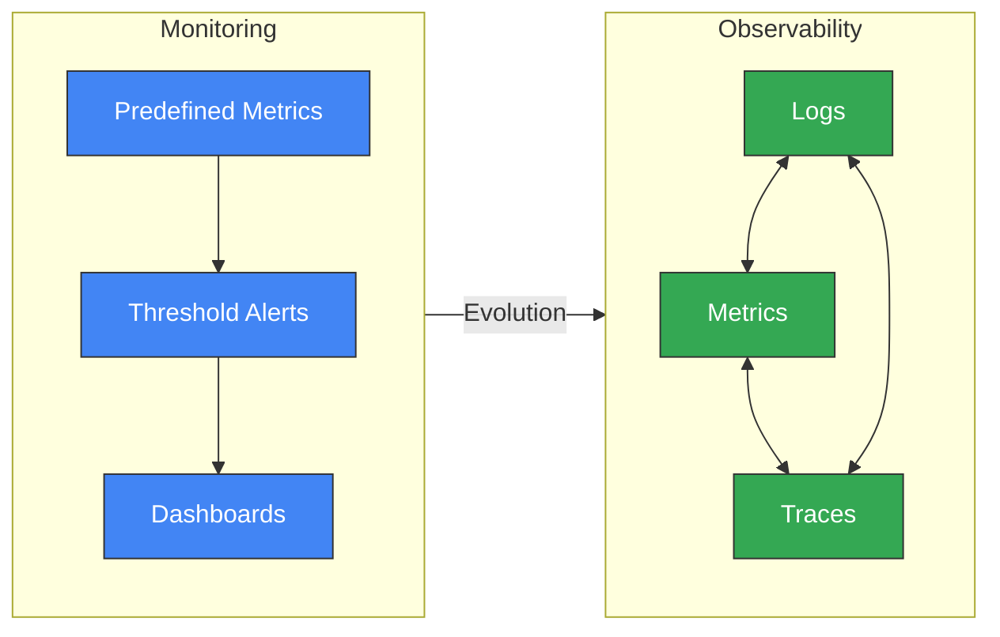
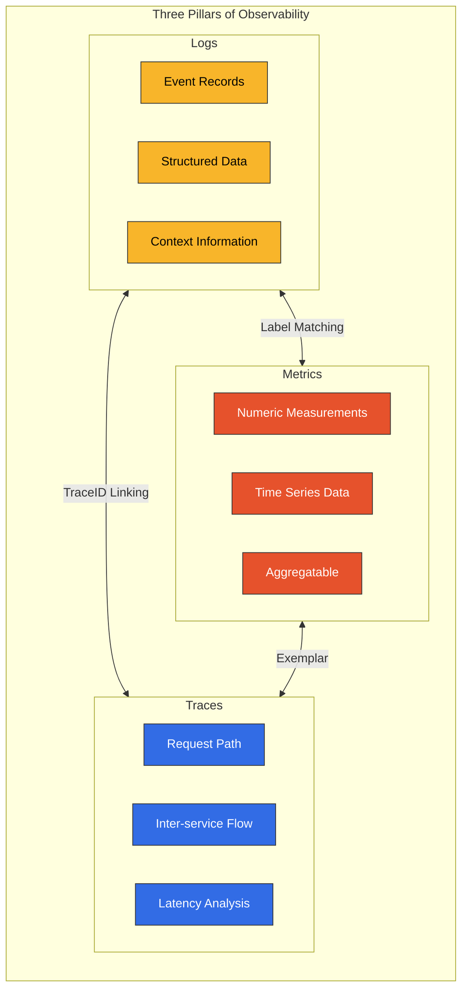
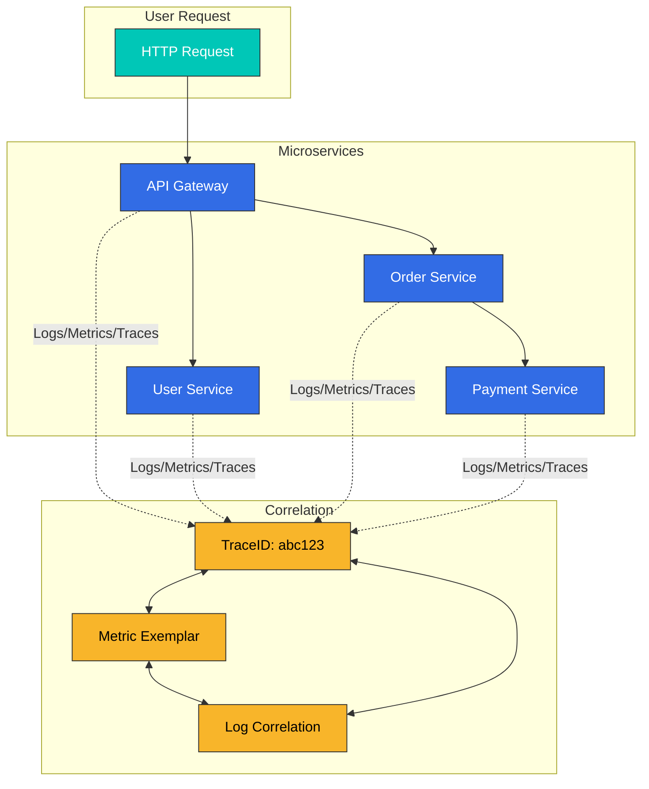
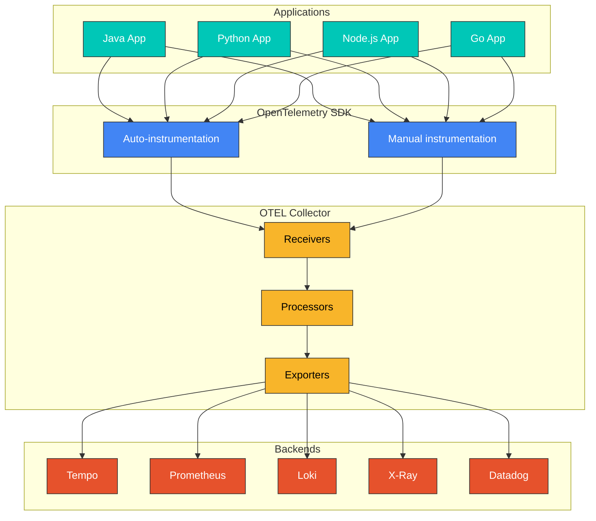
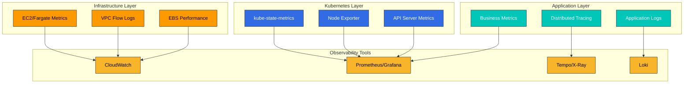
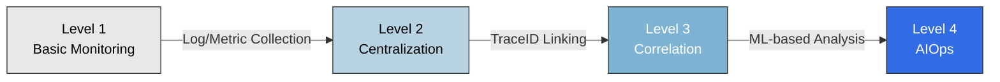

# Descripción general de Observabilidad

> **Última actualización**: February 20, 2026

## Introducción

En los sistemas distribuidos modernos, especialmente en las arquitecturas de microservicios basadas en Kubernetes, la capacidad de observar y comprender el estado interno de los sistemas a partir de salidas externas es esencial. Esto se denomina **Observabilidad**.

## Observabilidad frente a monitorización

Observabilidad y monitorización se usan con frecuencia de forma indistinta, pero existen diferencias fundamentales:

| Aspecto | Monitorización | Observabilidad |
|--------|-----------|---------------|
| **Enfoque** | Basado en métricas y umbrales predefinidos | Inferir el estado interno mediante las salidas del sistema |
| **Tipo de pregunta** | «¿Qué salió mal?» (Qué) | «¿Por qué salió mal?» (Por qué) |
| **Alcance de los datos** | Detección de problemas conocidos | Exploración de problemas desconocidos |
| **Flexibilidad** | Dashboards predefinidos | Consultas y exploración dinámicas |
| **Complejidad** | Adecuada para sistemas simples | Esencial para sistemas distribuidos complejos |



## Los tres pilares de la Observabilidad

La Observabilidad consta de tres tipos principales de datos:



### 1. Logs

Los Logs son registros de eventos individuales que ocurren en un sistema.

**Características:**
- Registros de eventos discretos e inmutables
- Incluyen marcas de tiempo e información de contexto
- Formato estructurado (JSON) o no estructurado
- Esenciales para la depuración y la auditoría

**Casos de uso:**
- Seguimiento de errores y excepciones
- Auditoría de seguridad
- Cumplimiento normativo
- Depuración detallada

**Herramientas:** Loki, Elasticsearch, CloudWatch Logs, Fluent Bit

### 2. Métricas

Las métricas son mediciones numéricas a lo largo del tiempo.

**Características:**
- Se almacenan como datos de series temporales
- Admiten agregación y operaciones matemáticas
- Alta eficiencia de almacenamiento
- Adecuadas para el análisis de tendencias

**Tipos de métricas principales:**
- **Counter**: Valores acumulativos crecientes (p. ej., número de solicitudes)
- **Gauge**: Valores del estado actual (p. ej., uso de CPU)
- **Histogram**: Mediciones de distribución (p. ej., tiempo de respuesta)
- **Summary**: Cálculos de cuantiles

**Herramientas:** Prometheus, VictoriaMetrics, CloudWatch Metrics, Datadog

### 3. Trazas

Las trazas rastrean la ruta completa de las solicitudes en sistemas distribuidos.

**Características:**
- Visualizan el flujo de solicitudes entre servicios
- Miden la latencia en cada paso
- Identifican cuellos de botella
- Análisis de dependencias

**Componentes:**
- **Trace**: El recorrido completo de una única solicitud
- **Span**: Una unidad de trabajo individual
- **SpanContext**: Contexto propagado entre servicios

**Herramientas:** Tempo, Jaeger, X-Ray, Zipkin, Datadog APM

## Correlación entre los tres pilares

Los tres pilares no son independientes, sino que están interconectados y proporcionan potentes capacidades analíticas:



### Correlación de Trace a Log

Incluya el TraceID en los Logs para rastrear todos los Logs relacionados con una solicitud específica:

```json
{
  "timestamp": "2025-02-15T10:30:00Z",
  "level": "ERROR",
  "message": "Payment processing failed",
  "traceId": "abc123def456",
  "spanId": "789xyz",
  "service": "payment-service"
}
```

### Correlación de métricas a Trace (Exemplars)

Vincule el TraceID a las métricas para rastrear solicitudes cuando se produzcan anomalías:

```yaml
# Prometheus Exemplar
http_request_duration_seconds_bucket{le="0.5"} 1000 # {traceID="abc123"}
```

## OpenTelemetry y estandarización

OpenTelemetry (OTel) es el estándar del sector para la recopilación de datos de Observabilidad:



**Beneficios de OpenTelemetry:**
- Estándar independiente de proveedores
- Compatibilidad con SDK para múltiples lenguajes
- Capacidades de instrumentación automática
- Compatibilidad con múltiples backends
- Comunidad activa

## Estrategia de Observabilidad para entornos EKS

Estrategias para implementar una Observabilidad eficaz en Amazon EKS:

### 1. Observabilidad basada en capas



### 2. Stack de herramientas recomendado

| Función | Código abierto | Nativo de AWS | Comercial |
|----------|-------------|------------|------------|
| Métricas | Prometheus, VictoriaMetrics | CloudWatch, AMP | Datadog, New Relic |
| Logs | Loki, Elasticsearch | CloudWatch Logs | Splunk, Datadog |
| Trazas | Tempo, Jaeger | X-Ray | Datadog APM, Dynatrace |
| Visualización | Grafana | CloudWatch Dashboards | Datadog, Dynatrace |

### 3. Estrategias de optimización de costos

- **Sampling**: Reduzca los costos mediante el muestreo de datos de trazas
- **Políticas de retención**: Optimice los períodos de retención de datos
- **Almacenamiento por niveles**: Mueva los datos más antiguos a almacenamiento más económico
- **Agregación**: Almacene datos agregados en lugar de datos detallados

## Modelo de madurez de Observabilidad



| Nivel | Características | Herramientas de ejemplo |
|-------|-----------------|---------------|
| Nivel 1 | Recopilación básica de Logs/métricas | kubectl logs, CloudWatch |
| Nivel 2 | Observabilidad centralizada | Loki, Prometheus, Grafana |
| Nivel 3 | Correlación de tres pilares | Tempo, Exemplars, TraceID |
| Nivel 4 | AIOps, detección automática de anomalías | Datadog Watchdog, Dynatrace Davis |

## Guía de secciones

Esta sección de Observabilidad está organizada de la siguiente manera:

### [Logging](./logging/README.md)
Herramientas y estrategias para la recopilación, el almacenamiento y el análisis de Logs:
- Loki: Sistema ligero de agregación de Logs
- Fluent Bit: Recopilador de Logs de alto rendimiento
- CloudWatch Logs: Logging nativo de AWS

### [Metrics](./metrics/README.md)
Recopilación y análisis de métricas de series temporales:
- Prometheus: Sistema de métricas estándar del sector
- VictoriaMetrics: Alternativa a Prometheus de alto rendimiento
- CloudWatch Metrics: Métricas nativas de AWS

### [Tracing](./tracing/README.md)
Tracing distribuido y análisis del flujo de solicitudes:
- Tempo: Backend de tracing distribuido de Grafana
- X-Ray: Tracing distribuido nativo de AWS
- OpenTelemetry: Instrumentación estandarizada
- Dynatrace: APM con tecnología de IA

### [Grafana (Dashboards)](./grafana/README.md)
Visualización y dashboards unificados:
- Integración de fuentes de datos
- Patrones de diseño de dashboards
- Configuración de alertas

## Primeros pasos

Para comenzar a implementar la Observabilidad, se recomienda el siguiente orden:

1. **Configure la recopilación de métricas**: Despliegue Prometheus o VictoriaMetrics
2. **Configure la recopilación de Logs**: Despliegue Loki y Fluent Bit
3. **Configure el tracing**: Despliegue Tempo o X-Ray
4. **Visualización**: Conecte todas las fuentes de datos en Grafana
5. **Correlación**: Configure la vinculación basada en TraceID

## Referencias

- [Documentación oficial de OpenTelemetry](https://opentelemetry.io/docs/)
- [Stack LGTM de Grafana](https://grafana.com/oss/lgtm-stack/)
- [Prácticas recomendadas de Observabilidad de AWS](https://aws-observability.github.io/observability-best-practices/)
- [SRE Workbook - Monitorización](https://sre.google/workbook/monitoring/)
