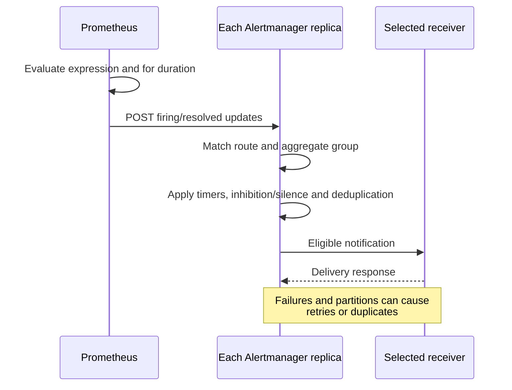
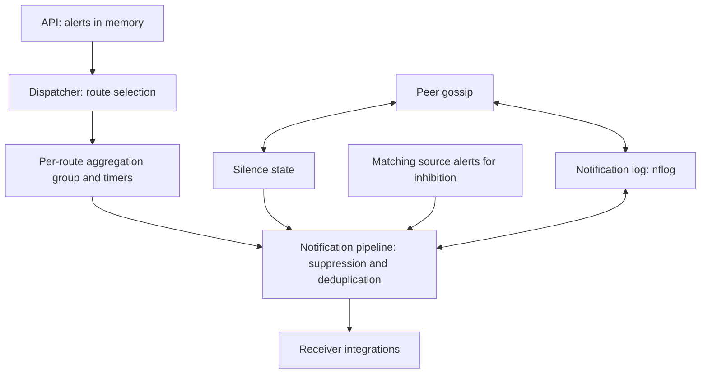
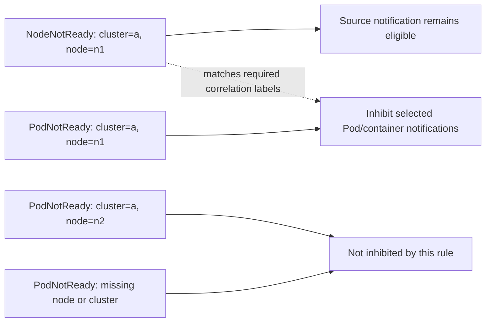
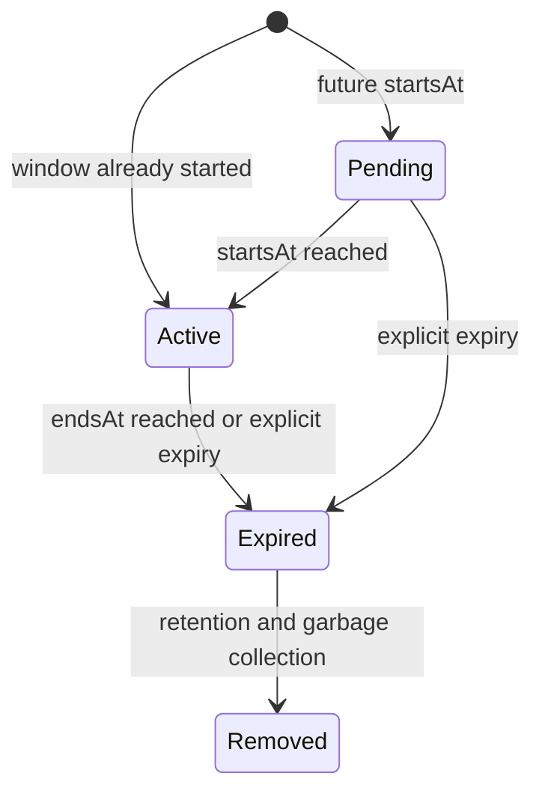

# Prometheus Alertmanager

> **Base de revisión**: Alertmanager 0.34.0; kube-prometheus-stack 90.0.0 / Operator 0.93.1; chart independiente 1.43.1
> **Last Updated**: September 13, 2026

## Tabla de contenidos

- [Descripción general de Alertmanager](#alertmanager-overview)
- [Arquitectura](#architecture)
- [Instalación y configuración](#installation-and-configuration)
- [Definición de reglas de alerta](#defining-alert-rules)
- [Configuración de enrutamiento](#routing-configuration)
- [Configuración de receptores](#receiver-configuration)
- [Reglas de inhibición](#inhibition-rules)
- [Silenciamiento](#silencing)
- [Personalización de plantillas](#template-customization)
- [Configuración de alta disponibilidad](#high-availability-configuration)
- [CRD AlertmanagerConfig](#alertmanagerconfig-crd)
- [Ejemplos de reglas de alerta para producción](#production-alert-rule-examples)
- [Solución de problemas](#troubleshooting)

---

<span id="alertmanager-overview"></span>

## Descripción general de Alertmanager

Prometheus Alertmanager es un componente que procesa las alertas enviadas por los servidores de Prometheus. Ofrece eliminación de duplicados, agrupación, enrutamiento, inhibición y silenciamiento de alertas.

### Características principales

1. La **agrupación** combina las alertas de una ruta/grupo en notificaciones.
2. La **inhibición y los silenciamientos** suprimen las notificaciones sin modificar la condición de la regla subyacente de Prometheus.
3. El **enrutamiento** selecciona receptores; un receptor puede contener varias integraciones.
4. La **HA** comparte los silenciamientos y el estado del registro de notificaciones con consistencia eventual. Durante una partición, prefiere entregar duplicados a suprimir notificaciones; no ofrece entrega exactamente una vez.

### Flujo de alertas de Prometheus

Prometheus evalúa las reglas; Alertmanager procesa las notificaciones. Esta secuencia resume las responsabilidades, pero no garantiza la latencia de entrega.



<span id="architecture"></span>

## Arquitectura

### Estructura interna de Alertmanager

El dispatcher crea los grupos **después de seleccionar la ruta**. La inhibición, las comprobaciones de silenciamiento/tiempo y la eliminación de duplicados mediante el registro de notificaciones se ejecutan en el pipeline de notificación; no forman una cadena fija anterior a la agrupación. Gossip no sustituye el envío de alertas de Prometheus a todas las réplicas. Las alertas no se persisten como los silenciamientos y nflog.



### Descripción de componentes

| Componente | Función |
|-----------|------|
| **Dispatcher** | Enruta las alertas a los receptores adecuados según el árbol de enrutamiento |
| **Inhibitor** | Suprime alertas relacionadas según las reglas de inhibición |
| **Silencer** | Filtra las alertas que coinciden con las reglas de silenciamiento |
| **Aggregation Group** | Agrupa las alertas del mismo grupo para procesarlas |
| **Notification Pipeline** | Gestiona el envío efectivo de alertas |
| **nflog** | Registra las alertas enviadas para eliminar duplicados |

---

<span id="installation-and-configuration"></span>

## Instalación y configuración

Estos son ejemplos alternativos para una base de Kubernetes 1.35 con nodos de trabajo Linux. Los dos charts de Helm y el StatefulSet manual tienen **responsables de instalación diferentes**; elige uno. Los charts se renderizaron y las configuraciones, plantillas y reglas sintéticas se ejecutaron localmente, pero no se realizó ninguna instalación de Kubernetes, aplicación real de políticas de CNI, entrega a SaaS ni prueba de capacidad de producción. Las instalaciones existentes necesitan un plan de actualización y combinación de values revisado por su responsable, no una sustitución ciega por este tutorial.

Prepara el namespace `monitoring`, tres nodos programables para la antiafinidad obligatoria, una StorageClass RWO predeterminada adecuada, las credenciales de notificación y las rutas de red aprobadas. EKS Fargate/Auto Mode y las métricas del plano de control administrado tienen restricciones de recopilación/almacenamiento diferentes. En particular, el etcd administrado por EKS no es un endpoint disponible para que el cliente recopile métricas. Este perfil deshabilita Grafana y el ServiceMonitor de etcd para acotar el ejemplo; no indica que debas deshabilitar esos componentes en una pila existente.

### Instalación mediante Helm (kube-prometheus-stack)

Usa el perfil de pila con versión fijada de abajo para una **nueva release**. La versión 90.0.0 contiene Operator 0.93.1 y Alertmanager 0.34.0. Es una base comprobada, no una afirmación de que no exista un chart más reciente. Inspecciona el RBAC del clúster, los CRD, los PVC, los namespaces y los ajustes del responsable antes de instalar.

```bash
helm repo add prometheus-community https://prometheus-community.github.io/helm-charts
helm repo update
helm template prometheus prometheus-community/kube-prometheus-stack   --version 90.0.0 --namespace monitoring --kube-version 1.35.0   -f kube-prometheus-stack-values.yaml > stack-rendered.yaml
# After reviewing the prerequisites and rendered resources:
helm install prometheus prometheus-community/kube-prometheus-stack   --version 90.0.0 --namespace monitoring --create-namespace   -f kube-prometheus-stack-values.yaml --wait --timeout 10m
```

### Chart de Helm dedicado de Alertmanager

Esta es la **alternativa independiente**, no un paso adicional de instalación de la pila. Usa `replicaCount`, `resources`, `persistence` y `config` en el nivel superior; la pila usa `alertmanager.alertmanagerSpec` para réplicas, recursos y almacenamiento. Los values mezclados anteriormente no configuraban ninguno de los charts como se describía.

```bash
helm template alertmanager prometheus-community/alertmanager   --version 1.43.1 --namespace monitoring --kube-version 1.35.0   -f alertmanager-values.yaml > alertmanager-rendered.yaml
helm install alertmanager prometheus-community/alertmanager   --version 1.43.1 --namespace monitoring --create-namespace   -f alertmanager-values.yaml --wait --timeout 10m
```

### Ejemplo de values.yaml

La configuración principal es `alertmanager.yaml`, que aparece abajo. Las credenciales de sus receptores son referencias a archivos, no valores de tokens. Crea `notification-credentials` y `alertmanager-templates` antes de que se inicie la carga de trabajo seleccionada. Un renderizado correcto de Helm no resuelve un archivo ausente, un canal incorrecto ni una credencial de proveedor no válida.

Crea **dos URL distintas de incoming webhooks de Slack**, cada una configurada previamente en Slack para su canal: `slack-normal-webhook-url` para `#alerts` y `slack-critical-webhook-url` para `#critical-alerts`. Un incoming webhook no puede reemplazar su canal configurado mediante un campo `channel`. Los dos archivos corresponden a claves de `notification-credentials`, montadas por los perfiles de pila, independiente y manual. La asociación entre URL y canal es un requisito previo del proveedor; el análisis local no comprueba la entrega a Slack.

**Perfil de pila — `kube-prometheus-stack-values.yaml`:**

```yaml
grafana:
  enabled: false
alertmanager:
  enabled: true
  config:
    global:
      resolve_timeout: 5m
    route:
      receiver: default-receiver
      group_by:
      - cluster
      - alertname
      - namespace
      group_wait: 30s
      group_interval: 5m
      repeat_interval: 4h
      routes:
      - matchers:
        - severity="critical"
        receiver: critical-receiver
    receivers:
    - name: default-receiver
      slack_configs:
      - api_url_file: /etc/alertmanager/secrets/notification-credentials/slack-normal-webhook-url
        send_resolved: true
        title: '{{ template "slack.custom.title" . }}'
        text: '{{ template "slack.custom.text" . }}'
        color: '{{ template "slack.custom.color" . }}'
    - name: critical-receiver
      slack_configs:
      - api_url_file: /etc/alertmanager/secrets/notification-credentials/slack-critical-webhook-url
        send_resolved: true
        title: '{{ template "slack.custom.title" . }}'
        text: '{{ template "slack.custom.text" . }}'
        color: '{{ template "slack.custom.color" . }}'
      pagerduty_configs:
      - routing_key_file: /etc/alertmanager/secrets/notification-credentials/pagerduty-routing-key
        send_resolved: true
        severity: '{{ if eq .CommonLabels.severity "critical" }}critical{{ else if
          eq .CommonLabels.severity "warning" }}warning{{ else }}info{{ end }}'
        description: '{{ .CommonLabels.alertname }}'
        client: Alertmanager
        client_url: https://alertmanager.example.com
        details:
          cluster: '{{ .CommonLabels.cluster }}'
          namespace: '{{ .CommonLabels.namespace }}'
    inhibit_rules:
    - source_matchers:
      - severity="critical"
      - cluster=~".+"
      - namespace=~".+"
      - alertname=~".+"
      target_matchers:
      - severity="warning"
      - cluster=~".+"
      - namespace=~".+"
      - alertname=~".+"
      equal:
      - cluster
      - namespace
      - alertname
    templates:
    - /etc/alertmanager/configmaps/alertmanager-templates/*.tmpl
  podDisruptionBudget:
    enabled: true
    minAvailable: 2
  alertmanagerSpec:
    replicas: 3
    retention: 120h
    resources:
      requests:
        cpu: 100m
        memory: 256Mi
      limits:
        cpu: 500m
        memory: 512Mi
    podAntiAffinity: hard
    secrets:
    - notification-credentials
    configMaps:
    - alertmanager-templates
    storage:
      volumeClaimTemplate:
        spec:
          accessModes:
          - ReadWriteOnce
          resources:
            requests:
              storage: 10Gi
    automountServiceAccountToken: false
  serviceAccount:
    automountServiceAccountToken: false
prometheus:
  prometheusSpec:
    externalLabels:
      cluster: example-cluster
    ruleSelectorNilUsesHelmValues: false
    ruleSelector:
      matchLabels:
        release: prometheus
    ruleNamespaceSelector:
      matchLabels:
        kubernetes.io/metadata.name: monitoring
kubeEtcd:
  enabled: false
```

**Perfil independiente — `alertmanager-values.yaml`:**

```yaml
replicaCount: 3
automountServiceAccountToken: false
resources:
  requests:
    cpu: 100m
    memory: 256Mi
  limits:
    cpu: 500m
    memory: 512Mi
podAntiAffinity: hard
podDisruptionBudget:
  minAvailable: 2
persistence:
  enabled: true
  size: 10Gi
config:
  global:
    resolve_timeout: 5m
  route:
    receiver: default-receiver
    group_by:
    - cluster
    - alertname
    - namespace
    group_wait: 30s
    group_interval: 5m
    repeat_interval: 4h
    routes:
    - matchers:
      - severity="critical"
      receiver: critical-receiver
  receivers:
  - name: default-receiver
    slack_configs:
    - api_url_file: /etc/alertmanager/secrets/notification-credentials/slack-normal-webhook-url
      send_resolved: true
      title: '{{ template "slack.custom.title" . }}'
      text: '{{ template "slack.custom.text" . }}'
      color: '{{ template "slack.custom.color" . }}'
  - name: critical-receiver
    slack_configs:
    - api_url_file: /etc/alertmanager/secrets/notification-credentials/slack-critical-webhook-url
      send_resolved: true
      title: '{{ template "slack.custom.title" . }}'
      text: '{{ template "slack.custom.text" . }}'
      color: '{{ template "slack.custom.color" . }}'
    pagerduty_configs:
    - routing_key_file: /etc/alertmanager/secrets/notification-credentials/pagerduty-routing-key
      send_resolved: true
      severity: '{{ if eq .CommonLabels.severity "critical" }}critical{{ else if eq
        .CommonLabels.severity "warning" }}warning{{ else }}info{{ end }}'
      description: '{{ .CommonLabels.alertname }}'
      client: Alertmanager
      client_url: https://alertmanager.example.com
      details:
        cluster: '{{ .CommonLabels.cluster }}'
        namespace: '{{ .CommonLabels.namespace }}'
  inhibit_rules:
  - source_matchers:
    - severity="critical"
    - cluster=~".+"
    - namespace=~".+"
    - alertname=~".+"
    target_matchers:
    - severity="warning"
    - cluster=~".+"
    - namespace=~".+"
    - alertname=~".+"
    equal:
    - cluster
    - namespace
    - alertname
  templates:
  - /etc/alertmanager/configmaps/alertmanager-templates/*.tmpl
  enabled: true
extraSecretMounts:
- name: notification-credentials
  secretName: notification-credentials
  mountPath: /etc/alertmanager/secrets/notification-credentials
  readOnly: true
extraVolumes:
- name: alertmanager-templates
  configMap:
    name: alertmanager-templates
extraVolumeMounts:
- name: alertmanager-templates
  mountPath: /etc/alertmanager/configmaps/alertmanager-templates
  readOnly: true
hostUsers: true
```

`hostUsers: true` mantiene la base independiente en el namespace de usuario tradicional; habilitar namespaces de usuario de Pod requiere comprobaciones adicionales del entorno de ejecución y la plataforma. Los requests/limits de recursos y los PVC de 10Gi son ejemplos de dimensionamiento, no afirmaciones de capacidad probada. La antiafinidad obligatoria necesita tres nodos elegibles. Los PDB limitan las interrupciones voluntarias, no todos los fallos.

### Configuración directa mediante ConfigMap

La configuración principal completa de abajo también está incorporada en los perfiles de chart. Para el despliegue manual, guárdala como `alertmanager.yaml` y coloca su contenido en la clave `alertmanager.yml` del ConfigMap. El ConfigMap contiene rutas y metadatos de enrutamiento, **no credenciales**. No mezcles esta gestión manual con el Secret generado por Operator.

```yaml
global:
  resolve_timeout: 5m
route:
  receiver: default-receiver
  group_by:
  - cluster
  - alertname
  - namespace
  group_wait: 30s
  group_interval: 5m
  repeat_interval: 4h
  routes:
  - matchers:
    - severity="critical"
    receiver: critical-receiver
receivers:
- name: default-receiver
  slack_configs:
  - api_url_file: /etc/alertmanager/secrets/notification-credentials/slack-normal-webhook-url
    send_resolved: true
    title: '{{ template "slack.custom.title" . }}'
    text: '{{ template "slack.custom.text" . }}'
    color: '{{ template "slack.custom.color" . }}'
- name: critical-receiver
  slack_configs:
  - api_url_file: /etc/alertmanager/secrets/notification-credentials/slack-critical-webhook-url
    send_resolved: true
    title: '{{ template "slack.custom.title" . }}'
    text: '{{ template "slack.custom.text" . }}'
    color: '{{ template "slack.custom.color" . }}'
  pagerduty_configs:
  - routing_key_file: /etc/alertmanager/secrets/notification-credentials/pagerduty-routing-key
    send_resolved: true
    severity: '{{ if eq .CommonLabels.severity "critical" }}critical{{ else if eq
      .CommonLabels.severity "warning" }}warning{{ else }}info{{ end }}'
    description: '{{ .CommonLabels.alertname }}'
    client: Alertmanager
    client_url: https://alertmanager.example.com
    details:
      cluster: '{{ .CommonLabels.cluster }}'
      namespace: '{{ .CommonLabels.namespace }}'
inhibit_rules:
- source_matchers:
  - severity="critical"
  - cluster=~".+"
  - namespace=~".+"
  - alertname=~".+"
  target_matchers:
  - severity="warning"
  - cluster=~".+"
  - namespace=~".+"
  - alertname=~".+"
  equal:
  - cluster
  - namespace
  - alertname
templates:
- /etc/alertmanager/configmaps/alertmanager-templates/*.tmpl
```

```bash
# The directory/files must already contain approved credentials; do not commit them.
credential_dir="$PWD/private-notification-credentials"
chmod 700 "$credential_dir"
chmod 600 "$credential_dir"/*
kubectl -n monitoring create secret generic notification-credentials \
  --from-file=slack-normal-webhook-url="$credential_dir/slack-normal-webhook-url" \
  --from-file=slack-critical-webhook-url="$credential_dir/slack-critical-webhook-url" \
  --from-file=pagerduty-routing-key="$credential_dir/pagerduty-routing-key"
# Optional integrations need their own additional files; rotate existing Secrets separately.
```

```bash
kubectl -n monitoring create configmap alertmanager-config   --from-file=alertmanager.yml=alertmanager.yaml
```

Protege los permisos de lectura/exec de Secret y el propio contenido de las notificaciones. Añade solo los archivos de credenciales que necesitan las integraciones habilitadas. La proyección de un ConfigMap no recarga automáticamente Alertmanager: usa el mecanismo de recarga/despliegue gradual revisado para el responsable de instalación elegido; una recarga no válida debe dejar funcionando la última configuración correcta.

<span id="defining-alert-rules"></span>

## Definición de reglas de alerta

### CRD PrometheusRule

Un PrometheusRule debe coincidir con los **selectores de labels de reglas y de namespaces** de la instancia de Prometheus. Estos ejemplos usan `release: prometheus` en `monitoring`, conforme a los values explícitos de la pila. Instalar un CR no demuestra que se haya seleccionado o cargado correctamente. Compara las reglas activas y las labels de recopilación después del despliegue. Evita alertas duplicadas con las reglas existentes de la pila.

```yaml
apiVersion: monitoring.coreos.com/v1
kind: PrometheusRule
metadata:
  name: kubernetes-alerts
  namespace: monitoring
  labels:
    release: prometheus
spec:
  groups:
  - name: kubernetes.rules
    interval: 30s
    rules:
    - alert: NodeNotReady
      expr: max by (node) (kube_node_status_condition{condition="Ready",status="true"})
        == 0
      for: 5m
      labels:
        severity: critical
        team: sre
      annotations:
        summary: Node {{ $labels.node }} is not ready
        description: Node {{ $labels.node }} has been not ready for more than 5 minutes.
        runbook_url: https://runbooks.example.com/node-not-ready
```

### Componentes de las reglas de alerta

`alert` y `expr` identifican la regla y su expresión. Un vector de resultados no vacío identifica instancias de alerta activas, incluso si el valor de la muestra es cero. `for` se comprueba a lo largo de las evaluaciones de la regla; no es el intervalo de recopilación ni el plazo de notificación. Las `labels` afectan a la identidad y al enrutamiento de la alerta; coloca los valores cambiantes en `annotations`, no en las labels. El parámetro opcional `keep_firing_for` mantiene el estado Firing durante un período después de que desaparezca la condición. Comprueba su compatibilidad con las versiones desplegadas de Prometheus/Operator.

### Estados de alerta

Ilustración del estado de Prometheus con una duración for positiva y sin configurar keep_firing_for; las reglas con for igual a cero pueden activarse inmediatamente en la evaluación que cumpla la condición.


[Diagrama interactivo](https://www.atomai.click/kubernetes-docs/archmaps/en-observability-alerting-01-alertmanager-2.html)

<span id="routing-configuration"></span>

## Configuración de enrutamiento

### Estructura del árbol de enrutamiento

La siguiente **configuración de prueba de enrutamiento** declara todos los nombres de receptores, pero deja vacías sus integraciones. No entregará notificaciones hasta que se añada una integración aprobada. La primera ruta hermana coincidente normalmente detiene el recorrido de las demás; las rutas hijas pueden seleccionar un receptor más específico.

```yaml
route:
  receiver: default-receiver
  group_by:
  - cluster
  - alertname
  - namespace
  group_wait: 30s
  group_interval: 5m
  repeat_interval: 4h
  routes:
  - matchers:
    - severity="critical"
    receiver: critical-receiver
    group_wait: 10s
  - matchers:
    - service=~"foo|bar"
    receiver: service-team
    routes:
    - matchers:
      - owner="team-a"
      receiver: team-a
receivers:
- name: default-receiver
- name: critical-receiver
- name: service-team
- name: team-a
```

### Flujo de enrutamiento

Enrutamiento basado solo en labels con continue=false. El diagrama usa la notación antigua match/match_re; la configuración equivalente comprobada usa matchers. La elegibilidad de la ventana temporal se evalúa por separado.


[Diagrama interactivo](https://www.atomai.click/kubernetes-docs/archmaps/en-observability-alerting-01-alertmanager-3.html)

### Matchers

Usa cadenas de matcher entre comillas con `=`, `!=`, `=~` o `!~`. Los matchers de una ruta se combinan mediante AND; las expresiones regulares están ancladas por completo. Las labels vacías o ausentes importan. Los campos antiguos `match`/`match_re` siguen aceptándose en esta versión, pero están obsoletos. Los temporizadores de grupo se heredan de las rutas padre; los intervalos de tiempo active/mute no.

```yaml
# Alternative child-route fragments; attach to a complete configuration.
routes:
  - matchers: ['severity="critical"', 'namespace="production"']
    receiver: prod-critical
  - matchers: ['service=~"(api|web|worker).*"', 'environment=~"prod.*"']
    receiver: prod-team
```

### Ejemplo de enrutamiento avanzado

Divide los intervalos nocturnos en la medianoche y especifica la zona horaria en **cada** entrada de intervalo. El intervalo anterior `18:00→09:00` no supera la validación nativa. Este ejemplo plano coloca las restricciones temporales en las rutas de los receptores reales. La ruta crítica fuera del horario laboral usa `continue: true`: una ruta inactiva sigue coincidiendo con las labels y, de lo contrario, detiene las rutas hermanas posteriores, por lo que no debe impedir que se alcance la ruta del horario laboral. Las integraciones vacías de los receptores son sustitutos de prueba intencionales.

```yaml
route:
  receiver: 'null'
  group_by:
  - cluster
  - alertname
  - namespace
  group_wait: 30s
  group_interval: 5m
  repeat_interval: 4h
  routes:
  - matchers:
    - severity="critical"
    receiver: oncall
    active_time_intervals:
    - offhours
    continue: true
  - matchers:
    - team="infra"
    receiver: infra-team
    active_time_intervals:
    - business-hours
  - matchers:
    - team="dev"
    receiver: dev-team
    active_time_intervals:
    - business-hours
  - receiver: team-slack
    active_time_intervals:
    - business-hours
receivers:
- name: 'null'
- name: oncall
- name: infra-team
- name: dev-team
- name: team-slack
time_intervals:
- name: business-hours
  time_intervals:
  - weekdays:
    - monday:friday
    times:
    - start_time: 09:00
      end_time: '18:00'
    location: Asia/Seoul
- name: offhours
  time_intervals:
  - weekdays:
    - monday:friday
    times:
    - start_time: 00:00
      end_time: 09:00
    - start_time: '18:00'
      end_time: '24:00'
    location: Asia/Seoul
  - weekdays:
    - saturday
    - sunday
    location: Asia/Seoul
```

Las pruebas nativas de rutas por labels no evalúan el calendario. Este se comprobó por separado con la implementación publicada de intervalos de tiempo, en los límites de apertura/cierre, fines de semana y desplazamientos UTC/KST. Una notificación silenciada o inactiva no se redirige automáticamente al receptor de reserva del padre.

<span id="receiver-configuration"></span>

## Configuración de receptores

### Receptor de Slack

Usa `api_url_file` para un archivo protegido con una URL de incoming webhook ya asociada al canal de Slack previsto. El ejemplo normal de abajo usa `slack-normal-webhook-url`; las rutas críticas usan el archivo crítico distinto. [Slack documenta que los incoming webhooks no permiten reemplazar el canal](https://docs.slack.dev/messaging/sending-messages-using-incoming-webhooks/). La plantilla personalizada comprobada imprime un subconjunto aprobado de campos; no vuelques todas las labels/annotations. Pueden contener datos de usuarios o secretos, y truncar no equivale a eliminar u ocultar información sensible. Estos son fragmentos de receptor para una configuración completa.

```yaml
receivers:
- name: slack-notifications
  slack_configs:
  - api_url_file: /etc/alertmanager/secrets/notification-credentials/slack-normal-webhook-url
    send_resolved: true
    title: '{{ template "slack.custom.title" . }}'
    text: '{{ template "slack.custom.text" . }}'
    color: '{{ template "slack.custom.color" . }}'
```

### Receptor de PagerDuty

Usa `routing_key_file` de Events API v2; la integración antigua de Prometheus usa otro modo de clave de servicio, no la misma credencial. Nunca configures ambos. Asigna las severidades a valores admitidos por PagerDuty; las cadenas arbitrarias de severidad de Alertmanager no son automáticamente válidas. Estos son fragmentos de receptor para una configuración completa.

```yaml
receivers:
- name: pagerduty-critical
  pagerduty_configs:
  - routing_key_file: /etc/alertmanager/secrets/notification-credentials/pagerduty-routing-key
    send_resolved: true
    severity: '{{ if eq .CommonLabels.severity "critical" }}critical{{ else if eq
      .CommonLabels.severity "warning" }}warning{{ else }}info{{ end }}'
    description: '{{ .CommonLabels.alertname }}'
    client: Alertmanager
    client_url: https://alertmanager.example.com
    details:
      cluster: '{{ .CommonLabels.cluster }}'
      namespace: '{{ .CommonLabels.namespace }}'
```

### Receptor de correo electrónico

Usa `auth_password_file` y exige TLS con una configuración válida de confianza SMTP. Las direcciones son marcadores de posición; revisa la política de retransmisión, la identidad del remitente y la monitorización de entregas/rebotes. Estos son fragmentos de receptor para una configuración completa.

```yaml
receivers:
- name: email-alerts
  email_configs:
  - to: team@example.com
    from: alertmanager@example.com
    smarthost: smtp.example.com:587
    auth_username: alertmanager@example.com
    auth_password_file: /etc/alertmanager/secrets/notification-credentials/smtp-password
    require_tls: true
    send_resolved: true
    headers:
      Subject: '[{{ .Status | toUpper }}] {{ .CommonLabels.alertname }}'
    html: '{{ template "email.default.html" . }}'
```

### Receptor de OpsGenie

Esta es una **referencia de migración para clientes existentes**. Según [Atlassian](https://www.atlassian.com/licensing/opsgenie), las ventas de Opsgenie finalizaron el June 4, 2025, y el soporte/acceso termina el April 5, 2027. No diseñes una nueva dependencia duradera en torno a este servicio. Usa la forma actual de `responders` y un archivo de clave protegido. Estos son fragmentos de receptor para una configuración completa.

```yaml
receivers:
- name: opsgenie-existing
  opsgenie_configs:
  - api_key_file: /etc/alertmanager/secrets/notification-credentials/opsgenie-api-key
    api_url: https://api.opsgenie.com/
    send_resolved: true
    message: '{{ .CommonLabels.alertname }}'
    priority: '{{ if eq .CommonLabels.severity "critical" }}P1{{ else if eq .CommonLabels.severity
      "warning" }}P3{{ else }}P5{{ end }}'
    responders:
    - name: sre-team
      type: team
```

### Receptor de Webhook

La autenticación básica necesita HTTPS; `insecure_skip_verify: false` no cifra una URL `http://`. Proporciona un receptor bajo tu control, un certificado y una configuración de confianza TLS coincidentes y archivos de credenciales montados. Con `max_alerts: 10`, el payload puede omitir alertas e indica `truncatedAlerts`; los consumidores deben manejarlo. Un receptor debe implementar el contrato de webhook de Alertmanager, no limitarse a devolver una respuesta genérica de salud. Estos son fragmentos de receptor para una configuración completa.

```yaml
receivers:
- name: webhook-receiver
  webhook_configs:
  - url: https://alert-webhook.monitoring.svc:8443/alerts
    send_resolved: true
    max_alerts: 10
    http_config:
      basic_auth:
        username: alertmanager
        password_file: /etc/alertmanager/secrets/notification-credentials/webhook-password
      tls_config:
        ca_file: /etc/alertmanager/secrets/notification-credentials/webhook-ca.crt
        insecure_skip_verify: false
```

### Configuración de múltiples receptores

Un receptor puede notificar a varias integraciones sin `continue`. Los fallos y reintentos de cada proveedor son independientes; el éxito de uno no demuestra el éxito de todos. Este ejemplo necesita los archivos de todos los proveedores enumerados y la configuración SMTP/TLS. Estos son fragmentos de receptor para una configuración completa.

```yaml
receivers:
- name: team-all
  slack_configs:
  - api_url_file: /etc/alertmanager/secrets/notification-credentials/slack-normal-webhook-url
    send_resolved: true
    title: '{{ template "slack.custom.title" . }}'
    text: '{{ template "slack.custom.text" . }}'
    color: '{{ template "slack.custom.color" . }}'
  email_configs:
  - to: team@example.com
    from: alertmanager@example.com
    smarthost: smtp.example.com:587
    auth_username: alertmanager@example.com
    auth_password_file: /etc/alertmanager/secrets/notification-credentials/smtp-password
    require_tls: true
    send_resolved: true
    headers:
      Subject: '[{{ .Status | toUpper }}] {{ .CommonLabels.alertname }}'
    html: '{{ template "email.default.html" . }}'
  pagerduty_configs:
  - routing_key_file: /etc/alertmanager/secrets/notification-credentials/pagerduty-routing-key
    send_resolved: true
    severity: '{{ if eq .CommonLabels.severity "critical" }}critical{{ else if eq
      .CommonLabels.severity "warning" }}warning{{ else }}info{{ end }}'
    description: '{{ .CommonLabels.alertname }}'
    client: Alertmanager
    client_url: https://alertmanager.example.com
    details:
      cluster: '{{ .CommonLabels.cluster }}'
      namespace: '{{ .CommonLabels.namespace }}'
```

<span id="inhibition-rules"></span>

## Reglas de inhibición

### Concepto de inhibición

La inhibición suprime **notificaciones** coincidentes, no la evaluación de reglas ni la alerta almacenada. Limita la relación mediante labels no vacías. Una condición de nodo no justifica suprimir todas las alertas de servicio del clúster.



### Configuración de reglas de inhibición

La primera regla usa `NodeNotReady` con la label `node` de kube-state-metrics. Las reglas de Pod de abajo añaden información del nodo mediante `kube_pod_info` y conservan la alerta sin enriquecimiento si falta esa métrica. Una label ausente se compara como un valor vacío: exige `cluster`/`node` no vacíos antes de comprobar su igualdad. Las pruebas locales reprodujeron la supresión anterior de alertas no relacionadas y verificaron las condiciones de protección.

`ClusterDown` requiere una alerta de origen entregada de forma independiente cuando el clúster monitorizado no puede enviarla. Las reglas de base de datos requieren un `database_id` estable y compartido, no labels `instance` de recopilación sin relación. Define esas entradas antes de habilitar sus reglas.

```yaml
route:
  receiver: 'null'
receivers:
- name: 'null'
inhibit_rules:
- source_matchers:
  - alertname="NodeNotReady"
  - cluster=~".+"
  - node=~".+"
  target_matchers:
  - alertname=~"PodNotReady|PodCrashLooping|ContainerOOMKilled"
  - cluster=~".+"
  - node=~".+"
  equal:
  - cluster
  - node
- source_matchers:
  - severity="critical"
  - cluster=~".+"
  - namespace=~".+"
  - alertname=~".+"
  target_matchers:
  - severity="warning"
  - cluster=~".+"
  - namespace=~".+"
  - alertname=~".+"
  equal:
  - cluster
  - namespace
  - alertname
- source_matchers:
  - alertname="ClusterDown"
  - cluster=~".+"
  target_matchers:
  - alertname=~"Node.*"
  - cluster=~".+"
  equal:
  - cluster
- source_matchers:
  - alertname="DatabaseDown"
  - cluster=~".+"
  - database_id=~".+"
  target_matchers:
  - alertname=~"DatabaseConnection.*|DatabaseTimeout.*"
  - cluster=~".+"
  - database_id=~".+"
  equal:
  - cluster
  - database_id
```

### Prioridad de inhibición

El orden de la lista **no es un sistema de prioridades**. Cualquier regla de inhibición aplicable puede suprimir un destino. Modela las dependencias infraestructura→nodo→servicio con matchers de origen/destino disjuntos y labels de correlación no vacías; después prueba nodos/clústeres no relacionados y labels ausentes. Un `alertname=~".*"` amplio junto con un `datacenter` ausente puede silenciar incidentes no relacionados. No deduzcas relaciones causales solo a partir de la severidad.

<span id="silencing"></span>

## Silenciamiento

### Creación de silenciamientos

Crear o expirar un silenciamiento cambia el comportamiento de notificación. Revisa el endpoint, los matchers exactos, el autor, el motivo y la ventana finita. `--end` requiere elegir deliberadamente una fecha futura en RFC3339; la ventana fija anterior de 2025 no puede silenciar alertas actuales. Protege el acceso HTTP con la configuración admitida de TLS/autenticación; `amtool --http.config.file` acepta un archivo protegido de configuración del cliente.

#### Uso de la CLI amtool

```bash
# Use an approved authenticated endpoint, or an authorized local port-forward.
: "${ALERTMANAGER_URL:?Set the reviewed Alertmanager URL}"
amtool --alertmanager.url="$ALERTMANAGER_URL" silence add   'alertname="PodCrashLooping"' 'namespace="development"'   --duration=2h --comment="Approved deployment window" --author="operator"
amtool --alertmanager.url="$ALERTMANAGER_URL" silence query
# Copy the specific UUID from the approved operation, never a blanket selection.
: "${SILENCE_ID:?Set the exact silence UUID}"
amtool --alertmanager.url="$ALERTMANAGER_URL" silence expire "$SILENCE_ID"
```

#### Creación de silenciamiento mediante API

Guarda la salida de este asistente como `silence.json`, revísala y envíala mediante POST al endpoint aprobado `/api/v2/silences` usando la autenticación configurada. No pongas valores de credenciales en los argumentos del comando ni compartas payloads de API sin filtrar que contengan datos operativos.

```python
# Generates a payload only; it makes no API call.
import datetime
import json
now = datetime.datetime.now(datetime.timezone.utc)
print(json.dumps({
    "matchers": [
        {"name": "alertname", "value": "HighCPU", "isRegex": False, "isEqual": True},
        {"name": "namespace", "value": "development", "isRegex": False, "isEqual": True}
    ],
    "startsAt": now.isoformat(),
    "endsAt": (now + datetime.timedelta(hours=2)).isoformat(),
    "createdBy": "operator",
    "comment": "Approved maintenance window"
}, indent=2))
```

### Prácticas recomendadas para la gestión de silenciamientos

Usa la ventana de mantenimiento/despliegue aprobada más corta y un período de investigación acotado. «Hasta que se solucione» también necesita una hora de finalización finita y la revisión del responsable; cuatro horas es una política de equipo de ejemplo, no un límite de Alertmanager. La expiración detiene la supresión, pero el registro expirado permanece hasta la retención/GC. Las pruebas locales de API verificaron esa distinción. Los recordatorios de expiración necesitan un flujo de trabajo configurado por separado.



<span id="template-customization"></span>

## Personalización de plantillas

### Conceptos básicos de las plantillas Go

Las plantillas de notificación reciben `Data`: usa `.CommonLabels`, `.CommonAnnotations`, `.GroupLabels` y `.Alerts` en la raíz. Dentro de `range .Alerts`, el punto representa una Alert individual con `.Labels`, `.Annotations` y `.StartsAt`. Esto difiere de las plantillas de annotations de reglas de Prometheus (`$labels`, `$value`). No uses `safeHtml`/`safeUrl` con datos no confiables para omitir el escape. Las plantillas deben estar montadas e incluidas en la configuración.

### Ejemplo de plantilla de Slack

Guarda el archivo como `slack.tmpl`. El recorte de espacios mantiene el resultado del color como una única cadena de color válida. Solo se imprimen campos aprobados; esta plantilla no elimina datos sensibles arbitrarios de los valores de annotations.

```text
{{ define "slack.custom.title" -}}
[{{ .Status | toUpper }}{{ if eq .Status "firing" }}:{{ len .Alerts.Firing }}{{ end }}] {{ .CommonLabels.alertname }}
{{- end }}
{{ define "slack.custom.text" -}}
{{ range .Alerts -}}
*Alert:* {{ .Labels.alertname }}
*Severity:* {{ .Labels.severity }}
*Cluster:* {{ .Labels.cluster }}
*Namespace:* {{ .Labels.namespace }}
*Summary:* {{ printf "%.100s" .Annotations.summary }}
*Started:* {{ .StartsAt.Format "2006-01-02 15:04:05 MST" }}
{{ end -}}
{{- end }}
{{ define "slack.custom.color" -}}
{{ if eq .Status "firing" }}{{ if eq .CommonLabels.severity "critical" }}#ff0000{{ else }}#ff9900{{ end }}{{ else }}#36a64f{{ end }}
{{- end }}
{{ define "custom.message" -}}
{{ .CommonLabels.alertname | title }}
{{ range .Alerts -}}
{{ .Labels.namespace | toUpper }}: {{ printf "%.100s" .Annotations.description }}
{{ .StartsAt.Format "2006-01-02 15:04" }}
{{ end -}}
{{ printf "%.2f%%" 95.5 }}
{{- end }}
```

### Funciones de plantilla

Usa `if`, `range`, pipes y funciones como `toUpper`, `title`, `printf` y `date`. Las plantillas Go no tienen expresiones ternarias de estilo JavaScript. `printf "%.100s"` limita una cadena por runes; un `slice` por bytes puede dividir caracteres coreanos UTF-8. La plantilla anterior muestra el contexto raíz frente al de cada alerta y el formato numérico.

Prueba con Data de notificación sintética, no con payloads de producción:

Guarda esta entrada sintética, destinada solo a plantillas, como `synthetic-notification.json`; sus marcas de tiempo no crean ni envían una alerta.

```json
{
  "receiver": "local-test",
  "status": "firing",
  "groupLabels": {
    "alertname": "HighCPU"
  },
  "commonLabels": {
    "alertname": "HighCPU",
    "severity": "critical"
  },
  "commonAnnotations": {},
  "externalURL": "https://alertmanager.example.com",
  "alerts": [
    {
      "status": "firing",
      "labels": {
        "alertname": "HighCPU",
        "namespace": "demo",
        "cluster": "example-cluster",
        "severity": "critical"
      },
      "annotations": {
        "summary": "Synthetic example",
        "description": "Synthetic example"
      },
      "startsAt": "2026-09-13T00:00:00Z",
      "endsAt": "2026-09-13T01:00:00Z",
      "generatorURL": "",
      "fingerprint": "synthetic"
    }
  ]
}
```

```bash
amtool template render --template.glob=slack.tmpl   --template.data=synthetic-notification.json   --template.text='{{ template "slack.custom.title" . }}'
```

### Gestión de plantillas mediante ConfigMap

El perfil de pila monta este ConfigMap mediante `alertmanagerSpec.configMaps`; el perfil independiente usa un volumen explícito. Ambos configuran `/etc/alertmanager/configmaps/alertmanager-templates/*.tmpl`. Crear un ConfigMap sin un montaje/ruta coincidente no produce ningún efecto. Recarga mediante el responsable de instalación seleccionado.

```yaml
apiVersion: v1
kind: ConfigMap
metadata:
  name: alertmanager-templates
  namespace: monitoring
data:
  slack.tmpl: '{{ define "slack.custom.title" -}}

    [{{ .Status | toUpper }}{{ if eq .Status "firing" }}:{{ len .Alerts.Firing }}{{
    end }}] {{ .CommonLabels.alertname }}

    {{- end }}

    {{ define "slack.custom.text" -}}

    {{ range .Alerts -}}

    *Alert:* {{ .Labels.alertname }}

    *Severity:* {{ .Labels.severity }}

    *Cluster:* {{ .Labels.cluster }}

    *Namespace:* {{ .Labels.namespace }}

    *Summary:* {{ printf "%.100s" .Annotations.summary }}

    *Started:* {{ .StartsAt.Format "2006-01-02 15:04:05 MST" }}

    {{ end -}}

    {{- end }}

    {{ define "slack.custom.color" -}}

    {{ if eq .Status "firing" }}{{ if eq .CommonLabels.severity "critical" }}#ff0000{{
    else }}#ff9900{{ end }}{{ else }}#36a64f{{ end }}

    {{- end }}

    {{ define "custom.message" -}}

    {{ .CommonLabels.alertname | title }}

    {{ range .Alerts -}}

    {{ .Labels.namespace | toUpper }}: {{ printf "%.100s" .Annotations.description
    }}

    {{ .StartsAt.Format "2006-01-02 15:04" }}

    {{ end -}}

    {{ printf "%.2f%%" 95.5 }}

    {{- end }}

    '
```

<span id="high-availability-configuration"></span>

## Configuración de alta disponibilidad

### Arquitectura de clustering

Ejemplo de HA en buen estado, tras la convergencia: todas las réplicas reciben las alertas. La entrega única ilustrada no es una garantía universal; las particiones o los reintentos pueden generar duplicados.


[Diagrama interactivo](https://www.atomai.click/kubernetes-docs/archmaps/en-observability-alerting-01-alertmanager-6.html)

### Configuración de StatefulSet

Esta es la **alternativa manual**, que usa el ConfigMap, las plantillas y el Secret de credenciales anteriores. Los puertos de API/UI y gossip son servicios internos, pero no están autenticados solo por ser ClusterIP. Aplica el acceso de red adecuado y revisa la [configuración admitida de TLS/autenticación](https://github.com/prometheus/alertmanager/blob/v0.34.0/docs/https.md) antes de producción. Gossip no está cifrado por defecto; su transporte experimental de TLS mutuo tiene un comportamiento distinto, solo TCP. La base siguiente muestra gossip TCP/UDP normal, no una topología segura de producción validada.

Se explicitan el arranque paralelo de Pods, el DNS headless para peers que aún no están listos, ambos protocolos gossip y el estado persistente. `publishNotReadyAddresses` ayuda a descubrir peers; no convierte en saludable a un miembro no preparado. Las alertas no se persisten; Prometheus debe reenviarlas. Revisa la asociación StorageClass/AZ, las interrupciones y el dimensionamiento de recursos.

```yaml
apiVersion: apps/v1
kind: StatefulSet
metadata:
  name: alertmanager-demo
  namespace: monitoring
spec:
  serviceName: alertmanager-demo
  podManagementPolicy: Parallel
  replicas: 3
  selector:
    matchLabels:
      app: alertmanager-demo
  template:
    metadata:
      labels:
        app: alertmanager-demo
    spec:
      automountServiceAccountToken: false
      securityContext:
        runAsNonRoot: true
        runAsUser: 65534
        runAsGroup: 65534
        fsGroup: 65534
        seccompProfile:
          type: RuntimeDefault
      affinity:
        podAntiAffinity:
          requiredDuringSchedulingIgnoredDuringExecution:
          - labelSelector:
              matchLabels:
                app: alertmanager-demo
            topologyKey: kubernetes.io/hostname
      containers:
      - name: alertmanager
        image: quay.io/prometheus/alertmanager:v0.34.0
        args:
        - --config.file=/etc/alertmanager/config-main/alertmanager.yml
        - --storage.path=/alertmanager
        - --data.retention=120h
        - --cluster.listen-address=0.0.0.0:9094
        - --cluster.peer=alertmanager-demo-0.alertmanager-demo.monitoring.svc:9094
        - --cluster.peer=alertmanager-demo-1.alertmanager-demo.monitoring.svc:9094
        - --cluster.peer=alertmanager-demo-2.alertmanager-demo.monitoring.svc:9094
        ports:
        - name: http
          containerPort: 9093
        - name: gossip-tcp
          containerPort: 9094
          protocol: TCP
        - name: gossip-udp
          containerPort: 9094
          protocol: UDP
        securityContext:
          allowPrivilegeEscalation: false
          readOnlyRootFilesystem: true
          capabilities:
            drop:
            - ALL
        readinessProbe:
          httpGet:
            path: /-/ready
            port: http
          periodSeconds: 5
        livenessProbe:
          httpGet:
            path: /-/healthy
            port: http
          initialDelaySeconds: 10
          periodSeconds: 10
        volumeMounts:
        - name: config
          mountPath: /etc/alertmanager/config-main
          readOnly: true
        - name: templates
          mountPath: /etc/alertmanager/configmaps/alertmanager-templates
          readOnly: true
        - name: credentials
          mountPath: /etc/alertmanager/secrets/notification-credentials
          readOnly: true
        - name: storage
          mountPath: /alertmanager
        resources:
          requests:
            cpu: 100m
            memory: 256Mi
          limits:
            cpu: 500m
            memory: 512Mi
      volumes:
      - name: config
        configMap:
          name: alertmanager-config
      - name: templates
        configMap:
          name: alertmanager-templates
      - name: credentials
        secret:
          secretName: notification-credentials
  volumeClaimTemplates:
  - metadata:
      name: storage
    spec:
      accessModes:
      - ReadWriteOnce
      resources:
        requests:
          storage: 10Gi
---
apiVersion: v1
kind: Service
metadata:
  name: alertmanager-demo
  namespace: monitoring
spec:
  clusterIP: None
  publishNotReadyAddresses: true
  selector:
    app: alertmanager-demo
  ports:
  - name: http
    port: 9093
    targetPort: http
  - name: gossip-tcp
    port: 9094
    targetPort: gossip-tcp
    protocol: TCP
  - name: gossip-udp
    port: 9094
    targetPort: gossip-udp
    protocol: UDP
---
apiVersion: policy/v1
kind: PodDisruptionBudget
metadata:
  name: alertmanager-demo
  namespace: monitoring
spec:
  minAvailable: 2
  selector:
    matchLabels:
      app: alertmanager-demo
```

### Configuración de integración con Prometheus

Combina este fragmento con la configuración completa del **responsable de la instancia manual de Prometheus**. Elige descubrimiento DNS o una lista explícita de todas las réplicas, no ambas listas duplicadas. No balancees las notificaciones entre réplicas. La pila Operator gestiona su propio descubrimiento de alertas.

Elimina `prometheus_replica` solo cuando sea la label distintiva configurada para servidores HA de Prometheus equivalentes en todo lo demás. Conserva las labels de clúster/tenant; eliminarlas indiscriminadamente puede combinar alertas no relacionadas. Este ejemplo usa registros DNS A de IPv4; para IPv6, usa la configuración de familia de direcciones desplegada.

```yaml
global:
  external_labels:
    cluster: example-cluster
alerting:
  alert_relabel_configs:
  - action: labeldrop
    regex: prometheus_replica
  alertmanagers:
  - dns_sd_configs:
    - names:
      - alertmanager-demo.monitoring.svc.cluster.local
      type: A
      port: 9093
```

<span id="alertmanagerconfig-crd"></span>

## CRD AlertmanagerConfig

### Configuración con ámbito de namespace

El CRD incluido con Operator 0.93.1 sigue ofreciendo y almacenando **v1alpha1**. Alinea la label del objeto con la superposición de selección de abajo y selecciona explícitamente namespaces aprobados. La coincidencia predeterminada/por namespace restringe las rutas/inhibiciones importadas al namespace del objeto; no autentica las labels de alerta proporcionadas por el cliente. Protege la escritura de CRD/Secret y la entrada de alertas confiables. `alertmanagerConfiguration` global es un modo aparte que no se muestra aquí.

```yaml
apiVersion: v1
kind: Namespace
metadata:
  name: team-a
  labels:
    monitoring.example.com/alert-configs: 'true'
---
apiVersion: monitoring.coreos.com/v1alpha1
kind: AlertmanagerConfig
metadata:
  name: team-a-config
  namespace: team-a
  labels:
    alertmanagerConfig: enabled
spec:
  route:
    receiver: team-a-slack
    groupBy:
    - alertname
    - namespace
    matchers:
    - name: namespace
      value: team-a
      matchType: '='
    routes:
    - receiver: team-a-critical
      matchers:
      - name: severity
        value: critical
        matchType: '='
  receivers:
  - name: team-a-slack
    slackConfigs:
    - apiURL:
        name: slack-webhook-secret
        key: normal-webhook-url
      sendResolved: true
  - name: team-a-critical
    slackConfigs:
    - apiURL:
        name: slack-webhook-secret
        key: critical-webhook-url
      sendResolved: true
    pagerdutyConfigs:
    - routingKey:
        name: pagerduty-secret
        key: routing-key
      sendResolved: true
  inhibitRules:
  - sourceMatch:
    - name: severity
      value: critical
      matchType: '='
    - name: cluster
      value: .+
      matchType: =~
    - name: alertname
      value: .+
      matchType: =~
    targetMatch:
    - name: severity
      value: warning
      matchType: '='
    - name: cluster
      value: .+
      matchType: =~
    - name: alertname
      value: .+
      matchType: =~
    equal:
    - cluster
    - namespace
    - alertname
```

### Referencia a Secret

Para el ejemplo team-a, crea URL distintas para `#team-a-alerts` y `#team-a-critical`. Guárdalas en `slack-webhook-secret` con las claves `normal-webhook-url` y `critical-webhook-url`, respectivamente. AlertmanagerConfig selecciona esas claves diferentes; no cambia el destino de un mismo webhook modificando un campo de canal.

Crea el namespace antes de estos Secrets y los Secrets antes de reconciliar la configuración seleccionada. Sus nombres/claves deben coincidir con AlertmanagerConfig y estar en su namespace. Mantén privados los archivos locales de credenciales y rota los Secrets existentes por separado.

```bash
# team-a namespace is declared in team-a-alertmanagerconfig.yaml.
# Supply protected files, without exposing values in argv or committed YAML.
kubectl -n team-a create secret generic slack-webhook-secret \
  --from-file=normal-webhook-url=private-team-a/slack-normal-webhook-url \
  --from-file=critical-webhook-url=private-team-a/slack-critical-webhook-url
kubectl -n team-a create secret generic pagerduty-secret   --from-file=routing-key=private-team-a/pagerduty-routing-key
```

### Selección de AlertmanagerConfig de Alertmanager

Esta es una **superposición de values de kube-prometheus-stack**, no un objeto de la API de Alertmanager. Combínala con el perfil de pila seleccionado. La discrepancia anterior entre las labels `team-a` y `enabled` no seleccionaba ninguna configuración. La label explícita de namespace evita seleccionar accidentalmente todos los namespaces.

```yaml
alertmanager:
  alertmanagerSpec:
    alertmanagerConfigSelector:
      matchLabels:
        alertmanagerConfig: enabled
    alertmanagerConfigNamespaceSelector:
      matchLabels:
        monitoring.example.com/alert-configs: 'true'
    alertmanagerConfigMatcherStrategy:
      type: OnNamespace
```

<span id="production-alert-rule-examples"></span>

## Ejemplos de reglas de alerta para producción

### Alertas de Node

Un fallo al recopilar node-exporter no prueba que un nodo esté físicamente caído; `NodeExporterUnavailable` refleja esa distinción. El espacio del sistema de archivos no es la condición DiskPressure de Kubernetes, por lo que la regla se llama `NodeFilesystemSpaceLow`. Comprueba las labels reales de job/instance/device y los sistemas de archivos de solo lectura. Los umbrales son ejemplos de política, no límites universales de producción.

```yaml
apiVersion: monitoring.coreos.com/v1
kind: PrometheusRule
metadata:
  name: node-alerts
  namespace: monitoring
  labels:
    release: prometheus
spec:
  groups:
  - name: node.rules
    rules:
    - alert: NodeExporterUnavailable
      expr: up{job="node-exporter"} == 0
      for: 5m
      labels:
        severity: critical
        team: sre
      annotations:
        summary: Node-exporter scrape unavailable for {{ $labels.instance }}
        description: The node-exporter target has not been scraped successfully for
          at least 5 minutes; inspect the exporter, access and network path. Physical
          node failure is not established.
    - alert: NodeHighCPU
      expr: 100 - (avg by(instance) (rate(node_cpu_seconds_total{mode="idle"}[5m]))
        * 100) > 80
      for: 10m
      labels:
        severity: warning
        team: sre
      annotations:
        summary: High CPU usage on {{ $labels.instance }}
        description: CPU usage is {{ $value | printf "%.2f" }}%
    - alert: NodeHighMemory
      expr: (1 - (node_memory_MemAvailable_bytes / node_memory_MemTotal_bytes)) *
        100 > 90
      for: 10m
      labels:
        severity: warning
        team: sre
      annotations:
        summary: High memory usage on {{ $labels.instance }}
        description: Memory usage is {{ $value | printf "%.2f" }}%
    - alert: NodeFilesystemSpaceLow
      expr: "(100 * node_filesystem_avail_bytes{fstype!~\"tmpfs|overlay\"}\n / node_filesystem_size_bytes{fstype!~\"\
        tmpfs|overlay\"} < 15)\nand (node_filesystem_size_bytes{fstype!~\"tmpfs|overlay\"\
        } > 0)\nand (node_filesystem_readonly{fstype!~\"tmpfs|overlay\"} == 0)"
      for: 5m
      labels:
        severity: warning
        team: sre
      annotations:
        summary: Low disk space on {{ $labels.instance }}
        description: Disk {{ $labels.mountpoint }} has only {{ $value | printf "%.2f"
          }}% free
    - alert: NodeNetworkErrors
      expr: 'rate(node_network_receive_errs_total[5m]) > 10

        or

        rate(node_network_transmit_errs_total[5m]) > 10'
      for: 5m
      labels:
        severity: warning
        team: sre
      annotations:
        summary: Network errors on {{ $labels.instance }}
    interval: 30s
```

### Alertas de Pod y Container

Para `PodCrashLooping`, aplica `max_over_time(waiting_reason[5m])` a cada serie de métricas **antes del enriquecimiento con UID/node** y exige que la condición de observación resultante se mantenga durante `10m`. Los intervalos entre reintentos pueden hacer desaparecer el motivo instantáneo de espera; la ventana acotada cubre intervalos inferiores a cinco minutos. Una muestra aislada de espera expira antes de satisfacer la retención de diez minutos. Esto detecta observaciones recurrentes, no diez minutos de espera continua. La desactivación puede retrasarse hasta cinco minutos desde la última observación, más la demora de recopilación/evaluación.

Readiness no es solo la fase del Pod. Las reglas excluyen Pods terminados/en eliminación, distinguen CrashLoopBackOff de los reinicios ordinarios y combinan un reinicio reciente con el último motivo OOM. Las métricas de última terminación/eliminación son experimentales en kube-state-metrics 2.20.0; comprueba su disponibilidad. El enriquecimiento de nodo une los datos por UID de Pod y conserva la alerta cuando falta información. Los límites de memoria deben ser positivos; el porcentaje de períodos CFS limitados no es un porcentaje de tiempo de CPU.

```yaml
apiVersion: monitoring.coreos.com/v1
kind: PrometheusRule
metadata:
  name: pod-alerts
  namespace: monitoring
  labels:
    release: prometheus
spec:
  groups:
  - name: pod.rules
    rules:
    - alert: PodNotReady
      expr: "(((max by (namespace, pod, uid) (kube_pod_status_ready{condition=\"true\"\
        } == 0)\n and on (namespace, pod, uid)\n max by (namespace, pod, uid) (kube_pod_status_phase{phase=~\"\
        Pending|Running|Unknown\"} == 1))\n unless on (namespace, pod, uid) (kube_pod_deletion_timestamp\
        \ > 0)) * on (namespace, pod, uid) group_left (node) max by (namespace, pod,\
        \ uid, node) (kube_pod_info))\nor on (namespace, pod, uid) ((max by (namespace,\
        \ pod, uid) (kube_pod_status_ready{condition=\"true\"} == 0)\n and on (namespace,\
        \ pod, uid)\n max by (namespace, pod, uid) (kube_pod_status_phase{phase=~\"\
        Pending|Running|Unknown\"} == 1))\n unless on (namespace, pod, uid) (kube_pod_deletion_timestamp\
        \ > 0))"
      for: 15m
      labels:
        severity: warning
        team: sre
      annotations:
        summary: Pod {{ $labels.namespace }}/{{ $labels.pod }} is not ready
        description: A non-terminal, non-deleting Pod remained not ready for 15 minutes.
    - alert: PodCrashLooping
      expr: '((max by (namespace, pod, container, uid) (max_over_time(kube_pod_container_status_waiting_reason{reason="CrashLoopBackOff"}[5m]))
        == 1) * on (namespace, pod, uid) group_left (node) max by (namespace, pod,
        uid, node) (kube_pod_info))

        or on (namespace, pod, container, uid) (max by (namespace, pod, container,
        uid) (max_over_time(kube_pod_container_status_waiting_reason{reason="CrashLoopBackOff"}[5m]))
        == 1)'
      for: 10m
      labels:
        severity: warning
        team: sre
      annotations:
        summary: Recurring CrashLoopBackOff observations for {{ $labels.namespace
          }}/{{ $labels.pod }}
        description: CrashLoopBackOff was observed within each rolling 5-minute window
          for at least 10 minutes. Retry gaps are bridged; recovery can take up to
          5 minutes plus scrape/evaluation delay to clear.
    - alert: ContainerOOMKilled
      expr: "(((max by (namespace, pod, container, uid) (increase(kube_pod_container_status_restarts_total[5m]))\
        \ > 0)\n and on (namespace, pod, container, uid)\n (max by (namespace, pod,\
        \ container, uid) (kube_pod_container_status_last_terminated_reason{reason=\"\
        OOMKilled\"}) == 1)) * on (namespace, pod, uid) group_left (node) max by (namespace,\
        \ pod, uid, node) (kube_pod_info))\nor on (namespace, pod, container, uid)\
        \ ((max by (namespace, pod, container, uid) (increase(kube_pod_container_status_restarts_total[5m]))\
        \ > 0)\n and on (namespace, pod, container, uid)\n (max by (namespace, pod,\
        \ container, uid) (kube_pod_container_status_last_terminated_reason{reason=\"\
        OOMKilled\"}) == 1))"
      for: 0m
      labels:
        severity: warning
        team: sre
      annotations:
        summary: 'Recent restart with last termination reason OOMKilled: {{ $labels.namespace
          }}/{{ $labels.pod }}/{{ $labels.container }}'
        description: A five-minute restart increase plus the last reason is evidence
          of a recent OOM-related restart, not an exact OOM event counter.
    - alert: ContainerCPUThrottled
      expr: '(100 * sum by (namespace, pod, container) (rate(container_cpu_cfs_throttled_periods_total{container!="",container!="POD"}[5m]))
        / sum by (namespace, pod, container) (rate(container_cpu_cfs_periods_total{container!="",container!="POD"}[5m]))
        > 25)

        and on (namespace, pod, container) (sum by (namespace, pod, container) (rate(container_cpu_cfs_periods_total{container!="",container!="POD"}[5m]))
        > 0)'
      for: 10m
      labels:
        severity: warning
        team: sre
      annotations:
        summary: Container CPU throttling periods are high
        description: '{{ $value | printf "%.2f" }}% of measured CFS periods were throttled;
          this is not percentage of CPU time.'
    - alert: ContainerMemoryNearLimit
      expr: '(100 * max by (namespace, pod, container) (container_memory_working_set_bytes{container!="",container!="POD"})
        / max by (namespace, pod, container) (kube_pod_container_resource_limits{resource="memory",unit="byte"})
        > 90)

        and on (namespace, pod, container) (max by (namespace, pod, container) (kube_pod_container_resource_limits{resource="memory",unit="byte"})
        > 0)'
      for: 5m
      labels:
        severity: warning
        team: sre
      annotations:
        summary: Container {{ $labels.container }} memory usage is near limit
        description: Working set is {{ $value | printf "%.2f" }}% of the positive
          configured memory limit.
    interval: 30s
```

### Alertas del servidor de API

El ServiceMonitor comprobado de la pila usa `job="apiserver"`; verifica las labels reales del destino. La falta de recopilaciones correctas puede deberse a descubrimiento/RBAC/TLS/red, no necesariamente a un API Server fallido. La proporción de errores rellena un numerador 5xx ausente solo cuando existen solicitudes totales y excluye el tráfico cero. Los valores porcentuales se multiplican por 100. El histograma de certificados de cliente es ALPHA en el código de Kubernetes 1.35 y observa certificados de solicitudes; un cuantil reciente no es un inventario completo de certificados ni un monitor de expiración de credenciales IAM de AWS.

```yaml
apiVersion: monitoring.coreos.com/v1
kind: PrometheusRule
metadata:
  name: apiserver-alerts
  namespace: monitoring
  labels:
    release: prometheus
spec:
  groups:
  - name: apiserver.rules
    rules:
    - alert: KubeAPIServerScrapeUnavailable
      expr: absent(up{job="apiserver"} == 1)
      for: 5m
      labels:
        severity: critical
        team: sre
      annotations:
        summary: No successful API server scrape is observed
        description: Missing targets, credentials, networking or endpoint failure
          require investigation; this alone does not prove the control plane is down.
    - alert: KubeAPIServerLatencyHigh
      expr: "histogram_quantile(0.99,\n  sum(rate(apiserver_request_duration_seconds_bucket{job=\"\
        apiserver\",verb!~\"WATCH|CONNECT\"}[5m]))\n  by (verb, resource, le)\n) >\
        \ 1"
      for: 10m
      labels:
        severity: warning
        team: sre
      annotations:
        summary: API server latency is high
        description: 99th percentile latency for {{ $labels.verb }} {{ $labels.resource
          }} is {{ $value | printf "%.2f" }}s
    - alert: KubeAPIServerErrors
      expr: '(100 * (sum by (job) (rate(apiserver_request_total{job="apiserver",code=~"5.."}[5m]))
        or on (job) (0 * sum by (job) (rate(apiserver_request_total{job="apiserver"}[5m]))))
        / sum by (job) (rate(apiserver_request_total{job="apiserver"}[5m])) > 1)

        and on (job) (sum by (job) (rate(apiserver_request_total{job="apiserver"}[5m]))
        > 0)'
      for: 10m
      labels:
        severity: warning
        team: sre
      annotations:
        summary: API server error rate is high
        description: Error rate is {{ $value | printf "%.2f" }}%
    - alert: KubeClientCertificateExpiration
      expr: "(histogram_quantile(0.01,\n  sum by (job, instance, le) (rate(apiserver_client_certificate_expiration_seconds_bucket{job=\"\
        apiserver\"}[5m]))\n) < 604800)\nand on (job, instance)\n(sum by (job, instance)\
        \ (rate(apiserver_client_certificate_expiration_seconds_count{job=\"apiserver\"\
        }[5m])) > 0)"
      for: 0m
      labels:
        severity: warning
        team: sre
      annotations:
        summary: Recently observed client certificate remaining lifetime is low
        description: The estimated 1st percentile of recent request certificate observations
          is below 7 days; this is not a complete certificate inventory or AWS IAM
          credential expiry check.
    interval: 30s
```

### Alertas de etcd

Estas reglas opcionales son para un despliegue de **etcd autogestionado** recopilado explícitamente, con tres miembros esperados y `job="etcd"`. No las despliegues como comprobaciones del etcd administrado por EKS. `etcd_server_id` existe en el código 3.6.5 inspeccionado; cuenta los ID observados distintos y maneja la ausencia de datos, en lugar de afirmar que el número de destinos recopilados demuestra el quorum de Raft. La presión de la base de datos usa la cuota positiva configurada, no un umbral fijo de 6GB. La asignación física y el tamaño lógico en uso son diferentes.

```yaml
apiVersion: monitoring.coreos.com/v1
kind: PrometheusRule
metadata:
  name: etcd-alerts
  namespace: monitoring
  labels:
    release: prometheus
spec:
  groups:
  - name: etcd.rules
    rules:
    - alert: EtcdObservedMembersMissing
      expr: 'count(count by (server_id) (etcd_server_id{job="etcd"})) < 3

        or on () absent(etcd_server_id{job="etcd"})'
      for: 5m
      labels:
        severity: critical
        team: sre
      annotations:
        summary: Fewer than the expected three etcd server IDs are observed
        description: This example assumes three configured members and job=etcd. Scrape
          loss or missing metrics is not proof of Raft membership or quorum failure.
    - alert: EtcdNoLeader
      expr: etcd_server_has_leader{job="etcd"} == 0
      for: 1m
      labels:
        severity: critical
        team: sre
      annotations:
        summary: etcd cluster has no leader
    - alert: EtcdHighCommitDuration
      expr: histogram_quantile(0.99, rate(etcd_disk_backend_commit_duration_seconds_bucket{job="etcd"}[5m]))
        > 0.25
      for: 10m
      labels:
        severity: warning
        team: sre
      annotations:
        summary: etcd commit duration is high
        description: 99th percentile commit duration is {{ $value | printf "%.3f"
          }}s
    - alert: EtcdHighFsyncDuration
      expr: histogram_quantile(0.99, rate(etcd_disk_wal_fsync_duration_seconds_bucket{job="etcd"}[5m]))
        > 0.5
      for: 10m
      labels:
        severity: warning
        team: sre
      annotations:
        summary: etcd fsync duration is high
    - alert: EtcdDatabaseSizeLarge
      expr: '(100 * etcd_mvcc_db_total_size_in_bytes{job="etcd"} / etcd_server_quota_backend_bytes{job="etcd"}
        > 80)

        and (etcd_server_quota_backend_bytes{job="etcd"} > 0)'
      for: 5m
      labels:
        severity: warning
        team: sre
      annotations:
        summary: etcd backend database allocation is near its configured quota
        description: Physical allocation is {{ $value | printf "%.2f" }}% of the positive
          backend quota. Check fragmentation and current etcd maintenance guidance.
    interval: 30s
```

<span id="troubleshooting"></span>

## Solución de problemas

### Problemas comunes y soluciones

#### Las alertas no se envían

Comprueba las reglas seleccionadas/cargadas, el estado firing, el descubrimiento de Alertmanager, la configuración de receptores/archivos, la supresión y los fallos de entrega. No vuelques a los logs la configuración generada de Alertmanager ni el Secret: pueden contener credenciales de proveedores. Antes de compartir un conjunto acotado de logs de componentes, revísalos y elimina u oculta los datos sensibles. Usa la API autenticada configurada para inspeccionar el estado.

```bash
# Read-only checks against explicitly selected existing workloads.
: "${CONTEXT:?Set the approved kubectl context}"
kubectl --context="$CONTEXT" -n monitoring get pods,svc
: "${ALERTMANAGER_POD:?Select the actual Pod name}"
kubectl --context="$CONTEXT" -n monitoring logs "$ALERTMANAGER_POD"   -c alertmanager --tail=100 --since=10m
# Local validation of a reviewed configuration file, without printing credentials:
amtool check-config alertmanager.yaml
amtool config routes test --config.file=routing-tree.yaml   --verify.receivers=critical-receiver severity=critical service=foo owner=team-a
```

#### Alertas duplicadas

Comprueba que las réplicas equivalentes de Prometheus difieran solo en la label de réplica prevista y elimínala únicamente en la ruta de notificación. Inspecciona los miembros del clúster/nflog, las particiones, los reintentos, los cambios de grupos y los tiempos de repetición/retención. Añadir `pod` a `group_by` crea más grupos; no es una solución universal para los duplicados.

#### Alertas enviadas al receptor incorrecto

Prueba localmente el conjunto exacto de labels y los receptores esperados; después, prueba por separado las ventanas de tiempo y la entrega real. Comprueba el comportamiento de primera coincidencia/continue, los parámetros de grupo heredados y los intervalos active/mute no heredados.

### Referencia de comandos de amtool

Las comprobaciones locales de configuración/rutas/plantillas son distintas de las lecturas autenticadas de API y las modificaciones de silenciamientos. Nunca canalices una consulta amplia directamente a la expiración de silenciamientos sin revisar los ID exactos.

```bash
amtool check-config alertmanager.yaml
amtool config routes test --config.file=routing-tree.yaml   --verify.receivers=team-a severity=warning service=foo owner=team-a
: "${ALERTMANAGER_URL:?Set the approved endpoint}"
amtool --alertmanager.url="$ALERTMANAGER_URL" alert query alertname=HighCPU
amtool --alertmanager.url="$ALERTMANAGER_URL" silence query
```

### Verificación de métricas

Las primeras seis descripciones se comprobaron con la salida real de HELP de `/metrics` de 0.34.0, usando tráfico local sintético. Un contador es acumulativo; usa una ventana adecuada de rate/increase para analizar incidentes y considera los reinicios del contador. No etiquetes los intentos de notificación como entregas correctas.

| Métrica | Significado |
|---|---|
| `alertmanager_alerts_received_total` | Alertas recibidas |
| `alertmanager_alerts_invalid_total` | Alertas recibidas no válidas |
| `alertmanager_notifications_total` | Notificaciones **intentadas**, no un contador de éxitos |
| `alertmanager_notifications_failed_total` | Notificaciones fallidas; inspecciona las labels de integración y los reintentos |
| `alertmanager_alerts` | Alertas por estado |
| `alertmanager_silences` | Silenciamientos por estado, incluidos registros expirados cuando corresponda |
| `alertmanager_cluster_members` | Miembros del clúster cuando gossip está habilitado; ausente en el caso de prueba de una sola instancia con gossip deshabilitado |

### Consejos de depuración

Usa alertas sintéticas y un receptor local/de prueba bajo tu control antes de habilitar rutas de proveedores. No reenvíes payloads de alertas de producción a un servicio público de request-bin. Un receptor `localhost` se refiere al namespace de red del proceso de Alertmanager, no a tu portátil. Los logs de depuración pueden exponer datos operativos: limita su alcance y revierte la configuración mediante el responsable correspondiente.

Mantén las solicitudes de API de shell fuera de las cercas YAML. Publicar una alerta de prueba o recargar la configuración es una modificación deliberada; hazlo solo contra el endpoint de prueba aprobado. Una respuesta del webhook demuestra que esa solicitud llegó al receptor de prueba, no que la gestión de incidentes de producción funcione de extremo a extremo.

## Referencias

- [Configuración de Alertmanager0.34](https://github.com/prometheus/alertmanager/blob/v0.34.0/docs/configuration.md)
- [Alta disponibilidad](https://github.com/prometheus/alertmanager/blob/v0.34.0/docs/high_availability.md)
- [Datos de plantillas de notificación](https://github.com/prometheus/alertmanager/blob/v0.34.0/docs/notifications.md)
- [Alertas de Prometheus Operator](https://prometheus-operator.dev/docs/developer/alerting/)
- [values de kube-prometheus-stack90](https://github.com/prometheus-community/helm-charts/blob/kube-prometheus-stack-90.0.0/charts/kube-prometheus-stack/values.yaml)
- [values de Alertmanager independiente1.43.1](https://github.com/prometheus-community/helm-charts/blob/alertmanager-1.43.1/charts/alertmanager/values.yaml)
- [Métricas de Pod de kube-state-metrics2.20](https://github.com/kubernetes/kube-state-metrics/blob/v2.20.0/docs/metrics/workload/pod-metrics.md)

## Cuestionario

Comprueba tus conocimientos con el [Cuestionario de Alertmanager](../../quizzes/observability/alerting/01-alertmanager-quiz.md).
