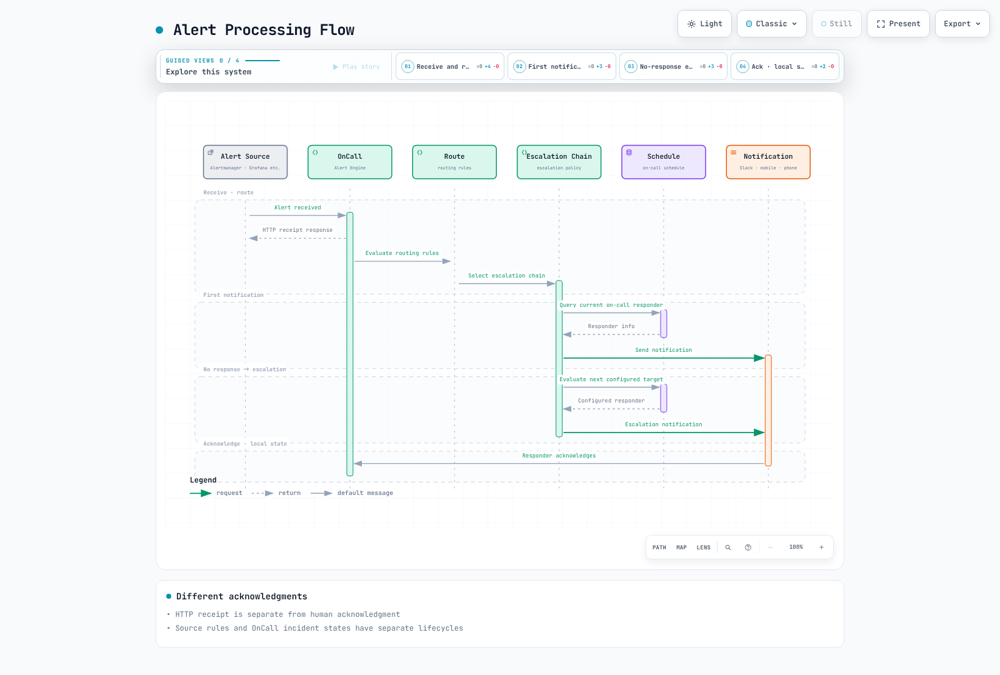
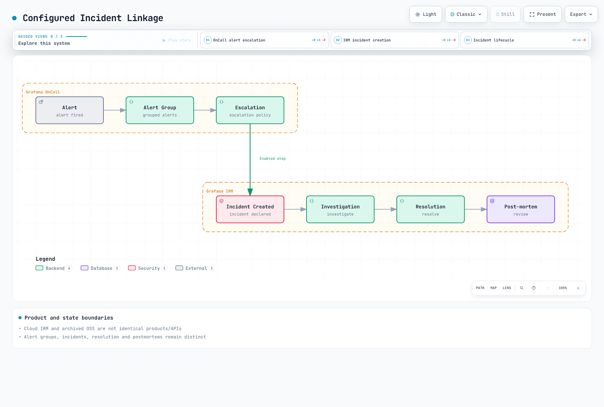
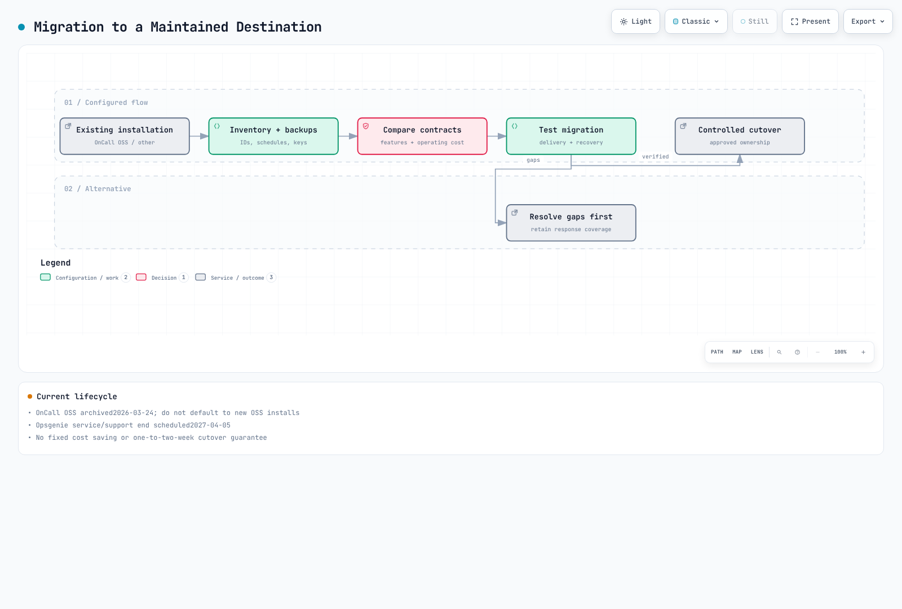

# Grafana OnCall

> **Última actualización**: September 13, 2026

<span id="tabla-de-contenido"></span>

## Tabla de contenidos

- [Visión general de Grafana OnCall](#grafana-oncall-overview)
- [Arquitectura](#architecture)
- [Instalación](#installation)
- [Configuración de integraciones](#integration-setup)
- [Configuración del calendario de guardias](#on-call-schedule-configuration)
- [Cadenas de escalado](#escalation-chains)
- [Agrupación y enrutamiento de alertas](#alert-grouping-and-routing)
- [Integración con ChatOps](#chatops-integration)
- [Integración con Grafana IRM](#grafana-irm-integration)
- [Aplicación móvil](#mobile-app)
- [Comparación con PagerDuty/OpsGenie](#pagerduty-opsgenie-comparison)
- [Buenas prácticas](#best-practices)

---

<span id="descripcion-general-de-grafana-oncall"></span>

## Visión general de Grafana OnCall {#grafana-oncall-overview}

**Grafana OnCall OSS se archivó el 2026-03-24.** Su repositorio se trasladó a `grafana-cold-storage/oncall` y es de solo lectura. Este capítulo sirve para revisar o migrar instalaciones existentes; no es una recomendación para un nuevo despliegue OSS en producción. Consulte por separado las funcionalidades, las API y los planes de Grafana Cloud IRM que sí reciben mantenimiento.

**Cloud Connection finalizó el 2026-03-24.** Las notificaciones push móviles en OSS a través de la aplicación Grafana IRM y las notificaciones por SMS o voz que dependían de Cloud Connection ya no funcionan. Twilio u otros servicios de notificación configurados por separado son rutas distintas; esto no significa que todos los mecanismos de teléfono/SMS autoalojados hayan terminado.

El código fuente archivado que se revisó es `af0fbd40558c9a63bcf438589894c440fc434a54`. La última versión publicada está etiquetada como v1.16.11, mientras que el chart de Helm/appVersion de ese código es 1.15.6; no son identificadores de versión intercambiables. Los ejemplos se verificaron contra ese código fuente y la documentación oficial de la API de OnCall. No se creó ninguna cuenta real de OnCall ni se realizaron escrituras por API o notificaciones.

<span id="caracteristicas-principales"></span>

### Funcionalidades principales

1. **Gestión del calendario de guardias**: rotaciones, excepciones (overrides), gestión de festivos
2. **Cadenas de escalado**: escalado automático basado en tiempo
3. **Agrupación de alertas**: consolidación de alertas relacionadas
4. **Diversas integraciones**: Alertmanager, Grafana, CloudWatch, Webhook
5. **ChatOps**: integración con Slack, MS Teams, Telegram
6. **Canales de notificación**: su disponibilidad depende del despliegue, las integraciones y las reglas de usuario

<span id="grafana-oncall-frente-a-pagerduty-y-opsgenie"></span>

### Grafana OnCall vs PagerDuty vs OpsGenie

| Opción | Base de revisión actual |
|---|---|
| OnCall OSS | Instalación existente archivada; responsabilidad sobre dependencias, recuperación y migración |
| Grafana Cloud IRM / PagerDuty | Verifique el mantenimiento, los canales/calendarios/API necesarios, las regiones y las condiciones contractuales |
| Opsgenie | Fin de venta el 2025-06-04; fin de servicio/soporte previsto para el 2027-04-05. Los usuarios existentes necesitan un plan de migración |

No seleccione un producto basándose en recuentos fijos de integraciones, precios antiguos o clasificaciones subjetivas de básico/avanzado.

---

<span id="arquitectura"></span>

## Arquitectura {#architecture}

### Componentes de Grafana OnCall

Son responsabilidades lógicas, no necesariamente Deployments (despliegues) separados. Inspeccione en el perfil instalado los valores de database.type, broker.type, Redis, la ubicación de engine/Celery y la conectividad del plugin.


[🔍 Ver diagrama interactivo](https://www.atomai.click/kubernetes-docs/archmaps/en-observability-alerting-03-grafana-oncall-0.html)

### Flujo de procesamiento de alertas



[🔍 Ver diagrama interactivo](https://www.atomai.click/kubernetes-docs/archmaps/en-observability-alerting-03-grafana-oncall-1.html)

---

<span id="instalacion"></span>

## Instalación {#installation}

### Instalación mediante Helm (EKS)

Antes de plantear cambios, inventaríe los digests de release/chart/imagen existentes, la base de datos, el broker, el plugin de Grafana, la autenticación y las dependencias de canales. Compare la salida de helm list, las imágenes de las cargas de trabajo y la salida protegida de helm get values/manifest. Los values y los manifiestos pueden contener credenciales reales: guárdelos de forma privada, no en chats, Git ni logs de compilación.

El chart archivado incluye dependencias antiguas de cert-manager, ingress-nginx y base de datos. No mezcle charts actuales de Grafana no relacionados con versiones del código archivado, ni interprete un simple comando helm install como prueba de soporte de seguridad actual.

### Configuración básica de values.yaml

Estas son claves reales del chart archivado inspeccionado. Distinguen ajustes que los ejemplos antiguos podían ignorar o malinterpretar en silencio.

| Responsabilidad | Clave del chart archivado |
|---|---|
| Réplicas de API/engine | `engine.replicaCount`, no `oncall.replicaCount` |
| URL | `base_url` junto con `base_url_protocol` |
| Entorno adicional | Mapa `env`, no una lista env nativa de Kubernetes |
| PostgreSQL externo | `externalPostgresql.db_name`, `existingSecret`, `passwordKey`, opciones TLS |
| Redis externo | `externalRedis.existingSecret`, `passwordKey`, `ssl_options` |
| Claves de cifrado de la aplicación | `oncall.secrets.existingSecret`, `secretKey`, `mirageSecretKey` |
| Telegram/Twilio | Ajustes anidados `oncall.telegram` y `oncall.twilio` |

Los valores por defecto activan MariaDB, RabbitMQ, Redis, Grafana, ingress-nginx, cert-manager y otros componentes. Cambiar database.type a PostgreSQL no desactiva automáticamente MariaDB ni otras dependencias no relacionadas. settings.hobby y el YAML genérico de Firebase no son perfiles de producción validados.

### values.yaml de producción

Aumentar el número de réplicas por sí solo no elimina los puntos únicos de fallo. Pruebe fallos de engine, Celery, scheduler/beat, base de datos, broker/caché, plugin, proveedor de notificaciones, DNS y certificados, incluyendo la durabilidad de las colas, el trabajo duplicado, los reintentos y la recuperación. Distinga las responsabilidades del broker RabbitMQ de las de Redis e inspeccione el broker.type real.

El responsable del despliegue existente debe revisar la verificación TLS de la base de datos y Redis, la entrega de secretos por rol, el acceso de red, la copia de seguridad/restauración y la migración. Un ALB expuesto a internet o un nombre de host de base de datos externa no convierten una configuración en apta para producción. Esta auditoría no desplegó EKS, no probó alta disponibilidad ni utilizó proveedores de notificación reales.

### Creación de Secrets

No pase valores reales mediante argumentos --from-literal ni values de Helm en texto plano. Utilice almacenes de secretos o archivos protegidos aprobados, y gestione las claves de cifrado existentes junto con las copias de seguridad de la base de datos. Cambiar a ciegas la clave/IV de Mirage de una instalación existente puede impedir el descifrado de los datos almacenados. Los tokens de la API pública, las URL de webhook de integración y las credenciales de Slack/Twilio/Telegram tienen permisos y requisitos de rotación diferentes.

---

<span id="configuracion-de-integraciones"></span>

## Configuración de integraciones {#integration-setup}

### Integración con Alertmanager

Utilice la **URL completa generada para el tipo de integración seleccionado**. La propia URL puede ser un secreto, así que guárdela en un archivo protegido. No invente una ruta `/api/v1/webhook/<id>/` ni la combine con un token de la API pública. La siguiente configuración de Alertmanager define los matchers actuales y ambos receivers; no se utilizó para enviar notificaciones.

```yaml
# Materialize the generated integration URL in this protected file.
# This example is not enabled or contacted during the documentation audit.
route:
  receiver: no-page
  group_by: [alertname, cluster, namespace, service]
  group_wait: 30s
  group_interval: 5m
  repeat_interval: 4h
  routes:
    - matchers: ['severity=~"critical|warning"']
      receiver: oncall
receivers:
  - name: no-page
  - name: oncall
    webhook_configs:
      - url_file: /etc/oncall/integration-url
        send_resolved: true
```

amtool 0.34 validó la sintaxis y cuatro casos de enrutamiento critical/warning/info/fallback. send_resolved reenvía los mensajes de resolución del origen; no hace que la resolución manual en OnCall cambie automáticamente la regla del origen.

### Integración con Grafana Alerting

Compruebe el contact point admitido y la integración generada para las versiones instaladas del plugin de Grafana/OnCall. Los ajustes INI, el YAML de provisioning y las API de la interfaz son distintos; el ejemplo antiguo etiquetaba incorrectamente el INI como YAML. El estado de reglas/notificaciones de Grafana Alerting y el estado del grupo de alertas de OnCall también son independientes.

### Integración con CloudWatch

Utilice los requisitos de confirmación de SNS, firma y tratamiento del payload propios de la integración específica para CloudWatch. Suscribir SNS a cualquier webhook genérico no garantiza la compatibilidad. Pruebe las transiciones ALARM/OK/INSUFFICIENT_DATA, la confirmación, los duplicados/reintentos, los permisos de topic/endpoint y la entrega real. Esta auditoría no creó ninguna suscripción de SNS ni acción de alarma.

<span id="integracion-con-webhook"></span>

### Integración por Webhook

Un payload de webhook genérico debe coincidir con las plantillas de parseo, agrupación y resolución configuradas explícitamente. Enviar alert_uid, state y labels no hace que todas las integraciones los interpreten igual. Serialice el JSON correctamente y diseñe la verificación HTTPS, los tiempos de espera, el manejo de errores y el comportamiento de reintento/deduplicación. Mantenga las URL, los tokens y los datos personales fuera de los logs.

La API pública utiliza el **token de Authorization sin procesar** documentado; no añada Bearer automáticamente. La autenticación con service-account-token de Grafana también requiere X-Grafana-URL. El origen de la API y el webhook de integración son rutas de autenticación distintas.

La [herramienta de inventario de solo lectura](https://github.com/Atom-oh/kubernetes-docs/tree/main/examples/observability/oncall) utiliza únicamente GET y valida el origen/la colección/el recuento de la paginación, TLS, las redirecciones y los permisos de archivo. Su salida puede contener URL de integración secretas y datos personales; no es una copia de seguridad completa de base de datos/claves/historial ni una instantánea de migración atómica. Doce pruebas locales con fixtures TLS pasaron sin consultar una cuenta real.

---

<span id="configuracion-del-calendario-de-guardias"></span>

## Configuración del calendario de guardias {#on-call-schedule-configuration}

### Concepto de calendario

Revise conjuntamente la zona horaria, la prioridad de los turnos y las excepciones. Nombrar capas como primary/secondary no configura automáticamente el escalado de respaldo. Inspeccione los responsables finales en la API o la interfaz y pruebe huecos, solapamientos, cambios de horario de verano (DST) y límites de relevo.


[🔍 Ver diagrama interactivo](https://www.atomai.click/kubernetes-docs/archmaps/en-observability-alerting-03-grafana-oncall-2.html)

### Creación de un calendario (API)

El campo `shifts` de un calendario web contiene **IDs de turnos existentes**, no objetos de turno anidados. Cree un turno en `/api/v1/on_call_shifts/` y después asocie el ID devuelto a un calendario web en `/api/v1/schedules/`. Son ejemplos de solicitud revisados por operadores que requieren IDs y fechas reales; no se realizaron escrituras.

```json
{
  "name": "Illustrative weekly rotation",
  "type": "rolling_users",
  "time_zone": "Asia/Seoul",
  "start": "2026-09-14T09:00:00",
  "duration": 604800,
  "frequency": "weekly",
  "interval": 1,
  "week_start": "MO",
  "start_rotation_from_user_index": 0,
  "rolling_users": [
    ["REPLACE_WITH_USER_ID_A"],
    ["REPLACE_WITH_USER_ID_B"]
  ]
}
```

```json
{
  "name": "Illustrative SRE schedule",
  "type": "web",
  "time_zone": "Asia/Seoul",
  "shifts": ["REPLACE_WITH_EXISTING_SHIFT_ID"]
}
```


### Tipos de rotación

La recurrencia semanal requiere `week_start`, un `interval` positivo y el índice del usuario inicial para rolling_users. La recurrencia diaria/semanal/horaria no equivale a cambiar solo duration. El validador del código fuente acepta start con el formato `YYYY-MM-DDTHH:MM:SS` y una time_zone aparte; no copie la antigua cadena con desplazamiento horario. Las fechas del JSON son muestras ilustrativas, no calendarios operativos.

Diecinueve comprobaciones ejecutan validadores puros reales del upstream e inspeccionan los campos del serializador. No demuestran la existencia de usuarios o turnos en la base de datos ni las asignaciones finales del calendario.

<span id="configuracion-de-anulaciones"></span>

### Configuración de excepciones (overrides)

En este código fuente, una excepción es un tipo aparte de `/api/v1/on_call_shifts/`, no la antigua solicitud supuesta `/schedules/<id>/overrides/`. Conéctela al calendario previsto conservando los IDs de turno existentes. Verifique el comportamiento de asociación y prioridad de la API instalada e inspeccione los responsables finales en un periodo de prueba delimitado.

```json
{
  "name": "Illustrative temporary replacement",
  "type": "override",
  "time_zone": "Asia/Seoul",
  "start": "2026-09-15T09:00:00",
  "duration": 28800,
  "users": ["REPLACE_WITH_EXISTING_USER_ID"]
}
```


---

<span id="cadenas-de-escalamiento"></span>

## Cadenas de escalado {#escalation-chains}

<span id="estructura-de-la-cadena-de-escalamiento"></span>

### Estructura de una cadena de escalado

Acknowledge, Resolve y Silence son estados diferentes. Confirmar la recepción (acknowledgment) no soluciona el problema subyacente ni desactiva la regla del origen. Verifique las condiciones de espera, parada y reaviso con la política y el estado de integración reales. Las ventanas de 15 minutos del diagrama son una política ilustrativa, no una garantía del producto.


[🔍 Ver diagrama interactivo](https://www.atomai.click/kubernetes-docs/archmaps/en-observability-alerting-03-grafana-oncall-3.html)

<span id="creacion-de-una-cadena-de-escalamiento"></span>

### Creación de una cadena de escalado

Verifique los IDs y permisos de las cadenas, calendarios y usuarios existentes; revise por separado las solicitudes de creación y actualización. Esto es **un único paso de espera** para /api/v1/escalation_policies/, no una solicitud completa de creación de cadena. El código fuente inspeccionado acepta duraciones de espera de un minuto a 24 horas, expresadas en segundos.

```json
{
  "escalation_chain_id": "REPLACE_WITH_EXISTING_CHAIN_ID",
  "position": 1,
  "type": "wait",
  "duration": 900
}
```


<span id="tipos-de-politicas-de-escalamiento"></span>

### Tipos de política de escalado

El serializador del código fuente admite notificación a calendario/usuario/equipo/grupo, esperas, condiciones de tiempo y recuento, webhooks personalizados y declaración de incidentes cuando la funcionalidad está habilitada. La referencia al webhook personalizado es action_to_trigger; no dé por supuesto el antiguo webhook_id ni un campo repeat_after universal. declare_incident existe, pero requiere que la funcionalidad esté habilitada en la organización.

important:true selecciona las **reglas de notificación importantes** configuradas por el usuario; no distribuye incondicionalmente a todos los canales. Revise por usuario el orden de las reglas default/important, las esperas, los canales y su disponibilidad real.


<span id="cadenas-de-escalamiento-por-gravedad"></span>

### Cadenas de escalado por severidad

Acuerde el propósito, las ventanas de respuesta, los respaldos, el horario laboral y el comportamiento de reaviso según la severidad. Notificar de nuevo al mismo calendario no siempre implica notificar a un responsable distinto. Verifique los campos reales de la API para pasos repetidos o condicionales y evite avisos duplicados para un mismo incidente. La entrega real por teléfono/SMS/webhook requiere una ruta de prueba aprobada y aquí no se utilizó.


---

<span id="agrupacion-y-enrutamiento-de-alertas"></span>

## Agrupación y enrutamiento de alertas {#alert-grouping-and-routing}

### Configuración de rutas

Compruebe el payload real de cada integración, el orden de las rutas y la ruta por defecto para eventos sin coincidencia. Los payloads de Alertmanager, Grafana y CloudWatch son distintos; una expresión regular que coincida con texto arbitrario del mensaje puede enrutar de forma errónea. Pruebe casos normales, con datos ausentes, malformados y contradictorios.


[🔍 Ver diagrama interactivo](https://www.atomai.click/kubernetes-docs/archmaps/en-observability-alerting-03-grafana-oncall-4.html)

### Creación de rutas

Este ejemplo utiliza campos presentes en el serializador de rutas inspeccionado. Slack usa slack.channel_id/enabled anidados, no el antiguo slack_channel_id plano. Se requieren IDs reales de integración, cadena y canal, además de autorización. La expresión regular es ilustrativa para un payload concreto, no una plantilla universal para cualquier proveedor.

```json
{
  "integration_id": "REPLACE_WITH_EXISTING_INTEGRATION_ID",
  "routing_type": "regex",
  "routing_regex": "\"severity\"\\s*:\\s*\"critical\"",
  "position": 0,
  "escalation_chain_id": "REPLACE_WITH_EXISTING_CHAIN_ID",
  "slack": {
    "channel_id": "REPLACE_WITH_EXISTING_SLACK_CHANNEL_ID",
    "enabled": true
  }
}
```


<span id="configuracion-de-agrupacion-de-alertas"></span>

### Configuración de la agrupación de alertas

Incluya en las claves de agrupación un alcance adecuado de cluster/entorno/namespace/service para evitar colisiones. Con muy pocos campos se fusionan incidentes no relacionados; con IDs sin límite los grupos se fragmentan. El antiguo YAML que mezclaba group_wait/group_interval/resolve_timeout no era un esquema universal de integración de OnCall. Distinga los temporizadores de Alertmanager de las plantillas de agrupación y resolución de OnCall.

Elija las variables de plantilla a partir del payload real de la integración. payload.labels no está garantizado ni se encuentra universalmente en el nivel superior de las solicitudes de Alertmanager. Escape el JSON correctamente y no trate la entrada del usuario como código de confianza.


---

<span id="integracion-de-chatops"></span>

## Integración con ChatOps {#chatops-integration}

### Integración con Slack

Verifique los secretos de OAuth y de firma, los scopes y la conexión con el workspace de la aplicación de Slack instalada. Referencie los slack_channels descubiertos mediante los ajustes anidados de Slack de la ruta; no dé por supuesto que el antiguo ejemplo POST /slack_channels crea o conecta un canal. La instalación de la aplicación y las acciones de usuario requieren un procedimiento operativo autorizado aparte y aquí no se realizaron.


### Comandos de Slack

La antigua lista de /oncall ack, /oncall resolve y /oncall silence no está respaldada por el código fuente inspeccionado. Este utiliza un comando raíz configurable y ejemplos con /grafana. Consulte la ayuda o documentación actual de la aplicación instalada y sus botones; los comandos slash no son comandos de Bash.


<span id="flujo-de-trabajo-de-slack"></span>

### Flujo de trabajo en Slack

Los botones Acknowledge/Resolve/Silence cambian el estado en OnCall mediante una acción de usuario autorizada. La confirmación de entrega, la actualización del mensaje de Slack y el estado del monitor de origen son cosas distintas; no dé por supuesta una actualización de estado automática en sentido inverso.


[🔍 Ver diagrama interactivo](https://www.atomai.click/kubernetes-docs/archmaps/en-observability-alerting-03-grafana-oncall-5.html)

### Integración con MS Teams

Verifique el webhook/workflow y el formato de tarjeta actualmente admitidos por Microsoft. No copie una URL antigua de Office connector y JSON MessageCard como si fuera una integración nueva universal. Un webhook de salida no se instala solo por escribir YAML; su contexto de plantilla, autenticación, payload, entrega y fallos requieren configuración real. No se enviaron mensajes a Teams.


### Integración con Telegram

El chart archivado utiliza los ajustes anidados oncall.telegram token/existingSecret/tokenKey y un telegramPolling aparte. El antiguo bloque telegram.enabled de nivel superior etiquetado como Bash no era una configuración correcta de Helm. Verifique las credenciales del bot, la propiedad del webhook/polling, la vinculación de usuarios y la disponibilidad actual. No se creó ningún bot ni se enviaron mensajes a usuarios.


---

<span id="integracion-de-grafana-irm"></span>

## Integración con Grafana IRM {#grafana-irm-integration}

### Gestión de respuesta a incidentes

Distinga las capacidades de alerting, guardias e incidentes de Grafana Cloud IRM, que sí reciben mantenimiento, de OnCall OSS archivado. IRM no es simplemente un cambio de nombre de Grafana Incident, ni garantiza APIs, permisos o cobertura funcional idénticas a las de OSS. Verifique las funcionalidades actuales del destino, el contrato, la retención y el soporte de exportación/importación.



[🔍 Ver diagrama interactivo](https://www.atomai.click/kubernetes-docs/archmaps/en-observability-alerting-03-grafana-oncall-6.html)

### Creación automática de incidentes

El código fuente inspeccionado contiene un paso declare_incident real, pero valida que la funcionalidad esté habilitada en la organización. Añadir YAML arbitrario de severity/title_template no configura una integración de incidentes. Distinga grupos de alertas, incidentes, confirmación de recepción, resolución y post-mortems, y verifique la propiedad y las transiciones de estado en una prueba aprobada.

---

<span id="aplicacion-movil"></span>

## Aplicación móvil {#mobile-app}

<span id="caracteristicas-de-la-aplicacion-movil"></span>

### Funcionalidades de la aplicación móvil

Las combinaciones admitidas de aplicación y despliegue pueden ofrecer feeds de alertas, acciones de estado, calendarios y notificaciones, sujetas a la conectividad del backend, los permisos del sistema operativo, la red y las reglas de usuario. No se garantiza la entrega inmediata ni el funcionamiento de las notificaciones push en toda instalación autoalojada.


### Configuración de la aplicación móvil

El antiguo bloque mobile.firebase no es una clave del chart archivado inspeccionado. Un archivo arbitrario de cuenta de servicio de Firebase no hace que las notificaciones push funcionen. Cloud Connection ha finalizado: las push de la aplicación Grafana IRM en OSS y los SMS/voz que usaban esa conexión no están disponibles. Configure y verifique una ruta de Twilio o servicio de notificación con soporte independiente, o un destino de migración. No se creó ningún proyecto/cuenta de Firebase ni notificación push.


### Prioridad de los canales de notificación

Important/default seleccionan conjuntos distintos de reglas personales de notificación. Se aplican su orden, esperas, canales y disponibilidad; important no significa entrega simultánea a todos los canales. Pruebe el comportamiento de entrega, confirmación de recepción y escalado.


[🔍 Ver diagrama interactivo](https://www.atomai.click/kubernetes-docs/archmaps/en-observability-alerting-03-grafana-oncall-7.html)

---

<span id="pagerdutyopsgenie-comparison"></span>

<span id="comparacion-con-pagerduty-opsgenie"></span>

## Comparación con PagerDuty/OpsGenie {#pagerduty-opsgenie-comparison}

<span id="comparacion-de-caracteristicas"></span>

### Comparación de funcionalidades

Compare los mismos requisitos frente a planes, uso y contratos reales. Los precios antiguos por usuario, los recuentos de integraciones y las clasificaciones de básico/avanzado no son evidencia actual para la selección. Compruebe calendarios y excepciones, escalado condicional, SSO, retención, permisos de API, límites por canal y país, soporte y coste de migración. OnCall OSS está archivado, y Opsgenie requiere planificar la migración conforme a su ciclo de vida anunciado.


<span id="consideraciones-de-migracion"></span>

### Consideraciones sobre la migración

La dirección por defecto ya no es una nueva migración desde PagerDuty/Opsgenie hacia OnCall OSS. Inventaríe los datos y dependencias de OnCall o de la herramienta que finaliza y, a continuación, valide las diferencias funcionales y la recuperación en un destino con mantenimiento. El código gratuito no elimina los costes de alojamiento, operación, soporte ni comunicación.



[🔍 Ver diagrama interactivo](https://www.atomai.click/kubernetes-docs/archmaps/en-observability-alerting-03-grafana-oncall-8.html)

### Lista de verificación de migración

- [ ] Inventariar usuarios/equipos, calendarios/zonas horarias/excepciones, cadenas/rutas, plantillas e integraciones
- [ ] Preparar copias de seguridad separadas de base de datos/claves/configuración/historial y pruebas de recuperación
- [ ] Verificar las funcionalidades del destino, el mapeo de IDs, los permisos, la privacidad y la retención
- [ ] Probar casos sintéticos de disparo/resolución/ausencia/reintento/duplicado/sin respuesta/relevo
- [ ] Evitar avisos duplicados durante la operación en paralelo; definir la propiedad, el cambio (cutover) y los criterios de reversión
- [ ] Cambiar las URL y los tokens de origen en una secuencia aprobada y retirar los accesos innecesarios tras la validación
- [ ] Completar la formación de los responsables de guardia y el traspaso operativo

Un solapamiento fijo de una a dos semanas no es una garantía, y un inventario por API no es una copia de seguridad completa.


---

<span id="practicas-recomendadas"></span>

## Buenas prácticas {#best-practices}

### Diseño del calendario de guardias

Acuerde los calendarios usando zonas horarias, festivos, relevos, respaldos y dotación de personal reales. Turnos semanales, relevos a las 09:00 o un mínimo de tres o cuatro personas no son respuestas universales. Transfiera los incidentes en curso, los silencios que expiran y los huecos de cobertura.


<span id="diseno-de-escalamiento"></span>

### Diseño del escalado

Documente las acciones y objetivos de respuesta por severidad, las rutas de respaldo y de gestión, el reaviso y las condiciones de parada. Los avisos que interrumpen necesitan respuestas accionables; la información no urgente puede usar otro canal. Important no garantiza la entrega por teléfono o SMS.


### Gestión de la calidad de las alertas

Revise la repetición, los falsos positivos, los eventos no detectados, los fallos de entrega y los resultados reales de respuesta. Vuelva a comprobar los datos y las transiciones de estado después de cambiar filtros, plantillas, agrupación o URL de origen, y conserve una ruta segura de restauración.


<span id="bienestar-durante-las-guardias"></span>

### Bienestar del personal de guardia

Acuerde con el equipo la carga de trabajo, la compensación, el tiempo de recuperación y las responsabilidades. Reduzca las causas de los incidentes recurrentes y mejore los runbooks, la automatización y los relevos. Las duraciones concretas de turno o de recuperación son políticas operativas que dependen del contexto.


---

## Cuestionario

Pon a prueba tus conocimientos con el [Cuestionario de Grafana OnCall](../../quizzes/observability/alerting/03-grafana-oncall-quiz.md).

## Referencias

- [OnCall OSS lifecycle](https://grafana.com/docs/oncall/latest/)
- [OnCall API reference](https://grafana.com/docs/oncall/latest/oncall-api-reference/)
- [Archived source contract](https://github.com/grafana-cold-storage/oncall/tree/af0fbd40558c9a63bcf438589894c440fc434a54)
- [Opsgenie lifecycle](https://www.atlassian.com/software/opsgenie)
- [Cloud Connection cutoff and alternatives](https://grafana.com/docs/oncall/latest/set-up/open-source/)
