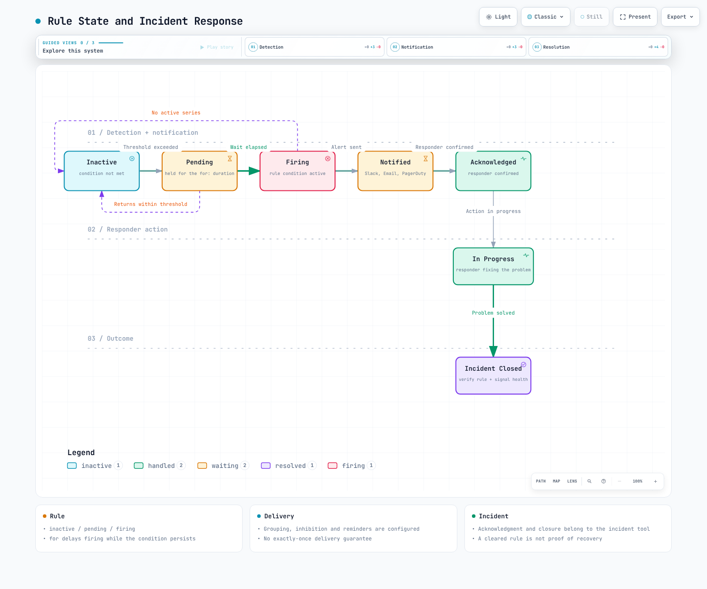
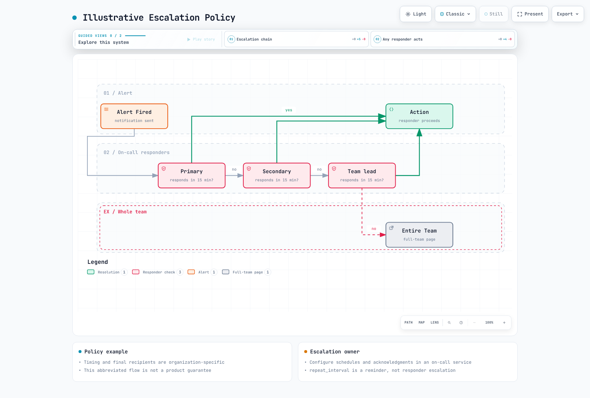
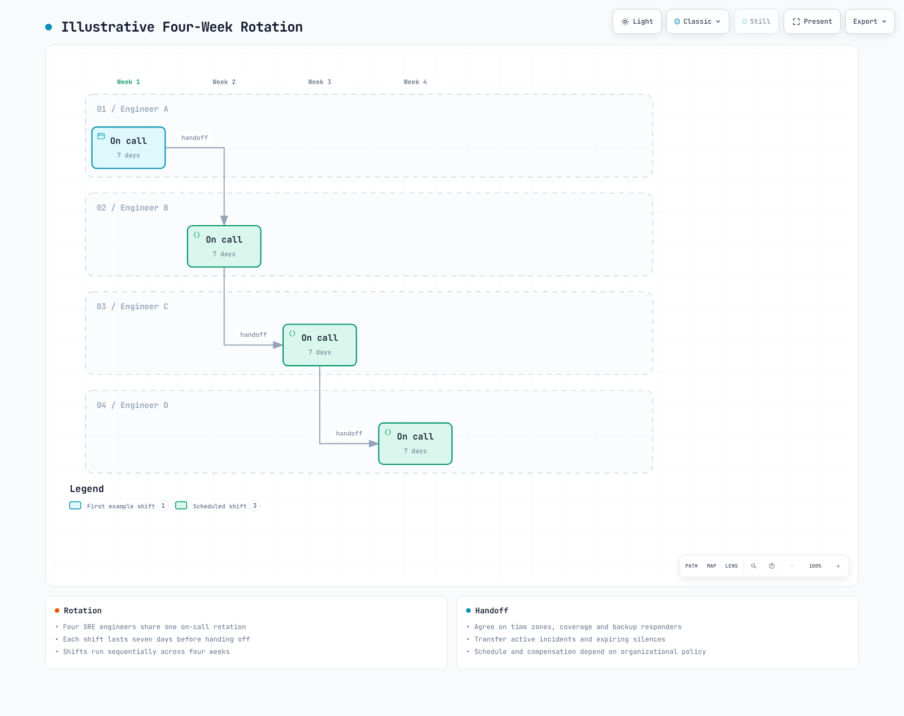

# Descripción general de alertas

> **Última actualización**: September 13, 2026


> Referencia de revisión: Prometheus 3.14.0 y Alertmanager 0.34.0. Los ejemplos asumen un clúster y series deduplicadas. Verifique los trabajos, las etiquetas, los exportadores y la disponibilidad de métricas reales, y luego ajuste los umbrales. Solo se ejecutaron comprobaciones locales de reglas/enrutamiento; no se probó ningún clúster ni canal de notificación.


## Tabla de contenidos

- [El rol y la importancia de las alertas](#the-role-and-importance-of-alerting)
- [Ciclo de vida de las alertas](#alert-lifecycle)
- [Principios de diseño de alertas](#alert-design-principles)
- [Enrutamiento y escalamiento de alertas](#alert-routing-and-escalation)
- [Rotación de guardia](#on-call-rotation)
- [Estrategia de alertas para entornos EKS](#alerting-strategy-for-eks-environments)
- [Comparación de soluciones](#solution-comparison)

---

<span id="the-role-and-importance-of-alerting"></span>

## El rol y la importancia de las alertas

### Posición de las alertas en los tres pilares de la observabilidad

Las métricas, los logs y las trazas son señales de observabilidad comunes; también existen perfiles y otras señales. Un motor de reglas no necesariamente evalúa las tres directamente:


[🔍 Ver diagrama interactivo](https://www.atomai.click/kubernetes-docs/archmaps/en-observability-alerting-readme-0.html)

- **Métricas**: Estado cuantitativo del sistema (CPU, memoria, número de solicitudes, etc.)
- **Logs**: Registros detallados de eventos
- **Trazas**: Flujo de solicitudes en sistemas distribuidos

Las reglas de Prometheus evalúan métricas. Los logs y las trazas alimentan alertas mediante reglas específicas del backend o métricas derivadas. La detección, la notificación y la confirmación humana son etapas independientes, y el éxito de la entrega necesita su propia monitorización.

### Por qué son necesarias las alertas

1. **Respuesta proactiva ante problemas**: Detectar incidencias antes de que los usuarios experimenten problemas
2. **Minimizar el tiempo de inactividad**: Mejorar la disponibilidad del servicio mediante una detección y respuesta rápidas
3. **Reducción de costes**: Reducir los costes laborales mediante monitorización automatizada
4. **Cumplimiento de SLA/SLO**: Componente esencial para lograr objetivos de nivel de servicio
5. **Registro de incidentes**: Rastrear y analizar el historial de ocurrencia de problemas

### Buenas alertas frente a malas alertas

| Aspecto | Buenas alertas | Malas alertas |
|--------|-------------|------------|
| **Capacidad de acción** | Requiere acción inmediata | Solo información, no requiere acción |
| **Claridad** | Está claro cuál es el problema | Vaga y poco clara |
| **Urgencia** | La urgencia coincide con la gravedad | Todo es urgente |
| **Frecuencia** | Frecuencia adecuada | Demasiado frecuente o demasiado rara |
| **Duplicación** | Alertas relacionadas agrupadas | Docenas de alertas para el mismo problema |

---

<span id="alert-lifecycle"></span>

## Ciclo de vida de las alertas

El diagrama combina el estado de la regla y la respuesta ante incidentes. Prometheus usa inactive/pending/firing; la confirmación y el trabajo en curso pertenecen a una herramienta de guardia. Cerrar un incidente no elimina una regla firing. Una serie temporal que desaparece también puede desactivar una regla y no debe tratarse como prueba de recuperación:



[🔍 Ver diagrama interactivo](https://www.atomai.click/kubernetes-docs/archmaps/en-observability-alerting-readme-1.html)

### 1. Detección

- **Basada en umbrales**: Cuando un valor específico supera un umbral configurado
- **Basada en la tasa de cambio**: Cuando la tasa de cambio es anómala
- **Detección de anomalías**: Detección de patrones anómalos basada en aprendizaje automático
- **Patrones de logs**: Cuando ocurren patrones de logs específicos

```yaml
groups:
  - name: node-alerts
    rules:
      - alert: HighCPUUsage
        expr: 100 * (1 - avg by (cluster, instance) (rate(node_cpu_seconds_total{mode="idle"}[5m]))) > 80
        for: 5m
        labels:
          severity: warning
          team: sre
        annotations:
          summary: "High CPU usage detected"
          description: "CPU usage is above 80% for 5 minutes on {{ $labels.instance }}"
```

### 2. Notificación

- **Selección de canal**: Slack, Email, SMS, PagerDuty, etc.
- **Enrutamiento**: Entregar a receptores apropiados según el tipo de alerta
- **Agrupación**: Agrupar alertas relacionadas
- **Deduplicación**: Reducir las notificaciones duplicadas; los recordatorios y reintentos de repeat_interval siguen siendo posibles, sin garantía de exactamente una vez

### 3. Escalamiento

- **Basado en tiempo**: Escalar al siguiente respondedor si no hay respuesta dentro del tiempo especificado
- **Basado en gravedad**: Diferentes rutas de escalamiento según la gravedad
- **Escalamiento automático**: Configúrelo en el servicio de guardia. Alertmanager repeat_interval ni comprueba la confirmación ni rota a los respondedores



[🔍 Ver diagrama interactivo](https://www.atomai.click/kubernetes-docs/archmaps/en-observability-alerting-readme-2.html)

### 4. Resolución

- **Resolución manual**: Un respondedor cierra el incidente en la herramienta de incidentes; el estado de la regla se comprueba por separado
- **Resolución automática**: Actualizar el estado del incidente según la política de integración después de comprobar la salud de la regla y de la recopilación
- **Notificación de resolución**: Enviar una notificación de resolución cuando se solucione el problema

---

<span id="alert-design-principles"></span>

## Principios de diseño de alertas

### 1. Alertas accionables

Las páginas que interrumpen a una persona necesitan una respuesta inmediata y accionable. Los eventos informativos y el trabajo a más largo plazo pueden ir a tickets o dashboards.

**Ejemplo malo:**
```
Alert: Database connection count increased
```

**Ejemplo bueno:**
```
Alert: Database connection pool exhausted
Action Required: Confirm user impact; inspect pool saturation and connection leaks using the runbook
Runbook: https://example.com/runbooks/replace-db-runbook
```

### 2. Prevención de la fatiga por alertas

Demasiadas alertas pueden hacer que se pasen por alto las alertas importantes.


[🔍 Ver diagrama interactivo](https://www.atomai.click/kubernetes-docs/archmaps/en-observability-alerting-readme-3.html)

**Estrategias de prevención de la fatiga por alertas:**

1. **Ajuste de umbrales**: No establezca umbrales demasiado sensibles
2. **Agrupación de alertas**: Agrupe alertas relacionadas en una sola
3. **Inhibición**: Suprima las alertas secundarias cuando se active la alerta principal
4. **Revisión periódica**: Elimine las alertas innecesarias
5. **Introducción gradual**: Comience las alertas nuevas con gravedad baja

### 3. Niveles de gravedad

Estos tiempos de respuesta son una política organizativa ilustrativa, no un SLA de producto ni una recomendación universal:

| Gravedad | Descripción | Tiempo de respuesta | Ejemplos |
|----------|-------------|---------------|----------|
| **Crítica** | Interrupción total del servicio | Inmediato (en 5 min) | Servicio completamente caído, riesgo de pérdida de datos |
| **Alta** | Fallo de función principal | En 15 min | Error del sistema de pagos, fallo de inicio de sesión |
| **Advertencia** | Problema potencial | En 1 hora | 80% de uso de disco, aumento de la latencia de respuesta |
| **Información** | Alerta informativa | Dentro del horario laboral | Deployment completado, copia de seguridad correcta |

```yaml
groups:
  - name: disk-alerts
    rules:
      - alert: DiskSpaceCritical
        expr: |
          (100 * node_filesystem_avail_bytes{fstype!~"tmpfs|overlay|squashfs"}
            / node_filesystem_size_bytes{fstype!~"tmpfs|overlay|squashfs"} < 5)
          and node_filesystem_readonly == 0
          and node_filesystem_size_bytes > 0
        for: 5m
        labels:
          severity: critical
          team: sre
        annotations:
          summary: "Disk space critical"
      - alert: DiskSpaceWarning
        expr: |
          (100 * node_filesystem_avail_bytes{fstype!~"tmpfs|overlay|squashfs"}
            / node_filesystem_size_bytes{fstype!~"tmpfs|overlay|squashfs"} < 20)
          and node_filesystem_readonly == 0
          and node_filesystem_size_bytes > 0
        for: 10m
        labels:
          severity: warning
          team: sre
        annotations:
          summary: "Disk space low"
```

### 4. Documentación de alertas

Todas las alertas deben incluir la siguiente información:

- **Descripción**: Qué significa la alerta
- **Impacto**: Cómo afecta este problema al servicio
- **Pasos de acción**: Guía paso a paso para resolver el problema
- **Enlace al runbook**: Documento detallado del procedimiento de respuesta

```yaml
annotations:
  summary: "Investigate the affected operation"
  description: "Check the rule expression, its units, labels, and collection health."
  impact: "Document the affected user operation before paging."
  action: "Use the owning team's reviewed runbook; do not scale resources blindly."
  runbook_url: "https://example.com/runbooks/replace-with-reviewed-runbook"
```

---

<span id="alert-routing-and-escalation"></span>

## Enrutamiento y escalamiento de alertas

### Estrategia de enrutamiento

Las alertas deben entregarse a receptores apropiados según diversos criterios:


[🔍 Ver diagrama interactivo](https://www.atomai.click/kubernetes-docs/archmaps/en-observability-alerting-readme-5.html)

### Diseño del árbol de enrutamiento

Esta es una configuración completa de validación de enrutamiento **sin notificaciones**. Los receptores vacíos son intencionales; configure integraciones revisadas y archivos Secret antes de usarlos en producción. Las alertas críticas se distribuyen al receptor de guardia y al equipo coincidente. Las etiquetas de equipo faltantes vuelven al predeterminado, salvo que una coincidencia solo crítica no llama también al predeterminado. Los retrasos de agrupación significan que no hay garantía de teléfono inmediato. Disk critical inhibe warning solo para la misma instancia/dispositivo/punto de montaje.

```yaml
route:
  receiver: default-receiver
  group_by: [alertname, cluster, namespace, service]
  group_wait: 30s
  group_interval: 5m
  repeat_interval: 4h
  routes:
    - matchers: ['severity="critical"']
      receiver: critical-oncall
      continue: true
    - matchers: ['team="sre"']
      receiver: sre-team
    - matchers: ['team="app"']
      receiver: dev-team
    - matchers: ['team="database"']
      receiver: dba-team
    - matchers: ['team="security"']
      receiver: security-team
receivers:
  - name: default-receiver
  - name: critical-oncall
  - name: sre-team
  - name: dev-team
  - name: dba-team
  - name: security-team
inhibit_rules:
  - source_matchers: ['alertname="DiskSpaceCritical"', 'instance!=""', 'device!=""', 'mountpoint!=""']
    target_matchers: ['alertname="DiskSpaceWarning"', 'instance!=""', 'device!=""', 'mountpoint!=""']
    equal: [cluster, instance, device, mountpoint]
```

### Política de escalamiento

Lo siguiente es ilustrativo. Configure las zonas horarias, las ventanas de confirmación, los respaldos y el comportamiento de reaviso en el servicio de guardia, y pruébelos en un simulacro:

| Paso | Tiempo | Destino | Canal |
|------|------|--------|---------|
| 1 | 0 min | Guardia principal | Slack, PagerDuty |
| 2 | 15 min | Guardia secundaria | Slack, PagerDuty, SMS |
| 3 | 30 min | Líder de equipo | Slack, PagerDuty, Teléfono |
| 4 | 45 min | Gerente de ingeniería | Teléfono |
| 5 | 60 min | CTO/VP de ingeniería | Teléfono |

---

<span id="on-call-rotation"></span>

## Rotación de guardia

### Concepto de guardia

La guardia se refiere a un respondedor designado responsable de los problemas del sistema durante un período especificado.



[🔍 Ver diagrama interactivo](https://www.atomai.click/kubernetes-docs/archmaps/en-observability-alerting-readme-8.html)


### Prácticas recomendadas de guardia

1. **Calendario de traspasos claro**: Rotación semanal o quincenal
2. **Proceso de traspaso**: Transferir los problemas en curso durante el cambio de turno
3. **Respondedor de respaldo**: Respaldo cuando el principal no está disponible
4. **Compensación adecuada**: Complemento por guardia o tiempo libre compensatorio
5. **Prevención del agotamiento**: Ciclo de rotación adecuado

### Requisitos de la herramienta de guardia

- **Gestión de calendarios**: Integración con calendario, gestión de turnos
- **Anulación**: Cambios temporales de respondedores
- **Escalamiento**: Escalamiento automático
- **Soporte móvil**: Recibir alertas en cualquier momento y lugar
- **Informes**: Análisis de actividad de guardia

---

<span id="alerting-strategy-for-eks-environments"></span>

## Estrategia de alertas para entornos EKS

### Áreas de alertas específicas de EKS


[🔍 Ver diagrama interactivo](https://www.atomai.click/kubernetes-docs/archmaps/en-observability-alerting-readme-4.html)

### Estrategia de alertas por capa

#### 1. Alertas a nivel de clúster

Reemplace el nombre del trabajo por el objetivo desplegado. up=0 demuestra un fallo de scrape, no una interrupción completa de la API. La regla absent cubre un ámbito de recopilación; las configuraciones multiclúster necesitan inventario de objetivos esperados y etiquetas de clúster. Use increase para el contador acumulativo de errores de Cluster Autoscaler. Un aumento reciente presente durante cinco minutos no significa que los errores ocurrieran continuamente durante cinco minutos. Esta regla no se aplica sin cambios a Karpenter ni a EKS Auto Mode.

```yaml
groups:
  - name: eks-cluster
    rules:
      - alert: EKSAPIServerScrapeFailed
        expr: up{job="kubernetes-apiservers"} == 0
        for: 1m
        labels:
          severity: critical
          team: sre
        annotations:
          summary: "Prometheus cannot scrape the configured API server target"
      - alert: EKSAPIServerTargetMissing
        expr: absent(up{job="kubernetes-apiservers"})
        for: 5m
        labels:
          severity: warning
          team: sre
        annotations:
          summary: "No API server target series in this Prometheus"
      - alert: EKSNodeNotReady
        expr: kube_node_status_condition{condition="Ready",status="true"} == 0
        for: 5m
        labels:
          severity: critical
          team: sre
        annotations:
          summary: "Node {{ $labels.node }} is not ready"
      - alert: EKSClusterAutoscalerRecentErrors
        expr: increase(cluster_autoscaler_errors_total[10m]) > 0
        for: 5m
        labels:
          severity: warning
          team: sre
        annotations:
          summary: "Cluster Autoscaler recorded failed loops in the last 10 minutes"
```

#### 2. Alertas a nivel de carga de trabajo

La serie CrashLoopBackOff puede desaparecer brevemente entre reintentos. Esta regla se activa después de que una ventana de observación reciente de cinco minutos permanezca poblada durante diez minutos. Detecta observaciones recurrentes, no Waiting actual continuo, y puede permanecer activa hasta cinco minutos después de la última observación. Las pruebas de reglas nativas distinguen un transitorio breve, reintentos recurrentes y recuperación.

```yaml
groups:
  - name: eks-workloads
    rules:
      - alert: PodCrashLooping
        expr: max_over_time(kube_pod_container_status_waiting_reason{reason="CrashLoopBackOff"}[5m]) >= 1
        for: 10m
        labels:
          severity: warning
          team: app
        annotations:
          summary: "Pod {{ $labels.namespace }}/{{ $labels.pod }} repeatedly observed in CrashLoopBackOff"
      - alert: PodFrequentRestarts
        expr: increase(kube_pod_container_status_restarts_total[15m]) > 3
        for: 5m
        labels:
          severity: warning
          team: app
        annotations:
          summary: "Pod {{ $labels.namespace }}/{{ $labels.pod }} has frequent restarts"
      - alert: PodNotReady
        expr: |
          (kube_pod_status_ready{condition="true"} == 0)
          and on (namespace, pod, uid)
          (kube_pod_status_phase{phase=~"Pending|Running|Unknown"} == 1)
        for: 15m
        labels:
          severity: warning
          team: app
        annotations:
          summary: "Active pod {{ $labels.namespace }}/{{ $labels.pod }} is not ready"
      - alert: DeploymentReplicasMismatch
        expr: |
          kube_deployment_spec_replicas
            > on (namespace, deployment) kube_deployment_status_replicas_available
        for: 10m
        labels:
          severity: warning
          team: app
        annotations:
          summary: "Deployment {{ $labels.namespace }}/{{ $labels.deployment }} has fewer available replicas than desired"
```

#### 3. Alertas a nivel de recursos

El ejemplo de CFS mide **períodos limitados / períodos totales**, no una fracción del tiempo transcurrido. Verifique que cAdvisor exporte estas métricas. La memoria sin límite puede aparecer como cero o como un valor muy grande; restrinja la regla de memoria a contenedores con límites explícitos. Las estadísticas de PVC dependen del controlador CSI y del tipo de volumen. Se excluyen los denominadores cero, pero las métricas ausentes no demuestran salud.

```yaml
groups:
  - name: eks-resources
    rules:
      - alert: ContainerCPUThrottling
        expr: |
          (
            sum by (namespace, pod, container) (
              rate(container_cpu_cfs_throttled_periods_total{container!="",container!="POD"}[5m]))
            / sum by (namespace, pod, container) (
              rate(container_cpu_cfs_periods_total{container!="",container!="POD"}[5m]))
          ) > 0.25
          and sum by (namespace, pod, container) (
            rate(container_cpu_cfs_periods_total{container!="",container!="POD"}[5m])) > 0
        for: 5m
        labels:
          severity: warning
          team: app
        annotations:
          summary: "More than 25% of CFS periods throttled for {{ $labels.pod }}/{{ $labels.container }}"
      - alert: ContainerMemoryNearLimit
        expr: |
          (
            container_memory_working_set_bytes{container!="",container!="POD"}
            / container_spec_memory_limit_bytes{container!="",container!="POD"}
          ) > 0.9
          and container_spec_memory_limit_bytes{container!="",container!="POD"} > 0
        for: 5m
        labels:
          severity: warning
          team: app
        annotations:
          summary: "Container {{ $labels.pod }}/{{ $labels.container }} memory is near its reported limit"
      - alert: PVCAlmostFull
        expr: |
          (kubelet_volume_stats_used_bytes / kubelet_volume_stats_capacity_bytes > 0.85)
          and kubelet_volume_stats_capacity_bytes > 0
        for: 5m
        labels:
          severity: warning
          team: sre
        annotations:
          summary: "PVC {{ $labels.namespace }}/{{ $labels.persistentvolumeclaim }} is almost full"
```

### Alertas de integración de servicios AWS

EKS 1.28+ proporciona métricas seleccionadas del plano de control en AWS/EKS; esto no expone todos los componentes internos para scrape. Habilite los logs del plano de control por separado para investigar errores de autenticación. Evalúe la disponibilidad usando la salud de la recopilación, los fallos de solicitudes de API y sondas externas:

| Servicio AWS | Elementos de monitorización | Herramienta de alerta |
|-------------|------------------|------------|
| Plano de control de EKS | Disponibilidad de API Server, errores de autenticación | CloudWatch |
| EC2 (Nodes) | Estado de instancia, comprobaciones del sistema | CloudWatch |
| EBS | Estado del volumen, uso de IOPS | CloudWatch |
| EFS | Rendimiento, número de conexiones | CloudWatch |
| ALB / NLB | Solicitudes/errores/tiempo de respuesta HTTP de ALB; flujos/restablecimientos TCP/salud de objetivos de NLB | CloudWatch: use métricas específicas del producto |
| VPC / NAT Gateway | Métricas de NAT; registros aceptados/rechazados en Flow Logs habilitados por separado | Métricas/logs de CloudWatch; Flow Logs no es un motor de alarmas |

---

<span id="solution-comparison"></span>

## Comparación de soluciones

### Tabla de comparación de las principales soluciones de alertas

| Producto | Rol y restricciones operativas |
|---------|--------------------------------|
| Alertmanager | Agrupación, enrutamiento, inhibición y recordatorios de código abierto; requiere alojamiento y operación. No ofrece calendarios de guardia ni escalamiento basado en confirmación |
| CloudWatch Alarms | Evalúa métricas/consultas compatibles de AWS, cambia de estado e invoca acciones configuradas; los calendarios son independientes |
| Grafana OnCall OSS | Archivado el 2026-03-24; no es una opción predeterminada para un nuevo despliegue de producción |
| Grafana Cloud IRM / PagerDuty | Candidatos para guardia/escalamiento; verifique los planes, canales, regiones y contratos actuales |
| Opsgenie | Fin de ventas el 2025-06-04; finalización de soporte y servicio programada para el 2027-04-05. Los usuarios existentes necesitan un plan de migración |

### Guía de selección de soluciones


[🔍 Ver diagrama interactivo](https://www.atomai.click/kubernetes-docs/archmaps/en-observability-alerting-readme-6.html)

#### Soluciones recomendadas según la situación

1. Centrado en Prometheus: use Alertmanager para agrupación/enrutamiento y conecte los canales necesarios.
2. Centrado en métricas de AWS: evalúe CloudWatch Alarms con SNS o integraciones de incidentes compatibles.
3. Respuesta ininterrumpida: elija un servicio de guardia mantenido según la dotación de personal, los respaldos, las zonas horarias, la confirmación, el escalamiento y el coste.
4. Grafana OnCall OSS/Opsgenie existentes: verifique la migración de funciones, historial, calendarios e integraciones.

### Enfoque híbrido

Las soluciones se pueden combinar. CloudWatch no envía automáticamente de forma directa a Alertmanager. Este ejemplo usa SNS/una integración compatible con el servicio de guardia; el enrutamiento a través de Alertmanager requiere un adaptador diseñado por separado, autenticación y gestión de duplicados/resoluciones:


[🔍 Ver diagrama interactivo](https://www.atomai.click/kubernetes-docs/archmaps/en-observability-alerting-readme-7.html)

**Arquitectura de ejemplo:**

1. **Prometheus + Alertmanager**: Recopilación de métricas y procesamiento principal de alertas
2. **CloudWatch**: Recopilación de métricas de servicios AWS
3. **Servicio de guardia mantenido**: Gestión de guardia y escalamiento
4. **Slack**: Alertas y colaboración en tiempo real

---

## Próximos pasos

Esta sección cubrió los conceptos básicos y las estrategias de alertas. Para métodos de configuración detallados para cada solución, consulte los siguientes documentos:

- [Prometheus Alertmanager](./01-alertmanager.md): Gestión de alertas de código abierto
- [CloudWatch Alarms](./02-cloudwatch-alarms.md): Alertas nativas de AWS
- [Grafana OnCall](./03-grafana-oncall.md): Revisión de instalaciones existentes y consideraciones de migración

---

## Referencias

- [Prácticas recomendadas de alertas de Prometheus](https://prometheus.io/docs/practices/alerting/)
- [Libro SRE de Google - Alertas prácticas](https://sre.google/sre-book/practical-alerting/)
- [Documentación de AWS CloudWatch Alarms](https://docs.aws.amazon.com/AmazonCloudWatch/latest/monitoring/AlarmThatSendsEmail.html)
- [Documentación de Grafana OnCall](https://grafana.com/docs/oncall/latest/)
- [Guía de operaciones de PagerDuty](https://www.pagerduty.com/resources/operations/)

- [Configuración de Alertmanager](https://prometheus.io/docs/alerting/latest/configuration/)
- [Métricas del plano de control de EKS](https://docs.aws.amazon.com/eks/latest/userguide/cloudwatch.html)
- [Ciclo de vida y migración de Opsgenie](https://www.atlassian.com/software/opsgenie)
