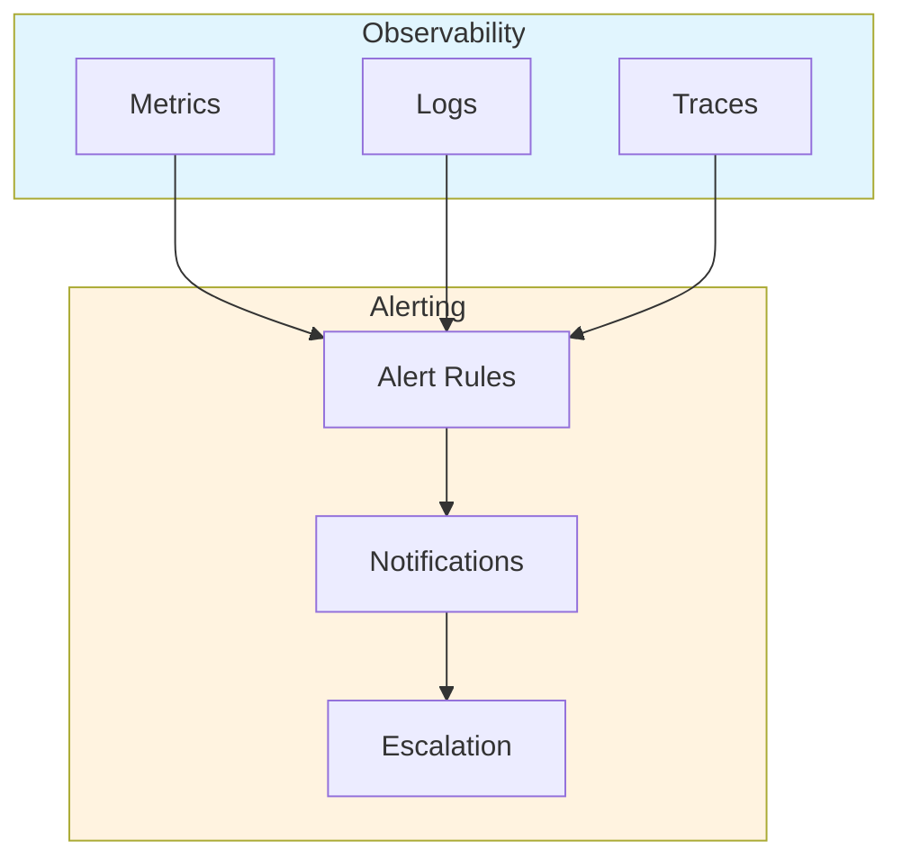
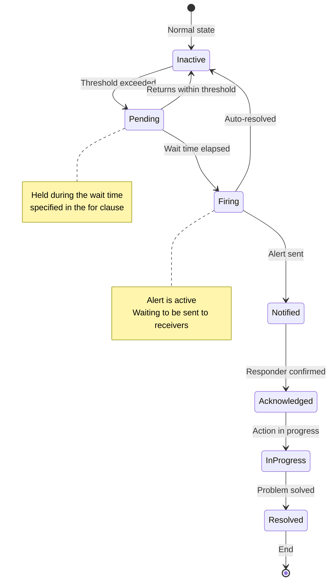
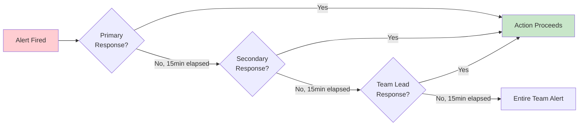
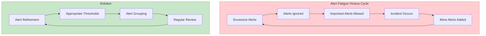
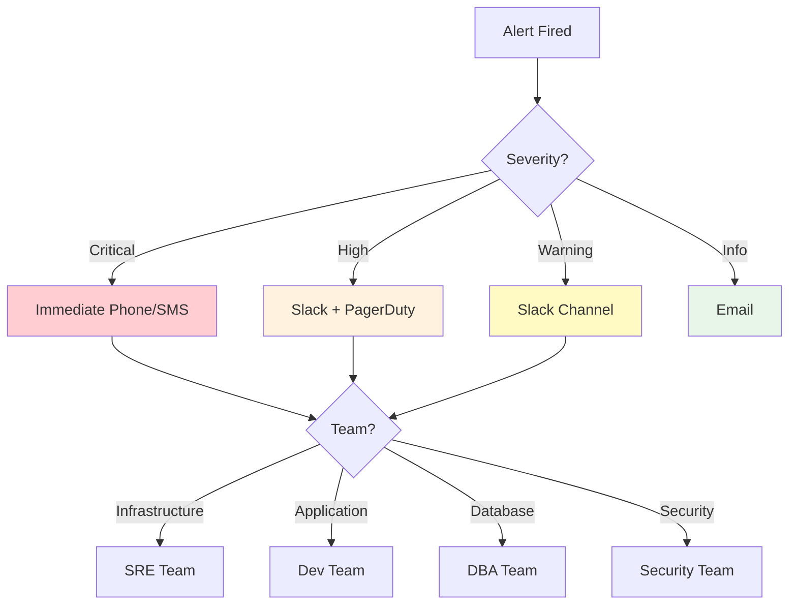
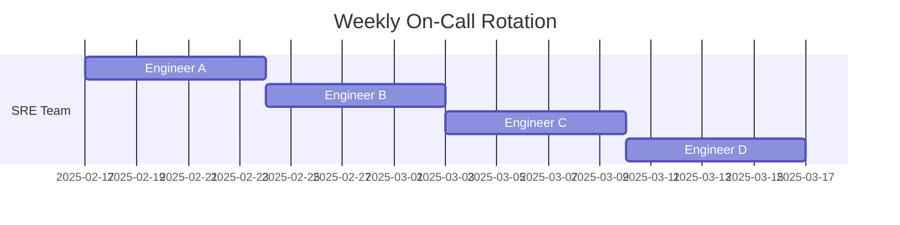
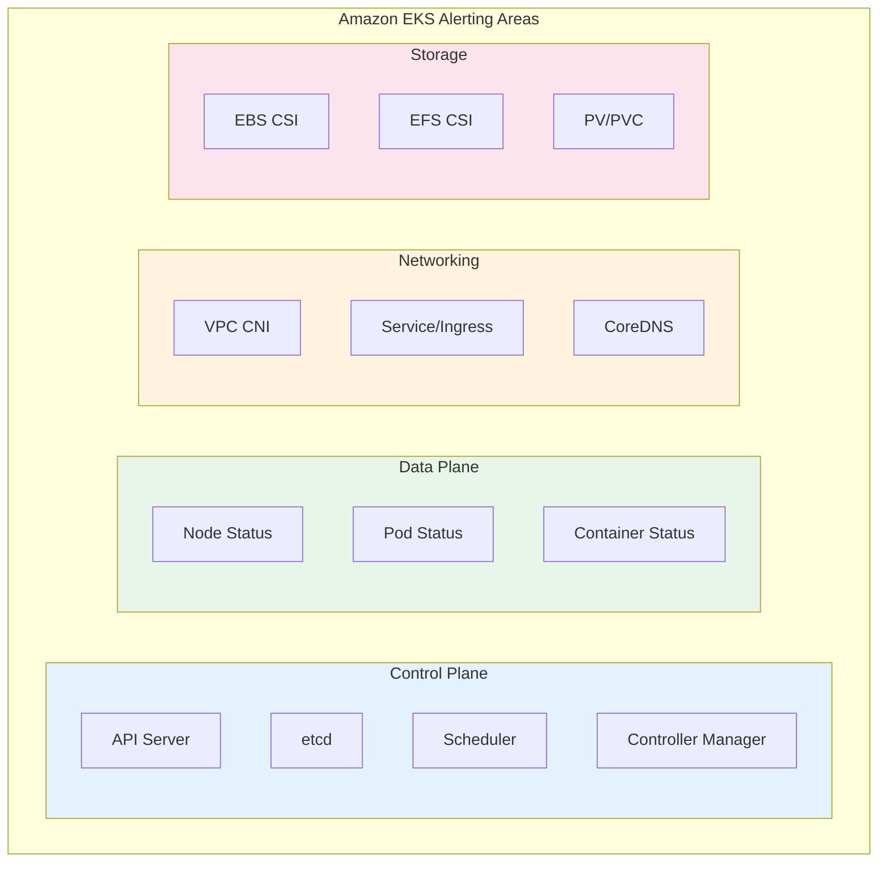
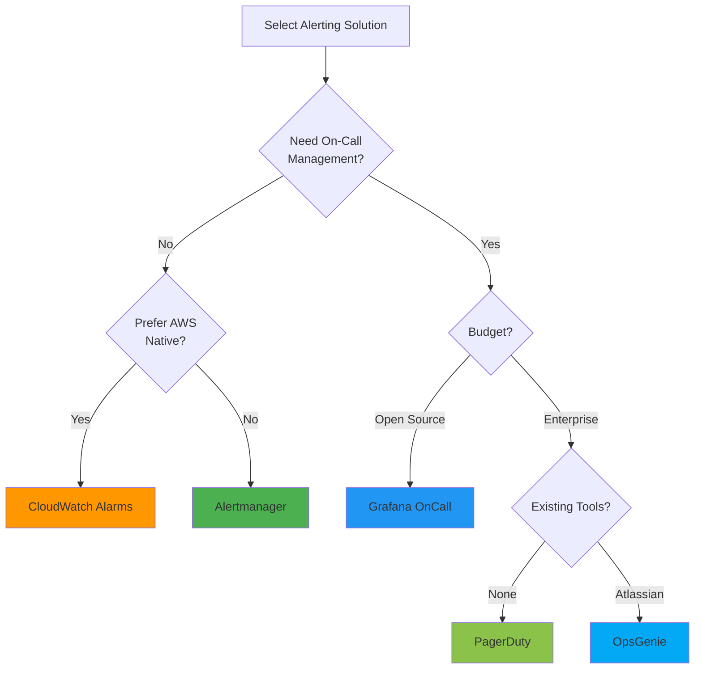
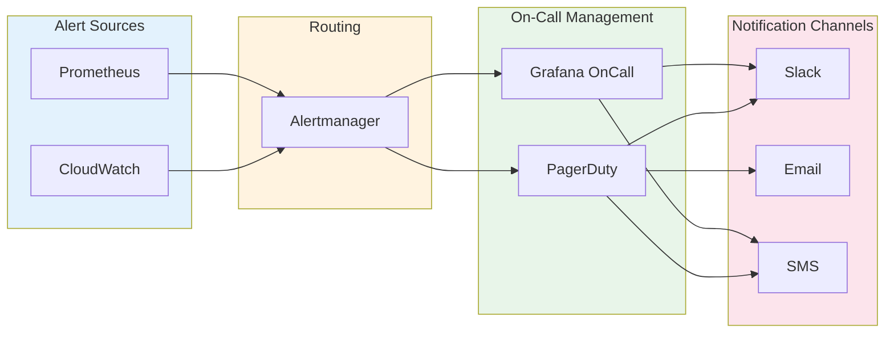

# Descripción general de alertas

> **Última actualización**: February 20, 2026

## Tabla de contenido

- [El rol y la importancia de las alertas](#the-role-and-importance-of-alerting)
- [Ciclo de vida de las alertas](#alert-lifecycle)
- [Principios de diseño de alertas](#alert-design-principles)
- [Enrutamiento y escalamiento de alertas](#alert-routing-and-escalation)
- [Rotación de guardias](#on-call-rotation)
- [Estrategia de alertas para entornos EKS](#alerting-strategy-for-eks-environments)
- [Comparación de soluciones](#solution-comparison)

---

## El rol y la importancia de las alertas

### La posición de las alertas en los tres pilares de la observabilidad

La observabilidad moderna consta de tres pilares fundamentales:



- **Métricas**: Estado cuantitativo del sistema (CPU, memoria, cantidad de solicitudes, etc.)
- **Logs**: Registros detallados de eventos
- **Trazas**: Flujo de solicitudes en sistemas distribuidos

Las **alertas** detectan anomalías basándose en estas tres fuentes de datos y notifican oportunamente al personal responsable, lo que permite una respuesta rápida.

### Por qué son necesarias las alertas

1. **Respuesta proactiva a problemas**: Detectar incidencias antes de que los usuarios experimenten problemas
2. **Minimizar el tiempo de inactividad**: Mejorar la disponibilidad del servicio mediante una detección y respuesta rápidas
3. **Reducción de costos**: Reducir los costos de mano de obra mediante la monitorización automatizada
4. **Cumplimiento de SLA/SLO**: Componente esencial para alcanzar los objetivos de nivel de servicio
5. **Registro de incidentes**: Realizar seguimiento y analizar el historial de aparición de problemas

### Buenas alertas frente a malas alertas

| Aspecto | Buenas alertas | Malas alertas |
|--------|-------------|------------|
| **Capacidad de acción** | Requieren una acción inmediata | Solo informativas, no requieren acción |
| **Claridad** | Está claro cuál es el problema | Vagas y poco claras |
| **Urgencia** | La urgencia coincide con la gravedad | Todo es urgente |
| **Frecuencia** | Frecuencia adecuada | Demasiado frecuentes o demasiado escasas |
| **Duplicación** | Las alertas relacionadas se agrupan | Decenas de alertas por el mismo problema |

---

## Ciclo de vida de las alertas

Las alertas pasan por el siguiente ciclo de vida:



### 1. Detección

- **Basada en umbrales**: Cuando un valor específico supera un umbral configurado
- **Basada en la tasa de cambio**: Cuando la tasa de cambio es anormal
- **Detección de anomalías**: Detección de patrones anormales basada en machine learning
- **Patrones de logs**: Cuando se producen patrones de logs específicos

```yaml
# Prometheus alert rule example
groups:
  - name: node-alerts
    rules:
      - alert: HighCPUUsage
        expr: 100 - (avg by(instance) (irate(node_cpu_seconds_total{mode="idle"}[5m])) * 100) > 80
        for: 5m  # Alert fires if condition persists for 5 minutes
        labels:
          severity: warning
        annotations:
          summary: "High CPU usage detected"
          description: "CPU usage is above 80% for 5 minutes on {{ $labels.instance }}"
```

### 2. Notificación

- **Selección de canal**: Slack, Email, SMS, PagerDuty, etc.
- **Enrutamiento**: Entregar a los receptores adecuados según el tipo de alerta
- **Agrupación**: Reunir alertas relacionadas
- **Deduplicación**: Evitar el envío repetido de alertas idénticas

### 3. Escalamiento

- **Basado en el tiempo**: Escalar al siguiente responsable si no hay respuesta dentro del tiempo especificado
- **Basado en la gravedad**: Distintas rutas de escalamiento según la gravedad
- **Escalamiento automático**: Escalamiento automático conforme a reglas definidas



### 4. Resolución

- **Resolución manual**: La persona responsable cierra la alerta después de corregir el problema
- **Resolución automática**: Se cierra automáticamente cuando las métricas vuelven al rango normal
- **Notificación de resolución**: Enviar una notificación de resolución cuando el problema se corrija

---

## Principios de diseño de alertas

### 1. Alertas accionables

Todas las alertas deben permitir al receptor tomar medidas inmediatas.

**Mal ejemplo:**
```
Alert: Database connection count increased
```

**Buen ejemplo:**
```
Alert: Database connection pool exhausted
Action Required: Scale up database or investigate connection leaks
Runbook: https://wiki.company.com/db-connection-exhausted
```

### 2. Prevención de la fatiga de alertas

Demasiadas alertas pueden provocar que se pasen por alto alertas importantes.



**Estrategias para prevenir la fatiga de alertas:**

1. **Ajuste de umbrales**: No establezca umbrales demasiado sensibles
2. **Agrupación de alertas**: Reúna las alertas relacionadas en una sola
3. **Inhibición**: Suprima las alertas secundarias cuando se active una alerta principal
4. **Revisión regular**: Elimine las alertas innecesarias
5. **Introducción gradual**: Inicie las alertas nuevas primero con baja gravedad

### 3. Niveles de gravedad

Defina y siga un sistema de gravedad coherente:

| Gravedad | Descripción | Tiempo de respuesta | Ejemplos |
|----------|-------------|---------------|----------|
| **Crítica** | Interrupción total del servicio | Inmediata (en un plazo de 5 min) | Servicio completamente caído, riesgo de pérdida de datos |
| **Alta** | Fallo de una función principal | En un plazo de 15 min | Error del sistema de pagos, fallo de inicio de sesión |
| **Advertencia** | Problema potencial | En un plazo de 1 hora | 80 % de uso de disco, mayor latencia de respuesta |
| **Información** | Alerta informativa | En horario laboral | Deployment completado, backup correcto |

```yaml
# Alert rules by severity example
groups:
  - name: disk-alerts
    rules:
      - alert: DiskSpaceCritical
        expr: (node_filesystem_avail_bytes / node_filesystem_size_bytes) * 100 < 5
        for: 5m
        labels:
          severity: critical
        annotations:
          summary: "Disk space critical"

      - alert: DiskSpaceWarning
        expr: (node_filesystem_avail_bytes / node_filesystem_size_bytes) * 100 < 20
        for: 10m
        labels:
          severity: warning
        annotations:
          summary: "Disk space low"
```

### 4. Documentación de alertas

Todas las alertas deben incluir la siguiente información:

- **Descripción**: Qué significa la alerta
- **Impacto**: Cómo afecta este problema al servicio
- **Pasos de acción**: Guía paso a paso para resolver el problema
- **Enlace al runbook**: Documento detallado de procedimiento de respuesta

```yaml
annotations:
  summary: "High memory usage on {{ $labels.instance }}"
  description: |
    Memory usage is above 90% on {{ $labels.instance }}.
    Current value: {{ $value | printf "%.2f" }}%
  impact: "Application may experience OOM kills and service degradation"
  action: |
    1. Check for memory leaks: kubectl top pods -n {{ $labels.namespace }}
    2. Review recent deployments
    3. Consider scaling horizontally
  runbook_url: "https://wiki.company.com/runbooks/high-memory"
```

---

## Enrutamiento y escalamiento de alertas

### Estrategia de enrutamiento

Las alertas deben entregarse a los receptores adecuados según diversos criterios:



### Diseño del árbol de enrutamiento

```yaml
# Alertmanager routing configuration example
route:
  receiver: 'default-receiver'
  group_by: ['alertname', 'cluster', 'service']
  group_wait: 30s
  group_interval: 5m
  repeat_interval: 4h

  routes:
    # Critical alerts - immediate phone call
    - match:
        severity: critical
      receiver: 'pagerduty-critical'
      continue: true

    # Infrastructure team alerts
    - match_re:
        alertname: ^(Node|Disk|CPU|Memory).*
      receiver: 'sre-team'
      routes:
        - match:
            severity: critical
          receiver: 'sre-oncall'

    # Application team alerts
    - match_re:
        namespace: ^(app|api|web).*
      receiver: 'dev-team'

    # Database alerts
    - match_re:
        alertname: ^(MySQL|PostgreSQL|Redis|MongoDB).*
      receiver: 'dba-team'
```

### Política de escalamiento

Configure políticas de escalamiento basadas en el tiempo para asegurar que las alertas no se ignoren:

| Paso | Tiempo | Destino | Canal |
|------|------|--------|---------|
| 1 | 0 min | Guardia principal | Slack, PagerDuty |
| 2 | 15 min | Guardia secundaria | Slack, PagerDuty, SMS |
| 3 | 30 min | Líder de equipo | Slack, PagerDuty, teléfono |
| 4 | 45 min | Responsable de ingeniería | Teléfono |
| 5 | 60 min | CTO/VP de Ingeniería | Teléfono |

---

## Rotación de guardias

### Concepto de guardia

La guardia se refiere a una persona responsable designada para los problemas del sistema durante un período especificado.



### Mejores prácticas para guardias

1. **Calendario de relevo claro**: Rotación semanal o quincenal
2. **Proceso de relevo**: Transferir los problemas en curso durante el cambio de turno
3. **Persona responsable de respaldo**: Respaldo cuando la persona responsable principal no está disponible
4. **Compensación adecuada**: Subsidio por guardia o tiempo libre compensatorio
5. **Prevención del agotamiento**: Ciclo de rotación adecuado

### Requisitos de las herramientas de guardia

- **Gestión de calendario**: Integración con calendario, gestión de turnos
- **Anulación**: Cambios temporales de responsable
- **Escalamiento**: Escalamiento automático
- **Soporte móvil**: Recibir alertas en cualquier momento y lugar
- **Informes**: Análisis de la actividad de guardia

---

## Estrategia de alertas para entornos EKS

### Áreas de alertas específicas de EKS



### Estrategia de alertas por capa

#### 1. Alertas a nivel de clúster

```yaml
# Cluster-level alert examples
groups:
  - name: eks-cluster
    rules:
      - alert: EKSAPIServerDown
        expr: up{job="kubernetes-apiservers"} == 0
        for: 1m
        labels:
          severity: critical
        annotations:
          summary: "EKS API Server is down"

      - alert: EKSNodeNotReady
        expr: kube_node_status_condition{condition="Ready",status="true"} == 0
        for: 5m
        labels:
          severity: critical
        annotations:
          summary: "Node {{ $labels.node }} is not ready"

      - alert: EKSClusterAutoscalerError
        expr: cluster_autoscaler_errors_total > 0
        for: 5m
        labels:
          severity: warning
        annotations:
          summary: "Cluster Autoscaler is experiencing errors"
```

#### 2. Alertas a nivel de carga de trabajo

```yaml
# Workload-level alert examples
groups:
  - name: eks-workloads
    rules:
      - alert: PodCrashLooping
        expr: rate(kube_pod_container_status_restarts_total[15m]) * 60 * 15 > 3
        for: 5m
        labels:
          severity: warning
        annotations:
          summary: "Pod {{ $labels.pod }} is crash looping"

      - alert: PodNotReady
        expr: |
          sum by (namespace, pod) (
            kube_pod_status_phase{phase=~"Pending|Unknown"}
          ) > 0
        for: 15m
        labels:
          severity: warning
        annotations:
          summary: "Pod {{ $labels.pod }} has been pending for 15 minutes"

      - alert: DeploymentReplicasMismatch
        expr: |
          kube_deployment_spec_replicas != kube_deployment_status_replicas_available
        for: 10m
        labels:
          severity: warning
        annotations:
          summary: "Deployment {{ $labels.deployment }} has replica mismatch"
```

#### 3. Alertas a nivel de recursos

```yaml
# Resource-level alert examples
groups:
  - name: eks-resources
    rules:
      - alert: ContainerCPUThrottling
        expr: |
          rate(container_cpu_cfs_throttled_seconds_total[5m]) > 0.25
        for: 5m
        labels:
          severity: warning
        annotations:
          summary: "Container {{ $labels.container }} is being CPU throttled"

      - alert: ContainerMemoryNearLimit
        expr: |
          (container_memory_working_set_bytes / container_spec_memory_limit_bytes) > 0.9
        for: 5m
        labels:
          severity: warning
        annotations:
          summary: "Container {{ $labels.container }} memory usage is near limit"

      - alert: PVCAlmostFull
        expr: |
          (kubelet_volume_stats_used_bytes / kubelet_volume_stats_capacity_bytes) > 0.85
        for: 5m
        labels:
          severity: warning
        annotations:
          summary: "PVC {{ $labels.persistentvolumeclaim }} is almost full"
```

### Alertas de integración con servicios de AWS

EKS se integra con diversos servicios de AWS, por lo que también se necesitan alertas para estos:

| Servicio de AWS | Elementos de monitorización | Herramienta de alertas |
|-------------|------------------|------------|
| EKS Control Plane | Disponibilidad de API Server, errores de autenticación | CloudWatch |
| EC2 (Nodes) | Estado de las instancias, comprobaciones del sistema | CloudWatch |
| EBS | Estado del volumen, uso de IOPS | CloudWatch |
| EFS | Rendimiento, cantidad de conexiones | CloudWatch |
| ALB/NLB | Cantidad de solicitudes, tasa de errores, latencia | CloudWatch |
| VPC | Tráfico de red, NAT Gateway | CloudWatch/VPC Flow Logs |

---

## Comparación de soluciones

### Tabla de comparación de las principales soluciones de alertas

| Característica | Alertmanager | CloudWatch Alarms | Grafana OnCall | PagerDuty | OpsGenie |
|---------|--------------|-------------------|----------------|-----------|----------|
| **Tipo** | Open Source | Nativo de AWS | Open Source/SaaS | SaaS | SaaS |
| **Costo** | Gratuito | Precio por alarma | Gratuito/de pago | De pago | De pago |
| **Integración con EKS** | Integración con Prometheus | Nativa | Integración con Alertmanager | Diversas integraciones | Diversas integraciones |
| **Gestión de guardias** | Ninguna | Ninguna | Sí | Sí | Sí |
| **Escalamiento** | Básico | Ninguno | Sí | Avanzado | Avanzado |
| **Aplicación móvil** | Ninguna | Ninguna | Sí | Sí | Sí |
| **ChatOps** | Webhook | SNS | Slack, Teams | Diversos | Diversos |
| **Complejidad** | Media | Baja | Media | Baja | Baja |

### Guía de selección de soluciones



#### Soluciones recomendadas según la situación

1. **Equipo pequeño, consciente de los costos**: Alertmanager + Slack
2. **Entorno completamente en AWS**: CloudWatch Alarms + SNS + Lambda
3. **Tamaño mediano, necesita guardias**: Grafana OnCall
4. **Organización grande, escalamiento complejo**: PagerDuty
5. **Ecosistema de Atlassian**: OpsGenie

### Enfoque híbrido

La mayoría de los entornos de producción utilizan una combinación de soluciones:



**Arquitectura recomendada:**

1. **Prometheus + Alertmanager**: Recopilación de métricas y procesamiento principal de alertas
2. **CloudWatch**: Recopilación de métricas de servicios de AWS
3. **Grafana OnCall o PagerDuty**: Gestión de guardias y escalamiento
4. **Slack**: Alertas y colaboración en tiempo real

---

## Próximos pasos

Esta sección cubrió los conceptos y las estrategias básicas de alertas. Para conocer métodos de configuración detallados para cada solución, consulte los siguientes documentos:

- [Prometheus Alertmanager](./01-alertmanager.md): Gestión de alertas Open Source
- [CloudWatch Alarms](./02-cloudwatch-alarms.md): Alertas nativas de AWS
- [Grafana OnCall](./03-grafana-oncall.md): Gestión de guardias e incidentes

---

## Referencias

- [Mejores prácticas de alertas de Prometheus](https://prometheus.io/docs/practices/alerting/)
- [Libro de Google SRE - Alertas prácticas](https://sre.google/sre-book/practical-alerting/)
- [Documentación de AWS CloudWatch Alarms](https://docs.aws.amazon.com/AmazonCloudWatch/latest/monitoring/AlarmThatSendsEmail.html)
- [Documentación de Grafana OnCall](https://grafana.com/docs/oncall/latest/)
- [Guía de operaciones de PagerDuty](https://www.pagerduty.com/resources/operations/)
