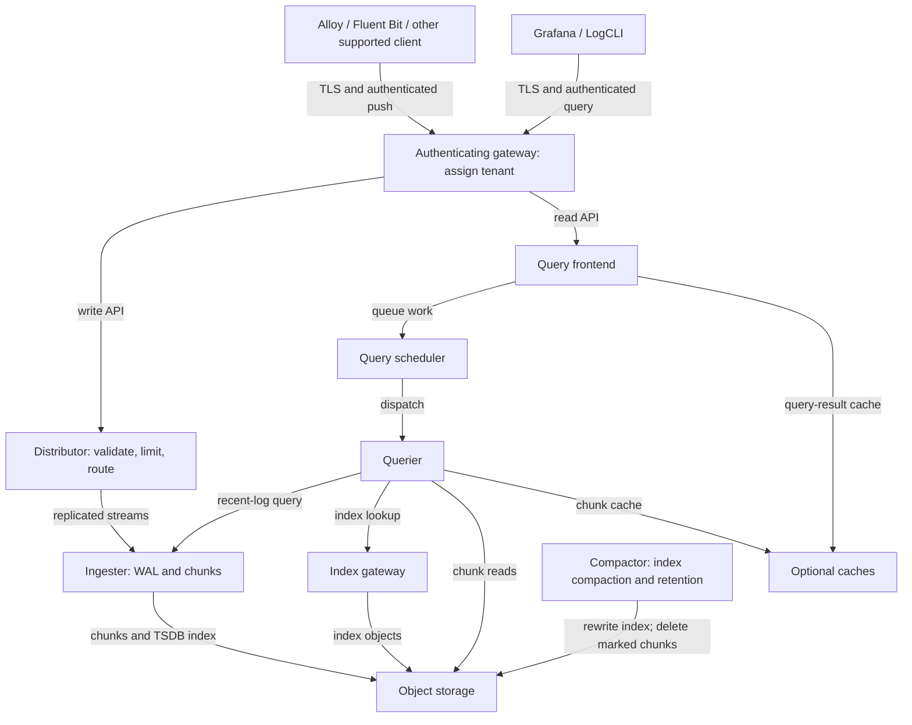

# Grafana Loki

> **Última actualización**: September 13, 2026
> **Línea base del ejemplo**: Loki 3.7.7 / community Helm chart 18.12.1. Configuración, renderizado y verificaciones de LogQL locales; sin despliegue en EKS, acceso a S3, prueba de carga ni prueba de HA/failover.

Loki almacena logs como fragmentos comprimidos e indexa etiquetas de streams. Esto puede reducir la sobrecarga del índice, pero no establece una ventaja universal de costo o velocidad de consulta frente a Elasticsearch/OpenSearch. Compare la ingesta, retención, selectividad de consultas, solicitudes de objetos, cómputo, cachés y requisitos operativos con una carga de trabajo representativa.

## Descripción general

| Capacidad | Significado y límite |
|---|---|
| Índice de etiquetas | Selecciona streams antes de examinar su contenido de logs. Analizar JSON y examinar fragmentos sigue requiriendo trabajo. |
| Almacenamiento de objetos | El almacenamiento de producción puede usar S3 y otros backends compatibles. El almacenamiento en sistema de archivos local resulta útil para experimentos pequeños, pero no es un almacén de objetos distribuido compartido. |
| LogQL | Admite pipelines de logs y métricas derivadas de logs. No es intercambiable con PromQL ni SQL. |
| Multi-tenancy | Los ID de tenant separan datos y límites. Un proxy de autenticación debe decidir a qué tenant puede acceder un solicitante. |
| Escalado y replicación | Dependen del modo de despliegue, ring, quórum, almacenamiento y dominios de fallo. Las réplicas y WAL por sí solos no garantizan una entrega sin pérdidas. |

Elasticsearch/OpenSearch tiene un modelo diferente de indexación y búsqueda. Loki puede buscar texto de logs, pero normalmente primero restringe el rango de etiquetas/tiempo y examina los fragmentos coincidentes. Evite afirmaciones fijas como “10× más barato”, “siempre más rápido” o clasificaciones de memoria sin una comparación reproducible.

## Arquitectura

El diagrama muestra un despliegue convencional de TSDB/fragmentos, no todos los componentes opcionales o experimentales de Loki. Las flechas de consulta apuntan hacia el servicio solicitado; las respuestas regresan por la misma ruta.



| Componente | Responsabilidades |
|---|---|
| Distributor | Valida streams, aplica límites de ingesta por tenant/stream y enruta las escrituras a través del ring. Los límites de tasa de bytes no son una configuración de streams por segundo. |
| Ingester | Almacena streams en búfer, escribe un WAL cuando está habilitado, crea/vacía fragmentos y sirve datos recientes. El almacenamiento persistente de WAL reduce un riesgo de fallo; no sustituye la replicación, los backups ni la planificación de reintentos del cliente. |
| Querier | Lee datos recientes de ingesters y datos históricos mediante las rutas de índice/almacén de objetos; después evalúa LogQL y combina los resultados. |
| Query frontend / scheduler | Divide y encola el trabajo de consulta; permite el almacenamiento opcional en caché de resultados y reintentos controlados. La clave de configuración de runtime es `frontend`; la clave de workload de Helm es `queryFrontend`. |
| Index gateway | Sirve búsquedas de índice en un despliegue distribuido. Es distinto del almacén de fragmentos. |
| Compactor | Compacta **archivos de índice** y, cuando está habilitado, elimina referencias de índice caducadas y borra de manera asíncrona los fragmentos marcados. No es un fusionador general de pequeños fragmentos de logs. |

## Modos de despliegue

| Modo | Guía de selección |
|---|---|
| Monolítico, `-target=all` | Conveniente para instalaciones y experimentos pequeños. Chart 18.12.1 denomina al modo `Monolithic`; sus valores de workload permanecen bajo `singleBinary`. El valor predeterminado del chart no demuestra idoneidad para producción. |
| Simple Scalable (SSD) | Grupos históricos de lectura/escritura/backend. SSD está en desuso y se ha programado su eliminación en Loki 4.0. Planifique una migración explícita en lugar de seleccionarlo como valor predeterminado para nuevas instalaciones EKS de producción. |
| Microservices, chart `Distributed` | Separa distributors, ingesters, queriers, frontend, scheduler, index gateway y compactor. La guía actual de Helm recomienda este modo para escalabilidad/HA de producción, con mayor complejidad operativa. |

Las antiguas categorías `<100GB`, `100GB–10TB` y `>10TB` no eran capacidades medidas. Dimensione según bytes/segundo máximos, streams activos, concurrencia de consultas, retención, utilización de fragmentos y recuperación ante fallos. No convierta una guía aproximada de dimensionamiento en una garantía.

## Instalación de Helm

### Requisitos previos y propiedad

Lo siguiente es un **punto de partida de configuración para una instalación nueva**, no una plataforma de producción completa:

- Chart 18.12.1 declara Kubernetes `>=1.25.0-0`; la verificación de manifiestos usó Kubernetes 1.36.2. Esto no es una prueba de todas las versiones o plataformas de Kubernetes/EKS.
- Aprovisione buckets privados, un rol de IAM con alcance limitado, un proveedor OIDC de EKS para IRSA y una StorageClass `gp3` existente adecuada. Ese nombre de clase es una suposición, no una garantía integrada de EKS. El provisioner de EBS CSI/Auto Mode, el OS del nodo, la capacidad de AZ, el enlace de PVC y las cuotas deben coincidir con el clúster real.
- Prepare `loki-gateway-auth` con una clave `.htpasswd` y `loki-gateway-tls` con `tls.crt`/`tls.key`. Use un certificado de confianza para los nombres DNS reales del gateway. Proporcione los secretos mediante su flujo de trabajo de gestión de secretos; no haga commit de contraseñas ni claves privadas en archivos de valores.
- El gateway asigna el nombre de usuario autenticado a `X-Scope-OrgID`, anulando un encabezado de tenant proporcionado por el solicitante. Restrinja el acceso directo a los puertos de componentes de Loki con límites de network policy/seguridad y RBAC de namespace. Un encabezado de tenant por sí solo no es autenticación; omitir el gateway omite su autorización.
- El gateway usa HTTPS y un Service ClusterIP, con ingress deshabilitado. El tráfico interno de componentes de Loki aún necesita los controles de transporte/red adecuados para el entorno. Aquí no se aprovisiona ningún ALB, endpoint público ni network policy completa.

### Valores distribuidos versionados

Guarde como `values-eks.yaml`. Reemplace de manera coherente los nombres de cuenta, rol y bucket de ejemplo. La fecha de inicio del esquema corresponde a un almacén **nuevo**; conserve todas las entradas de esquema existentes durante las actualizaciones.

```yaml
deploymentMode: Distributed
loki:
  image:
    tag: 3.7.7
  auth_enabled: true
  analytics:
    reporting_enabled: false
  commonConfig:
    replication_factor: 3
  schemaConfig:
    configs:
    - from: '2026-09-01'
      store: tsdb
      object_store: s3
      schema: v13
      index:
        prefix: loki_index_
        period: 24h
  storage:
    type: s3
    bucketNames:
      chunks: example-loki-chunks-123456789012
      ruler: example-loki-ruler-123456789012
    s3:
      region: ap-northeast-2
  ingester:
    chunk_encoding: snappy
    wal:
      enabled: true
      dir: /var/loki/wal
  compactor:
    working_directory: /var/loki/compactor
    retention_enabled: true
    delete_request_store: s3
    retention_delete_delay: 2h
  limits_config:
    retention_period: 744h
    allow_structured_metadata: true
    ingestion_rate_strategy: global
    ingestion_rate_mb: 10
    ingestion_burst_size_mb: 20
    per_stream_rate_limit: 5MB
    per_stream_rate_limit_burst: 15MB
  runtimeConfig:
    overrides:
      development:
        retention_period: 168h
serviceAccount:
  create: true
  name: loki
  annotations:
    eks.amazonaws.com/role-arn: arn:aws:iam::123456789012:role/loki-s3
singleBinary:
  replicas: 0
read:
  replicas: 0
write:
  replicas: 0
backend:
  replicas: 0
ingester:
  replicas: 3
  zoneAwareReplication:
    enabled: false
  persistence:
    enabled: true
    claims:
    - name: data
      accessModes:
      - ReadWriteOnce
      size: 50Gi
      storageClass: gp3
distributor:
  replicas: 2
querier:
  replicas: 2
queryFrontend:
  replicas: 2
queryScheduler:
  replicas: 2
indexGateway:
  replicas: 2
compactor:
  replicas: 1
  persistence:
    enabled: true
    claims:
    - name: data
      accessModes:
      - ReadWriteOnce
      size: 20Gi
      storageClass: gp3
ruler:
  enabled: false
gateway:
  enabled: true
  replicas: 2
  service:
    type: ClusterIP
    port: 443
  ingress:
    enabled: false
  basicAuth:
    enabled: true
    existingSecret: loki-gateway-auth
  nginxConfig:
    locationSnippet: proxy_set_header X-Scope-OrgID $remote_user;
    ssl: true
    serverSnippet: |-
      ssl_certificate /etc/nginx/tls/tls.crt;
      ssl_certificate_key /etc/nginx/tls/tls.key;
      ssl_protocols TLSv1.2 TLSv1.3;
      if ($tenant_api_allowed = 0) { return 403; }
    httpSnippet: |-
      map $uri $tenant_api_allowed {
        default 0;
        / 1;
        /loki/api/v1/push 1;
        /otlp/v1/logs 1;
        /loki/api/v1/query 1;
        /loki/api/v1/query_range 1;
        /loki/api/v1/labels 1;
        ~^/loki/api/v1/label/[^/]+/values$ 1;
        /loki/api/v1/series 1;
        /loki/api/v1/tail 1;
        /loki/api/v1/index/stats 1;
        /loki/api/v1/index/volume 1;
        /loki/api/v1/index/volume_range 1;
      }
  containerPort: 8443
  metrics:
    enabled: false
  extraVolumes:
  - name: gateway-tls
    secret:
      secretName: loki-gateway-tls
  extraVolumeMounts:
  - name: gateway-tls
    mountPath: /etc/nginx/tls
    readOnly: true
  readinessProbe:
    httpGet:
      path: /
      port: http
      scheme: HTTPS
    initialDelaySeconds: 15
    timeoutSeconds: 1
chunksCache:
  enabled: false
resultsCache:
  enabled: false
sidecar:
  rules:
    enabled: false
lokiCanary:
  enabled: false
test:
  enabled: false
```

El gateway de tenant expone solamente las API de datos enumeradas y la preparación no sensible `/`. Las credenciales válidas de tenant aún reciben 403 para las rutas de administración `/ingester/shutdown`, `/flush`, `/config`, ring/memberlist/status, eliminación y ruler. Use acceso interno/port-forward autorizado por separado para administración. Revise cualquier API de cliente adicional antes de ampliar la allowlist y mantenga bloqueado el acceso directo al backend.


Los campos `loki.*` configuran la aplicación; los campos de componente de nivel superior `ingester`, `querier`, `compactor` y otros configuran workloads de Kubernetes. El ejemplo usa deliberadamente un compactor y tres ingesters. Deshabilita la replicación con reconocimiento de zona, por lo que **no hace ninguna afirmación de resiliencia de AZ**. Agregue requests/limits adecuados, anti-affinity/topology spread, PDB y capacidad probada antes de producción; no copie la antigua tabla fija de dimensionamiento de CPU/memoria.

Ruler está deshabilitado aquí. El bucket opcional de ruler se muestra para una configuración de reglas posterior; no es un bucket administrativo requerido por Loki de código abierto. El bucket empresarial `admin` no es necesario para este ejemplo. Las cachés y los workloads sintéticos de canary/prueba están deshabilitados para mantener claro el alcance del ejemplo; planifíquelos y habilítelos por separado con capacidad y autenticación adecuadas.

```bash
helm repo add grafana-community https://grafana-community.github.io/helm-charts
helm repo update grafana-community

# Review the rendered resources before installing.
helm template loki grafana-community/loki \
  --version 18.12.1 --namespace loki \
  --values values-eks.yaml > loki-rendered.yaml

# Creates/updates resources; run only against the intended cluster.
helm upgrade --install loki grafana-community/loki \
  --version 18.12.1 --namespace loki --create-namespace \
  --values values-eks.yaml

kubectl get pods,services,pvc -n loki
```

Para una release existente, revise primero las notas de actualización de chart/Loki intermedias, los cambios de valores, la compatibilidad de esquema y los límites de rollback. Reemplazar los valores de un chart antiguo con este archivo no es un procedimiento de migración in situ.

## Backend de S3 e identidad de workload

### IAM y ServiceAccount

Este ejemplo usa IRSA. EKS Pod Identity es otra opción cuando la plataforma de nodos, el agente y la cadena de credenciales del AWS SDK de la aplicación la admiten; IRSA no es la única elección segura. No inserte claves de acceso de S3 en el YAML de Loki ni herede permisos amplios del rol de nodo.

Una política ilustrativa para la misma cuenta y los buckets nombrados es:

```json
{
  "Version": "2012-10-17",
  "Statement": [
    {
      "Effect": "Allow",
      "Action": [
        "s3:ListBucket",
        "s3:GetBucketLocation"
      ],
      "Resource": [
        "arn:aws:s3:::example-loki-chunks-123456789012",
        "arn:aws:s3:::example-loki-ruler-123456789012"
      ],
      "Condition": {
        "StringEquals": {
          "aws:ResourceAccount": "123456789012"
        }
      }
    },
    {
      "Effect": "Allow",
      "Action": [
        "s3:GetObject",
        "s3:PutObject",
        "s3:DeleteObject"
      ],
      "Resource": [
        "arn:aws:s3:::example-loki-chunks-123456789012/*",
        "arn:aws:s3:::example-loki-ruler-123456789012/*"
      ],
      "Condition": {
        "StringEquals": {
          "aws:ResourceAccount": "123456789012"
        }
      }
    }
  ]
}
```

El compactor necesita eliminación de objetos para la retención. Los roles de componentes separados pueden restringir aún más los privilegios. Con SSE-KMS, agregue los permisos específicos de KMS y la política de clave necesarios para la configuración de cifrado seleccionada; `s3:*` o un rol de confianza amplia no son sustitutos.

Un rol de IRSA debe confiar en el proveedor OIDC exacto del clúster, con `aud=sts.amazonaws.com` y `sub=system:serviceaccount:loki:loki`. Después de crear/revisar esa política con alcance limitado y asociar el proveedor OIDC, un administrador puede crear **solamente el rol**:

```bash
eksctl create iamserviceaccount \
  --cluster="$CLUSTER_NAME" --region="$AWS_REGION" \
  --namespace=loki --name=loki \
  --role-only --role-name=loki-s3 \
  --attach-policy-arn="$LOKI_S3_POLICY_ARN" \
  --approve
```

Establezca explícitamente esas variables para la cuenta/clúster previstos. Helm posee el ServiceAccount mediante `serviceAccount.create: true`; no cree también el mismo ServiceAccount con eksctl. Si un sistema externo es su propietario, use `create: false` y asegúrese de que coincidan su nombre, anotación y confianza del rol.

### Ejemplo de bucket privado

Este fragmento de Terraform es un ejemplo de recurso, no una aplicación probada ni un módulo raíz completo. Use su configuración revisada del proveedor de AWS y nombres globalmente únicos. Ambos buckets reciben cifrado y Block Public Access.

```hcl
variable "loki_buckets" {
  type = map(string)
  default = {
    chunks = "example-loki-chunks-123456789012"
    ruler  = "example-loki-ruler-123456789012"
  }
}

resource "aws_s3_bucket" "loki" {
  for_each      = var.loki_buckets
  bucket        = each.value
  force_destroy = false
}

resource "aws_s3_bucket_public_access_block" "loki" {
  for_each                = aws_s3_bucket.loki
  bucket                  = each.value.id
  block_public_acls       = true
  block_public_policy     = true
  ignore_public_acls      = true
  restrict_public_buckets = true
}

resource "aws_s3_bucket_server_side_encryption_configuration" "loki" {
  for_each = aws_s3_bucket.loki
  bucket   = each.value.id
  rule {
    apply_server_side_encryption_by_default {
      sse_algorithm = "AES256"
    }
  }
}

resource "aws_s3_bucket_versioning" "loki" {
  for_each = aws_s3_bucket.loki
  bucket   = each.value.id
  versioning_configuration {
    status = "Disabled"
  }
}
```

Un bucket nuevo no tiene versionado salvo que se configure de otro modo. El proveedor de AWS para Terraform acepta `status = "Disabled"` al crear/importar un bucket sin versionado, como en este ejemplo. No puede cambiar un bucket que ya está `Enabled` o `Suspended` de vuelta a `Disabled`; use la transición admitida apropiada y conserve el estado existente. Si se habilita el versionado, la eliminación de objetos puede dejar versiones anteriores: planifique la limpieza de versiones no actuales y las retenciones legales por separado de la retención de consultas de Loki.

No transfiera fragmentos activos de Loki a clases Glacier que requieran restauración. Las consultas requieren lecturas inmediatas de objetos; restaurar objetos archivados no es parte de la ruta normal de lectura de Loki. No haga caducar todo el bucket con una regla de antigüedad sin alcance: los archivos de índice, el estado del clúster y los datos de delete-request/ruler tienen ciclos de vida distintos. Si utiliza una red de seguridad de ciclo de vida, limítela a prefijos de fragmentos confirmados y establezca la expiración más allá de la retención **más el retraso de eliminación**. La retención del compactor suele ser el mecanismo principal de eliminación.

El chart genera la configuración de runtime S3/TSDB. No agregue `tsdb_shipper.shared_store`, `boltdb_shipper.shared_store`, `compactor.shared_store` ni `storage_config.aws.sse_encryption` heredados; Loki 3.7.7 rechaza esos campos. Use la referencia de configuración de almacenamiento/cifrado fijada.

## LogQL

### Selectores, filtros y analizadores

Cada selector necesita un matcher que no pueda coincidir con un valor vacío. Los matchers negativos por sí solos pueden seleccionar etiquetas ausentes; incluya un matcher positivo no vacío. Estas son consultas independientes, no un programa de varias instrucciones.

```logql
{namespace="production"}

{namespace="production", app=~"nginx|apache"}

{namespace=~".+", namespace!="kube-system"}

{app=~".+", app!~"test.*"}
```

Los filtros de línea distinguen mayúsculas y minúsculas; los filtros de línea de expresión regular pueden coincidir con una subcadena. Coloque los filtros selectivos al principio cuando hacerlo preserve el significado previsto. Excluir texto de health-check de una consulta es diferente de eliminar esos logs en la ingesta.

```logql
{app="nginx"} |= "error"

{app="nginx"} != "healthcheck"

{app="nginx"} |~ "status=[45][0-9]{2}"

{app="nginx"} !~ "GET /health"

{app="nginx"} |= "error" != "timeout"

{namespace="production"} |= "OOMKilled" or "CrashLoopBackOff"
```

La última consulta busca texto recopilado; los motivos/eventos de Kubernetes no aparecen automáticamente en los logs de aplicación. Recopile la fuente de evento/runtime adecuada antes de depender de ello.

```logql
{app="api"} | json

{app="api"} | json level, message, request_id

{app="api"} | logfmt

{app="nginx"} | regexp `(?P<ip>[\d.]+) - - \[(?P<timestamp>[^\]]+)\]`

{app="nginx"} | pattern `<ip> - - [<_>] "<method> <path> <_>" <status> <size>`

{app="packed"} | unpack
```

`json` admite extracción con nombre; la forma corta `json level, message` continúa siendo válida en 3.7.7. `unpack` requiere líneas producidas por una etapa pack compatible, no JSON arbitrario. Los analizadores pattern y regexp deben coincidir con el formato real del log; ninguno ofrece una garantía universal de velocidad.

```logql
{app="api"} | json | level="error" | __error__=""

{app="api"} | json | response_time > 1000 | __error__=""

{app="api"} | json | level="error" and request_id!="" | __error__=""

{app="nginx"} | pattern `<ip> - - <_>` | ip != ip("10.0.0.1")

{app="api"} | json | line_format "{{.level}}: {{.message}}"

{app="api"} | json | line_format `{{ if eq .level "error" }}ERROR: {{ end }}{{.message}}`

{app="api"} | json | line_format `{{ .timestamp | toDate "2006-01-02T15:04:05Z07:00" | date "15:04:05" }}`
```

Los ejemplos numéricos de `response_time` suponen milisegundos; no aplique ese umbral a segundos ni a un campo con otro nombre. El análisis/conversión de tipos puede adjuntar `__error__`. Filtrar errores explícitamente descarta esos registros del cálculo; supervise por separado los registros rechazados/malformados.

### Métricas derivadas de logs

```logql
rate({app="nginx"}[5m])

(sum(rate({app="api"} | json | __error__="" | level="error" [5m])) or vector(0))
/
sum(rate({app="api"} | json | __error__="" [5m]))

quantile_over_time(0.99,
  {app="api"} | json | unwrap response_time | __error__="" [5m]
) by (endpoint)

topk(10, sum by (error_type) (
  count_over_time({app="api"} | json | __error__="" | level="error" [1h])
))

avg_over_time(
  {app="nginx"} | pattern `<_> - - [<_>] "<_> <path> <_>" <_> <size>`
  | unwrap size | __error__="" [5m]
) by (path)

sum by (app) (count_over_time({namespace="production"} |= "error" [1h]))

absent_over_time({app="critical-service"}[5m])
```

La proporción de errores es la fracción de **líneas de logs analizadas correctamente** con `level="error"`, no automáticamente una tasa de errores de solicitudes HTTP. La alternativa cero del numerador maneja la ausencia de líneas de error coincidentes cuando existen logs válidos. La ausencia de tráfico/telemetría sigue siendo una condición separada de ausencia de datos o no finita, no una prueba de salud. Para un SLI HTTP, defina un evento de acceso por solicitud, códigos de estado válidos, muestreo y cobertura de recopilación.

Aplique el filtro `__error__=""` **después de** `unwrap` para excluir los errores de conversión numérica. `absent_over_time` detecta ausencia en los datos seleccionados; no distingue una aplicación silenciosa de un collector fallido. LogQL también admite agregación de vectores como `count(...)`; eso es distinto de usar una expresión de stream de logs como vector de métrica.

```logql
{app="api"} | json | response_time > 5000 | __error__="" | line_format `{{.method}} {{.path}}: {{.response_time}}ms`

{app="api"} | json | request_id="example-request" | __error__=""

{app="nginx"} | pattern `<_> - - [<_>] "<method> <path> <_>" <status> <_>`
| status >= 500 and status < 600 | __error__=""

sum by (hour) (
  count_over_time({app="api"} |= "error" | label_format hour=`{{ __timestamp__ | date "15" }}` [24h])
)

sum(count_over_time({app="api"} |= "error" [5m])) > 100
```

La agrupación por hora del día usa la marca de tiempo de la entrada y puede combinar días distintos; elija un rango horario/zona horaria deliberados y use los pasos de consulta por rango de Grafana para un gráfico cronológico. La expresión final es un umbral ilustrativo de conteo. No detecta un despliegue ni prueba un pico estadísticamente significativo. `increase(count_over_time(...))` no es un reemplazo válido en LogQL.

## Diseño de etiquetas y collectors

Mantenga etiquetas indexadas, acotadas y útiles como cluster, namespace, service/app y environment. Incluso nombres de etiquetas conocidos no tienen inherentemente baja cardinalidad: mida las combinaciones y la rotación reales. Los ID de solicitud, ID de usuario, marcas de tiempo, UID/nombres de Pod e IP de cliente suelen ser malas etiquetas de índice; conserve los valores necesarios en contenido de logs o metadatos estructurados según su política de privacidad/acceso.

| Ejemplo | Implicación de stream |
|---|---|
| 2 namespaces y 3 apps, pero cada app existe en solo un namespace | 3 combinaciones observadas, no automáticamente 6 |
| Cada app aparece en ambos namespaces | Hasta 6 combinaciones antes de otras etiquetas |
| Un ID de solicitud único añadido al conjunto de etiquetas | Potencialmente un nuevo stream por solicitud |

El producto de las cardinalidades por etiqueta es un **límite superior** cuando pueden ocurrir todas las combinaciones, no un conteo exacto de streams. El conteo de streams, la tasa de ingesta, el tamaño de fragmento, la selectividad de consultas, las cachés y la latencia de almacenamiento influyen en el uso de recursos. Los antiguos `<100,000 streams/cluster`, `<10,000/tenant` y `<1,000 values/label` no eran límites universales.

Promtail llegó al final de su vida útil el **2 de marzo de 2026**; use un cliente mantenido como Alloy y revise la guía de migración. `lambda-promtail` tiene un ciclo de vida independiente. Una configuración de scrape migrada también necesita discovery, RBAC, rutas/encuadre CRI, posiciones, reintentos y autenticación de salida funcionales; las reglas de relabel por sí solas no son un collector.

Para un pipeline de Alloy existente, el siguiente **fragmento de procesamiento** extrae campos antes de usarlos como etiquetas/metadatos estructurados. Supone que `loki.write.default` ya existe y que un componente upstream reenvía JSON de aplicación sin procesar a `loki.process.app.receiver`. No es una configuración completa ni un analizador CRI.

```alloy
loki.process "app" {
  forward_to = [loki.write.default.receiver]

  stage.json {
    expressions = {
      level      = "level",
      request_id = "request_id",
    }
  }

  stage.labels {
    values = { level = "level" }
  }

  stage.structured_metadata {
    values = { request_id = "request_id" }
  }
}
```

El `level` indexado debe tener un conjunto controlado de valores; los datos proporcionados por la aplicación no son una identidad de tenant o cluster confiable. Los metadatos estructurados requieren un esquema compatible (v13 en este ejemplo) y `allow_structured_metadata`. No son una función de enmascaramiento de datos sensibles. Las referencias a secretos del collector y los permisos de archivos deben configurarse por separado.

## Ajuste de rendimiento

Estos son **fragmentos de runtime de Loki**, no réplicas/recursos de workload de Helm. Con este chart, colóquelos bajo `loki.structuredConfig`, o use los valores documentados correspondientes de `loki.ingester`, `loki.frontend`, `loki.querier` y `loki.limits_config`. Renderice y valide la configuración final combinada.

```yaml
ingester:
  chunk_idle_period: 30m
  chunk_block_size: 262144
  chunk_target_size: 1572864
  chunk_retain_period: 1m
  max_chunk_age: 2h
  concurrent_flushes: 32
  wal:
    enabled: true
    dir: /var/loki/wal
    flush_on_shutdown: true
    replay_memory_ceiling: 512MB
querier:
  max_concurrent: 4
frontend:
  max_outstanding_per_tenant: 2048
  compress_responses: true
  log_queries_longer_than: 5s
query_scheduler:
  max_outstanding_requests_per_tenant: 2048
limits_config:
  query_timeout: 5m
  max_query_length: 744h
  max_query_lookback: 744h
  max_query_parallelism: 32
  tsdb_max_query_parallelism: 32
  split_queries_by_interval: 15m
  max_global_streams_per_user: 5000
```

- Los límites de ingesta pertenecen a `limits_config`; la tasa global del tenant se distribuye entre los distributors saludables, mientras que el comportamiento de burst y por stream es distinto. Inspeccione el motivo 429 devuelto y las métricas de muestras/bytes descartados antes de aumentar los límites.
- `chunk_idle_period` controla el vaciado después de que no lleguen datos nuevos para un stream. Los fragmentos más pequeños pueden aumentar las solicitudes de objetos, el trabajo de índice y la sobrecarga de almacenamiento. Un límite de memoria puede provocar terminación por OOM; no impide una demanda excesiva de memoria.
- La reproducción de WAL necesita almacenamiento persistente y memoria adecuados. `replay_memory_ceiling` no es un límite del RSS total del proceso. La reducción planificada de ingesters necesita terminación/vaciado elegantes y disponibilidad de datos verificada; un HPA solo de CPU no es suficiente.
- El tiempo de espera de consultas, la división, el paralelismo de TSDB y la concurrencia interactúan con fan-out y la carga de almacenamiento. Más solicitudes en cola o réplicas pueden empeorar un backend sobrecargado.
- Las cachés de resultado/fragmento de este chart usan Memcached de forma predeterminada. Un comentario que nombra un host Redis no configura una caché Redis externa. Dimensione/pruebe la caché por separado y mantenga privados sus puertos.

## Retención

La retención no se habilita simplemente al establecer una duración. El ejemplo usa TSDB v13 con un período de índice de 24h, habilita el procesamiento de retención del compactor y proporciona `delete_request_store`. El estado de marcador del compactor debe sobrevivir a reinicios; este ejemplo usa un PVC. La eliminación real ocurre de manera asíncrona después de las actualizaciones de índice y el retraso de eliminación.

`744h` es una política ilustrativa de 31 días, **no el valor predeterminado de Loki**. Con la retención deshabilitada o un período de retención cero, los logs no se retienen automáticamente solo 31 días. Los requisitos de backup/versionado/retención legal son independientes.

Combine esta superposición opcional de Helm solo después de elegir la política:

```yaml
loki:
  limits_config:
    retention_period: 744h
    retention_stream:
    - selector: '{namespace="development"}'
      priority: 1
      period: 72h
  runtimeConfig:
    overrides:
      production:
        retention_period: 2160h
        retention_stream:
        - selector: '{namespace="production",level="error"}'
          priority: 2
          period: 2160h
        - selector: '{app="audit-log"}'
          priority: 1
          period: 8760h
      development:
        retention_period: 168h
```

`loki.runtimeConfig` renderiza el archivo de anulación de runtime y su montaje; un archivo `runtime-config.yaml` suelto no se carga automáticamente. Con la asignación de nombre de usuario a tenant del gateway, un nombre de usuario como `development` selecciona la anulación correspondiente.

Las reglas de stream del tenant prevalecen sobre las reglas globales de stream; entre las reglas coincidentes de la lista pertinente, gana la prioridad mayor y las prioridades iguales seleccionan el período más corto. Después se aplican las alternativas de duración de tenant/global. Los selectores coinciden con **etiquetas de stream indexadas**, no con campos JSON analizados ni metadatos estructurados. Por ejemplo, la política `level="error"` anterior necesita que `level` esté indexado durante la ingesta. Los cambios de retención no restauran logs ya eliminados; planifique los cambios según la release fijada y pruebe la ventana de eliminación.

## Solución de problemas y monitorización

| Síntoma | Comprobaciones antes de cambiar límites |
|---|---|
| Límite de consultas pendientes | Fan-out de consulta, colas de scheduler, concurrencia de querier, almacenamiento de objetos lento y rangos costosos. Aumentar la profundidad de cola puede simplemente retrasar el fallo. |
| Ingesta 429 | Distinga la tasa/burst de bytes de tenant, la tasa por stream y los límites de streams activos. Los clientes necesitan reintentos/backoff acotados y una política de pérdida de entrega. |
| Rechazo por límite de streams | Inspeccione las combinaciones y la rotación reales de etiquetas; use la configuración correcta de límite de stream local/global para el despliegue. No considere 10,000 como un valor predeterminado universal. |
| OOM de Ingester | Streams activos, fragmentos, reproducción de WAL, tamaños de caché/búfer y límites de nodo/contenedor. Evite claves YAML `ingester:` duplicadas o mezclar recursos de Helm en YAML de runtime. |
| Errores de S3 | Identidad de workload efectiva, bucket/región, restricciones de cuenta/recurso, política de KMS, DNS/endpoints y disponibilidad de objetos. No los “solucione” con buckets públicos ni claves de acceso estáticas. |
| “Ingester is shutting down” en escrituras | Compruebe el estado real del ciclo de vida **y la presión de disco de WAL**: 3.7.7 puede devolver el mismo error cuando el umbral de disco lleno de WAL (valor predeterminado 0.9) limita las escrituras. Recupere capacidad; no deshabilite ciegamente la protección. |
| Sin ID de organización / tenant inesperado | Autenticación del gateway, sobrescritura de encabezado y omisión directa del backend. `auth_enabled: true` requiere un ID de tenant; no valida una contraseña. |

Use una conexión LogCLI configurada de forma segura o un gateway HTTPS autenticado. Por ejemplo, mantenga las credenciales en un archivo netrc protegido y use su CA de confianza en lugar de poner una contraseña en un comando o deshabilitar la verificación de certificados:

```bash
curl --fail --silent --show-error \
  --netrc-file "$LOKI_NETRC_FILE" --cacert "$LOKI_CA_FILE" \
  --get "$LOKI_GATEWAY_URL/loki/api/v1/query_range" \
  --data-urlencode 'query={app="nginx"}' \
  --data-urlencode 'since=1h' \
  --data-urlencode 'limit=100' | jq '.data.stats'

curl --fail --silent --show-error \
  --netrc-file "$LOKI_NETRC_FILE" --cacert "$LOKI_CA_FILE" \
  --get "$LOKI_GATEWAY_URL/loki/api/v1/series" \
  --data-urlencode 'match[]={namespace="production"}' \
  --data-urlencode 'since=1h' | jq '.data | length'
```

Establezca la URL en el gateway HTTPS previsto, restrinja los permisos del archivo de credenciales y limite la ventana de consulta. `start` espera una marca de tiempo absoluta compatible; use `since=1h` para un rango relativo. Un conteo de API de series son las series coincidentes en el intervalo solicitado, no necesariamente el conteo actual de streams activos en memoria.

Para diagnósticos administrativos, seleccione el Pod real y use un port-forward local:

```bash
kubectl get pods -n loki -l app.kubernetes.io/instance=loki
kubectl port-forward -n loki pod/REPLACE_WITH_ACTUAL_POD 13100:3100

# In a second terminal; local administrative connection.
curl --fail http://127.0.0.1:13100/ready
curl --fail http://127.0.0.1:13100/metrics
```

La preparación no prueba la salud de almacenamiento/consulta de extremo a extremo. Los endpoints de ring dependen del componente seleccionado. Trate la salida de `/config` como información operativa confidencial. **`POST /flush` activa el vaciado; no es un endpoint de estado**, por lo que se omite de los comandos de diagnóstico.

Estas son expresiones de Prometheus contra **métricas de Loki recopiladas**, no LogQL ni un dashboard de Grafana completo e importable:

```promql
sum(rate(loki_distributor_bytes_received_total[5m]))

sum(loki_ingester_memory_streams)

histogram_quantile(0.99,
  sum by (le) (rate(loki_request_duration_seconds_bucket{route=~"loki_api_v1_query.*"}[5m]))
)
```

Los bytes de Distributor describen los datos que llegan a los distributors; por sí solos no prueban una ingesta duradera. Sumar streams de ingester también cuenta las réplicas. Confirme las etiquetas de ruta reales antes de usar el selector de latencia y distinga la ausencia de muestras de la latencia cero.

## Validación y referencias

La auditoría usó el binario oficial de Loki 3.7.7 y chart 18.12.1, verificados frente a resúmenes SHA de release, para comprobaciones locales de configuración/Helm/LogQL. Estas comprobaciones no establecen permisos de EKS, validez de secretos TLS, garantías de entrega, ejecución de retención de S3, capacidad de producción ni failover de AZ. El fragmento de Alloy y el ejemplo de recurso Terraform requieren validación de integración en sus configuraciones completas.

- [Valores versionados de community chart](https://raw.githubusercontent.com/grafana-community/helm-charts/loki-18.12.1/charts/loki/values.yaml)
- [Instalación de Helm y recomendaciones de despliegue](https://grafana.com/docs/loki/latest/setup/install/helm/)
- [Modos de despliegue](https://grafana.com/docs/loki/latest/get-started/deployment-modes/) y [guía de actualización](https://grafana.com/docs/loki/latest/setup/upgrade/)
- [Componentes](https://grafana.com/docs/loki/latest/get-started/components/) y [referencia de configuración](https://grafana.com/docs/loki/latest/configure/)
- [Autenticación](https://grafana.com/docs/loki/latest/operations/authentication/) y [aislamiento de tenant](https://grafana.com/docs/loki/latest/operations/multi-tenancy/)
- [Consultas de logs](https://grafana.com/docs/loki/latest/query/log_queries/), [consultas de métricas](https://grafana.com/docs/loki/latest/query/metric_queries/) y [API HTTP](https://grafana.com/docs/loki/latest/reference/loki-http-api/)
- [Cardinalidad](https://grafana.com/docs/loki/latest/get-started/labels/cardinality/) y [metadatos estructurados](https://grafana.com/docs/loki/latest/get-started/labels/structured-metadata/)
- [Retención y ciclo de vida del almacén de objetos](https://grafana.com/docs/loki/latest/operations/storage/retention/)
- [Ciclo de vida de Promtail](https://grafana.com/docs/loki/latest/send-data/promtail/) y [migración de Alloy](https://grafana.com/docs/alloy/latest/set-up/migrate/from-promtail/)
- [IRSA](https://docs.aws.amazon.com/eks/latest/userguide/iam-roles-for-service-accounts.html) y [EKS Pod Identity](https://docs.aws.amazon.com/eks/latest/userguide/pod-identities.html)

## Cuestionario

Ponga a prueba las distinciones anteriores con el [cuestionario de Loki](../../quizzes/observability/logging/01-loki-quiz.md).
