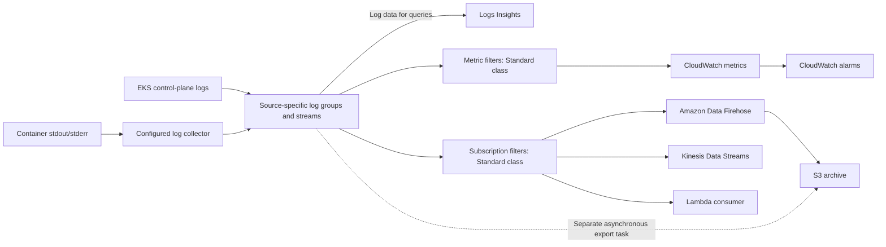

# CloudWatch Logs

> **Última actualización**: September 13, 2026
> **Ejemplos comprobados**: proveedor AWS 6.64.0; Helm chart opcional de CloudWatch Observability 6.6.0; AWS for Fluent Bit manual 3.4.15/Fluent Bit 5.0.9. Solo se realizaron comprobaciones de configuración local, SDK y carga útil sintética. No se ejecutaron recursos AWS, entrega de logs, consultas de Insights ni alarmas.

Amazon CloudWatch Logs gestiona la ingesta, el almacenamiento y el análisis de logs. Aun así, debe configurar los productores, la identidad, las redes, la retención, las cuotas y los consumidores posteriores. Los logs del control plane de EKS, los logs de cargas de trabajo y los logs de componentes administrados de EKS Auto Mode son rutas de recopilación independientes.

## Tabla de contenido

1. [Descripción general](#overview)
2. [Logging del control plane de EKS](#eks-control-plane-logging)
3. [Container Insights](#container-insights)
4. [Integración con FluentBit](#fluentbit-integration)
5. [CloudWatch Logs Insights](#cloudwatch-logs-insights)
6. [Filtros de suscripción](#subscription-filters)
7. [Optimización de costos](#cost-optimization)

<span id="overview"></span>

## Descripción general

<span id="cloudwatch-logs-features"></span>

### Características y clases de logs

| Área | Qué comprobar |
|---|---|
| Servicio administrado | No hay un clúster de búsqueda que operar, pero los colectores y las integraciones de entrega aún necesitan un responsable |
| Capacidad | Se aplican cuotas de tamaño de evento, API, suscripción y destino; la ingesta no es ilimitada |
| Seguridad | IAM, cifrado, protección de datos y conectividad privada tienen configuraciones independientes |
| Oportunidad | La entrega y las alertas son asíncronas; deben considerarse los reintentos y las entregas duplicadas o ausentes |
| Clase Standard | Admite los filtros de métricas y las suscripciones utilizados en este capítulo |
| Infrequent Access | Precio de ingesta menor y un conjunto de características diferente; sin filtros de suscripción, filtros de métricas ni EMF |
| Clase Delivery | Una opción separada para logs de Lambda entregados a S3/Firehose; retención fija de dos días en CloudWatch y sin consultas de Logs Insights |

La clase de un grupo de logs no se puede cambiar después de su creación. Actualmente, Infrequent Access admite características como la exportación a S3, Logs Insights y la protección de datos, por lo que las afirmaciones generales antiguas de que no admite ninguna de ellas son incorrectas. Consulte la tabla de características actual antes de cambiar el diseño de recopilación.

<span id="terminology"></span>

### Conceptos clave



Los filtros de suscripción **no** aceptan como destino el ARN de un bucket S3. La entrega continua a S3 mediante Firehose y una tarea de exportación asíncrona a S3 son rutas diferentes. Los lotes de CloudWatch Logs tampoco se pueden entregar a través del destino OpenSearch de Firehose; use en su lugar la integración documentada de CloudWatch a OpenSearch. Los registros de aplicaciones enviados directamente a Firehose tienen un contrato de entrada diferente.

| Término | Significado |
|---|---|
| Grupo de logs | Límite común de retención, acceso y configuración; por ejemplo, `/aws/eks/example-eks/cluster` |
| Stream de logs | Una secuencia de eventos de log dentro de un grupo |
| Evento de log | Marca de tiempo y mensaje, sujetos a los límites del servicio |
| Retención | Un período de retención discreto admitido o sin vencimiento si no se establece la retención |

<span id="eks-control-plane-logging"></span>

## Logging del control plane de EKS

### Tipos de logs

Los cinco tipos son `api`, `audit`, `authenticator`, `controllerManager` y `scheduler`. Cubren, respectivamente, diagnósticos del API server, eventos de auditoría, autenticación IAM, diagnósticos del controller manager y programación. Los logs de nodos worker y de aplicaciones son independientes.

El logging del control plane está deshabilitado de forma predeterminada. Seleccione los tipos según sus requisitos de diagnóstico, seguridad y retención; la API no exige las elecciones «requeridas» de la tabla anterior. La entrega normalmente tarda minutos y se realiza bajo el mejor esfuerzo. Habilitar el logging no recupera logs históricos que ya se rotaron.

<span id="enable-via-aws-cli"></span>

### Habilitar y observar la actualización

Para un clúster existente, guarde lo siguiente como `control-plane-logging.json`:

```json
{
  "clusterLogging": [
    {
      "types": [
        "api",
        "audit",
        "authenticator",
        "controllerManager",
        "scheduler"
      ],
      "enabled": true
    }
  ]
}
```

```bash
DOCS_CLUSTER=example-eks
DOCS_REGION=ap-northeast-2

aws eks describe-cluster --name "$DOCS_CLUSTER" --region "$DOCS_REGION" \
  --query 'cluster.{version:version,logging:logging}'

UPDATE_ID=$(aws eks update-cluster-config \
  --name "$DOCS_CLUSTER" --region "$DOCS_REGION" \
  --logging file://control-plane-logging.json --query update.id --output text)

aws eks describe-update --name "$DOCS_CLUSTER" --region "$DOCS_REGION" \
  --update-id "$UPDATE_ID" --query 'update.{status:status,errors:errors}'
```

La actualización debe alcanzar `Successful`; la aceptación de la solicitud por sí sola no es suficiente. Las actualizaciones de logging pueden requerir hasta cinco direcciones IP libres por subred del clúster. Para deshabilitar un tipo, revise explícitamente ese cambio en lugar de copiar un segundo ejemplo que desactive silenciosamente logs existentes.

<span id="configure-with-terraform"></span>

### Propiedad de Terraform y retención

Para clústeres administrados por Terraform, cambie `enabled_cluster_log_types` en la **configuración propietaria del recurso de clúster existente**. No cree otro recurso `aws_eks_cluster` solo para habilitar logs, ni copie el ejemplo obsoleto de creación para Kubernetes 1.29.

El siguiente archivo separado administra los grupos de logs y la política del colector manual:

```hcl
terraform {
  required_providers {
    aws = {
      source  = "hashicorp/aws"
      version = "6.64.0"
    }
  }
}

variable "region" {
  type    = string
  default = "ap-northeast-2"
}

variable "account_id" {
  type = string
  validation {
    condition     = can(regex("^[0-9]{12}$", var.account_id))
    error_message = "Use the owning account ID."
  }
}

variable "cluster_name" {
  type    = string
  default = "example-eks"
}

provider "aws" {
  region = var.region
}

resource "aws_cloudwatch_log_group" "application" {
  name              = "/aws/containerinsights/${var.cluster_name}/application"
  log_group_class   = "STANDARD"
  retention_in_days = 30

  lifecycle {
    prevent_destroy = true
  }
}

resource "aws_cloudwatch_log_group" "control_plane" {
  name              = "/aws/eks/${var.cluster_name}/cluster"
  log_group_class   = "STANDARD"
  retention_in_days = 30

  lifecycle {
    prevent_destroy = true
  }
}

resource "aws_iam_policy" "collector" {
  name_prefix = "fluent-bit-cloudwatch-"
  policy = jsonencode({
    Version = "2012-10-17"
    Statement = [{
      Effect   = "Allow"
      Action   = ["logs:CreateLogStream", "logs:PutLogEvents"]
      Resource = "${aws_cloudwatch_log_group.application.arn}:*"
    }]
  })
}

output "collector_policy_arn" {
  value = aws_iam_policy.collector.arn
}
```

Si ya existe un grupo, reutilice su propietario o impórtelo al estado previsto antes de aplicar. Por ejemplo, el grupo del control plane usa el ID de importación `/aws/eks/example-eks/cluster`. No declare el mismo grupo otra vez como un grupo de «audit»: los cinco tipos del control plane comparten este grupo y su retención.

Los valores de 30 días son ejemplos, no requisitos legales. `prevent_destroy` bloquea la destrucción mediante Terraform, pero no evita reducciones de retención ni eliminaciones fuera de Terraform. CloudWatch cifra los datos de log almacenados; una clave KMS administrada por el cliente requiere su propia política de claves y planificación operativa.

### Estructura del grupo de logs

```text
/aws/eks/example-eks/cluster
  kube-apiserver-...          API server
  kube-apiserver-audit-...    Audit
  authenticator-...          IAM authentication
  kube-controller-manager-... Controller manager
  kube-scheduler-...         Scheduler
```

Los sufijos de los streams rotan. El ejemplo `/aws/eks/cluster/logs` de la figura antigua no era la convención de nombres real del grupo del control plane.

## Container Insights

<span id="container-insights-overview"></span>
<span id="installation-methods"></span>
<span id="cloudwatch-agent-fluentbit-recommended"></span>
<span id="install-via-helm-chart"></span>
<span id="irsa-setup"></span>

### Opciones de instalación

Use el **add-on de Amazon CloudWatch Observability para EKS** actual o su Helm chart **amazon-cloudwatch-observability**. El anterior chart de exportador ADOT y una URL de inicio rápido sin sustituir no son instalaciones equivalentes.

Para un add-on, descubra las versiones compatibles con el clúster real, inspeccione el esquema de configuración seleccionado y configure la asociación IAM documentada. Una versión de chart no es una cadena de versión de add-on de EKS.

```bash
K8S_VERSION=$(aws eks describe-cluster --name "$DOCS_CLUSTER" \
  --region "$DOCS_REGION" --query cluster.version --output text)
aws eks describe-addon-versions \
  --addon-name amazon-cloudwatch-observability \
  --kubernetes-version "$K8S_VERSION" --region "$DOCS_REGION"
```

El ejemplo opcional de Helm utiliza el siguiente `cloudwatch-values.yaml`. Selecciona la ruta tradicional de Container Insights y los logs de contenedores; Application Signals y el pipeline independiente OTel Container Insights se deshabilitan aquí.

```yaml
clusterName: example-eks
region: ap-northeast-2
containerInsights:
  enabled: true
containerLogs:
  enabled: true
applicationSignals:
  enabled: false
otelContainerInsights:
  enabled: false
  logs:
    enabled: false
```

```bash
helm repo add aws-observability https://aws-observability.github.io/helm-charts
helm repo update aws-observability
helm upgrade --install cloudwatch-observability \
  aws-observability/amazon-cloudwatch-observability \
  --version 6.6.0 --namespace amazon-cloudwatch --create-namespace \
  --values cloudwatch-values.yaml
```

Establezca los permisos IAM **antes de la instalación**. En este chart, los DaemonSet de Fluent Bit usan la ServiceAccount `cloudwatch-agent`; su nombre y namespace deben coincidir con la asociación seleccionada de Pod Identity. Siga los requisitos oficiales de asociación y confianza de roles. Un rol IRSA para una ServiceAccount con un nombre diferente no autorizará a un Pod `fluent-bit` creado manualmente. No instale este chart sobre un add-on administrado por EKS ni ejecute colectores duplicados sobre los mismos logs.

<span id="collected-logs"></span>

### Logs y plataformas recopilados

| Sufijo de grupo típico | Contenido y límites |
|---|---|
| `application` | stdout/stderr de contenedores en `/aws/containerinsights/CLUSTER/application` |
| `dataplane` | Fuentes configuradas de kubelet/runtime/VPC CNI/kube-proxy; los componentes reales varían según la plataforma |
| `host` | Archivos/journals de Linux o logs de eventos de Windows configurados; no todos los sistemas operativos tienen `/var/log/messages`, `/var/log/secure` o `/var/log/dmesg` |
| `performance` | Eventos de rendimiento, a menudo EMF; no intercambiables con mensajes de logs de aplicaciones |

El add-on/chart compatible tiene rutas para Linux y Windows, pero Application Signals no es compatible con EKS Windows. Fargate usa su enrutador de logs de plataforma, no este DaemonSet manual. Verifique Hybrid Nodes y Auto Mode por separado; no suponga que las rutas host tradicionales de EC2 existen en todas partes.

Los logs de Karpenter, EBS CSI, load-balancer-controller e IPAM administrados por AWS de EKS Auto Mode usan una configuración independiente de **entrega de logs suministrados**. Sus tipos de logs son `AUTO_MODE_COMPUTE_LOGS`, `AUTO_MODE_BLOCK_STORAGE_LOGS`, `AUTO_MODE_LOAD_BALANCING_LOGS` y `AUTO_MODE_IPAM_LOGS`. El flujo documentado `PutDeliverySource` → `PutDeliveryDestination` → `CreateDelivery` puede dirigirse a un grupo de logs, S3 o Firehose. Es distinto de `PutSubscriptionFilter` y de habilitar los cinco tipos de logs del control plane.

<span id="fluentbit-integration"></span>

## Integración con FluentBit

<span id="fluentbit-configmap"></span>
<span id="fluentbit-daemonset"></span>

### Colector manual de logs de aplicaciones

Este es un perfil alternativo **solo para logs de aplicaciones** para nodos EC2 Linux elegibles. No instala el pipeline completo de métricas de Container Insights ni promete la recopilación universal de host/dataplane.

Primero cree o reutilice el grupo de aplicaciones. La política del colector anterior permite la creación de streams y la escritura de eventos en ese grupo; deliberadamente no crea grupos ni modifica la retención. Por lo tanto, el perfil manual no necesita permisos `cloudwatch:PutMetricData`, `s3:PutObject` ni permisos generales `logs:*`.

Prepare un rol IRSA aprobado cuya confianza OIDC coincida con `system:serviceaccount:logging:fluent-bit-cloudwatch` y la audiencia `sts.amazonaws.com`, y adjunte la política generada. Un flujo de trabajo `eksctl --role-only` puede crear el rol mientras el manifiesto es propietario de la ServiceAccount. Sustituya el ARN del rol, el nombre del clúster y la Region de forma coherente.

```yaml
apiVersion: v1
kind: Namespace
metadata:
  name: logging
---
apiVersion: v1
kind: ServiceAccount
metadata:
  name: fluent-bit-cloudwatch
  namespace: logging
  annotations:
    eks.amazonaws.com/role-arn: arn:aws:iam::123456789012:role/FluentBitCloudWatchLogsRole
---
apiVersion: rbac.authorization.k8s.io/v1
kind: ClusterRole
metadata:
  name: fluent-bit-cloudwatch-metadata
rules:
- apiGroups:
  - ''
  resources:
  - namespaces
  - pods
  verbs:
  - get
  - list
  - watch
---
apiVersion: rbac.authorization.k8s.io/v1
kind: ClusterRoleBinding
metadata:
  name: fluent-bit-cloudwatch-metadata
roleRef:
  apiGroup: rbac.authorization.k8s.io
  kind: ClusterRole
  name: fluent-bit-cloudwatch-metadata
subjects:
- kind: ServiceAccount
  name: fluent-bit-cloudwatch
  namespace: logging
---
apiVersion: v1
kind: ConfigMap
metadata:
  name: fluent-bit-cloudwatch-config
  namespace: logging
data:
  fluent-bit.conf: |
    [SERVICE]
        Flush         5
        Grace         30
        Log_Level     info
        HTTP_Server   Off
        storage.path  /buffers/storage

    [INPUT]
        Name              tail
        Tag               application.*
        Path              /var/log/containers/*.log
        Exclude_Path      /var/log/containers/fluent-bit-cloudwatch-*_logging_fluent-bit-*.log
        multiline.parser  docker, cri
        DB                /buffers/tail.db
        Mem_Buf_Limit     50MB
        Skip_Long_Lines   On
        Read_from_Head    Off
        storage.type      filesystem

    [FILTER]
        Name                kubernetes
        Match               application.*
        Kube_Tag_Prefix     application.var.log.containers.
        Use_Kubelet         Off
        Merge_Log           On
        Merge_Log_Key       log_processed
        Keep_Log            On
        Labels              Off
        Annotations         Off
        K8S-Logging.Parser  Off
        K8S-Logging.Exclude Off

    [OUTPUT]
        Name                     cloudwatch_logs
        Match                    application.*
        region                   ap-northeast-2
        log_group_name           /aws/containerinsights/example-eks/application
        log_stream_prefix        ${HOST_NAME}-
        auto_create_group        false
        Retry_Limit              5
        storage.total_limit_size 1G
---
apiVersion: apps/v1
kind: DaemonSet
metadata:
  name: fluent-bit-cloudwatch
  namespace: logging
spec:
  selector:
    matchLabels:
      app: fluent-bit-cloudwatch
  template:
    metadata:
      labels:
        app: fluent-bit-cloudwatch
    spec:
      serviceAccountName: fluent-bit-cloudwatch
      nodeSelector:
        kubernetes.io/os: linux
      tolerations:
      - operator: Exists
        effect: NoSchedule
      containers:
      - name: fluent-bit
        image: public.ecr.aws/aws-observability/aws-for-fluent-bit:3.4.15@sha256:88e1b56cedb230486afeca6eeb26c5f6bd59c48879d0054d1674d5a58838c607
        args:
        - -c
        - /fluent-bit/custom/fluent-bit.conf
        securityContext:
          runAsUser: 0
          allowPrivilegeEscalation: false
          readOnlyRootFilesystem: true
          capabilities:
            drop:
            - ALL
          seccompProfile:
            type: RuntimeDefault
        resources:
          requests:
            cpu: 100m
            memory: 128Mi
          limits:
            memory: 512Mi
        volumeMounts:
        - name: logs
          mountPath: /var/log
          readOnly: true
        - name: buffers
          mountPath: /buffers
        - name: config
          mountPath: /fluent-bit/custom
          readOnly: true
        - name: tmp
          mountPath: /tmp
        command:
        - /fluent-bit/bin/fluent-bit
        env:
        - name: HOST_NAME
          valueFrom:
            fieldRef:
              fieldPath: spec.nodeName
      volumes:
      - name: logs
        hostPath:
          path: /var/log
          type: Directory
      - name: buffers
        hostPath:
          path: /var/lib/fluent-bit-cloudwatch
          type: DirectoryOrCreate
      - name: config
        configMap:
          name: fluent-bit-cloudwatch-config
      - name: tmp
        emptyDir: {}
      terminationGracePeriodSeconds: 45
```

El plugin nativo es `cloudwatch_logs`; el plugin Go antiguo se llama `cloudwatch`. El comando predeterminado de la imagen es un script de entrypoint, por lo que el manifiesto manual inicia explícitamente el binario nativo de Fluent Bit con su configuración.

La Tail DB y el búfer del sistema de archivos se pueden escribir y están separados del montaje de logs de solo lectura. Grace es de 30 segundos y el período de gracia de terminación del Pod es de 45 segundos, pero eso no garantiza que se entreguen todos los datos almacenados en búfer. La pérdida de nodos, los discos llenos, las líneas largas, los reintentos finitos y los offsets de reinicio aún pueden perder logs. `Read_from_Head Off` afecta a archivos no vistos previamente; los offsets persistentes aún importan.

El perfil usa la búsqueda de metadatos del API server en lugar del acceso al kubelet de host-network. Las anotaciones de aplicaciones no pueden cambiar el análisis ni excluir logs. No establezca el valor reservado `extra_user_agent: container-insights` en un colector personalizado para insinuar que es la instalación administrada.

### Contrato de registros y fuentes host

Un evento enriquecido ilustrativo enviado a CloudWatch es:

```json
{"log":"{\"level\":\"error\",\"message\":\"upstream request failed\",\"error_type\":\"upstream_timeout\",\"http\":{\"response_time_ms\":1250,\"status_code\":503}}","stream":"stderr","kubernetes":{"namespace_name":"production","pod_name":"api-example","container_name":"api"},"log_processed":{"level":"error","message":"upstream request failed","error_type":"upstream_timeout","http":{"response_time_ms":1250,"status_code":503}}}
```

Los campos de aplicación están bajo `log_processed`, mientras que los metadatos confiables de Kubernetes están bajo `kubernetes`. La cadena `log` sin procesar duplica datos de aplicaciones; elimine los campos prohibidos antes de la recopilación. Los ejemplos de consulta, suscripción y filtro de métricas siguientes usan esta envoltura JSON exacta y `level: error` en minúsculas.

Si necesita recopilación del journal de Linux, verifique si existen journals persistentes en `/var/log/journal` o journals volátiles en `/run/log/journal`. Configure una entrada `systemd`, filtros de unidad adecuados, montajes de solo lectura, una DB escribible independiente, un grupo de salida y permisos IAM. No monte a ciegas la ruta antigua de Docker `/var/lib/docker/containers` ni requiera archivos de texto inexistentes en nodos containerd/Bottlerocket/AL2023. Estas configuraciones host específicas de la plataforma no se implementan mediante el perfil manual.

## CloudWatch Logs Insights

Estos ejemplos usan **Logs Insights QL**, no SQL. Seleccione el grupo de logs previsto y un rango de tiempo acotado. La revisión local comprobó la sintaxis y los contratos publicados; no se llamó a ningún servicio de consultas administrado.

### Sintaxis básica de consulta

```text
fields @timestamp, @message
| filter @message like /(?i)error/
| sort @timestamp desc
| limit 100
```

La regex sin distinción entre mayúsculas y minúsculas usa `/(?i)error/`, no el sufijo JavaScript `/error/i`. La coincidencia de texto puede coincidir con palabras que no son un nivel de error estructurado de una aplicación.

Para la envoltura JSON del colector:

```text
fields jsonParse(@message) as record
| filter record.log_processed.level = "error"
| fields @timestamp, record.log_processed.message as message
| sort @timestamp desc
| limit 100
```

Para un campo de texto real que contiene `user_id=12345`:

```text
fields @timestamp, @message
| parse @message /user_id=(?<user_id>\d+)/
| filter user_id = "12345"
| limit 100
```

No dependa de un glob que suponga un orden y espaciado arbitrarios de claves JSON. `jsonParse` y los campos anidados explícitos aclaran la estructura de registro esperada.

### Ejemplos de consultas de logs de EKS

Los diagnósticos del API server excluyen el prefijo de stream de auditoría superpuesto:

```text
fields @timestamp, @logStream, @message
| filter @logStream like /^kube-apiserver-/
| filter @logStream not like /^kube-apiserver-audit-/
| filter @message like /(?i)error/
| sort @timestamp desc
| limit 50
```

Actividad de auditoría para un nombre de usuario específico de Kubernetes:

```text
fields jsonParse(@message) as audit
| filter @logStream like /^kube-apiserver-audit-/
| filter audit.user.username = "example-user"
| fields @timestamp, audit.verb as verb, audit.objectRef as objectRef
| sort @timestamp desc
| limit 100
```

Diagnósticos de Authenticator:

```text
fields @timestamp, @message
| filter @logStream like /^authenticator-/
| filter @message like /(?i)(AccessDenied|Forbidden|unauthorized)/
| sort @timestamp desc
| limit 100
```

Eventos de auditoría de creación/eliminación de Pod:

```text
fields jsonParse(@message) as audit
| filter @logStream like /^kube-apiserver-audit-/
| filter audit.verb in ["create", "delete"]
| filter audit.objectRef.resource = "pods"
| fields @timestamp, audit.verb as verb, audit.objectRef.name as pod
| sort @timestamp desc
| limit 100
```

Estas son búsquedas de diagnóstico, no una prueba de que la auditoría capture cada acción ni de que las coincidencias de texto establezcan la causa raíz.

### Consultas de logs de aplicaciones

Errores por namespace:

```text
fields jsonParse(@message) as record
| filter record.log_processed.level = "error"
| stats count(*) as error_count by record.kubernetes.namespace_name as namespace
| sort error_count desc
```

Respuestas lentas que usan el campo declarado numérico de milisegundos:

```text
fields jsonParse(@message) as record
| filter record.kubernetes.container_name = "api"
| filter record.log_processed.http.response_time_ms > 1000
| fields @timestamp, record.log_processed.http.response_time_ms as response_time_ms
| sort response_time_ms desc
| limit 100
```

Recuentos de eventos por hora:

```text
stats count(*) as log_count by bin(1h) as bucket
| sort bucket asc
```

Después de `stats`, ordene el alias de bucket definido; el `@timestamp` original por evento ya no es una salida de agrupación.

Principales categorías de error:

```text
fields jsonParse(@message) as record
| filter record.log_processed.level = "error"
| stats count(*) as error_count by record.log_processed.error_type as error_type
| sort error_count desc
| limit 10
```

Una categoría acotada suele ser más interpretable que agrupar por cada mensaje completo único. No convierta los ID de solicitud ni mensajes arbitrarios en dimensiones de métricas sin límite.

### Consultas avanzadas

```text
fields jsonParse(@message) as record
| filter ispresent(record.log_processed.http.response_time_ms)
| stats pct(record.log_processed.http.response_time_ms, 50) as p50_ms,
        pct(record.log_processed.http.response_time_ms, 90) as p90_ms,
        pct(record.log_processed.http.response_time_ms, 99) as p99_ms
  by bin(5m) as bucket
| sort bucket asc
```

El agregado QL es `pct`, no `percentile`. El productor debe emitir milisegundos numéricos; los ejemplos antiguos de nginx tenían recuentos de comodines no coincidentes y posiciones de campos inventadas.

```text
fields @timestamp, @message, @logStream
| filter @message like /Back-off restarting failed container/
| stats count(*) as backoff_log_events by @logStream
| sort backoff_log_events desc
```

Esto cuenta **eventos de log** coincidentes, no reinicios de contenedores. Un evento/mensaje de kubelet puede estar ausente, repetirse o agregarse. Use una métrica de reinicios de Kubernetes adecuada cuando necesite un recuento real de reinicios.

`SOURCE` se admite en consultas de CLI/API, no en el editor de consultas de la consola:

```text
SOURCE logGroups(accountIdentifier:['111122223333'], namePrefix:['/aws/containerinsights/prod-', '/aws/containerinsights/stage-'])
| fields @timestamp, @message, @logStream
| filter @message like /(?i)error/
| sort @timestamp desc
| limit 100
```

`accountIdentifier` está en singular. Las consultas entre cuentas requieren una configuración y permisos aprobados de cuenta de monitorización/origen; mencionar una segunda cuenta o grupo no crea ese acceso. Omitir la selección de cuenta/prefijo puede ampliar considerablemente una consulta.

<span id="subscription-filters"></span>

## Filtros de suscripción

Los filtros de suscripción reenvían de forma asíncrona nuevos eventos coincidentes. La entrega es al menos una vez; pueden producirse duplicados. Los fallos de destino reintentables pueden reintentarse hasta 24 horas; los errores no reintentables y los fallos sostenidos pueden perder entregas. Supervise las cuotas, `DeliveryErrors` y `DeliveryThrottling`. Las suscripciones no rellenan todos los logs históricos.

Los destinos directos Lambda, Kinesis y Firehose de estos ejemplos pertenecen a la misma cuenta que el grupo de logs. La entrega entre cuentas usa un destino lógico compatible y su política de destino; un ARN Lambda arbitrario entre cuentas no es un sustituto.

<span id="export-to-s3"></span>

### Archivar en S3 mediante Firehose

Este archivo opcional usa el grupo anterior, un bucket S3 privado existente y un rol de entrega Firehose aprobado:

```hcl
variable "firehose_delivery_role_arn" {
  type = string
}

variable "archive_bucket_arn" {
  type = string
}

resource "aws_cloudwatch_log_group" "firehose" {
  name              = "/aws/kinesisfirehose/cloudwatch-archive"
  retention_in_days = 30
}

resource "aws_cloudwatch_log_stream" "firehose" {
  name           = "S3Delivery"
  log_group_name = aws_cloudwatch_log_group.firehose.name
}

resource "aws_kinesis_firehose_delivery_stream" "archive" {
  name        = "cloudwatch-archive"
  destination = "extended_s3"

  extended_s3_configuration {
    role_arn            = var.firehose_delivery_role_arn
    bucket_arn          = var.archive_bucket_arn
    prefix              = "cloudwatch/year=!{timestamp:yyyy}/month=!{timestamp:MM}/day=!{timestamp:dd}/"
    error_output_prefix = "errors/!{firehose:error-output-type}/year=!{timestamp:yyyy}/"
    buffering_size      = 64
    buffering_interval  = 300
    compression_format  = "UNCOMPRESSED"

    cloudwatch_logging_options {
      enabled         = true
      log_group_name  = aws_cloudwatch_log_group.firehose.name
      log_stream_name = aws_cloudwatch_log_stream.firehose.name
    }
  }
}

resource "aws_iam_role" "logs_to_firehose" {
  name_prefix = "cloudwatch-to-firehose-"
  assume_role_policy = jsonencode({
    Version = "2012-10-17"
    Statement = [{
      Effect    = "Allow"
      Principal = { Service = "logs.amazonaws.com" }
      Action    = "sts:AssumeRole"
      Condition = {
        StringEquals = { "aws:SourceAccount" = var.account_id }
        ArnLike      = { "aws:SourceArn" = "arn:aws:logs:${var.region}:${var.account_id}:*" }
      }
    }]
  })
}

resource "aws_iam_role_policy" "logs_to_firehose" {
  role = aws_iam_role.logs_to_firehose.id
  policy = jsonencode({
    Version = "2012-10-17"
    Statement = [{
      Effect   = "Allow"
      Action   = ["firehose:PutRecord", "firehose:PutRecordBatch"]
      Resource = aws_kinesis_firehose_delivery_stream.archive.arn
    }]
  })
}

resource "aws_cloudwatch_log_subscription_filter" "archive" {
  name            = "application-archive"
  log_group_name  = aws_cloudwatch_log_group.application.name
  filter_pattern  = ""
  destination_arn = aws_kinesis_firehose_delivery_stream.archive.arn
  role_arn        = aws_iam_role.logs_to_firehose.arn

  depends_on = [aws_iam_role_policy.logs_to_firehose]
}
```

El rol de entrega necesita su confianza Firehose revisada, acceso al bucket/prefijo, permisos KMS opcionales y permisos de logs de destino. El rol de CloudWatch a Firehose es independiente, y el implementador necesita `iam:PassRole` con alcance definido. Evite suscribir logs de errores de entrega de vuelta a su propio pipeline.

Los registros de suscripción de CloudWatch ya están comprimidos con gzip. `UNCOMPRESSED` aquí deshabilita la **compresión adicional de Firehose**; no convierte la carga útil entrante en texto sin formato ni elimina la envoltura de CloudWatch. Los consumidores deben manejar el formato real de registro archivado.

Para una salida descomprimida, configure deliberadamente la característica documentada de descompresión de Firehose. La extracción opcional de mensajes elimina `owner`, `logGroup`, `logStream` y otros metadatos de envoltura. No mezcle entrada de logs suministrados con un stream configurado para descompresión de suscripciones CloudWatch, ni suponga que estos ajustes hacen válida la ruta no compatible CloudWatch→Firehose→OpenSearch.

### Procesar con Lambda

El ejemplo procesa la envoltura estructurada anterior, ignora los mensajes de control y envía un **resumen** de errores en lugar de texto de log sin procesar. Guárdelo como `log_processor.py`:

```python
import base64
import gzip
import hashlib
import io
import json
import os

import boto3

# Example processing limit, not an AWS service quota.
MAX_UNCOMPRESSED_BYTES = 8 * 1024 * 1024


def summarize(event):
    compressed = base64.b64decode(event["awslogs"]["data"], validate=True)
    with gzip.GzipFile(fileobj=io.BytesIO(compressed)) as stream:
        payload = stream.read(MAX_UNCOMPRESSED_BYTES + 1)
    if len(payload) > MAX_UNCOMPRESSED_BYTES:
        raise ValueError("Batch exceeds this example's processing limit")
    batch = json.loads(payload)
    if batch.get("messageType") == "CONTROL_MESSAGE":
        return None
    if batch.get("messageType") != "DATA_MESSAGE":
        raise ValueError("Unsupported subscription message type")

    errors = []
    unparsed = 0
    for item in batch["logEvents"]:
        try:
            record = json.loads(item["message"])
            application = record["log_processed"]
            if not isinstance(application, dict):
                raise ValueError("Expected an application object")
        except (ValueError, KeyError, TypeError):
            unparsed += 1
            continue
        if application.get("level") == "error":
            errors.append(item)
    if not errors:
        return None

    # Raw messages are intentionally excluded from the notification.
    event_keys = [
        hashlib.sha256(
            json.dumps([batch["owner"], batch["logGroup"], batch["logStream"], item["id"]],
                       ensure_ascii=True).encode("utf-8")
        ).hexdigest()
        for item in errors[:20]
    ]
    return {
        "errorCount": len(errors),
        "unparsedRecords": unparsed,
        "sampleEventKeys": event_keys,
    }


def lambda_handler(event, context):
    summary = summarize(event)
    if summary is None:
        return {"notified": False}
    topic_arn = os.environ["ALERT_TOPIC_ARN"]  # Non-secret destination identifier.
    message = json.dumps(summary, ensure_ascii=True)
    if len(message.encode("utf-8")) > 262144:
        raise ValueError("SNS message is too large")
    boto3.client("sns").publish(
        TopicArn=topic_arn,
        Subject="CloudWatch Logs error batch",
        Message=message,
    )
    return {"notified": True, "errorCount": summary["errorCount"]}
```

`ALERT_TOPIC_ARN` es un identificador de destino no secreto para un topic aprobado de la misma Region. El rol de ejecución Lambda necesita `sns:Publish` con alcance definido y sus propios permisos de logs, además de los permisos KMS aplicables. Su grupo de logging no debe alimentar recursivamente la misma suscripción.

El límite de procesamiento de 8MiB es un límite de ejemplo elegido, no una cuota de AWS. Las envolturas no válidas generan errores; los registros fuera del esquema de aplicación esperado no se tratan como errores estructurados. Supervise los fallos de análisis, configure la gestión de fallos y pruebe la reproducción antes de la implementación. Los mensajes SNS que no son SMS están limitados por **bytes UTF-8**, no por una regla de 1.000 caracteres; el asunto fijo también permanece por debajo del límite del asunto.

Las claves de evento ayudan a la investigación; **no son deduplicación persistente**. Las invocaciones repetidas pueden enviar notificaciones repetidas. Un consumidor de producción necesita decisiones explícitas de idempotencia y destino de fallos.

<span id="create-alerts-with-metric-filters"></span>

### Filtros de métricas y alarmas

El siguiente archivo opcional conecta un ARN de función Lambda sin calificar ya implementado y crea una métrica/alarma de recuento. Usa el mismo campo JSON que el colector y las consultas:

```hcl
variable "processor_function_arn" {
  type = string
}

variable "alerts_topic_arn" {
  type = string
}

resource "aws_lambda_permission" "cloudwatch" {
  statement_id   = "AllowOwnedCloudWatchLogGroup"
  action         = "lambda:InvokeFunction"
  function_name  = var.processor_function_arn
  principal      = "logs.${var.region}.amazonaws.com"
  source_arn     = "${aws_cloudwatch_log_group.application.arn}:*"
  source_account = var.account_id
}

resource "aws_cloudwatch_log_subscription_filter" "processor" {
  name            = "structured-errors"
  log_group_name  = aws_cloudwatch_log_group.application.name
  filter_pattern  = "{ $.log_processed.level = \"error\" }"
  destination_arn = var.processor_function_arn

  depends_on = [aws_lambda_permission.cloudwatch]
}

resource "aws_cloudwatch_log_metric_filter" "errors" {
  name           = "StructuredErrorCount"
  log_group_name = aws_cloudwatch_log_group.application.name
  pattern        = "{ $.log_processed.level = \"error\" }"

  metric_transformation {
    name          = "ErrorCount"
    namespace     = "Example/Logs"
    value         = "1"
    default_value = "0"
    unit          = "Count"
  }
}

resource "aws_cloudwatch_metric_alarm" "high_error_count" {
  alarm_name          = "ExampleHighErrorCount"
  comparison_operator = "GreaterThanThreshold"
  evaluation_periods  = 2
  datapoints_to_alarm = 2
  metric_name         = "ErrorCount"
  namespace           = "Example/Logs"
  period              = 300
  statistic           = "Sum"
  threshold           = 100
  treat_missing_data  = "missing"
  alarm_description   = "More than 100 matching error events in each of two 5-minute periods"
  alarm_actions       = [var.alerts_topic_arn]
}
```

El permiso precede a la suscripción Lambda y está restringido por el ARN del grupo de logs y la cuenta de origen. El destino de alarma SNS también necesita su política de topic adecuada. La implementación de la función, la política del rol de ejecución, las suscripciones al topic y la notificación de extremo a extremo son requisitos previos independientes.

La alarma es **un recuento de errores**, no una tasa de errores: más de 100 eventos coincidentes en cada uno de dos períodos de cinco minutos. `default_value = 0` se aplica cuando llegan logs pero ninguno coincide; la ausencia de logs entrantes aún puede significar datos ausentes. `treat_missing_data = "missing"` no trata el silencio como salud. Los filtros de métricas no rellenan eventos históricos, y los duplicados pueden afectar a los recuentos.

<span id="_3-archive-to-s3"></span>

### Tareas de exportación y ciclo de vida de S3

Para una exportación histórica acotada, use la API independiente de tareas de exportación S3 de CloudWatch y sus permisos de bucket/KMS. La disponibilidad de exportación puede retrasarse hasta 12 horas, no se garantiza el orden y el servicio no recomienda tareas de exportación periódicas para archivado continuo.

Las reglas de ciclo de vida de archivo pertenecen al propietario único de la configuración del bucket. Combine una regla revisada con alcance de prefijo en esa configuración en lugar de reemplazar reglas existentes con un segundo recurso Terraform. Considere el comportamiento de transición de objetos pequeños, las duraciones mínimas de almacenamiento, los costos de recuperación y Object Lock antes de seleccionar los niveles Standard-IA o Glacier.

<span id="cost-optimization"></span>

## Optimización de costos

### Estructura de costos

Compruebe los precios regionales/de clase/nivel actuales para ingesta, almacenamiento retenido, análisis de consultas, entrega suministrada, transformación y servicios posteriores. Firehose, S3, KMS, Lambda, métricas personalizadas y alarmas no son universalmente gratuitos. La tabla antigua no fundamentaba sus tarifas de Seúl ni una ruta de «Logs a S3» de costo cero.

Lo siguiente es **aritmética hipotética, no precios regionales actuales**:

| Suposición | Cálculo mensual |
|---|---|
| 100GB/día ingeridos durante 30 días a un supuesto de $0.50/GB | 3,000 × $0.50 = $1,500 |
| Retención de 30 días en estado estable, fracción almacenada supuesta de 0.5, $0.03/GB-mes | Promedio de 1,500GB × $0.03 = $45 |
| 200GB analizados diariamente durante 30 días a un supuesto de $0.005/GB | 6,000 × $0.005 = $30 |
| Subtotal solo bajo estos supuestos | **$1,575** |

No se trata de la rampa de almacenamiento del primer mes, un punto de referencia de compresión ni una factura completa. El total original de $1,576 mezclaba valores de consulta diarios y mensuales. Use bytes retenidos promedio medidos, volumen de análisis, tarifas actuales y todas las demás categorías de cargos.

<span id="cost-reduction-strategies"></span>
<span id="_1-log-filtering"></span>
<span id="_2-retention-period-optimization"></span>
<span id="_4-adjust-log-levels"></span>

### Filtrado, retención y niveles de logs

Filtre solo los registros que sus requisitos de diagnóstico y seguridad permitan descartar. La configuración clásica de Fluent Bit no es YAML. Con esta estructura de registro, un filtro de namespace usa un accessor de registro como `$kubernetes['namespace_name']`, no el campo plano inexistente `kubernetes_namespace_name`.

Evite filtros amplios de subcadenas que descarten errores útiles solo porque mencionan una ruta de health check. Prefiera campos explícitos como un tipo de evento revisado y verifique ejemplos que deban conservarse, así como los que deban descartarse.

Diferentes períodos de retención pueden ser apropiados para las necesidades de desarrollo, producción y auditoría, pero cambiar la retención puede eliminar datos. Todos los streams del control plane en un grupo comparten la política del grupo. Los niveles de logs de aplicaciones son un contrato de aplicación: poner `LOG_LEVEL: INFO` en un ConfigMap no hace nada a menos que la aplicación lo consuma e implemente. El aumento temporal de verbosidad necesita controles de acceso, una caducidad y un presupuesto de volumen.

### Monitorización de costos

Use métricas `AWS/Logs` como `IncomingBytes` e `IncomingLogEvents` con la dimensión `LogGroupName` y la estadística `Sum`. Describen la ingesta, no toda la factura. `@billedDuration` es un campo de Lambda, no una métrica de facturación de almacenamiento o ingesta de CloudWatch Logs.

```bash
aws logs describe-log-groups --region "$DOCS_REGION" \
  --log-group-name-prefix /aws/containerinsights/example-eks/ \
  --query 'logGroups[].{name:logGroupName,retention:retentionInDays,class:logGroupClass,storedBytes:storedBytes}'

# Example complete month; End is exclusive.
aws ce get-dimension-values --region us-east-1 \
  --time-period Start=2026-08-01,End=2026-09-01 \
  --dimension SERVICE --search-string CloudWatch
```

Use el valor de servicio de facturación devuelto en un filtro de Cost Explorer e incluya servicios relacionados al estimar el pipeline completo. `storedBytes` es un atributo de grupo de logs, no una métrica `AWS/Logs` garantizada con ese nombre. Consultar todos los logs para estimar su costo puede generar cargos de consulta.

## Validación y referencias

La auditoría comprobó la configuración local de Terraform/Helm, el esquema de Kubernetes, los tipos de carga útil del SDK, eventos Lambda sintéticos, ejemplos bilingües, respuestas de cuestionarios y el renderizado de Markdown. Estas comprobaciones no demuestran IAM en vivo, entrega del colector, ejecución QL administrada, archivos de Firehose, entrega de alarmas ni costos reales.

- [Logs del control plane de EKS](https://docs.aws.amazon.com/eks/latest/userguide/control-plane-logs.html)
- [Add-on CloudWatch Observability e instalación de Helm](https://docs.aws.amazon.com/AmazonCloudWatch/latest/monitoring/install-CloudWatch-Observability-EKS-addon.html)
- [Entrega de logs de componentes administrados de Auto Mode](https://docs.aws.amazon.com/eks/latest/userguide/auto-managed-component-logs.html)
- [Clases de logs](https://docs.aws.amazon.com/AmazonCloudWatch/latest/logs/CloudWatch_Logs_Log_Classes.html) y [cuotas](https://docs.aws.amazon.com/AmazonCloudWatch/latest/logs/cloudwatch_limits_cwl.html)
- [Salida nativa CloudWatch de Fluent Bit](https://raw.githubusercontent.com/fluent/fluent-bit-docs/master/pipeline/outputs/cloudwatch.md)
- [Filtro QL](https://docs.aws.amazon.com/AmazonCloudWatch/latest/logs/CWL_QuerySyntax-Filter.html), [stats](https://docs.aws.amazon.com/AmazonCloudWatch/latest/logs/CWL_QuerySyntax-Stats.html), [funciones](https://docs.aws.amazon.com/AmazonCloudWatch/latest/logs/CWL_QuerySyntax-operations-functions.html) y [SOURCE](https://docs.aws.amazon.com/AmazonCloudWatch/latest/logs/CWL_QuerySyntax-Source.html)
- [Ejemplos de suscripción](https://docs.aws.amazon.com/AmazonCloudWatch/latest/logs/SubscriptionFilters.html) y [API de destino](https://docs.aws.amazon.com/AmazonCloudWatchLogs/latest/APIReference/API_PutSubscriptionFilter.html)
- [Limitaciones de CloudWatch Logs a Firehose](https://docs.aws.amazon.com/firehose/latest/dev/writing-with-cloudwatch-logs.html), [descompresión](https://docs.aws.amazon.com/firehose/latest/dev/writing-with-cloudwatch-logs-decompression.html) y [extracción de mensajes](https://docs.aws.amazon.com/firehose/latest/dev/Message_extraction.html)
- [Filtros de métricas](https://docs.aws.amazon.com/AmazonCloudWatch/latest/logs/MonitoringLogData.html), [tareas de exportación S3](https://docs.aws.amazon.com/AmazonCloudWatch/latest/logs/S3Export.html) y [métricas de servicio de CloudWatch Logs](https://docs.aws.amazon.com/AmazonCloudWatch/latest/logs/CloudWatch-Logs-Monitoring-CloudWatch-Metrics.html)
- [API Publish de SNS](https://docs.aws.amazon.com/sns/latest/api/API_Publish.html) y [precios actuales de CloudWatch](https://aws.amazon.com/cloudwatch/pricing/)

## Cuestionario

Compruebe las distinciones con el [Cuestionario de CloudWatch Logs](../../quizzes/observability/logging/03-cloudwatch-logs-quiz.md).
