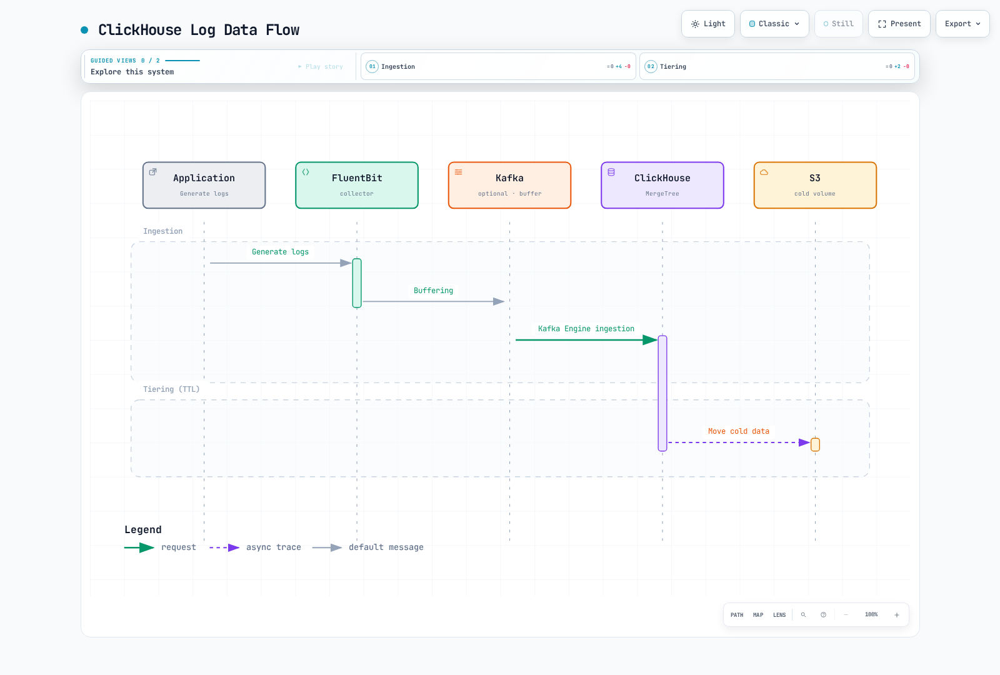

# ClickHouse

> **Última actualización**: September 13, 2026

ClickHouse es una base de datos analítica columnar. Es adecuada para cargas de trabajo de logs que requieren filtrado, agregación y joins con SQL, siempre que el esquema de ingestión, la retención y el modelo operativo se ajusten a la carga de trabajo.

## Tabla de contenidos

1. [Descripción general](#overview)
2. [Arquitectura](#architecture)
3. [Despliegue de Kubernetes](#kubernetes-deployment)
4. [Pipeline de ingestión de logs](#log-ingestion-pipeline)
5. [Consultas SQL](#sql-queries)
6. [Integración con Grafana](#grafana-integration)
7. [HyperDX](#hyperdx-clickhouse-native-viewer)
8. [Optimización del rendimiento](#performance-optimization)
9. [Archivado en S3](#s3-archiving-and-long-term-retention)

## Descripción general

### Características de ClickHouse

| Característica | Implicación práctica |
|---|---|
| Almacenamiento columnar | Lee las columnas seleccionadas en lugar de cada campo de cada registro |
| Compresión y codecs | Los valores repetidos y un ordenamiento adecuado pueden reducir el almacenamiento; mide tus propios datos |
| Analítica SQL | Usa funciones SQL, agregados y joins de ClickHouse; no es una implementación directa de todos los dialectos SQL |
| Sharding | Distribuye filas entre servidores; elige una clave que evite shards sobrecargados |
| Replicación | ReplicatedMergeTree coordina las réplicas mediante Keeper/ZooKeeper |
| Ingestión por lotes | Controla la frecuencia de inserción y la creación de parts en lugar de asumir una tasa fija de filas por segundo |

### Por qué elegir ClickHouse para la analítica de logs

Evalúa ClickHouse cuando los logs están estructurados y predominan las consultas analíticas repetidas. Realiza benchmarks con filtros representativos, búsquedas de texto, retención, lectores concurrentes y picos de ingestión. Una compresión superior a 10:1, el escaneo de miles de millones de filas en segundos y ciertos ahorros de coste son resultados dependientes de la carga de trabajo, no garantías de esta configuración.

Esta guía usa **ClickHouse 26.3.33.24 LTS**, **Altinity Operator 0.27.3**, **Vector 0.58.0** y **Grafana ClickHouse datasource 4.21.2** como líneas base explícitas de revisión. La publicación de una versión no demuestra que una versión arbitraria de Kubernetes/EKS, una clase de almacenamiento o una combinación sea compatible con producción. Valida tu clúster y la ruta de actualización por separado.

### Comparación con otras soluciones

| Sistema | Modelo de consulta y almacenamiento | Qué evaluar |
|---|---|---|
| ClickHouse | SQL sobre tablas columnares | Claves de ordenamiento, proyecciones/índices, agregación y comportamiento de insert/merge |
| OpenSearch / Elasticsearch | Búsqueda y analítica de documentos | Análisis de texto, mappings, costes de indexación y requisitos de búsqueda |
| Loki | LogQL sobre streams/chunks de logs indexados por etiquetas | Cardinalidad de etiquetas, escaneos de consultas, retención y modo operativo |

Evita clasificaciones universales de compresión, velocidad de consulta o complejidad operativa. Cada sistema tiene varios modos de despliegue y opciones de indexación/consulta. Compara los mismos datos, consultas, réplicas y retención.

## Arquitectura

### Arquitectura del clúster de ClickHouse


[Ver diagrama interactivo](https://www.atomai.click/kubernetes-docs/archmaps/en-observability-logging-04-clickhouse-0.html)

El diagrama resume una topología, no un plan de capacidad probado. Cada réplica de ClickHouse necesita su **propio volumen de datos**; el símbolo de EBS no significa que seis réplicas compartan un sistema de archivos EBS escribible. Keeper/ZooKeeper coordina la replicación y el DDL distribuido. Un iniciador de consultas de ClickHouse y el motor `Distributed` realizan consultas distribuidas; Keeper no es el router de consultas.

### Flujo de datos



[Ver diagrama interactivo](https://www.atomai.click/kubernetes-docs/archmaps/en-observability-logging-04-clickhouse-1.html)

Las flechas muestran el movimiento de datos. En la variante del motor Kafka, los consumidores de ClickHouse hacen polling de Kafka; la imagen no implica que Kafka envíe inserts ni garantice entrega exactly-once. Las table parts frías de S3 y los archivos Parquet independientes son mecanismos diferentes.

## Despliegue de Kubernetes

### Instalar ClickHouse Operator

Usa el chart oficial versionado en lugar de aplicar un bundle `master` cambiante:

```bash
helm upgrade --install clickhouse-operator \
  https://github.com/Altinity/clickhouse-operator/releases/download/release-0.27.3/altinity-clickhouse-operator-0.27.3.tgz \
  --namespace clickhouse-operator --create-namespace

kubectl -n clickhouse-operator get deployments,pods
kubectl get crd clickhouseinstallations.clickhouse.altinity.com \
  clickhousekeeperinstallations.clickhouse-keeper.altinity.com
```

Inspecciona el RBAC renderizado, los namespaces observados y el comportamiento de instalación/actualización de CRD antes de aplicar. La revisión local renderizó este chart y comprobó su checksum de la versión oficial; no instaló un operador ni validó la reconciliación con un clúster.

### Definición del clúster de ClickHouse

Lo siguiente es un **ejemplo de topología con dependencias existentes obligatorias**, no una instalación segura completa:

- Deben existir el namespace `clickhouse`, el ServiceAccount `clickhouse-server` y la StorageClass `gp3` adecuada respaldada por CSI. Los nombres de clases de almacenamiento son decisiones locales; EKS Auto Mode y EBS CSI convencional requieren el provisioner y la configuración de topología correspondientes.
- Una ClickHouseInstallationTemplate propiedad del sitio llamada `log-security` debe configurar archivos Secret montados, cuentas, TLS, probes y comunicación interna autenticada. Asegúrate de que sus settings/mounts también se apliquen al pod template `logs-server` a continuación.
- Un ClickHouseKeeperInstallation `logs-keeper` saludable ya debe proporcionar los endpoints TLS previstos y quorum.
- Proporciona un Service TLS interno llamado `logs-clickhouse` en el namespace `clickhouse`, que exponga HTTPS 8443. Su certificado debe coincidir con el nombre DNS del cliente. Confirma los selectors y endpoints generados realmente por el operador; un nombre de CHI por sí solo no crea este nombre de Service concreto.
- Asigna dominios de fallo, disruption budgets y recursos a partir de requisitos medidos. La disposición 3×2 y los límites por réplica de 100Gi/8Gi siguientes son ilustrativos, no una promesa de throughput o disponibilidad.

```yaml
apiVersion: clickhouse.altinity.com/v1
kind: ClickHouseInstallation
metadata:
  name: logs-demo
  namespace: clickhouse
spec:
  # Required site-owned template: users, TLS, probes and internal authentication.
  useTemplates:
    - name: log-security
  defaults:
    templates:
      podTemplate: logs-server
      dataVolumeClaimTemplate: logs-data
  configuration:
    zookeeper:
      keeper:
        name: logs-keeper
        serviceType: replicas
    clusters:
      - name: logscluster
        secure: "yes"
        insecure: "no"
        layout:
          shardsCount: 3
          replicasCount: 2
  templates:
    podTemplates:
      - name: logs-server
        spec:
          serviceAccountName: clickhouse-server
          containers:
            - name: clickhouse
              image: clickhouse/clickhouse-server:26.3.33.24
              resources:
                requests:
                  cpu: "2"
                  memory: 4Gi
                limits:
                  memory: 8Gi
    volumeClaimTemplates:
      - name: logs-data
        spec:
          accessModes: [ReadWriteOnce]
          storageClassName: gp3
          resources:
            requests:
              storage: 100Gi
```

Usa identidades separadas para `log_writer`, `log_reader` y administración. Monta los archivos de credenciales/configuración desde Secrets; no coloques contraseñas en ConfigMaps, código fuente, argumentos de comandos shell o volcados amplios de variables de entorno. Restringe las redes de cuentas y NetworkPolicies a las rutas reales de colector/consulta/réplica. No copies usuarios permisivos `::/0`, certificados de ejemplo vencidos ni omisiones de verificación de certificados.

La exposición del puerto TLS por sí sola es insuficiente: verifica la carga de certificados, las comprobaciones de hostname/CA, el tráfico de réplicas y los readiness probes. No apliques la topología hasta que la plantilla de seguridad, los volúmenes y las dependencias se hayan revisado conjuntamente. La validación local de CRD comprueba la forma, no la admisión, el scheduling, TLS ni el comportamiento del operador.

### Despliegue de ZooKeeper (o ClickHouse Keeper)

Para un despliegue nuevo, considera ClickHouse Keeper y el soporte de `ClickHouseKeeperInstallation` del operador. El operador fijado puede resolver una referencia CHK mediante `zookeeper.keeper.name`; los puertos seguros del Service de Keeper se detectan durante la reconciliación. Usa la [referencia de Keeper](https://github.com/Altinity/clickhouse-operator/blob/release-0.27.3/docs/keeper_reference.md) oficial y el [ejemplo de configuración TLS](https://github.com/Altinity/clickhouse-operator/blob/release-0.27.3/docs/chk-examples/30-secure-cluster.yaml) como referencias de configuración, revisando su imagen/settings de ejemplo antes de reutilizarlos.

Tres miembros votantes requieren una mayoría de dos. El estado persistente, la conectividad entre pares, los certificados y el scheduling entre dominios de fallo aún necesitan validación. No pases un nombre de Pod como `zookeeper-0` al `ZOO_MY_ID` numérico de una imagen de ZooKeeper.

```bash
kubectl -n clickhouse get chk logs-keeper
kubectl -n clickhouse get chi logs-demo
kubectl -n clickhouse get pods,pvc,services,endpointslices
kubectl -n clickhouse get events --sort-by=.metadata.creationTimestamp
```

## Pipeline de ingestión de logs

### Diseño de 3 niveles Buffer → Store → Distributed

Estas son responsabilidades de motores, no tres copias duraderas independientes. `MergeTree` almacena parts; `ReplicatedMergeTree` añade replicación; `Distributed` enruta lecturas/inserts entre shards. El motor opcional `Buffer` retiene datos en la memoria del proceso antes de reenviarlos a una tabla de destino.

Usa un destino coherente: `logs.application_logs` en cada shard y `logs.application_logs_distributed` para el acceso de todo el clúster. Crear dos veces la misma tabla Distributed con `IF NOT EXISTS` no redirige la tabla existente. Inspecciona `SHOW CREATE TABLE` y migra deliberadamente.

Prefiere primero el batching en el lado del colector. Los inserts asíncronos de ClickHouse son otra opción: cuando se habilitan, `wait_for_async_insert=1` espera a que se procese el insert en buffer; los modos de confirmación antes del flush debilitan la retroalimentación de entrega/error. Prueba conjuntamente el motor seleccionado, los settings de usuario y los reintentos. El ejemplo de Vector de abajo usa inserts síncronos por lotes y un perfil de escritor con reenvío Distributed en primer plano.

Solo para comparación, esta tabla Buffer opcional apunta a la misma tabla de almacenamiento local:

```sql
CREATE TABLE logs.application_logs_buffer ON CLUSTER logscluster
AS logs.application_logs
ENGINE = Buffer(
    logs, application_logs, 4,
    1, 10,
    1000, 10000,
    1000000, 10000000);
```

`Buffer` hace flush cuando se alcanzan **todos los umbrales mínimos** o **cualquier umbral máximo**. Los límites se aplican por capa de buffer. Cuatro capas × 10,000,000 bytes es un presupuesto aproximado de umbral, no un límite de memoria del proceso; los bloques fuente, copias, consultas y cachés añaden memoria. Un fallo puede perder filas sin flush, y los bloques reordenados pueden impedir la deduplicación de inserts replicados. No enrutes el pipeline predeterminado a través de este ejemplo ni lo describas como protección duradera de replay de Kafka.

### Esquema de tabla de logs

Ejecuta el DDL del clúster con una identidad administrativa después de verificar el nombre de clúster `logscluster`, Keeper y las macros `{shard}`/`{replica}`:

```sql
CREATE DATABASE IF NOT EXISTS logs ON CLUSTER logscluster;

CREATE TABLE IF NOT EXISTS logs.application_logs ON CLUSTER logscluster
(
    timestamp DateTime64(3, 'UTC') CODEC(Delta, ZSTD(1)),
    date Date MATERIALIZED toDate(timestamp),
    level LowCardinality(String),
    namespace LowCardinality(String),
    service LowCardinality(String),
    pod_name String,
    container_name LowCardinality(String),
    node_name LowCardinality(String),
    message String CODEC(ZSTD(1)),
    trace_id String,
    raw_json String CODEC(ZSTD(1)),
    response_time_ms Nullable(Float64)
        MATERIALIZED if(
            JSONType(raw_json, 'response_time_ms') IN ('Int64', 'UInt64', 'Double'),
            JSONExtract(raw_json, 'response_time_ms', 'Nullable(Float64)'),
            NULL)
)
ENGINE = ReplicatedMergeTree(
    '/clickhouse/logs-demo/tables/{shard}/application_logs', '{replica}')
PARTITION BY date
ORDER BY (namespace, service, timestamp)
TTL toDateTime(timestamp) + INTERVAL 90 DAY DELETE;

CREATE TABLE IF NOT EXISTS logs.application_logs_distributed ON CLUSTER logscluster
AS logs.application_logs
ENGINE = Distributed(
    'logscluster', 'logs', 'application_logs',
    cityHash64(namespace, service, pod_name));
```

El colector envía las diez columnas ordinarias; ClickHouse calcula `date` y `response_time_ms` nullable. Los tiempos de respuesta ausentes o no numéricos permanecen como `NULL`, por lo que los logs que no son de solicitudes no se cuentan como solicitudes de latencia cero. `raw_json` es JSON válido de la aplicación, separado de los metadatos confiables de Kubernetes. Aplica el enmascaramiento antes de la ingestión si la aplicación puede emitir secretos o datos personales.

Las particiones diarias son adecuadas para la gestión de retención de este ejemplo; no son óptimas universalmente. La ruta de Keeper es específica de esta instalación. Reutilizarla entre instalaciones no relacionadas puede mezclar identidades de replicación. `IF NOT EXISTS` no es una migración de esquema.

Para **cuentas gestionadas con SQL ya aprovisionadas mediante tu proceso de secretos**, configura grants/profiles en cada servidor participante. Los usuarios gestionados por archivos necesitan permisos equivalentes gestionados por archivos en lugar de asumir que `ALTER USER` puede modificarlos:

```sql
-- Users and credentials already exist through the site-owned secret configuration.
GRANT INSERT ON logs.application_logs TO log_writer;
GRANT INSERT ON logs.application_logs_distributed TO log_writer;
GRANT SELECT ON logs.application_logs TO log_reader;
GRANT SELECT ON logs.application_logs_distributed TO log_reader;

CREATE SETTINGS PROFILE logs_readonly
SETTINGS readonly = 1, max_execution_time = 60 CHANGEABLE_IN_READONLY;
ALTER USER log_reader SETTINGS PROFILE logs_readonly;

CREATE SETTINGS PROFILE logs_writer
SETTINGS distributed_foreground_insert = 1, async_insert = 0;
ALTER USER log_writer SETTINGS PROFILE logs_writer;
```

El insert Distributed en primer plano del escritor espera el reenvío al shard, pero no implica un quorum de réplicas elegido, deduplicación universal de reintentos ni protección frente a todos los fallos de almacenamiento. Revisa de forma independiente el quorum, la semántica de fallo/reintento y los permisos. Mantén al lector de Grafana en modo de solo lectura mientras permites su setting de timeout de consulta requerido.

### Ingestión mediante Vector

Este es el **archivo de configuración de Vector 0.58.0**. Un DaemonSet, ServiceAccount/RBAC, acceso de solo lectura a `/var/log/pods` y acceso de escritura a `/var/lib/vector` deben proporcionarse por separado. Establece `VECTOR_SELF_NODE_NAME`, que no es secreto, desde `spec.nodeName` del Pod mediante la Downward API. Esta fuente lee esa variable directamente; no se necesita interpolación global del entorno.

Monta una clave Secret `password` bajo `/etc/vector/clickhouse-auth`, y la CA de confianza en `/etc/vector/clickhouse-tls/ca.crt`. Vector 0.58 usa el backend explícito `SECRET[backend.key]` a continuación. No asumas que la interpolación anterior `${CLICKHOUSE_PASSWORD}` esté habilitada de forma predeterminada.

```yaml
data_dir: /var/lib/vector

secret:
  clickhouse_auth:
    type: directory
    path: /etc/vector/clickhouse-auth
    remove_trailing_whitespace: true

sources:
  kubernetes:
    type: kubernetes_logs
    auto_partial_merge: true

transforms:
  project:
    type: remap
    inputs: [kubernetes]
    source: |
      raw = string(.message) ?? ""
      parsed, err = parse_json(raw)
      app = if err == null && is_object(parsed) { object!(parsed) } else { {} }
      namespace = string(.kubernetes.pod_namespace) ?? "unknown"
      service = string(.kubernetes.pod_labels."app.kubernetes.io/name") ??
        string(.kubernetes.pod_labels.app) ?? "unknown"
      pod = string(.kubernetes.pod_name) ?? "unknown"
      container = string(.kubernetes.container_name) ?? "unknown"
      node = string(.kubernetes.pod_node_name) ?? "unknown"
      event_time = if is_timestamp(.timestamp) { timestamp!(.timestamp) } else {
        parse_timestamp(string(.timestamp) ?? "", format: "%+") ?? now()
      }
      . = {
        "timestamp": event_time,
        "level": downcase(string(app.level) ?? "unknown"),
        "namespace": namespace,
        "service": service,
        "pod_name": pod,
        "container_name": container,
        "node_name": node,
        "message": string(app.message) ?? raw,
        "trace_id": string(app.trace_id) ?? "",
        "raw_json": encode_json(app)
      }

sinks:
  clickhouse:
    type: clickhouse
    inputs: [project]
    endpoint: https://logs-clickhouse.clickhouse.svc.cluster.local:8443
    database: logs
    table: application_logs_distributed
    format: json_each_row
    date_time_best_effort: true
    skip_unknown_fields: false
    auth:
      strategy: basic
      user: log_writer
      password: "SECRET[clickhouse_auth.password]"
    tls:
      ca_file: /etc/vector/clickhouse-tls/ca.crt
      verify_certificate: true
      verify_hostname: true
    batch:
      max_events: 10000
      timeout_secs: 2
    buffer:
      type: disk
      max_size: 536870912
      when_full: block
    query_settings:
      async_insert_settings:
        enabled: false
```

La transformación proyecta un esquema fijo en lugar de fusionar JSON arbitrario de la aplicación en la raíz del evento. Un campo `kubernetes`/`namespace` proporcionado por la aplicación no puede sobrescribir los metadatos de Kubernetes. El JSON malformado sigue siendo legible en `message`; su objeto de aplicación parseado pasa a ser `{}`. El timestamp es el timestamp del evento del colector, no el momento declarado por una aplicación no confiable.

El buffer de disco de 512MiB requiere almacenamiento persistente escribible real y una política de capacidad. El backpressure no detiene indefinidamente la rotación de logs de kubelet. `kubernetes_logs` es una fuente de archivos de mejor esfuerzo, sin soporte de acknowledgement de extremo a extremo; no afirmes entrega exactly-once ni sin pérdidas garantizada porque un sink tenga un buffer de disco. Este modelo de recopilación de logs de host tampoco cubre los nodos EKS Fargate.

La revisión compiló esta configuración sin comprobaciones de entorno/salud y ejecutó diez casos VRL sintéticos. El acceso real a Kubernetes, los mounts de Secret, los handshakes TLS y la entrega a ClickHouse aún requieren validación del despliegue.

### Ingestión mediante FluentBit

La salida HTTP de Fluent Bit puede enviar JSON delimitado por nuevas líneas a la interfaz de insert HTTP de ClickHouse. Reutiliza un colector instalado correctamente con framing CRI/Docker, metadatos de Kubernetes, RBAC y una base/buffer tail escribible. El registro CRI exterior no es JSON de aplicación.

Antes de usar la salida HTTP, transforma cada registro al mismo contrato de diez columnas mostrado arriba y configura el parsing de entrada del timestamp de forma coherente. Un registro Kubernetes sin procesar con `kubernetes` anidado, claves arbitrarias de aplicación y el campo de timestamp incorrecto no es el esquema de tabla. No ocultes la discrepancia eliminando ciegamente columnas desconocidas.

Usa HTTPS con verificación de certificados y una credencial de escritor gestionada por separado. Renderiza un archivo de configuración protegido respaldado por Secret si la versión seleccionada de Fluent Bit requiere una cadena de contraseña en su configuración de salida HTTP; no publiques un encabezado Base64 estático `admin:password`. La ruta de Vector es el ejemplo completo de normalización aquí; esta sección no afirma que se haya probado una transformación/DaemonSet de Fluent Bit no proporcionada.

### Buffering mediante Kafka (entornos a gran escala)

Kafka puede absorber picos y proporcionar replay dentro de su retención configurada. Aprovisiona autenticación/TLS, replicación, acknowledgements y capacidad de disco para la ventana de indisponibilidad requerida; Kafka no evita automáticamente todas las pérdidas o duplicados.

El motor Kafka de ClickHouse consume un topic mediante un grupo de consumidores, y una vista materializada transfiere las filas parseadas a la **misma** tabla de almacenamiento. Mantén una asignación intencionada de grupo/partición entre los consumidores, evita insertar cada mensaje en cada shard y monitoriza el lag, los fallos de parser y los mensajes rechazados. Las credenciales pertenecen a la configuración gestionada del servidor, no a ejemplos SQL.

Las tablas de motor Kafka no admiten las columnas predeterminadas ordinarias usadas arriba. Define allí solo los campos entrantes y calcula valores predeterminados/materializados en el destino/vista. Los commits de offsets, el acknowledgement de insert downstream y el comportamiento de reintentos deben probarse conjuntamente. Evita un destino Buffer en memoria cuando se requiera reconocer procesamiento duradero; no habilites el almacenamiento experimental de offsets respaldado por Keeper como valor predeterminado de producción sin condiciones.

## Consultas SQL

### Consultas básicas

Los errores recientes usan un rango de timestamp relativo que sigue funcionando al cruzar medianoche:

```sql
SELECT timestamp, namespace, service, pod_name, message
FROM logs.application_logs_distributed
WHERE timestamp >= now() - INTERVAL 1 HOUR
  AND namespace = 'production' AND level = 'error'
ORDER BY timestamp DESC LIMIT 100;
```

Cuenta eventos de log y nombres de Pod distintos exactos:

```sql
SELECT toStartOfMinute(timestamp) AS minute, service,
       count() AS log_events, countIf(level = 'error') AS error_events,
       round(100.0 * error_events / nullIf(log_events, 0), 2) AS error_log_percent
FROM logs.application_logs_distributed
WHERE timestamp >= now() - INTERVAL 1 HOUR
  AND namespace = 'production'
GROUP BY minute, service ORDER BY minute, service;

SELECT namespace, service, uniqExact(pod_name) AS distinct_pods_with_logs
FROM logs.application_logs_distributed
WHERE timestamp >= now() - INTERVAL 1 HOUR
GROUP BY namespace, service ORDER BY distinct_pods_with_logs DESC;
```

`error_log_percent` es el porcentaje de **eventos de log** marcados como error. No es una proporción de fallos de solicitudes HTTP salvo que el contrato de logging garantice un registro relevante por solicitud. `uniqExact` es exacto; `uniq` es aproximado. Ambas consultas describen los logs observados, no el número de Pods que se ejecutan actualmente.

### Consultas de analítica avanzada

```sql
SELECT service, count(response_time_ms) AS measured_events,
       quantileExact(0.95)(response_time_ms) AS p95_ms
FROM logs.application_logs_distributed
WHERE timestamp >= now() - INTERVAL 1 HOUR
  AND namespace = 'production' AND isNotNull(response_time_ms)
GROUP BY service;

SELECT extract(message, '(TimeoutException|ConnectionError|OutOfMemoryError)') AS error_type,
       count() AS log_events
FROM logs.application_logs_distributed
WHERE timestamp >= now() - INTERVAL 1 DAY AND level = 'error'
GROUP BY error_type ORDER BY log_events DESC;

SELECT timestamp, service, pod_name, message
FROM logs.application_logs_distributed
WHERE timestamp >= now() - INTERVAL 1 DAY
  AND trace_id = '0123456789abcdef0123456789abcdef'
ORDER BY timestamp;
```

Los agregados de latencia incluyen solo eventos que llevan un tiempo de respuesta numérico. `quantileExact` es útil para explicar este ejemplo acotado, pero puede consumir una cantidad significativa de memoria; evalúa agregados aproximados para cargas de trabajo mayores. `extract` devuelve una cadena vacía cuando no coincide ningún patrón, dejando un grupo explícito sin coincidencia.

El ID de trace es un ejemplo de 32 caracteres hexadecimales, no un trace real. La propagación correcta y los campos coincidentes entre servicios son requisitos previos. El texto de consulta sensible, las credenciales y los identificadores de clientes no deben convertirse en campos de log sin restricciones.

### Consultas para dashboards en tiempo real

```sql
SELECT toStartOfHour(timestamp) AS hour, namespace,
       count() AS log_events, sum(length(message)) AS message_bytes
FROM logs.application_logs_distributed
WHERE timestamp >= now() - INTERVAL 1 DAY
GROUP BY hour, namespace ORDER BY hour;

SELECT namespace, pod_name, count() AS backoff_log_events
FROM logs.application_logs_distributed
WHERE timestamp >= now() - INTERVAL 1 DAY
  AND positionCaseInsensitive(message, 'Back-off restarting failed container') > 0
GROUP BY namespace, pod_name;
```

`message_bytes` cuenta bytes del texto del mensaje, no el almacenamiento comprimido de la tabla ni la facturación de red. La coincidencia de mensajes “Back-off” cuenta eventos de log, no recuentos autoritativos de reinicios de contenedor; usa métricas de estado de Kubernetes para ello. Un `SELECT` SQL es una consulta de snapshot. Un dashboard se actualiza periódicamente mediante su intervalo de actualización, no mediante una propiedad especial de streaming en vivo de esta consulta.

## Integración con Grafana

### Configuración del datasource de ClickHouse

Instala/fija `grafana-clickhouse-datasource` **4.21.2** mediante el mecanismo de despliegue de Grafana y comprueba los requisitos de Grafana de ese plugin. La plantilla de provisioning usa un hostname sin esquema, puerto numérico, protocolo HTTP más TLS y credenciales bajo `secureJsonData`.

```yaml
apiVersion: 1
datasources:
  - name: ClickHouse
    uid: clickhouse-logs
    type: grafana-clickhouse-datasource
    access: proxy
    jsonData:
      host: logs-clickhouse.clickhouse.svc.cluster.local
      port: 8443
      protocol: http
      secure: true
      tlsSkipVerify: false
      tlsAuthWithCACert: true
      username: log_reader
      defaultDatabase: logs
      logs:
        defaultDatabase: logs
        defaultTable: application_logs_distributed
        timeColumn: timestamp
        levelColumn: level
        messageColumn: message
    # Filled by the file-to-file renderer before provisioning.
    secureJsonData: {}
```

Rellena el mapa de credenciales vacío **antes del provisioning**. Por ejemplo, el siguiente renderer de archivo a archivo lee una contraseña y CA montadas; necesita Python con PyYAML. No escribe secretos en stdout y escapa los caracteres `$` literales para el provisioning de Grafana. Trata todo el archivo resultante como un Secret, no como un ConfigMap ni un artefacto rastreado por Git.

```python
"""Render a complete Secret-backed provisioning file; requires PyYAML."""
import os
from pathlib import Path
import sys
import tempfile
import yaml

template, password_path, ca_path, output = map(Path, sys.argv[1:])
config = yaml.safe_load(template.read_text())
password = password_path.read_text().rstrip("\r\n")
ca = ca_path.read_text()
if not password or "-----BEGIN CERTIFICATE-----" not in ca:
    raise ValueError("A nonempty password and PEM CA file are required")
# Grafana provisioning expands $ variables even in quoted YAML scalars.
# Escape literal dollars; do not interpolate secrets through process environment.
config["datasources"][0]["secureJsonData"] = {
    "password": password.replace("$", "$$"),
    "tlsCACert": ca.replace("$", "$$"),
}
fd, temporary = tempfile.mkstemp(prefix=".clickhouse-", dir=output.parent)
try:
    with os.fdopen(fd, "w") as stream:
        yaml.safe_dump(config, stream, sort_keys=False)
    os.replace(temporary, output)
finally:
    if os.path.exists(temporary):
        os.unlink(temporary)
```

```bash
python3 render-grafana.py grafana-template.yaml \
  /run/secrets/clickhouse/password /run/secrets/clickhouse/ca.crt \
  /run/grafana-provisioning/clickhouse.yaml
```

El directorio de destino debe existir en un volumen escribible protegido. Organiza la propiedad/permisos de lectura de archivos para el proceso de Grafana y monta el archivo completado en su directorio de provisioning de datasource. Una actualización de Secret no demuestra por sí sola que Grafana haya recargado un datasource. Prueba la cuenta de solo lectura, la validación de CA y una consulta real; “Save & test” por sí solo no demuestra que esté permitido cada setting de consulta.

### Paneles de dashboard de Grafana

Elige **Time series** para una consulta de tiempo más número:

```sql
SELECT $__timeInterval(timestamp) AS time, count() AS log_events
FROM logs.application_logs_distributed
WHERE $__timeFilter(timestamp) AND namespace = 'production'
GROUP BY time ORDER BY time;
```

Usa Logs/Explore con las columnas configuradas de timestamp, nivel y mensaje para registros individuales. Grafana expande sus macros antes de enviar SQL; `$__timeFilter` no es SQL ejecutable de ClickHouse por sí solo.

### Reglas de alerta

Usa Grafana Alerting con este datasource en lugar de inventar una métrica de Prometheus llamada `clickhouse_custom_query{query="..."}`:

```sql
SELECT countIf(level = 'error') AS value
FROM logs.application_logs_distributed
WHERE $__timeFilter(timestamp) AND namespace = 'production';
```

Elige formato Table para la fila numérica única, después Reduce/Last y un umbral como “above 10”. Define explícitamente el intervalo de evaluación, el rango de tiempo, el período pendiente y la política de contacto. Diez es un umbral de ejercicio, no una recomendación de producción. Exporta el provisioning desde la versión configurada de Grafana en lugar de mezclar `groups/rules/expr` de Prometheus con el esquema de alertas de Grafana.

`countIf` puede devolver cero cuando no se ingirieron filas. Monitoriza la ingestión por separado, por ejemplo con un heartbeat sintético programado:

```sql
SELECT $__timeInterval(timestamp) AS time, count() AS value
FROM logs.application_logs_distributed
WHERE $__timeFilter(timestamp) AND service = 'log-heartbeat'
GROUP BY time ORDER BY time;
```

Esta consulta no devuelve filas de series temporales cuando no hay heartbeat. Configura deliberadamente No Data y errores de ejecución, ten en cuenta el lag de ingestión y prueba la entrega de notificaciones.

## HyperDX (visor nativo de ClickHouse)

### Ventajas principales

HyperDX es la UI de observabilidad utilizada en ClickStack. Admite configurar fuentes sobre tablas ClickHouse existentes; usar un esquema personalizado no es inherentemente incompatible. Mapea explícitamente los campos de timestamp, mensaje/body, severidad, servicio y trace a tu esquema, establece una conexión y un usuario restringido, y verifica la búsqueda con registros representativos.

No trates una convención de nombres Buffer/Store/Distributed como descubrimiento automático de fuentes ni afirmes una mejora de velocidad universal de 20×. La versión **2.38.0** de la aplicación/API de HyperDX y su CLI con versión independiente son artefactos diferentes. Esta guía no prescribe un nuevo despliegue de ClickStack sobre el clúster personalizado ni afirma que se haya ejecutado la integración.

### Comparación de visores de logs

| Visor | Ajuste que evaluar |
|---|---|
| Plugin Grafana + ClickHouse | SQL, dashboards existentes, alertas y flujos de trabajo entre datasources |
| HyperDX / ClickStack | Búsqueda y correlación de observabilidad con fuentes/esquema configurados explícitamente |
| SigNoz | Su propio modelo/UI de observabilidad e ingestión; también usa ClickHouse |

Compara el esquema de ingestión, autenticación, flujo de trabajo de consultas, versión compatible y licencia reales para cada componente. Una base de datos ClickHouse existente no convierte a cada UI de observabilidad en un frontend intercambiable directo.

## Optimización del rendimiento

### Optimización del diseño de tabla

Elige `ORDER BY` para filtros selectivos frecuentes y localidad; no es una regla universal colocar primero cada columna consultada con frecuencia. `LowCardinality(String)` puede ayudar con valores repetidos de namespace/service/level; evalúa el tamaño del diccionario y el comportamiento de consulta en lugar de imponer un límite universal fijo de valores distintos.

Particiona para gestionar la retención y los merges, no para obtener la máxima granularidad posible. El particionamiento por hora durante 90 días puede retener aproximadamente **2,160 particiones por hora**, no solo 24–48. Los eventos tardíos también pueden escribir en particiones antiguas.

### Optimización de parts

```sql
SELECT partition, count() AS active_parts,
       sum(rows) AS rows, sum(bytes_on_disk) AS bytes_on_disk
FROM system.parts
WHERE active AND database = 'logs' AND table = 'application_logs'
GROUP BY partition ORDER BY partition;

SELECT database, table, is_readonly, is_session_expired,
       queue_size, absolute_delay
FROM system.replicas
WHERE database = 'logs';

SELECT database, table, is_blocked, error_count, last_exception
FROM system.distribution_queue WHERE database = 'logs';
```

Estas consultas de tablas del sistema describen el servidor conectado. Inspecciona cada réplica/shard relevante para operaciones de todo el clúster. Realiza seguimiento de la creación/merges de parts, el lag de replicación y las colas Distributed. Agrupa inserts pequeños; un recuento de parts o tamaño de part objetivo concreto no es un umbral universal. Evita `OPTIMIZE FINAL` rutinario como sustituto de corregir inserts pequeños excesivos.

### Optimización de consultas

Filtra timestamp y las columnas iniciales de la clave de ordenamiento cuando corresponda, selecciona solo las columnas necesarias e inspecciona las filas y bytes leídos por `EXPLAIN`/query-log. Una etiqueta de menor cardinalidad no siempre es la mejor clave inicial; prueba la combinación real de consultas.

La tabla de logs principal **no** define una expresión de sampling, por lo que añadirle `SAMPLE 0.1` no es válido. Una tabla de demostración separada puede definir una clave de sampling determinista sin signo incluida en su clave primaria/de ordenamiento:

```sql
CREATE TABLE logs.sample_demo
(
    event_id UInt64,
    message String
)
ENGINE = MergeTree
ORDER BY cityHash64(event_id)
SAMPLE BY cityHash64(event_id);

SELECT count() * 10 AS estimated_events
FROM logs.sample_demo SAMPLE 0.1;
```

La fracción es un intervalo de clave de sampling, no una promesa de exactamente el 10% de un conjunto finito de filas. Escala los recuentos aditivos según corresponda; no multipliques por diez los promedios o percentiles. El sampling también debe ser representativo para la pregunta planteada.

### Optimización de la configuración del sistema

`max_threads` y `max_memory_usage` son settings de consulta/perfil de usuario. Colócalos en perfiles o settings por consulta, no en XML arbitrario de servidor de nivel superior. Las cachés del servidor y pools en segundo plano consumen recursos adicionales fuera de un límite de consulta único. Considera las consultas concurrentes, los merges y buffers de ingestión antes de establecer un límite de memoria del Pod.

Usa cargas de trabajo de prueba acotadas y observa el throttling de CPU, memoria, I/O, retraso de merges y recuperación de fallos antes de cambiar settings. Un límite de consulta bajo no limita todo el proceso.

### Directrices de recursos

Dimensiona a partir de bytes ingeridos diariamente, compresión medida, días retenidos, replicación, concurrencia de consultas y overhead máximo de merge/ingestión. A modo ilustrativo, una reducción medida de 5:1 de 1TB/día produce unos 200GB/día de datos comprimidos; 90 días son unos 18TB antes de la replicación y el margen operativo. Dos réplicas aproximadamente duplican las copias almacenadas. Esta aritmética no es un resultado de capacidad medido ni una factura de AWS.

En EKS, incluye rendimiento/capacidad aprovisionados de EBS, tráfico entre AZ, arquitectura de nodos, ubicación de dominios de fallo y capacidad de reemplazo. Fargate no proporciona la misma topología de logs de host/volúmenes que un despliegue de colector/ClickHouse basado en nodos.

## Archivado en S3 y retención a largo plazo

### Pipeline de archivado

Separa dos diseños:

1. **Almacenamiento de tablas frías:** ClickHouse gestiona sus propios parts y metadatos en un disco/volumen S3 configurado. Conserva los metadatos locales y usa namespaces de objetos distintos por réplica según requiera el diseño de disco seleccionado. No elimines manualmente mediante lifecycle los objetos que aún posee una tabla ClickHouse activa.
2. **Archivo independiente:** Exporta filas seleccionadas a objetos Parquet versionados e inventariados. Define por separado la completitud, el manejo de llegadas tardías, el control de acceso y las pruebas de restauración/consulta.

Para almacenamiento en frío, configura la política de almacenamiento del servidor con un volumen `cold` y selecciona explícitamente esa política en la tabla:

```sql
-- Separate example: the server must already define the logs_tiered policy.
CREATE TABLE logs.tiered_example
(
    timestamp DateTime,
    message String
)
ENGINE = MergeTree
ORDER BY timestamp
TTL timestamp + INTERVAL 7 DAY TO VOLUME 'cold',
    timestamp + INTERVAL 90 DAY DELETE
SETTINGS storage_policy = 'logs_tiered';
```

`logs_tiered` debe existir antes de crear este ejemplo. El trabajo TTL es asíncrono; no es una fecha límite exacta de eliminación por fila. Una cláusula TTL no puede crear permisos S3 ni la política de almacenamiento. Esta revisión ejercitó un análogo de disco local de la política, no un despliegue S3.

Usa la identidad AWS de la carga de trabajo del servidor y permisos con alcance de bucket/prefix, controles privados de bucket, cifrado y los permisos KMS aplicables. Simplemente establecer `use_environment_credentials` no crea una asociación de identidad de ServiceAccount ni demuestra que tu proveedor de credenciales sea compatible con el build seleccionado de ClickHouse.

### Archivado directo en S3

El siguiente **rango histórico de enero de 2025** ilustra sintaxis; no es un benchmark ni una afirmación de que esos registros aún existan bajo un TTL de 90 días. Sustituye el bucket, rango y `RUN_ID` por los valores de tu trabajo de archivo propio.

```sql
-- Historical January 2025 example; replace range and the unique owned export prefix.
INSERT INTO FUNCTION s3(
    'https://EXAMPLE-ARCHIVE.s3.ap-northeast-2.amazonaws.com/logs/export-RUN_ID/{_partition_id}.parquet',
    'Parquet'
)
PARTITION BY toYYYYMMDD(timestamp)
SELECT timestamp, level, namespace, service, pod_name, container_name,
       node_name, message, trace_id, raw_json
FROM logs.application_logs_distributed
WHERE timestamp >= toDateTime64('2025-01-01 00:00:00', 3, 'UTC')
  AND timestamp < toDateTime64('2025-02-01 00:00:00', 3, 'UTC')
SETTINGS s3_truncate_on_insert = 0,
         s3_create_new_file_on_insert = 0,
         output_format_parquet_compression_method = 'zstd';
```

`PARTITION BY` proporciona el reemplazo de `{_partition_id}`. La fuente Distributed cubre los shards previstos; exportar solo una réplica local no cubre un clúster con sharding. Usa un nuevo prefix reservado por ejecución, nunca un nombre de archivo compartido sin control. Los settings rechazan la sobrescritura/archivos adicionales automáticos; no implementan un bloqueo distribuido ni hacen atómica una exportación parcial.

Selecciona una copia autoritativa por shard mediante la topología Distributed prevista; no unas todas las réplicas y cuentes por duplicado. Valida los recuentos de filas exportadas, los límites de timestamp, el esquema, los agregados representativos y los objetos legibles antes de declarar éxito o cambiar la retención de la fuente.

### Seguimiento del progreso basado en watermark

Un watermark es un registro de progreso, no una prueba de completitud. Una tabla MergeTree simple no impone una clave de trabajo única ni un bloqueo compare-and-swap. Usa un único propietario o un almacén externo transaccional de lease/estado para trabajos concurrentes.

Registra el ID de trabajo, clúster/tabla/esquema de fuente, rango de tiempo exclusivo, cobertura de shards, prefix de salida/manifiesto de objetos y resultado de validación. Marca la finalización solo después de comprobar todas las salidas esperadas. Reintenta exportaciones parciales con una política explícita de propiedad; deduplica los rangos solapados al leerlos.

Elige cualquier retraso de llegada tardía según los datos reales. Una suposición fija de “merge después de tres días” no cierra las particiones antiguas para escrituras ni garantiza que hayan llegado todos los eventos retrasados. Gestiona explícitamente correcciones/replays y conserva el watermark exitoso anterior después de una exportación fallida.

### Consulta directa de datos archivados

```sql
SELECT namespace, service, count() AS log_events
FROM s3(
    'https://EXAMPLE-ARCHIVE.s3.ap-northeast-2.amazonaws.com/logs/export-RUN_ID/*.parquet',
    'Parquet'
)
WHERE timestamp >= toDateTime64('2025-01-01 00:00:00', 3, 'UTC')
  AND timestamp < toDateTime64('2025-02-01 00:00:00', 3, 'UTC')
GROUP BY namespace, service;
```

Consulta solo prefixes de exportación completados y validados. Las clases de archivo que requieren restauración deben restaurarse antes de las lecturas ordinarias de S3. Estima el coste usando la Region seleccionada, bytes almacenados, clase de almacenamiento, cargos de solicitud/recuperación, replicación y retención. Una cifra universal de “90% de compresión” o “$2.3 por TB-mes sin comprimir” ocultaría estos supuestos.

## Referencias y alcance de la validación

- [Versión LTS de ClickHouse](https://github.com/ClickHouse/ClickHouse/releases/tag/v26.3.33.24-lts)
- [Versión de Altinity Operator](https://github.com/Altinity/clickhouse-operator/releases/tag/release-0.27.3)
- [Motor Buffer y limitaciones](https://github.com/ClickHouse/ClickHouse/blob/v26.3.33.24-lts/docs/en/engines/table-engines/special/buffer.md)
- [Motor Kafka](https://github.com/ClickHouse/ClickHouse/blob/v26.3.33.24-lts/docs/en/engines/table-engines/integrations/kafka.md)
- [Sampling](https://github.com/ClickHouse/ClickHouse/blob/v26.3.33.24-lts/docs/en/sql-reference/statements/select/sample.md)
- [Función de tabla S3](https://github.com/ClickHouse/ClickHouse/blob/v26.3.33.24-lts/docs/en/sql-reference/table-functions/s3.md)
- [Sink ClickHouse de Vector](https://vector.dev/docs/reference/configuration/sinks/clickhouse/)
- [Fuente Kubernetes de Vector](https://vector.dev/docs/reference/configuration/sources/kubernetes_logs/)
- [Backends de secretos de Vector](https://vector.dev/docs/reference/configuration/secrets/)
- [Configuración ClickHouse de Grafana](https://github.com/grafana/clickhouse-datasource/blob/v4.21.2/docs/sources/configure.md)
- [Alertas ClickHouse de Grafana](https://github.com/grafana/clickhouse-datasource/blob/v4.21.2/docs/sources/alerting.md)
- [Fuente de HyperDX](https://github.com/hyperdxio/hyperdx)

Las comprobaciones locales nativas cubren el parsing de SQL, el comportamiento sintético de esquema/consulta, las transformaciones de Vector, el renderizado del chart del operador y los contratos de esquema/configuración. No establecen compatibilidad de clúster, HA/failover, ingestión real de Kafka/S3, IAM, TLS ni capacidad de producción. Valida estos aspectos contra el entorno desplegado antes de utilizar este diseño.

## Cuestionario

Pon a prueba tu comprensión con el [cuestionario de ClickHouse](../../quizzes/observability/logging/04-clickhouse-quiz.md).
