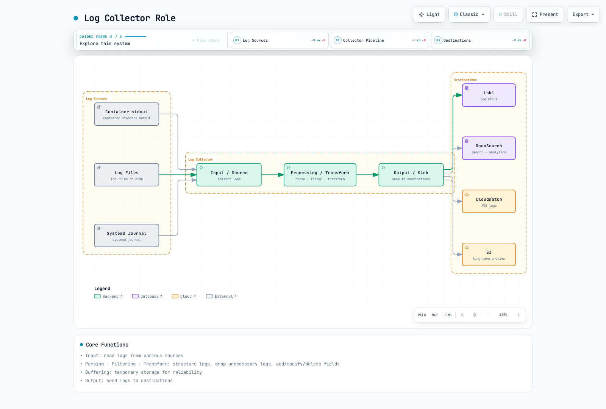
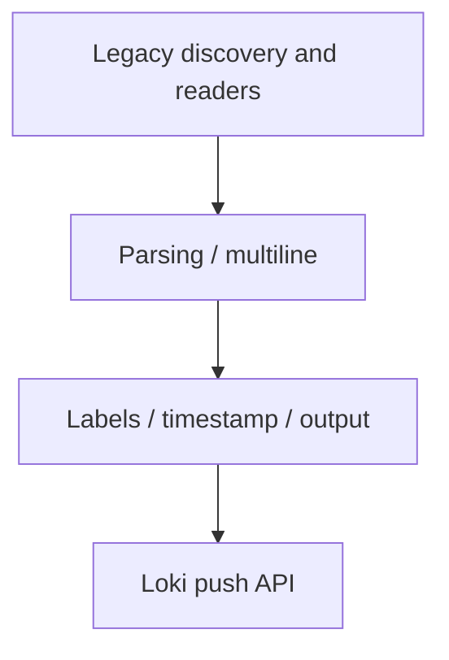
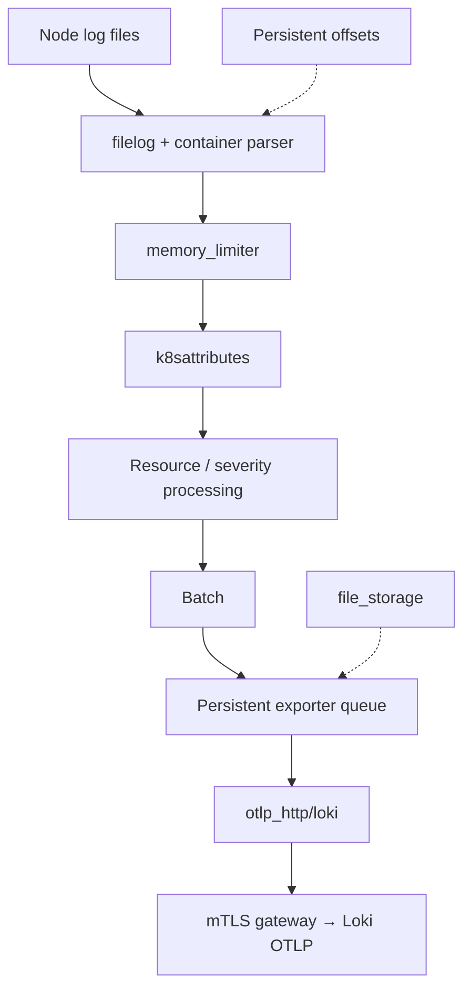
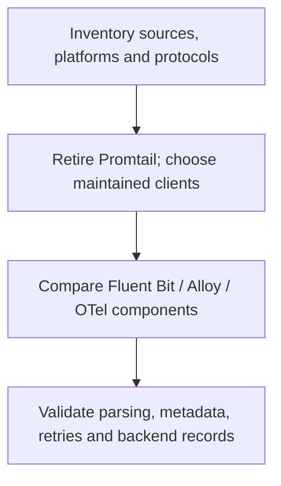

# Comparación de collectors de logs

> **Última actualización**: September 13, 2026

Esta guía compara Fluent Bit, Grafana Alloy y el OpenTelemetry Collector, y explica la migración desde instalaciones de Promtail retiradas. Elige un collector según sus entradas reales, sus plugins de salida, los permisos de despliegue y su comportamiento ante fallos, no según una supuesta clasificación de memoria o de eventos por segundo.

Las líneas base de configuración son **Fluent Bit 5.1.2**, **Alloy 1.19.2** y **OpenTelemetry Collector Contrib 0.160.0**. La versión de una distribución, los componentes que incluye y las plataformas que soporta son comprobaciones independientes.

## Tabla de contenidos

1. [Descripción general](#overview)
2. [FluentBit](#fluentbit)
3. [Promtail](#promtail)
4. [Grafana Alloy](#grafana-alloy)
5. [OpenTelemetry Collector](#opentelemetry-collector)
6. [Comparación y selección (English)](https://www.atomai.click/kubernetes-docs/en/observability/logging/05-collectors#comparison-and-selection-guide)

<span id="overview"></span>

## Descripción general

### Rol del collector de logs



[Ver diagrama interactivo](https://www.atomai.click/kubernetes-docs/archmaps/en-observability-logging-05-collectors-0.html)

La figura muestra los destinos posibles. No significa que cada collector soporte de forma nativa todos los destinos, ni que habilitar varias salidas proporcione entrega transaccional a todas ellas.

### Funciones principales

| Función | Qué verificar |
|---|---|
| Entrada | Permisos de archivo/API, rotación, posición de primera lectura y propiedad de la fuente |
| Parseo | El framing del container runtime por separado del JSON de la aplicación o de los stack traces |
| Transformación/filtrado | Qué registros y campos se modifican o descartan |
| Metadatos | Asociación correcta de Pod/namespace y cardinalidad de labels controlada |
| Buffering | Memoria frente a almacenamiento persistente, capacidad, reintentos y política de desbordamiento |
| Salida | Autenticación, TLS, mapeo de tenants, confirmación y límites del destino |

Ejecuta una única ruta de recolección intencionada por fuente. Varios agentes leyendo los mismos archivos, o lectores de archivos y de la Kubernetes API apuntando a los mismos Pods, pueden duplicar logs. Los offsets, una cola persistente y la ingestión correcta en el backend son estados distintos.

| Plataforma | Consideraciones de recolección |
|---|---|
| Nodos Linux de Kubernetes | Los agentes de archivos del host necesitan montajes de logs del nodo y un security context permitido; las ubicaciones del journal varían |
| Nodos Windows | Usa un build/configuración de Windows soportado y rutas reales de Windows; los manifiestos de Linux siguientes no aplican |
| EKS Fargate | No instales un DaemonSet de archivos del host; usa el log router administrado de Fargate o una ruta apropiada basada en API/aplicación |
| EKS Auto Mode | Verifica las rutas de host disponibles y el soporte de add-ons; los logs emitidos por componentes administrados son distintos del stdout de la aplicación |

Los ejemplos envían a un **gateway de logs privado preexistente con mTLS habilitado**. Debe confiar en el certificado de cliente de cada agente, presentar un certificado que coincida con su nombre DNS, enrutar las rutas de Loki/OTLP y aplicar cualquier política de tenants. Los certificados, el DNS, la configuración del gateway y las NetworkPolicies son prerrequisitos, no algo creado por estos fragmentos.

## FluentBit

### Descripción general

Fluent Bit es un agente de telemetría escrito en C dentro del ecosistema graduado de Fluentd. Los builds actuales soportan logs, métricas, traces y plugins de OpenTelemetry; la comparación antigua de “sin traces/sin OTLP” es inexacta. Comprueba qué plugins incluye realmente la imagen seleccionada.

Fluent Bit 5.1.2 y AWS for Fluent Bit son distribuciones con versionado independiente. Una etiqueta de imagen de AWS no es la versión de Fluent Bit incorporada. Este ejemplo fija la imagen oficial upstream y el digest de su manifiesto; las guías específicas de AWS enlazadas más abajo usan su propia línea base de imagen revisada.

### Arquitectura


[Ver diagrama interactivo](https://www.atomai.click/kubernetes-docs/archmaps/en-observability-logging-05-collectors-1.html)

Trata el diagrama como una visión lógica. El buffering no es una garantía de entrega exactly-once, y el filtrado no borra los archivos de log originales del container. Protege el almacenamiento del nodo y controla los datos sensibles en el límite de la aplicación.

### Ejemplo de configuración completa

Guarda esto como `fluent-bit.conf`. Recolecta logs de containers y usa la **salida `loki` nativa en C**, cuyas opciones incluyen `line_format`, `tenant_id` y `auto_kubernetes_labels`. Los nombres `LineFormat`, `TenantID`, `BatchWait` y `BatchSize` del plugin en Go, desarrollado por separado, no son intercambiables.

```ini
[SERVICE]
    Flush                     2
    Grace                     30
    Daemon                    Off
    Log_Level                 info
    HTTP_Server               On
    HTTP_Listen               0.0.0.0
    HTTP_Port                 2020
    Health_Check              On
    storage.path              /var/lib/fluent-bit/storage
    storage.sync              normal
    storage.checksum          On
    storage.backlog.mem_limit 32M

[INPUT]
    Name                      tail
    Tag                       kube.*
    Path                      /var/log/containers/*.log
    Exclude_Path              /var/log/containers/fluent-bit-*_logging_*.log
    multiline.parser          docker, cri
    DB                        /var/lib/fluent-bit/tail.db
    DB.locking                true
    Mem_Buf_Limit             32M
    Skip_Long_Lines           On
    Refresh_Interval          10
    Rotate_Wait               30
    Read_From_Head            Off
    storage.type              filesystem

[FILTER]
    Name                      kubernetes
    Match                     kube.*
    Kube_URL                  https://kubernetes.default.svc:443
    Kube_Tag_Prefix           kube.var.log.containers.
    Merge_Log                 On
    Merge_Log_Key             log_processed
    Keep_Log                  On
    K8S-Logging.Parser         Off
    K8S-Logging.Exclude        Off
    Use_Kubelet               Off
    Labels                    On
    Annotations               Off

[FILTER]
    Name                      lua
    Match                     kube.*
    script                    /fluent-bit/scripts/process.lua
    call                      process_log
    protected_mode            On

[OUTPUT]
    Name                      loki
    Match                     kube.*
    Host                      logs-gateway.logging.svc.cluster.local
    Port                      443
    tls                       On
    tls.verify                On
    tls.verify_hostname       On
    tls.ca_file               /fluent-bit/tls/ca.crt
    tls.crt_file              /fluent-bit/tls/tls.crt
    tls.key_file              /fluent-bit/tls/tls.key
    Labels                    job=fluent-bit,namespace=$kubernetes['namespace_name']
    line_format               json
    auto_kubernetes_labels    Off
    Retry_Limit               5
    storage.total_limit_size  1G
```

La base de datos de tail y los chunks del sistema de archivos usan el montaje de estado con permiso de escritura, no el montaje de logs de solo lectura. Los offsets existentes se reanudan desde la base de datos; `Read_From_Head Off` omite el contenido preexistente cuando un archivo se descubre por primera vez. Elige una política de backfill deliberada antes de cambiarlo. `Skip_Long_Lines On`, los reintentos finitos y el almacenamiento finito pueden descartar datos; monitoriza estas condiciones.

La exclusión coincide con los Pods del propio collector de este ejemplo. Ajústala si cambia el namespace o el nombre del workload, en lugar de excluir silenciosamente todas las aplicaciones de un namespace. Las annotations de Kubernetes no pueden anular la política de parser/exclusión en esta configuración.

El ejemplo usa el API server para los metadatos y no requiere acceso a `nodes/proxy` del kubelet. Si habilitas `Use_Kubelet`, verifica por separado la dirección del kubelet, la autorización, los certificados y el acceso de red. Un listener HTTP de métricas no es permiso para exponer públicamente el endpoint de UI/health del collector.

Para otros destinos, selecciona deliberadamente la salida y la identidad del workload correspondientes:

- [CloudWatch Logs](03-cloudwatch-logs.md): usa el `cloudwatch_logs` nativo, un log group creado previamente y la identidad real del ServiceAccount del agente. No añadas una opción `compress` no soportada ni asumas que existen permisos de creación/retención.
- [OpenSearch](02-opensearch.md): usa la salida nativa `opensearch`, el servicio/Region correctos de SigV4, TLS y los ajustes de API sin tipos para el backend seleccionado.
- S3: configura el `store_dir` propio con permiso de escritura de la salida `s3`, una política única de claves de objeto y los permisos del prefijo del bucket. Su comportamiento de buffering/subida difiere de la cola genérica del sistema de archivos. Prueba las subidas parciales, la recuperación tras reinicio y la recuperación de datos antes de considerarlo un backup.

Si añades una entrada `systemd`, monta el journal que existe en el sistema operativo de ese nodo, mantén su base de datos de cursor con permiso de escritura y añade una salida que coincida con su tag. Una entrada `host.systemd` con salidas que solo tienen `Match kube.*` no tiene ruta de entrega. Los archivos de journal/auditoría del host no son los logs de auditoría de la API del control plane de EKS.

### Configuración de parsers

Los parsers multilínea integrados `docker, cri` de la entrada tail reensamblan los fragmentos del container runtime. Esto es distinto de unir el stack trace de Java/Python/Go de una aplicación.

| Formato | Enfoque |
|---|---|
| Envoltura JSON de Docker | Parsear la envoltura del runtime antes del JSON de la aplicación |
| CRI/containerd/CRI-O | Parsear timestamp, stream y marcadores parcial/completo; reensamblar registros parciales |
| Log de aplicación JSON | Parsear solo el payload de la aplicación; conservar o manejar explícitamente los registros malformados o de texto plano |
| Nginx/logfmt/texto personalizado | Seleccionar un parser para ese formato de aplicación, no una cadena incondicional de todos los parsers |
| Stack trace de aplicación | Usar un parser multilínea probado con límites de stream, tamaño y timeout |

Cuando uses el **filtro** multilínea, sigue su guía de reemisión/orden: colócalo antes de los filtros que de otro modo volverían a procesar los registros reemitidos. Prueba containers intercalados y excepciones sin timestamp; una única expresión genérica de “la línea comienza con una fecha” no es un parser universal de stack traces.

### Ejemplo de script Lua

Guarda esto como `process.lua`. Enmascara claves seleccionadas en los objetos de aplicación parseados, incluidos objetos/arrays anidados, y elimina el duplicado sin enmascarar. **No** detecta todos los secretos ni identificadores personales en texto arbitrario.

```lua
-- Redacts selected structured keys; it is not a general PII detector.
local sensitive = {
    password = true, passwd = true, token = true, secret = true,
    api_key = true, ["api-key"] = true, authorization = true
}

local function redact(value, depth)
    if type(value) ~= "table" then
        return value
    end
    if depth > 8 then
        return "[DEPTH_LIMIT]"
    end
    for key, child in pairs(value) do
        if type(key) == "string" and sensitive[string.lower(key)] then
            value[key] = "***"
        elseif type(child) == "table" then
            value[key] = redact(child, depth + 1)
        end
    end
    return value
end

function process_log(tag, timestamp, record)
    local app = record["log_processed"]
    if type(app) == "table" then
        record["log_processed"] = redact(app, 0)
        -- Do not retain an unredacted duplicate of the parsed application JSON.
        record["log"] = nil
        if type(app["level"]) == "string" then
            record["level"] = string.upper(app["level"])
        else
            record["level"] = "UNKNOWN"
        end
    else
        if type(record["log"]) ~= "string" then
            record["log"] = "[NON_STRING_LOG]"
        end
        record["level"] = "UNKNOWN"
    end
    -- 2 changes the record while retaining the original Fluent Bit timestamp.
    return 2, timestamp, record
end
```

Por ejemplo, un campo `password` se enmascara, pero un texto como `"message": "password=..."` no se interpreta automáticamente como una credencial. Los logs en texto plano siguen siendo texto plano. Esta transformación no es un límite de seguridad fail-closed; protege los archivos de origen, el almacenamiento local y el destino, y usa una allowlist de logging en la aplicación donde se requieran garantías más fuertes.

`return 2` mantiene el timestamp original de Fluent Bit mientras modifica el registro. Las comprobaciones de tipo evitan que un nivel de log booleano malformado haga fallar el callback. Las pruebas ejercitaron estas transformaciones con un intérprete Lua nativo; el container completo de Fluent Bit no se ejecutó.

### Despliegue como DaemonSet

Guarda lo siguiente como `fluent-bit-workload.yaml`. Requiere el Secret `agent-gateway-client` en `logging`, con `ca.crt`, `tls.crt` y `tls.key`. Son credenciales específicas del despliegue; no pegues una clave privada de ejemplo en Git.

```yaml
apiVersion: v1
kind: ServiceAccount
metadata:
  name: fluent-bit
  namespace: logging
---
apiVersion: rbac.authorization.k8s.io/v1
kind: ClusterRole
metadata:
  name: log-collector-fluent-bit
rules:
- apiGroups:
  - ''
  resources:
  - pods
  - namespaces
  verbs:
  - get
  - list
  - watch
---
apiVersion: rbac.authorization.k8s.io/v1
kind: ClusterRoleBinding
metadata:
  name: log-collector-fluent-bit
roleRef:
  apiGroup: rbac.authorization.k8s.io
  kind: ClusterRole
  name: log-collector-fluent-bit
subjects:
- kind: ServiceAccount
  name: fluent-bit
  namespace: logging
---
apiVersion: apps/v1
kind: DaemonSet
metadata:
  name: fluent-bit
  namespace: logging
spec:
  selector:
    matchLabels: &id001
      app.kubernetes.io/name: fluent-bit
  template:
    metadata:
      labels: *id001
    spec:
      serviceAccountName: fluent-bit
      nodeSelector:
        kubernetes.io/os: linux
      terminationGracePeriodSeconds: 45
      containers:
      - name: fluent-bit
        image: fluent/fluent-bit:5.1.2@sha256:d792375ca8e53be72fc25716c28f291f32c6fc6f4f31d12d0d14bc78cefe9226
        command:
        - /fluent-bit/bin/fluent-bit
        args:
        - -c
        - /fluent-bit/etc/fluent-bit.conf
        ports:
        - name: metrics
          containerPort: 2020
        securityContext:
          runAsUser: 0
          allowPrivilegeEscalation: false
          readOnlyRootFilesystem: true
          capabilities:
            drop:
            - ALL
        resources:
          requests:
            cpu: 100m
            memory: 128Mi
          limits:
            cpu: 500m
            memory: 512Mi
        livenessProbe:
          httpGet:
            path: /
            port: metrics
          initialDelaySeconds: 10
        readinessProbe:
          httpGet:
            path: /api/v1/health
            port: metrics
          initialDelaySeconds: 10
        volumeMounts:
        - name: logs
          mountPath: /var/log
          readOnly: true
        - name: state
          mountPath: /var/lib/fluent-bit
        - name: config
          mountPath: /fluent-bit/etc
          readOnly: true
        - name: scripts
          mountPath: /fluent-bit/scripts
          readOnly: true
        - name: tls
          mountPath: /fluent-bit/tls
          readOnly: true
        - name: tmp
          mountPath: /tmp
      volumes:
      - name: logs
        hostPath:
          path: /var/log
          type: Directory
      - name: state
        hostPath:
          path: /var/lib/fluent-bit
          type: DirectoryOrCreate
      - name: config
        configMap:
          name: fluent-bit-config
          items:
          - key: fluent-bit.conf
            path: fluent-bit.conf
      - name: scripts
        configMap:
          name: fluent-bit-config
          items:
          - key: process.lua
            path: process.lua
      - name: tls
        secret:
          secretName: agent-gateway-client
      - name: tmp
        emptyDir:
          sizeLimit: 32Mi
```

Guarda los archivos de configuración/script anteriores y crea su ConfigMap antes de iniciar el workload:

```bash
kubectl create namespace logging --dry-run=client -o yaml |
  kubectl apply -f -
kubectl -n logging create configmap fluent-bit-config \
  --from-file=fluent-bit.conf --from-file=process.lua \
  --dry-run=client -o yaml | kubectl apply -f -
kubectl apply -f fluent-bit-workload.yaml
kubectl -n logging rollout status daemonset/fluent-bit
```

El agente se ejecuta como root para leer las rutas de logs del nodo del ejemplo y escribir su directorio de estado dedicado, sin capabilities añadidas, sin escalada de privilegios y sin sistema de archivos raíz con permiso de escritura. El uso de HostPath sigue requiriendo una política de admisión del clúster adecuada. Adapta los permisos de archivo, SELinux/AppArmor, los taints y el almacenamiento al sistema operativo real del nodo. No concedas una PriorityClass reservada de tipo system-critical solo para mantener en ejecución un agente de logs de aplicación.

El periodo de gracia de terminación del Pod de 45 segundos supera el periodo de gracia de 30 segundos de Fluent Bit, pero no garantiza una entrega correcta durante una interrupción prolongada. Los límites de recursos son ilustrativos. Verifica registros reales en el backend, los offsets de tail, el estado de salud y las métricas de buffer/reintentos; unos Pods en estado Ready por sí solos no demuestran la ingestión.

## Promtail

### Descripción general

**Promtail llegó al fin de su vida útil el 2 de marzo de 2026.** El soporte comercial y las futuras actualizaciones han terminado. Migra las instalaciones existentes a Alloy u otro cliente soportado; no elijas Promtail para un nuevo despliegue de Loki. El retiro anunciado no incluye el cliente independiente `lambda-promtail`.

### Arquitectura



Esta es una ruta de datos histórica, no una recomendación de instalación. Las [excepciones de licencia](https://github.com/grafana/loki/blob/v2.9.4/LICENSING.md) del repositorio de Loki listan `clients/`, incluido el código fuente de Promtail, bajo Apache-2.0; no apliques la licencia AGPL del servidor de Loki a todos los clientes. Comprueba las licencias del artefacto real y de sus dependencias. Las positions registran lecturas, no la entrega confirmada al backend.

### Ejemplo de configuración completa

Usa un `promtail.yaml` **existente** como entrada de migración en lugar de desplegar la imagen obsoleta 2.9.4:

```bash
alloy convert --source-format=promtail \
  --report=conversion-report.txt \
  --output=config.alloy promtail.yaml
alloy validate config.alloy
```

Inspecciona la configuración generada y el informe de diagnóstico. No omitas los errores de conversión como paso normal del despliegue. El convertidor soporta casi todas las funciones heredadas, no una garantía incondicional de comportamiento idéntico.

La configuración heredada revisada se convirtió correctamente, pero la herramienta advirtió de que su límite global de tasa de lectura se convierte en límites `stage.limit` por pipeline, que la propia configuración de tracing de Promtail puede necesitar migración manual y que Alloy emite métricas propias distintas. Actualiza las alertas/dashboards y verifica esos cambios con datos reales.

### Detalles de las etapas del pipeline

Estos son **conceptos individuales**, no una receta para ejecutar todos los parsers de forma secuencial:

| YAML de Promtail | Equivalente en Alloy | Distinción importante |
|---|---|---|
| `cri` / `docker` | `stage.cri` / `stage.docker` | Elige el framing real del runtime |
| `json`, `regex`, `logfmt` | El `stage.*` correspondiente | Selecciona el campo de origen correcto y la política para datos malformados |
| `template`, después `labels` | `stage.template`, después `stage.labels` | Normaliza antes de copiar valores a labels |
| `drop` | `stage.drop` | La clave YAML de Promtail es `drop`, no `stage.drop` |
| `match` | `stage.match` | Aplica una rama solo a los streams a los que va destinada |
| `metrics` | `stage.metrics` | Revisa los conjuntos de labels, las series inactivas y los nombres de métricas |
| `timestamp`, `multiline` | Las etapas correspondientes | Prueba los formatos de tiempo, el aislamiento de streams y las esperas acotadas |
| `output` | `stage.output` | Reemplazar la línea puede descartar campos necesarios para la correlación |
| `pack` | `stage.pack` | El empaquetado de líneas JSON no es la función independiente de structured metadata de Loki |

No indexes IPs de cliente, IDs de pedido, IDs de trace ni todos los labels arbitrarios de la aplicación por defecto. Los labels de Pod y de nombre de archivo también tienen costes de cardinalidad. Decide qué metadatos deben permanecer disponibles como labels, como structured metadata o en el cuerpo del log.

### Despliegue como DaemonSet

Reemplaza el workload retirado por el collector mantenido que elijas y preserva deliberadamente la transición de fuente/estado. Un archivo de positions bajo `/tmp` no es persistente ni escribible en el antiguo ejemplo con raíz de solo lectura; un montaje en `/run/promtail` no corrige una configuración que escribe en otro lugar.

Coordina la posición de parada del lector antiguo, la posición de inicio del nuevo lector y las comprobaciones en el backend. No ejecutes ambos lectores contra los mismos logs indefinidamente. El éxito de la conversión no valida los montajes de Secrets, el RBAC de Kubernetes, las rutas del journal, la migración de estado ni la entrega al backend.

## Grafana Alloy

### Descripción general

Alloy es la distribución del OpenTelemetry Collector de Grafana con componentes de Prometheus y Loki. Su lenguaje de configuración se denomina **sintaxis de configuración de Alloy**, antes River; es similar a HCL, no un archivo de Terraform intercambiable.

### Configuración de River

Guarda lo siguiente como `config.alloy`. Este ejemplo usa **una sola ruta basada en archivos** para logs CRI de Linux. Define el valor no secreto `NODE_NAME` a partir de `spec.nodeName` mediante la Downward API del Pod, monta los archivos de logs del nodo y proporciona un `--storage.path` persistente con permiso de escritura.

```alloy
logging {
  level = "info"
}

discovery.kubernetes "pods" {
  role = "pod"
  selectors {
    role = "pod"
    field = "spec.nodeName=" + sys.env("NODE_NAME")
  }
}

discovery.relabel "pods" {
  targets = discovery.kubernetes.pods.targets
  rule {
    source_labels = ["__meta_kubernetes_namespace", "__meta_kubernetes_pod_label_app_kubernetes_io_name"]
    regex = "logging;alloy"
    action = "drop"
  }
  rule {
    source_labels = ["__meta_kubernetes_namespace"]
    target_label = "namespace"
  }
  rule {
    source_labels = ["__meta_kubernetes_pod_name"]
    target_label = "pod"
  }
  rule {
    source_labels = ["__meta_kubernetes_pod_container_name"]
    target_label = "container"
  }
  rule {
    source_labels = ["__meta_kubernetes_pod_label_app_kubernetes_io_name"]
    target_label = "service_name"
    regex = "(.+)"
  }
  rule {
    source_labels = ["__meta_kubernetes_pod_uid", "__meta_kubernetes_pod_container_name"]
    separator = "/"
    target_label = "__path__"
    replacement = "/var/log/pods/*$1/*.log"
  }
}

local.file_match "pods" {
  path_targets = discovery.relabel.pods.output
}

loki.source.file "pods" {
  targets = local.file_match.pods.targets
  forward_to = [loki.process.pods.receiver]
  tail_from_end = true
}

loki.process "pods" {
  forward_to = [loki.write.logs.receiver]
  stage.cri {}
  stage.json {
    expressions = {
      level = "level",
    }
    drop_malformed = false
  }
  stage.template {
    source = "level"
    template = "{{ if .Value }}{{ $v := ToUpper .Value }}{{ if or (eq $v \"TRACE\") (eq $v \"DEBUG\") (eq $v \"INFO\") (eq $v \"WARN\") (eq $v \"WARNING\") (eq $v \"ERROR\") (eq $v \"FATAL\") (eq $v \"CRITICAL\") }}{{ $v }}{{ else }}UNKNOWN{{ end }}{{ else }}UNKNOWN{{ end }}"
  }
  stage.labels {
    values = {
      level = "",
    }
  }
  stage.label_drop {
    values = ["filename"]
  }
  // Retain the application line, including its trace ID; do not assume it is safe.
}

loki.write "logs" {
  endpoint {
    url = "https://logs-gateway.logging.svc.cluster.local/loki/api/v1/push"
    batch_wait = "1s"
    batch_size = "1MiB"
    tls_config {
      ca_file = "/etc/alloy/tls/ca.crt"
      cert_file = "/etc/alloy/tls/tls.crt"
      key_file = "/etc/alloy/tls/tls.key"
      insecure_skip_verify = false
    }
  }
  external_labels = {
    cluster = "lab-cluster",
  }
}
```

Los archivos de certificado mTLS configurados deben existir. Aplica por separado los permisos de discovery de Kubernetes y la política del gateway correspondiente. Valida el archivo con el binario de Alloy seleccionado:

```bash
alloy validate config.alloy
```

El label de severidad se restringe a niveles conocidos y a `UNKNOWN`, mientras que la línea de la aplicación sigue disponible para la búsqueda por trace ID. No es un pipeline de enmascaramiento. El label de nombre de archivo se elimina; los labels de Pod/container se conservan y aún deben evaluarse frente a los límites de retención/cardinalidad.

Para la recolección basada en API, usa `loki.source.kubernetes` **en lugar del** lector de archivos y elimina la etapa de envoltura CRI/Docker: la API de logs de Kubernetes proporciona las líneas de log de la aplicación. Un solo collector de API puede recolectar un clúster sin montajes del host. Varias instancias requieren una partición deliberada de targets o el clustering de Alloy configurado con participación de componentes; añadir réplicas sin más puede duplicar la recolección.

`env()` sigue siendo una función obsoleta en esta versión revisada; usa `sys.env()` para configuración no secreta. Prefiere archivos de credenciales montados o componentes conscientes de secretos frente a exponer tokens mediante volcados de variables de entorno.

Las métricas propias de Alloy se pueden scrapear. Enviarlas a `/api/v1/write` de Prometheus requiere además un receptor de remote write habilitado o un backend diseñado para remote write; la URL por sí sola no lo habilita. Mantén privado el acceso a métricas/UI. Configura la telemetría/reporting de forma explícita para el despliegue.

### Migración desde Promtail

Preserva estos aspectos de forma independiente: el parseo del runtime, los labels de discovery, los campos de la aplicación, los offsets, la política de registros descartados, la autenticación del cliente y las alertas de métricas propias. Un ejemplo con fuente de API con un componente de discovery no definido o un parser `stage.docker` aplicado a logs de API ya decodificados no es una migración completa.

Alloy 1.19.2 tiene un WAL opcional de Loki, pero esa función es **experimental y está deshabilitada por defecto**. El ejemplo principal no la habilita. Las positions persistentes de la fuente no son una cola duradera de confirmaciones; evalúa por separado los límites de reintentos, la rotación de la fuente y cualquier retención del WAL.

## OpenTelemetry Collector

### Descripción general

OpenTelemetry proporciona pipelines de telemetría neutrales respecto al proveedor y se convirtió en **proyecto Graduado de la CNCF el 11 de mayo de 2026**. Usa una distribución que contenga los receivers/processors/exporters necesarios; la distribución core no incluye todos los componentes de Contrib.

OTLP puede usar Protobuf o JSON. El tamaño en el cable depende de los campos reales, la agrupación de recursos, la compresión y el transporte. Filebeat/Fluentd también pueden agrupar en lotes. Reemplazar nombres de campo por tags de Protobuf no elimina las cadenas arbitrarias del cuerpo JSON ni de las claves de atributos.

Como ejemplo aritmético condicional, si un pipeline almacena un evento por registro de Kafka y otro empaqueta 150 eventos por registro, 1.000 eventos necesitan unos siete registros en el segundo caso. Eso no establece una reducción equivalente de las peticiones de red ni una mejora de rendimiento de 18×. Haz benchmarks del pipeline completo con hardware, datos, destinos y ajustes de durabilidad equivalentes.

### Arquitectura



Se accede a Loki a través de su endpoint OTLP. El exporter `loki` retirado del Collector no está presente en Contrib 0.160.0. Los eventos de Kubernetes a nivel de clúster y los receivers centralizados de Syslog/OTLP necesitan su propia propiedad y modelo de despliegue; no dupliques un observador de eventos en cada nodo.

### Ejemplo de configuración completa

Guarda esto como `otel.yaml`. Usa el operador `container` de Contrib para el parseo/reensamblado del runtime y los metadatos de recurso de la ruta de archivo. El UID de un Pod debe ser un **atributo de recurso** para la asociación de Kubernetes especificada; extraer solo un `attributes.uid` simple es insuficiente.

```yaml
extensions:
  file_storage/offsets:
    directory: /var/lib/otelcol/offsets
    create_directory: true
  file_storage/queue:
    directory: /var/lib/otelcol/queue
    create_directory: true
  health_check:
    endpoint: 0.0.0.0:13133

receivers:
  filelog:
    include: [/var/log/pods/*/*/*.log]
    exclude: [/var/log/pods/logging_otel-collector-*/*/*.log]
    start_at: end
    include_file_path: true
    storage: file_storage/offsets
    retry_on_failure:
      enabled: true
      max_elapsed_time: 5m
    operators:
      - type: container
        id: container-parser

processors:
  memory_limiter:
    check_interval: 1s
    limit_mib: 400
    spike_limit_mib: 100
  k8sattributes:
    auth_type: serviceAccount
    filter:
      node_from_env_var: NODE_NAME
    pod_association:
      - sources:
          - from: resource_attribute
            name: k8s.pod.uid
    extract:
      metadata:
        - k8s.namespace.name
        - k8s.pod.name
        - k8s.pod.uid
        - k8s.node.name
        - k8s.container.name
  resource/cluster:
    attributes:
      - key: k8s.cluster.name
        value: lab-cluster
        action: upsert
  transform/application:
    error_mode: ignore
    log_statements:
      - context: log
        statements:
          - 'set(cache["app"], ParseJSON(body)) where IsString(body) and IsMatch(body, "^\\s*\\{")'
          - 'set(severity_text, ConvertCase(cache["app"]["level"], "upper")) where IsMap(cache["app"]) and IsString(cache["app"]["level"])'
          - 'set(severity_number, SEVERITY_NUMBER_ERROR) where severity_text == "ERROR"'
          - 'set(severity_number, SEVERITY_NUMBER_WARN) where severity_text == "WARN" or severity_text == "WARNING"'
          - 'set(severity_number, SEVERITY_NUMBER_INFO) where severity_text == "INFO"'
          - 'set(severity_number, SEVERITY_NUMBER_DEBUG) where severity_text == "DEBUG"'
          - 'set(severity_number, SEVERITY_NUMBER_TRACE) where severity_text == "TRACE"'
          - 'set(severity_number, SEVERITY_NUMBER_FATAL) where severity_text == "FATAL" or severity_text == "CRITICAL"'
  batch:
    send_batch_size: 1024
    send_batch_max_size: 2048
    timeout: 2s

exporters:
  otlp_http/loki:
    endpoint: https://logs-gateway.logging.svc.cluster.local/otlp
    encoding: proto
    compression: gzip
    tls:
      ca_file: /etc/otelcol/tls/ca.crt
      cert_file: /etc/otelcol/tls/tls.crt
      key_file: /etc/otelcol/tls/tls.key
    sending_queue:
      enabled: true
      num_consumers: 2
      queue_size: 128
      storage: file_storage/queue
    retry_on_failure:
      enabled: true
      max_elapsed_time: 5m

service:
  extensions: [file_storage/offsets, file_storage/queue, health_check]
  telemetry:
    logs:
      level: info
    metrics:
      readers:
        - pull:
            exporter:
              prometheus:
                host: 0.0.0.0
                port: 8888
  pipelines:
    logs:
      receivers: [filelog]
      processors: [memory_limiter, k8sattributes, resource/cluster, transform/application, batch]
      exporters: [otlp_http/loki]
```

Proporciona el valor `NODE_NAME` de la Downward API, montajes de solo lectura de los logs del nodo, un `/var/lib/otelcol` con permiso de escritura, el RBAC de metadatos de Kubernetes y los montajes del certificado de cliente. Las extensiones de almacenamiento crean sus propios directorios dentro de ese volumen con permiso de escritura. Valida con los valores del entorno desplegado:

```bash
otelcol-contrib validate --config=otel.yaml
```

El exporter añade `/v1/logs` a `/otlp`; configura el gateway y el soporte de OTLP/structured metadata de Loki en consecuencia. `service.telemetry.metrics.readers` reemplaza la antigua clave `address` inválida en esta línea base.

`memory_limiter` puede rechazar datos con un error reintentable y solicitar recolección de basura. No es un límite de memoria del proceso ni una garantía absoluta frente a OOM. El comportamiento de reintento upstream importa; este receiver de archivos reintenta durante cinco minutos acotados, tras lo cual un lote fallido puede descartarse. La capacidad de la cola, la capacidad de disco, el apagado y los fallos del backend siguen necesitando pruebas.

El cuerpo de la aplicación se conserva, incluidos el texto plano y el JSON malformado. El parseo de severidad no es eliminación de datos sensibles. No añadas un exporter paralelo de depuración detallada que copie inadvertidamente payloads de producción sin enmascarar en los logs del collector.

### Connector de enrutamiento

Esta **demostración de enrutamiento local independiente** tiene definidos todos los componentes referenciados y una ruta de reserva. Un productor OTLP proporciona `resource.attributes["logtype"]`; un campo en el cuerpo JSON de una aplicación no se convierte automáticamente en un atributo de recurso.

```yaml
receivers:
  otlp:
    protocols:
      http:
        endpoint: 127.0.0.1:4318

connectors:
  routing:
    default_pipelines: [logs/other]
    table:
      - condition: resource.attributes["logtype"] == "mysql"
        pipelines: [logs/mysql]
      - condition: resource.attributes["logtype"] == "nginx"
        pipelines: [logs/nginx]
      - condition: resource.attributes["logtype"] == "app"
        pipelines: [logs/app]

exporters:
  file/mysql:
    path: /var/lib/otelcol/routed/mysql.json
  file/nginx:
    path: /var/lib/otelcol/routed/nginx.json
  file/app:
    path: /var/lib/otelcol/routed/app.json
  file/other:
    path: /var/lib/otelcol/routed/other.json

service:
  pipelines:
    logs/ingestion:
      receivers: [otlp]
      exporters: [routing]
    logs/mysql:
      receivers: [routing]
      exporters: [file/mysql]
    logs/nginx:
      receivers: [routing]
      exporters: [file/nginx]
    logs/app:
      receivers: [routing]
      exporters: [file/app]
    logs/other:
      receivers: [routing]
      exporters: [file/other]
```

Crea el directorio de salida con permiso de escritura antes de ejecutar este ejemplo. Su receiver se enlaza a loopback y sus destinos son archivos locales; no es un gateway de producción ni un despliegue de ClickHouse. Reemplaza las salidas locales solo después de configurar cada backend real, la autenticación y la política de almacenamiento.

El connector actual acepta `statement: route() where ...`; se verificó y no se trata falsamente como eliminado. `condition` es la forma más clara usada aquí. La acción `move` por defecto elimina los datos coincidentes del enrutamiento posterior; `copy` tiene un comportamiento de fan-out distinto. Los registros sin coincidencia necesitan una reserva intencionada.

Combinar topics de Kafka puede simplificar la administración solo cuando las ACL, la retención, las particiones, la propiedad de los consumidores y el aislamiento de fallos siguen siendo adecuados. La clasificación dentro del Collector no reemplaza el aislamiento del broker ni hace atómico el fan-out. Un atributo de enrutamiento controlado por el productor no es un límite de autorización de tenants.

### Separación de pools por nivel de log (entornos a gran escala)

| Pool | Objetivo de ejemplo | Controles requeridos |
|---|---|---|
| Rápido: ERROR/FATAL | Llegar en menos de dos minutos | Capacidad reservada, aislamiento adecuado de cola/particiones y backlog medido |
| Común: INFO/WARN | Llegar en menos de 15 minutos | Autoescalado medido y retención/colas acotadas |
| Depuración: DEBUG/TRACE | Best effort | Política explícita de descarte/limitación y visibilidad de los datos descartados |

Estos son objetivos ilustrativos, no SLAs medidos. Nombrar tres Deployments o asignar réplicas no enruta datos por sí mismo ni aísla una cola de entrada compartida y congestionada. Dimensiona los requests y límites de recursos a partir del tamaño de entrada, el procesamiento, el batching y los reintentos observados.

Usa una PriorityClass propiedad del operador y adecuada al clúster, no las clases reservadas `system-cluster-critical`/`system-node-critical` como recomendación general de logging. Los nodos dedicados, las prioridades y la capacidad de reserva no garantizan la disponibilidad ante cualquier fallo.

## Comparación y guía de selección

### Tabla de comparación de características

| Elemento | Fluent Bit | Promtail | Alloy | OTel Collector Contrib |
|---|---|---|---|---|
| Ciclo de vida | Mantenido | EOL; migrar | Mantenido | Mantenido |
| Configuración | Configuración clásica / YAML | YAML heredado | Sintaxis de Alloy | YAML |
| Señales | Logs/métricas/traces según el plugin | Principalmente logs de Loki | Logs/métricas/traces | Logs/métricas/traces según el componente |
| Ruta a Loki | Salida nativa | Cliente push heredado | Componentes de Loki | Exporter OTLP HTTP |
| Salidas de AWS | Plugins nativos disponibles | No es su propósito | Comprueba los componentes incluidos/la ruta de reenvío | Comprueba los exporters de AWS incluidos |
| Extensibilidad | C/plugins, filtros Lua, otras opciones según el build | Etapas de pipeline heredadas | Componentes y pipelines | Receivers/processors/connectors/exporters |
| Persistencia | Chunks/estado de entrada y almacenamiento específico de la salida | Positions de la fuente; buffering acotado del cliente | Positions; WAL de Loki experimental opcional | File storage para offsets y colas de exporters soportadas |
| Uso de recursos | Mide la configuración seleccionada | Solo mediciones históricas | Mide la configuración seleccionada | Mide la configuración seleccionada |

El soporte nativo de plugins no es lo mismo que reenviar OTLP a un segundo collector. Confirma la lista real de componentes de la distribución instalada y el protocolo del backend antes de concluir que un destino está soportado o no.

### Recomendaciones por caso de uso

- Evalúa Fluent Bit para integraciones de salida nativas existentes y una huella de agente de nodo adecuada a tu carga de trabajo medida.
- Evalúa Alloy para flujos de trabajo de Grafana/Loki/Prometheus y la migración desde Promtail, con un único modelo deliberado de propiedad de las fuentes.
- Evalúa el OTel Collector para OTLP estándar y pipelines multiproveedor que requieran sus processors/connectors.
- Migra Promtail; mantenerlo únicamente porque ya está en ejecución no es una opción soportada a largo plazo.

### Flujo de decisión



## Referencias y alcance de la validación

- [Código fuente y capacidades de Fluent Bit 5.1.2](https://github.com/fluent/fluent-bit/tree/v5.1.2)
- [Opciones de la salida nativa de Loki](https://github.com/fluent/fluent-bit/blob/v5.1.2/plugins/out_loki/loki.c)
- [Ciclo de vida de Promtail](https://grafana.com/docs/loki/latest/send-data/promtail/)
- [Migración a Alloy](https://grafana.com/docs/alloy/latest/set-up/migrate/from-promtail/)
- [Fuente de la Kubernetes API en Alloy](https://grafana.com/docs/alloy/latest/reference/components/loki/loki.source.kubernetes/)
- [Salida de Loki/WAL en Alloy](https://grafana.com/docs/alloy/latest/reference/components/loki/loki.write/)
- [Release de Collector Contrib](https://github.com/open-telemetry/opentelemetry-collector-releases/releases/tag/v0.160.0)
- [Receiver filelog](https://github.com/open-telemetry/opentelemetry-collector-contrib/blob/v0.160.0/receiver/filelogreceiver/README.md)
- [Connector de enrutamiento](https://github.com/open-telemetry/opentelemetry-collector-contrib/blob/v0.160.0/connector/routingconnector/README.md)
- [Memory limiter](https://github.com/open-telemetry/opentelemetry-collector/blob/v0.160.0/processor/memorylimiterprocessor/README.md)
- [Estado de OpenTelemetry en la CNCF](https://www.cncf.io/projects/opentelemetry/)
- [Logging en EKS Fargate](https://docs.aws.amazon.com/eks/latest/userguide/fargate-logging.html)

La validación cubre las comprobaciones de configuración de las versiones publicadas de Alloy/Collector y el procesamiento local de logs sintéticos, las pruebas de transformación en Lua, los contratos oficiales de plugins/fuentes y la forma de los manifiestos de Kubernetes. No se ejecutó ninguna búsqueda real de metadatos de Kubernetes, despliegue de agente de nodo, mTLS de gateway, entrega en AWS, HA, carga de producción ni benchmark de rendimiento.

## Cuestionario

Pon a prueba tu comprensión con el [cuestionario de collectors de logs](../../quizzes/observability/logging/05-collectors-quiz.md).
