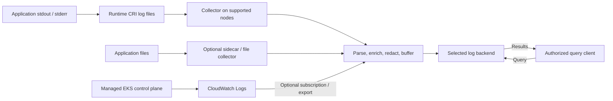

# Logging

> **Última actualización**: September 13, 2026

El logging (registro de eventos) conecta el comportamiento de las aplicaciones, los
eventos de infraestructura y las evidencias de auditoría. Diseñe en conjunto el esquema
de eventos, la titularidad de la recolección, el comportamiento ante fallos de entrega,
el acceso, la retención y las consultas. La elección de un collector o de un backend por
sí sola no garantiza registros completos, aislamiento entre tenants ni cumplimiento
normativo.

## Fundamentos del logging

### Los registros estructurados siguen necesitando parseo

JSON hace explícitos los campos y facilita su validación y búsqueda, pero aún requiere
decodificación, mapeo de marcas de tiempo y tipos, y un manejo correcto del framing del
container runtime. JSON puede ocupar más que el texto plano y no elimina automáticamente
los datos sensibles. Produzca un evento por línea, salvo que un formato multilínea ya
probado exija lo contrario.

Este ejemplo sintético conserva su marca de tiempo original de 2025 como ilustración del
formato, no como afirmación sobre un incidente actual:

```json
{
  "timestamp": "2025-02-15T10:23:45.123Z",
  "level": "ERROR",
  "message": "Database connection timed out",
  "service": "example-api",
  "operation": "database.connect",
  "timeout_ms": 30000,
  "trace_id": "4bf92f3577b34da6a3ce929d0e0e4736",
  "span_id": "00f067aa0ba902b7"
}
```

El JSON expandido se muestra para facilitar la lectura. Un productor orientado a líneas
puede codificarlo así, incluidos los mensajes que contienen caracteres de nueva línea:

```python
import json


def encode_log(record):
    # JSON escapes embedded newlines; append exactly one record delimiter.
    return json.dumps(record, ensure_ascii=False, separators=(",", ":")) + "\n"
```

Estas son convenciones de campos de la aplicación, no el esquema de transporte de OTLP.
Configure el mapeo del collector o backend hacia Timestamp, SeverityText/SeverityNumber,
Body, Resource, Attributes y el contexto de traza de OpenTelemetry cuando corresponda.

Los trace ID son valores de 16 bytes (32 caracteres hexadecimales en esta representación);
los span ID son de 8 bytes (16 caracteres hexadecimales). Los ID formados solo por ceros
no son válidos. Adjunte el contexto activo real, no un ID nuevo y sin relación en cada log.
Los registros de arranque o de sistema sin span pueden omitir el contexto de traza; esos
campos no son obligatorios en todos los logs JSON. Los ID correctos por sí solos no crean
spans ni garantizan la correlación entre servicios.

Recolecte los campos de negocio o de contexto que realmente necesite. No recomiende tokens
de sesión en bruto, contraseñas, datos de clientes, direcciones IP o cuerpos de peticiones
como campos predeterminados universales. Los datos de auditoría que contienen identidades
pueden tener un propósito legítimo, pero requieren una política definida de acceso,
retención y redacción. Prefiera metadatos de un collector de confianza para el enrutamiento
en lugar de permitir que el JSON de la aplicación declare un tenant o namespace arbitrario.

### La severidad no es una escala universal de 0 a 5

Los frameworks usan nombres y niveles numéricos distintos. Mapee su significado de forma
explícita. Para el modelo de logs de OpenTelemetry, los rangos son:

| Severity | SeverityNumber |
| --- | --- |
| TRACE | 1–4 |
| DEBUG | 5–8 |
| INFO | 9–12 |
| WARN | 13–16 |
| ERROR | 17–20 |
| FATAL | 21–24 |

En ese modelo, el cero representa severidad no especificada. ERROR no significa
universalmente que el error sea recuperable, y una etiqueta por sí sola no decide la
política de reintentos o recuperación. INFO suele ser un punto de partida para operaciones
en producción; los eventos de auditoría y seguridad, así como la depuración habilitada
temporalmente, tienen sus propios requisitos. Elevar todo a WARN solo para reducir volumen
puede eliminar evidencias necesarias.

## Recolección y procesamiento

Las capas siguientes son responsabilidades, no necesariamente procesos separados. Los
destinos se seleccionan de forma deliberada; esto no exige copiar cada registro a todos los
backends. Los registros del control plane gestionado de EKS entran a través de CloudWatch,
no de archivos de log de los nodos de trabajo.



| Patrón | Uso adecuado y límites |
| --- | --- |
| stdout/stderr + collector en el nodo | Ruta habitual en nodos de trabajo Linux; los archivos del runtime y los permisos del collector siguen importando |
| Archivo + sidecar | Aplicaciones heredadas o que solo escriben a archivo, o procesamiento específico de la aplicación; el volumen compartido, el arranque/apagado y la sobrecarga requieren cuidado |
| Envío desde la aplicación o el SDK | Puede transportar eventos estructurados directamente; el buffering, la autenticación y el comportamiento ante fallos afectan a la aplicación |
| Router de plataforma gestionada | Por ejemplo, el log router integrado de EKS Fargate; usa su modelo de configuración soportado |

Un DaemonSet se programa en los nodos aptos según selectores, afinidad, taints tolerados,
sistema operativo y comportamiento de despliegue. No demuestra que todos los nodos tengan
un collector en buen estado ni que todos los contenedores estén incluidos. Varios collectors
o un solapamiento durante un rolling update pueden duplicar la recolección. Un sidecar no es
automáticamente un límite de seguridad sólido entre múltiples tenants.

### Rutas de log predeterminadas en Linux y ciclo de vida

La disposición predeterminada habitual es:

```text
Runtime log files:
  /var/log/pods/<namespace>_<pod>_<uid>/<container>/0.log

Compatibility symlinks pointing to those files:
  /var/log/containers/<pod>_<namespace>_<container>-<container-id>.log
```

Kubelet dirige la ruta de logs CRI del runtime y gestiona la rotación. `podLogsDir` puede
cambiar la ruta predeterminada, y las disposiciones específicas del sistema operativo o del
runtime difieren. Inspeccione el despliegue real en lugar de añadir montajes exclusivos de
Docker a todas las cargas de trabajo con containerd. `kubectl logs` expone el archivo de log
actual; `--previous` puede acceder a una instancia anterior del contenedor cuando se conserva.
No es un archivo histórico de logs.

La rotación limita los archivos locales; no implementa retención central ni copias de
seguridad. La pérdida, el desalojo o la eliminación de un nodo pueden eliminar registros antes
de su recolección. El `emptyDir` de un sidecar sobrevive al reinicio de un contenedor dentro
del mismo Pod, pero no a la eliminación del Pod. Las bases de datos de offsets del collector,
las colas y el almacenamiento persistente deben diseñarse junto con la confirmación y los
reintentos de la salida. El buffering es finito; los reintentos pueden duplicar registros.
Mida la pérdida y duplicación de registros, el backlog, el agotamiento del almacenamiento y la
recuperación en condiciones de fallo.

Elija una ruta principal por registro. Un sidecar que reenvía registros y además los escribe
en stdout puede duplicar la ruta del collector del nodo. Evite recolectar recursivamente la
salida del collector o reenviar hacia el mismo log group de origen suscrito.

### Fragmento de procesamiento de Fluent Bit

Lo siguiente es **configuración clásica de Fluent Bit**, no YAML. Ilustra únicamente
filtros: proporcione y valide por separado la entrada real, el parser CRI/multilínea, el
formato de tag, el acceso a RBAC y caché, el almacenamiento y la salida.

```text
# Fluent Bit classic-format FILTER fragment, not YAML or a complete pipeline.
# Requires matching tail input tags and CRI/Docker parsing.
[FILTER]
    Name               kubernetes
    Match              kube.*
    Kube_Tag_Prefix     kube.var.log.containers.
    Merge_Log          On
    Merge_Log_Key      app
    Keep_Log           On
    K8S-Logging.Parser  Off
    Labels             Off
    Annotations        Off

[FILTER]
    Name               modify
    Match              kube.*
    Set                cluster_name example-cluster
    Set                environment demo
```

`Merge_Log_Key app` mantiene los campos parseados de la aplicación separados de los
metadatos del collector. `Set` reemplaza los valores de cluster y entorno de confianza
elegidos; `Add` dejaría sin cambios un valor ya presente. En este fragmento, los parsers y
las annotations seleccionados por la carga de trabajo no son de confianza implícita. Haga
coincidir `Kube_Tag_Prefix` con los tags reales de la entrada.

Con `Keep_Log On`, la redacción debe tener en cuenta tanto el log original como la copia
parseada. Elimine la copia en bruto solo bajo una política probada. No descarte cualquier
línea que contenga `HealthCheck`: un health check que falla puede ser justo la evidencia que
necesita. Filtre únicamente eventos rutinarios bien definidos, tras comprobar el formato de
la aplicación y los casos de fallo.

Esta descripción general no presenta un DaemonSet incompleto con imagen `latest` como una
instalación completa. Un collector real requiere imágenes fijadas, una configuración real,
service account y RBAC, montajes correctos, permisos y recursos. Siga el
[capítulo de collectors](05-collectors.md) para los detalles de despliegue y valide la
configuración de plataforma y backend elegida.

## Rutas de logging en EKS

### Logs del control plane

EKS puede enviar registros de `api`, `audit`, `authenticator`, `controllerManager` y
`scheduler` directamente a CloudWatch Logs en la cuenta. Sirven a propósitos distintos:
diagnóstico de la API, eventos de auditoría, diagnóstico de la autenticación IAM y
diagnóstico del controller y del scheduler. Seleccione los tipos que requieran sus
necesidades operativas y de seguridad.

Guarde esta petición como `control-plane-logging.json`:

```json
{
  "clusterLogging": [
    {
      "types": [
        "api",
        "audit",
        "authenticator",
        "controllerManager",
        "scheduler"
      ],
      "enabled": true
    }
  ]
}
```
```bash
export AWS_REGION=ap-northeast-2
export CLUSTER_NAME=my-cluster

# Inspect the existing configuration before choosing a change.
aws eks describe-cluster --name "$CLUSTER_NAME" --region "$AWS_REGION" \
  --query 'cluster.logging'

# This changes the cluster logging configuration and can incur log charges.
aws eks update-cluster-config --name "$CLUSTER_NAME" --region "$AWS_REGION" \
  --logging file://control-plane-logging.json

# Use the actual update ID from the response, then inspect status/errors.
: "${UPDATE_ID:?Set the returned update ID}"
aws eks describe-update --name "$CLUSTER_NAME" --region "$AWS_REGION" \
  --update-id "$UPDATE_ID"
```

Las actualizaciones de logging son asíncronas. EKS documenta que se necesitan hasta cinco
direcciones IP disponibles por subred para la actualización. Verifique el estado de la
actualización, los streams emitidos y la retención y permisos del log group. La entrega es
de mejor esfuerzo, normalmente en cuestión de minutos; habilitar un tipo no rellena
retroactivamente los eventos anteriores.

Los eventos de auditoría siguen la audit policy y sus niveles, etapas y exclusiones. No
demuestran que cada petición o cuerpo se haya registrado, y habilitar `audit` por sí solo no
establece cumplimiento normativo. El DaemonSet de los nodos no lee un host del control plane
gestionado. Reenviar registros de CloudWatch a otro destino es una ruta separada de
suscripción o exportación, con sus propios requisitos de codificación, IAM, entrega y manejo
de duplicados.

### Fargate y Container Insights

EKS Fargate proporciona un router gestionado basado en Fluent Bit, configurado mediante
`aws-logging` en el namespace `aws-observability`, con un límite documentado de 5.300
caracteres y restricciones sobre las secciones y plugins soportados. Allí no se instala el
DaemonSet habitual del host. Configure los permisos de su destino y pruebe los logs de nuevas
cargas de trabajo. Los entornos de Auto Mode, mixtos o Windows también requieren sus rutas de
recolección soportadas.

El namespace requiere la label `aws-observability: enabled`. Otorgue los permisos del destino
al pod execution role de Fargate según la documentación. Los cambios en el ConfigMap se
aplican a los Pods nuevos, no a los existentes; planifique un despliegue controlado y verifique
la entrega.


El `logs.metrics_collected.kubernetes` del CloudWatch Agent emite datos de rendimiento de
Container Insights; eso por sí solo no es recolección de logs de stdout/stderr de la
aplicación. Fluent Bit o una ruta de logs de OTel configurada gestionan los logs de aplicación
por separado. Un ConfigMap no tiene efecto a menos que la carga de trabajo u Operator real lo
consuma. Consulte la [guía de CloudWatch](../metrics/04-cloudwatch-metrics.md) revisada para
conocer esos límites de modelo y configuración.

## Decisiones de almacenamiento, retención y coste

| Backend | Preguntas de diseño |
| --- | --- |
| Loki | LogQL, streams y chunks indexados por labels y rutas soportadas de metadatos y filtros; elija labels, tenancy y autenticación, almacenamiento y capacidad de consulta |
| OpenSearch | APIs de búsqueda y agregación, mappings y ciclo de vida de índices; distinga entre autogestionado, dominios gestionados, UltraWarm y Serverless |
| CloudWatch Logs | Log groups gestionados, IAM, retención y QL/SQL/PPL de Logs Insights; las funciones varían según la clase de log y la Región |
| ClickHouse | Analítica SQL orientada a columnas, decisiones de esquema, orden, partición y TTL, y el modelo de almacenamiento autogestionado o en la nube elegido |

OpenSearch no se limita universalmente a “solo snapshots en S3”: UltraWarm usa S3 y caché, y
Serverless separa almacenamiento y cómputo. CloudWatch no es un backend de logs en S3
configurado por el usuario, pero admite rutas separadas de exportación, entrega e integración.
El identificador de tenant de un producto o un sidecar no sustituyen al enrutamiento
autenticado ni a los controles de acceso del backend.

El filtrado de texto completo, la indexación y la latencia de consulta son cuestiones
distintas. Pruebe volúmenes representativos, predicados de consulta, concurrencia, datos fríos
y recuperación. Evite las clasificaciones incondicionales de “excelente/limitado”, las
afirmaciones de que “sin esquema significa que no hay esquema” o los ratios de compresión sin
un conjunto de datos y una configuración medidos.

### La retención requiere una política para los registros reales

No asigne `financial` a siete años, `healthcare` a seis años ni los logs generales a un año
como reglas legales universales. Determine la categoría de registro aplicable, la jurisdicción,
los requisitos contractuales, las retenciones legales y la política aprobada por el
responsable. Los niveles hot, warm y cold son decisiones operativas, no evidencia de que se
hayan cumplido esas obligaciones. Incluya réplicas, versiones de objetos, copias de seguridad
y exportaciones en los planes de eliminación y acceso, y pruebe la restauración por separado.

### Compare costes equivalentes

La antigua tabla de 2025 mezclaba precios de almacenamiento y de ingesta por GB y calificaba
como gratuitas las consultas autogestionadas. Las estimaciones posteriores de 100 GB carecían
de una base reproducible de Región, horas, retención, capacidad y carga de trabajo. Eran
estimaciones ilustrativas, no mediciones de producción; cambiar la fecha o un solo precio no
las corregiría.

Compare la ingesta, los bytes retenidos y comprimidos y la sobrecarga de índices, las réplicas,
el cómputo, los escaneos y la capacidad de consulta, las peticiones de almacenamiento, la
transferencia de red, las copias de seguridad y el trabajo operativo. El precio de un almacén
de objetos es solo un término. Incluso sin un cargo por consulta, las consultas consumen la
CPU, memoria y E/S aprovisionadas. Loki con S3 no es un ganador de coste garantizado, ni un
backend concreto es automáticamente adecuado para el cumplimiento normativo.

1. Defina las consultas necesarias y los objetivos de frescura, retención, acceso y
   recuperación.
2. Preseleccione los modelos de despliegue que cumplan esos requisitos.
3. Reproduzca datos y consultas representativos y casos de fallo y recuperación.
4. Compare los costes completos y la titularidad operativa.
5. Registre los supuestos pendientes y verifíquelos antes del uso en producción.

## Próximos pasos y alcance de la validación

Promtail llegó al fin de su vida útil el **2026-03-02**. Use Alloy u otro cliente soportado
para trabajos nuevos y planifique la migración de los despliegues existentes de Promtail. El
aviso citado trata `lambda-promtail` de forma separada de manera explícita; no amplíe la
afirmación de retirada.

- [Loki](01-loki.md)
- [OpenSearch](02-opensearch.md)
- [CloudWatch Logs](03-cloudwatch-logs.md)
- [ClickHouse](04-clickhouse.md)
- [Collectors: Fluent Bit, Alloy y OpenTelemetry](05-collectors.md)

Esta auditoría verificó los hechos de las fuentes, la serialización e ID de los ejemplos y la
estructura de las peticiones y configuraciones. No se ejecutó ningún cambio de logging en EKS,
despliegue de collector, aprovisionamiento de tenants o almacenamiento, determinación legal,
medición de costes en producción ni prueba de entrega o recuperación.

## Referencias

- [Kubernetes logging architecture](https://kubernetes.io/docs/concepts/cluster-administration/logging/)
- [Kubelet legacy log symlinks](https://github.com/kubernetes/kubernetes/blob/v1.36.2/pkg/kubelet/kuberuntime/legacy.go)
- [DaemonSet behavior](https://kubernetes.io/docs/concepts/workloads/controllers/daemonset/)
- [Kubernetes audit policy](https://kubernetes.io/docs/tasks/debug/debug-cluster/audit/)
- [OpenTelemetry logs data model](https://opentelemetry.io/docs/specs/otel/logs/data-model/)
- [W3C Trace Context](https://www.w3.org/TR/trace-context/)
- [EKS control-plane logging](https://docs.aws.amazon.com/eks/latest/userguide/control-plane-logs.html)
- [EKS Fargate log router](https://docs.aws.amazon.com/eks/latest/userguide/fargate-logging.html)
- [Fluent Bit Kubernetes filter source documentation](https://github.com/fluent/fluent-bit-docs/blob/master/pipeline/filters/kubernetes.md)
- [Fluent Bit modify filter](https://github.com/fluent/fluent-bit-docs/blob/master/pipeline/filters/modify.md)
- [Loki architecture](https://grafana.com/docs/loki/latest/get-started/overview/)
- [Promtail end of life](https://grafana.com/docs/loki/latest/send-data/promtail/)
- [OpenSearch UltraWarm](https://docs.aws.amazon.com/opensearch-service/latest/developerguide/ultrawarm.html)
- [OpenSearch Serverless](https://docs.aws.amazon.com/opensearch-service/latest/developerguide/serverless-overview.html)
- [CloudWatch Logs query languages](https://docs.aws.amazon.com/AmazonCloudWatch/latest/logs/AnalyzingLogData.html)
- [CloudWatch log classes](https://docs.aws.amazon.com/AmazonCloudWatch/latest/logs/CloudWatch_Logs_Log_Classes.html)
- [ClickHouse overview](https://github.com/ClickHouse/ClickHouse)

[Quiz](../../quizzes/observability/logging/README-quiz.md)
