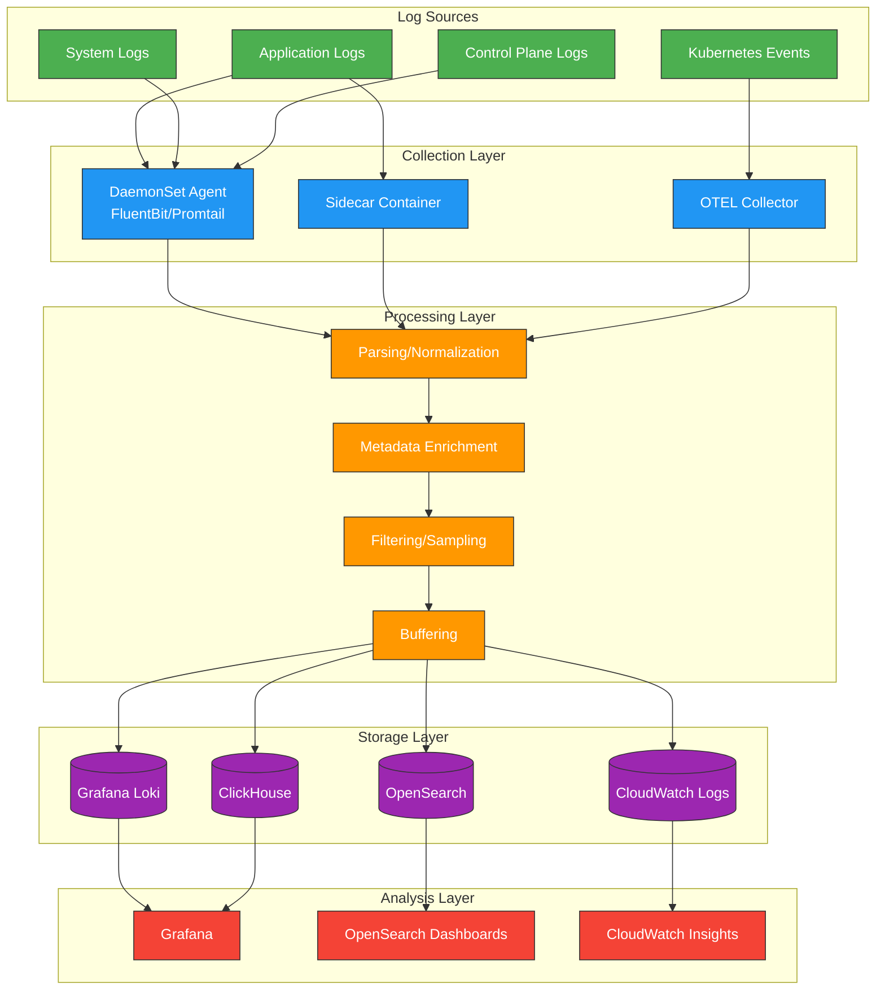
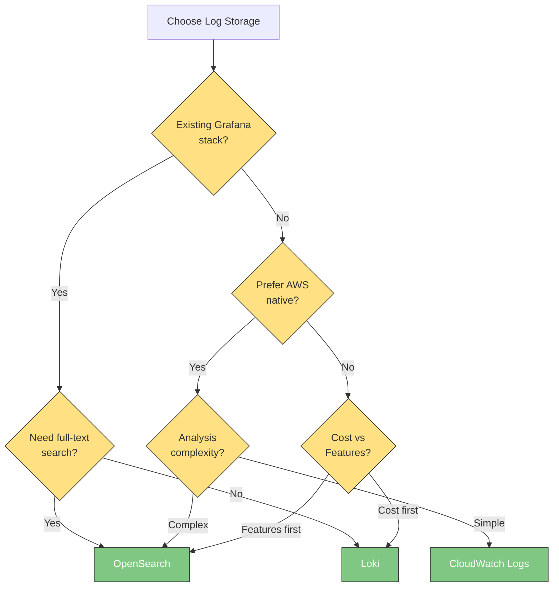

# Registro de logs

> **Última actualización**: February 20, 2026

El registro de logs eficaz en entornos Kubernetes es esencial para la visibilidad del sistema, la resolución de problemas y la auditoría de seguridad. Este documento cubre los fundamentos del registro de logs, la arquitectura del pipeline de recopilación de logs y las estrategias de registro de logs para entornos EKS.

## Tabla de contenido

1. [Fundamentos del registro de logs](#logging-fundamentals)
2. [Arquitectura del pipeline de recopilación de logs](#log-collection-pipeline-architecture)
3. [Criterios de selección de almacenamiento de logs](#log-storage-selection-criteria)
4. [Estrategia de registro de logs de EKS](#eks-logging-strategy)
5. [Comparación de soluciones](#solution-comparison)

***

## Fundamentos del registro de logs

### Registro de logs estructurado

El registro de logs estructurado genera mensajes de log en un formato coherente, lo que facilita el análisis y el procesamiento. A diferencia de los logs de texto no estructurados, los logs estructurados consisten en pares campo-valor que permiten búsquedas y filtrados mucho más eficientes.

#### Logs no estructurados frente a estructurados

```plaintext
# Unstructured log (difficult to parse)
2025-02-15 10:23:45 ERROR Failed to connect to database: connection timeout after 30s

# Structured log (JSON format)
{
  "timestamp": "2025-02-15T10:23:45.123Z",
  "level": "ERROR",
  "message": "Failed to connect to database",
  "error": "connection timeout",
  "timeout_seconds": 30,
  "service": "user-api",
  "pod": "user-api-7d4f8b9c6-x2k9m",
  "namespace": "production",
  "trace_id": "abc123def456"
}
```

#### Beneficios del registro de logs estructurado

| Beneficio                  | Descripción                                               |
| -------------------------- | --------------------------------------------------------- |
| **Eficiencia de búsqueda** | Filtrado rápido por campos específicos                    |
| **Consistencia**           | Mismo formato en todos los servicios                      |
| **Análisis de correlación** | Seguimiento de solicitudes mediante trace\_id, request\_id |
| **Automatización**         | Uso inmediato en herramientas de análisis sin procesamiento |
| **Configuración de alertas** | Fácil creación de reglas de alerta basadas en valores de campos específicos |

### Niveles de log

Los niveles de log indican la importancia y la gravedad de los mensajes. El uso adecuado de los niveles de log es crucial para una resolución de problemas eficaz y la reducción del ruido.

| Nivel     | Número | Propósito                                | Ejemplo                                              |
| --------- | ------ | ---------------------------------------- | ---------------------------------------------------- |
| **TRACE** | 0      | Información de depuración más detallada  | Entrada/salida de funciones, valores de variables    |
| **DEBUG** | 1      | Información de depuración durante el desarrollo | Consultas SQL, parámetros de solicitud          |
| **INFO**  | 2      | Información operativa general            | Inicio de Service, finalización de solicitudes       |
| **WARN**  | 3      | Situaciones de posibles problemas        | Reintentos en curso, degradación del rendimiento     |
| **ERROR** | 4      | Se produjo un error (recuperable)        | Error de llamada API, error de validación            |
| **FATAL** | 5      | Error crítico (irrecuperable)            | Error al iniciar Service, dependencia requerida ausente |

#### Niveles de log recomendados por entorno

```yaml
# Development environment
LOG_LEVEL: DEBUG

# Staging environment
LOG_LEVEL: INFO

# Production environment
LOG_LEVEL: INFO  # or WARN (for high traffic)
```

### Formato de log JSON

En entornos Kubernetes, el formato JSON es el estándar de facto. La mayoría de los recopiladores de logs y herramientas de análisis admiten JSON de forma nativa.

#### Campos JSON recomendados

```json
{
  "timestamp": "2025-02-15T10:23:45.123Z",
  "level": "INFO",
  "logger": "com.example.UserService",
  "message": "User login successful",
  "context": {
    "user_id": "user-12345",
    "session_id": "sess-abc123",
    "ip_address": "10.0.1.50"
  },
  "kubernetes": {
    "namespace": "production",
    "pod": "user-api-7d4f8b9c6-x2k9m",
    "container": "user-api",
    "node": "ip-10-0-1-100.ec2.internal"
  },
  "trace": {
    "trace_id": "abc123def456",
    "span_id": "789ghi",
    "parent_span_id": "456def"
  }
}
```

#### Descripciones de los campos clave

| Grupo de campos | Campo         | Descripción                                         |
| --------------- | ------------- | --------------------------------------------------- |
| **Básico**      | timestamp     | Marca de tiempo en formato ISO 8601                 |
|                | level         | Nivel de log                                        |
|                | message       | Mensaje legible para las personas                   |
| **Contexto**    | context.\*    | Información relacionada con la lógica de negocio    |
| **Kubernetes** | kubernetes.\* | Metadatos de K8s como Pod y namespace               |
| **Trace**      | trace.\*      | ID de trazado distribuido (integración con OpenTelemetry) |

***

## Arquitectura del pipeline de recopilación de logs

### Descripción general de la arquitectura



### Responsabilidades de las capas

#### 1. Capa de recopilación

Responsable de recopilar logs sin procesar de las fuentes de logs.

| Método          | Ventajas                                   | Desventajas                     | Ideal para                       |
| --------------- | ------------------------------------------ | --------------------------------- | --------------------------------- |
| **DaemonSet**   | Uso eficiente de recursos, gestión centralizada | Solo uno por nodo              | La mayoría de las cargas de trabajo estándar |
| **Sidecar**     | Aislamiento por aplicación, procesamiento personalizado | Sobrecarga de recursos | Formatos de log especiales, multi-tenant |
| **Direct Push** | Entrega en tiempo real y flexible          | Requiere modificar la aplicación | Requisitos de alto rendimiento    |

#### 2. Capa de procesamiento

Normaliza los logs recopilados y añade metadatos.

```yaml
# FluentBit processing pipeline example
[FILTER]
    Name         kubernetes
    Match        kube.*
    Kube_URL     https://kubernetes.default.svc:443
    Merge_Log    On
    K8S-Logging.Parser  On

[FILTER]
    Name         modify
    Match        *
    Add          cluster_name eks-production
    Add          environment production

[FILTER]
    Name         grep
    Match        *
    Exclude      log HealthCheck
```

#### 3. Capa de almacenamiento

Almacena e indexa los logs procesados. Los métodos de almacenamiento varían según las características de la solución.

#### 4. Capa de análisis

Busca y visualiza los logs almacenados.

***

## Criterios de selección de almacenamiento de logs

### Consideraciones clave

#### 1. Coste

```
Monthly log volume: Estimated cost based on 1TB (2025)

+------------------+------------------+-----------------+
|     Solution     |   Storage/GB     |   Query Cost    |
+------------------+------------------+-----------------+
| Loki (S3)        | $0.023 (S3)      | Free            |
| OpenSearch       | $0.10-0.15       | Free            |
| CloudWatch       | $0.50 (ingest)   | $0.005/GB scan  |
| ClickHouse       | $0.023 (S3)      | Free            |
+------------------+------------------+-----------------+
```

#### 2. Rendimiento de consultas

| Solución       | Consulta en tiempo real | Agregación | Búsqueda de texto completo | Dashboard             |
| -------------- | ----------------------- | ---------- | -------------------------- | --------------------- |
| **Loki**       | Excelente               | Bueno      | Limitada                   | Grafana               |
| **OpenSearch** | Excelente               | Excelente  | Excelente                  | OpenSearch Dashboards |
| **CloudWatch** | Bueno                   | Bueno      | Bueno                      | CloudWatch Console    |
| **ClickHouse** | Excelente               | Excelente  | Bueno                      | Grafana               |

#### 3. Período de retención

```yaml
# Recommended retention policies
regulatory_compliance:
  financial: 7 years
  healthcare: 6 years
  general: 1 year

operational:
  hot_storage: 7-14 days    # Fast queries
  warm_storage: 30-90 days  # Investigation
  cold_storage: 1 year+     # Compliance
```

#### 4. Complejidad operativa

| Solución       | Instalación | Operaciones | Escalabilidad |
| -------------- | ---------- | ----------- | ------------- |
| **Loki**       | Baja       | Baja        | Alta          |
| **OpenSearch** | Media      | Alta        | Media         |
| **CloudWatch** | Muy baja   | Muy baja    | Alta          |
| **ClickHouse** | Alta       | Media       | Alta          |

***

## Estrategia de registro de logs de EKS

### Patrones de recopilación de logs

#### 1. Patrón stdout/stderr (recomendado)

El registro de logs mediante la salida/error estándar del contenedor es el patrón predeterminado de Kubernetes.

```yaml
apiVersion: v1
kind: Pod
metadata:
  name: app-pod
spec:
  containers:
  - name: app
    image: myapp:1.0
    # Application outputs logs to stdout/stderr
    # kubelet saves to files in /var/log/containers/
    # DaemonSet agent collects
```

**Ventajas:**

* Enfoque nativo de Kubernetes
* Gestión automática de rotación de logs (`/var/log/containers/`)
* Comando `kubectl logs` disponible
* No se requiere un montaje de volumen independiente

**Ubicaciones de archivos de log:**

```bash
# Actual log files
/var/log/containers/<pod-name>_<namespace>_<container-name>-<container-id>.log

# Symbolic links
/var/log/pods/<namespace>_<pod-name>_<pod-uid>/<container-name>/0.log
```

#### 2. Patrón Sidecar

Se utiliza cuando se requiere un registro basado en archivos o procesamiento especial.

```yaml
apiVersion: v1
kind: Pod
metadata:
  name: app-with-sidecar
spec:
  containers:
  - name: app
    image: legacy-app:1.0
    volumeMounts:
    - name: log-volume
      mountPath: /var/log/app

  - name: log-collector
    image: fluent/fluent-bit:latest
    volumeMounts:
    - name: log-volume
      mountPath: /var/log/app
      readOnly: true
    - name: fluent-bit-config
      mountPath: /fluent-bit/etc/

  volumes:
  - name: log-volume
    emptyDir: {}
  - name: fluent-bit-config
    configMap:
      name: fluent-bit-sidecar-config
```

**Casos de uso:**

* Aplicaciones heredadas (solo registro en archivos)
* Aislamiento de logs en entornos multi-tenant
* Se requiere análisis especial por aplicación
* Requisitos de alta seguridad

#### 3. Patrón DaemonSet (más común)

Un agente por nodo recopila todos los logs de contenedores.

```yaml
apiVersion: apps/v1
kind: DaemonSet
metadata:
  name: fluent-bit
  namespace: logging
spec:
  selector:
    matchLabels:
      app: fluent-bit
  template:
    metadata:
      labels:
        app: fluent-bit
    spec:
      serviceAccountName: fluent-bit
      tolerations:
      - operator: Exists  # Deploy on all nodes
      containers:
      - name: fluent-bit
        image: public.ecr.aws/aws-observability/aws-for-fluent-bit:latest
        volumeMounts:
        - name: varlog
          mountPath: /var/log
          readOnly: true
        - name: varlibdockercontainers
          mountPath: /var/lib/docker/containers
          readOnly: true
        resources:
          limits:
            memory: 200Mi
            cpu: 200m
          requests:
            memory: 100Mi
            cpu: 100m
      volumes:
      - name: varlog
        hostPath:
          path: /var/log
      - name: varlibdockercontainers
        hostPath:
          path: /var/lib/docker/containers
```

### Registro de logs del Control Plane de EKS

Los logs del Control Plane de EKS se envían a CloudWatch Logs.

```bash
# Enable control plane logging via AWS CLI
aws eks update-cluster-config \
  --name my-cluster \
  --logging '{"clusterLogging":[{"types":["api","audit","authenticator","controllerManager","scheduler"],"enabled":true}]}'
```

| Tipo de log              | Descripción             | Recomendado         |
| ------------------------ | ----------------------- | ------------------- |
| **api**                  | Logs del servidor API   | Obligatorio         |
| **audit**                | Logs de auditoría de Kubernetes | Obligatorio (seguridad) |
| **authenticator**        | Logs de autenticación IAM | Recomendado       |
| **controllerManager**    | Logs del controller manager | Opcional        |
| **scheduler**            | Logs del scheduler      | Opcional            |

### Registro de logs de Container Insights

```yaml
# CloudWatch Agent ConfigMap
apiVersion: v1
kind: ConfigMap
metadata:
  name: cloudwatch-agent-config
  namespace: amazon-cloudwatch
data:
  cwagentconfig.json: |
    {
      "logs": {
        "metrics_collected": {
          "kubernetes": {
            "cluster_name": "my-cluster",
            "metrics_collection_interval": 60
          }
        },
        "force_flush_interval": 5
      }
    }
```

***

## Comparación de soluciones

### Tabla de comparación de características

| Característica              | Loki       | OpenSearch     | CloudWatch     | ClickHouse     |
| --------------------------- | ---------- | -------------- | -------------- | -------------- |
| **Complejidad de instalación** | Baja    | Media          | Ninguna (gestionado) | Alta      |
| **Lenguaje de consulta**    | LogQL      | Lucene/DQL     | Insights QL    | SQL            |
| **Búsqueda de texto completo** | Limitada | Excelente      | Buena          | Buena          |
| **Esquema**                 | Sin esquema | Sin esquema   | Sin esquema    | Esquema definido |
| **Compresión**              | Alta       | Media          | N/A            | Muy alta       |
| **Seguimiento en tiempo real** | Compatible | Compatible   | Limitado       | Compatible     |
| **Alertas**                 | Grafana    | Integradas     | Integradas     | Grafana        |
| **Multi-tenancy**           | Compatible | Compatible    | Compatible     | Compatible     |
| **Backend S3**              | Nativo     | Solo snapshots | N/A            | Nativo         |

### Soluciones recomendadas por caso de uso

```
+-------------------------------------+---------------------+
|           Use Case                  |  Recommended        |
+-------------------------------------+---------------------+
| Cost optimization is top priority   | Loki + S3           |
| Full-text search and analytics      | OpenSearch          |
| AWS native, simple operations       | CloudWatch Logs     |
| Large-scale analytics, SQL pref.    | ClickHouse          |
| Existing Grafana stack              | Loki                |
| Compliance requirements             | OpenSearch/CloudWatch|
| Startup/small team                  | Loki or CloudWatch  |
| Enterprise/complex analytics        | OpenSearch          |
+-------------------------------------+---------------------+
```

### Simulación de costes (basada en 100 GB/mes de logs)

```
Estimated monthly cost by solution:

Loki (S3 Simple Scalable):
  +- S3 storage: $2.30
  +- S3 requests: $0.50
  +- EC2 (3x m5.large): $180
  +- Total: ~$183

OpenSearch (3x m5.large):
  +- Instances: $300
  +- EBS storage: $15
  +- Total: ~$315

CloudWatch Logs:
  +- Ingestion: $50
  +- Storage: $3
  +- Queries (estimated): $10
  +- Total: ~$63

ClickHouse (self-hosted):
  +- EC2 (3x m5.large): $180
  +- S3 storage: $2.30
  +- Total: ~$183
```

> **Nota**: Los costes reales pueden variar significativamente según los patrones de consulta, el período de retención y la región.

### Diagrama de flujo de decisión



***

## Próximos pasos

Para obtener información detallada sobre cada solución de almacenamiento de logs, consulta los siguientes documentos:

* [Grafana Loki](01-loki.md) - Agregación de logs rentable
* [Amazon OpenSearch Service](02-opensearch.md) - Búsqueda y análisis potentes
* [CloudWatch Logs](03-cloudwatch-logs.md) - Registro de logs nativo de AWS
* [ClickHouse](04-clickhouse.md) - Análisis de logs de alto rendimiento
* [Comparación de recopiladores de logs](05-collectors.md) - FluentBit, Promtail, Alloy, OTEL

***

## Cuestionario

Pon a prueba tus conocimientos con el [Cuestionario de descripción general de Logging](https://github.com/Atom-oh/kubernetes-docs/blob/main/en/quizzes/observability/logging/README-quiz.md).
