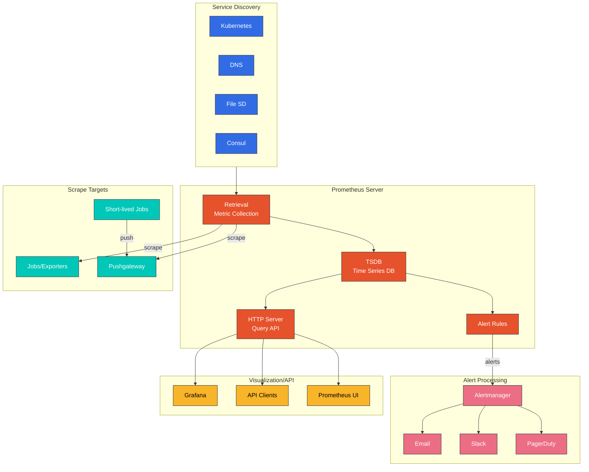
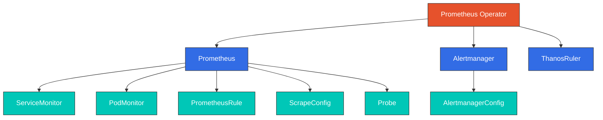

# Prometheus

> **Versiones compatibles**: Prometheus 2.x / 3.x
> **Última actualización**: February 20, 2026

## Tabla de contenidos

- [Introducción](#introduction)
- [Arquitectura](#architecture)
- [Componentes principales](#core-components)
- [Lenguaje de consultas PromQL](#promql-query-language)
- [Descubrimiento de servicios](#service-discovery)
- [Prometheus Operator](#prometheus-operator)
- [Instalación de kube-prometheus-stack](#kube-prometheus-stack-installation)
- [Integración de Alertmanager](#alertmanager-integration)
- [Escritura remota e integración de AMP](#remote-write-and-amp-integration)
- [Ajuste del rendimiento](#performance-tuning)
- [Prácticas recomendadas](#best-practices)
- [Solución de problemas](#troubleshooting)

## Introducción

Prometheus es un conjunto de herramientas de monitorización y alertas de sistemas de código abierto desarrollado originalmente en SoundCloud y donado a la CNCF (Cloud Native Computing Foundation). Se ha convertido en la solución de monitorización estándar de facto en entornos Kubernetes.

### Características principales

1. **Modelo de datos multidimensional**: Series temporales identificadas por el nombre de la métrica y pares clave-valor (labels)
2. **PromQL**: Lenguaje de consultas flexible que aprovecha datos multidimensionales
3. **Recopilación basada en pull**: Obtiene periódicamente métricas de los targets mediante HTTP
4. **Descubrimiento de servicios**: Descubrimiento automático de targets de monitorización en entornos dinámicos como Kubernetes
5. **Gestión de alertas**: Definición de alertas basada en reglas y enrutamiento mediante Alertmanager
6. **Servidor independiente**: Funciona como un único servidor sin dependencias de almacenamiento distribuido

### Cuándo es adecuado Prometheus

- Registro de series temporales puramente numéricas
- Monitorización centrada en máquinas y arquitecturas orientadas a servicios muy dinámicas
- Recopilación y consulta de datos multidimensionales
- Cuando una visión general del sistema es más importante que una precisión del 100 %

### Cuándo no es adecuado Prometheus

- Registro de eventos o tracing
- Casos que requieren una precisión del 100 %, como la facturación por solicitud
- Retención de datos a largo plazo (requiere almacenamiento independiente a largo plazo)

## Arquitectura



### Flujo de datos

1. **Descubrimiento de servicios**: Descubre targets de scrape desde la API de Kubernetes, DNS, archivos, etc.
2. **Recopilación de métricas**: Obtiene métricas del endpoint `/metrics` del target mediante HTTP
3. **Almacenamiento de datos**: Almacena las métricas recopiladas en la TSDB local
4. **Evaluación de reglas**: Evalúa las reglas de alerta y de registro con respecto a los datos almacenados
5. **Envío de alertas**: Envía las alertas activadas a Alertmanager
6. **Servicio de consultas**: Procesa consultas PromQL mediante la API HTTP

## Componentes principales

### TSDB (Time Series Database)

La base de datos de series temporales integrada de Prometheus está diseñada para almacenar eficazmente datos de series temporales.

```yaml
# TSDB-related configuration
storage:
  tsdb:
    path: /prometheus               # Data storage path
    retention.time: 15d             # Data retention period
    retention.size: 50GB            # Maximum storage size
    wal-compression: true           # Enable WAL compression
    min-block-duration: 2h          # Minimum block size
    max-block-duration: 36h         # Maximum block size (10% of retention recommended)
```

**Estructura de bloques de TSDB**:
```
data/
├── 01BKGV7JBM69T2G1BGBGM6KB12/   # 2-hour block
│   ├── chunks/                    # Time series data
│   │   └── 000001
│   ├── tombstones                 # Deleted data
│   ├── index                      # Label index
│   └── meta.json                  # Block metadata
├── 01BKGV7JC0RY8A6MACW02A2PJD/   # Another block
├── chunks_head/                   # Currently writing data
│   └── 000001
├── wal/                          # Write-Ahead Log
│   ├── 00000000
│   └── 00000001
└── lock                          # Process lock
```

### kube-state-metrics

Un servicio que genera métricas sobre objetos de la API de Kubernetes.

```yaml
apiVersion: apps/v1
kind: Deployment
metadata:
  name: kube-state-metrics
  namespace: monitoring
spec:
  replicas: 1
  selector:
    matchLabels:
      app: kube-state-metrics
  template:
    metadata:
      labels:
        app: kube-state-metrics
    spec:
      serviceAccountName: kube-state-metrics
      containers:
      - name: kube-state-metrics
        image: registry.k8s.io/kube-state-metrics/kube-state-metrics:v2.10.1
        ports:
        - name: http-metrics
          containerPort: 8080
        - name: telemetry
          containerPort: 8081
        resources:
          requests:
            cpu: 10m
            memory: 128Mi
          limits:
            cpu: 100m
            memory: 256Mi
```

**Métricas principales**:
```promql
# Pod status metrics
kube_pod_status_phase{phase="Running"}
kube_pod_container_status_restarts_total
kube_pod_container_resource_requests{resource="cpu"}
kube_pod_container_resource_limits{resource="memory"}

# Deployment metrics
kube_deployment_spec_replicas
kube_deployment_status_replicas_available
kube_deployment_status_replicas_unavailable

# Node metrics
kube_node_status_condition{condition="Ready"}
kube_node_status_allocatable{resource="cpu"}
```

### node-exporter

Un exporter que expone métricas de hardware y sistema operativo a nivel de host.

```yaml
apiVersion: apps/v1
kind: DaemonSet
metadata:
  name: node-exporter
  namespace: monitoring
spec:
  selector:
    matchLabels:
      app: node-exporter
  template:
    metadata:
      labels:
        app: node-exporter
    spec:
      hostNetwork: true
      hostPID: true
      containers:
      - name: node-exporter
        image: prom/node-exporter:v1.7.0
        args:
          - --path.procfs=/host/proc
          - --path.sysfs=/host/sys
          - --path.rootfs=/host/root
          - --collector.filesystem.mount-points-exclude=^/(dev|proc|sys|var/lib/docker/.+)($|/)
          - --collector.netclass.ignored-devices=^(veth.*|docker.*|br-.*)$
        ports:
        - name: metrics
          containerPort: 9100
        volumeMounts:
        - name: proc
          mountPath: /host/proc
          readOnly: true
        - name: sys
          mountPath: /host/sys
          readOnly: true
        - name: root
          mountPath: /host/root
          readOnly: true
          mountPropagation: HostToContainer
        resources:
          requests:
            cpu: 10m
            memory: 32Mi
          limits:
            cpu: 100m
            memory: 64Mi
      volumes:
      - name: proc
        hostPath:
          path: /proc
      - name: sys
        hostPath:
          path: /sys
      - name: root
        hostPath:
          path: /
      tolerations:
      - operator: Exists
```

**Métricas principales**:
```promql
# CPU metrics
node_cpu_seconds_total{mode="idle"}
rate(node_cpu_seconds_total{mode!="idle"}[5m])

# Memory metrics
node_memory_MemTotal_bytes
node_memory_MemAvailable_bytes
node_memory_Buffers_bytes
node_memory_Cached_bytes

# Disk metrics
node_filesystem_size_bytes
node_filesystem_avail_bytes
node_disk_io_time_seconds_total

# Network metrics
node_network_receive_bytes_total
node_network_transmit_bytes_total
```

## Lenguaje de consultas PromQL

PromQL (Prometheus Query Language) es el lenguaje de consultas funcional de Prometheus.

### Consultas básicas

```promql
# Instant vector: value at current time
http_requests_total

# Label filtering
http_requests_total{method="GET"}
http_requests_total{status=~"2.."}           # Regex match
http_requests_total{status!~"5.."}           # Negative regex

# Range vector: values over time range
http_requests_total[5m]                       # All samples in last 5 minutes
http_requests_total[1h:5m]                    # Samples at 5 minute intervals over 1 hour

# Offset modifier
http_requests_total offset 1h                 # Value from 1 hour ago
rate(http_requests_total[5m] offset 1h)       # 5 minute rate from 1 hour ago
```

### Operadores de agregación

```promql
# sum: Total
sum(http_requests_total)
sum by (method)(http_requests_total)          # Sum by method
sum without (instance)(http_requests_total)   # Sum excluding instance

# avg: Average
avg(node_cpu_seconds_total)

# count: Count
count(kube_pod_status_phase{phase="Running"})

# min/max: Minimum/Maximum
max(node_memory_MemAvailable_bytes)

# topk/bottomk: Top/bottom k
topk(5, sum by (pod)(rate(container_cpu_usage_seconds_total[5m])))

# quantile: Quantile
quantile(0.95, http_request_duration_seconds)

# stddev/stdvar: Standard deviation/variance
stddev(rate(http_requests_total[5m]))
```

### Funciones de tasa e incremento

```promql
# rate: Average per-second rate of increase (for Counters)
rate(http_requests_total[5m])

# irate: Instant rate between last two samples
irate(http_requests_total[5m])

# increase: Total increase over time range
increase(http_requests_total[1h])

# delta: Difference between first and last values (for Gauges)
delta(temperature_celsius[1h])

# deriv: Per-second rate of change (for Gauges, linear regression)
deriv(temperature_celsius[1h])
```

### Funciones de predicción

```promql
# predict_linear: Linear regression based future value prediction
predict_linear(node_filesystem_avail_bytes[6h], 24*60*60)  # Predict 24 hours ahead

# Disk space exhaustion prediction alert
predict_linear(node_filesystem_avail_bytes{mountpoint="/"}[6h], 24*60*60) < 0
```

### Ejemplos prácticos de consultas

```promql
# CPU usage (%)
100 - (avg by (instance)(irate(node_cpu_seconds_total{mode="idle"}[5m])) * 100)

# Memory usage (%)
100 * (1 - node_memory_MemAvailable_bytes / node_memory_MemTotal_bytes)

# Pod restart count increase
increase(kube_pod_container_status_restarts_total[1h]) > 3

# HTTP error rate (%)
100 * sum(rate(http_requests_total{status=~"5.."}[5m]))
/ sum(rate(http_requests_total[5m]))

# p95 latency
histogram_quantile(0.95,
  sum by (le)(rate(http_request_duration_seconds_bucket[5m]))
)

# Disk usage
100 - (node_filesystem_avail_bytes{mountpoint="/"}
/ node_filesystem_size_bytes{mountpoint="/"} * 100)
```

## Descubrimiento de servicios

### Descubrimiento de servicios de Kubernetes

Prometheus descubre automáticamente targets de monitorización mediante la API de Kubernetes.

```yaml
scrape_configs:
  # Pod auto-discovery
  - job_name: 'kubernetes-pods'
    kubernetes_sd_configs:
      - role: pod
    relabel_configs:
      # Only scrape pods with prometheus.io/scrape annotation
      - source_labels: [__meta_kubernetes_pod_annotation_prometheus_io_scrape]
        action: keep
        regex: true
      # Custom metrics path
      - source_labels: [__meta_kubernetes_pod_annotation_prometheus_io_path]
        action: replace
        target_label: __metrics_path__
        regex: (.+)
      # Custom port
      - source_labels: [__address__, __meta_kubernetes_pod_annotation_prometheus_io_port]
        action: replace
        regex: ([^:]+)(?::\d+)?;(\d+)
        replacement: $1:$2
        target_label: __address__
      # Add labels
      - source_labels: [__meta_kubernetes_namespace]
        target_label: namespace
      - source_labels: [__meta_kubernetes_pod_name]
        target_label: pod
```

### Scraping basado en anotaciones de Pod

```yaml
apiVersion: v1
kind: Pod
metadata:
  name: my-app
  annotations:
    prometheus.io/scrape: "true"       # Enable scraping
    prometheus.io/port: "8080"         # Metrics port
    prometheus.io/path: "/metrics"     # Metrics path
    prometheus.io/scheme: "http"       # http or https
spec:
  containers:
  - name: app
    image: my-app:latest
    ports:
    - containerPort: 8080
```

## Prometheus Operator

Prometheus Operator es un controlador para gestionar Prometheus de forma declarativa en Kubernetes.

### Definiciones de recursos personalizados (CRD)



### ServiceMonitor

```yaml
apiVersion: monitoring.coreos.com/v1
kind: ServiceMonitor
metadata:
  name: example-app
  namespace: monitoring
  labels:
    team: frontend
spec:
  # Target service selection
  selector:
    matchLabels:
      app: example-app

  # Target namespaces
  namespaceSelector:
    matchNames:
    - production
    - staging

  # Endpoint configuration
  endpoints:
  - port: web
    interval: 30s
    scrapeTimeout: 10s
    path: /metrics
    scheme: http

    # Label rewriting
    relabelings:
    - sourceLabels: [__meta_kubernetes_pod_name]
      targetLabel: pod
    - sourceLabels: [__meta_kubernetes_namespace]
      targetLabel: namespace

    # Metric filtering
    metricRelabelings:
    - sourceLabels: [__name__]
      regex: 'go_.*'
      action: drop
```

### PrometheusRule

```yaml
apiVersion: monitoring.coreos.com/v1
kind: PrometheusRule
metadata:
  name: kubernetes-alerts
  namespace: monitoring
  labels:
    role: alert-rules
spec:
  groups:
  - name: kubernetes-system
    interval: 30s
    rules:
    # Node memory high alert
    - alert: NodeMemoryHigh
      expr: |
        (node_memory_MemTotal_bytes - node_memory_MemAvailable_bytes)
        / node_memory_MemTotal_bytes * 100 > 90
      for: 5m
      labels:
        severity: warning
        team: infrastructure
      annotations:
        summary: "Node {{ $labels.instance }} memory usage is high"
        description: "Memory usage is {{ printf \"%.2f\" $value }}%"
        runbook_url: "https://wiki.example.com/runbooks/node-memory-high"

    # Pod restart alert
    - alert: PodRestartingFrequently
      expr: increase(kube_pod_container_status_restarts_total[1h]) > 5
      for: 10m
      labels:
        severity: warning
      annotations:
        summary: "Pod {{ $labels.namespace }}/{{ $labels.pod }} is restarting frequently"
        description: "Pod has restarted {{ $value }} times in the last hour"
```

## Instalación de kube-prometheus-stack

kube-prometheus-stack es un Helm chart integral que incluye Prometheus, Alertmanager, Grafana y componentes relacionados.

### Instalación con Helm

```bash
# Add Helm repository
helm repo add prometheus-community https://prometheus-community.github.io/helm-charts
helm repo update

# Basic installation
helm install prometheus prometheus-community/kube-prometheus-stack \
  --namespace monitoring \
  --create-namespace

# Installation with custom values
helm install prometheus prometheus-community/kube-prometheus-stack \
  --namespace monitoring \
  --create-namespace \
  -f values.yaml
```

### Ejemplo de values.yaml

```yaml
# Prometheus configuration
prometheus:
  prometheusSpec:
    # Replicas
    replicas: 2

    # Retention period
    retention: 15d
    retentionSize: 50GB

    # Storage
    storageSpec:
      volumeClaimTemplate:
        spec:
          storageClassName: gp3
          accessModes: ["ReadWriteOnce"]
          resources:
            requests:
              storage: 100Gi

    # Resources
    resources:
      requests:
        cpu: 500m
        memory: 2Gi
      limits:
        cpu: 2000m
        memory: 8Gi

    # Remote Write
    remoteWrite:
    - url: http://victoriametrics:8428/api/v1/write
      queueConfig:
        maxSamplesPerSend: 10000
        batchSendDeadline: 5s

    # External labels
    externalLabels:
      cluster: production

    # Collect ServiceMonitors from all namespaces
    serviceMonitorSelectorNilUsesHelmValues: false
    podMonitorSelectorNilUsesHelmValues: false
    ruleSelectorNilUsesHelmValues: false

# Alertmanager configuration
alertmanager:
  alertmanagerSpec:
    replicas: 3
    storage:
      volumeClaimTemplate:
        spec:
          storageClassName: gp3
          accessModes: ["ReadWriteOnce"]
          resources:
            requests:
              storage: 10Gi

# Grafana configuration
grafana:
  enabled: true
  replicas: 1

  persistence:
    enabled: true
    storageClassName: gp3
    size: 10Gi

  # Additional data sources
  additionalDataSources:
  - name: VictoriaMetrics
    type: prometheus
    url: http://victoriametrics:8428
    access: proxy
    isDefault: false
```

## Integración de Alertmanager

### AlertmanagerConfig

```yaml
apiVersion: monitoring.coreos.com/v1alpha1
kind: AlertmanagerConfig
metadata:
  name: main-config
  namespace: monitoring
  labels:
    alertmanagerConfig: main
spec:
  # Routing configuration
  route:
    receiver: 'default'
    groupBy: ['alertname', 'namespace', 'severity']
    groupWait: 30s
    groupInterval: 5m
    repeatInterval: 4h

    routes:
    # Critical alerts -> PagerDuty
    - receiver: 'pagerduty-critical'
      matchers:
      - name: severity
        matchType: =
        value: critical
      groupWait: 10s
      repeatInterval: 1h

    # Warning alerts -> Slack
    - receiver: 'slack-warnings'
      matchers:
      - name: severity
        matchType: =
        value: warning
      groupWait: 1m
      repeatInterval: 4h

  # Receivers
  receivers:
  - name: 'default'
    emailConfigs:
    - to: 'alerts@example.com'
      from: 'alertmanager@example.com'
      smarthost: 'smtp.example.com:587'
      authUsername: 'alertmanager'
      authPassword:
        name: alertmanager-smtp
        key: password
      requireTLS: true

  - name: 'slack-warnings'
    slackConfigs:
    - apiURL:
        name: alertmanager-slack
        key: webhook-url
      channel: '#alerts'
      sendResolved: true

  - name: 'pagerduty-critical'
    pagerdutyConfigs:
    - routingKey:
        name: alertmanager-pagerduty
        key: routing-key
      sendResolved: true
```

## Escritura remota e integración de AMP

### Integración de Amazon Managed Prometheus (AMP)

```yaml
# Prometheus configuration
apiVersion: monitoring.coreos.com/v1
kind: Prometheus
metadata:
  name: prometheus
  namespace: monitoring
spec:
  # IRSA service account
  serviceAccountName: prometheus-amp

  # Remote Write to AMP
  remoteWrite:
  - url: https://aps-workspaces.ap-northeast-2.amazonaws.com/workspaces/ws-xxxxxxxx-xxxx-xxxx-xxxx-xxxxxxxxxxxx/api/v1/remote_write
    sigv4:
      region: ap-northeast-2
    queueConfig:
      maxSamplesPerSend: 1000
      maxShards: 200
      capacity: 2500
    writeRelabelConfigs:
    # Exclude unnecessary metrics
    - sourceLabels: [__name__]
      regex: 'go_.*'
      action: drop
```

### Configuración de IRSA

```bash
# Create IAM policy
cat <<EOF > amp-policy.json
{
    "Version": "2012-10-17",
    "Statement": [
        {
            "Effect": "Allow",
            "Action": [
                "aps:RemoteWrite",
                "aps:QueryMetrics",
                "aps:GetSeries",
                "aps:GetLabels",
                "aps:GetMetricMetadata"
            ],
            "Resource": "*"
        }
    ]
}
EOF

aws iam create-policy \
  --policy-name AmazonManagedPrometheusPolicy \
  --policy-document file://amp-policy.json

# Create service account (using eksctl)
eksctl create iamserviceaccount \
  --name prometheus-amp \
  --namespace monitoring \
  --cluster my-cluster \
  --attach-policy-arn arn:aws:iam::123456789012:policy/AmazonManagedPrometheusPolicy \
  --approve
```

## Ajuste del rendimiento

### Optimización de memoria

```yaml
apiVersion: monitoring.coreos.com/v1
kind: Prometheus
metadata:
  name: prometheus
spec:
  # Memory limits
  resources:
    requests:
      memory: 2Gi
    limits:
      memory: 8Gi

  # Query limits
  query:
    maxConcurrency: 20          # Max concurrent queries
    maxSamples: 50000000        # Max samples per query
    timeout: 2m                 # Query timeout

  # WAL compression
  walCompression: true
```

### Optimización del scrape

```yaml
scrape_configs:
- job_name: 'high-cardinality-app'
  scrape_interval: 60s           # Increase interval
  scrape_timeout: 30s
  sample_limit: 10000            # Limit sample count

  metric_relabel_configs:
  # Remove unnecessary metrics
  - source_labels: [__name__]
    regex: 'go_.*|process_.*'
    action: drop

  # Remove high cardinality labels
  - regex: 'pod_template_hash|controller_revision_hash'
    action: labeldrop
```

## Prácticas recomendadas

### Configuración de alta disponibilidad

```yaml
apiVersion: monitoring.coreos.com/v1
kind: Prometheus
metadata:
  name: prometheus
spec:
  # Run 2 replicas
  replicas: 2

  # Pod anti-affinity
  affinity:
    podAntiAffinity:
      requiredDuringSchedulingIgnoredDuringExecution:
      - labelSelector:
          matchLabels:
            app.kubernetes.io/name: prometheus
        topologyKey: kubernetes.io/hostname

  # Sharding (for large environments)
  shards: 2

  # External labels (for deduplication)
  externalLabels:
    cluster: production
    replica: $(POD_NAME)
```

### Directrices para reglas de alerta

```yaml
# Good alert rule example
- alert: HighErrorRate
  # Meaningful threshold
  expr: |
    sum(rate(http_requests_total{status=~"5.."}[5m])) by (service)
    / sum(rate(http_requests_total[5m])) by (service) > 0.01
  # Appropriate wait time (noise prevention)
  for: 5m
  labels:
    # Severity level
    severity: warning
    # Owning team
    team: backend
  annotations:
    # Clear summary
    summary: "High error rate on {{ $labels.service }}"
    # Detailed description
    description: |
      Service {{ $labels.service }} has error rate of {{ printf "%.2f" $value }}%.
      This is above the 1% threshold.
    # Runbook link
    runbook_url: "https://wiki.example.com/runbooks/high-error-rate"
```

## Solución de problemas

### Problemas comunes

#### 1. Memoria agotada (OOMKilled)

```bash
# Check current memory usage
kubectl top pod -n monitoring prometheus-prometheus-0

# Check TSDB status
curl -s http://prometheus:9090/api/v1/status/tsdb | jq .

# Solution: Increase memory limit or reduce retention period
```

#### 2. Cardinalidad alta

```promql
# Find high cardinality metrics
topk(10, count by (__name__)({__name__=~".+"}))

# Check label combinations for specific metric
count(http_requests_total)

# Solution: Use metric_relabel_configs to remove unnecessary labels/metrics
```

#### 3. Fallos de scrape

```bash
# Check target status
curl -s http://prometheus:9090/api/v1/targets | jq '.data.activeTargets[] | select(.health != "up")'

# Directly check target metrics
kubectl exec -it prometheus-prometheus-0 -n monitoring -- \
  wget -qO- http://target-service:8080/metrics | head -20

# Solution: Check network policies, RBAC, service endpoints
```

### Comandos de depuración

```bash
# Check Prometheus logs
kubectl logs -f prometheus-prometheus-0 -n monitoring

# Prometheus API status
curl http://prometheus:9090/api/v1/status/config
curl http://prometheus:9090/api/v1/status/flags
curl http://prometheus:9090/api/v1/status/runtimeinfo

# TSDB status
curl http://prometheus:9090/api/v1/status/tsdb

# Target metadata
curl http://prometheus:9090/api/v1/targets/metadata

# Rule status
curl http://prometheus:9090/api/v1/rules

# Alert status
curl http://prometheus:9090/api/v1/alerts
```

## Referencias

- [Documentación oficial de Prometheus](https://prometheus.io/docs/)
- [Documentación de Prometheus Operator](https://prometheus-operator.dev/)
- [Guía rápida de PromQL](https://promlabs.com/promql-cheat-sheet/)
- [Chart de kube-prometheus-stack](https://github.com/prometheus-community/helm-charts/tree/main/charts/kube-prometheus-stack)
- [Prácticas recomendadas de Prometheus](https://prometheus.io/docs/practices/)

## Cuestionario

Para comprobar su comprensión de este capítulo, pruebe el [Cuestionario de Prometheus](../../quizzes/observability/metrics/01-prometheus-quiz.md).
