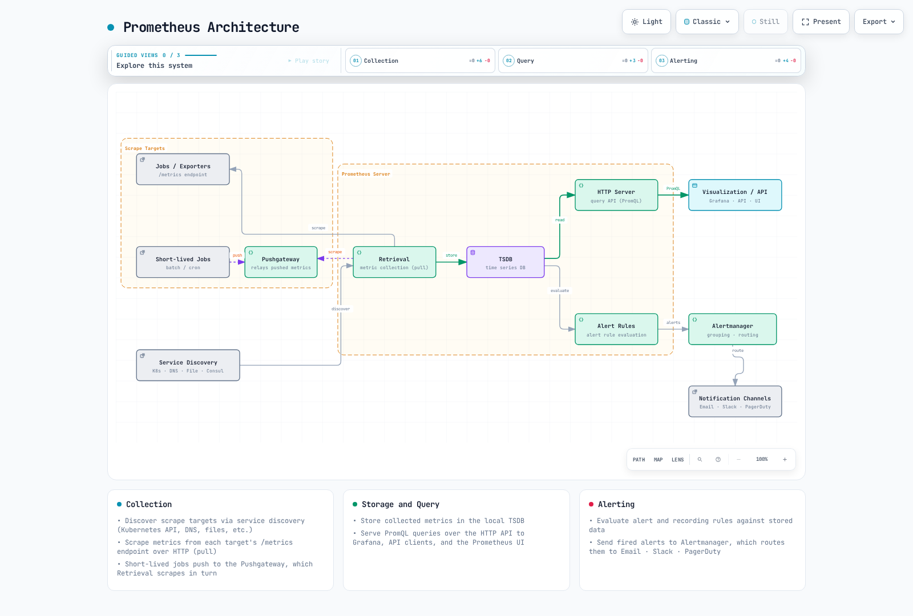
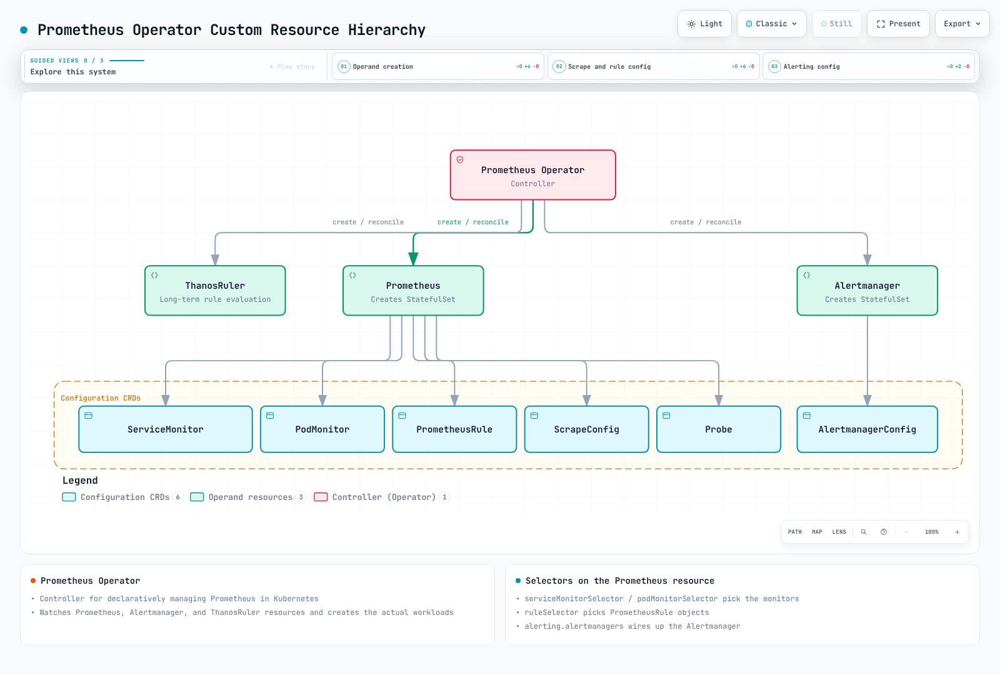

# Prometheus

> **Última actualización**: September 13, 2026. A continuación se describen las comprobaciones locales de configuración/consultas; no se realizó ningún despliegue en clúster ni en la nube.

## Contenido

- [Introducción y versiones](#introduction-and-versions)
- [Arquitectura y componentes](#architecture-and-components)
- [PromQL](#promql)
- [Descubrimiento y selectores del Operator](#discovery-and-operator-selectors)
- [Instalación de kube-prometheus-stack](#kube-prometheus-stack-installation)
- [Reglas y Alertmanager](#rules-and-alertmanager)
- [Remote write y AMP](#remote-write-and-amp)
- [Rendimiento, HA y solución de problemas](#performance-ha-and-troubleshooting)

## Introducción y versiones

Prometheus es el conjunto de herramientas de monitoreo de la CNCF desarrollado originalmente en SoundCloud. Recopila series temporales numéricas, las almacena en una TSDB local, evalúa PromQL y reglas de registro (recording) y de alerta, y envía alertas a Alertmanager. La recopilación normal usa scraping por HTTP; remote write y las integraciones por lotes opcionales añaden otras rutas de entrega. No es un registro de eventos, un almacén de trazas ni un libro contable exacto de facturación por solicitud.

La retención local es configurable y puede superar los 30 días. Un almacén separado es una decisión motivada por la retención, la capacidad, las consultas compartidas y los requisitos de fallo/recuperación.

Este capítulo usa el paquete oficial **kube-prometheus-stack 90.0.0**, publicado el 6 de septiembre de 2026. Las versiones de sus componentes se inspeccionaron como un conjunto:

| Componente | Valor por defecto del paquete |
|---|---|
| Prometheus Operator | 0.93.1 |
| Prometheus | 3.14.0, imagen distroless |
| Alertmanager | 0.34.0 |
| Grafana | 13.2.1, subchart 13.2.2 |
| kube-state-metrics | 2.20.0, subchart 8.4.2 |
| node-exporter | 1.12.1, subchart 4.56.3 |

La protección `kubeVersion` del chart es `>=1.25.0-0`. Esto no es una matriz de compatibilidad completa ni una afirmación de que todas las versiones de Kubernetes 1.25+ sigan siendo compatibles. Revise el clúster real, el soporte de los componentes, la política de admisión y el controlador de almacenamiento.

El perfil está orientado a **workers de EKS con Linux sobre EC2**. Fargate no tiene DaemonSets; Auto Mode, Hybrid Nodes y Windows requieren comprobaciones de recolector/almacenamiento específicas de la plataforma.

### Actualizaciones históricas de julio de 2026

- El [artículo del 14 de julio sobre exporters de Kubernetes](https://kubernetes.io/blog/2026/07/14/custom-metrics-exporter-kubernetes/) explica la instrumentación de aplicaciones y los exporters personalizados. El uso de HPA también requiere la API/adaptador de métricas adecuado; el scraping por sí solo no conecta métricas arbitrarias con HPA.
- El [anuncio de AMP del 21 de julio](https://aws.amazon.com/about-aws/whats-new/2026/07/amazon-managed-service-prometheus-1500m-metrics-workspace/) describe hasta 1500 millones de series activas y 200 000 reglas de registro/alerta por workspace. Son límites de escalado anunciados, no cuotas por defecto concedidas automáticamente ni garantías de aprobación. Revise las cuotas actuales del workspace/cuenta previstos.

## Arquitectura y componentes



[Diagrama interactivo](https://www.atomai.click/kubernetes-docs/archmaps/en-observability-metrics-01-prometheus-0.html)

La rama de Pushgateway es opcional para trabajos por lotes adecuados a nivel de servicio, no para cada Pod de corta duración. Los grupos necesitan gestión de ciclo de vida; consulte la [visión general de métricas](README.md). `up` informa del estado del scraping, no de la disponibilidad de la aplicación.

| Componente | Responsabilidad y prerrequisitos |
|---|---|
| Prometheus | Descubrimiento, scraping, TSDB local, API de consultas y evaluación de reglas |
| kube-state-metrics | Estado de los objetos de la API; necesita ServiceAccount, RBAC y un endpoint de scraping |
| node-exporter | Métricas del sistema operativo del host; requiere revisar el acceso/montajes del host y el soporte de la plataforma |
| kubelet/cAdvisor | Mediciones de contenedores; verifique los certificados de servicio, la autorización y la disponibilidad del endpoint |
| metrics-server / adaptadores | APIs de métricas de recursos/personalizadas para el autoescalado; independientes del almacenamiento histórico en TSDB |
| Alertmanager | Agrupa, deduplica, inhibe y enruta alertas a los receptores configurados |
| Grafana | Consulta/visualiza fuentes de datos; la autenticación y la base de datos/almacenamiento requieren su propia configuración |

El chart proporciona los exporters y los recursos de apoyo. Los fragmentos incompletos de Deployment/DaemonSet independientes no aportan los ServiceAccounts, RBAC y Services que falten, y no deberían crear una pila de monitoreo duplicada.

### Capas de TSDB y de configuración

Las muestras recientes usan el head/WAL; los bloques compactados contienen chunks, un índice y metadatos. Las tombstones marcan rangos eliminados. La reproducción del WAL ayuda en la recuperación tras caídas, pero no sustituye a las copias de seguridad, no sobrevive a la pérdida del volumen ni garantiza la recuperación de todos los eventos.

| Capa | Ajustes correctos |
|---|---|
| Flags del proceso | `--storage.tsdb.path`, `--storage.tsdb.retention.time`, `--storage.tsdb.retention.size` |
| Configuración de Prometheus | `global`, `scrape_configs`, `rule_files`, `remote_write` |
| `Prometheus.spec` del Operator | `retention`, `retentionSize`, `storage`, `replicas`, `shards` |
| Valores de este chart | `prometheus.prometheusSpec.retention`, `storageSpec` y los valores siguientes |

El antiguo YAML `storage.tsdb.path/retention.time/...` no es configuración válida del proceso. En una **instalación independiente separada**, los flags básicos tienen este aspecto:

```sh
prometheus --config.file=prometheus.yml \
  --storage.tsdb.path=/prometheus \
  --storage.tsdb.retention.time=15d \
  --storage.tsdb.retention.size=15GB
```

Para la instalación con el Operator, configure los valores de Helm propietarios. El tamaño de retención no es un límite rígido del disco total: deje espacio para el WAL, el head, los índices y la compactación. Use almacenamiento local/de bloques compatible; un NFS arbitrario no es un sustituto admitido.

## PromQL

Los ejemplos asumen `job="example-app"` y las etiquetas de job de node-exporter/kube-state-metrics del chart. Adáptelos a los targets reales. `example_queue_depth` y `temperature_celsius` son gauges definidos por la aplicación, no métricas integradas de Kubernetes.

### Selectores, rangos y tasas

Los selectores instantáneos usan reglas de lookback/obsolescencia (staleness) para encontrar muestras elegibles; «actual» no garantiza una observación exactamente en el instante de evaluación. Un selector de rango elige un intervalo de muestras. Una subconsulta evalúa una expresión con su resolución, en lugar de seleccionar cada N-ésima muestra cruda almacenada.

| Propósito | PromQL |
|---|---|
| Selector instantáneo | `http_requests_total{job="example-app"}` |
| Filtrado positivo/por regex | `http_requests_total{job="example-app",method="GET",status=~"2[0-9]{2}"}` |
| Regex negativa | `http_requests_total{job="example-app",status!~"5[0-9]{2}"}` |
| Vector de rango | `http_requests_total{job="example-app"}[5m]` |
| Subconsulta de una hora con resolución de cinco minutos | `rate(http_requests_total{job="example-app"}[5m])[1h:5m]` |
| Ventana de tasa una hora antes | `rate(http_requests_total{job="example-app"}[5m] offset 1h)` |
| Tasa media por segundo de un contador | `rate(http_requests_total{job="example-app"}[5m])` |
| Tasa a partir de las dos últimas muestras utilizables | `irate(http_requests_total{job="example-app"}[5m])` |
| Incremento extrapolado del contador | `increase(http_requests_total{job="example-app"}[1h])` |

Los matchers negativos pueden seleccionar series que no tienen la etiqueta. `rate()` e `increase()` gestionan los reinicios observados y extrapolan; no pueden recuperar todos los incrementos perdidos. Aplique la **tasa antes de la agregación**. `irate()` es sensible a las muestras más recientes y suele ser menos adecuado para condiciones de alerta estables.

Un vector de rango es una entrada para funciones de rango, no una gráfica de consulta de rango lista para usar. Por ejemplo, use `rate(counter[5m])` cuando solicite una serie de tasa evaluada.

### Agregación, gauges y tiempo

| Propósito | PromQL |
|---|---|
| Tasa de solicitudes por método | `sum by (method) (rate(http_requests_total{job="example-app"}[5m]))` |
| Agregar eliminando instance | `sum without (instance) (rate(http_requests_total{job="example-app"}[5m]))` |
| Suma de indicadores Running deduplicados | `sum(max by (namespace,pod,uid) (kube_pod_status_phase{job="kube-state-metrics",phase="Running"}))` |
| Memoria disponible máxima | `max(node_memory_MemAvailable_bytes{job="node-exporter"})` |
| CPU de los Pods principales sin etiquetas de contenedor vacías/de infraestructura | `topk(5, sum by (namespace,pod) (rate(container_cpu_usage_seconds_total{job="kubelet",container!="",container!="POD"}[5m])))` |
| Cuantil entre los gauges actuales de profundidad de cola | `quantile(0.95, example_queue_depth{job="example-app"})` |
| Desviación estándar entre tasas | `stddev(rate(http_requests_total{job="example-app"}[5m]))` |
| Cambio extrapolado de un Gauge | `delta(temperature_celsius{job="example-app"}[1h])` |
| Pendiente del Gauge por segundo | `deriv(temperature_celsius{job="example-app"}[1h])` |
| Desviación absoluta respecto a 20 °C | `abs(temperature_celsius{job="example-app"} - 20)` |
| Redondeo hacia arriba | `ceil(example_queue_depth{job="example-app"})` |
| Acotar a un rango | `clamp(example_queue_depth{job="example-app"}, 0, 100)` |
| Raíz cuadrada | `sqrt(example_queue_depth{job="example-app"})` |
| Logaritmo natural | `ln(example_queue_depth{job="example-app"})` |
| Instante de evaluación en segundos Unix | `time()` |
| Marca de tiempo de la muestra seleccionada | `timestamp(up{job="example-app"})` |
| Hora UTC de la muestra | `hour(timestamp(up{job="example-app"}))` |

Contar las series `kube_pod_status_phase{phase="Running"}` también cuenta los ceros. Sumar los indicadores 0/1 después de eliminar las identidades duplicadas del exporter da cero cuando solo existen indicadores en cero, mientras que la telemetría ausente sigue ausente.

El ejemplo de `quantile()` sobre Gauge compara valores entre series. No calcula el p95 de latencia de solicitudes de un histograma ni combina valores p99 de Summary. Las funciones matemáticas tienen límites en su dominio de entrada; por ejemplo, un logaritmo no positivo requiere un tratamiento deliberado. Funciones relacionadas: `floor`, `round`, `clamp_min` y `clamp_max`.

Este filtro de horario laboral está en **UTC**, no en la zona horaria del navegador/clúster:

```promql
sum(rate(http_requests_total{job="example-app"}[5m])) and on() (hour() >= 9 < 18)
```

### Distribuciones y previsiones

```promql
histogram_quantile(0.95, sum by (le) (rate(http_request_duration_seconds_bucket{job="example-app"}[5m])))
```

```promql
histogram_quantile(0.99, sum by (le,method) (rate(http_request_duration_seconds_bucket{job="example-app"}[5m])))
```

```promql
sum(rate(http_request_duration_seconds_sum{job="example-app"}[5m])) / sum(rate(http_request_duration_seconds_count{job="example-app"}[5m]))
```

Agregue buckets clásicos compatibles y conserve `le`. Los cuantiles interpolan dentro de los buckets. Los cuantiles de Summary también son aproximaciones y no pueden promediarse para obtener un percentil de flota; sum/count sí puede calcular una media de flota.

`predict_linear()` extrapola una tendencia ajustada de un Gauge. Una proyección negativa es un motivo para investigar, no un fallo de disco futuro garantizado:

```promql
predict_linear(node_filesystem_avail_bytes{job="node-exporter",mountpoint="/",fstype!~"tmpfs|overlay"}[6h], 86400)
```

Prometheus 3 renombró `holt_winters` a `double_exponential_smoothing`. Se trata de **suavizado lineal de Holt, no de una predicción estacional triple exponencial**, y requiere muestras float de tipo Gauge. Expresión opcional: `double_exponential_smoothing(example_queue_depth{job="example-app"}[1h], 0.5, 0.5)`. El servidor que evalúa necesita `--enable-feature=promql-experimental-functions`. La auditoría local comprobó su sintaxis en el parser; no se afirma que la evaluación de valores experimentales haya sido superada.

### Ejemplos operativos

| Propósito | PromQL |
|---|---|
| Porcentaje de CPU no inactiva | `100 * (1 - avg by (instance) (rate(node_cpu_seconds_total{job="node-exporter",mode="idle"}[5m])))` |
| Proporción no reportada como MemAvailable | `100 * (1 - node_memory_MemAvailable_bytes{job="node-exporter"} / node_memory_MemTotal_bytes{job="node-exporter"})` |
| Incremento estimado de reinicios por encima de tres | `increase(kube_pod_container_status_restarts_total{job="kube-state-metrics"}[1h]) > 3` |
| Porcentaje de espacio no disponible en el sistema de archivos | `100 * (1 - node_filesystem_avail_bytes{job="node-exporter",mountpoint="/"} / node_filesystem_size_bytes{job="node-exporter",mountpoint="/"})` |
| Bytes recibidos + transmitidos por segundo | `rate(node_network_receive_bytes_total{job="node-exporter",device="eth0"}[5m]) + rate(node_network_transmit_bytes_total{job="node-exporter",device="eth0"}[5m])` |

Para el porcentaje de errores, un servicio saludable puede no tener series 5xx. El valor de reserva cero que aparece a continuación existe únicamente para emparejar grupos de tráfico total; no inventa datos saludables para servicios ausentes.

```promql
100 * (sum by (namespace, service) (rate(http_requests_total{job="example-app",status=~"5[0-9]{2}"}[5m])) or on (namespace, service) (0 * (sum by (namespace, service) (rate(http_requests_total{job="example-app"}[5m]))))) / (sum by (namespace, service) (rate(http_requests_total{job="example-app"}[5m])))
```

El tráfico saludable observado da 0, el tráfico totalmente 5xx da 100 y un denominador cero permanece indefinido. La telemetría ausente sigue ausente; monitorice los fallos de recopilación por separado.

## Descubrimiento y selectores del Operator



[Diagrama interactivo](https://www.atomai.click/kubernetes-docs/archmaps/en-observability-metrics-01-prometheus-1.html)

Los nodos Prometheus/Alertmanager de esta figura representan **recursos personalizados** (custom resources). El Operator los lee y reconcilia cargas de trabajo reales, como StatefulSets. Ni los objetos ni el servidor Prometheus crean StatefulSets por sí solos.

| Etapa de selección | Objeto seleccionado |
|---|---|
| Prometheus `serviceMonitorNamespaceSelector` | Namespaces que contienen objetos ServiceMonitor |
| Prometheus `serviceMonitorSelector` | Etiquetas de esos objetos ServiceMonitor |
| ServiceMonitor `namespaceSelector` / `selector` | Namespaces y etiquetas del Service de destino |
| Endpoint `port` del ServiceMonitor | **Nombre del puerto del Service**, no un número arbitrario de puerto de contenedor |
| Selector de PodMonitor / endpoint `port` | Etiquetas del Pod y nombre del puerto de contenedor declarado |

RBAC, el descubrimiento y el acceso de red/TLS son requisitos separados. Los selectores no sustituyen a la autorización. Los booleanos `*SelectorNilUsesHelmValues` de Helm afectan a los valores por defecto de los selectores de etiquetas, no a todos los namespaces de destino.

### Un scraping de aplicación coherente

Suponga un Deployment instrumentado existente en `example-app`, con la etiqueta de Pod `app: example-app` y un puerto declarado llamado `metrics` que sirve `/metrics`. El Service siguiente no crea la aplicación:

```yaml
# service.yaml
apiVersion: v1
kind: Service
metadata:
  name: example-app
  namespace: example-app
  labels:
    app: example-app
    metrics-job: example-app
spec:
  selector:
    app: example-app
  ports:
  - name: http-metrics
    port: 8080
    targetPort: metrics
```

```yaml
# servicemonitor.yaml
apiVersion: monitoring.coreos.com/v1
kind: ServiceMonitor
metadata:
  name: example-app
  namespace: monitoring
  labels:
    release: kube-prom
spec:
  jobLabel: metrics-job
  selector:
    matchLabels:
      app: example-app
  namespaceSelector:
    matchNames:
    - example-app
  endpoints:
  - port: http-metrics
    path: /metrics
    interval: 30s
    scrapeTimeout: 10s
    relabelings:
    - sourceLabels:
      - __meta_kubernetes_service_name
      targetLabel: service
    - sourceLabels:
      - __meta_kubernetes_namespace
      targetLabel: namespace
    - sourceLabels:
      - __meta_kubernetes_pod_name
      targetLabel: pod
```

El `release: kube-prom` del ServiceMonitor coincide con la instalación. Su `jobLabel` lee el `metrics-job: example-app` del Service, estableciendo la etiqueta de job para las consultas de la aplicación.

PodMonitor es una **alternativa** para los mismos Pods. Elija una única ruta de recopilación prevista para un endpoint a fin de evitar la ingesta duplicada:

```yaml
# podmonitor.yaml
apiVersion: monitoring.coreos.com/v1
kind: PodMonitor
metadata:
  name: example-app-pods
  namespace: monitoring
  labels:
    release: kube-prom
spec:
  selector:
    matchLabels:
      app: example-app
  namespaceSelector:
    matchNames:
    - example-app
  podMetricsEndpoints:
  - port: metrics
    interval: 30s
    path: /metrics
    relabelings:
    - targetLabel: job
      replacement: example-app
    - targetLabel: service
      replacement: example-app
```

### Otras rutas de descubrimiento

- El descubrimiento de Pods en modo independiente/agente puede usar la [configuración de puertos con nombre de la visión general](README.md#metric-collection-models), que conserva las direcciones IPv4/IPv6 proporcionadas por el descubrimiento. Una anotación como `prometheus.io/scheme` no tiene efecto a menos que la configuración real la consuma.
- El sondeo blackbox de servicios necesita un exporter instalado, un módulo de sondeo definido, una URL/esquema de destino adecuados y una configuración `Probe`/de scraping. `up` describe el scraping del exporter; el éxito del sondeo es una señal distinta.
- El descubrimiento de nodos alcanza los endpoints de kubelet, no automáticamente node-exporter. Verifique los certificados de servicio, la CA correcta y el RBAC de métricas de nodo. La CA de la API de Kubernetes no acredita la confianza en certificados de nodo arbitrarios.
- Use etiquetas revisadas de namespace/servicio/equipo en lugar de un `labelmap` de nodo sin restricciones. Eliminar etiquetas de identidad no es una operación de agregación.

## Instalación de kube-prometheus-stack

Estos comandos de operador modifican el clúster y **no son comandos ejecutados en la auditoría**. Use el contexto previsto y un release del que sea propietario. En instalaciones existentes, revise los valores reales, las CRDs, el almacenamiento y las notas de actualización en lugar de instalar una pila duplicada.

Prerrequisitos de este perfil:

- Acceso autorizado a Helm/Kubernetes y recursos suficientes en los nodos Linux EC2.
- Una StorageClass/controlador CSI de almacenamiento de bloques por defecto en funcionamiento, o nombres de clase explícitos y revisados para cada PVC. No se garantiza que `gp3` exista.
- Un namespace `monitoring` existente, el controlador Secrets Store CSI y el proveedor de AWS (ASCP) en los nodos Linux EC2. Prepare `observability/grafana-admin` en AWS Secrets Manager (`ap-northeast-2`) con la clave de cadena JSON `admin-password`; no lo sincronice en un Secret de Kubernetes.
- La service account `metrics-demo-grafana` necesita un rol IRSA con alcance limitado a ese secreto. Sustituya el ARN de rol de IAM de ejemplo que aparece abajo y aplique el SecretProviderClass correspondiente. Consulte los [prerrequisitos completos de identidad, KMS, montaje y rotación](https://github.com/Atom-oh/kubernetes-docs/blob/5ff787faed758902c12a74e8429466f434bb26ae/examples/observability/secret-profiles/README.md).
- Confianza TLS de kubelet verificada. Este perfil habilita la verificación de certificados; proporcione la CA adecuada si los certificados usan otro emisor, en lugar de omitir la verificación.

El dimensionamiento es ilustrativo. Cada réplica de Prometheus obtiene su propio PVC; el tamaño de retención no acota el uso de WAL/head/compactación. Grafana se mantiene con una réplica y una base de datos respaldada por un PVC. Aumentar solo las réplicas no constituye HA con base de datos compartida.

```yaml
# kube-prometheus-stack 90.0.0; replace the example IRSA role ARN before use.
fullnameOverride: metrics-demo
kubeControllerManager:
  enabled: false
kubeScheduler:
  enabled: false
kubeEtcd:
  enabled: false
kubeProxy:
  enabled: false
kubelet:
  serviceMonitor:
    tlsConfig:
      insecureSkipVerify: false
prometheus:
  serviceAccount:
    create: true
    name: metrics-demo-prometheus
  prometheusSpec:
    replicas: 1
    shards: 1
    retention: 15d
    retentionSize: 15GB
    storageSpec:
      volumeClaimTemplate:
        spec:
          accessModes:
          - ReadWriteOnce
          resources:
            requests:
              storage: 20Gi
    resources:
      requests:
        cpu: 500m
        memory: 2Gi
      limits:
        memory: 4Gi
    externalLabels:
      cluster: eks-metrics-demo
    serviceMonitorSelectorNilUsesHelmValues: true
    serviceMonitorNamespaceSelector: &id001
      matchExpressions:
      - key: kubernetes.io/metadata.name
        operator: In
        values:
        - monitoring
        - example-app
    podMonitorSelectorNilUsesHelmValues: true
    podMonitorNamespaceSelector: *id001
    ruleSelectorNilUsesHelmValues: true
    ruleNamespaceSelector:
      matchLabels:
        kubernetes.io/metadata.name: monitoring
alertmanager:
  alertmanagerSpec:
    replicas: 1
    storage:
      volumeClaimTemplate:
        spec:
          accessModes:
          - ReadWriteOnce
          resources:
            requests:
              storage: 5Gi
grafana:
  fullnameOverride: metrics-demo-grafana
  replicas: 1
  persistence:
    enabled: true
    size: 10Gi
  sidecar:
    dashboards:
      searchNamespace: monitoring
      skipReload: true
      initDashboards: true
      provider:
        updateIntervalSeconds: 30
    datasources:
      searchNamespace: monitoring
      skipReload: true
      initDatasources: true
  serviceAccount:
    create: true
    name: metrics-demo-grafana
    annotations:
      eks.amazonaws.com/role-arn: arn:aws:iam::111122223333:role/metrics-grafana-secrets
  env:
    GF_SECURITY_ADMIN_USER: admin
    GF_SECURITY_ADMIN_PASSWORD: $__file{/mnt/grafana-secrets/admin-password}
  grafana.ini:
    security:
      admin_user: admin
      admin_password: $__file{/mnt/grafana-secrets/admin-password}
  extraVolumes:
  - name: grafana-secrets
    csi:
      driver: secrets-store.csi.k8s.io
      readOnly: true
      volumeAttributes:
        secretProviderClass: metrics-grafana-admin
  extraVolumeMounts:
  - name: grafana-secrets
    mountPath: /mnt/grafana-secrets
    readOnly: true
```

Este perfil de EKS deshabilita los monitores de los componentes del plano de control gestionados y de los endpoints de kube-proxy, cuya exposición no se asume aquí. No deshabilita Kubernetes en sí. Los ServiceMonitors en `monitoring`/`example-app` necesitan etiquetas de release coincidentes; las reglas se seleccionan desde `monitoring`.

Grafana recibe una **expresión literal del proveedor de ficheros**, no un valor de contraseña, en `GF_SECURITY_ADMIN_PASSWORD`. Esto suprime las referencias automáticas de entorno a credenciales del chart. Grafana 13.2.1 evalúa `$__file{...}` dentro de su configuración después de las sobrescrituras de entorno; ningún punto de entrada `__FILE` ni shell exporta el contenido del fichero. El fichero CSI de solo lectura debe ser legible por el UID/GID 472 (`fsGroup: 472`, modo `0440`), y solo el contenedor principal de Grafana lo monta. Use una contraseña sin espacios en blanco al principio o al final, ya que el proveedor de ficheros los recorta.

Los init containers de dashboards/datasources rellenan los ficheros de aprovisionamiento antes del arranque. Los sidecars siguen vigilando los ficheros, pero usan `skipReload: true`, por lo que ninguno necesita credenciales de administrador. Grafana sondea los ficheros de dashboards cada 30 segundos; **las actualizaciones de datasources requieren un reinicio controlado del Pod**. `admin_password` solo inicializa una base de datos nueva: cambiar el secreto de AWS, la rotación del CSI o un reinicio no restablecen la contraseña de administrador en un PVC/base de datos existente. Use el procedimiento aprobado de cambio de contraseña/SSO y reconcilie el secreto; conserve el PVC.

Use el [perfil reutilizable](https://github.com/Atom-oh/kubernetes-docs/blob/5ff787faed758902c12a74e8429466f434bb26ae/examples/observability/secret-profiles/README.md) completo, incluido `grafana-secret-provider.yaml`. Las pruebas/renderizados locales cubren la configuración y los montajes, no los permisos reales del CSI, el inicio de sesión ni la rotación. Contratos principales: [configuración de Grafana](https://grafana.com/docs/grafana/latest/setup-grafana/configure-grafana/) y [AWS ASCP](https://github.com/aws/secrets-store-csi-driver-provider-aws/blob/main/README.md).

Desde la raíz del repositorio, instale una sola vez tras preparar los prerrequisitos:

```sh
PROFILE=examples/observability/secret-profiles
kubectl apply -f "$PROFILE/grafana-secret-provider.yaml"
helm repo add prometheus-community https://prometheus-community.github.io/helm-charts
helm repo update prometheus-community
helm template kube-prom prometheus-community/kube-prometheus-stack \
  --version 90.0.0 --namespace monitoring -f "$PROFILE/prometheus-values.yaml" \
  > grafana-reviewed-render.yaml
# Review resources, prerequisites and ownership before this cluster-changing command.
helm upgrade --install kube-prom prometheus-community/kube-prometheus-stack \
  --version 90.0.0 --namespace monitoring -f "$PROFILE/prometheus-values.yaml" \
  --wait --timeout 15m
```

Compruebe el establecimiento de las CRDs, la salud del Operator, el binding de los PVC y los targets reales. Aplique el monitor/las reglas de aplicación elegidos solo después de que sus CRDs estén establecidas.

La gestión de la actualización de CRDs del chart depende de la versión. Lea las notas de actualización en lugar de asumir que toda migración de CRD queda cubierta por un simple `helm upgrade`. El chart 90 también cambia la dependencia de Grafana al repositorio de la comunidad; valide los valores existentes de autenticación/aprovisionamiento y conserve copias de seguridad de la base de datos/PVC al actualizar.

## Reglas y Alertmanager

El PrometheusRule seleccionado a continuación contiene ejemplos de alerta y de registro. El registro de CPU usa `rate` y unidades de proporción de forma coherente. La expresión de error es un porcentaje, por lo que el umbral es 1 y la anotación imprime un porcentaje.

```yaml
# prometheusrule.yaml
apiVersion: monitoring.coreos.com/v1
kind: PrometheusRule
metadata:
  name: example-rules
  namespace: monitoring
  labels:
    release: kube-prom
spec:
  groups:
  - name: example-alerts
    interval: 30s
    rules:
    - alert: NodeMemoryHigh
      expr: 100 * (1 - node_memory_MemAvailable_bytes{job="node-exporter"} / node_memory_MemTotal_bytes{job="node-exporter"})
        > 90
      for: 5m
      labels:
        severity: warning
        team: infrastructure
      annotations:
        summary: Node {{ $labels.instance }} memory availability is low
        description: '{{ printf "%.2f" $value }}% is not reported as MemAvailable.'
    - alert: PodRestartingFrequently
      expr: increase(kube_pod_container_status_restarts_total{job="kube-state-metrics"}[1h]) > 5
      for: 10m
      labels:
        severity: warning
      annotations:
        summary: Pod {{ $labels.namespace }}/{{ $labels.pod }} is restarting
        description: '{{ printf "%.2f" $value }} estimated restarts in one hour.'
    - alert: ProjectedDiskExhaustion
      expr: predict_linear(node_filesystem_avail_bytes{job="node-exporter",mountpoint="/",fstype!~"tmpfs|overlay"}[6h],
        86400) < 0
      for: 1h
      labels:
        severity: warning
      annotations:
        summary: Projected disk exhaustion on {{ $labels.instance }}
        description: The fitted six-hour trend projects negative free space in 24 hours; inspect the filesystem
          and workload.
    - alert: HighErrorRate
      expr: (100 * (sum by (namespace, service) (rate(http_requests_total{job="example-app",status=~"5[0-9]{2}"}[5m]))
        or on (namespace, service) (0 * (sum by (namespace, service) (rate(http_requests_total{job="example-app"}[5m])))))
        / (sum by (namespace, service) (rate(http_requests_total{job="example-app"}[5m])))) > 1
      for: 5m
      labels:
        severity: warning
        team: backend
      annotations:
        summary: High error rate on {{ $labels.namespace }}/{{ $labels.service }}
        description: '{{ printf "%.2f" $value }}% of requests are 5xx, above the 1% threshold.'
  - name: example-recording
    rules:
    - record: instance:node_cpu_utilization:ratio_rate5m
      expr: 100 * (1 - avg by (instance) (rate(node_cpu_seconds_total{job="node-exporter",mode="idle"}[5m])))
        / 100
    - record: instance:node_memory_not_available:ratio
      expr: max by (instance) ((1 - node_memory_MemAvailable_bytes{job="node-exporter"} / node_memory_MemTotal_bytes{job="node-exporter"}))
```

`for` significa que el mismo conjunto de etiquetas de alerta debe seguir cumpliendo la expresión a lo largo de las evaluaciones antes de dispararse. La falta de datos o el cambio de etiquetas puede interrumpir el estado pendiente. No es el retardo de notificación ni el intervalo de repetición de Alertmanager. Una alerta de previsión describe una proyección, no un fallo garantizado.

### AlertmanagerConfig y límites de namespace

La CRD AlertmanagerConfig empaquetada con el Operator 0.93.1 sirve **v1alpha1**. Este ejemplo la usa como **configuración global** propiedad del administrador. Los Secrets referenciados deben existir en `monitoring`. Sustituya/apruebe las direcciones, los canales y los destinos del proveedor antes de habilitar la entrega.

La API del Operator marca `alertmanagerConfiguration` como experimental: mantenga el límite de versión y pruebe las actualizaciones. Los AlertmanagerConfigs con namespace seleccionados de forma habitual reciben normalmente matchers de namespace; una configuración en `monitoring` no recibe automáticamente alertas de aplicación de todos los namespaces. La configuración global tiene deliberadamente un límite administrativo más amplio.

```yaml
# alertmanagerconfig.yaml
apiVersion: monitoring.coreos.com/v1alpha1
kind: AlertmanagerConfig
metadata:
  name: main-config
  namespace: monitoring
spec:
  route:
    receiver: default
    groupBy:
    - alertname
    - namespace
    - severity
    groupWait: 30s
    groupInterval: 5m
    repeatInterval: 4h
    routes:
    - receiver: pagerduty-critical
      matchers:
      - name: severity
        matchType: '='
        value: critical
      groupWait: 10s
      repeatInterval: 1h
    - receiver: slack-backend
      matchers:
      - name: team
        matchType: '='
        value: backend
    - receiver: slack-warnings
      matchers:
      - name: severity
        matchType: '='
        value: warning
      groupWait: 1m
  inhibitRules:
  - sourceMatch:
    - name: severity
      matchType: '='
      value: critical
    targetMatch:
    - name: severity
      matchType: '='
      value: warning
    equal:
    - alertname
    - cluster
    - namespace
    - service
    - instance
    - pod
    - container
  receivers:
  - name: default
    emailConfigs:
    - to: alerts@example.com
      from: alertmanager@example.com
      smarthost: smtp.example.com:587
      authUsername: alertmanager
      authPassword:
        name: alertmanager-smtp
        key: password
      requireTLS: true
  - name: slack-backend
    slackConfigs:
    - apiURL:
        name: alertmanager-slack
        key: webhook-url
      channel: '#team-backend-alerts'
      sendResolved: true
  - name: slack-warnings
    slackConfigs:
    - apiURL:
        name: alertmanager-slack
        key: webhook-url
      channel: '#alerts'
      sendResolved: true
  - name: pagerduty-critical
    pagerdutyConfigs:
    - routingKey:
        name: alertmanager-pagerduty
        key: routing-key
      sendResolved: true
```

Por defecto, las rutas hermanas se detienen en la primera coincidencia. Las rutas críticas van primero; la ruta de backend precede a la ruta general de advertencia, de modo que se puede alcanzar. Establezca `continue` de forma deliberada solo cuando se pretendan varias entregas. La inhibición coincide tanto con la identidad del recurso como con el nombre de la alerta: una alerta crítica de un servicio/nodo no debe suprimir una advertencia no relacionada. Elija campos de etiquetas `equal` significativos para sus familias de alertas; las etiquetas ausentes en ambas alertas se consideran iguales.

`groupBy` en el CR se convierte en `group_by` en la configuración nativa de Alertmanager. La agrupación controla los lotes de notificación; no es lo mismo que deduplicar alertas idénticas. `groupWait`, `groupInterval` y `repeatInterval` gobiernan los tiempos de notificación de forma independiente del `for` de un PrometheusRule.

Después de crear los Secrets referenciados y el AlertmanagerConfig, combine este fichero de valores adicional en el **mismo** release fijado:

```yaml
# alerting-values.yaml
alertmanager:
  alertmanagerSpec:
    alertmanagerConfiguration:
      name: main-config
```

```sh
helm upgrade --install kube-prom prometheus-community/kube-prometheus-stack \
  --version 90.0.0 --namespace monitoring \
  -f values.yaml -f alerting-values.yaml --wait --timeout 15m
```

La comprobación del enrutamiento nativo usó nombres de receptores sin enviar notificaciones. La recuperación de secretos, la autenticación con el proveedor y la entrega real de notificaciones siguen requiriendo una verificación controlada.

## Remote write y AMP

Remote write reenvía muestras de forma asíncrona a un backend configurado. No entrega alertas, no garantiza un almacenamiento en búfer ilimitado ni sustituye a una copia de seguridad. Monitorice el backlog, los reintentos y los límites del receptor. Conserve las distribuciones completas de los histogramas a menos que una política revisada de agregación/descarte establezca las consecuencias.

### Ingesta en AMP con alcance limitado

Los identificadores de cuenta y de workspace que aparecen abajo son **marcadores sintéticos**. Sustituya de forma coherente la Región/cuenta/workspace aprobados en el endpoint, el recurso de IAM y la anotación del rol. Un rol de ingesta solo necesita `aps:RemoteWrite` para ese workspace; los permisos de consulta corresponden al cliente de consultas adecuado, no automáticamente al recolector.

```json
{
  "Version": "2012-10-17",
  "Statement": [
    {
      "Effect": "Allow",
      "Action": "aps:RemoteWrite",
      "Resource": "arn:aws:aps:ap-northeast-2:111122223333:workspace/ws-11111111-1111-4111-8111-111111111111"
    }
  ]
}
```

Cree/gestione el rol a través del propietario de IaC existente del entorno. En el ejemplo de IRSA, su relación de confianza debe referenciar el proveedor OIDC de IAM del clúster previsto y exigir tanto la audiencia `sts.amazonaws.com` como el sujeto `system:serviceaccount:monitoring:metrics-demo-prometheus`. Una URL de emisor OIDC por sí sola no demuestra que el proveedor/la confianza de IAM existan.

Helm es propietario de la ServiceAccount y de la anotación de este perfil. Evite crear además la misma ServiceAccount mediante un segundo propietario. Si reutiliza una cuenta existente, reconcilie la propiedad y el ajuste `create` del chart. EKS Pod Identity es otro diseño de entrega de credenciales; configúrelo y verifíquelo por separado en lugar de mezclar supuestos incompatibles.

```yaml
# amp-values.yaml
prometheus:
  serviceAccount:
    create: true
    name: metrics-demo-prometheus
    annotations:
      eks.amazonaws.com/role-arn: arn:aws:iam::111122223333:role/metrics-prometheus-amp
  prometheusSpec:
    replicas: 2
    shards: 1
    podAntiAffinity: hard
    podAntiAffinityTopologyKey: kubernetes.io/hostname
    replicaExternalLabelName: __replica__
    externalLabels:
      cluster: eks-metrics-demo
    remoteWrite:
    - url: https://aps-workspaces.ap-northeast-2.amazonaws.com/workspaces/ws-11111111-1111-4111-8111-111111111111/api/v1/remote_write
      sigv4:
        region: ap-northeast-2
      queueConfig:
        capacity: 10000
        maxSamplesPerSend: 2000
        maxShards: 10
```

Combine el fichero opcional de AMP con los valores base en el mismo release tras verificar la identidad/el workspace. Dos réplicas con antiafinidad estricta de nodo necesitan al menos dos nodos adecuados y PVCs por réplica en funcionamiento.

La deduplicación de HA de AMP espera `cluster` y `__replica__`. El `replicaExternalLabelName` del Operator proporciona su identidad por Pod admitida; las etiquetas de réplica adicionales escritas a mano no son un sustituto. Inspeccione las etiquetas de métricas existentes por si colisionan con las etiquetas de HA.

Este ejemplo usa intencionadamente `shards: 1`. El sharding divide los conjuntos de targets; la replicación copia un conjunto de targets. Si se introduce el sharding, el grupo de réplicas de HA de cada shard necesita una identidad de deduplicación distinta y un diseño de consulta completo. No envíe shards independientes bajo una única identidad de HA asumiendo que no se descartan datos.

Estas consultas describen un clúster local. Las consultas centrales/de AMP que abarcan varios clústeres deben incluir el alcance de clúster previsto o agregar explícitamente.

### Otros receptores

VictoriaMetrics de nodo único acepta habitualmente `/api/v1/write` en su puerto HTTP configurado. El endpoint vminsert de un clúster usa `/insert/<tenant>/prometheus/api/v1/write`; vmauth u otra capa de acceso aprobada debe proporcionar el enrutamiento/la autenticación previstos. Los IDs de tenant no son credenciales. Mimir y otros receptores tienen sus propias URLs, identidad y contratos de HA.

No copie la vieja regla que descartaba todos los buckets de histograma por debajo del segundo o familias enteras de latencia del plano de control sin evaluar la pérdida resultante de cuantiles/SLO. Los valores por defecto de la cola son un punto de partida, no un óptimo de producción medido.

## Rendimiento, HA y solución de problemas

### Ajuste a partir de mediciones

Las series/chunks del head, la rotación (churn) de cardinalidad, la carga de scraping y las consultas concurrentes afectan a la memoria. Reducir la retención histórica no es una solución universal para los OOM del head activo o de las consultas. Inspeccione el uso real y la carga de consultas antes de cambiar los límites.

Este fragmento opcional de valores ilustra los límites de consulta, no es una recomendación de dimensionamiento:

```yaml
# tuning-values.yaml
prometheus:
  prometheusSpec:
    query:
      maxConcurrency: 10
      maxSamples: 50000000
      timeout: 2m
```

Un timeout más largo o un `maxSamples` mayor pueden aumentar la exposición de recursos. Inspeccione las expresiones costosas, los rangos, la agregación y las reglas de registro antes de elevar ambos límites.

Para una configuración de scraping **independiente**, este ejemplo limita un job y descarta una familia de depuración revisada:

```yaml
# scrape-limits.yaml
scrape_configs:
- job_name: example-app
  scrape_interval: 30s
  scrape_timeout: 10s
  sample_limit: 10000
  static_configs:
  - targets:
    - example-app.example-app.svc:8080
  metric_relabel_configs:
  - source_labels:
    - __name__
    regex: example_debug_payload_total
    action: drop
```

`sample_limit` es un límite de aceptación del scraping posterior al relabeling de métricas. Superarlo hace fallar el scraping; no trunca limpiamente el endpoint a 10 000 muestras. Los intervalos más largos reducen la resolución y ralentizan la detección, mientras que eliminar todas las métricas `go_.*`/`process_.*` descarta diagnósticos del runtime.

`labeldrop` puede colapsar muestras antes distintas en la misma serie; no las suma. Preserve la unicidad y evalúe los efectos sobre el receptor/la cardinalidad antes de eliminar etiquetas de identidad. Limite el alcance de las consultas de cardinalidad a un job previsto:

```promql
topk(10, count by (__name__) ({job="example-app"}))
```

No copie flags de TSDB no admitidos ni `additionalArgs` con forma de cadena en un CR del Operator. Su `additionalArgs` usa objetos de argumento con nombre, y un esquema de CR válido no demuestra que un flag exista en el binario de Prometheus seleccionado. Evite sobrescribir el comportamiento interno de bloques/chunks sin evidencia específica de la versión.

### Límites de la HA

Los `replicas` y `shards` de Prometheus multiplican el número de Pods, pero resuelven problemas distintos. La antiafinidad necesita nodos suficientes; la resiliencia por zonas también necesita una ubicación y un almacenamiento adecuados. Consultar un solo shard no proporciona los datos de todos los targets.

La HA del recolector no hace automáticamente que Alertmanager, Grafana, los PVCs o el almacenamiento remoto sean de alta disponibilidad. Las réplicas de Alertmanager necesitan conectividad entre pares en funcionamiento y ubicación/almacenamiento independientes; la HA de Grafana necesita un diseño adecuado de base de datos compartida/autenticación. Mantenga coherentes las etiquetas de deduplicación específicas del receptor y la identidad de las alertas.

### Solución de problemas desde un release propio

Verifique el contexto, la identidad del release y los nombres de recursos generados. Estos nombres corresponden al `fullnameOverride: metrics-demo` del ejemplo, no a toda instalación del chart:

```sh
kubectl config current-context
helm status kube-prom --namespace monitoring
kubectl get prometheus,alertmanager,servicemonitor,podmonitor,prometheusrule \
  --namespace monitoring
kubectl get pods,pvc --namespace monitoring
kubectl get pods --namespace monitoring -l app.kubernetes.io/name=prometheus -o wide
kubectl top pod --namespace monitoring
```

`kubectl top` requiere una API de Resource Metrics en funcionamiento. No es una medición de todas las causas de la presión de memoria de Prometheus.

Para inspeccionar la API de forma privada, enlace el port-forward a loopback y mantenga ese proceso en ejecución en una terminal separada:

```sh
kubectl port-forward --namespace monitoring --address 127.0.0.1 \
  service/metrics-demo-prometheus 9090:9090
```

```sh
curl --fail --silent --show-error --max-time 10 \
  http://127.0.0.1:9090/api/v1/targets \
  | jq '.data.activeTargets[] | select(.health != "up") | {labels, scrapeUrl, lastError}'
curl --fail --silent --show-error --max-time 10 http://127.0.0.1:9090/api/v1/status/tsdb
curl --fail --silent --show-error --max-time 10 http://127.0.0.1:9090/api/v1/status/flags
curl --fail --silent --show-error --max-time 10 http://127.0.0.1:9090/api/v1/status/runtimeinfo
curl --fail --silent --show-error --max-time 10 http://127.0.0.1:9090/api/v1/rules
curl --fail --silent --show-error --max-time 10 http://127.0.0.1:9090/api/v1/alerts
```

| Síntoma | Comprobar antes de cambiar recursos |
|---|---|
| OOMKilled | Límite del contenedor, series/churn del head, concurrencia/rangos de consultas, muestras y picos de carga |
| PVC Pending | Disponibilidad real de la StorageClass/CSI, modo de acceso, capacidad y planificación por zona |
| Target ausente | Ambos selectores del monitor, selección de namespace, etiquetas/puerto del Service, etiquetas del Pod y reconciliación del Operator |
| Target caído | URL del target, CA/SAN/autenticación, ruta de RBAC/red y respuesta del endpoint; un error no es prueba de ausencia |
| Sin notificación | Estado de la regla, estabilidad de las etiquetas, configuración seleccionada/global, aplicación del namespace, orden de rutas/inhibición, Secrets y estado del proveedor |
| Backlog remoto | Credenciales/Región/workspace, errores/cuotas del receptor, capacidad de cola/WAL y contrato de etiquetas duplicadas |

No se garantiza que la imagen distroless de Prometheus contenga una shell, `wget` o `curl`; no asuma que `kubectl exec ... wget` funcionará. Use herramientas de diagnóstico aprobadas al probar desde el contexto de red de un Pod. Trate la salida de configuración/targets/registros como datos operativos y evite publicar endpoints o credenciales sensibles.

## Validación y referencias

La auditoría local renderizó los perfiles base/de alertas/de AMP de Helm fijados, validó las estructuras de las CRDs publicadas, evaluó el PromQL/las reglas principales con muestras sintéticas y comprobó el enrutamiento nativo de Alertmanager. No se ejecutaron el descubrimiento, la admisión/CEL, el binding de almacenamiento, la aplicación de IAM, los secretos externos ni la entrega de notificaciones. El suavizado experimental solo se verificó a nivel de parser; su fixture de valores no fue aceptado por el motor de pruebas de promtool publicado, pese al feature flag.

- [Publicación del chart 90.0.0](https://github.com/prometheus-community/helm-charts/releases/tag/kube-prometheus-stack-90.0.0) y [notas de actualización por versión](https://github.com/prometheus-community/helm-charts/blob/kube-prometheus-stack-90.0.0/charts/kube-prometheus-stack/README.md)
- [Referencia de la API del Operator 0.93.1](https://github.com/prometheus-operator/prometheus-operator/blob/v0.93.1/Documentation/api-reference/api.md)
- [Configuración de Prometheus 3.14](https://github.com/prometheus/prometheus/blob/v3.14.0/docs/configuration/configuration.md), [funciones](https://github.com/prometheus/prometheus/blob/v3.14.0/docs/querying/functions.md) y [almacenamiento](https://github.com/prometheus/prometheus/blob/v3.14.0/docs/storage.md)
- [Ingesta en AMP](https://docs.aws.amazon.com/prometheus/latest/userguide/AMP-onboard-ingest-metrics-existing-Prometheus.html), [deduplicación de HA](https://docs.aws.amazon.com/prometheus/latest/userguide/AMP-ingest-dedupe.html) y [cuotas](https://docs.aws.amazon.com/prometheus/latest/userguide/AMP_quotas.html)
- [Visión general de métricas](README.md) y [cuestionario de Prometheus](../../quizzes/observability/metrics/01-prometheus-quiz.md)
