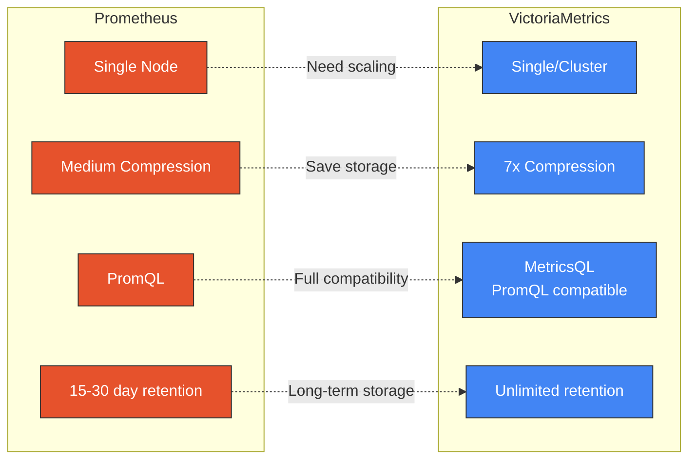
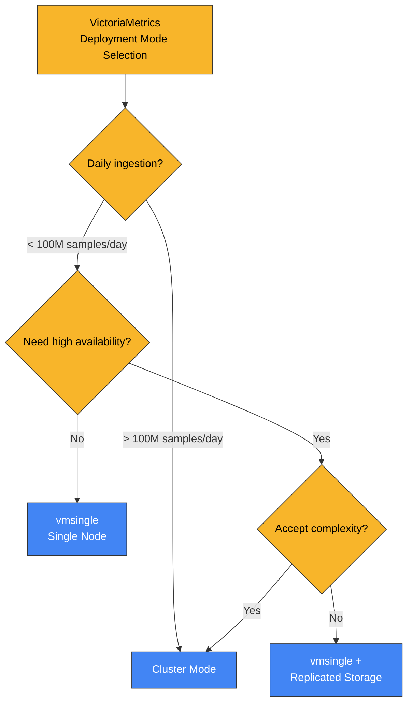
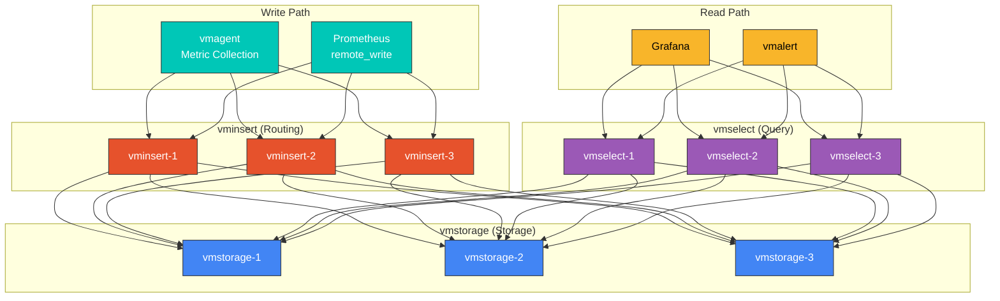

# VictoriaMetrics

> **Versiones compatibles**: VictoriaMetrics 1.x
> **Última actualización**: February 20, 2026

## Tabla de contenidos

- [Introducción](#introduction)
- [Opciones de arquitectura](#architecture-options)
- [Modo de nodo único](#single-node-mode)
- [Modo de clúster](#cluster-mode)
- [vmagent](#vmagent)
- [vmalert](#vmalert)
- [MetricsQL](#metricsql)
- [Instalación con Helm](#helm-installation)
- [Configuración de almacenamiento a largo plazo](#long-term-storage-configuration)
- [Downsampling](#downsampling)
- [Optimización del rendimiento](#performance-optimization)
- [Prácticas recomendadas](#best-practices)
- [Solución de problemas](#troubleshooting)

## Introducción

VictoriaMetrics es una base de datos de series temporales y una solución de monitoreo de alto rendimiento y rentable. Aunque es totalmente compatible con Prometheus, ofrece mejores tasas de compresión, rendimiento de consultas y escalabilidad.

### Características principales

| Característica | Descripción |
|---------|-------------|
| **Alta compresión** | Compresión de datos hasta 7 veces más eficiente que Prometheus |
| **Rendimiento rápido de consultas** | Rendimiento hasta 20 veces más rápido en consultas complejas |
| **Escalado horizontal** | Escalado ilimitado en modo de clúster |
| **Baja sobrecarga operativa** | Despliegue de un único binario y configuración mínima |
| **Compatible con Prometheus** | Compatibilidad completa con PromQL y la API de Remote Write/Read |
| **Multi-tenancy** | Entornos aislados para múltiples equipos/proyectos |
| **Almacenamiento a largo plazo** | Almacenamiento eficiente de métricas a largo plazo y downsampling |

### VictoriaMetrics frente a Prometheus



| Elemento | Prometheus | VictoriaMetrics |
|------|------------|-----------------|
| Arquitectura | Nodo único | Único/Clúster |
| Escalado horizontal | Requiere Thanos/Cortex | Compatibilidad nativa |
| Uso de disco | Referencia | ~70 % de reducción |
| Velocidad de consulta | Referencia | 2-20 veces más rápida |
| Uso de memoria | Alto | Bajo |
| Límite de cardinalidad | ~10 M de series temporales | ~100 M+ de series temporales |
| Lenguaje de consulta | PromQL | MetricsQL (superconjunto) |

## Opciones de arquitectura

VictoriaMetrics ofrece dos modos de despliegue:

### Guía de selección



## Modo de nodo único

El modo de nodo único (vmsingle) es adecuado para entornos pequeños y medianos.

### Características

- Un único binario proporciona toda la funcionalidad
- Configuración y operación sencillas
- Capaz de procesar millones de muestras por segundo
- Compatible con miles de millones de series temporales activas

### Despliegue de StatefulSet

```yaml
apiVersion: apps/v1
kind: StatefulSet
metadata:
  name: vmsingle
  namespace: monitoring
spec:
  serviceName: "vmsingle"
  replicas: 1
  selector:
    matchLabels:
      app: vmsingle
  template:
    metadata:
      labels:
        app: vmsingle
    spec:
      containers:
      - name: vmsingle
        image: victoriametrics/victoria-metrics:v1.96.0
        args:
          - "--storageDataPath=/storage"
          - "--httpListenAddr=:8428"
          - "--retentionPeriod=1y"
          - "--search.latencyOffset=30s"
          - "--search.maxUniqueTimeseries=1000000"
          - "--search.maxSamplesPerQuery=1000000000"
          # Memory optimization
          - "--memory.allowedPercent=60"
          # Compression settings
          - "--dedup.minScrapeInterval=30s"
        ports:
        - containerPort: 8428
          name: http
        resources:
          requests:
            cpu: 500m
            memory: 2Gi
          limits:
            cpu: 2000m
            memory: 8Gi
        volumeMounts:
        - name: storage
          mountPath: /storage
        livenessProbe:
          httpGet:
            path: /health
            port: 8428
          initialDelaySeconds: 30
          periodSeconds: 30
        readinessProbe:
          httpGet:
            path: /health
            port: 8428
          initialDelaySeconds: 5
          periodSeconds: 15
      securityContext:
        fsGroup: 65534
        runAsNonRoot: true
        runAsUser: 65534
  volumeClaimTemplates:
  - metadata:
      name: storage
    spec:
      accessModes: ["ReadWriteOnce"]
      storageClassName: gp3
      resources:
        requests:
          storage: 100Gi
---
apiVersion: v1
kind: Service
metadata:
  name: vmsingle
  namespace: monitoring
spec:
  selector:
    app: vmsingle
  ports:
  - port: 8428
    targetPort: 8428
    name: http
  type: ClusterIP
```

### Endpoints principales

| Endpoint | Descripción |
|----------|-------------|
| `/api/v1/write` | Prometheus Remote Write |
| `/api/v1/query` | Consulta instantánea |
| `/api/v1/query_range` | Consulta de rango |
| `/api/v1/series` | Metadatos de series |
| `/api/v1/labels` | Lista de labels |
| `/api/v1/label/{name}/values` | Lista de valores de labels |
| `/vmui` | UI integrada |
| `/metrics` | Métricas propias |

## Modo de clúster

Configuración de clúster escalable para entornos a gran escala.

### Arquitectura



### Componentes

| Componente | Función | Método de escalado |
|-----------|------|----------------|
| **vminsert** | Enrutamiento de solicitudes de escritura | Escalado horizontal (Deployment) |
| **vmstorage** | Almacenamiento de datos | Escalado horizontal (StatefulSet) |
| **vmselect** | Procesamiento de consultas | Escalado horizontal (Deployment) |

### Despliegue de vmstorage

```yaml
apiVersion: apps/v1
kind: StatefulSet
metadata:
  name: vmstorage
  namespace: monitoring
spec:
  serviceName: "vmstorage"
  replicas: 3
  selector:
    matchLabels:
      app: vmstorage
  template:
    metadata:
      labels:
        app: vmstorage
    spec:
      containers:
      - name: vmstorage
        image: victoriametrics/vmstorage:v1.96.0-cluster
        args:
          - "--storageDataPath=/storage"
          - "--httpListenAddr=:8482"
          - "--vminsertAddr=:8400"
          - "--vmselectAddr=:8401"
          - "--retentionPeriod=1y"
          - "--dedup.minScrapeInterval=30s"
        ports:
        - containerPort: 8482
          name: http
        - containerPort: 8400
          name: vminsert
        - containerPort: 8401
          name: vmselect
        resources:
          requests:
            cpu: 500m
            memory: 2Gi
          limits:
            cpu: 2000m
            memory: 8Gi
        volumeMounts:
        - name: storage
          mountPath: /storage
        livenessProbe:
          httpGet:
            path: /health
            port: 8482
          initialDelaySeconds: 30
          periodSeconds: 30
      affinity:
        podAntiAffinity:
          requiredDuringSchedulingIgnoredDuringExecution:
          - labelSelector:
              matchLabels:
                app: vmstorage
            topologyKey: kubernetes.io/hostname
  volumeClaimTemplates:
  - metadata:
      name: storage
    spec:
      accessModes: ["ReadWriteOnce"]
      storageClassName: gp3
      resources:
        requests:
          storage: 100Gi
---
apiVersion: v1
kind: Service
metadata:
  name: vmstorage
  namespace: monitoring
spec:
  selector:
    app: vmstorage
  clusterIP: None
  ports:
  - port: 8482
    name: http
  - port: 8400
    name: vminsert
  - port: 8401
    name: vmselect
```

### Despliegue de vminsert

```yaml
apiVersion: apps/v1
kind: Deployment
metadata:
  name: vminsert
  namespace: monitoring
spec:
  replicas: 3
  selector:
    matchLabels:
      app: vminsert
  template:
    metadata:
      labels:
        app: vminsert
    spec:
      containers:
      - name: vminsert
        image: victoriametrics/vminsert:v1.96.0-cluster
        args:
          - "--httpListenAddr=:8480"
          - "--storageNode=vmstorage-0.vmstorage:8400"
          - "--storageNode=vmstorage-1.vmstorage:8400"
          - "--storageNode=vmstorage-2.vmstorage:8400"
          - "--replicationFactor=2"
        ports:
        - containerPort: 8480
          name: http
        resources:
          requests:
            cpu: 200m
            memory: 256Mi
          limits:
            cpu: 1000m
            memory: 1Gi
        livenessProbe:
          httpGet:
            path: /health
            port: 8480
          initialDelaySeconds: 10
          periodSeconds: 30
---
apiVersion: v1
kind: Service
metadata:
  name: vminsert
  namespace: monitoring
spec:
  selector:
    app: vminsert
  ports:
  - port: 8480
    targetPort: 8480
    name: http
  type: ClusterIP
```

### Despliegue de vmselect

```yaml
apiVersion: apps/v1
kind: Deployment
metadata:
  name: vmselect
  namespace: monitoring
spec:
  replicas: 3
  selector:
    matchLabels:
      app: vmselect
  template:
    metadata:
      labels:
        app: vmselect
    spec:
      containers:
      - name: vmselect
        image: victoriametrics/vmselect:v1.96.0-cluster
        args:
          - "--httpListenAddr=:8481"
          - "--storageNode=vmstorage-0.vmstorage:8401"
          - "--storageNode=vmstorage-1.vmstorage:8401"
          - "--storageNode=vmstorage-2.vmstorage:8401"
          - "--search.maxUniqueTimeseries=1000000"
          - "--search.maxSamplesPerQuery=1000000000"
        ports:
        - containerPort: 8481
          name: http
        resources:
          requests:
            cpu: 200m
            memory: 512Mi
          limits:
            cpu: 1000m
            memory: 2Gi
        livenessProbe:
          httpGet:
            path: /health
            port: 8481
          initialDelaySeconds: 10
          periodSeconds: 30
---
apiVersion: v1
kind: Service
metadata:
  name: vmselect
  namespace: monitoring
spec:
  selector:
    app: vmselect
  ports:
  - port: 8481
    targetPort: 8481
    name: http
  type: ClusterIP
```

## vmagent

vmagent es un agente ligero para la recopilación y el reenvío de métricas.

### Características principales

- Compatible con la configuración de scrape de Prometheus
- Compatible con múltiples destinos de Remote Write
- Búfer y retransmisión de datos
- Bajo uso de recursos
- Reescritura y filtrado de labels

### Despliegue

```yaml
apiVersion: apps/v1
kind: Deployment
metadata:
  name: vmagent
  namespace: monitoring
spec:
  replicas: 2
  selector:
    matchLabels:
      app: vmagent
  template:
    metadata:
      labels:
        app: vmagent
    spec:
      serviceAccountName: vmagent
      containers:
      - name: vmagent
        image: victoriametrics/vmagent:v1.96.0
        args:
          - "--promscrape.config=/etc/vmagent/prometheus.yml"
          - "--remoteWrite.url=http://vminsert:8480/insert/0/prometheus/api/v1/write"
          - "--remoteWrite.tmpDataPath=/tmp/vmagent-remotewrite-data"
          - "--remoteWrite.maxDiskUsagePerURL=1GB"
          - "--promscrape.cluster.membersCount=2"
          - "--promscrape.cluster.memberNum=$(POD_INDEX)"
        env:
        - name: POD_INDEX
          valueFrom:
            fieldRef:
              fieldPath: metadata.name
        ports:
        - containerPort: 8429
          name: http
        resources:
          requests:
            cpu: 100m
            memory: 256Mi
          limits:
            cpu: 500m
            memory: 1Gi
        volumeMounts:
        - name: config
          mountPath: /etc/vmagent
        - name: tmpdata
          mountPath: /tmp/vmagent-remotewrite-data
      volumes:
      - name: config
        configMap:
          name: vmagent-config
      - name: tmpdata
        emptyDir: {}
---
apiVersion: v1
kind: ConfigMap
metadata:
  name: vmagent-config
  namespace: monitoring
data:
  prometheus.yml: |
    global:
      scrape_interval: 30s
      scrape_timeout: 10s

    scrape_configs:
      - job_name: 'kubernetes-pods'
        kubernetes_sd_configs:
          - role: pod
        relabel_configs:
          - source_labels: [__meta_kubernetes_pod_annotation_prometheus_io_scrape]
            action: keep
            regex: true
          - source_labels: [__meta_kubernetes_pod_annotation_prometheus_io_path]
            action: replace
            target_label: __metrics_path__
            regex: (.+)
          - source_labels: [__address__, __meta_kubernetes_pod_annotation_prometheus_io_port]
            action: replace
            regex: ([^:]+)(?::\d+)?;(\d+)
            replacement: $1:$2
            target_label: __address__
          - source_labels: [__meta_kubernetes_namespace]
            target_label: namespace
          - source_labels: [__meta_kubernetes_pod_name]
            target_label: pod

      - job_name: 'kubernetes-nodes'
        kubernetes_sd_configs:
          - role: node
        scheme: https
        tls_config:
          ca_file: /var/run/secrets/kubernetes.io/serviceaccount/ca.crt
          insecure_skip_verify: true
        bearer_token_file: /var/run/secrets/kubernetes.io/serviceaccount/token
        relabel_configs:
          - action: labelmap
            regex: __meta_kubernetes_node_label_(.+)
---
apiVersion: v1
kind: ServiceAccount
metadata:
  name: vmagent
  namespace: monitoring
---
apiVersion: rbac.authorization.k8s.io/v1
kind: ClusterRole
metadata:
  name: vmagent
rules:
- apiGroups: [""]
  resources: ["nodes", "nodes/proxy", "nodes/metrics", "services", "endpoints", "pods"]
  verbs: ["get", "list", "watch"]
- apiGroups: ["networking.k8s.io"]
  resources: ["ingresses"]
  verbs: ["get", "list", "watch"]
- nonResourceURLs: ["/metrics", "/metrics/cadvisor"]
  verbs: ["get"]
---
apiVersion: rbac.authorization.k8s.io/v1
kind: ClusterRoleBinding
metadata:
  name: vmagent
roleRef:
  apiGroup: rbac.authorization.k8s.io
  kind: ClusterRole
  name: vmagent
subjects:
- kind: ServiceAccount
  name: vmagent
  namespace: monitoring
```

### Sharding de vmagent

Distribuye los destinos de scrape entre instancias de vmagent en entornos a gran escala:

```yaml
args:
  - "--promscrape.cluster.membersCount=3"    # Total number of vmagents
  - "--promscrape.cluster.memberNum=0"       # Current instance number (0, 1, 2)
  - "--promscrape.cluster.replicationFactor=2"  # How many instances scrape each target
```

## vmalert

vmalert es un componente que evalúa reglas de alertas y genera alertas.

### Despliegue

```yaml
apiVersion: apps/v1
kind: Deployment
metadata:
  name: vmalert
  namespace: monitoring
spec:
  replicas: 2
  selector:
    matchLabels:
      app: vmalert
  template:
    metadata:
      labels:
        app: vmalert
    spec:
      containers:
      - name: vmalert
        image: victoriametrics/vmalert:v1.96.0
        args:
          - "--datasource.url=http://vmselect:8481/select/0/prometheus"
          - "--remoteRead.url=http://vmselect:8481/select/0/prometheus"
          - "--remoteWrite.url=http://vminsert:8480/insert/0/prometheus"
          - "--notifier.url=http://alertmanager:9093"
          - "--rule=/etc/vmalert/rules/*.yaml"
          - "--evaluationInterval=30s"
          - "--external.url=http://vmalert:8880"
          - "--external.label=cluster=production"
        ports:
        - containerPort: 8880
          name: http
        resources:
          requests:
            cpu: 100m
            memory: 128Mi
          limits:
            cpu: 500m
            memory: 512Mi
        volumeMounts:
        - name: rules
          mountPath: /etc/vmalert/rules
        livenessProbe:
          httpGet:
            path: /health
            port: 8880
          initialDelaySeconds: 10
          periodSeconds: 30
      volumes:
      - name: rules
        configMap:
          name: vmalert-rules
---
apiVersion: v1
kind: ConfigMap
metadata:
  name: vmalert-rules
  namespace: monitoring
data:
  kubernetes.yaml: |
    groups:
    - name: kubernetes
      interval: 30s
      rules:
      - alert: NodeMemoryHigh
        expr: |
          (node_memory_MemTotal_bytes - node_memory_MemAvailable_bytes)
          / node_memory_MemTotal_bytes * 100 > 90
        for: 5m
        labels:
          severity: warning
        annotations:
          summary: "High memory usage on {{ $labels.instance }}"
          description: "Memory usage is {{ printf \"%.2f\" $value }}%"

      - alert: PodCrashLooping
        expr: increase(kube_pod_container_status_restarts_total[1h]) > 5
        for: 10m
        labels:
          severity: warning
        annotations:
          summary: "Pod {{ $labels.namespace }}/{{ $labels.pod }} is crash looping"
          description: "Pod has restarted {{ $value }} times in the last hour"

    - name: recording-rules
      interval: 30s
      rules:
      - record: instance:node_cpu_utilization:rate5m
        expr: |
          100 - (avg by (instance)(irate(node_cpu_seconds_total{mode="idle"}[5m])) * 100)

      - record: instance:node_memory_utilization:ratio
        expr: |
          1 - node_memory_MemAvailable_bytes / node_memory_MemTotal_bytes
```

## MetricsQL

MetricsQL es el lenguaje de consulta de VictoriaMetrics y un superconjunto de PromQL.

### Compatibilidad con PromQL

Todas las consultas de PromQL funcionan en MetricsQL:

```promql
# Basic PromQL queries (also work in MetricsQL)
rate(http_requests_total[5m])
histogram_quantile(0.95, rate(http_request_duration_seconds_bucket[5m]))
```

### Extensiones de MetricsQL

```promql
# Range function defaults
# PromQL: range specification required
rate(http_requests_total[5m])

# MetricsQL: range can be omitted (uses default)
rate(http_requests_total)

# keep_last_value: retain last value (gap filling)
keep_last_value(up)

# default: set default value
http_requests_total default 0

# label_set: set labels
label_set(up, "env", "production")

# label_del: delete labels
label_del(up, "instance")

# label_copy: copy labels
label_copy(up, "instance", "node")

# label_move: move labels
label_move(up, "instance", "node")

# label_join: join labels
label_join(up, "dst", "-", "job", "instance")

# label_transform: transform labels (regex)
label_transform(up, "instance", "([^:]+):.*", "$1")

# union: combine multiple series
union(up{job="api"}, up{job="web"})

# lag: time difference from previous value
lag(up)

# lifetime: series lifetime
lifetime(up)

# scrape_interval: estimate scrape interval
scrape_interval(up)

# range_* functions: usable without range vector
range_avg(http_requests_total)        # Average over entire range
range_max(http_requests_total)        # Maximum over entire range
range_min(http_requests_total)        # Minimum over entire range
range_sum(http_requests_total)        # Sum over entire range
range_first(http_requests_total)      # First value
range_last(http_requests_total)       # Last value

# rollup_* functions: advanced aggregation
rollup(http_requests_total[5m])       # Returns min, max, avg
rollup_rate(http_requests_total[5m])  # Rate min, max, avg
rollup_delta(gauge_metric[5m])        # Delta min, max, avg

# Anomaly detection functions
anomaly_score(http_requests_total[1h])  # Anomaly score (0-1)

# histogram_share: ratio below specific value in histogram
histogram_share(0.1, http_request_duration_seconds_bucket)  # Ratio below 100ms
```

### Consultas útiles de MetricsQL

```promql
# Time series count (cardinality)
count(up)

# Time series count by label
count by (job)(up)

# Fill gaps in data
keep_last_value(up)

# Multiple conditions OR combined
up{job="api"} or up{job="web"}

# MetricsQL: simpler syntax
union(up{job="api"}, up{job="web"})

# Rate calculation (safe division)
rate(http_requests_total{status=~"5.."}[5m])
/ (rate(http_requests_total[5m]) > 0)

# MetricsQL: simple with default
rate(http_requests_total{status=~"5.."}[5m])
/ rate(http_requests_total[5m]) default 0

# Histogram bucket ratio
histogram_share(0.5, http_request_duration_seconds_bucket)  # Ratio below 500ms
```

## Instalación con Helm

### victoria-metrics-k8s-stack

```bash
# Add Helm repository
helm repo add vm https://victoriametrics.github.io/helm-charts/
helm repo update

# Install
helm install victoria-metrics vm/victoria-metrics-k8s-stack \
  --namespace monitoring \
  --create-namespace \
  -f values.yaml
```

### values.yaml (nodo único)

```yaml
# VictoriaMetrics Single
victoria-metrics-single:
  enabled: true
  server:
    retentionPeriod: 1y
    resources:
      requests:
        cpu: 500m
        memory: 2Gi
      limits:
        cpu: 2000m
        memory: 8Gi
    persistentVolume:
      enabled: true
      storageClassName: gp3
      size: 100Gi
    extraArgs:
      dedup.minScrapeInterval: 30s
      search.maxUniqueTimeseries: 1000000

# vmagent
vmagent:
  enabled: true
  spec:
    replicaCount: 2
    resources:
      requests:
        cpu: 100m
        memory: 256Mi
      limits:
        cpu: 500m
        memory: 1Gi
    extraArgs:
      promscrape.maxScrapeSize: 64MB
      promscrape.cluster.membersCount: "2"

# vmalert
vmalert:
  enabled: true
  spec:
    replicaCount: 2
    resources:
      requests:
        cpu: 100m
        memory: 128Mi
      limits:
        cpu: 500m
        memory: 512Mi

# Grafana
grafana:
  enabled: true
  persistence:
    enabled: true
    storageClassName: gp3
    size: 10Gi

# Alertmanager
alertmanager:
  enabled: true
  spec:
    replicaCount: 3
    storage:
      volumeClaimTemplate:
        spec:
          storageClassName: gp3
          resources:
            requests:
              storage: 10Gi

# kube-state-metrics
kube-state-metrics:
  enabled: true

# node-exporter
prometheus-node-exporter:
  enabled: true
```

### values.yaml (clúster)

```yaml
# VictoriaMetrics Cluster
victoria-metrics-cluster:
  enabled: true

  vmselect:
    replicaCount: 3
    resources:
      requests:
        cpu: 200m
        memory: 512Mi
      limits:
        cpu: 1000m
        memory: 2Gi
    extraArgs:
      search.maxUniqueTimeseries: "1000000"

  vminsert:
    replicaCount: 3
    resources:
      requests:
        cpu: 200m
        memory: 256Mi
      limits:
        cpu: 1000m
        memory: 1Gi
    extraArgs:
      replicationFactor: "2"

  vmstorage:
    replicaCount: 3
    resources:
      requests:
        cpu: 500m
        memory: 2Gi
      limits:
        cpu: 2000m
        memory: 8Gi
    persistentVolume:
      enabled: true
      storageClassName: gp3
      size: 100Gi
    extraArgs:
      retentionPeriod: "1y"
      dedup.minScrapeInterval: "30s"

# Disable single node
victoria-metrics-single:
  enabled: false
```

## Configuración de almacenamiento a largo plazo

### Configuración del período de retención

```yaml
# vmsingle
args:
  - "--retentionPeriod=1y"         # 1 year retention
  - "--retentionPeriod=365d"       # 365 days retention
  - "--retentionPeriod=8760h"      # 8760 hours retention

# Size-based retention
args:
  - "--retentionPeriod=1y"
  - "--storage.maxDiskSpace=500GB"  # Maximum disk usage
```

### Backup en almacenamiento de objetos

```yaml
# S3 backup using vmbackup
apiVersion: batch/v1
kind: CronJob
metadata:
  name: vmbackup
  namespace: monitoring
spec:
  schedule: "0 2 * * *"  # Daily at 02:00
  jobTemplate:
    spec:
      template:
        spec:
          containers:
          - name: vmbackup
            image: victoriametrics/vmbackup:v1.96.0
            args:
              - "--storageDataPath=/storage"
              - "--snapshot.createURL=http://vmsingle:8428/snapshot/create"
              - "--dst=s3://my-bucket/vmbackup"
            env:
            - name: AWS_ACCESS_KEY_ID
              valueFrom:
                secretKeyRef:
                  name: aws-credentials
                  key: access-key-id
            - name: AWS_SECRET_ACCESS_KEY
              valueFrom:
                secretKeyRef:
                  name: aws-credentials
                  key: secret-access-key
            volumeMounts:
            - name: storage
              mountPath: /storage
              readOnly: true
          volumes:
          - name: storage
            persistentVolumeClaim:
              claimName: vmsingle-storage-vmsingle-0
          restartPolicy: OnFailure
```

## Downsampling

VictoriaMetrics Enterprise es compatible con el downsampling. Para código abierto, use reglas de registro.

### Downsampling con reglas de registro

```yaml
# vmalert rules
groups:
- name: downsampling
  interval: 5m
  rules:
  # 5-minute average CPU usage
  - record: cpu_usage:5m_avg
    expr: avg_over_time(node_cpu_seconds_total[5m])

  # 1-hour average (calculated every 5 minutes)
  - record: cpu_usage:1h_avg
    expr: avg_over_time(cpu_usage:5m_avg[1h])

  # Histogram downsampling
  - record: http_request_duration:5m
    expr: |
      histogram_quantile(0.50, sum(rate(http_request_duration_seconds_bucket[5m])) by (le, service))
      or
      histogram_quantile(0.90, sum(rate(http_request_duration_seconds_bucket[5m])) by (le, service))
      or
      histogram_quantile(0.99, sum(rate(http_request_duration_seconds_bucket[5m])) by (le, service))
```

## Optimización del rendimiento

### Optimización de memoria

```yaml
args:
  # Memory usage limit (60% of available memory)
  - "--memory.allowedPercent=60"

  # Search cache size
  - "--search.maxMemoryPerQuery=512MB"

  # Index cache
  - "--storage.cacheSizeIndexDBDataBlocks=256MB"
  - "--storage.cacheSizeIndexDBIndexBlocks=128MB"
```

### Optimización de consultas

```yaml
args:
  # Maximum unique time series
  - "--search.maxUniqueTimeseries=1000000"

  # Maximum samples per query
  - "--search.maxSamplesPerQuery=1000000000"

  # Query timeout
  - "--search.maxQueryDuration=60s"

  # Maximum points per time series
  - "--search.maxPointsPerTimeseries=30000"
```

### Optimización de escritura

```yaml
args:
  # Deduplication (smaller than scrape interval)
  - "--dedup.minScrapeInterval=30s"

  # Maximum labels
  - "--maxLabelsPerTimeseries=30"

  # Maximum label value length
  - "--maxLabelValueLen=1024"
```

## Prácticas recomendadas

### Lista de verificación para producción

1. **Asignación de recursos**
   ```yaml
   resources:
     requests:
       cpu: 500m
       memory: 2Gi
     limits:
       cpu: 2000m
       memory: 8Gi
   ```

2. **Alta disponibilidad**
   - Configure `replicationFactor=2` en modo de clúster
   - Mínimo 2 réplicas de vmselect y vminsert
   - Mínimo 3 réplicas de vmstorage

3. **Monitoreo**
   ```promql
   # Monitor VictoriaMetrics self metrics
   vm_app_version{job="vmsingle"}
   vm_rows_inserted_total
   vm_slow_queries_total
   process_resident_memory_bytes{job=~"vm.*"}
   ```

4. **Backup**
   - Backups regulares con vmbackup
   - Use la funcionalidad de snapshot

### Guía de migración

Migración de Prometheus a VictoriaMetrics:

```yaml
# Step 1: Add remote_write to Prometheus
# prometheus.yml
remote_write:
  - url: http://victoriametrics:8428/api/v1/write

# Step 2: Add VictoriaMetrics data source to Grafana
# Operate both data sources in parallel for comparison

# Step 3: Migrate existing data (optional)
vmctl prometheus --prometheus.snapshot-path=/prometheus/snapshots/xxx \
  --vm-url=http://victoriametrics:8428

# Step 4: Complete transition
# Remove Prometheus remote_write, change Grafana default data source
```

## Solución de problemas

### Problemas comunes

#### 1. Uso elevado de memoria

```bash
# Check memory usage
curl http://vmsingle:8428/api/v1/status/tsdb

# Solution: Set memory limit
args:
  - "--memory.allowedPercent=60"
```

#### 2. Consultas lentas

```bash
# Check slow query log
curl http://vmsingle:8428/api/v1/status/top_queries

# Solution: Query optimization
# - Reduce time range
# - Add label filters
# - Increase step
```

#### 3. Espacio en disco lleno

```bash
# Check disk usage
curl http://vmsingle:8428/api/v1/status/tsdb | jq .

# Solutions
# - Reduce retention period
# - Delete unnecessary metrics
curl -X POST "http://vmsingle:8428/api/v1/admin/tsdb/delete_series?match[]=go_.*"
```

### Comandos de depuración

```bash
# Check status
curl http://vmsingle:8428/api/v1/status/tsdb
curl http://vmsingle:8428/api/v1/status/active_queries
curl http://vmsingle:8428/api/v1/status/top_queries

# Check metrics
curl http://vmsingle:8428/metrics

# Create snapshot
curl http://vmsingle:8428/snapshot/create

# Force merge (reclaim disk space)
curl http://vmsingle:8428/internal/force_merge
```

## Referencias

- [Documentación oficial de VictoriaMetrics](https://docs.victoriametrics.com/)
- [VictoriaMetrics GitHub](https://github.com/VictoriaMetrics/VictoriaMetrics)
- [Documentación de MetricsQL](https://docs.victoriametrics.com/MetricsQL.html)
- [Chart de victoria-metrics-k8s-stack](https://github.com/VictoriaMetrics/helm-charts)

## Cuestionario

Para comprobar su comprensión de este capítulo, pruebe el [cuestionario de VictoriaMetrics](../../quizzes/observability/metrics/02-victoriametrics-quiz.md).
