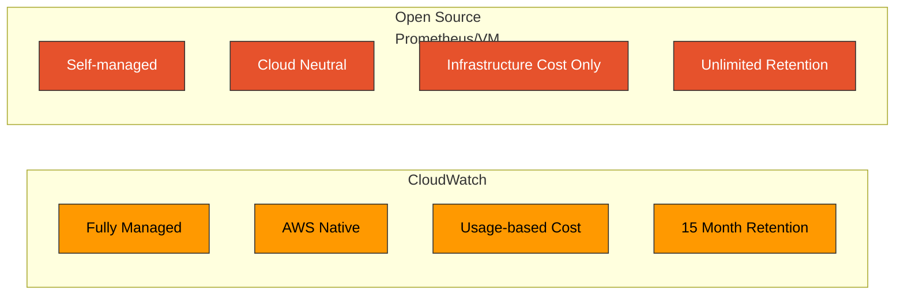
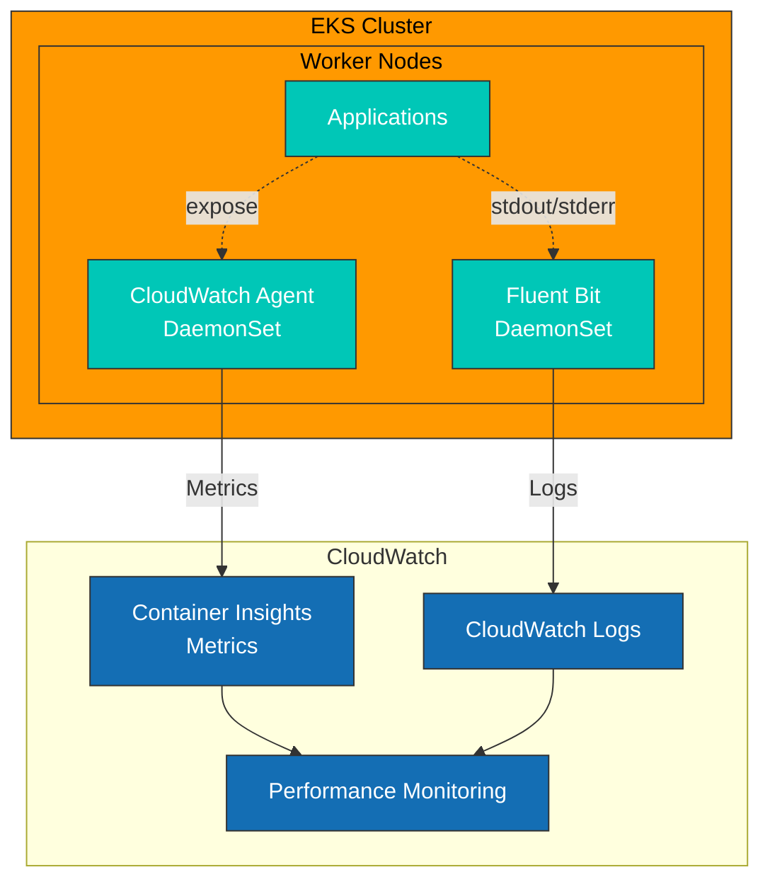
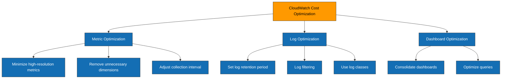

# Métricas de CloudWatch

> **Última actualización**: July 11, 2026

## Tabla de contenido

- [Introducción](#introduction)
- [Descripción general de Container Insights](#container-insights-overview)
- [Configuración de CloudWatch Agent](#cloudwatch-agent-configuration)
- [Recopilación de métricas personalizadas](#custom-metric-collection)
- [Metric Math y detección de anomalías](#metric-math-and-anomaly-detection)
- [Creación de dashboards](#dashboard-creation)
- [Configuración de alertas](#alert-configuration)
- [Optimización de costos](#cost-optimization)
- [Prácticas recomendadas](#best-practices)
- [Resolución de problemas](#troubleshooting)

## Introducción

Amazon CloudWatch es el servicio nativo de monitoreo y observabilidad de AWS. El uso de CloudWatch en entornos EKS habilita capacidades de recopilación de métricas, alertas y dashboards integradas con los servicios de AWS, sin necesidad de infraestructura de monitoreo independiente.

### Características principales

| Característica | Descripción |
|---------|-------------|
| **Totalmente administrado** | No se requiere administración de infraestructura |
| **Integración nativa de AWS** | Integración automática con EC2, EKS, RDS, etc. |
| **Container Insights** | Monitoreo a nivel de contenedor/Pod |
| **Detección de anomalías** | Detección automática de anomalías basada en ML |
| **Metric Math** | Calcula métricas con expresiones matemáticas |
| **Dashboard unificado** | Logs, métricas y trazas integrados |
| **Disponibilidad global** | Compatible con todas las regiones de AWS |

### CloudWatch frente a soluciones de código abierto



| Elemento | CloudWatch | Prometheus/VM |
|------|------------|---------------|
| Sobrecarga operativa | Ninguna | Presente |
| Modelo de costos | Basado en el uso | Basado en infraestructura |
| Escalabilidad | Automática | Configuración manual |
| Lenguaje de consulta | Metric Math | PromQL/MetricsQL |
| Multicloud | Solo AWS | Neutral respecto a la nube |
| Personalización | Limitada | Totalmente flexible |

## Descripción general de Container Insights

Container Insights es una característica de CloudWatch para monitorear cargas de trabajo en contenedores en clústeres EKS.

### Arquitectura



### Métricas recopiladas

**Nivel de clúster**:
- `cluster_node_count` - Cantidad de nodos
- `cluster_failed_node_count` - Cantidad de nodos con error
- `cluster_cpu_utilization` - Utilización de CPU
- `cluster_memory_utilization` - Utilización de memoria

**Nivel de nodo**:
- `node_cpu_utilization` - Utilización de CPU del nodo
- `node_memory_utilization` - Utilización de memoria del nodo
- `node_network_total_bytes` - Total de bytes de red
- `node_filesystem_utilization` - Utilización del sistema de archivos

**Nivel de Pod/contenedor**:
- `pod_cpu_utilization` - Utilización de CPU del Pod
- `pod_memory_utilization` - Utilización de memoria del Pod
- `pod_network_rx_bytes` - Bytes de red recibidos
- `pod_network_tx_bytes` - Bytes de red transmitidos
- `container_cpu_utilization` - Utilización de CPU del contenedor
- `container_memory_utilization` - Utilización de memoria del contenedor

### Habilitar Container Insights

```bash
# Enable as EKS add-on (recommended)
aws eks create-addon \
  --cluster-name my-cluster \
  --addon-name amazon-cloudwatch-observability \
  --addon-version v1.5.0-eksbuild.1 \
  --service-account-role-arn arn:aws:iam::123456789012:role/CloudWatchAgentRole

# Or enable with eksctl
eksctl utils update-cluster-logging \
  --cluster my-cluster \
  --enable-types all \
  --approve
```

### Container Insights basado en OpenTelemetry (vista previa)

CloudWatch está ofreciendo en vista previa un sucesor de Container Insights para EKS basado en OpenTelemetry (OTLP), anunciado el 2 de abril de 2026. Se ejecuta junto con el Container Insights clásico basado en CloudWatch Agent descrito anteriormente, por lo que puede adoptarlo de forma gradual por clúster en lugar de realizar la transición de todos a la vez.

En comparación con la recopilación clásica basada en agentes:

- **Recopilación de métricas más amplia** mediante OTLP en lugar del conjunto fijo de métricas de CloudWatch Agent
- **Filtrado de alta cardinalidad** — hasta 150 etiquetas por métrica, útil para desgloses por Pod o por namespace que el modelo clásico de dimensiones no puede expresar de forma económica
- **Compatibilidad con PromQL en CloudWatch Query Studio** — consulte directamente con PromQL las métricas recopiladas por OTel, sin implementar un espacio de trabajo independiente de Prometheus o Amazon Managed Service for Prometheus
- **Detección automática de aceleradores** — las GPU NVIDIA, EFA y los dispositivos AWS Trainium/Inferentia se detectan automáticamente, lo cual es importante para la observabilidad de cargas de trabajo de AI/ML (consulte la [ruta de lecciones de AI/ML](../../ai-ml/) para contenido relacionado sobre cargas de trabajo de GPU)

Regiones de vista previa: US East (N. Virginia), US West (Oregon), Asia Pacific (Sydney), Asia Pacific (Singapore) y Europe (Ireland).

> Referencia: [Container Insights para EKS basado en CloudWatch OTel (vista previa)](https://aws.amazon.com/about-aws/whats-new/2026/04/cloudwatch-otel-container-insights-eks/)

Para conocer la relación con el complemento EKS `amazon-cloudwatch-observability` y Application Signals, consulte [Monitoreo y logging de EKS](../../eks/06-eks-monitoring-logging.md#cloudwatch-observability-add-on-500).

### Actualización de julio de 2026: eventos de servicio de Application Signals

Service Events, anunciado el 6 de julio de 2026, captura automáticamente errores (instantáneas de excepciones), anomalías de rendimiento (instantáneas de eventos de latencia) y eventos de Deployment para cualquier aplicación con CloudWatch Application Signals habilitado. Las aplicaciones instrumentadas con los SDK de ADOT o el complemento EKS `amazon-cloudwatch-observability` obtienen esta funcionalidad sin configuración adicional una vez que Application Signals está activo, y opcionalmente puede activar métricas de llamadas de funciones para obtener una visibilidad más profunda del rendimiento. Disponible en todas las regiones comerciales de AWS; los lenguajes compatibles son Java, Python y JavaScript. ([Anuncio](https://aws.amazon.com/about-aws/whats-new/2026/06/cloudwatch-service-events/))

## Configuración de CloudWatch Agent

### Configuración de IRSA

```bash
# Create IAM policy
cat <<EOF > cloudwatch-agent-policy.json
{
    "Version": "2012-10-17",
    "Statement": [
        {
            "Effect": "Allow",
            "Action": [
                "cloudwatch:PutMetricData",
                "ec2:DescribeVolumes",
                "ec2:DescribeTags",
                "logs:PutLogEvents",
                "logs:DescribeLogStreams",
                "logs:DescribeLogGroups",
                "logs:CreateLogStream",
                "logs:CreateLogGroup"
            ],
            "Resource": "*"
        },
        {
            "Effect": "Allow",
            "Action": [
                "ssm:GetParameter"
            ],
            "Resource": "arn:aws:ssm:*:*:parameter/AmazonCloudWatch-*"
        }
    ]
}
EOF

aws iam create-policy \
  --policy-name CloudWatchAgentPolicy \
  --policy-document file://cloudwatch-agent-policy.json

# Create service account
eksctl create iamserviceaccount \
  --name cloudwatch-agent \
  --namespace amazon-cloudwatch \
  --cluster my-cluster \
  --attach-policy-arn arn:aws:iam::123456789012:policy/CloudWatchAgentPolicy \
  --approve
```

### Implementación de DaemonSet

```yaml
apiVersion: v1
kind: Namespace
metadata:
  name: amazon-cloudwatch
---
apiVersion: v1
kind: ConfigMap
metadata:
  name: cwagentconfig
  namespace: amazon-cloudwatch
data:
  cwagentconfig.json: |
    {
      "logs": {
        "metrics_collected": {
          "kubernetes": {
            "cluster_name": "my-cluster",
            "metrics_collection_interval": 60
          }
        },
        "force_flush_interval": 5
      },
      "metrics": {
        "namespace": "ContainerInsights",
        "metrics_collected": {
          "kubernetes": {
            "cluster_name": "my-cluster",
            "metrics_collection_interval": 60,
            "enhanced_container_insights": true
          }
        }
      }
    }
---
apiVersion: apps/v1
kind: DaemonSet
metadata:
  name: cloudwatch-agent
  namespace: amazon-cloudwatch
spec:
  selector:
    matchLabels:
      name: cloudwatch-agent
  template:
    metadata:
      labels:
        name: cloudwatch-agent
    spec:
      serviceAccountName: cloudwatch-agent
      containers:
      - name: cloudwatch-agent
        image: public.ecr.aws/cloudwatch-agent/cloudwatch-agent:1.300031.0b311
        resources:
          limits:
            cpu: 400m
            memory: 400Mi
          requests:
            cpu: 200m
            memory: 200Mi
        env:
        - name: HOST_IP
          valueFrom:
            fieldRef:
              fieldPath: status.hostIP
        - name: HOST_NAME
          valueFrom:
            fieldRef:
              fieldPath: spec.nodeName
        - name: K8S_NAMESPACE
          valueFrom:
            fieldRef:
              fieldPath: metadata.namespace
        - name: CI_VERSION
          value: "k8s/1.3.11"
        volumeMounts:
        - name: cwagentconfig
          mountPath: /etc/cwagentconfig
        - name: rootfs
          mountPath: /rootfs
          readOnly: true
        - name: dockersock
          mountPath: /var/run/docker.sock
          readOnly: true
        - name: varlibdocker
          mountPath: /var/lib/docker
          readOnly: true
        - name: containerdsock
          mountPath: /run/containerd/containerd.sock
          readOnly: true
        - name: sys
          mountPath: /sys
          readOnly: true
        - name: devdisk
          mountPath: /dev/disk
          readOnly: true
      volumes:
      - name: cwagentconfig
        configMap:
          name: cwagentconfig
      - name: rootfs
        hostPath:
          path: /
      - name: dockersock
        hostPath:
          path: /var/run/docker.sock
      - name: varlibdocker
        hostPath:
          path: /var/lib/docker
      - name: containerdsock
        hostPath:
          path: /run/containerd/containerd.sock
      - name: sys
        hostPath:
          path: /sys
      - name: devdisk
        hostPath:
          path: /dev/disk/
      terminationGracePeriodSeconds: 60
      tolerations:
      - operator: Exists
```

### Container Insights mejorado

Container Insights mejorado proporciona métricas adicionales y monitoreo más granular.

```yaml
# Enable in ConfigMap
cwagentconfig.json: |
  {
    "metrics": {
      "metrics_collected": {
        "kubernetes": {
          "enhanced_container_insights": true,
          "accelerated_compute_metrics": true  # GPU metrics
        }
      }
    }
  }
```

**Métricas adicionales**:
- `pod_cpu_reserved_capacity` - Capacidad de CPU reservada
- `pod_memory_reserved_capacity` - Capacidad de memoria reservada
- `node_cpu_reserved_capacity` - CPU reservada del nodo
- `node_memory_reserved_capacity` - Memoria reservada del nodo
- Métricas de GPU (al utilizar GPU NVIDIA)

## Recopilación de métricas personalizadas

### Recopilar métricas de Prometheus con CloudWatch Agent

CloudWatch Agent puede recopilar métricas en formato Prometheus y enviarlas a CloudWatch.

```yaml
apiVersion: v1
kind: ConfigMap
metadata:
  name: prometheus-cwagentconfig
  namespace: amazon-cloudwatch
data:
  cwagentconfig.json: |
    {
      "logs": {
        "metrics_collected": {
          "prometheus": {
            "cluster_name": "my-cluster",
            "log_group_name": "/aws/containerinsights/my-cluster/prometheus",
            "prometheus_config_path": "/etc/prometheusconfig/prometheus.yaml",
            "emf_processor": {
              "metric_declaration_dedup": true,
              "metric_namespace": "ContainerInsights/Prometheus",
              "metric_unit": {
                "http_requests_total": "Count",
                "http_request_duration_seconds": "Seconds"
              },
              "metric_declaration": [
                {
                  "source_labels": ["job"],
                  "label_matcher": "^my-app$",
                  "dimensions": [["ClusterName", "Namespace", "Service"]],
                  "metric_selectors": [
                    "^http_requests_total$",
                    "^http_request_duration_seconds.*$"
                  ]
                }
              ]
            }
          }
        }
      }
    }
  prometheus.yaml: |
    global:
      scrape_interval: 1m
      scrape_timeout: 10s
    scrape_configs:
      - job_name: 'my-app'
        kubernetes_sd_configs:
          - role: pod
        relabel_configs:
          - source_labels: [__meta_kubernetes_pod_annotation_prometheus_io_scrape]
            action: keep
            regex: true
          - source_labels: [__meta_kubernetes_pod_annotation_prometheus_io_path]
            action: replace
            target_label: __metrics_path__
            regex: (.+)
```

### AWS Distro for OpenTelemetry (ADOT)

ADOT puede enviar métricas de Prometheus a CloudWatch.

```yaml
apiVersion: v1
kind: ConfigMap
metadata:
  name: adot-collector-config
  namespace: amazon-cloudwatch
data:
  config.yaml: |
    receivers:
      prometheus:
        config:
          global:
            scrape_interval: 30s
          scrape_configs:
            - job_name: 'kubernetes-pods'
              kubernetes_sd_configs:
                - role: pod
              relabel_configs:
                - source_labels: [__meta_kubernetes_pod_annotation_prometheus_io_scrape]
                  action: keep
                  regex: true

    processors:
      batch:
        timeout: 60s

    exporters:
      awsemf:
        namespace: CustomMetrics
        log_group_name: '/aws/containerinsights/my-cluster/prometheus'
        dimension_rollup_option: NoDimensionRollup
        metric_declarations:
          - dimensions: [[ClusterName, Namespace, Service]]
            metric_name_selectors:
              - "^http_.*"

    service:
      pipelines:
        metrics:
          receivers: [prometheus]
          processors: [batch]
          exporters: [awsemf]
---
apiVersion: apps/v1
kind: Deployment
metadata:
  name: adot-collector
  namespace: amazon-cloudwatch
spec:
  replicas: 1
  selector:
    matchLabels:
      app: adot-collector
  template:
    metadata:
      labels:
        app: adot-collector
    spec:
      serviceAccountName: adot-collector
      containers:
      - name: adot-collector
        image: public.ecr.aws/aws-observability/aws-otel-collector:v0.35.0
        command:
          - "/awscollector"
          - "--config=/etc/config/config.yaml"
        resources:
          limits:
            cpu: 500m
            memory: 512Mi
          requests:
            cpu: 200m
            memory: 256Mi
        volumeMounts:
        - name: config
          mountPath: /etc/config
      volumes:
      - name: config
        configMap:
          name: adot-collector-config
```

### Enviar métricas personalizadas mediante SDK

```python
# Python example
import boto3
from datetime import datetime

cloudwatch = boto3.client('cloudwatch', region_name='ap-northeast-2')

def put_custom_metric(namespace, metric_name, value, dimensions, unit='Count'):
    cloudwatch.put_metric_data(
        Namespace=namespace,
        MetricData=[
            {
                'MetricName': metric_name,
                'Dimensions': dimensions,
                'Timestamp': datetime.utcnow(),
                'Value': value,
                'Unit': unit
            }
        ]
    )

# Usage example
put_custom_metric(
    namespace='MyApp/Production',
    metric_name='OrdersProcessed',
    value=150,
    dimensions=[
        {'Name': 'Service', 'Value': 'order-service'},
        {'Name': 'Environment', 'Value': 'production'}
    ]
)
```

```go
// Go example
package main

import (
    "context"
    "time"

    "github.com/aws/aws-sdk-go-v2/config"
    "github.com/aws/aws-sdk-go-v2/service/cloudwatch"
    "github.com/aws/aws-sdk-go-v2/service/cloudwatch/types"
)

func putCustomMetric(ctx context.Context, client *cloudwatch.Client) error {
    _, err := client.PutMetricData(ctx, &cloudwatch.PutMetricDataInput{
        Namespace: aws.String("MyApp/Production"),
        MetricData: []types.MetricDatum{
            {
                MetricName: aws.String("OrdersProcessed"),
                Dimensions: []types.Dimension{
                    {
                        Name:  aws.String("Service"),
                        Value: aws.String("order-service"),
                    },
                },
                Timestamp: aws.Time(time.Now()),
                Value:     aws.Float64(150),
                Unit:      types.StandardUnitCount,
            },
        },
    })
    return err
}
```

## Metric Math y detección de anomalías

### Metric Math

Metric Math permite combinar matemáticamente varias métricas.

```json
// Using Metric Math in CloudWatch dashboard widget
{
  "metrics": [
    [ { "expression": "m1/m2*100", "label": "Error Rate (%)", "id": "e1" } ],
    [ "AWS/ApplicationELB", "HTTPCode_Target_5XX_Count", "LoadBalancer", "app/my-alb/xxx", { "id": "m1", "visible": false } ],
    [ ".", "RequestCount", ".", ".", { "id": "m2", "visible": false } ]
  ],
  "view": "timeSeries",
  "stacked": false,
  "region": "ap-northeast-2",
  "period": 60
}
```

**Funciones clave de Metric Math**:

```
# Basic operations
m1 + m2                    # Addition
m1 - m2                    # Subtraction
m1 * m2                    # Multiplication
m1 / m2                    # Division

# Aggregation functions
SUM(METRICS())            # Sum of all metrics
AVG(METRICS())            # Average
MIN(METRICS())            # Minimum
MAX(METRICS())            # Maximum

# Statistical functions
STDDEV(m1)                # Standard deviation
PERCENTILE(m1, 95)        # Percentile

# Time series functions
RATE(m1)                  # Rate of change
DIFF(m1)                  # Difference from previous value
PERIOD(m1)                # Period (seconds)
FILL(m1, 0)               # Fill missing data

# Search
SEARCH('{Namespace, Dim1, Dim2} MetricName', 'Average')
```

**Ejemplos prácticos**:

```json
// CPU utilization calculation
{
  "expression": "m1 / m2 * 100",
  "label": "CPU Utilization %"
}

// Error rate calculation
{
  "expression": "100 * m1 / (m1 + m2)",
  "label": "Error Rate %"
}

// p95 latency (combined across multiple services)
{
  "expression": "PERCENTILE(METRICS(), 95)",
  "label": "p95 Latency"
}

// Moving average
{
  "expression": "AVG(METRICS()) PERIOD(300)",
  "label": "5min Moving Average"
}
```

### Detección de anomalías

CloudWatch Anomaly Detection detecta automáticamente patrones de métricas anómalos mediante ML.

```bash
# Enable anomaly detection via CLI
aws cloudwatch put-anomaly-detector \
  --namespace ContainerInsights \
  --metric-name pod_cpu_utilization \
  --stat Average \
  --dimensions Name=ClusterName,Value=my-cluster

# Create anomaly detection alarm
aws cloudwatch put-metric-alarm \
  --alarm-name "AnomalyDetection-PodCPU" \
  --comparison-operator LessThanLowerOrGreaterThanUpperThreshold \
  --evaluation-periods 2 \
  --metrics '[
    {
      "Id": "m1",
      "MetricStat": {
        "Metric": {
          "Namespace": "ContainerInsights",
          "MetricName": "pod_cpu_utilization",
          "Dimensions": [{"Name": "ClusterName", "Value": "my-cluster"}]
        },
        "Period": 300,
        "Stat": "Average"
      },
      "ReturnData": true
    },
    {
      "Id": "ad1",
      "Expression": "ANOMALY_DETECTION_BAND(m1, 2)",
      "ReturnData": true
    }
  ]' \
  --threshold-metric-id ad1 \
  --alarm-actions arn:aws:sns:ap-northeast-2:123456789012:my-alerts
```

### Detección de anomalías con Terraform

```hcl
resource "aws_cloudwatch_metric_alarm" "anomaly_detection" {
  alarm_name          = "pod-cpu-anomaly"
  comparison_operator = "LessThanLowerOrGreaterThanUpperThreshold"
  evaluation_periods  = 2
  threshold_metric_id = "ad1"

  metric_query {
    id          = "m1"
    return_data = true

    metric {
      metric_name = "pod_cpu_utilization"
      namespace   = "ContainerInsights"
      period      = 300
      stat        = "Average"

      dimensions = {
        ClusterName = "my-cluster"
      }
    }
  }

  metric_query {
    id          = "ad1"
    expression  = "ANOMALY_DETECTION_BAND(m1, 2)"
    label       = "Anomaly Detection Band"
    return_data = true
  }

  alarm_actions = [aws_sns_topic.alerts.arn]

  tags = {
    Environment = "production"
  }
}
```

## Creación de dashboards

### Crear un dashboard con CloudFormation

```yaml
AWSTemplateFormatVersion: '2010-09-09'
Description: EKS Monitoring Dashboard

Parameters:
  ClusterName:
    Type: String
    Default: my-cluster

Resources:
  EKSDashboard:
    Type: AWS::CloudWatch::Dashboard
    Properties:
      DashboardName: !Sub "${ClusterName}-monitoring"
      DashboardBody: !Sub |
        {
          "widgets": [
            {
              "type": "metric",
              "x": 0,
              "y": 0,
              "width": 12,
              "height": 6,
              "properties": {
                "title": "Cluster CPU Utilization",
                "metrics": [
                  ["ContainerInsights", "cluster_cpu_utilization", "ClusterName", "${ClusterName}"]
                ],
                "view": "timeSeries",
                "region": "${AWS::Region}",
                "period": 60,
                "stat": "Average"
              }
            },
            {
              "type": "metric",
              "x": 12,
              "y": 0,
              "width": 12,
              "height": 6,
              "properties": {
                "title": "Cluster Memory Utilization",
                "metrics": [
                  ["ContainerInsights", "cluster_memory_utilization", "ClusterName", "${ClusterName}"]
                ],
                "view": "timeSeries",
                "region": "${AWS::Region}",
                "period": 60,
                "stat": "Average"
              }
            },
            {
              "type": "metric",
              "x": 0,
              "y": 6,
              "width": 8,
              "height": 6,
              "properties": {
                "title": "Node Count",
                "metrics": [
                  ["ContainerInsights", "cluster_node_count", "ClusterName", "${ClusterName}"]
                ],
                "view": "singleValue",
                "region": "${AWS::Region}",
                "period": 60,
                "stat": "Average"
              }
            }
          ]
        }
```

### Crear un dashboard con Terraform

```hcl
resource "aws_cloudwatch_dashboard" "eks_monitoring" {
  dashboard_name = "${var.cluster_name}-monitoring"

  dashboard_body = jsonencode({
    widgets = [
      {
        type   = "metric"
        x      = 0
        y      = 0
        width  = 12
        height = 6
        properties = {
          title  = "Cluster CPU Utilization"
          region = var.region
          metrics = [
            ["ContainerInsights", "cluster_cpu_utilization", "ClusterName", var.cluster_name]
          ]
          view   = "timeSeries"
          period = 60
          stat   = "Average"
          yAxis = {
            left = {
              min = 0
              max = 100
            }
          }
        }
      },
      {
        type   = "metric"
        x      = 12
        y      = 0
        width  = 12
        height = 6
        properties = {
          title  = "Cluster Memory Utilization"
          region = var.region
          metrics = [
            ["ContainerInsights", "cluster_memory_utilization", "ClusterName", var.cluster_name]
          ]
          view   = "timeSeries"
          period = 60
          stat   = "Average"
        }
      }
    ]
  })
}
```

## Configuración de alertas

### Reglas de alerta básicas

```yaml
# CloudFormation
Resources:
  HighCPUAlarm:
    Type: AWS::CloudWatch::Alarm
    Properties:
      AlarmName: !Sub "${ClusterName}-high-cpu"
      AlarmDescription: "Cluster CPU utilization is high"
      MetricName: cluster_cpu_utilization
      Namespace: ContainerInsights
      Dimensions:
        - Name: ClusterName
          Value: !Ref ClusterName
      Statistic: Average
      Period: 300
      EvaluationPeriods: 2
      Threshold: 80
      ComparisonOperator: GreaterThanThreshold
      AlarmActions:
        - !Ref AlertSNSTopic

  HighMemoryAlarm:
    Type: AWS::CloudWatch::Alarm
    Properties:
      AlarmName: !Sub "${ClusterName}-high-memory"
      AlarmDescription: "Cluster memory utilization is high"
      MetricName: cluster_memory_utilization
      Namespace: ContainerInsights
      Dimensions:
        - Name: ClusterName
          Value: !Ref ClusterName
      Statistic: Average
      Period: 300
      EvaluationPeriods: 2
      Threshold: 85
      ComparisonOperator: GreaterThanThreshold
      AlarmActions:
        - !Ref AlertSNSTopic
```

### Configuración de alertas con Terraform

```hcl
resource "aws_cloudwatch_metric_alarm" "high_cpu" {
  alarm_name          = "${var.cluster_name}-high-cpu"
  comparison_operator = "GreaterThanThreshold"
  evaluation_periods  = 2
  metric_name         = "cluster_cpu_utilization"
  namespace           = "ContainerInsights"
  period              = 300
  statistic           = "Average"
  threshold           = 80
  alarm_description   = "Cluster CPU utilization exceeds 80%"

  dimensions = {
    ClusterName = var.cluster_name
  }

  alarm_actions = [aws_sns_topic.alerts.arn]
  ok_actions    = [aws_sns_topic.alerts.arn]

  tags = {
    Environment = var.environment
  }
}

resource "aws_cloudwatch_metric_alarm" "node_not_ready" {
  alarm_name          = "${var.cluster_name}-node-not-ready"
  comparison_operator = "GreaterThanThreshold"
  evaluation_periods  = 2
  metric_name         = "cluster_failed_node_count"
  namespace           = "ContainerInsights"
  period              = 60
  statistic           = "Maximum"
  threshold           = 0
  alarm_description   = "One or more nodes are not ready"

  dimensions = {
    ClusterName = var.cluster_name
  }

  alarm_actions = [aws_sns_topic.alerts.arn]
}
```

## Optimización de costos

### Estructura de costos de CloudWatch

| Elemento | Costo (ap-northeast-2) |
|------|----------------------|
| Métricas personalizadas | $0.30/métrica/mes (primeras 10,000) |
| API GetMetricData | $0.01/1,000 solicitudes de métricas |
| Dashboard | $3.00/dashboard/mes (los primeros 3 gratuitos) |
| Ingesta de logs | $0.76/GB |
| Almacenamiento de logs | $0.0314/GB/mes |
| Alarmas | Gratis (las primeras 10), $0.10/alarma/mes |

### Estrategias de optimización de costos



### 1. Optimización de la recopilación de métricas

```yaml
# Filtering in CloudWatch Agent configuration
cwagentconfig.json: |
  {
    "metrics": {
      "metrics_collected": {
        "kubernetes": {
          "cluster_name": "my-cluster",
          "metrics_collection_interval": 60,  # 60s instead of 30s
          "enhanced_container_insights": false  # Enable only when needed
        }
      },
      "aggregation_dimensions": [
        ["ClusterName"],
        ["ClusterName", "Namespace"]
        # Remove unnecessary dimension combinations
      ]
    }
  }
```

### 2. Política de retención de logs

```bash
# Set log group retention period
aws logs put-retention-policy \
  --log-group-name /aws/containerinsights/my-cluster/application \
  --retention-in-days 7

aws logs put-retention-policy \
  --log-group-name /aws/containerinsights/my-cluster/performance \
  --retention-in-days 30

# Clean up old log groups
for lg in $(aws logs describe-log-groups --query 'logGroups[?retentionInDays==`null`].logGroupName' --output text); do
  aws logs put-retention-policy --log-group-name "$lg" --retention-in-days 14
done
```

### 3. Usar la clase de logs de acceso poco frecuente

```bash
# Apply Infrequent Access class to new log group (50% cost savings)
aws logs create-log-group \
  --log-group-name /aws/containerinsights/my-cluster/audit \
  --log-group-class INFREQUENT_ACCESS
```

### Monitoreo de costos

```hcl
# CloudWatch cost alarm
resource "aws_cloudwatch_metric_alarm" "cw_cost_alarm" {
  alarm_name          = "cloudwatch-cost-alarm"
  comparison_operator = "GreaterThanThreshold"
  evaluation_periods  = 1
  metric_name         = "EstimatedCharges"
  namespace           = "AWS/Billing"
  period              = 86400
  statistic           = "Maximum"
  threshold           = 100  # $100
  alarm_description   = "CloudWatch estimated charges exceed $100"

  dimensions = {
    ServiceName = "AmazonCloudWatch"
    Currency    = "USD"
  }

  alarm_actions = [aws_sns_topic.billing_alerts.arn]
}
```

## Prácticas recomendadas

### 1. Estrategia de namespace

```yaml
# Custom metric namespace structure
MyCompany/Production/API        # Production API metrics
MyCompany/Staging/API           # Staging API metrics
MyCompany/Production/Workers    # Production worker metrics
```

### 2. Diseño de dimensiones

```yaml
# Recommended dimension structure
dimensions:
  - ClusterName     # Required
  - Namespace       # K8s namespace
  - Service         # Service name
  - Environment     # Environment (prod/staging/dev)

# Dimensions to avoid (high cardinality)
dimensions:
  - PodName         # Different per pod (cost increase)
  - RequestID       # Different per request (very high cost)
```

### 3. Diseño de alertas

```yaml
# Layered alerting strategy
Critical (P1):
  - Cluster down
  - 50%+ nodes failed
  - SNS -> PagerDuty

Warning (P2):
  - CPU/memory 80%+
  - Increasing pod restarts
  - SNS -> Slack

Info (P3):
  - Scaling events
  - Deployment complete
  - SNS -> Email/Logs
```

## Resolución de problemas

### Problemas comunes

#### 1. Las métricas no se muestran

```bash
# Check CloudWatch Agent logs
kubectl logs -n amazon-cloudwatch -l name=cloudwatch-agent

# Check IAM permissions
aws sts get-caller-identity
aws iam simulate-principal-policy \
  --policy-source-arn arn:aws:iam::123456789012:role/CloudWatchAgentRole \
  --action-names cloudwatch:PutMetricData

# Check metrics directly
aws cloudwatch list-metrics \
  --namespace ContainerInsights \
  --dimensions Name=ClusterName,Value=my-cluster
```

#### 2. Costos elevados

```bash
# Check metric count
aws cloudwatch list-metrics --namespace ContainerInsights | jq '.Metrics | length'

# Find high cardinality metrics
aws cloudwatch list-metrics \
  --namespace ContainerInsights \
  --query 'Metrics[*].Dimensions[*].Name' \
  --output text | sort | uniq -c | sort -rn | head -20
```

#### 3. Las alarmas no se activan

```bash
# Check alarm status
aws cloudwatch describe-alarms --alarm-names "my-alarm"

# Check alarm history
aws cloudwatch describe-alarm-history \
  --alarm-name "my-alarm" \
  --history-item-type StateUpdate

# Check SNS topic
aws sns list-subscriptions-by-topic \
  --topic-arn arn:aws:sns:ap-northeast-2:123456789012:my-alerts
```

### Comandos de depuración

```bash
# Check Container Insights status
kubectl get pods -n amazon-cloudwatch

# Check CloudWatch Agent configuration
kubectl describe configmap cwagentconfig -n amazon-cloudwatch

# Check real-time metrics
aws cloudwatch get-metric-statistics \
  --namespace ContainerInsights \
  --metric-name cluster_cpu_utilization \
  --dimensions Name=ClusterName,Value=my-cluster \
  --start-time $(date -u -d '1 hour ago' +%Y-%m-%dT%H:%M:%SZ) \
  --end-time $(date -u +%Y-%m-%dT%H:%M:%SZ) \
  --period 60 \
  --statistics Average
```

## Referencias

- [Documentación oficial de Amazon CloudWatch](https://docs.aws.amazon.com/cloudwatch/)
- [Guía de configuración de Container Insights](https://docs.aws.amazon.com/AmazonCloudWatch/latest/monitoring/Container-Insights-setup-EKS-quickstart.html)
- [Configuración de CloudWatch Agent](https://docs.aws.amazon.com/AmazonCloudWatch/latest/monitoring/CloudWatch-Agent-Configuration-File-Details.html)
- [Precios de CloudWatch](https://aws.amazon.com/cloudwatch/pricing/)

## Cuestionario

Para comprobar su comprensión de este capítulo, pruebe el [cuestionario de métricas de CloudWatch](../../quizzes/observability/metrics/04-cloudwatch-metrics-quiz.md).
