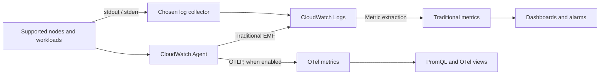

# Métricas de CloudWatch

> **Última actualización**: September 13, 2026
> Ejemplo de Helm: amazon-cloudwatch-observability 6.6.0.
> Los anuncios históricos de abril/julio a continuación conservan sus fechas reales.

## Introducción

CloudWatch administra el almacenamiento, las consultas, los dashboards y las alertas. Los equipos aún configuran
collectors, identidad de carga de trabajo, acceso de red, cardinalidad, retención y propiedad
de la respuesta. Un backend administrado no elimina estas responsabilidades operativas.

| Tema | CloudWatch | Prometheus / VictoriaMetrics autoadministrados |
| --- | --- | --- |
| Backend | Servicio administrado por AWS; la disponibilidad de características/Region varía | Operar capacidad, almacenamiento, actualizaciones y recuperación |
| Recopilación | Métricas de servicios AWS más agents/SDKs/OTLP configurados | Exporters, agents, scraping y remote write |
| Consulta | Metric Math, Metrics Insights; PromQL para métricas OTel | PromQL / MetricsQL |
| Costo | Modelo de métricas/observaciones o ingesta OTLP, logs, consultas y alertas | Cómputo/almacenamiento/red más operaciones |
| Plataformas | AWS y recopilación híbrida/multicloud compatible | Opciones de despliegue neutrales respecto a la nube |
| Retención | Depende del modelo y la resolución de las métricas; los logs tienen retención separada | Política de almacenamiento/retención configurada |

## Container Insights: elija un modelo de métricas

El add-on CloudWatch Observability para EKS y el chart de Helm configuran un Operator y
componentes de recopilación. Container Insights tradicional usa eventos de logs de rendimiento
y métricas de CloudWatch extraídas; Container Insights basado en OTel envía métricas de OpenTelemetry
y puede usar PromQL. Son modelos distintos de nomenclatura, dimensiones y facturación.

| Métrica `ContainerInsights` tradicional | Significado y conjunto de dimensiones de ejemplo |
| --- | --- |
| `cluster_node_count` | Cantidad de nodos; `ClusterName` |
| `cluster_failed_node_count` | Nodos con condiciones de fallo; `ClusterName`. No exclusivamente `NotReady` |
| `node_cpu_utilization`, `node_memory_utilization` | Utilización de nodos; `ClusterName`, o `NodeName,ClusterName,InstanceId` |
| `node_network_total_bytes` | Rendimiento de red en **bytes/second**, no un contador acumulativo de bytes |
| `namespace_number_of_running_pods` | Cantidad de Pods; `Namespace,ClusterName` |
| `pod_cpu_utilization`, `pod_memory_utilization` | Uso del Pod en relación con el límite del **nodo**; use las métricas documentadas `_over_pod_limit` para las proporciones del límite del Pod |
| `pod_number_of_container_restarts` | Reinicios totales en un Pod; `PodName,Namespace,ClusterName` |

La lista documentada no contiene `cluster_cpu_utilization` ni
`cluster_memory_utilization`. Una métrica de nodo solo con `ClusterName` no es automáticamente
un cálculo de utilización del cluster ponderado por capacidad. Use el conjunto exacto de
dimensiones publicado. Algunos campos aparecen solo en logs de rendimiento y las métricas mejoradas
tienen conjuntos adicionales como `FullPodName`; no invente nombres de métricas a partir de campos de logs.
Las métricas de recepción/transmisión de red también son tasas. Evite aplicarles `RATE()`
como si fueran contadores de bytes monotónicos.

El diagrama separa la extracción tradicional de métricas, las métricas OTLP opcionales y los logs de aplicación.



### Instalación y alcance de la plataforma

Use el add-on administrado de EKS o una instalación administrada por Helm para los mismos
componentes. Establezca la propiedad antes de cambiar; no instale ambos sin revisar.
Para el add-on administrado, determine la compatibilidad con la versión real de Kubernetes,
la arquitectura, el tipo de cómputo y la Region. Una versión de Helm no es una versión de EKS
`v…-eksbuild.…`.

```bash
# Read-only discovery. Use the intended account, Region and cluster.
export AWS_REGION=ap-northeast-2
export CLUSTER_NAME=my-cluster
K8S_VERSION=$(aws eks describe-cluster --name "$CLUSTER_NAME" \
  --region "$AWS_REGION" --query 'cluster.version' --output text)
aws eks describe-addon-versions \
  --addon-name amazon-cloudwatch-observability \
  --kubernetes-version "$K8S_VERSION" --region "$AWS_REGION" \
  --query 'addons[0].addonVersions[].{version:addonVersion,architectures:architecture,computeTypes:computeTypes,compatibilities:compatibilities}'

# Set ADDON_VERSION to the exact compatible version selected above.
: "${ADDON_VERSION:?Select a compatible EKS add-on version}"
aws eks describe-addon-configuration \
  --addon-name amazon-cloudwatch-observability \
  --addon-version "$ADDON_VERSION" --region "$AWS_REGION" \
  --query configurationSchema --output text > addon-schema.json
```

Prepare por separado los permisos IAM documentados del add-on y la identidad de carga de trabajo.
La guía del add-on recomienda EKS Pod Identity para las versiones compatibles; requiere
un Agent y una asociación para el namespace/service account reales. IRSA es una alternativa
que requiere el proveedor OIDC del cluster, la política de confianza y la anotación de la service
account. Un `aws sts get-caller-identity` local identifica solo a quien lo llama, no las
credenciales usadas dentro del collector.

El add-on admite Container Insights en nodos de trabajo Linux y Windows, con soporte para
Windows desde 1.5.0; Application Signals en EKS Windows no es compatible. Fargate no ejecuta
este DaemonSet con montajes de host; use su ruta de recopilación documentada. Compruebe Auto Mode
y clusters mixtos frente a los tipos de cómputo compatibles y los requisitos de recopilación del
add-on seleccionado. No prometa métricas de host idénticas en todas las plataformas. Las cargas
de trabajo, los collectors y los endpoints de AWS también necesitan las rutas de red y RBAC pertinentes.

El siguiente ejemplo de Helm está dirigido a **nodos de trabajo Linux EC2**. El chart 6.6.0 declara
la imagen del agent `1.300072.0b1766`; la versión pública del agent en GitHub `v1.300071.0` pertenece a
un canal de versiones distinto. El chart está fijado y conserva su imagen predeterminada.
Esta revisión renderizó el chart, no un despliegue de EKS activo.

```yaml
# cloudwatch-values.yaml: reviewed Helm chart 6.6.0, Linux EC2 example
clusterName: my-cluster
region: ap-northeast-2
containerInsights:
  enabled: true
containerLogs:
  enabled: true
applicationSignals:
  enabled: false
otelContainerInsights:
  enabled: false
  logs:
    enabled: false
```

En este chart, el agent de CloudWatch y Fluent Bit usan la service account `cloudwatch-agent`
en el namespace de la versión. Prepare su asociación de Pod Identity antes de esperar telemetría.
Para IRSA, configure y mantenga la anotación en esa service account real; el `roleArn` de nivel
superior del chart **no** es un atajo de EKS IRSA. Revise los CRD generados, ClusterRoles, Secrets,
montajes de host y selectores de nodos. El Operator crea cargas de trabajo del agent a partir de
recursos personalizados `AmazonCloudWatchAgent`; `helm template` por sí solo no ejecuta esa reconciliación.

El chart 6.6.0 también renderiza dos CR de agent específicos de Windows, seleccionados para nodos
Windows, incluso en este ejemplo de Linux. La configuración `applicationSignals.enabled: false` de Linux
no elimina esos CR de Windows. Este ejemplo supone nodos solo Linux; revise por separado la configuración
generada de Windows antes de usarla en un cluster mixto.

```bash
helm repo add aws-observability https://aws-observability.github.io/helm-charts
helm repo update aws-observability
helm template cloudwatch aws-observability/amazon-cloudwatch-observability \
  --version 6.6.0 --namespace amazon-cloudwatch \
  --include-crds --values cloudwatch-values.yaml > cloudwatch-rendered.yaml

# Installation changes the cluster; run only after reviewing ownership and prerequisites.
helm upgrade --install cloudwatch aws-observability/amazon-cloudwatch-observability \
  --version 6.6.0 --namespace amazon-cloudwatch --create-namespace \
  --values cloudwatch-values.yaml
```

`eksctl utils update-cluster-logging` configura los **logs del plano de control de EKS**. No
instala CloudWatch Agent ni habilita Container Insights.

### Migración a OTel y anuncios históricos

La guía actual de OTel Container Insights recomienda la ruta de OTel para desarrollo nuevo
y describe la ruta tradicional como modo de mantenimiento. OTel está deshabilitado de forma
predeterminada; la guía requiere el add-on 6.2.0 o posterior. Compruebe las versiones compatibles
reales del add-on y la disponibilidad de características, no solo ese mínimo.

Para el chart revisado, habilite `otelContainerInsights.enabled` después de evaluar el modelo
de métricas de OTel. Mantener `containerInsights.enabled: true` permite ambas rutas de métricas
durante la migración, con ingesta/costo adicional que se debe evaluar. El ejemplo mantiene
`otelContainerInsights.logs.enabled: false` mientras Fluent Bit recopila logs; elija deliberadamente
la propiedad de los logs en vez de duplicar la recopilación.

Las métricas OTel conservan nombres de origen como `container_cpu_usage_seconds_total` y admiten
hasta 150 labels procedentes de metadatos de origen/recurso/Kubernetes. Las métricas tradicionales
`PutMetricData` tienen un límite separado de 30 dimensiones. Los labels adicionales aumentan el
tamaño de la carga útil y pueden exponer metadatos; no son un presupuesto de cardinalidad gratuito
ni ilimitado. Las métricas de aceleradores aún requieren drivers/plugins/toolkits compatibles.

El **anuncio de vista previa del 2026-04-02** enumeró N. Virginia, Oregon, Sydney,
Singapore e Ireland. Es un registro de lanzamiento fechado, no la disponibilidad completa ni la
tabla de precios actual. El **anuncio de Service Events del 2026-07-06** describe eventos de error,
latencia y despliegue para aplicaciones activas de Application Signals, instrumentación Java/Python/JavaScript
compatible y métricas de funciones opcionales. Application Signals debe habilitarse e instrumentarse
realmente; el ejemplo anterior solo de métricas no lo habilita. Mantenga la fecha de julio aunque la URL
del anuncio contiene `/06/`.

## Configuración de CloudWatch Agent

### JSON tradicional correcto de Container Insights

El collector de Kubernetes pertenece bajo **`logs.metrics_collected.kubernetes`**.
Este fragmento muestra esa configuración de recopilación tradicional; no es un DaemonSet completo,
una política de identidad ni un reemplazo de toda la configuración generada del add-on.
JSON no permite comentarios en línea.

```json
{
  "logs": {
    "metrics_collected": {
      "kubernetes": {
        "cluster_name": "my-cluster",
        "metrics_collection_interval": 60,
        "enhanced_container_insights": true
      }
    }
  }
}
```

No coloque un segundo collector de Kubernetes bajo `metrics.metrics_collected`.
Con el chart de Helm, un `agent.config` personalizado sobrescribe los valores predeterminados generados y puede
eliminar Application Signals, trace u otra recopilación configurada. Comience con la configuración
renderizada efectiva y conserve las características que pretende mantener. Cambiar un ConfigMap que no está
montado por la carga de trabajo en ejecución no tiene efecto.

El chart/Operator proporciona service accounts, RBAC de descubrimiento, montajes de configuración
y rutas de host específicas del runtime. Un DaemonSet escrito manualmente necesita todos ellos y debe
considerar su plataforma. No copie un despliegue que solo use un socket Docker en entornos
de containerd/Fargate/Auto Mode y suponga un comportamiento equivalente. La recopilación a nivel de host
es acceso privilegiado; limite quién puede modificar su carga de trabajo y service account.

La observabilidad mejorada agrega métricas y dimensiones, pero varias métricas de capacidad reservada ya
existen en la lista tradicional. Verifique el catálogo de métricas mejoradas y el modelo de facturación en
vez de tratar cada métrica reservada/GPU como exclusiva de la modalidad mejorada. La recopilación de GPU/EFA/Neuron
también depende del hardware y software de nodo compatibles pertinentes.

## Recopilación de métricas personalizadas

### Selección de destinos y etiquetas de dimensión

Use un propietario de recopilación por destino: recopilación Prometheus de CloudWatch Agent,
ADOT/EMF o una ruta OTLP adecuada. Hacer scraping de todos los Pods desde cada réplica de DaemonSet
puede multiplicar las muestras y los cargos. Un Deployment singleton es un modelo simple de propiedad;
HA/sharding requiere una estrategia de asignación revisada.

Este ejemplo espera un **gauge** llamado `queue_depth` en `/metrics`, un puerto de container
Pod llamado `metrics`, la anotación `prometheus.io/scrape: "true"` y el label
`app.kubernetes.io/name` en el namespace `default`. El destino debe ser accesible y estar autorizado;
agregue TLS/autenticación según el endpoint real. Este fragmento de scraping HTTP supone un endpoint
interno permitido, no un servicio de métricas público.

Guarde lo siguiente como `prometheus.yaml`. Selecciona el puerto con nombre y crea los
**tres** valores de label necesarios para la declaración EMF. Una lista de dimensiones EMF
no crea labels inexistentes. Un label de Pod utilizado para `Service` es una identidad lógica de
servicio; no prueba que exista un objeto Kubernetes Service.

```yaml
global:
  scrape_interval: 30s
  scrape_timeout: 10s
scrape_configs:
- job_name: my-app
  kubernetes_sd_configs:
  - role: pod
    namespaces:
      names:
      - default
  relabel_configs:
  - source_labels:
    - __meta_kubernetes_pod_annotation_prometheus_io_scrape
    action: keep
    regex: 'true'
  - source_labels:
    - __meta_kubernetes_pod_container_port_name
    action: keep
    regex: metrics
  - source_labels:
    - __meta_kubernetes_namespace
    target_label: Namespace
  - source_labels:
    - __meta_kubernetes_pod_label_app_kubernetes_io_name
    target_label: Service
  - source_labels:
    - Service
    action: keep
    regex: .+
  - target_label: ClusterName
    replacement: my-cluster
  metric_relabel_configs:
  - source_labels:
    - __name__
    action: keep
    regex: queue_depth
```

### Configuración de Prometheus de CloudWatch Agent

Los archivos JSON del agent y YAML de Prometheus son dos archivos distintos. Monte el primero en
la ruta de entrada configurada del agent y el segundo en la ruta exacta
`/etc/prometheusconfig/prometheus.yaml` a la que se hace referencia a continuación. Esta es la configuración
para un collector con propiedad independiente, no una instalación completa ni una sobrescritura que deba
pegarse en cada DaemonSet de Container Insights.

```json
{
  "logs": {
    "metrics_collected": {
      "prometheus": {
        "cluster_name": "my-cluster",
        "log_group_name": "/aws/containerinsights/my-cluster/prometheus",
        "prometheus_config_path": "/etc/prometheusconfig/prometheus.yaml",
        "emf_processor": {
          "metric_declaration_dedup": true,
          "metric_namespace": "CustomMetrics",
          "metric_unit": {
            "queue_depth": "Count"
          },
          "metric_declaration": [
            {
              "source_labels": [
                "job"
              ],
              "label_matcher": "^my-app$",
              "dimensions": [
                [
                  "ClusterName",
                  "Namespace",
                  "Service"
                ]
              ],
              "metric_selectors": [
                "^queue_depth$"
              ]
            }
          ]
        }
      }
    }
  }
}
```

La integración tradicional oficial de Prometheus documenta soporte para gauge, counter y summary,
no la importación automática de histogramas de Prometheus. Los deltas de counter, las primeras muestras,
los resets y los campos de summary requieren su propia interpretación. Este ejemplo usa deliberadamente
un gauge: `Average`/`Maximum` describen la profundidad de la cola, mientras que sumar snapshots no cuenta
las solicitudes procesadas. Use la ruta OTel cuando corresponda y verifique por separado su asignación real
de histogram/temporality.

### AWS Distro for OpenTelemetry (ADOT)

Para la **ruta EMF**, un collector ADOT con el receiver `prometheus` y el exporter `awsemf`
puede usar el siguiente `config.yaml`. La versión ADOT revisada es `v0.50.0`; confirme su
imagen/plataforma y los componentes habilitados para su despliegue. El exporter envía eventos de log EMF,
que CloudWatch extrae como métricas tradicionales. No afirma que todas las rutas modernas de CloudWatch/OTLP
usen EMF.

```yaml
receivers:
  prometheus:
    config:
      global:
        scrape_interval: 30s
        scrape_timeout: 10s
      scrape_configs:
      - job_name: my-app
        kubernetes_sd_configs:
        - role: pod
          namespaces:
            names:
            - default
        relabel_configs:
        - source_labels:
          - __meta_kubernetes_pod_annotation_prometheus_io_scrape
          action: keep
          regex: 'true'
        - source_labels:
          - __meta_kubernetes_pod_container_port_name
          action: keep
          regex: metrics
        - source_labels:
          - __meta_kubernetes_namespace
          target_label: Namespace
        - source_labels:
          - __meta_kubernetes_pod_label_app_kubernetes_io_name
          target_label: Service
        - source_labels:
          - Service
          action: keep
          regex: .+
        - target_label: ClusterName
          replacement: my-cluster
        metric_relabel_configs:
        - source_labels:
          - __name__
          action: keep
          regex: queue_depth
processors:
  memory_limiter:
    check_interval: 1s
    limit_mib: 384
    spike_limit_mib: 64
  batch:
    timeout: 10s
exporters:
  awsemf:
    region: ap-northeast-2
    namespace: CustomMetrics
    log_group_name: /aws/containerinsights/my-cluster/prometheus
    dimension_rollup_option: NoDimensionRollup
    metric_declarations:
    - dimensions:
      - - ClusterName
        - Namespace
        - Service
      metric_name_selectors:
      - ^queue_depth$
service:
  pipelines:
    metrics:
      receivers:
      - prometheus
      processors:
      - memory_limiter
      - batch
      exporters:
      - awsemf
```

El collector debe ejecutarse con un montaje de configuración y `--config` apuntando a ese archivo,
credenciales IAM de carga de trabajo autorizadas para escribir el grupo/streams de logs EMF de clase
**Standard** previsto y límites de memoria coherentes con el limiter. También necesita RBAC de descubrimiento
de Kubernetes y acceso de red a los destinos seleccionados y AWS Logs. El siguiente Role está limitado
al único namespace descubierto; cree primero el namespace `amazon-cloudwatch` y vincule esta SA al collector real.

```yaml
apiVersion: v1
kind: ServiceAccount
metadata:
  name: metrics-scraper
  namespace: amazon-cloudwatch
---
apiVersion: rbac.authorization.k8s.io/v1
kind: Role
metadata:
  name: metrics-pod-discovery
  namespace: default
rules:
- apiGroups:
  - ''
  resources:
  - pods
  verbs:
  - get
  - list
  - watch
---
apiVersion: rbac.authorization.k8s.io/v1
kind: RoleBinding
metadata:
  name: metrics-pod-discovery
  namespace: default
roleRef:
  apiGroup: rbac.authorization.k8s.io
  kind: Role
  name: metrics-pod-discovery
subjects:
- kind: ServiceAccount
  name: metrics-scraper
  namespace: amazon-cloudwatch
```

IAM y RBAC de Kubernetes son independientes. Asocie la SA del collector a su propio rol de
Pod Identity o a un rol IRSA correctamente configurado; este manifiesto RBAC no crea ningún rol.
Cree previamente/sea propietario del grupo de logs o autorice explícitamente su creación. Cuando use
más réplicas o namespaces, revise la propiedad de los destinos y amplíe solo los permisos de descubrimiento
necesarios. Los fragmentos de configuración no se desplegaron ni se usaron para enviar métricas durante esta auditoría.

### Envío de métricas personalizadas mediante SDK

Estos son helpers reutilizables, no ejecutables independientes. El llamador crea y reutiliza un cliente
boto3/AWS SDK for Go v2 CloudWatch con la Region prevista, credenciales de carga de trabajo, timeouts
y política de reintentos. Los errores se propagan a ese llamador. No se incorporan credenciales. La marca
de tiempo de Python usa UTC con reconocimiento de zona horaria. El valor es el conteo del intervalo de
informes de la aplicación; consúltelo con `Sum` para una ventana coincidente, en vez de tratarlo como un contador
acumulativo. `PutMetricData` no tiene token de idempotencia, por lo que los reintentos ambiguos pueden duplicar
muestras; no trate el envío de telemetría como un libro mayor de negocio de exactamente una vez.

```python
from datetime import datetime, timezone


def put_orders_processed(cloudwatch, count):
    """The caller supplies a configured boto3 CloudWatch client."""
    if isinstance(count, bool) or not isinstance(count, int) or count < 0:
        raise ValueError("count must be a non-negative integer")
    return cloudwatch.put_metric_data(
        Namespace="MyApp/Production",
        MetricData=[{
            "MetricName": "OrdersProcessed",
            "Dimensions": [
                {"Name": "Service", "Value": "order-service"},
                {"Name": "Environment", "Value": "production"},
            ],
            "Timestamp": datetime.now(timezone.utc),
            "Value": count,
            "Unit": "Count",
            "StorageResolution": 60,
        }],
    )
```

```go
package metrics

import (
    "context"
    "time"

    "github.com/aws/aws-sdk-go-v2/aws"
    "github.com/aws/aws-sdk-go-v2/service/cloudwatch"
    "github.com/aws/aws-sdk-go-v2/service/cloudwatch/types"
)

func PutOrdersProcessed(ctx context.Context, client *cloudwatch.Client, count uint64) error {
    _, err := client.PutMetricData(ctx, &cloudwatch.PutMetricDataInput{
        Namespace: aws.String("MyApp/Production"),
        MetricData: []types.MetricDatum{{
            MetricName: aws.String("OrdersProcessed"),
            Dimensions: []types.Dimension{
                {Name: aws.String("Service"), Value: aws.String("order-service")},
                {Name: aws.String("Environment"), Value: aws.String("production")},
            },
            Timestamp: aws.Time(time.Now().UTC()),
            Value: aws.Float64(float64(count)),
            Unit: types.StandardUnitCount,
            StorageResolution: aws.Int32(60),
        }},
    })
    return err
}
```

Namespace, nombre de métrica y el **conjunto completo de dimensiones** identifican una métrica
tradicional. Omitir `Environment` consulta una identidad diferente; las dimensiones personalizadas no
producen automáticamente todas las series agregadas. Agrupe por lotes dentro de los límites de API documentados
y restrinja `cloudwatch:PutMetricData` al namespace previsto con la condición IAM `cloudwatch:namespace`.
## Metric Math y detección de anomalías

### Metric Math

Use el mismo período, dimensiones y unidades compatibles para series relacionadas.
Las métricas de errores de destino y solicitudes de ALB son conteos, por lo que el widget usa **Sum**.
Confirme el valor real de la dimensión del load balancer y que ambas métricas le pertenezcan.

```json
{
  "metrics": [
    [{"expression": "IF(m2>0,100*m1/m2)", "label": "Target 5xx / requests (%)", "id": "e1"}],
    ["AWS/ApplicationELB", "HTTPCode_Target_5XX_Count", "LoadBalancer", "app/replace-with-your-alb/id", {"id": "m1", "visible": false}],
    [".", "RequestCount", ".", ".", {"id": "m2", "visible": false}]
  ],
  "view": "timeSeries",
  "region": "ap-northeast-2",
  "period": 60,
  "stat": "Sum"
}
```

La aritmética de CloudWatch trata los puntos de datos faltantes como cero; la división por cero
omite el resultado. El `IF` mantiene los períodos sin tráfico fuera de esta proporción. Para el tráfico
de solicitudes sin conteo de target-5xx publicado, el numerador faltante aporta cero. Distinga ese
comportamiento documentado de métricas dispersas de una ruta de recopilación rota; la telemetría de
solicitudes faltante no debe presentarse como un resultado sano de cero errores.

| Expresión o configuración | Significado / limitación |
| --- | --- |
| `SUM(METRICS())`, `AVG(METRICS())` | Combina las series temporales de métricas del widget; no es un promedio móvil temporal |
| `AVG(m1)`, `STDDEV(m1)` | Resúmenes escalares de una serie; no pueden ser el resultado final de una serie temporal por sí solos |
| `DIFF(m1)`, `RATE(m1)` | Diferencia/tasa de puntos de datos; inspeccione la semántica de origen, la dispersión y los resets |
| `FILL(m1,0)` | Relleno explícito; puede ocultar una interrupción de telemetría si se usa sin una comprobación de frescura independiente |
| Estadística de métrica `p95` | Percentil de las muestras elegibles de la métrica seleccionada |
| `period: 300`, `stat: "Average"` | Buckets de agregación de cinco minutos; no una media móvil de cinco minutos |
| `SEARCH(...)` | Array de series de métricas coincidentes para un dashboard; no se puede usar directamente para alertas |
| `SLICE(SORT(SEARCH(...), AVG, DESC), 0, 10)` | Clasifica las series coincidentes por promedio en el rango evaluado y conserva diez |

`PERCENTILE(m1,95)` y `AVG(METRICS()) PERIOD(300)` no son Metric Math válidos.
Elija `p95` como estadística de métrica cuando sea compatible. Promediar o tomar el percentil
de valores p95 a nivel de servicio no reconstruye un p95 global de latencia de solicitudes:
esto requiere una agregación compatible de distribución/muestras en la capa de recopilación.
No mezcle la semántica de CloudWatch Metric Math con PromQL.

### Detección de anomalías

CloudWatch Anomaly Detection detecta automáticamente patrones anómalos de métricas mediante ML.

```bash
# Enable anomaly detection via CLI
aws cloudwatch put-anomaly-detector \
  --namespace ContainerInsights \
  --metric-name pod_cpu_utilization \
  --stat Average \
  --dimensions Name=ClusterName,Value=my-cluster

# Create anomaly detection alarm
aws cloudwatch put-metric-alarm \
  --alarm-name "AnomalyDetection-PodCPU" \
  --comparison-operator LessThanLowerOrGreaterThanUpperThreshold \
  --evaluation-periods 2 \
  --metrics '[
    {
      "Id": "m1",
      "MetricStat": {
        "Metric": {
          "Namespace": "ContainerInsights",
          "MetricName": "pod_cpu_utilization",
          "Dimensions": [{"Name": "ClusterName", "Value": "my-cluster"}]
        },
        "Period": 300,
        "Stat": "Average"
      },
      "ReturnData": true
    },
    {
      "Id": "ad1",
      "Expression": "ANOMALY_DETECTION_BAND(m1, 2)",
      "ReturnData": true
    }
  ]' \
  --threshold-metric-id ad1 \
  --alarm-actions arn:aws:sns:ap-northeast-2:123456789012:my-alerts
```

### Detección de anomalías con Terraform

```hcl
resource "aws_cloudwatch_metric_alarm" "anomaly_detection" {
  alarm_name          = "pod-cpu-anomaly"
  comparison_operator = "LessThanLowerOrGreaterThanUpperThreshold"
  evaluation_periods  = 2
  threshold_metric_id = "ad1"

  metric_query {
    id          = "m1"
    return_data = true

    metric {
      metric_name = "pod_cpu_utilization"
      namespace   = "ContainerInsights"
      period      = 300
      stat        = "Average"

      dimensions = {
        ClusterName = var.cluster_name
      }
    }
  }

  metric_query {
    id          = "ad1"
    expression  = "ANOMALY_DETECTION_BAND(m1, 2)"
    label       = "Anomaly Detection Band"
    return_data = true
  }

  alarm_actions = [var.alert_topic_arn]

  tags = {
    Environment = "production"
  }
}
```

## Creación de dashboards

### CloudFormation

Esta plantilla conserva vistas de CPU/memoria/conteo de nodos, conteo de Pods por namespace,
rendimiento de red y los diez Pods principales. Use el namespace/dimensiones publicados reales.
`namespace_number_of_running_pods` es un conteo de Pods; contar **containers** en ejecución no
da el mismo valor. Los snapshots de conteo usan `Average`, no `Sum` de muestras repetidas.
La métrica de red ya está en bytes/segundo. La vista de los diez principales clasifica las series
sobre el rango seleccionado; no es una alerta independiente para diez Pods.

```yaml
AWSTemplateFormatVersion: '2010-09-09'
Description: Traditional Container Insights dashboard
Parameters:
  ClusterName:
    Type: String
    MinLength: 1
  NamespaceName:
    Type: String
    Default: default
    MinLength: 1
Resources:
  Dashboard:
    Type: AWS::CloudWatch::Dashboard
    Properties:
      DashboardName:
        Fn::Sub: ${AWS::StackName}-${AWS::Region}
      DashboardBody:
        Fn::Sub: |-
          {
            "widgets": [
              {
                "type": "metric",
                "x": 0,
                "y": 0,
                "width": 8,
                "height": 6,
                "properties": {
                  "title": "Node CPU (ClusterName series)",
                  "region": "${AWS::Region}",
                  "period": 60,
                  "stat": "Average",
                  "view": "timeSeries",
                  "metrics": [
                    [
                      "ContainerInsights",
                      "node_cpu_utilization",
                      "ClusterName",
                      "${ClusterName}"
                    ]
                  ]
                }
              },
              {
                "type": "metric",
                "x": 8,
                "y": 0,
                "width": 8,
                "height": 6,
                "properties": {
                  "title": "Node memory (ClusterName series)",
                  "region": "${AWS::Region}",
                  "period": 60,
                  "stat": "Average",
                  "view": "timeSeries",
                  "metrics": [
                    [
                      "ContainerInsights",
                      "node_memory_utilization",
                      "ClusterName",
                      "${ClusterName}"
                    ]
                  ]
                }
              },
              {
                "type": "metric",
                "x": 16,
                "y": 0,
                "width": 8,
                "height": 6,
                "properties": {
                  "title": "Node count",
                  "region": "${AWS::Region}",
                  "period": 60,
                  "stat": "Average",
                  "view": "singleValue",
                  "metrics": [
                    [
                      "ContainerInsights",
                      "cluster_node_count",
                      "ClusterName",
                      "${ClusterName}"
                    ]
                  ]
                }
              },
              {
                "type": "metric",
                "x": 0,
                "y": 6,
                "width": 8,
                "height": 6,
                "properties": {
                  "title": "Running pods in namespace",
                  "region": "${AWS::Region}",
                  "period": 60,
                  "stat": "Average",
                  "view": "timeSeries",
                  "metrics": [
                    [
                      "ContainerInsights",
                      "namespace_number_of_running_pods",
                      "Namespace",
                      "${NamespaceName}",
                      "ClusterName",
                      "${ClusterName}"
                    ]
                  ]
                }
              },
              {
                "type": "metric",
                "x": 8,
                "y": 6,
                "width": 8,
                "height": 6,
                "properties": {
                  "title": "Node network (bytes/second)",
                  "region": "${AWS::Region}",
                  "period": 60,
                  "stat": "Average",
                  "view": "timeSeries",
                  "metrics": [
                    [
                      "ContainerInsights",
                      "node_network_total_bytes",
                      "ClusterName",
                      "${ClusterName}"
                    ]
                  ]
                }
              },
              {
                "type": "metric",
                "x": 16,
                "y": 6,
                "width": 8,
                "height": 6,
                "properties": {
                  "title": "Top 10 pod series by average CPU",
                  "region": "${AWS::Region}",
                  "view": "timeSeries",
                  "period": 60,
                  "metrics": [
                    [
                      {
                        "expression": "SLICE(SORT(SEARCH('{ContainerInsights,ClusterName,Namespace,PodName} MetricName=\"pod_cpu_utilization\" ClusterName=\"${ClusterName}\"', 'Average', 60), AVG, DESC), 0, 10)",
                        "id": "top10",
                        "label": "Pod CPU"
                      }
                    ]
                  ]
                }
              }
            ]
          }
```

### Terraform

Use los siguientes fragmentos HCL en un módulo raíz con un provider de AWS fijado por
sus restricciones de versión/archivo de bloqueo y configurado para la cuenta/Region previstas.
Declare estas entradas una vez para los ejemplos de anomalía, dashboard y alertas; proporcione el
ARN del topic SNS existente en vez de hacer referencia a un recurso de topic no declarado.

```hcl
variable "cluster_name" {
  type = string
}
variable "namespace_name" {
  type    = string
  default = "default"
}
variable "region" {
  type = string
}
variable "alert_topic_arn" {
  type = string
}
```
```hcl
resource "aws_cloudwatch_dashboard" "eks_monitoring" {
  dashboard_name = "${var.cluster_name}-${var.region}-metrics"
  dashboard_body = jsonencode({
  "widgets": [
    {
      "type": "metric",
      "x": 0,
      "y": 0,
      "width": 8,
      "height": 6,
      "properties": {
        "title": "Node CPU (ClusterName series)",
        "region": "${var.region}",
        "period": 60,
        "stat": "Average",
        "view": "timeSeries",
        "metrics": [
          [
            "ContainerInsights",
            "node_cpu_utilization",
            "ClusterName",
            "${var.cluster_name}"
          ]
        ]
      }
    },
    {
      "type": "metric",
      "x": 8,
      "y": 0,
      "width": 8,
      "height": 6,
      "properties": {
        "title": "Node memory (ClusterName series)",
        "region": "${var.region}",
        "period": 60,
        "stat": "Average",
        "view": "timeSeries",
        "metrics": [
          [
            "ContainerInsights",
            "node_memory_utilization",
            "ClusterName",
            "${var.cluster_name}"
          ]
        ]
      }
    },
    {
      "type": "metric",
      "x": 16,
      "y": 0,
      "width": 8,
      "height": 6,
      "properties": {
        "title": "Node count",
        "region": "${var.region}",
        "period": 60,
        "stat": "Average",
        "view": "singleValue",
        "metrics": [
          [
            "ContainerInsights",
            "cluster_node_count",
            "ClusterName",
            "${var.cluster_name}"
          ]
        ]
      }
    },
    {
      "type": "metric",
      "x": 0,
      "y": 6,
      "width": 8,
      "height": 6,
      "properties": {
        "title": "Running pods in namespace",
        "region": "${var.region}",
        "period": 60,
        "stat": "Average",
        "view": "timeSeries",
        "metrics": [
          [
            "ContainerInsights",
            "namespace_number_of_running_pods",
            "Namespace",
            "${var.namespace_name}",
            "ClusterName",
            "${var.cluster_name}"
          ]
        ]
      }
    },
    {
      "type": "metric",
      "x": 8,
      "y": 6,
      "width": 8,
      "height": 6,
      "properties": {
        "title": "Node network (bytes/second)",
        "region": "${var.region}",
        "period": 60,
        "stat": "Average",
        "view": "timeSeries",
        "metrics": [
          [
            "ContainerInsights",
            "node_network_total_bytes",
            "ClusterName",
            "${var.cluster_name}"
          ]
        ]
      }
    },
    {
      "type": "metric",
      "x": 16,
      "y": 6,
      "width": 8,
      "height": 6,
      "properties": {
        "title": "Top 10 pod series by average CPU",
        "region": "${var.region}",
        "view": "timeSeries",
        "period": 60,
        "metrics": [
          [
            {
              "expression": "SLICE(SORT(SEARCH('{ContainerInsights,ClusterName,Namespace,PodName} MetricName=\"pod_cpu_utilization\" ClusterName=\"${var.cluster_name}\"', 'Average', 60), AVG, DESC), 0, 10)",
              "id": "top10",
              "label": "Pod CPU"
            }
          ]
        ]
      }
    }
  ]
})
}
```

## Configuración de alertas

La siguiente plantilla de CloudFormation es independiente de la plantilla de dashboard;
declara sus entradas. Los umbrales son ejemplos, no criterios universales de incidentes.
Una serie de nodo solo con `ClusterName` puede ocultar un nodo activo; inspeccione las series
por nodo y la agregación que necesita. Valide la entrega de alertas y el comportamiento de datos faltantes.

```yaml
AWSTemplateFormatVersion: '2010-09-09'
Description: Example traditional metric alarms; tune thresholds
Parameters:
  ClusterName:
    Type: String
    MinLength: 1
  NamespaceName:
    Type: String
    Default: default
    MinLength: 1
  PodMetricName:
    Type: String
    Description: Exact published PodName dimension value
    MinLength: 1
  AlertTopicArn:
    Type: String
    Description: Existing authorized SNS topic with confirmed delivery
    AllowedPattern: ^arn:[^:]+:sns:[^:]+:[0-9]{12}:.+$
Resources:
  HighCPU:
    Type: AWS::CloudWatch::Alarm
    Properties:
      AlarmDescription: Node CPU ClusterName series exceeds the example threshold
      Namespace: ContainerInsights
      MetricName: node_cpu_utilization
      Dimensions:
      - Name: ClusterName
        Value:
          Ref: ClusterName
      Statistic: Average
      Period: 300
      EvaluationPeriods: 2
      DatapointsToAlarm: 2
      Threshold: 80
      ComparisonOperator: GreaterThanThreshold
      TreatMissingData: missing
      AlarmActions:
      - Ref: AlertTopicArn
  HighMemory:
    Type: AWS::CloudWatch::Alarm
    Properties:
      AlarmDescription: Node memory ClusterName series exceeds the example threshold
      Namespace: ContainerInsights
      MetricName: node_memory_utilization
      Dimensions:
      - Name: ClusterName
        Value:
          Ref: ClusterName
      Statistic: Average
      Period: 300
      EvaluationPeriods: 2
      DatapointsToAlarm: 2
      Threshold: 85
      ComparisonOperator: GreaterThanThreshold
      TreatMissingData: missing
      AlarmActions:
      - Ref: AlertTopicArn
  PodRestartTotal:
    Type: AWS::CloudWatch::Alarm
    Properties:
      AlarmDescription: Observed restart total exceeds 5; not five new restarts per
        period
      Namespace: ContainerInsights
      MetricName: pod_number_of_container_restarts
      Dimensions:
      - Name: ClusterName
        Value:
          Ref: ClusterName
      - Name: Namespace
        Value:
          Ref: NamespaceName
      - Name: PodName
        Value:
          Ref: PodMetricName
      Statistic: Maximum
      Period: 300
      EvaluationPeriods: 2
      DatapointsToAlarm: 2
      Threshold: 5
      ComparisonOperator: GreaterThanThreshold
      TreatMissingData: missing
      AlarmActions:
      - Ref: AlertTopicArn
```

La alerta de reinicios evalúa un **total**, no cinco reinicios nuevos en cinco minutos.
Use la dimensión exacta de métrica `PodName`; puede representar un nombre normalizado de carga
de trabajo en vez de un nombre completo de Pod de Kubernetes. El reemplazo de Pods y los cambios
de identidad de métricas pueden resetear/dividir observaciones. Para una alerta de reinicio reciente,
defina y valide por separado la recopilación de delta/tasa y el comportamiento de reset.

Los modelos de detección de anomalías necesitan historial adecuado y no son una prueba instantánea
de un incidente. Tanto la serie observada como la consulta `ANOMALY_DETECTION_BAND` pueden tener
`ReturnData: true` en la forma documentada de alerta de anomalía; no aplique a ciegas la regla genérica
de alerta matemática de una sola salida para eliminar la serie requerida.

### Alertas de Terraform

```hcl
resource "aws_cloudwatch_metric_alarm" "high_cpu" {
  alarm_name          = "${var.cluster_name}-node-cpu"
  comparison_operator = "GreaterThanThreshold"
  evaluation_periods  = 2
  datapoints_to_alarm  = 2
  metric_name         = "node_cpu_utilization"
  namespace           = "ContainerInsights"
  period              = 300
  statistic           = "Average"
  threshold           = 80
  treat_missing_data  = "missing"
  alarm_description   = "Node CPU ClusterName series exceeds the example threshold"
  dimensions          = { ClusterName = var.cluster_name }
  alarm_actions       = [var.alert_topic_arn]
  ok_actions          = [var.alert_topic_arn]
}

resource "aws_cloudwatch_metric_alarm" "failed_nodes" {
  alarm_name          = "${var.cluster_name}-failed-nodes"
  comparison_operator = "GreaterThanThreshold"
  evaluation_periods  = 2
  datapoints_to_alarm  = 2
  metric_name         = "cluster_failed_node_count"
  namespace           = "ContainerInsights"
  period              = 60
  statistic           = "Maximum"
  threshold           = 0
  treat_missing_data  = "missing"
  alarm_description   = "Node failure conditions; inspect the actual conditions"
  dimensions          = { ClusterName = var.cluster_name }
  alarm_actions       = [var.alert_topic_arn]
}
```

`cluster_failed_node_count` abarca condiciones de fallo de nodos, no solo NotReady.
`TreatMissingData: missing` hace que las brechas de telemetría sean visibles como datos insuficientes cuando
corresponda; por sí mismo no envía una notificación salvo que se configure esa acción.
Use una comprobación independiente del estado de recopilación y verifique las suscripciones, políticas y
entrega de SNS. Una plantilla/plan exitoso no demuestra que una métrica tenga puntos de datos.
## Optimización de costos

### Ajuste del modelo de facturación a la recopilación

| Ruta | Factores de costo que se deben verificar |
| --- | --- |
| Métricas personalizadas tradicionales / `PutMetricData` | Identidades de métrica/dimensión publicadas, uso de API, consultas y alertas |
| EKS Container Insights con observabilidad mejorada | Niveles basados en observaciones; el almacenamiento de logs de rendimiento y los logs de containers son adicionales |
| Métricas OTel | Bytes de ingesta OTLP, incluidos atributos/metadatos de recursos; cargos aplicables de consulta y centralización |
| Logs | Ingesta, almacenamiento, escaneos de consulta y características habilitadas |

No reutilice una tabla fija de precios de Seoul ni suponga que “las primeras diez métricas/1 millón de
llamadas de API son gratuitas” para todos los productos y ofertas de cuenta. Consulte los precios actuales
por Region/producto y la elegibilidad de la cuenta. Los precios de OTel no siguen el modelo tradicional
por métrica única. Más labels aún aumentan los bytes y el riesgo de divulgación. Habilitar a la vez la
recopilación tradicional y OTel puede generar costos de ambos modelos.

Las métricas personalizadas de un segundo no tienen una tasa universal de almacenamiento por métrica diez
veces mayor. Las solicitudes `PutMetricData` más frecuentes y las alertas de alta resolución pueden aumentar
los cargos. Agrupe las solicitudes compatibles, recopile solo las series necesarias y elija la resolución
según el objetivo de detección. La retención de métricas estándar consolida las muestras más antiguas;
“15 meses” no significa que cada muestra de un segundo pueda consultarse durante 15 meses.

### La retención es una decisión de eliminación de datos

Establezca la retención para un grupo de logs explícito y aprobado. Una retención más corta puede vencer
el historial existente; no es solo una preferencia de facturación futura. Nunca recorra todos los grupos
de logs de la cuenta sin retención para asignarles un período corto.

```bash
# Inspect exactly one owned log group and its current retention before changing it.
: "${AWS_REGION:?Set the intended Region}"
: "${OWNED_LOG_GROUP:?Set one approved log group name}"
aws logs describe-log-groups --region "$AWS_REGION" \
  --log-group-name-prefix "$OWNED_LOG_GROUP" \
  --query 'logGroups[].{name:logGroupName,retention:retentionInDays,class:logGroupClass}'

# Only after checking exact name, ownership and the approved retention requirement:
aws logs put-retention-policy --region "$AWS_REGION" \
  --log-group-name "$OWNED_LOG_GROUP" --retention-in-days 30
```

La consulta por prefijo puede devolver grupos adicionales. Inspeccione el nombre exacto; la escritura
usa únicamente `OWNED_LOG_GROUP`. Aplique el requisito de retención legal/incidentes de la organización
en vez de tratar este valor ilustrativo de 30 días como universal. Para operaciones repetibles,
admínistrelo en la IaC propietaria del grupo de logs.

### Infrequent Access tiene restricciones de características

Standard e Infrequent Access difieren en el precio de ingesta; los precios de almacenamiento y consultas
de Logs Insights son iguales. La clase de un grupo de logs no se puede cambiar después de crearlo.
Infrequent Access **no** admite EMF, ingesta de logs de Container Insights, filtros de métricas,
filtros de suscripción ni Live Tail. No traslade los logs de rendimiento/EMF de esta guía a esa clase
como ahorro general. Evalúela para logs forenses/de archivo elegibles, con sus características de consulta
compatibles. Un precio de ingesta inferior no implica un ahorro del 50 % en la factura total de observabilidad.

### Visibilidad de costos

Use el uso facturado y la asignación de costos para el análisis de costos. `ListMetrics` es para descubrimiento,
no una factura ni un inventario completo de series históricas; las métricas inactivas pueden no aparecer.
Contar nombres de dimensiones no mide combinaciones únicas de valores de dimensión y, por lo tanto,
no mide la cardinalidad.

Las métricas de cargos estimados `AWS/Billing` de CloudWatch requieren alertas de facturación habilitadas
y se publican en **us-east-1**. Verifique el alcance aplicable de cuenta/pagador y las dimensiones reales
de `Currency`/servicio. Se actualizan periódicamente y no son un límite de gasto. Use AWS Budgets/Cost Explorer
para el seguimiento y las alertas de costos de servicios; también se debe confirmar una suscripción SNS y
probar su entrega.

## Prácticas recomendadas

- Separe los namespaces de aplicación de los namespaces propiedad de AWS/collectors. El namespace es
  identidad de métrica, no un límite de seguridad IAM por sí mismo.
- Use dimensiones estables de servicio/entorno; evite ID de usuarios, ID de solicitudes, URL sin procesar
  u otros labels sensibles/de cardinalidad alta. Las dimensiones faltantes o renombradas cambian la identidad.
- Clasifique cada métrica como gauge, conteo por intervalo, contador acumulativo o distribución antes de
  elegir `Average`, `Sum`, percentil o tasa. Inspeccione las muestras/resets reales.
- Defina conjuntamente las ventanas de detección, el comportamiento de datos faltantes y la propiedad de
  entrega. Use SLO/impacto al cliente más el estado del recurso/recopilación, en vez de solo CPU.
- Registre el modelo de recopilación, versiones fijadas, propiedad de IAM/SA, decisiones de retención
  y costo medido. No cambie modelos ni elimine historial solo para ajustarse a un ejemplo.

## Solución de problemas

### Sin métricas o valores inesperados

Compruebe primero el **modelo seleccionado**: un nombre de origen OTel no es necesariamente un nombre
tradicional de `ContainerInsights`. Compruebe Region, namespace, conjunto completo de dimensiones,
rango de tiempo/estadística solicitados y la demora entre recopilación y visibilidad. Inspeccione el
estado/logs del collector, la configuración montada real y la selección de destino/label de scraping.
Una anotación por sí sola no garantiza que el puerto/ruta de destino sea correcto.

```bash
# Read-only checks; use the actual Region and installation owner.
aws eks describe-addon --cluster-name "$CLUSTER_NAME" \
  --addon-name amazon-cloudwatch-observability --region "$AWS_REGION" \
  --query 'addon.{version:addonVersion,status:status,health:health,config:configurationValues}'
kubectl get amazoncloudwatchagents -n amazon-cloudwatch
kubectl get pods,daemonsets,deployments,serviceaccounts -n amazon-cloudwatch

aws cloudwatch list-metrics --region "$AWS_REGION" \
  --namespace ContainerInsights --metric-name node_cpu_utilization \
  --dimensions "Name=ClusterName,Value=$CLUSTER_NAME"

: "${ALARM_NAME:?Set one alarm name}"
aws cloudwatch describe-alarms --alarm-names "$ALARM_NAME" --region "$AWS_REGION"
aws cloudwatch describe-alarm-history --alarm-name "$ALARM_NAME" \
  --history-item-type StateUpdate --region "$AWS_REGION"
```

`describe-addon` se aplica a un add-on administrado; una instalación solo de Helm no tiene un
registro de add-on correspondiente. El filtrado de `ListMetrics` coincide con métricas que contienen
las dimensiones solicitadas y puede devolver dimensiones adicionales. Inspeccione el conjunto
**completo** devuelto antes de consultar. El descubrimiento no demuestra puntos de datos recientes,
inventario histórico completo ni cardinalidad facturada actual.

Compruebe la autorización de descubrimiento de Kubernetes por separado de IAM. Revise la SA/asociación
del collector real o la confianza IRSA y el proveedor de credenciales seleccionado dentro de esa carga
de trabajo. Un comando STS local o una simulación de política IAM por sí solos no prueban la autorización
end-to-end: los SCP, las políticas de recursos, los endpoints y la identidad de runtime pueden cambiar
el resultado. No registre credenciales temporales ni tokens durante el diagnóstico.

### Costos altos o alertas inactivas

Use las categorías de uso de facturación para separar scraping duplicado, conjuntos adicionales de
dimensiones, observaciones mejoradas, carga útil OTLP, logs, escaneos y uso de alertas/consultas.
Elimine la recopilación no necesaria en su propietario; no acorte la retención de todos los grupos de
logs. Para una alerta inactiva, inspeccione sus datos de métrica reales, motivo de estado, política de
datos faltantes e historial. Después verifique la habilitación de acciones, permisos del topic SNS,
confirmación de suscripción y entrega. Una alerta que no incumple y una alerta sin telemetría utilizable
son estados diferentes.

## Alcance de la validación

Esta guía distingue las comprobaciones de configuración/estructura del comportamiento desplegado.
Durante la auditoría no se realizó ninguna instalación de EKS, búsqueda de identidad/credenciales,
envío de métricas/logs, cambio de retención, aplicación de CloudFormation/Terraform, entrega real de
alertas ni medición de precios. Los fragmentos de collector requieren los requisitos previos de runtime,
montaje, RBAC, identidad y red indicados. Valide los destinos reales y los resultados end-to-end antes
del uso operativo.

Las comprobaciones locales incluyeron el renderizado de Helm 6.6.0, el esquema JSON del agent v1.300071.0,
solicitudes de Python 3.12.13/boto3 1.42.97 bajo Stubber, sintaxis HCL y renderizado de Markdown/diagramas.
El chart conserva su imagen declarada más reciente; la comprobación de esquema no valida ese binario en
ejecución. Los campos de componentes de ADOT v0.50.0 y los tipos de API CloudWatch de Go SDK v1.72.0 se
inspeccionaron en el código fuente; no se realizó ni la ejecución del collector ni la compilación de Go.
Metric Math se comprobó frente a la referencia y casos aritméticos, sin llamar al motor de expresiones de
CloudWatch.

## Referencias

- [Instalación del add-on de EKS y Helm](https://docs.aws.amazon.com/AmazonCloudWatch/latest/monitoring/install-CloudWatch-Observability-EKS-addon.html)
- [Versión de Helm 6.6.0 revisada](https://github.com/aws-observability/helm-charts/releases/tag/amazon-cloudwatch-observability-6.6.0)
- [Métricas y dimensiones tradicionales de EKS](https://docs.aws.amazon.com/AmazonCloudWatch/latest/monitoring/Container-Insights-metrics-EKS.html)
- [Métricas mejoradas de EKS](https://docs.aws.amazon.com/AmazonCloudWatch/latest/monitoring/Container-Insights-metrics-enhanced-EKS.html)
- [OTel Container Insights](https://docs.aws.amazon.com/AmazonCloudWatch/latest/monitoring/container-insights-eks-otel.html)
- [Inicio rápido de OTel](https://docs.aws.amazon.com/AmazonCloudWatch/latest/monitoring/container-insights-eks-otel-quickstart.html)
- [Anuncio de vista previa del 2 de abril](https://aws.amazon.com/about-aws/whats-new/2026/04/cloudwatch-otel-container-insights-eks/)
- [Anuncio de Service Events del 6 de julio](https://aws.amazon.com/about-aws/whats-new/2026/06/cloudwatch-service-events/)
- [Referencia de configuración del agent](https://docs.aws.amazon.com/AmazonCloudWatch/latest/monitoring/CloudWatch-Agent-Configuration-File-Details.html)
- [Configuración de Prometheus / EMF](https://docs.aws.amazon.com/AmazonCloudWatch/latest/monitoring/ContainerInsights-Prometheus-Setup-configure.html)
- [ADOT v0.50.0](https://github.com/aws-observability/aws-otel-collector/releases/tag/v0.50.0)
- [API PutMetricData](https://docs.aws.amazon.com/AmazonCloudWatch/latest/APIReference/API_PutMetricData.html)
- [Condición IAM de namespace](https://docs.aws.amazon.com/AmazonCloudWatch/latest/monitoring/iam-cw-condition-keys-namespace.html)
- [Metric Math](https://docs.aws.amazon.com/AmazonCloudWatch/latest/monitoring/using-metric-math.html)
- [Estructura del cuerpo de dashboard](https://docs.aws.amazon.com/AmazonCloudWatch/latest/monitoring/CloudWatch-Dashboard-Body-Structure.html)
- [Capacidades de clases de logs](https://docs.aws.amazon.com/AmazonCloudWatch/latest/logs/CloudWatch_Logs_Log_Classes.html)
- [Precios de CloudWatch](https://aws.amazon.com/cloudwatch/pricing/)
- [Requisitos previos para alertas de facturación](https://docs.aws.amazon.com/AmazonCloudWatch/latest/monitoring/monitor_estimated_charges_with_cloudwatch.html)

[Cuestionario](../../quizzes/observability/metrics/04-cloudwatch-metrics-quiz.md)
